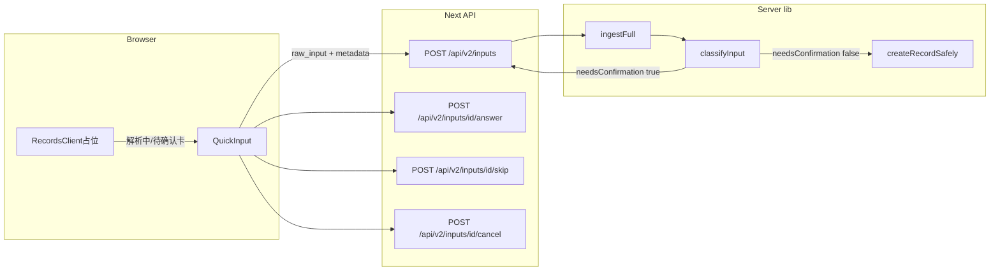

# TETO 当前录入流程总结报告

## 1. 范围说明

本报告聚焦 **[记录页](src/app/(dashboard)/records/)** 顶部的 **QuickInput** 主录入链路（TETO 1.6 **Ingest V2**）。不包含 `docs/` 设计文档，仅以仓库实现为准。

- **主路径文件**：[QuickInput.tsx](src/app/(dashboard)/records/components/QuickInput.tsx)、[RecordsClient.tsx](src/app/(dashboard)/records/RecordsClient.tsx)、[inputs/route.ts](src/app/api/v2/inputs/route.ts)、[ingest/pipeline.ts](src/lib/ingest/pipeline.ts)、[classify-input.ts](src/lib/ai/classify-input.ts)、[clarification-planner.ts](src/lib/ingest/clarification-planner.ts)、[inputs/[id]/answer/route.ts](src/app/api/v2/inputs/[id]/answer/route.ts)。
- **旁路**：编辑抽屉 [RecordEditDrawer.tsx](src/app/(dashboard)/records/components/RecordEditDrawer.tsx) 仍可能调用 `POST /api/v2/parse` 做语义解析，与 QuickInput 的 **inputs 流水线** 是不同入口；仓库内 [useAiEnhance.ts](src/app/(dashboard)/records/components/QuickInput/useAiEnhance.ts) 目前无引用，属遗留模块。

---

## 2. 总览数据流（Ingest V2）

---

## 3. 分步说明：每步做什么、会出现什么

### 步骤 A — 用户在输入框打字（提交前）

| 行为                  | 技术含义                                                                     | 用户可见                                                               |
| ------------------- | ------------------------------------------------------------------------ | ------------------------------------------------------------------ |
| 输入变化 debounce 300ms | 调用本地 [parseNaturalInput](src/lib/utils/parseNaturalInput.ts)，**不请求 LLM** | 类型可能被 `type_hint` 自动建议；**不会**自动绑定事项（需用户手动选事项）                      |
| 解析命中规则              | 填充 `parsed` 状态                                                           | **ParsedChip** 芯片：金额、时长、指标、时间、推荐事项名、心情、能量、状态、地点、关系人、日期锚点等（可点编辑/删除） |
| 可选「优化输入」            | `POST /api/v2/optimize-input`                                            | 紫按钮 Sparkles；成功则替换文本框、可能多行；绿色 **splitNotice** 条（如「已优化为 N 条…」）      |
| 展开高级区               | 本地 state                                                                 | 类型、事项、子项、标签等 **seed_fields**，会随提交写入 `metadata.seed_fields`         |

说明：芯片区下方可展开「本地清分说明」，明确标注为 **规则预览，非 AI 依据**。

---

### 步骤 B — 用户点击发送（Enter 同效）

| 检查                                            | 不通过时                                                                                                                    |
| --------------------------------------------- | ----------------------------------------------------------------------------------------------------------------------- |
| 非空                                            | 无操作                                                                                                                     |
| 拼音启发式                                         | `window.confirm` 二次确认                                                                                                   |
| **Ingest V2 开关** `resolveIngestV2ForClient()` | Toast/错误：需 `NEXT_PUBLIC_INGEST_V2=true` 或 `NEXT_PUBLIC_DEV_MODE=true`（与 [ingest-v2.ts](src/lib/ingest/ingest-v2.ts) 一致） |

**通过后立刻发生的 UI：**

1. **草稿区被清空**（`resetSubmitDraft`），避免阻塞下一次输入。
2. 每一待处理行生成 `pending:trace:idx`，父组件 **[RecordsClient](src/app/(dashboard)/records/RecordsClient.tsx)** 插入 **「解析中」占位行**（`kind: 'parsing'`），在时间轴里与真实记录混排展示。

**请求：** 对每一非空行（多行 `\n` 则多行并行）`POST /api/v2/inputs`，body 含 `raw_input`、`source: 'quick'`、`metadata.date`、`metadata.seed_fields`（类型、事项、子项、标签等）。

---

### 步骤 C — 服务端 `POST /api/v2/inputs`

| 子步骤         | 实现                                 | 说明                                                                                                |
| ----------- | ---------------------------------- | ------------------------------------------------------------------------------------------------- |
| C1 开关       | `resolveIngestV2ForServer`         | 与客户端规则对齐；未启用返回 403                                                                                |
| C2 清分       | `ingestFull` → `classifyInput`     | 内部调用 `parseSemantic`（DeepSeek），失败可走规则 fallback；再匹配事项/子项、建 `unitProposals`、收集 `ClarificationIssue` |
| C3 落库 input | `createInput` + `createInputUnits` | 写 `inputs` / `input_units`；可选写 `decision_logs`                                                    |
| C4 分支       | `classification.needsConfirmation` | 见下                                                                                                |

`**needsConfirmation === false`（可直接入库）：**

- 对每个 unit：`createRecordSafely`，更新 unit `promoted`，input `completed`。
- 响应 **201**，`pending: null`，`promoted_record_ids` 有值。
- 客户端：`onRecordCreated` + `onPendingResolved` → 占位消失、列表刷新。

`**needsConfirmation === true`（需澄清）：**

- 不创建记录（或仅处于澄清态）；input `clarifying`，有问题的 unit 为 `pending_clarify` 并带 `pending_question`（由 [clarification-planner](src/lib/ingest/clarification-planner.ts) 把 issue 转成单题：`item_id` / `sub_item_id` / `duration_minutes` / `metric:…` / `_confirm` 等）。
- 响应 **200**，`pending` 为首题 `{ unit_id, question }`，并带 `units` 供拆分预览。

**何时会 `needsConfirmation`（摘自 [classify-input.ts](src/lib/ai/classify-input.ts) 逻辑）：**

- 解析抛错且无法 fallback、或 `units` 为空 → 低置信度澄清。
- 存在 `finalIssues`：例如 **复合句**（`is_compound` 且多 unit）必须先问 `_confirm`；多锚点日期冲突；启发式「可能多事件」等。
- 其他逐条 issue（事项缺失/歧义、子项歧义、共享时长、指标追问等）在 **非复合优先确认** 场景下进入 `allIssues`（复合句时会把问题压缩为仅 `compound_uncertain` 一题先问）。

---

### 步骤 D — 客户端「渐进澄清」面板（绿色卡片）

出现条件：`POST /api/v2/inputs` 返回 `pending != null`。状态持久化在 **sessionStorage** `teto_records_ingest_clarify_v1`；多条同时需澄清时 **排队**（`ingestClarifyQueueRef`）。

| 题目类型 `question`                   | 界面元素                                              | 用户操作后的 API                                                                                              |
| --------------------------------- | ------------------------------------------------- | ------------------------------------------------------------------------------------------------------- |
| `field === '_confirm'` 且 compound | 标题「请确认是否拆分保存」+ **拆分预览**列表（类型、摘要、时间、归属 hint）+ 四个按钮 | `POST .../answer` 传 `split` / `keep_single` / `cancel` / `defer`                                        |
| 其他 `_confirm`（边界模糊等）              | 二选一按钮                                             | `confirm` / `rewrite`（rewrite 会取消 unit，见 [answer/route.ts](src/app/api/v2/inputs/[id]/answer/route.ts)） |
| `kind === 'select'`（事项/子项）        | 选项列表按钮                                            | `answer` 传选中 `value`                                                                                    |
| `number` / `text` / `datetime`    | 输入框 +「确认」                                         | `answer`                                                                                                |
| 非 `_confirm` 题                    | 「跳过此题」「取消本轮录入」                                    | `skip` / `cancel`                                                                                       |

`**defer`（暂时不确认）：**

- 关闭当前澄清卡片；**RecordsClient** 在时间轴插入 `**defer:{inputId}`** 占位（`kind: 'await_confirm'`），文案如「待确认 · 拆分」。
- 用户点击该卡 → `setResumeClarify` → QuickInput 灌回同一 `ingestClarify` 状态继续答。

`**answer` 成功且产生记录：**

- 返回 `promoted_record_ids`（复合句确认拆分时可能多条）；服务端对多条拆分记录写 `record_links` `derived_from`（子→首条）。
- 若有下一题：`next` → 面板更新为下一 `unit_id` + `question`。
- 全部完成：清空状态或处理队列中下一条。

---

### 步骤 E — 与「解析中」占位的关系

- **提交瞬间**：每行一个 `parsing` 占位。
- **无澄清且成功**：`onPendingResolved` 移除占位，`onRecordCreated` 刷新。
- **进入澄清**：该行 pending 也会 resolved，但用户注意力在顶部绿色卡片；**defer** 时新增 `await_confirm` 占位。

---

## 4. 环境开关小结

| 层级                                                   | 行为                          |
| ---------------------------------------------------- | --------------------------- |
| `INGEST_V2` / `NEXT_PUBLIC_INGEST_V2` 显式 true/false  | 最高优先级                       |
| `NODE_ENV=development` 或 `NEXT_PUBLIC_DEV_MODE=true` | 默认开启                        |
| 生产                                                   | 查 `feature_flags.ingest_v2` |

详见 [ingest-v2.ts](src/lib/ingest/ingest-v2.ts)。

---

## 5. 与「旧式」接口的关系（便于对照）

| 接口                                                           | 当前 QuickInput 是否走             |
| ------------------------------------------------------------ | ----------------------------- |
| `POST /api/v2/inputs`                                        | **是**（主录入）                    |
| `POST /api/v2/inputs/.../answer                              | skip                          |
| `POST /api/v2/parse`                                         | QuickInput **不走**；编辑抽屉等仍可能用   |
| `POST /api/v2/records`（`enhance=client` / `parsed_semantic`） | QuickInput **不走**；其他客户端直建记录可走 |

---

## 6. 可选后续（若你需要）

- 把 **RecordEditDrawer** 的「编辑时解析/纠错」单独画一张子流程图。
- 对照 `POST /api/v2/inputs/import` 的批量导入路径（若已接 UI）。

