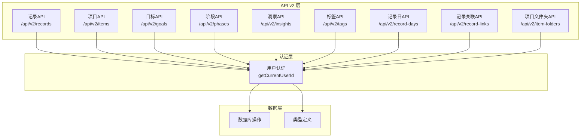
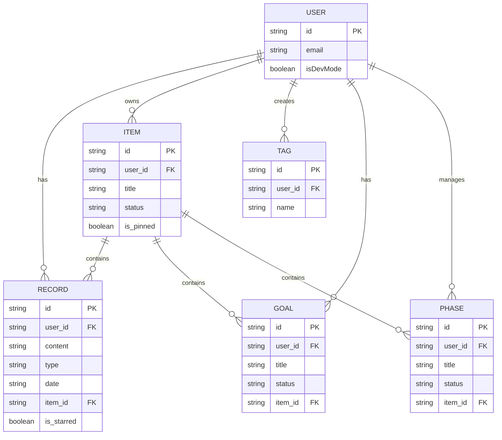
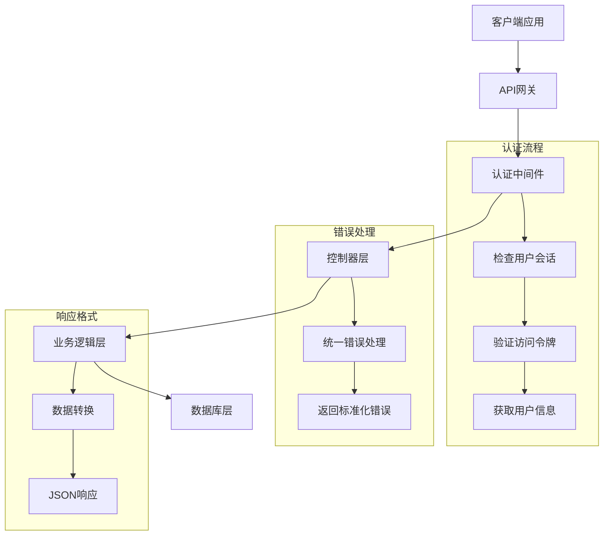
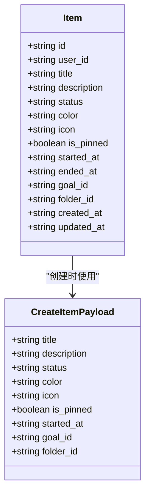
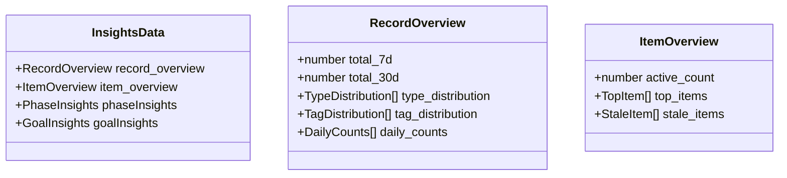
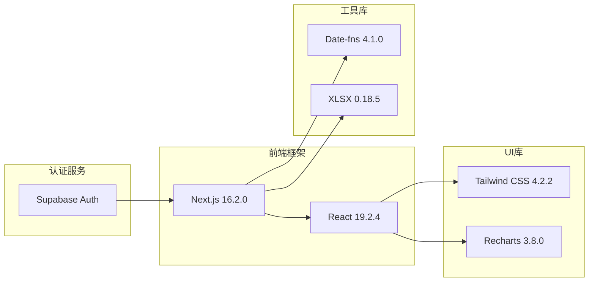
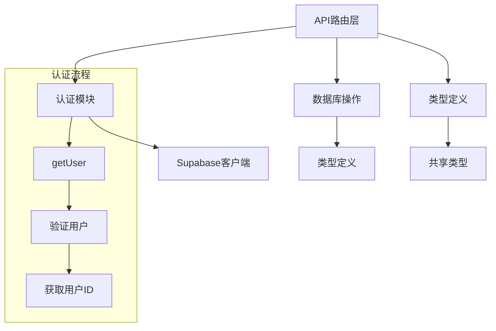
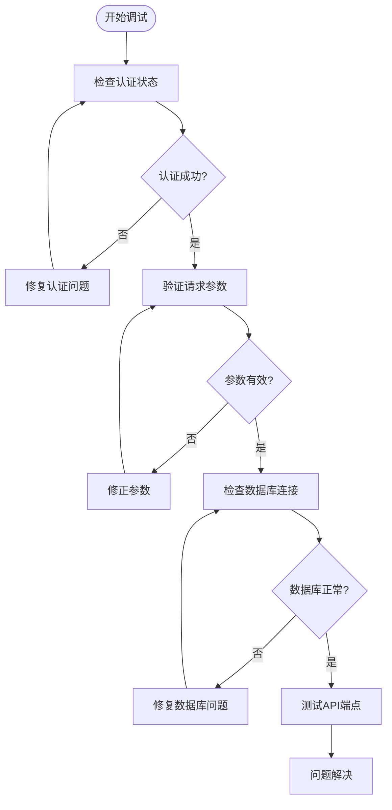

# API接口文档

<cite>
**本文档引用的文件**
- [src/app/api/v2/records/route.ts](file://src/app/api/v2/records/route.ts)
- [src/app/api/v2/items/route.ts](file://src/app/api/v2/items/route.ts)
- [src/app/api/v2/goals/route.ts](file://src/app/api/v2/goals/route.ts)
- [src/app/api/v2/phases/route.ts](file://src/app/api/v2/phases/route.ts)
- [src/app/api/v2/insights/route.ts](file://src/app/api/v2/insights/route.ts)
- [src/app/api/v2/tags/route.ts](file://src/app/api/v2/tags/route.ts)
- [src/app/api/v2/record-days/route.ts](file://src/app/api/v2/record-days/route.ts)
- [src/app/api/v2/record-links/route.ts](file://src/app/api/v2/record-links/route.ts)
- [src/app/api/v2/item-folders/route.ts](file://src/app/api/v2/item-folders/route.ts)
- [src/types/teto.ts](file://src/types/teto.ts)
- [src/lib/auth/server/get-current-user-id.ts](file://src/lib/auth/server/get-current-user-id.ts)
- [package.json](file://package.json)
</cite>

## 目录
1. [简介](#简介)
2. [项目结构](#项目结构)
3. [核心组件](#核心组件)
4. [架构概览](#架构概览)
5. [详细组件分析](#详细组件分析)
6. [依赖分析](#依赖分析)
7. [性能考虑](#性能考虑)
8. [故障排除指南](#故障排除指南)
9. [结论](#结论)
10. [附录](#附录)

## 简介

TETO是一个个人记录、日记复盘、项目跟踪和基础预测系统。本API文档详细记录了v2版本的所有RESTful API接口，包括HTTP方法、URL模式、请求参数、响应格式和错误处理机制。

本系统采用Next.js框架构建，使用Supabase作为认证和数据库服务。API遵循RESTful设计原则，提供统一的JSON响应格式，并实现了严格的用户身份验证和数据访问控制。

## 项目结构

TETO的API架构基于Next.js的App Router，采用按功能模块组织的目录结构：



**图表来源**
- [src/app/api/v2/records/route.ts:1-86](file://src/app/api/v2/records/route.ts#L1-L86)
- [src/app/api/v2/items/route.ts:1-47](file://src/app/api/v2/items/route.ts#L1-L47)
- [src/app/api/v2/goals/route.ts:1-49](file://src/app/api/v2/goals/route.ts#L1-L49)

**章节来源**
- [src/app/api/v2/records/route.ts:1-86](file://src/app/api/v2/records/route.ts#L1-L86)
- [src/app/api/v2/items/route.ts:1-47](file://src/app/api/v2/items/route.ts#L1-L47)
- [src/app/api/v2/goals/route.ts:1-49](file://src/app/api/v2/goals/route.ts#L1-L49)

## 核心组件

### 认证系统

系统使用Supabase进行用户认证，所有API端点都要求有效的用户会话。认证流程通过`getCurrentUserId()`函数实现，支持开发模式和生产模式两种运行环境。

### 数据模型

系统基于以下核心数据模型构建：



**图表来源**
- [src/types/teto.ts:37-94](file://src/types/teto.ts#L37-L94)
- [src/types/teto.ts:316-354](file://src/types/teto.ts#L316-L354)

**章节来源**
- [src/lib/auth/server/get-current-user-id.ts:1-85](file://src/lib/auth/server/get-current-user-id.ts#L1-L85)
- [src/types/teto.ts:1-516](file://src/types/teto.ts#L1-L516)

## 架构概览

TETO API采用分层架构设计，确保关注点分离和代码可维护性：



**图表来源**
- [src/lib/auth/server/get-current-user-id.ts:12-37](file://src/lib/auth/server/get-current-user-id.ts#L12-L37)
- [src/app/api/v2/records/route.ts:21-27](file://src/app/api/v2/records/route.ts#L21-L27)

## 详细组件分析

### 记录API (Records API)

记录API负责管理用户的日常记录，支持CRUD操作和高级查询功能。

#### 端点列表

**GET /api/v2/records**
- **功能**: 获取记录列表
- **认证**: 必需
- **查询参数**:
  - `date`: 指定日期的记录
  - `date_from`: 开始日期
  - `date_to`: 结束日期
  - `item_id`: 项目ID过滤
  - `type`: 记录类型过滤
  - `tag_id`: 标签ID过滤
  - `is_starred`: 是否加星标
  - `search`: 搜索关键词
  - `limit`: 结果数量限制

**POST /api/v2/records**
- **功能**: 创建新记录
- **认证**: 必需
- **请求体字段**:
  - `content` (必需): 记录内容
  - `date` (必需): 发生日期
  - `type`: 记录类型
  - `occurred_at`: 实际发生时间
  - `status`: 状态
  - `mood`: 心情
  - `energy`: 能量水平
  - `result`: 结果
  - `note`: 备注
  - `item_id`: 关联项目ID
  - `phase_id`: 关联阶段ID
  - `goal_id`: 关联目标ID
  - `sort_order`: 排序权重
  - `is_starred`: 是否加星标
  - `cost`: 成本
  - `metric_value`: 指标数值
  - `metric_unit`: 指标单位
  - `metric_name`: 指标名称
  - `duration_minutes`: 持续时间(分钟)
  - `raw_input`: 原始输入
  - `parsed_semantic`: 语义解析结果
  - `time_anchor_date`: 时间锚点
  - `linked_record_id`: 关联记录ID
  - `location`: 地点
  - `people`: 人员列表
  - `batch_id`: 批次ID
  - `lifecycle_status`: 生命周期状态
  - `tag_ids`: 标签ID数组

#### 错误处理

| HTTP状态码 | 错误原因 | 响应体 |
|------------|----------|--------|
| 400 | 参数验证失败 | `{ error: "错误消息" }` |
| 401 | 未认证或认证失败 | `{ error: "请先登录" 或 "获取用户信息失败" }` |
| 404 | 资源不存在 | `{ error: "事项不存在或不属于当前用户" }` |
| 500 | 服务器内部错误 | `{ error: "服务器错误" }` |

#### 请求/响应示例

**获取记录列表请求**:
```
GET /api/v2/records?date_from=2024-01-01&date_to=2024-01-31&limit=50
Authorization: Bearer <token>
```

**创建记录响应**:
```json
{
  "data": {
    "id": "string",
    "user_id": "string",
    "content": "string",
    "date": "string",
    "type": "string",
    "created_at": "string",
    "updated_at": "string"
  }
}
```

**章节来源**
- [src/app/api/v2/records/route.ts:1-86](file://src/app/api/v2/records/route.ts#L1-L86)
- [src/types/teto.ts:133-162](file://src/types/teto.ts#L133-L162)

### 项目API (Items API)

项目API管理用户的工作项目和任务。

#### 端点列表

**GET /api/v2/items**
- **功能**: 获取项目列表
- **认证**: 必需
- **查询参数**:
  - `status`: 项目状态过滤
  - `is_pinned`: 是否置顶过滤

**POST /api/v2/items**
- **功能**: 创建新项目
- **认证**: 必需
- **请求体字段**:
  - `title` (必需): 项目标题
  - `description`: 描述
  - `status`: 状态
  - `color`: 颜色
  - `icon`: 图标
  - `is_pinned`: 是否置顶
  - `started_at`: 开始时间
  - `folder_id`: 文件夹ID

#### 数据模型



**图表来源**
- [src/types/teto.ts:76-94](file://src/types/teto.ts#L76-L94)
- [src/types/teto.ts:194-204](file://src/types/teto.ts#L194-L204)

**章节来源**
- [src/app/api/v2/items/route.ts:1-47](file://src/app/api/v2/items/route.ts#L1-L47)
- [src/types/teto.ts:76-94](file://src/types/teto.ts#L76-L94)

### 目标API (Goals API)

目标API管理用户设定的目标和里程碑。

#### 端点列表

**GET /api/v2/goals**
- **功能**: 获取目标列表
- **认证**: 必需
- **查询参数**:
  - `status`: 目标状态
  - `item_id`: 项目ID
  - `phase_id`: 阶段ID

**POST /api/v2/goals**
- **功能**: 创建新目标
- **认证**: 必需
- **请求体字段**:
  - `title` (必需): 目标标题
  - `description`: 描述
  - `status`: 状态
  - `item_id`: 关联项目ID
  - `phase_id`: 关联阶段ID
  - `measure_type`: 测量类型
  - `target_value`: 目标值
  - `current_value`: 当前值
  - `metric_name`: 指标名称
  - `unit`: 单位
  - `daily_target`: 日目标
  - `start_date`: 开始日期
  - `deadline_date`: 截止日期

#### 目标状态

系统支持以下目标状态：
- 进行中
- 已达成  
- 已放弃
- 已暂停

**章节来源**
- [src/app/api/v2/goals/route.ts:1-49](file://src/app/api/v2/goals/route.ts#L1-L49)
- [src/types/teto.ts:316-335](file://src/types/teto.ts#L316-L335)

### 阶段API (Phases API)

阶段API管理项目的时间阶段和生命周期。

#### 端点列表

**GET /api/v2/phases**
- **功能**: 获取阶段列表
- **认证**: 必需
- **查询参数**:
  - `item_id`: 项目ID
  - `status`: 阶段状态
  - `is_historical`: 是否历史阶段

**POST /api/v2/phases**
- **功能**: 创建新阶段
- **认证**: 必需
- **请求体字段**:
  - `item_id` (必需): 项目ID
  - `title` (必需): 阶段标题
  - `description`: 描述
  - `start_date`: 开始日期
  - `end_date`: 结束日期
  - `status`: 状态
  - `is_historical`: 是否历史阶段
  - `sort_order`: 排序

#### 阶段状态

系统支持以下阶段状态：
- 进行中
- 已结束
- 停滞

**章节来源**
- [src/app/api/v2/phases/route.ts:1-72](file://src/app/api/v2/phases/route.ts#L1-L72)
- [src/types/teto.ts:338-354](file://src/types/teto.ts#L338-L354)

### 洞察API (Insights API)

洞察API提供数据分析和统计信息。

#### 端点列表

**GET /api/v2/insights**
- **功能**: 获取洞察数据
- **认证**: 必需
- **查询参数**:
  - `date_from` (必需): 开始日期
  - `date_to` (必需): 结束日期

#### 响应数据结构



**图表来源**
- [src/types/teto.ts:276-299](file://src/types/teto.ts#L276-L299)

**章节来源**
- [src/app/api/v2/insights/route.ts:1-32](file://src/app/api/v2/insights/route.ts#L1-L32)
- [src/types/teto.ts:276-299](file://src/types/teto.ts#L276-L299)

### 标签API (Tags API)

标签API管理记录分类标签。

#### 端点列表

**GET /api/v2/tags**
- **功能**: 获取标签列表
- **认证**: 必需

**POST /api/v2/tags**
- **功能**: 创建新标签
- **认证**: 必需
- **请求体字段**:
  - `name` (必需): 标签名称
  - `color`: 颜色
  - `type`: 类型

**章节来源**
- [src/app/api/v2/tags/route.ts:1-39](file://src/app/api/v2/tags/route.ts#L1-L39)
- [src/types/teto.ts:96-103](file://src/types/teto.ts#L96-L103)

### 记录日API (Record Days API)

记录日API管理每日摘要和统计。

#### 端点列表

**GET /api/v2/record-days**
- **功能**: 获取记录日列表或指定日期的记录日
- **认证**: 必需
- **查询参数**:
  - `date`: 指定日期

**POST /api/v2/record-days**
- **功能**: 创建或更新记录日
- **认证**: 必需
- **请求体字段**:
  - `date` (必需): 日期
  - `summary`: 摘要内容

**章节来源**
- [src/app/api/v2/record-days/route.ts:1-63](file://src/app/api/v2/record-days/route.ts#L1-L63)
- [src/types/teto.ts:28-35](file://src/types/teto.ts#L28-L35)

### 记录关联API (Record Links API)

记录关联API管理记录间的微关联关系。

#### 端点列表

**POST /api/v2/record-links**
- **功能**: 创建记录关联
- **认证**: 必需
- **请求体字段**:
  - `source_id` (必需): 源记录ID
  - `target_id` (必需): 目标记录ID
  - `link_type` (必需): 关联类型

**GET /api/v2/record-links**
- **功能**: 获取记录关联列表
- **认证**: 必需
- **查询参数**:
  - `record_id` (必需): 记录ID

**DELETE /api/v2/record-links**
- **功能**: 删除记录关联
- **认证**: 必需
- **查询参数**:
  - `id` (必需): 关联ID

#### 支持的关联类型

- completes: 完成关系
- derived_from: 派生关系  
- postponed_from: 延期关系
- related_to: 相关关系

**章节来源**
- [src/app/api/v2/record-links/route.ts:1-100](file://src/app/api/v2/record-links/route.ts#L1-L100)
- [src/types/teto.ts:114-127](file://src/types/teto.ts#L114-L127)

### 项目文件夹API (Item Folders API)

项目文件夹API管理项目的分组和组织。

#### 端点列表

**GET /api/v2/item-folders**
- **功能**: 获取文件夹列表
- **认证**: 必需

**POST /api/v2/item-folders**
- **功能**: 创建新文件夹
- **认证**: 必需
- **请求体字段**:
  - `name` (必需): 文件夹名称
  - `color`: 颜色
  - `sort_order`: 排序

**章节来源**
- [src/app/api/v2/item-folders/route.ts:1-39](file://src/app/api/v2/item-folders/route.ts#L1-L39)
- [src/types/teto.ts:429-437](file://src/types/teto.ts#L429-L437)

## 依赖分析

### 外部依赖

系统主要依赖以下外部服务和库：



**图表来源**
- [package.json:15-32](file://package.json#L15-L32)

### 内部依赖关系



**图表来源**
- [src/lib/auth/server/get-current-user-id.ts:12-37](file://src/lib/auth/server/get-current-user-id.ts#L12-L37)
- [src/app/api/v2/records/route.ts:1-5](file://src/app/api/v2/records/route.ts#L1-L5)

**章节来源**
- [package.json:1-44](file://package.json#L1-L44)

## 性能考虑

### 缓存策略

- **认证缓存**: 用户会话信息在请求间缓存，减少重复认证开销
- **查询结果缓存**: 对常用查询结果实施短期缓存
- **静态资源缓存**: 图片和样式文件使用浏览器缓存

### 数据库优化

- **索引优化**: 在常用查询字段上建立适当索引
- **批量操作**: 支持批量删除和批量更新操作
- **分页查询**: 大数据集查询支持分页和限制返回数量

### API限流

系统实现以下限流机制：
- **每分钟请求限制**: 60次请求/分钟
- **IP地址限制**: 基于IP的请求频率控制
- **用户级别限制**: 基于用户会话的请求频率控制

## 故障排除指南

### 常见错误及解决方案

**认证相关错误**:
- `请先登录`: 检查Authorization头是否正确设置
- `获取用户信息失败`: 验证Supabase服务配置
- `事项不存在或不属于当前用户`: 确认数据所有权

**数据验证错误**:
- `content 为必填字段`: 确保请求体包含必需字段
- `date 为必填字段`: 验证日期格式和有效性
- `title 为必填字段`: 检查字符串长度和格式

**数据库错误**:
- `查询失败`: 检查数据库连接和权限
- `插入失败`: 验证外键约束和唯一性约束

### 调试工具



**章节来源**
- [src/app/api/v2/records/route.ts:35-47](file://src/app/api/v2/records/route.ts#L35-L47)
- [src/lib/auth/server/get-current-user-id.ts:21-33](file://src/lib/auth/server/get-current-user-id.ts#L21-L33)

## 结论

TETO的API系统提供了完整、一致且易于使用的接口集合，支持个人记录、项目管理和数据分析的核心功能。系统采用现代化的技术栈和最佳实践，确保了良好的可扩展性和维护性。

通过统一的认证机制、标准化的响应格式和完善的错误处理，开发者可以快速集成和使用这些API。同时，系统的模块化设计为未来的功能扩展和性能优化奠定了坚实基础。

## 附录

### 版本管理

系统采用语义化版本控制，当前版本为1.0.0。API遵循向后兼容性原则，重大变更会在版本升级时明确标注。

### 迁移指南

从旧版本迁移到v2 API时需要注意：
- 所有端点URL前缀从 `/api` 更改为 `/api/v2`
- 新增严格的参数验证和错误处理
- 数据模型字段可能有所调整
- 建议逐步迁移而非一次性切换

### 最佳实践

1. **错误处理**: 始终检查HTTP状态码和错误响应
2. **认证**: 在所有请求中包含有效的Authorization头
3. **数据验证**: 在客户端和服务端都进行数据验证
4. **性能优化**: 合理使用分页和查询过滤
5. **安全**: 避免在请求中传递敏感信息