# 标签API

<cite>
**本文档引用的文件**
- [src/app/api/v2/tags/route.ts](file://src/app/api/v2/tags/route.ts)
- [src/app/api/v2/tags/[id]/route.ts](file://src/app/api/v2/tags/[id]/route.ts)
- [src/lib/db/tags.ts](file://src/lib/db/tags.ts)
- [src/types/teto.ts](file://src/types/teto.ts)
- [sql/001_teto_1_3_records_model.sql](file://sql/001_teto_1_3_records_model.sql)
- [src/lib/db/records.ts](file://src/lib/db/records.ts)
- [src/app/(dashboard)/records/components/FilterBar.tsx](file://src/app/(dashboard)/records/components/FilterBar.tsx)
- [src/app/(dashboard)/records/components/QuickInput.tsx](file://src/app/(dashboard)/records/components/QuickInput.tsx)
</cite>

## 目录
1. [简介](#简介)
2. [项目结构](#项目结构)
3. [核心组件](#核心组件)
4. [架构概览](#架构概览)
5. [详细组件分析](#详细组件分析)
6. [依赖关系分析](#依赖关系分析)
7. [性能考虑](#性能考虑)
8. [故障排除指南](#故障排除指南)
9. [结论](#结论)

## 简介

TETO的标签API是一个RESTful API系统，专门负责管理记录和项目的分类标签。该系统支持标签的创建、更新、删除和查询功能，实现了标签与记录的多对多关系管理。标签API不仅提供了基础的CRUD操作，还集成了标签关联机制、搜索和过滤功能，以及标签使用统计分析。

该API采用Next.js App Router架构，基于Supabase数据库服务，实现了完整的用户认证和授权机制。系统支持标签的颜色、类型等元数据管理，并通过记录标签关联表实现了灵活的标签组织能力。

## 项目结构

标签API位于Next.js应用的API路由结构中，采用模块化设计：

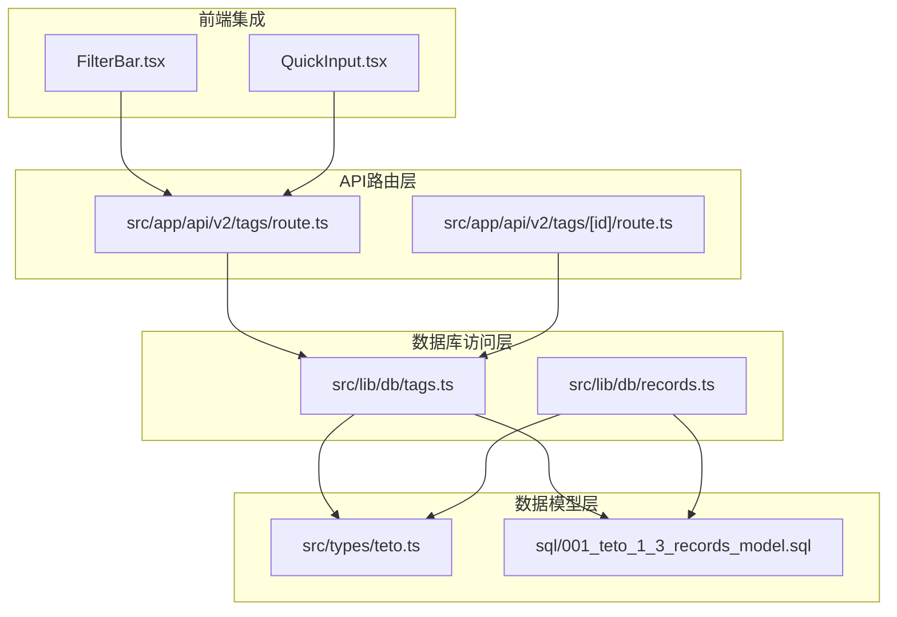

**图表来源**
- [src/app/api/v2/tags/route.ts:1-39](file://src/app/api/v2/tags/route.ts#L1-L39)
- [src/app/api/v2/tags/[id]/route.ts](file://src/app/api/v2/tags/[id]/route.ts#L1-L79)
- [src/lib/db/tags.ts:1-150](file://src/lib/db/tags.ts#L1-L150)

**章节来源**
- [src/app/api/v2/tags/route.ts:1-39](file://src/app/api/v2/tags/route.ts#L1-L39)
- [src/app/api/v2/tags/[id]/route.ts](file://src/app/api/v2/tags/[id]/route.ts#L1-L79)

## 核心组件

### 数据模型

标签系统的核心数据模型包括两个主要表：

1. **tags表**：存储标签基本信息
   - id：唯一标识符
   - user_id：所属用户
   - name：标签名称
   - color：颜色标识
   - type：标签类型
   - created_at：创建时间

2. **record_tags表**：实现记录与标签的多对多关系
   - id：关联记录标识
   - user_id：用户标识
   - record_id：记录标识
   - tag_id：标签标识
   - created_at：创建时间

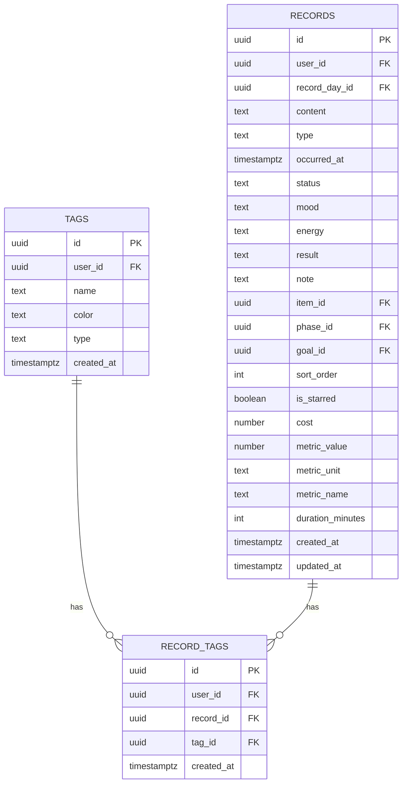

**图表来源**
- [sql/001_teto_1_3_records_model.sql:88-119](file://sql/001_teto_1_3_records_model.sql#L88-L119)

### API端点

标签API提供以下REST端点：

| 方法 | 端点 | 描述 | 认证要求 |
|------|------|------|----------|
| GET | `/api/v2/tags` | 获取用户所有标签列表 | 是 |
| POST | `/api/v2/tags` | 创建新标签 | 是 |
| GET | `/api/v2/tags/[id]` | 获取单个标签详情 | 是 |
| PUT | `/api/v2/tags/[id]` | 更新标签信息 | 是 |
| DELETE | `/api/v2/tags/[id]` | 删除标签 | 是 |

**章节来源**
- [src/app/api/v2/tags/route.ts:6-38](file://src/app/api/v2/tags/route.ts#L6-L38)
- [src/app/api/v2/tags/[id]/route.ts](file://src/app/api/v2/tags/[id]/route.ts#L7-L78)

## 架构概览

标签API采用分层架构设计，确保了清晰的关注点分离和良好的可维护性：

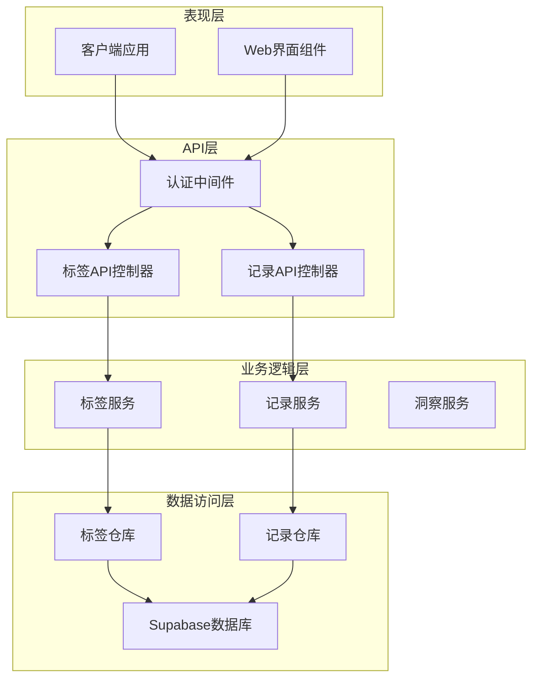

**图表来源**
- [src/app/api/v2/tags/route.ts:1-39](file://src/app/api/v2/tags/route.ts#L1-L39)
- [src/lib/db/tags.ts:1-150](file://src/lib/db/tags.ts#L1-L150)

### 数据流分析

标签API的数据流遵循标准的RESTful模式：

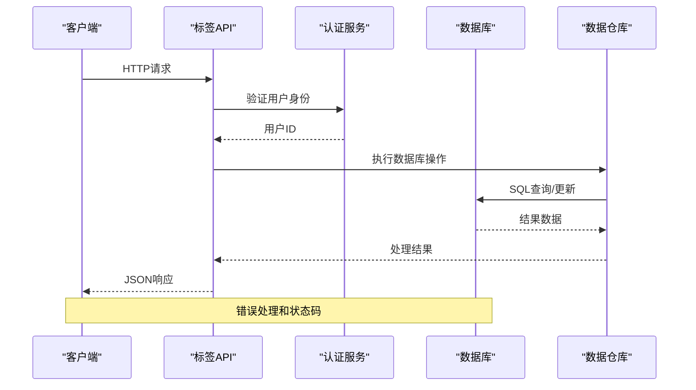

**图表来源**
- [src/app/api/v2/tags/[id]/route.ts](file://src/app/api/v2/tags/[id]/route.ts#L1-L79)
- [src/lib/db/tags.ts:1-150](file://src/lib/db/tags.ts#L1-L150)

## 详细组件分析

### 标签创建流程

标签创建是标签API的核心功能之一，涉及多个验证步骤和数据库操作：

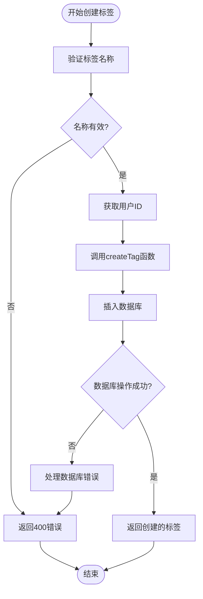

**图表来源**
- [src/app/api/v2/tags/route.ts:20-38](file://src/app/api/v2/tags/route.ts#L20-L38)
- [src/lib/db/tags.ts:7-29](file://src/lib/db/tags.ts#L7-L29)

### 标签关联机制

标签与记录的多对多关系通过record_tags表实现，支持灵活的标签组织：

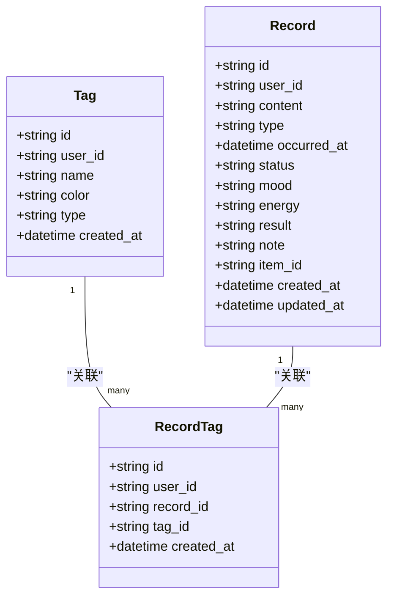

**图表来源**
- [sql/001_teto_1_3_records_model.sql:100-109](file://sql/001_teto_1_3_records_model.sql#L100-L109)
- [src/types/teto.ts:96-111](file://src/types/teto.ts#L96-L111)

### 标签更新流程

标签更新支持部分字段更新，通过动态构建更新数据对象实现：

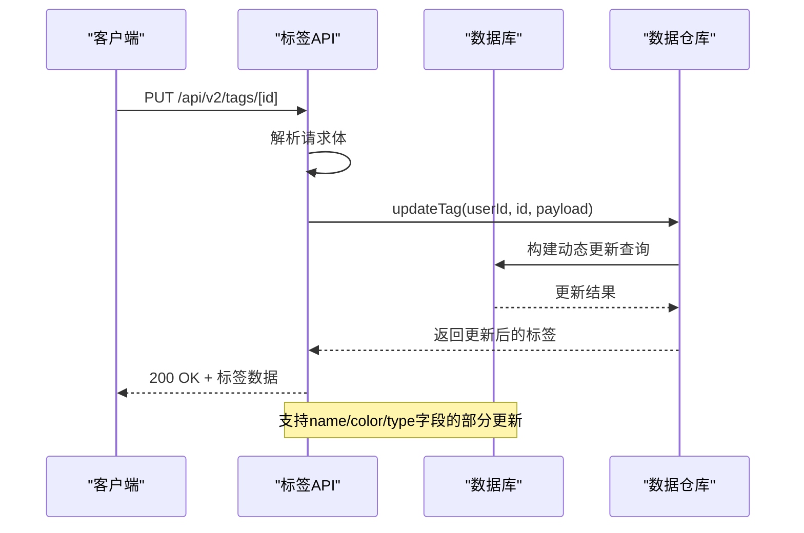

**图表来源**
- [src/app/api/v2/tags/[id]/route.ts](file://src/app/api/v2/tags/[id]/route.ts#L41-L58)
- [src/lib/db/tags.ts:34-58](file://src/lib/db/tags.ts#L34-L58)

**章节来源**
- [src/lib/db/tags.ts:1-150](file://src/lib/db/tags.ts#L1-L150)

### 标签删除流程

标签删除采用级联删除策略，确保数据完整性：

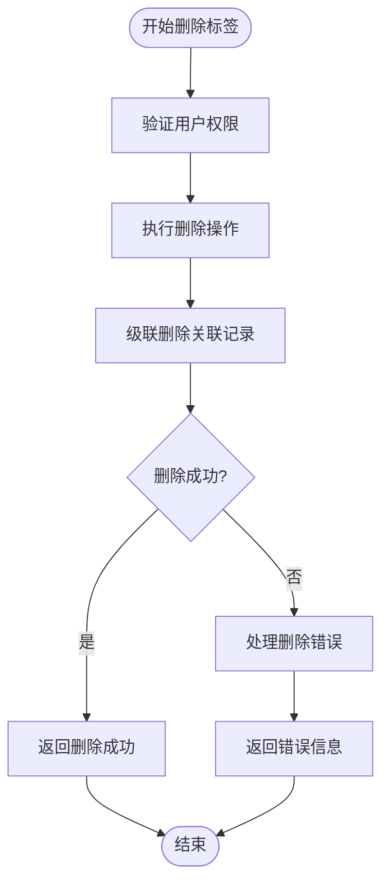

**图表来源**
- [src/app/api/v2/tags/[id]/route.ts](file://src/app/api/v2/tags/[id]/route.ts#L61-L77)
- [src/lib/db/tags.ts:64-76](file://src/lib/db/tags.ts#L64-L76)

**章节来源**
- [src/lib/db/tags.ts:61-76](file://src/lib/db/tags.ts#L61-L76)

### 标签列表查询

标签列表查询支持按创建时间排序，确保稳定的显示顺序：

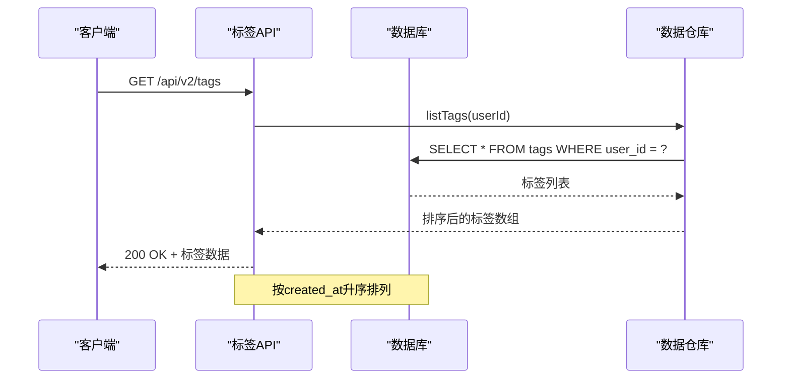

**图表来源**
- [src/app/api/v2/tags/route.ts:6-18](file://src/app/api/v2/tags/route.ts#L6-L18)
- [src/lib/db/tags.ts:81-95](file://src/lib/db/tags.ts#L81-L95)

**章节来源**
- [src/lib/db/tags.ts:78-95](file://src/lib/db/tags.ts#L78-L95)

## 依赖关系分析

标签API的依赖关系体现了清晰的分层架构：

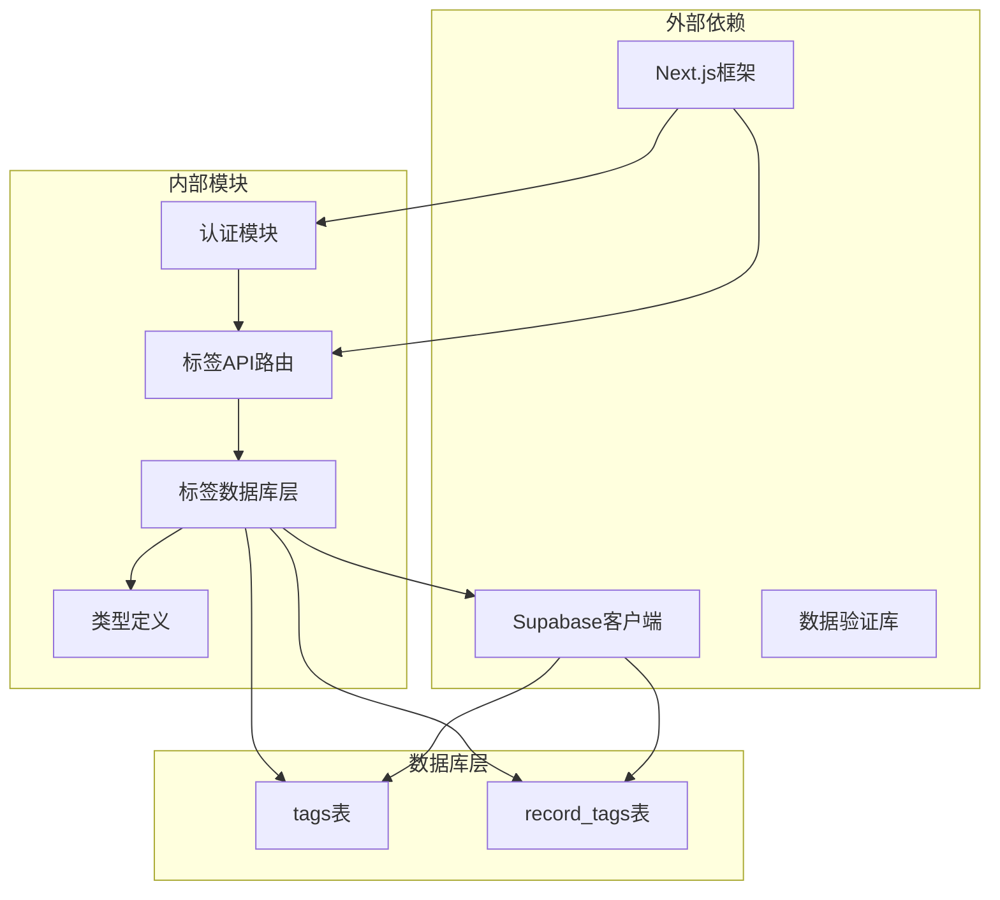

**图表来源**
- [src/app/api/v2/tags/route.ts:1-5](file://src/app/api/v2/tags/route.ts#L1-L5)
- [src/lib/db/tags.ts:1-3](file://src/lib/db/tags.ts#L1-L3)

### 错误处理机制

标签API实现了统一的错误处理机制：

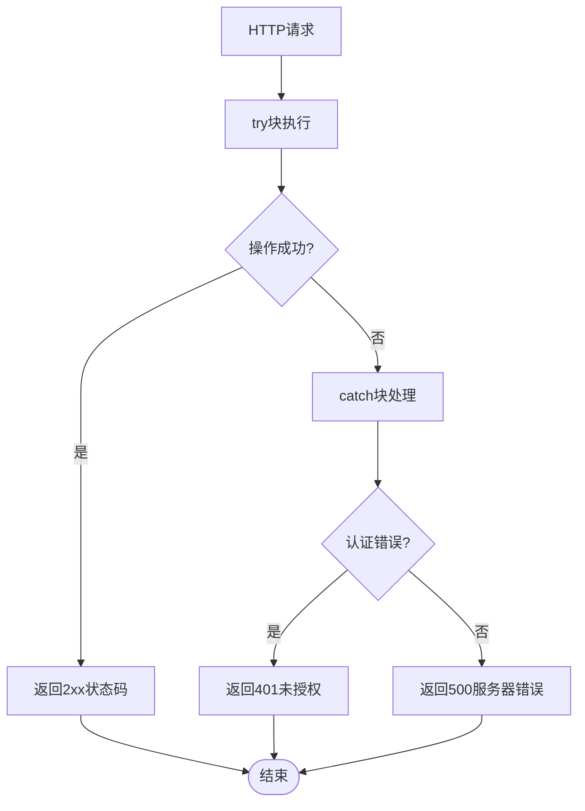

**图表来源**
- [src/app/api/v2/tags/route.ts:11-17](file://src/app/api/v2/tags/route.ts#L11-L17)
- [src/app/api/v2/tags/[id]/route.ts](file://src/app/api/v2/tags/[id]/route.ts#L32-L38)

**章节来源**
- [src/app/api/v2/tags/route.ts:11-17](file://src/app/api/v2/tags/route.ts#L11-L17)
- [src/app/api/v2/tags/[id]/route.ts](file://src/app/api/v2/tags/[id]/route.ts#L32-L38)

## 性能考虑

### 数据库索引优化

标签系统的关键性能优化点包括：

1. **标签表索引**：在user_id上建立索引，确保用户数据隔离
2. **记录标签关联索引**：在record_id和tag_id上建立复合索引
3. **查询优化**：使用UNIQUE约束防止重复关联

### 缓存策略

建议实施的缓存策略：
- 标签列表缓存：用户标签列表变化频率较低，适合短期缓存
- 用户上下文缓存：减少重复的用户身份验证查询

### 批量操作优化

对于大量标签操作，建议：
- 使用批量插入减少数据库往返
- 实施事务处理确保数据一致性
- 限制单次操作的最大记录数

## 故障排除指南

### 常见问题及解决方案

| 问题类型 | 症状 | 可能原因 | 解决方案 |
|----------|------|----------|----------|
| 认证失败 | 401未授权 | 用户未登录或会话过期 | 检查认证头和会话状态 |
| 数据库连接错误 | 500服务器错误 | 数据库连接池耗尽 | 检查连接配置和超时设置 |
| 重复标签 | 400错误 | 标签名重复 | 验证标签唯一性约束 |
| 权限不足 | 404标签不存在 | 尝试访问他人标签 | 检查用户权限和数据隔离 |

### 调试技巧

1. **启用详细日志**：在开发环境中启用详细的API调用日志
2. **数据库查询跟踪**：监控慢查询和高负载查询
3. **性能基准测试**：定期运行性能测试确保系统稳定性

**章节来源**
- [src/app/api/v2/tags/[id]/route.ts](file://src/app/api/v2/tags/[id]/route.ts#L23-L29)

## 结论

TETO的标签API系统提供了一个完整、健壮且高效的标签管理解决方案。系统采用现代化的架构设计，实现了清晰的分层结构和良好的可维护性。通过支持标签与记录的多对多关系，系统为用户提供了灵活的分类和组织能力。

关键优势包括：
- 完整的RESTful API设计
- 强大的数据验证和错误处理机制
- 灵活的标签关联和查询能力
- 良好的性能优化和扩展性考虑
- 严格的用户权限控制

未来可以考虑的功能增强：
- 标签搜索和高级过滤功能
- 标签使用统计和分析报告
- 标签模板和批量操作功能
- 更丰富的标签元数据支持