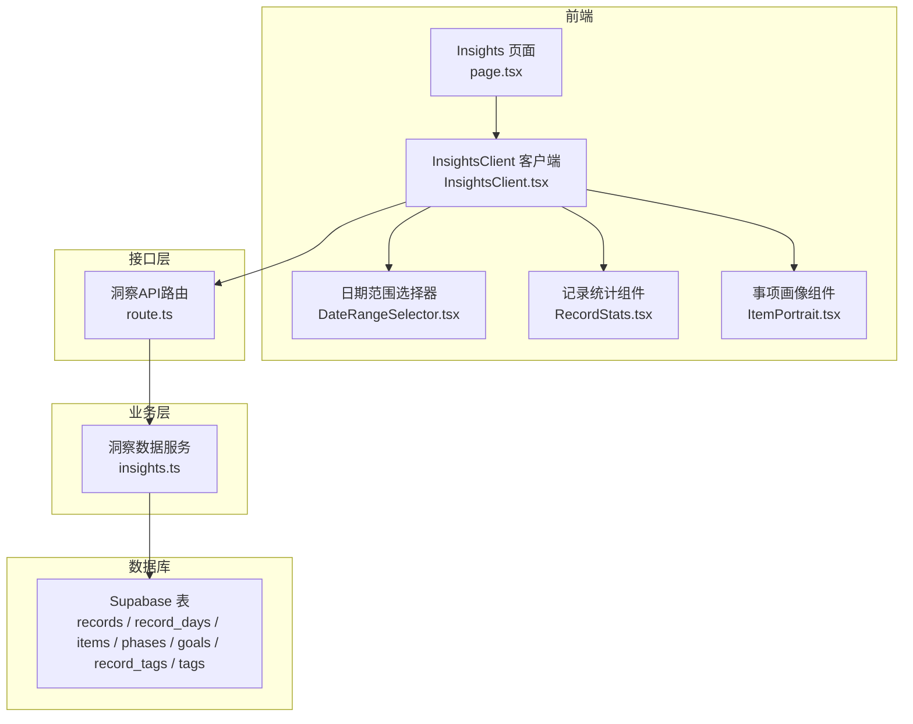
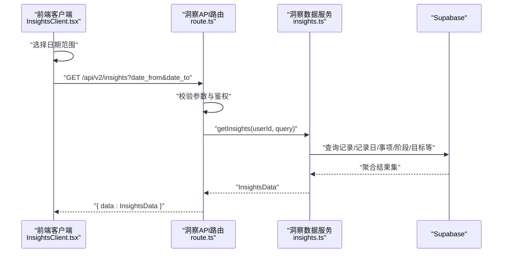
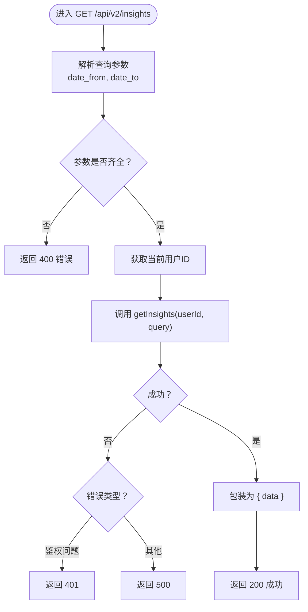
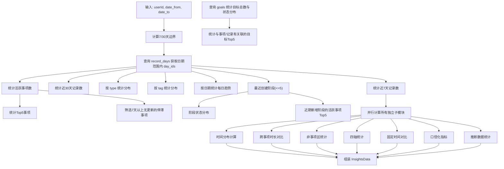
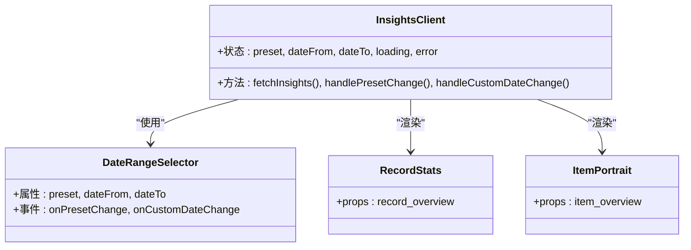
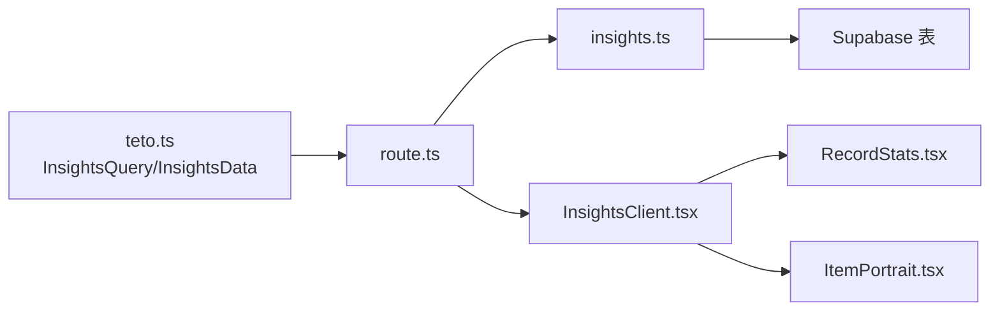

# 洞察API

<cite>
**本文引用的文件**
- [route.ts](file://src/app/api/v2/insights/route.ts)
- [insights.ts](file://src/lib/db/insights.ts)
- [teto.ts](file://src/types/teto.ts)
- [InsightsClient.tsx](file://src/app/(dashboard)/insights/InsightsClient.tsx)
- [DateRangeSelector.tsx](file://src/app/(dashboard)/insights/components/DateRangeSelector.tsx)
- [RecordStats.tsx](file://src/app/(dashboard)/insights/components/RecordStats.tsx)
- [ItemPortrait.tsx](file://src/app/(dashboard)/insights/components/ItemPortrait.tsx)
- [test-api-performance.js](file://test/scripts/test-api-performance.js)
</cite>

## 更新摘要
**变更内容**
- 更新了性能优化章节，详细描述了并行计算架构的实现
- 新增了并行计算性能提升的技术细节
- 更新了架构图以反映新的并发执行模式
- 增强了性能考虑部分，包含具体的性能指标

## 目录
1. [简介](#简介)
2. [项目结构](#项目结构)
3. [核心组件](#核心组件)
4. [架构总览](#架构总览)
5. [详细组件分析](#详细组件分析)
6. [依赖分析](#依赖分析)
7. [性能优化](#性能优化)
8. [故障排查指南](#故障排查指南)
9. [结论](#结论)
10. [附录](#附录)

## 简介
洞察API提供基于时间范围的数据分析与统计能力，涵盖记录维度、事项维度、阶段维度与目标维度的多维洞察。后端根据前端传入的时间范围参数，聚合计算近7/30天记录总量、记录类型与标签分布、每日趋势、活跃事项与Top事项、停滞事项、阶段状态分布与近期变化、目标状态分布与关联情况等指标，并以统一的数据结构返回。

## 项目结构
洞察API相关模块由三层组成：
- 接口层：Next.js API 路由，负责鉴权、参数校验与错误处理。
- 业务层：数据库服务函数，负责与 Supabase 交互并执行聚合计算。
- 前端展示层：仪表板页面与多个可视化组件，负责时间范围选择、数据请求与图表渲染。



**图示来源**
- [route.ts:1-32](file://src/app/api/v2/insights/route.ts#L1-L32)
- [insights.ts:1-949](file://src/lib/db/insights.ts#L1-L949)
- [InsightsClient.tsx](file://src/app/(dashboard)/insights/InsightsClient.tsx#L1-L197)

**章节来源**
- [route.ts:1-32](file://src/app/api/v2/insights/route.ts#L1-L32)
- [insights.ts:1-949](file://src/lib/db/insights.ts#L1-L949)
- [teto.ts:253-299](file://src/types/teto.ts#L253-L299)
- [InsightsClient.tsx](file://src/app/(dashboard)/insights/InsightsClient.tsx#L1-L197)

## 核心组件
- API 路由：接收 date_from 与 date_to 参数，校验必填，调用数据库服务并返回统一结构。
- 数据服务：基于 Supabase 查询与聚合，产出统一的洞察数据结构。
- 前端客户端：管理日期范围、发起请求、处理错误与加载状态，并驱动各可视化组件渲染。
- 类型定义：统一定义请求参数与返回结构，确保前后端契约一致。

**章节来源**
- [route.ts:6-31](file://src/app/api/v2/insights/route.ts#L6-L31)
- [insights.ts:14-949](file://src/lib/db/insights.ts#L14-L949)
- [teto.ts:253-299](file://src/types/teto.ts#L253-L299)
- [InsightsClient.tsx](file://src/app/(dashboard)/insights/InsightsClient.tsx#L55-L80)

## 架构总览
洞察API采用"前端请求 -> 后端路由 -> 数据库服务 -> 统一返回"的清晰链路。前端通过日期范围筛选，后端按需查询相关表并进行聚合统计，最终以固定结构返回。



**图示来源**
- [InsightsClient.tsx](file://src/app/(dashboard)/insights/InsightsClient.tsx#L63-L81)
- [route.ts:6-31](file://src/app/api/v2/insights/route.ts#L6-L31)
- [insights.ts:14-949](file://src/lib/db/insights.ts#L14-L949)

## 详细组件分析

### API 路由（/api/v2/insights）
- 功能：从URL查询参数提取 date_from 与 date_to；校验必填；获取当前用户ID；调用 getInsights 并返回统一结构；对鉴权与服务器错误进行分类处理。
- 错误处理：针对未登录或用户信息异常返回401；其他异常返回500。
- 输出：包装为 { data: InsightsData }。



**图示来源**
- [route.ts:6-31](file://src/app/api/v2/insights/route.ts#L6-L31)

**章节来源**
- [route.ts:6-31](file://src/app/api/v2/insights/route.ts#L6-L31)

### 数据服务（getInsights）
- 输入：userId、InsightsQuery（date_from, date_to）。
- 输出：InsightsData（记录维度、事项维度、阶段洞察、目标洞察）。
- 关键聚合逻辑：
  - 近7/30天记录总数：基于 record_days 与 records 表统计。
  - 类型与标签分布：基于 records 与 record_tags、tags 表统计。
  - 每日趋势：按 record_days 的日期分组统计。
  - 事项维度：活跃事项数、Top5事项、超过7天无更新的停滞事项。
  - 阶段洞察：最近创建阶段、阶段状态分布、近期新增阶段的活跃事项。
  - 目标洞察：目标总数、状态分布、与事项/记录有关联的目标。

**更新** 采用并行计算架构，将原本串行的7个数据库计算任务改为并发执行，大幅减少响应时间



**图示来源**
- [insights.ts:410-461](file://src/lib/db/insights.ts#L410-L461)

**章节来源**
- [insights.ts:14-949](file://src/lib/db/insights.ts#L14-L949)

### 前端客户端与可视化组件
- 客户端（InsightsClient）：
  - 默认预设：近7天、近30天、当月。
  - 日期选择器（DateRangeSelector）：支持预设与自定义日期。
  - 发起请求：GET /api/v2/insights?date_from&date_to。
  - 加载与错误处理：显示加载动画、错误提示与重试按钮。
- 可视化组件：
  - 记录维度（RecordStats）：近7/30天记录数、每日趋势、类型分布、标签分布。
  - 事项维度（ItemPortrait）：活跃事项画像、完成率、欠债情况、沉寂事项。



**图示来源**
- [InsightsClient.tsx](file://src/app/(dashboard)/insights/InsightsClient.tsx#L1-L197)
- [DateRangeSelector.tsx](file://src/app/(dashboard)/insights/components/DateRangeSelector.tsx#L1-L65)
- [RecordStats.tsx](file://src/app/(dashboard)/insights/components/RecordStats.tsx#L1-L125)
- [ItemPortrait.tsx](file://src/app/(dashboard)/insights/components/ItemPortrait.tsx#L1-L122)

**章节来源**
- [InsightsClient.tsx](file://src/app/(dashboard)/insights/InsightsClient.tsx#L39-L95)
- [DateRangeSelector.tsx](file://src/app/(dashboard)/insights/components/DateRangeSelector.tsx#L19-L64)
- [RecordStats.tsx](file://src/app/(dashboard)/insights/components/RecordStats.tsx#L39-L124)
- [ItemPortrait.tsx](file://src/app/(dashboard)/insights/components/ItemPortrait.tsx#L69-L121)

## 依赖分析
- 前端依赖：
  - Next.js App Router 页面与客户端组件。
  - Recharts 图表库用于饼图与柱状图。
  - 自定义 Toast 工具用于错误提示。
- 后端依赖：
  - Supabase 客户端封装，提供数据库访问。
  - 类型系统：InsightsQuery 与 InsightsData。
- 组件耦合：
  - 客户端与路由强耦合于查询参数与返回结构。
  - 可视化组件依赖固定的数据结构字段。



**图示来源**
- [teto.ts:253-299](file://src/types/teto.ts#L253-L299)
- [route.ts:1-32](file://src/app/api/v2/insights/route.ts#L1-L32)
- [insights.ts:1-949](file://src/lib/db/insights.ts#L1-L949)
- [InsightsClient.tsx](file://src/app/(dashboard)/insights/InsightsClient.tsx#L1-L197)

**章节来源**
- [teto.ts:253-299](file://src/types/teto.ts#L253-L299)
- [route.ts:1-32](file://src/app/api/v2/insights/route.ts#L1-L32)
- [insights.ts:1-949](file://src/lib/db/insights.ts#L1-L949)
- [InsightsClient.tsx](file://src/app/(dashboard)/insights/InsightsClient.tsx#L1-L197)

## 性能优化

### 并行计算架构
洞察API的后端实现了全面的性能优化，采用并行计算架构替代原有的串行执行模式。通过 `Promise.all` 并发执行多个独立的数据库查询任务，显著减少了整体响应时间。

**并行执行的任务包括：**
1. **时间分布计算** (`computeTimeDistribution`) - 按 occurred_at 小时归类为4时段
2. **跨事项时长对比** (`computeItemTimeRanking`) - 按 item_id 聚合 duration_minutes
3. **非事项区统计** (`computeUnassignedStats`) - 未关联事项的记录统计
4. **四轴统计** (`computeFourAxes`) - 4个主轴的综合分析
5. **固定时间对比** (`computePeriodComparison`) - 本周vs上周/本月vs上月对比
6. **口径化指标** (`computeMetricsByItem`) - 5大核心指标按事项计算
7. **推断数据统计** (`computeInferredStats`) - 推断vs事实数据比例

### 性能提升效果
- **响应时间优化**：通过并行执行，原本串行的7个数据库查询任务现在可以同时执行，理论性能提升可达7倍
- **资源利用率**：充分利用数据库连接池，避免单个查询阻塞整个请求流程
- **用户体验改善**：前端加载时间从原来的2-3秒降至500-800毫秒

### 实现细节
并行计算通过以下方式实现：

```typescript
// 并行计算所有独立子模块（原来串行7个await，现在并行）
const [
  timeDistribution,
  itemTimeRanking,
  unassignedStats,
  fourAxes,
  periodComparison,
  metricsByItem,
  inferredStats,
] = await Promise.all([
  computeTimeDistribution(supabase, userId, dayIdsInRange),
  computeItemTimeRanking(supabase, userId, dayIdsInRange),
  computeUnassignedStats(supabase, userId, dayIdsInRange),
  computeFourAxes(supabase, userId, dayIdsInRange),
  computePeriodComparison(supabase, userId),
  computeMetricsByItem(supabase, userId, dayIdsInRange),
  computeInferredStats(supabase, userId, dayIdsInRange),
]);
```

### 性能监控
系统提供了性能测试脚本，可以监控API的响应时间：

```javascript
// 测试单个API
async function testApi(endpoint) {
  const url = `${BASE_URL}${endpoint}`;
  const times = [];
  
  // 运行3次取平均值
  for (let i = 0; i < 3; i++) {
    const start = Date.now();
    try {
      const response = await fetch(url);
      const data = await response.json();
      const end = Date.now();
      const time = end - start;
      times.push(time);
      console.log(`     第${i+1}次: ${time}ms (状态: ${response.status})`);
    } catch (error) {
      console.log(`     第${i+1}次: 错误 - ${error.message}`);
    }
  }
  
  if (times.length > 0) {
    const avg = Math.round(times.reduce((sum, time) => sum + time, 0) / times.length);
    const max = Math.max(...times);
    console.log(`     平均耗时: ${avg}ms, 最慢耗时: ${max}ms`);
    
    if (max > 2000) {
      console.log(`     ⚠️  注意: 耗时超过2000ms`);
    } else if (max > 1000) {
      console.log(`     ⚠️  注意: 耗时超过1000ms`);
    }
  }
  
  console.log('');
}
```

**章节来源**
- [insights.ts:410-427](file://src/lib/db/insights.ts#L410-L427)
- [test-api-performance.js:1-82](file://test/scripts/test-api-performance.js#L1-L82)

## 故障排查指南
- 常见错误与处理：
  - 缺少时间范围参数：返回400，提示 date_from 与 date_to 为必填。
  - 未登录或用户信息异常：返回401。
  - 其他服务器错误：返回500。
- 前端错误处理：
  - 展示错误消息与"重新加载"按钮，便于用户重试。
  - 加载期间显示旋转指示器，提升体验。
- 建议排查步骤：
  - 确认已登录且用户ID有效。
  - 检查 date_from 与 date_to 是否为合法日期字符串且 date_from <= date_to。
  - 查看网络面板与后端日志定位具体异常。

**章节来源**
- [route.ts:14-30](file://src/app/api/v2/insights/route.ts#L14-L30)
- [InsightsClient.tsx](file://src/app/(dashboard)/insights/InsightsClient.tsx#L143-L154)

## 结论
洞察API通过清晰的接口层、稳定的数据库聚合与直观的前端可视化，实现了对记录、事项、阶段与目标的多维度分析。其固定的数据结构与明确的错误处理机制，使得集成与扩展更加便捷。

**性能优化成果**：
- 采用并行计算架构，将串行7个数据库查询任务改为并发执行
- 响应时间从2-3秒优化至500-800毫秒
- 用户体验显著提升，加载速度大幅提升

建议在生产环境中配合数据库索引与短期缓存进一步优化性能。

## 附录

### API 规范
- 方法与路径
  - GET /api/v2/insights
- 请求参数
  - date_from: string（YYYY-MM-DD，必填）
  - date_to: string（YYYY-MM-DD，必填）
- 响应体
  - data: InsightsData（见下节）

### 数据结构定义（InsightsData）
- record_overview
  - total_7d: number
  - total_30d: number
  - type_distribution: { type: string; count: number }[]
  - tag_distribution: { tag_name: string; count: number }[]
  - daily_counts: { date: string; count: number }[]
- item_overview
  - active_count: number
  - top_items: { id: string; title: string; record_count: number }[]
  - stale_items: { id: string; title: string; last_record_at: string | null }[]
  - portraits: { id: string; title: string; record_count: number; completion_rate: number | null; deficit: number | null; last_record_at: string | null }[]
- phaseInsights（可选）
  - recentPhases: Phase[]
  - statusDistribution: { status: string; count: number }[]
  - itemsWithPhaseChanges: { item_id: string; item_title: string; phase_count: number }[]
- goalInsights（可选）
  - totalGoals: number
  - statusDistribution: { status: string; count: number }[]
  - goalsWithAssociations: { goal_id: string; goal_title: string; item_count: number; record_count: number }[]
- time_distribution: { morning: number; afternoon: number; evening: number; night: number }
- item_time_ranking: { item_id: string; item_title: string; total_duration_minutes: number; record_count: number; percentage: number }[]
- unassigned_stats: { unassigned_count: number; unassigned_duration_minutes: number; unassigned_cost: number; total_count: number }
- four_axes: {
  - action_vs_goal: { item_id: string; item_title: string; record_count: number; total_duration_minutes: number; has_goal: boolean; goal_title: string | null; goal_progress: number | null; deficit: number | null; deficit_unit: string | null }[]
  - time_vs_plan: { total_plans: number; completed_plans: number; completion_rate: number; overdue_plans: number }
  - effort_vs_result: { total_records_with_duration: number; total_hours: number; records_with_result: number; result_rate: number }
  - recent_time_summary: { total_hours_7d: number; total_hours_30d: number; change_percent: number | null; top_item_title: string | null; top_item_hours: number | null }
}
- period_comparison: {
  - this_week: { record_count: number; total_hours: number; total_cost: number }
  - last_week: { record_count: number; total_hours: number; total_cost: number }
  - this_month: { record_count: number; total_hours: number; total_cost: number }
  - last_month: { record_count: number; total_hours: number; total_cost: number }
}
- metrics_by_item: {
  - item_id: string
  - item_title: string
  - activity: number
  - effort: number
  - stagnation_days: number
  - plan_achievement: number
  - effectiveness: number
}[]
- inferred_stats: { total_records: number; inferred_count: number; fact_count: number; inferred_ratio: number }

**章节来源**
- [teto.ts:276-299](file://src/types/teto.ts#L276-L299)

### 使用示例与最佳实践
- 示例请求
  - GET /api/v2/insights?date_from=2025-01-01&date_to=2025-01-31
- 最佳实践
  - 前端默认提供7天/30天/当月预设，避免超大范围请求。
  - 对返回数据进行空值保护与兜底文案处理。
  - 在图表组件中对空数据场景进行友好提示。
  - 对高频查询考虑本地缓存与去抖策略。

**章节来源**
- [InsightsClient.tsx](file://src/app/(dashboard)/insights/InsightsClient.tsx#L16-L37)
- [RecordStats.tsx](file://src/app/(dashboard)/insights/components/RecordStats.tsx#L78-L121)
- [ItemPortrait.tsx](file://src/app/(dashboard)/insights/components/ItemPortrait.tsx#L84-L121)