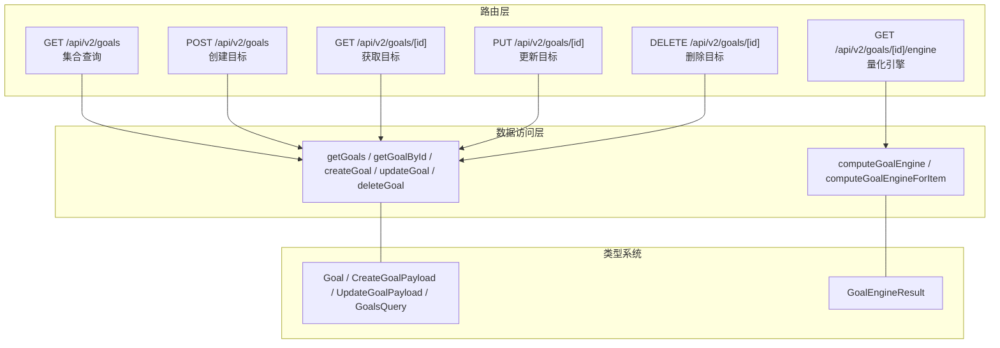
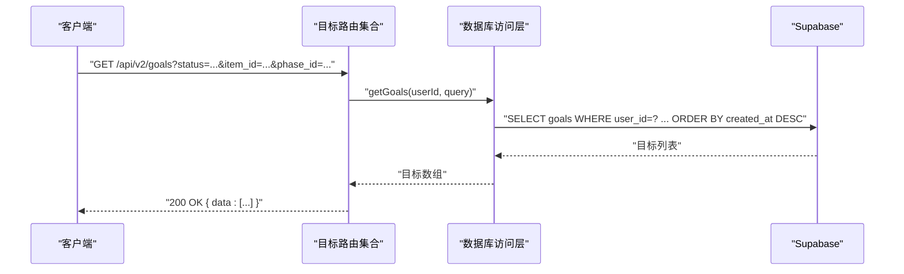
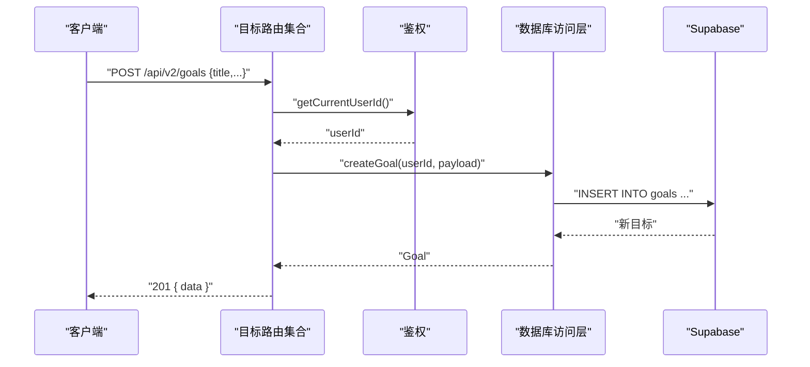
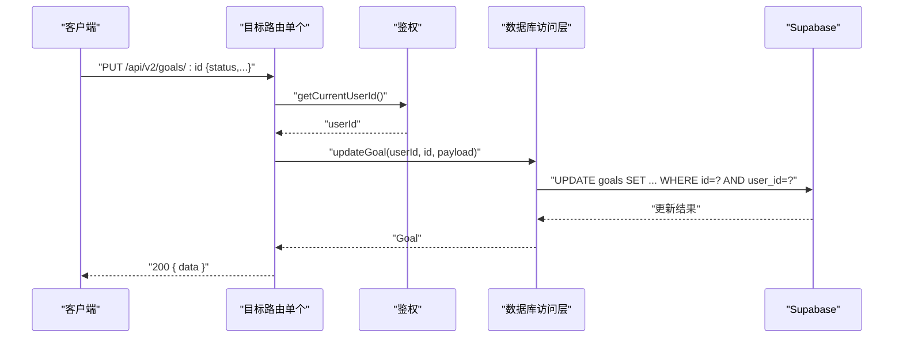
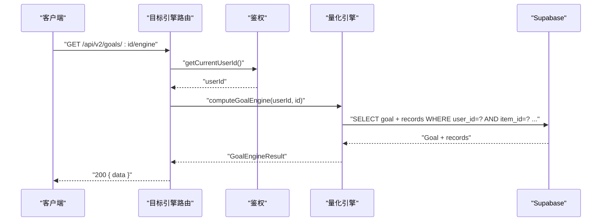
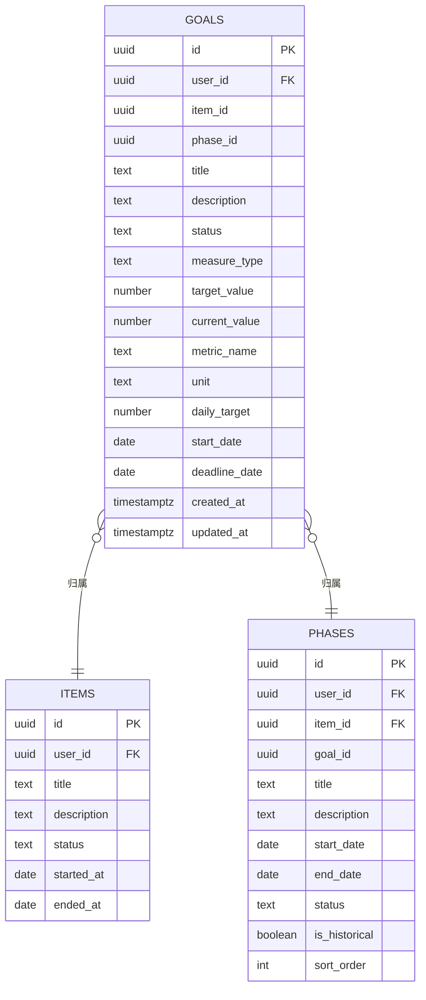
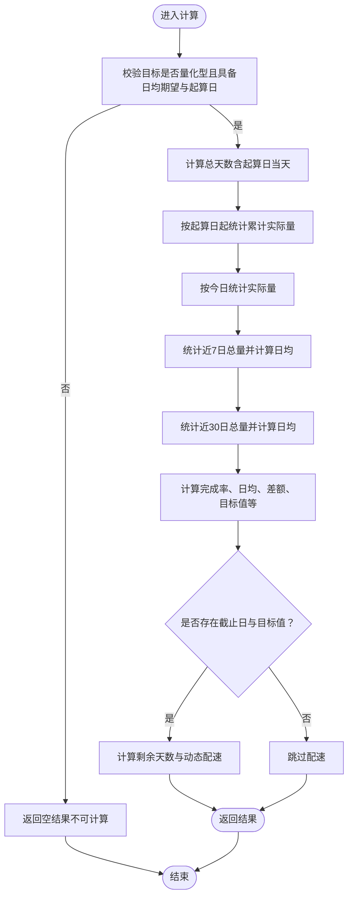
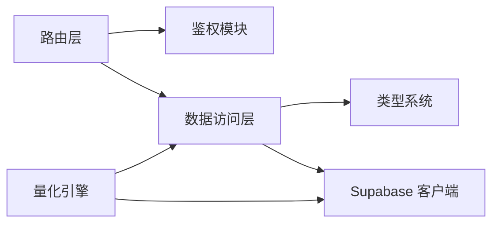

# 目标API

<cite>
**本文引用的文件**
- [目标路由（集合）](file://src/app/api\v2\goals\route.ts)
- [目标路由（单个）](file://src/app/api\v2\goals\[id]\route.ts)
- [目标引擎路由（单个目标）](file://src/app/api\v2\goals\[id]\engine\route.ts)
- [目标数据库访问层](file://src/lib\db\goals.ts)
- [目标量化引擎](file://src/lib\db\goal-engine.ts)
- [类型定义（含目标相关）](file://src\types\teto.ts)
- [阶段与目标建表脚本](file://sql\003_teto_1_4_phases_and_goals.sql)
- [目标基准字段脚本](file://sql\010_goal_benchmark_fields.sql)
- [目标表单组件](file://src\app\(dashboard)\items\components\GoalForm.tsx)
- [目标列表组件](file://src\app\(dashboard)\items\components\GoalSection.tsx)
- [量化引擎仪表盘组件](file://src\app\(dashboard)\items\components\GoalEngineDashboard.tsx)
- [量化引擎Hook](file://src\lib\hooks\useGoalEngine.ts)
</cite>

## 目录
1. [简介](#简介)
2. [项目结构](#项目结构)
3. [核心组件](#核心组件)
4. [架构总览](#架构总览)
5. [详细组件分析](#详细组件分析)
6. [依赖分析](#依赖分析)
7. [性能考量](#性能考量)
8. [故障排查指南](#故障排查指南)
9. [结论](#结论)
10. [附录](#附录)

## 简介
本文件为 TETO 项目中“目标”模块的 RESTful API 文档，覆盖目标的创建、查询、更新、删除以及量化引擎计算能力。目标API围绕以下主题展开：
- 目标基本信息管理：标题、描述、状态、归属（事项/阶段）、度量类型与基准字段
- 目标引擎操作：基于“日均期望×天数”的量化计算，支持完成度、差额、配速器等指标
- 目标状态跟踪：支持“进行中/已达成/已放弃/已暂停”
- 目标与项目的关系：目标通过 item_id/phase_id 与事项/阶段关联
- 完成度计算：累计应当量、累计实际量、日均、近7/30日均、动态配速等
- 里程碑与进度监控：通过起算日、截止日、目标值联动计算剩余天数与动态每日配速
- 生命周期管理与业务规则：RLS 行级安全、状态枚举、必填字段校验、防串库过滤

## 项目结构
目标API由三层组成：
- 路由层：Next.js App Router 路由处理器，负责鉴权、参数解析、错误处理
- 数据访问层：封装 Supabase 查询与写入，提供 CRUD 与批量计算入口
- 类型系统：统一的 TypeScript 接口与枚举，确保前后端契约一致

图表来源
- [目标路由（集合）:1-49](file://src/app/api\v2\goals\route.ts#L1-L49)
- [目标路由（单个）:1-67](file://src/app/api\v2\goals\[id]\route.ts#L1-L67)
- [目标引擎路由（单个目标）:1-35](file://src/app/api\v2\goals\[id]\engine\route.ts#L1-L35)
- [目标数据库访问层:1-197](file://src/lib\db\goals.ts#L1-L197)
- [目标量化引擎:1-294](file://src/lib\db\goal-engine.ts#L1-L294)
- [类型定义（含目标相关）:315-516](file://src\types\teto.ts#L315-L516)

章节来源
- [目标路由（集合）:1-49](file://src/app/api\v2\goals\route.ts#L1-L49)
- [目标路由（单个）:1-67](file://src/app/api\v2\goals\[id]\route.ts#L1-L67)
- [目标引擎路由（单个目标）:1-35](file://src/app/api\v2\goals\[id]\engine\route.ts#L1-L35)
- [目标数据库访问层:1-197](file://src/lib\db\goals.ts#L1-L197)
- [目标量化引擎:1-294](file://src/lib\db\goal-engine.ts#L1-L294)
- [类型定义（含目标相关）:315-516](file://src\types\teto.ts#L315-L516)

## 核心组件
- 目标集合接口：支持按状态、事项、阶段过滤查询；创建目标时校验必填字段
- 单个目标接口：获取、更新、删除；删除后返回被删除的 id
- 量化引擎接口：对单个目标进行“日均期望×天数”的完成度计算，返回多维指标
- 数据访问层：封装 Supabase 查询、插入、更新、删除；提供批量计算入口
- 类型系统：统一的目标结构、查询参数、创建/更新载荷、引擎结果结构

章节来源
- [目标路由（集合）:6-28](file://src/app/api\v2\goals\route.ts#L6-L28)
- [目标路由（单个）:6-66](file://src/app/api\v2\goals\[id]\route.ts#L6-L66)
- [目标引擎路由（单个目标）:9-34](file://src/app/api\v2\goals\[id]\engine\route.ts#L9-L34)
- [目标数据库访问层:10-171](file://src/lib\db\goals.ts#L10-L171)
- [类型定义（含目标相关）:315-503](file://src\types\teto.ts#L315-L503)

## 架构总览
目标API采用“路由层-数据访问层-类型系统”分层架构，配合 Supabase 实现行级安全控制与高效查询。

图表来源
- [目标路由（集合）:6-28](file://src/app/api\v2\goals\route.ts#L6-L28)
- [目标数据库访问层:10-40](file://src/lib\db\goals.ts#L10-L40)

## 详细组件分析

### 目标集合接口（查询与创建）
- GET /api/v2/goals
  - 查询参数：status、item_id、phase_id
  - 返回：目标数组
  - 错误：未登录返回 401，其他错误返回 500
- POST /api/v2/goals
  - 请求体：CreateGoalPayload
  - 必填校验：title 不能为空
  - 成功：201 Created，返回创建后的目标
  - 错误：未登录返回 401，其他错误返回 500

图表来源
- [目标路由（集合）:30-48](file://src/app/api\v2\goals\route.ts#L30-L48)
- [目标数据库访问层:74-107](file://src/lib\db\goals.ts#L74-L107)

章节来源
- [目标路由（集合）:6-48](file://src/app/api\v2\goals\route.ts#L6-L48)
- [目标数据库访问层:10-107](file://src/lib\db\goals.ts#L10-L107)
- [类型定义（含目标相关）:356-372](file://src\types\teto.ts#L356-L372)

### 单个目标接口（获取、更新、删除）
- GET /api/v2/goals/[id]
  - 校验：目标存在且属于当前用户
  - 返回：目标对象
  - 错误：未登录返回 401，不存在或非当前用户返回 404，其他错误返回 500
- PUT /api/v2/goals/[id]
  - 请求体：UpdateGoalPayload
  - 返回：更新后的目标
  - 错误：未登录返回 401，其他错误返回 500
- DELETE /api/v2/goals/[id]
  - 返回：{ data: { id } }
  - 错误：未登录返回 401，其他错误返回 500

图表来源
- [目标路由（单个）:29-47](file://src/app/api\v2\goals\[id]\route.ts#L29-L47)
- [目标数据库访问层:113-152](file://src/lib\db\goals.ts#L113-L152)

章节来源
- [目标路由（单个）:6-66](file://src/app/api\v2\goals\[id]\route.ts#L6-L66)
- [目标数据库访问层:48-171](file://src/lib\db\goals.ts#L48-L171)
- [类型定义（含目标相关）:374-390](file://src\types\teto.ts#L374-L390)

### 量化引擎接口（单个目标）
- GET /api/v2/goals/[id]/engine
  - 校验：目标必须为量化型（measure_type=numeric），且具备 daily_target 与 start_date
  - 返回：GoalEngineResult
  - 错误：未登录返回 401，不可计算返回 404，其他错误返回 500

图表来源
- [目标引擎路由（单个目标）:9-34](file://src/app/api\v2\goals\[id]\engine\route.ts#L9-L34)
- [目标量化引擎:49-70](file://src/lib\db\goal-engine.ts#L49-L70)
- [目标量化引擎:113-202](file://src/lib\db\goal-engine.ts#L113-L202)

章节来源
- [目标引擎路由（单个目标）:9-34](file://src/app/api\v2\goals\[id]\engine\route.ts#L9-L34)
- [目标量化引擎:49-202](file://src/lib\db\goal-engine.ts#L49-L202)
- [类型定义（含目标相关）:467-503](file://src\types\teto.ts#L467-L503)

### 数据模型与关系
- 目标（Goal）：包含标题、描述、状态、度量类型、目标值、当前值及量化引擎基准字段（指标名、单位、日均期望、起算日、截止日）
- 量化引擎结果（GoalEngineResult）：包含累计应当量、累计实际量、日均、近7/30日均、完成率、差额、动态配速等
- 目标与事项/阶段：通过 item_id/phase_id 关联，支持按阶段聚合与仪表盘展示

图表来源
- [类型定义（含目标相关）:315-354](file://src\types\teto.ts#L315-L354)
- [阶段与目标建表脚本:16-45](file://sql\003_teto_1_4_phases_and_goals.sql#L16-L45)

章节来源
- [类型定义（含目标相关）:315-354](file://src\types\teto.ts#L315-L354)
- [阶段与目标建表脚本:16-45](file://sql\003_teto_1_4_phases_and_goals.sql#L16-L45)

### 量化引擎算法流程
引擎根据目标配置与记录流水进行计算，核心步骤如下：
- 校验：目标必须为量化型且具备日均期望与起算日
- 计算周期：从起算日到今天的总天数
- 指标计算：累计实际量、今日实际量、近7/30日均、日均、完成率、差额
- 配速器：若存在截止日与目标值，计算剩余天数与动态每日配速
- 防串库：通过目标的 metric_name 与 unit 精准匹配记录，避免不同维度数据串扰

图表来源
- [目标量化引擎:113-202](file://src/lib\db\goal-engine.ts#L113-L202)
- [目标量化引擎:234-293](file://src/lib\db\goal-engine.ts#L234-L293)

章节来源
- [目标量化引擎:113-202](file://src/lib\db\goal-engine.ts#L113-L202)
- [目标量化引擎:234-293](file://src/lib\db\goal-engine.ts#L234-L293)

### 前端集成与使用示例
- 目标表单组件：支持创建/更新目标，自动填充引擎相关字段（指标名、单位、日均期望、起算日、截止日）
- 目标列表组件：支持按状态筛选、删除目标、打开编辑抽屉
- 量化引擎仪表盘：展示差额、完成率、日均、近7/30日均、周/月目标与预测、动态配速等

章节来源
- [目标表单组件](file://src\app\(dashboard)\items\components\GoalForm.tsx#L75-L145)
- [目标列表组件](file://src\app\(dashboard)\items\components\GoalSection.tsx#L26-L83)
- [量化引擎仪表盘组件](file://src\app\(dashboard)\items\components\GoalEngineDashboard.tsx#L11-L58)
- [量化引擎Hook:10-41](file://src\lib\hooks\useGoalEngine.ts#L10-L41)

## 依赖分析
- 路由层依赖鉴权模块获取当前用户ID，并调用数据访问层执行数据库操作
- 数据访问层依赖 Supabase 客户端，实现查询、插入、更新、删除与批量计算
- 类型系统贯穿路由层与数据访问层，确保请求/响应结构一致
- 量化引擎依赖目标配置与记录流水，通过防串库过滤保障数据隔离

图表来源
- [目标路由（集合）:1-4](file://src/app/api\v2\goals\route.ts#L1-L4)
- [目标数据库访问层:1-2](file://src/lib\db\goals.ts#L1-L2)
- [目标量化引擎:1-2](file://src/lib\db\goal-engine.ts#L1-L2)
- [类型定义（含目标相关）:315-516](file://src\types\teto.ts#L315-L516)

章节来源
- [目标路由（集合）:1-4](file://src/app/api\v2\goals\route.ts#L1-L4)
- [目标数据库访问层:1-2](file://src/lib\db\goals.ts#L1-L2)
- [目标量化引擎:1-2](file://src/lib\db\goal-engine.ts#L1-L2)
- [类型定义（含目标相关）:315-516](file://src\types\teto.ts#L315-L516)

## 性能考量
- 查询优化：目标集合查询支持按 status/item_id/phase_id 进行过滤，建议在高频查询场景下结合索引使用
- 量化引擎：对记录流水进行多次扫描与求和，建议合理设置起算日与截止日以缩小计算范围
- 防串库过滤：通过 metric_name 与 unit 精准匹配，避免跨维度数据干扰，但会增加查询复杂度
- 分页与限制：量化引擎查询设置了上限，避免超大数据集导致性能问题

## 故障排查指南
- 未登录或鉴权失败：返回 401，检查认证状态与用户ID获取
- 目标不存在或非当前用户：返回 404，确认目标ID与归属关系
- 创建失败（title 为空）：返回 400，确保必填字段完整
- 量化引擎不可计算：返回 404，确认目标为量化型且具备 daily_target 与 start_date
- 数据库错误：返回 500，检查 Supabase 连接与权限

章节来源
- [目标路由（集合）:21-27](file://src/app/api\v2\goals\route.ts#L21-L27)
- [目标路由（单个）:14-26](file://src/app/api\v2\goals\[id]\route.ts#L14-L26)
- [目标引擎路由（单个目标）:19-24](file://src/app/api\v2\goals\[id]\engine\route.ts#L19-L24)

## 结论
目标API提供了完善的目标生命周期管理与量化引擎能力，结合前端组件实现了从创建、编辑到进度监控的闭环。通过行级安全策略与防串库过滤，确保数据隔离与准确性。建议在生产环境中关注查询索引与计算范围，以获得更优性能。

## 附录

### API 定义与示例

- 查询目标集合
  - 方法与路径：GET /api/v2/goals
  - 查询参数：
    - status：目标状态（进行中/已达成/已放弃/已暂停）
    - item_id：所属事项ID
    - phase_id：所属阶段ID
  - 成功响应：200 OK，返回 { data: Goal[] }
  - 示例：GET /api/v2/goals?status=进行中&item_id=xxx

- 创建目标
  - 方法与路径：POST /api/v2/goals
  - 请求体：CreateGoalPayload（至少包含 title）
  - 成功响应：201 Created，返回 { data: Goal }
  - 示例：POST /api/v2/goals { title, description, status, item_id, phase_id, measure_type, ... }

- 获取单个目标
  - 方法与路径：GET /api/v2/goals/[id]
  - 成功响应：200 OK，返回 { data: Goal }
  - 示例：GET /api/v2/goals/xxx

- 更新单个目标
  - 方法与路径：PUT /api/v2/goals/[id]
  - 请求体：UpdateGoalPayload（可部分字段）
  - 成功响应：200 OK，返回 { data: Goal }
  - 示例：PUT /api/v2/goals/xxx { status, daily_target, start_date, ... }

- 删除单个目标
  - 方法与路径：DELETE /api/v2/goals/[id]
  - 成功响应：200 OK，返回 { data: { id } }
  - 示例：DELETE /api/v2/goals/xxx

- 量化引擎计算
  - 方法与路径：GET /api/v2/goals/[id]/engine
  - 成功响应：200 OK，返回 { data: GoalEngineResult }
  - 示例：GET /api/v2/goals/xxx/engine

章节来源
- [目标路由（集合）:6-48](file://src/app/api\v2\goals\route.ts#L6-L48)
- [目标路由（单个）:6-66](file://src/app/api\v2\goals\[id]\route.ts#L6-L66)
- [目标引擎路由（单个目标）:9-34](file://src/app/api\v2\goals\[id]\engine\route.ts#L9-L34)
- [类型定义（含目标相关）:356-503](file://src\types\teto.ts#L356-L503)