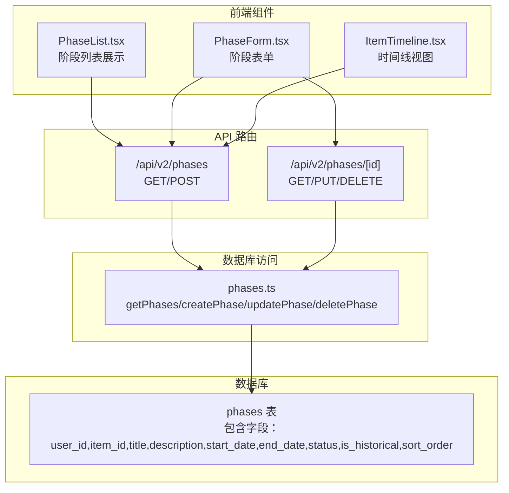
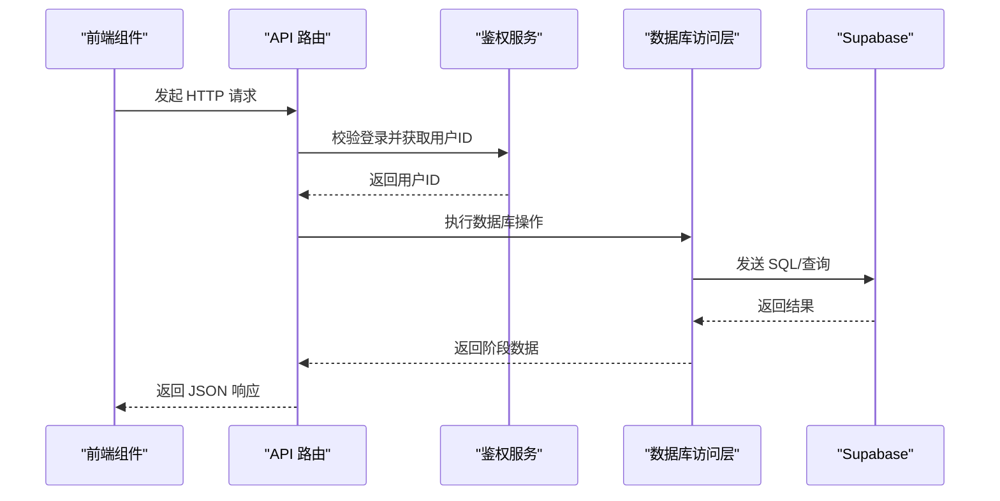
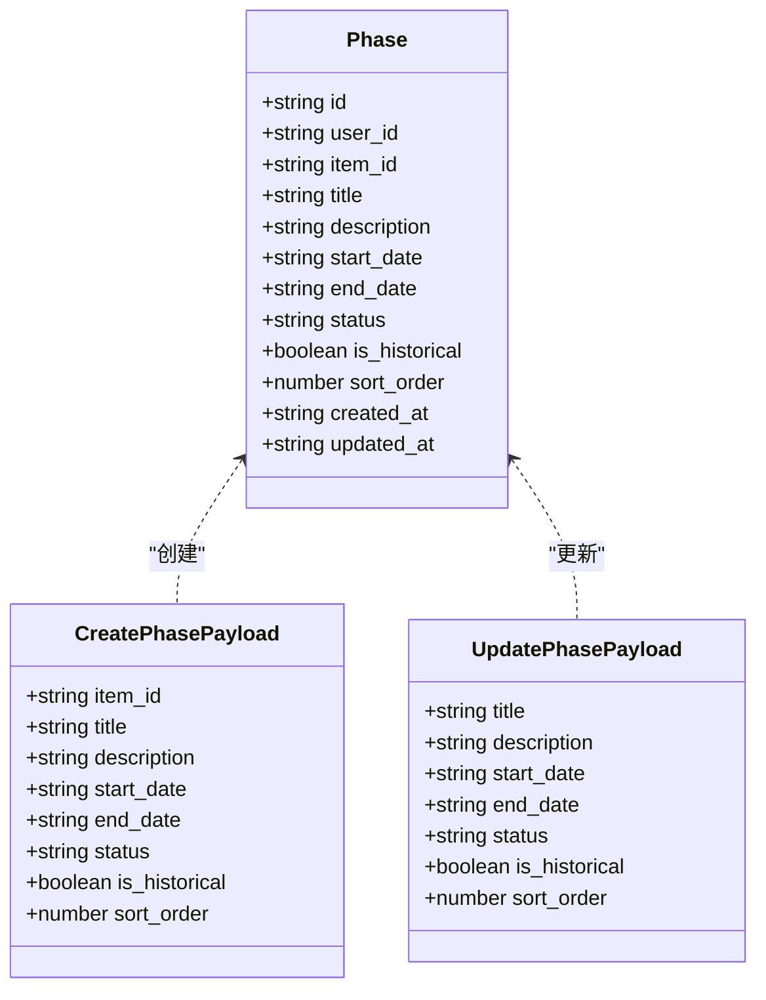
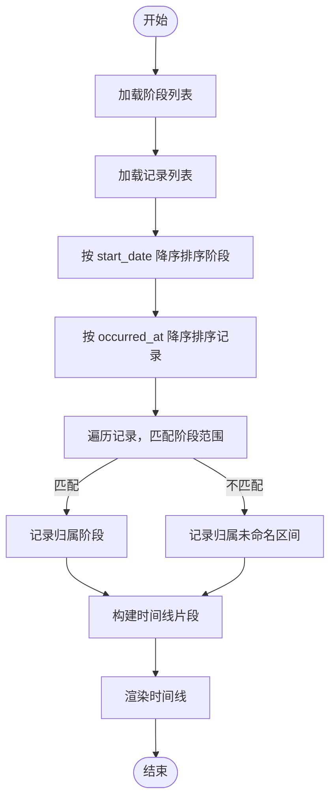
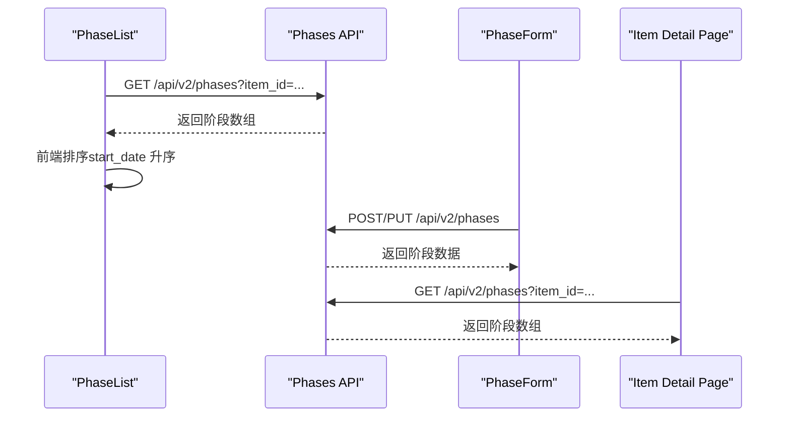
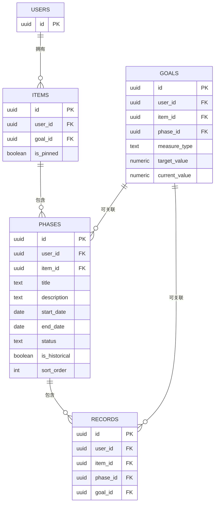

# 相册API

<cite>
**本文引用的文件**
- [src/app/api/v2/phases/route.ts](file://src/app/api/v2/phases/route.ts)
- [src/app/api/v2/phases/[id]/route.ts](file://src/app/api/v2/phases/[id]/route.ts)
- [src/lib/db/phases.ts](file://src/lib/db/phases.ts)
- [src/types/teto.ts](file://src/types/teto.ts)
- [src/app/(dashboard)/items/components/PhaseList.tsx](file://src/app/(dashboard)/items/components/PhaseList.tsx)
- [src/app/(dashboard)/items/components/PhaseForm.tsx](file://src/app/(dashboard)/items/components/PhaseForm.tsx)
- [src/app/(dashboard)/items/components/ItemTimeline.tsx](file://src/app/(dashboard)/items/components/ItemTimeline.tsx)
- [src/app/(dashboard)/items/[id]/page.tsx](file://src/app/(dashboard)/items/[id]/page.tsx)
- [sql/003_teto_1_4_phases_and_goals.sql](file://sql/003_teto_1_4_phases_and_goals.sql)
- [sql/005_teto_1_4_status_chinese_migration.sql](file://sql/005_teto_1_4_status_chinese_migration.sql)
- [sql/009_teto_1_4_topic_module_upgrade.sql](file://sql/009_teto_1_4_topic_module_upgrade.sql)
</cite>

## 目录
1. [简介](#简介)
2. [项目结构](#项目结构)
3. [核心组件](#核心组件)
4. [架构概览](#架构概览)
5. [详细组件分析](#详细组件分析)
6. [依赖分析](#依赖分析)
7. [性能考虑](#性能考虑)
8. [故障排除指南](#故障排除指南)
9. [结论](#结论)

## 简介
本文件为 TETO 项目中「相册」API（即阶段管理 API）的详细 RESTful API 文档。该 API 负责管理项目中的阶段划分与时间线管理，涵盖以下能力：
- 阶段的创建、更新、删除与查询
- 阶段基本信息管理（标题、描述、状态）
- 阶段排序机制（sort_order）
- 时间范围设置（start_date、end_date）
- 阶段与事项的关联逻辑（item_id）
- 阶段生命周期管理与时间线一致性保证
- 历史阶段标记（is_historical）

该 API 采用 Next.js App Router 的路由约定，配合 Supabase 客户端访问数据库，并通过行级安全策略保障数据隔离。

## 项目结构
相册 API 的核心由三层组成：
- 路由层：处理 HTTP 请求与响应，执行鉴权与参数校验
- 数据访问层：封装数据库操作（查询、插入、更新、删除）
- 类型定义层：统一前后端数据契约与枚举

**图表来源**
- [src/app/api/v2/phases/route.ts:1-72](file://src/app/api/v2/phases/route.ts#L1-L72)
- [src/app/api/v2/phases/[id]/route.ts](file://src/app/api/v2/phases/[id]/route.ts#L1-L67)
- [src/lib/db/phases.ts:1-186](file://src/lib/db/phases.ts#L1-L186)
- [sql/003_teto_1_4_phases_and_goals.sql:28-46](file://sql/003_teto_1_4_phases_and_goals.sql#L28-L46)

**章节来源**
- [src/app/api/v2/phases/route.ts:1-72](file://src/app/api/v2/phases/route.ts#L1-L72)
- [src/app/api/v2/phases/[id]/route.ts](file://src/app/api/v2/phases/[id]/route.ts#L1-L67)
- [src/lib/db/phases.ts:1-186](file://src/lib/db/phases.ts#L1-L186)
- [sql/003_teto_1_4_phases_and_goals.sql:28-46](file://sql/003_teto_1_4_phases_and_goals.sql#L28-L46)

## 核心组件
- 阶段查询接口：支持按事项、状态、历史标记过滤；默认按排序字段与创建时间排序
- 阶段创建接口：校验必填字段并检查事项归属；默认状态为进行中
- 阶段更新接口：按需更新标题、描述、时间范围、状态、历史标记与排序
- 阶段删除接口：基于用户与阶段 ID 删除
- 前端集成：列表组件负责拉取与筛选，表单组件负责创建与更新，时间线组件负责将记录归入阶段

**章节来源**
- [src/app/api/v2/phases/route.ts:7-30](file://src/app/api/v2/phases/route.ts#L7-L30)
- [src/app/api/v2/phases/route.ts:32-71](file://src/app/api/v2/phases/route.ts#L32-L71)
- [src/app/api/v2/phases/[id]/route.ts](file://src/app/api/v2/phases/[id]/route.ts#L6-L27)
- [src/app/api/v2/phases/[id]/route.ts](file://src/app/api/v2/phases/[id]/route.ts#L29-L47)
- [src/app/api/v2/phases/[id]/route.ts](file://src/app/api/v2/phases/[id]/route.ts#L49-L66)
- [src/lib/db/phases.ts:10-40](file://src/lib/db/phases.ts#L10-L40)
- [src/lib/db/phases.ts:101-128](file://src/lib/db/phases.ts#L101-L128)
- [src/lib/db/phases.ts:137-166](file://src/lib/db/phases.ts#L137-L166)
- [src/lib/db/phases.ts:173-185](file://src/lib/db/phases.ts#L173-L185)

## 架构概览
相册 API 的调用链路如下：

**图表来源**
- [src/app/api/v2/phases/route.ts:1-72](file://src/app/api/v2/phases/route.ts#L1-L72)
- [src/app/api/v2/phases/[id]/route.ts](file://src/app/api/v2/phases/[id]/route.ts#L1-L67)
- [src/lib/db/phases.ts:1-186](file://src/lib/db/phases.ts#L1-L186)

## 详细组件分析

### 阶段查询接口（GET /api/v2/phases）
- 功能：根据查询参数返回阶段列表
- 支持参数：
  - item_id：按事项过滤
  - status：按状态过滤（进行中/已结束/停滞）
  - is_historical：按历史标记过滤（true/false）
- 排序规则：先按 sort_order 升序，再按 created_at 降序
- 成功响应：返回 data 数组

请求示例
- GET /api/v2/phases?item_id=xxx&status=进行中&is_historical=false

响应示例
- 200 OK
  - {
      "data": [
        {
          "id": "uuid",
          "user_id": "uuid",
          "item_id": "uuid",
          "title": "字符串",
          "description": "字符串或null",
          "start_date": "YYYY-MM-DD或null",
          "end_date": "YYYY-MM-DD或null",
          "status": "进行中|已结束|停滞",
          "is_historical": true|false,
          "sort_order": 0,
          "created_at": "时间戳",
          "updated_at": "时间戳"
        }
      ]
    }

错误处理
- 401 未授权：用户未登录或获取用户信息失败
- 500 服务器错误：其他异常

**章节来源**
- [src/app/api/v2/phases/route.ts:7-30](file://src/app/api/v2/phases/route.ts#L7-L30)
- [src/lib/db/phases.ts:10-40](file://src/lib/db/phases.ts#L10-L40)

### 阶段创建接口（POST /api/v2/phases）
- 功能：为指定事项创建阶段
- 必填字段：item_id、title
- 校验逻辑：
  - 校验登录状态
  - 校验 item_id 是否属于当前用户
- 默认值：
  - status：进行中
  - is_historical：false
  - sort_order：0
- 成功响应：返回创建的阶段对象

请求示例
- POST /api/v2/phases
- Content-Type: application/json
  - {
      "item_id": "uuid",
      "title": "阶段标题",
      "description": "描述",
      "start_date": "YYYY-MM-DD",
      "end_date": "YYYY-MM-DD",
      "status": "进行中|已结束|停滞",
      "is_historical": false,
      "sort_order": 0
    }

响应示例
- 201 Created
  - {
      "data": { ... }
    }
- 400 参数错误：缺少必填字段
- 404 事项不存在或不属于当前用户
- 401/500 错误

**章节来源**
- [src/app/api/v2/phases/route.ts:32-71](file://src/app/api/v2/phases/route.ts#L32-L71)
- [src/lib/db/phases.ts:101-128](file://src/lib/db/phases.ts#L101-L128)

### 阶段详情接口（GET /api/v2/phases/[id]）
- 功能：按 ID 获取单个阶段
- 校验：确保阶段属于当前用户
- 成功响应：返回 data 对象

请求示例
- GET /api/v2/phases/uuid

响应示例
- 200 OK
  - {
      "data": { ... }
    }
- 404 阶段不存在或不属于当前用户
- 401/500 错误

**章节来源**
- [src/app/api/v2/phases/[id]/route.ts](file://src/app/api/v2/phases/[id]/route.ts#L6-L27)
- [src/lib/db/phases.ts:48-66](file://src/lib/db/phases.ts#L48-L66)

### 阶段更新接口（PUT /api/v2/phases/[id]）
- 功能：按需更新阶段信息
- 支持字段：title、description、start_date、end_date、status、is_historical、sort_order
- 成功响应：返回更新后的阶段对象

请求示例
- PUT /api/v2/phases/uuid
- Content-Type: application/json
  - {
      "status": "已结束",
      "sort_order": 1
    }

响应示例
- 200 OK
  - {
      "data": { ... }
    }
- 401/500 错误

**章节来源**
- [src/app/api/v2/phases/[id]/route.ts](file://src/app/api/v2/phases/[id]/route.ts#L29-L47)
- [src/lib/db/phases.ts:137-166](file://src/lib/db/phases.ts#L137-L166)

### 阶段删除接口（DELETE /api/v2/phases/[id]）
- 功能：删除指定阶段
- 校验：确保阶段属于当前用户
- 成功响应：返回被删除的阶段 ID

请求示例
- DELETE /api/v2/phases/uuid

响应示例
- 200 OK
  - {
      "data": { "id": "uuid" }
    }
- 401/500 错误

**章节来源**
- [src/app/api/v2/phases/[id]/route.ts](file://src/app/api/v2/phases/[id]/route.ts#L49-L66)
- [src/lib/db/phases.ts:173-185](file://src/lib/db/phases.ts#L173-L185)

### 阶段数据模型与状态
- 阶段状态枚举：进行中、已结束、停滞
- 阶段字段：
  - user_id：所属用户
  - item_id：所属事项
  - title/description：标题与描述
  - start_date/end_date：时间范围
  - status：阶段状态
  - is_historical：历史补录标记
  - sort_order：排序权重
  - created_at/updated_at：时间戳

**图表来源**
- [src/types/teto.ts:337-354](file://src/types/teto.ts#L337-L354)
- [src/types/teto.ts:392-413](file://src/types/teto.ts#L392-L413)

**章节来源**
- [src/types/teto.ts:307-354](file://src/types/teto.ts#L307-L354)
- [src/types/teto.ts:392-413](file://src/types/teto.ts#L392-L413)

### 时间线一致性与记录归属
- 记录可选归属阶段（records.phase_id）
- 时间线渲染逻辑：根据记录发生时间判断其所属阶段，未匹配到阶段的记录归入「未命名」区间
- 阶段状态颜色映射：进行中/已结束/停滞对应不同视觉样式

**图表来源**
- [src/app/(dashboard)/items/components/ItemTimeline.tsx](file://src/app/(dashboard)/items/components/ItemTimeline.tsx#L39-L104)

**章节来源**
- [src/app/(dashboard)/items/components/ItemTimeline.tsx](file://src/app/(dashboard)/items/components/ItemTimeline.tsx#L30-L104)
- [sql/009_teto_1_4_topic_module_upgrade.sql:83-87](file://sql/009_teto_1_4_topic_module_upgrade.sql#L83-L87)

### 前端交互与生命周期
- 列表组件：按 item_id 加载阶段，前端按 start_date 升序排序展示
- 表单组件：支持创建与更新阶段，提交时调用相应 API
- 时间线页面：展示阶段与记录的时间线关系

**图表来源**
- [src/app/(dashboard)/items/components/PhaseList.tsx](file://src/app/(dashboard)/items/components/PhaseList.tsx#L25-L46)
- [src/app/(dashboard)/items/components/PhaseForm.tsx](file://src/app/(dashboard)/items/components/PhaseForm.tsx#L84-L146)
- [src/app/(dashboard)/items/[id]/page.tsx](file://src/app/(dashboard)/items/[id]/page.tsx#L622-L641)

**章节来源**
- [src/app/(dashboard)/items/components/PhaseList.tsx](file://src/app/(dashboard)/items/components/PhaseList.tsx#L19-L50)
- [src/app/(dashboard)/items/components/PhaseForm.tsx](file://src/app/(dashboard)/items/components/PhaseForm.tsx#L34-L146)
- [src/app/(dashboard)/items/[id]/page.tsx](file://src/app/(dashboard)/items/[id]/page.tsx#L622-L641)

## 依赖分析
- 数据库表结构：phases 表包含用户、事项、时间范围、状态、历史标记与排序字段
- 索引策略：对 user_id/item_id/status/is_historical 等常用查询字段建立索引
- 状态约束：通过 CHECK 约束限制状态枚举值
- RLS 策略：确保每个用户只能访问自己的阶段数据

**图表来源**
- [sql/003_teto_1_4_phases_and_goals.sql:14-46](file://sql/003_teto_1_4_phases_and_goals.sql#L14-L46)
- [sql/009_teto_1_4_topic_module_upgrade.sql:16-57](file://sql/009_teto_1_4_topic_module_upgrade.sql#L16-L57)
- [sql/009_teto_1_4_topic_module_upgrade.sql:83-87](file://sql/009_teto_1_4_topic_module_upgrade.sql#L83-L87)

**章节来源**
- [sql/003_teto_1_4_phases_and_goals.sql:28-46](file://sql/003_teto_1_4_phases_and_goals.sql#L28-L46)
- [sql/005_teto_1_4_status_chinese_migration.sql:28-37](file://sql/005_teto_1_4_status_chinese_migration.sql#L28-L37)
- [sql/009_teto_1_4_topic_module_upgrade.sql:56-87](file://sql/009_teto_1_4_topic_module_upgrade.sql#L56-L87)

## 性能考虑
- 查询排序：默认按 sort_order 升序、created_at 降序，减少前端二次排序成本
- 索引优化：phases 表针对 user_id、item_id、status、is_historical 建立索引，提升过滤查询效率
- 前端缓存：列表组件在刷新键变化时重新拉取，避免重复请求
- 数据量控制：建议在前端分页或限制返回条目数，避免一次性加载过多阶段

[本节为通用性能建议，无需特定文件来源]

## 故障排除指南
常见错误与排查步骤
- 401 未授权
  - 确认用户已登录且能正确获取用户 ID
  - 检查鉴权中间件与会话状态
- 404 事项不存在或不属于当前用户
  - 确认 item_id 正确且属于当前用户
  - 检查 Supabase RLS 策略是否生效
- 400 参数错误（缺少必填字段）
  - 确认请求体包含 item_id 与 title
- 500 服务器错误
  - 查看后端日志定位具体异常
  - 检查数据库连接与权限

**章节来源**
- [src/app/api/v2/phases/route.ts:23-29](file://src/app/api/v2/phases/route.ts#L23-L29)
- [src/app/api/v2/phases/route.ts:54-60](file://src/app/api/v2/phases/route.ts#L54-L60)
- [src/app/api/v2/phases/[id]/route.ts](file://src/app/api/v2/phases/[id]/route.ts#L20-L26)

## 结论
相册 API 提供了完整的阶段生命周期管理能力，结合前端时间线视图与记录归属，实现了清晰的时间线一致性。通过合理的数据库索引、RLS 策略与排序规则，系统在功能完整性与性能之间取得了平衡。建议在生产环境中配合缓存与分页策略进一步优化用户体验。