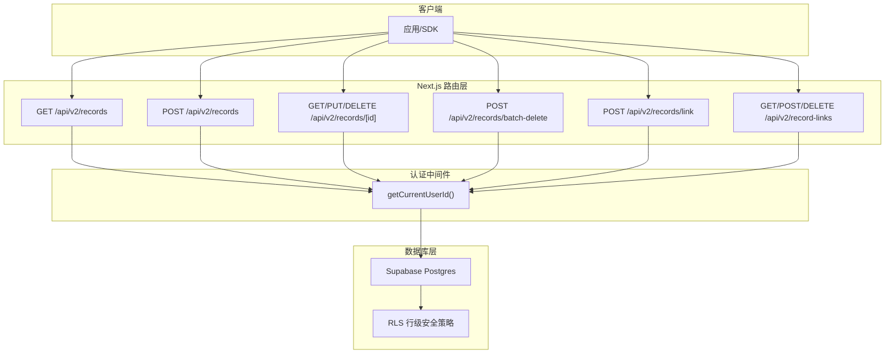
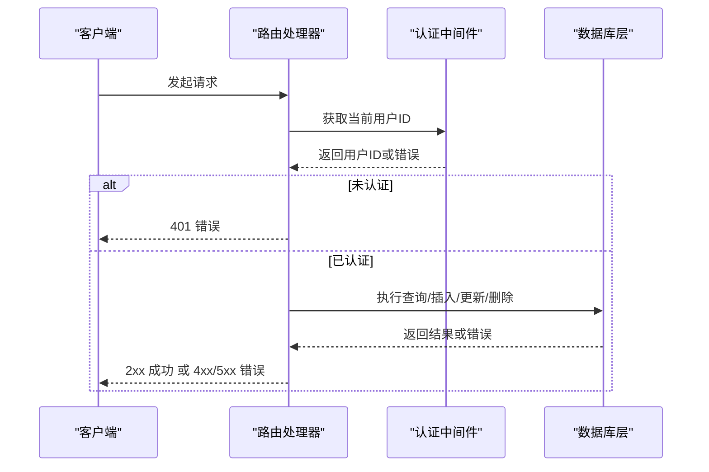
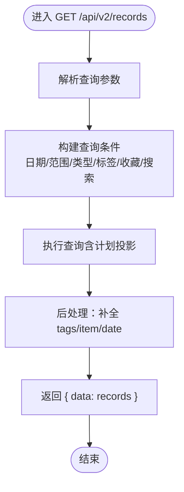
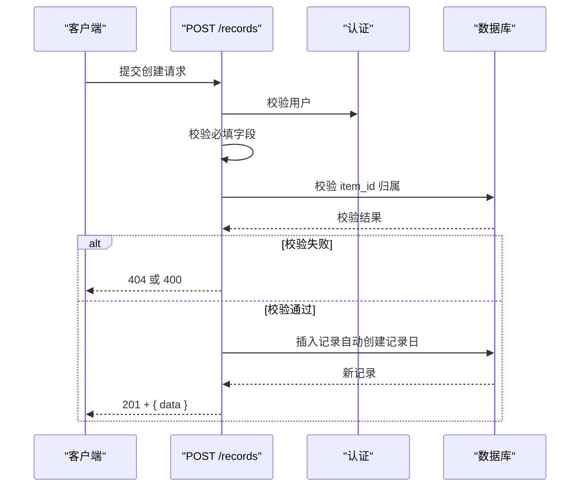
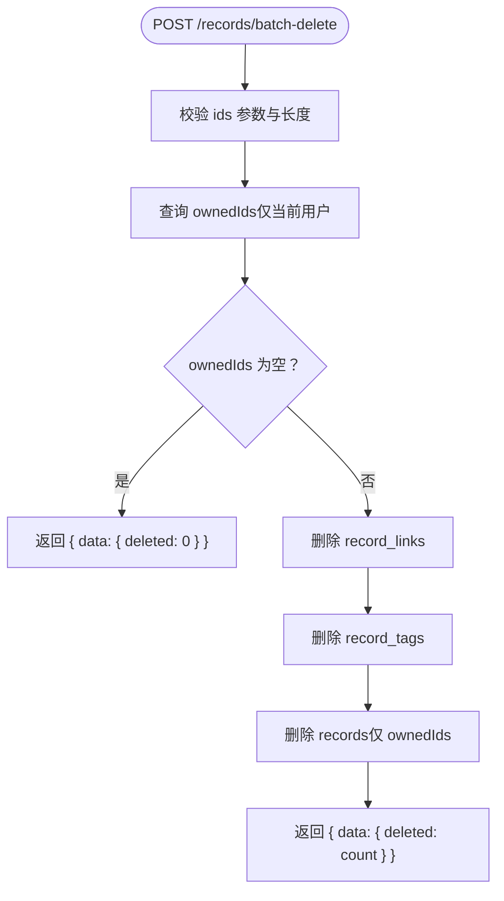
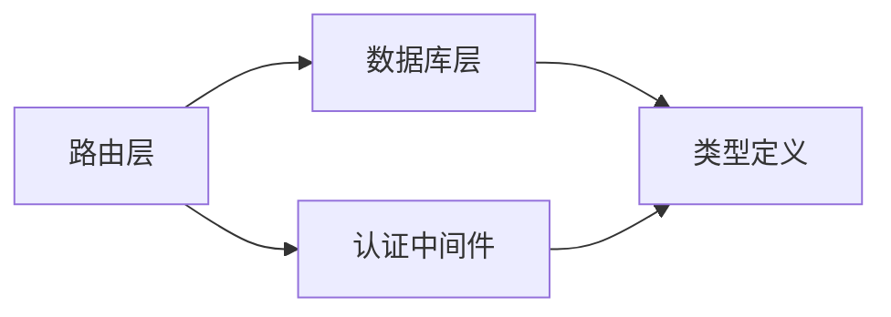
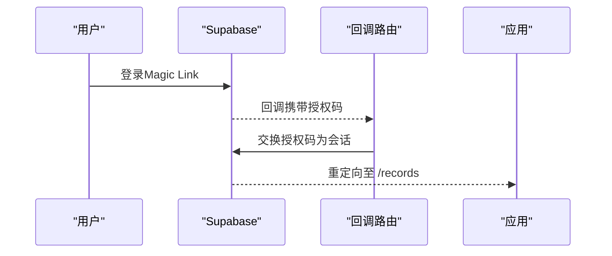

# 记录API

<cite>
**本文引用的文件**
- [src/app/api/v2/records/route.ts](file://src/app/api/v2/records/route.ts)
- [src/app/api/v2/records/[id]/route.ts](file://src/app/api/v2/records/[id]/route.ts)
- [src/app/api/v2/records/batch-delete/route.ts](file://src/app/api/v2/records/batch-delete/route.ts)
- [src/app/api/v2/records/link/route.ts](file://src/app/api/v2/records/link/route.ts)
- [src/app/api/v2/record-links/route.ts](file://src/app/api/v2/record-links/route.ts)
- [src/lib/db/records.ts](file://src/lib/db/records.ts)
- [src/lib/db/record-links.ts](file://src/lib/db/record-links.ts)
- [src/types/teto.ts](file://src/types/teto.ts)
- [src/lib/auth/server/get-current-user-id.ts](file://src/lib/auth/server/get-current-user-id.ts)
- [src/app/auth/callback/route.ts](file://src/app/auth/callback/route.ts)
</cite>

## 目录
1. [简介](#简介)
2. [项目结构](#项目结构)
3. [核心组件](#核心组件)
4. [架构总览](#架构总览)
5. [详细组件分析](#详细组件分析)
6. [依赖分析](#依赖分析)
7. [性能考虑](#性能考虑)
8. [故障排查指南](#故障排查指南)
9. [结论](#结论)
10. [附录](#附录)

## 简介
本文件为 TETO 的“记录”RESTful API 文档，覆盖个人日常记录的增删改查、批量删除、记录链接（两种关联模型）等能力。API 采用 Next.js App Router 的 server-side 路由，基于 Supabase 进行认证与数据访问，并通过行级安全策略保障数据隔离。

- 支持的功能
  - 列表查询：日期范围、单日、类型过滤、标签过滤、收藏标记、关键词搜索、限制数量
  - 创建记录：内容校验、所属项目归属检查、标签关联
  - 更新记录：部分字段更新、标签替换、所属项目归属检查
  - 删除记录：单条删除
  - 批量删除：仅删除当前用户拥有的记录，自动清理关联
  - 记录链接：微关联（一对一/多对多）与强关联（来源/目标记录）

- 认证与授权
  - 基于 Supabase 的会话认证；开发模式下可通过环境变量绕过登录
  - 所有操作均强制校验用户身份并确保数据归属

- 错误处理
  - 统一返回 { data } 或 { error } 结构
  - 明确区分 401 未认证、404 资源不存在或非本人、400 参数错误、500 服务器错误

## 项目结构
记录 API 的路由组织如下：
- 基础资源：/api/v2/records
  - GET /api/v2/records（列表查询）
  - POST /api/v2/records（创建）
  - /api/v2/records/[id]
    - GET /api/v2/records/{id}（详情）
    - PUT /api/v2/records/{id}（更新）
    - DELETE /api/v2/records/{id}（删除）
  - /api/v2/records/batch-delete（批量删除）
  - /api/v2/records/link（微关联：设置 linked_record_id）
- 关联资源：/api/v2/record-links
  - POST /api/v2/record-links（创建强关联）
  - GET /api/v2/record-links（查询某记录的所有强关联）
  - DELETE /api/v2/record-links?id=...（删除强关联）

**图示来源**
- [src/app/api/v2/records/route.ts:1-86](file://src/app/api/v2/records/route.ts#L1-L86)
- [src/app/api/v2/records/[id]/route.ts](file://src/app/api/v2/records/[id]/route.ts#L1-L87)
- [src/app/api/v2/records/batch-delete/route.ts:1-69](file://src/app/api/v2/records/batch-delete/route.ts#L1-L69)
- [src/app/api/v2/records/link/route.ts:1-78](file://src/app/api/v2/records/link/route.ts#L1-L78)
- [src/app/api/v2/record-links/route.ts:1-100](file://src/app/api/v2/record-links/route.ts#L1-L100)
- [src/lib/auth/server/get-current-user-id.ts:1-85](file://src/lib/auth/server/get-current-user-id.ts#L1-L85)

**章节来源**
- [src/app/api/v2/records/route.ts:1-86](file://src/app/api/v2/records/route.ts#L1-L86)
- [src/app/api/v2/records/[id]/route.ts](file://src/app/api/v2/records/[id]/route.ts#L1-L87)
- [src/app/api/v2/records/batch-delete/route.ts:1-69](file://src/app/api/v2/records/batch-delete/route.ts#L1-L69)
- [src/app/api/v2/records/link/route.ts:1-78](file://src/app/api/v2/records/link/route.ts#L1-L78)
- [src/app/api/v2/record-links/route.ts:1-100](file://src/app/api/v2/record-links/route.ts#L1-L100)

## 核心组件
- 认证与用户标识
  - 通过 getCurrentUserId 获取当前用户 ID，开发模式下可直接返回固定用户 ID
  - 未登录或获取用户失败时统一返回 401
- 记录服务
  - 列表查询：支持日期/范围/类型/标签/收藏/搜索/限制
  - 创建：自动创建记录日、默认字段填充、标签关联
  - 更新：部分字段更新、标签替换、归属检查
  - 删除：单条删除
- 批量删除
  - 校验参数、限制最大数量、验证所有权、清理 record_links 与 record_tags、再删除 records
- 记录链接
  - 微关联：设置 linked_record_id（一对一/多对多），支持取消
  - 强关联：record_links 表，支持来源/目标与多种 link_type

**章节来源**
- [src/lib/auth/server/get-current-user-id.ts:1-85](file://src/lib/auth/server/get-current-user-id.ts#L1-L85)
- [src/lib/db/records.ts:1-328](file://src/lib/db/records.ts#L1-L328)
- [src/lib/db/record-links.ts:1-101](file://src/lib/db/record-links.ts#L1-L101)
- [src/types/teto.ts:1-516](file://src/types/teto.ts#L1-L516)

## 架构总览
记录 API 的调用链路如下：

**图示来源**
- [src/app/api/v2/records/route.ts:7-42](file://src/app/api/v2/records/route.ts#L7-L42)
- [src/app/api/v2/records/[id]/route.ts](file://src/app/api/v2/records/[id]/route.ts#L7-L28)
- [src/lib/auth/server/get-current-user-id.ts:12-37](file://src/lib/auth/server/get-current-user-id.ts#L12-L37)

## 详细组件分析

### 记录列表查询（GET /api/v2/records）
- 功能要点
  - 支持按单日、日期范围、类型、标签、收藏、关键词搜索、限制数量
  - 计划类记录支持“时间锚点投影”到指定日期范围
  - 返回记录附带标签与所属项目信息
- 查询参数
  - date: 单日过滤（含计划投影）
  - date_from/date_to: 日期范围过滤（含计划投影）
  - item_id: 所属项目过滤
  - type: 记录类型过滤
  - tag_id: 标签过滤
  - is_starred: 收藏标记过滤
  - search: 内容模糊搜索
  - limit: 结果数量限制，默认 500
- 响应
  - { data: Record[] }
  - Record 附带 tags、item、date 等字段
- 错误
  - 401 未认证
  - 500 服务器错误

**图示来源**
- [src/app/api/v2/records/route.ts:7-42](file://src/app/api/v2/records/route.ts#L7-L42)
- [src/lib/db/records.ts:176-300](file://src/lib/db/records.ts#L176-L300)

**章节来源**
- [src/app/api/v2/records/route.ts:7-42](file://src/app/api/v2/records/route.ts#L7-L42)
- [src/lib/db/records.ts:176-300](file://src/lib/db/records.ts#L176-L300)
- [src/types/teto.ts:235-245](file://src/types/teto.ts#L235-L245)

### 创建记录（POST /api/v2/records）
- 请求体
  - 必填：content、date
  - 可选：type、occurred_at、status、mood、energy、result、note、item_id、phase_id、goal_id、sort_order、is_starred、cost、metric_*、duration_minutes、raw_input、parsed_semantic、time_anchor_date、linked_record_id、location、people、batch_id、lifecycle_status、tag_ids
- 校验逻辑
  - 校验 content 与 date 必填
  - 若提供 item_id，需校验该项目属于当前用户
- 响应
  - 201 Created，返回 { data: Record }
- 错误
  - 400 参数缺失/非法
  - 404 项目不存在或不属于当前用户
  - 401 未认证
  - 500 服务器错误

**图示来源**
- [src/app/api/v2/records/route.ts:44-85](file://src/app/api/v2/records/route.ts#L44-L85)
- [src/lib/db/records.ts:11-46](file://src/lib/db/records.ts#L11-L46)

**章节来源**
- [src/app/api/v2/records/route.ts:44-85](file://src/app/api/v2/records/route.ts#L44-L85)
- [src/lib/db/records.ts:11-46](file://src/lib/db/records.ts#L11-L46)
- [src/types/teto.ts:133-162](file://src/types/teto.ts#L133-L162)

### 更新记录（PUT /api/v2/records/{id}）
- 请求体
  - 支持部分字段更新（content、type、occurred_at、status、mood、energy、result、note、item_id、phase_id、goal_id、sort_order、is_starred、cost、metric_*、duration_minutes、raw_input、parsed_semantic、time_anchor_date、linked_record_id、location、people、batch_id、lifecycle_status、tag_ids）
- 校验逻辑
  - 若提供 item_id，需校验该项目属于当前用户
  - 更新后若提供 tag_ids，则替换标签关联
- 响应
  - 200 OK，返回 { data: Record }
- 错误
  - 404 记录不存在或不属于当前用户
  - 401 未认证
  - 500 服务器错误

**章节来源**
- [src/app/api/v2/records/[id]/route.ts](file://src/app/api/v2/records/[id]/route.ts#L30-L67)
- [src/lib/db/records.ts:52-111](file://src/lib/db/records.ts#L52-L111)

### 删除记录（DELETE /api/v2/records/{id}）
- 行为
  - 仅删除当前用户拥有的记录
- 响应
  - 200 OK，返回 { data: { id } }
- 错误
  - 404 记录不存在或不属于当前用户
  - 401 未认证
  - 500 服务器错误

**章节来源**
- [src/app/api/v2/records/[id]/route.ts](file://src/app/api/v2/records/[id]/route.ts#L69-L86)
- [src/lib/db/records.ts:116-128](file://src/lib/db/records.ts#L116-L128)

### 批量删除（POST /api/v2/records/batch-delete）
- 请求体
  - { ids: string[] }（最多 200 条）
- 行为
  - 校验参数与数量
  - 先验证所有权（仅操作当前用户记录）
  - 清理 record_links（避免 RLS 阻止 CASCADE）
  - 清理 record_tags
  - 删除 records
- 响应
  - 200 OK，返回 { data: { deleted: number } }
- 错误
  - 400 参数缺失/非法/超限
  - 401 未认证
  - 500 服务器错误

**图示来源**
- [src/app/api/v2/records/batch-delete/route.ts:10-68](file://src/app/api/v2/records/batch-delete/route.ts#L10-L68)

**章节来源**
- [src/app/api/v2/records/batch-delete/route.ts:10-68](file://src/app/api/v2/records/batch-delete/route.ts#L10-L68)

### 微关联（设置 linked_record_id）（POST /api/v2/records/link）
- 请求体
  - { record_id: string; linked_record_id: string | null }
  - linked_record_id 为 null 表示取消关联
- 校验逻辑
  - 校验 record_id 存在且属于当前用户
  - 若 linked_record_id 非空，校验其存在且属于当前用户，且不能自关联
  - 更新 record 的 linked_record_id
- 响应
  - 200 OK，返回 { data: { record_id, linked_record_id } }
- 错误
  - 400 缺少参数/自关联
  - 404 记录不存在或不属于当前用户
  - 401 未认证
  - 500 服务器错误

**章节来源**
- [src/app/api/v2/records/link/route.ts:12-77](file://src/app/api/v2/records/link/route.ts#L12-L77)

### 强关联（record_links）（POST/GET/DELETE /api/v2/record-links）
- POST 创建强关联
  - 请求体：{ source_id, target_id, link_type }
  - link_type 必须为：completes、derived_from、postponed_from、related_to
  - 不能自关联
  - 返回新建关联
- GET 查询某记录的所有强关联
  - 查询参数：record_id（必填）
  - 返回包含“对方记录摘要”的关联列表
- DELETE 删除强关联
  - 查询参数：id（必填）
- 错误
  - 400 缺少参数/非法 link_type/自关联
  - 404 关联不存在或不属于当前用户
  - 401 未认证
  - 500 服务器错误

**章节来源**
- [src/app/api/v2/record-links/route.ts:13-99](file://src/app/api/v2/record-links/route.ts#L13-L99)
- [src/lib/db/record-links.ts:7-101](file://src/lib/db/record-links.ts#L7-L101)
- [src/types/teto.ts:15-16](file://src/types/teto.ts#L15-L16)

## 依赖分析
- 路由层依赖认证中间件获取用户 ID
- 数据访问层依赖 Supabase 客户端与 RLS
- 类型定义集中于 types/teto.ts，保证前后端一致性

**图示来源**
- [src/app/api/v2/records/route.ts:1-5](file://src/app/api/v2/records/route.ts#L1-L5)
- [src/lib/auth/server/get-current-user-id.ts:1-10](file://src/lib/auth/server/get-current-user-id.ts#L1-L10)
- [src/types/teto.ts:1-10](file://src/types/teto.ts#L1-L10)

**章节来源**
- [src/app/api/v2/records/route.ts:1-5](file://src/app/api/v2/records/route.ts#L1-L5)
- [src/lib/auth/server/get-current-user-id.ts:1-10](file://src/lib/auth/server/get-current-user-id.ts#L1-L10)
- [src/types/teto.ts:1-10](file://src/types/teto.ts#L1-L10)

## 性能考虑
- 列表查询
  - 使用批量预加载项目信息，避免 N+1 查询
  - 对日期范围与标签过滤使用组合条件与 in 查询
  - 默认 limit 为 500，避免一次性返回过多数据
- 批量删除
  - 先验证所有权，再清理关联，最后删除记录，减少无效写入
  - 限制单次删除数量上限，防止大事务阻塞
- 认证
  - 仅在必要时进行用户校验，避免重复调用

**章节来源**
- [src/lib/db/records.ts:286-300](file://src/lib/db/records.ts#L286-L300)
- [src/app/api/v2/records/batch-delete/route.ts:19-21](file://src/app/api/v2/records/batch-delete/route.ts#L19-L21)

## 故障排查指南
- 401 未认证
  - 确认已登录或开启开发模式
  - 开发模式需设置 NEXT_PUBLIC_DEV_MODE=true 与 NEXT_PUBLIC_DEV_USER_ID
- 404 资源不存在或不属于当前用户
  - 检查记录/项目/关联是否存在且归属正确
- 400 参数错误
  - 检查必填字段、参数类型与取值范围
- 500 服务器错误
  - 查看服务端日志，确认 Supabase 连接与 RLS 配置

**章节来源**
- [src/lib/auth/server/get-current-user-id.ts:12-37](file://src/lib/auth/server/get-current-user-id.ts#L12-L37)
- [src/app/api/v2/records/route.ts:35-41](file://src/app/api/v2/records/route.ts#L35-L41)
- [src/app/api/v2/records/[id]/route.ts](file://src/app/api/v2/records/[id]/route.ts#L21-L27)

## 结论
本记录 API 提供了完整的 CRUD、批量删除与两类记录关联能力，具备完善的参数校验、归属检查与错误处理机制。通过类型定义与数据库层的协同，确保了数据一致性与安全性。建议在生产环境中合理设置 limit 与批量上限，并结合缓存与索引进一步优化查询性能。

## 附录

### 认证与登录流程
- 开发模式
  - 设置 NEXT_PUBLIC_DEV_MODE=true 与 NEXT_PUBLIC_DEV_USER_ID
  - 跳过登录，直接使用固定用户 ID
- 正式模式
  - 通过 Supabase 登录，回调路由将交换临时授权码为会话

**图示来源**
- [src/app/auth/callback/route.ts:4-17](file://src/app/auth/callback/route.ts#L4-L17)
- [src/lib/auth/server/get-current-user-id.ts:12-37](file://src/lib/auth/server/get-current-user-id.ts#L12-L37)