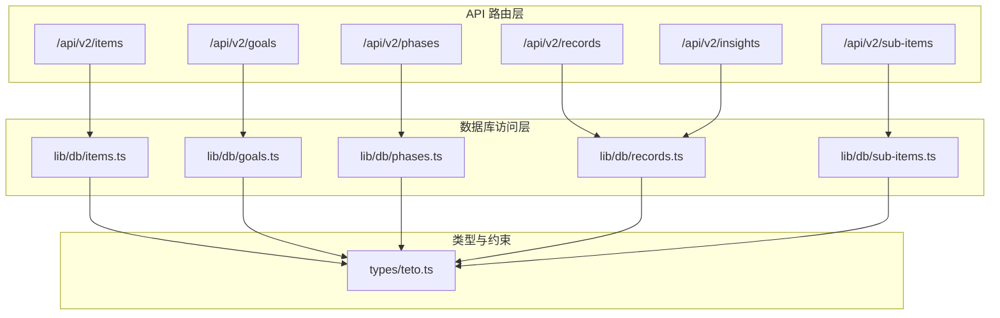
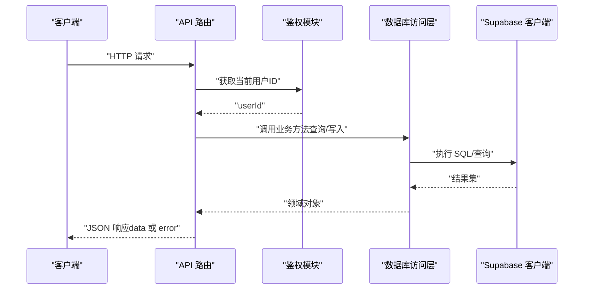
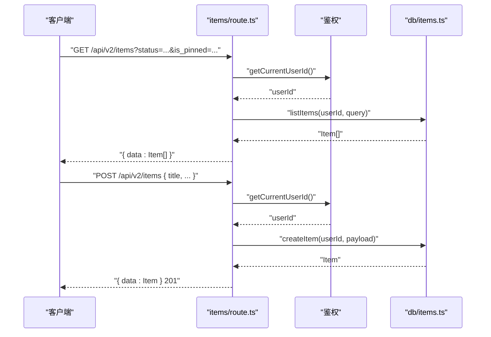
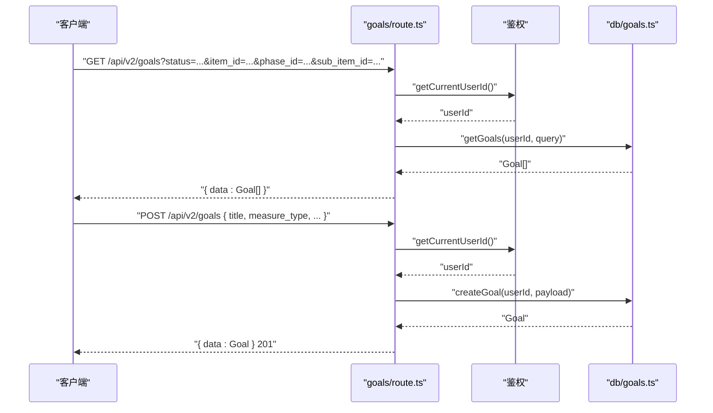
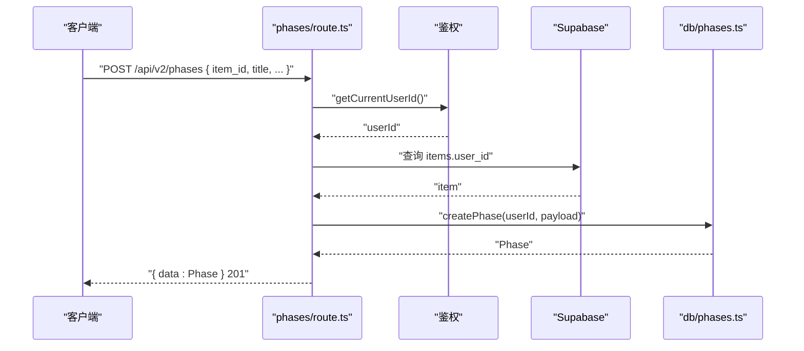
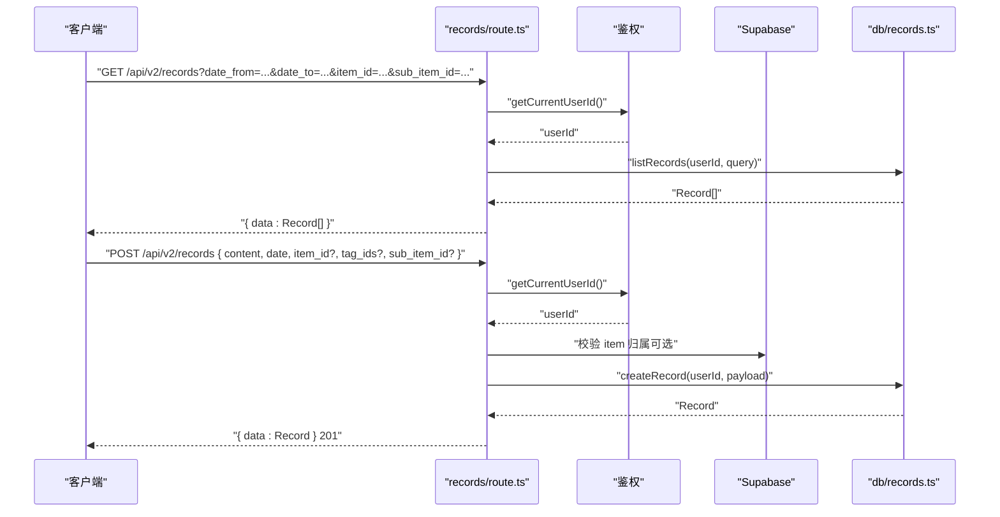
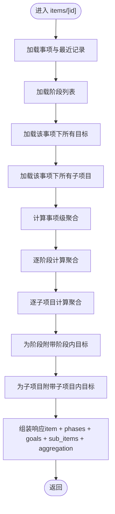
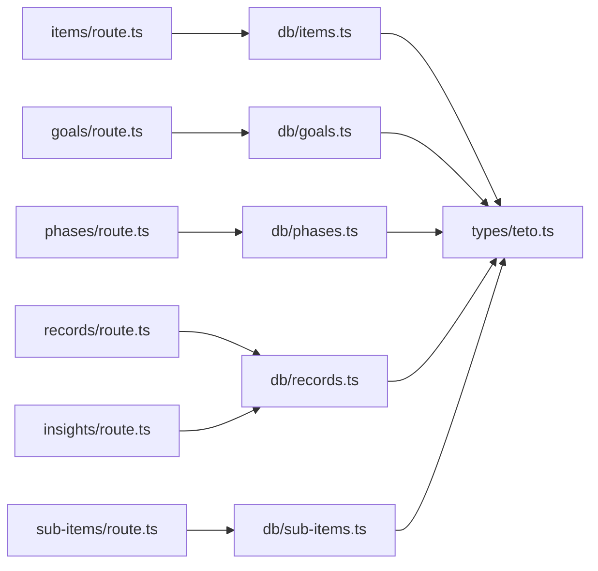
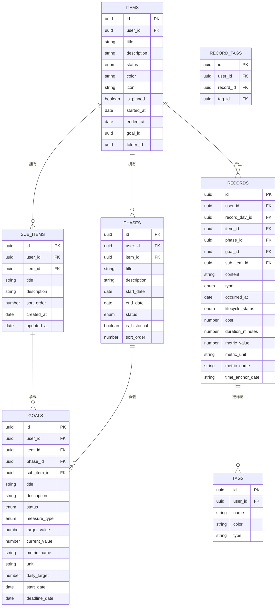

# 项目API

<cite>
**本文引用的文件**
- [src/app/api/v2/items/route.ts](file://src/app/api/v2/items/route.ts)
- [src/app/api/v2/goals/route.ts](file://src/app/api/v2/goals/route.ts)
- [src/app/api/v2/phases/route.ts](file://src/app/api/v2/phases/route.ts)
- [src/app/api/v2/records/route.ts](file://src/app/api/v2/records/route.ts)
- [src/app/api/v2/insights/route.ts](file://src/app/api/v2/insights/route.ts)
- [src/app/api/v2/sub-items/route.ts](file://src/app/api/v2/sub-items/route.ts)
- [src/app/api/v2/sub-items/[id]/route.ts](file://src/app/api/v2/sub-items/[id]/route.ts)
- [src/app/api/v2/sub-items/[id]/promote/route.ts](file://src/app/api/v2/sub-items/[id]/promote/route.ts)
- [src/lib/db/items.ts](file://src/lib/db/items.ts)
- [src/lib/db/goals.ts](file://src/lib/db/goals.ts)
- [src/lib/db/phases.ts](file://src/lib/db/phases.ts)
- [src/lib/db/records.ts](file://src/lib/db/records.ts)
- [src/lib/db/sub-items.ts](file://src/lib/db/sub-items.ts)
- [src/types/teto.ts](file://src/types/teto.ts)
</cite>

## 更新摘要
**所做更改**
- 新增子项目（Sub-Items）API 章节，涵盖完整的子项目管理功能
- 添加子项目 CRUD 操作接口文档
- 新增子项目升格为独立事项的功能说明
- 更新数据模型关系图，包含子项目实体
- 扩展项目详情聚合功能，支持子项目关联数据

## 目录
1. [简介](#简介)
2. [项目结构](#项目结构)
3. [核心组件](#核心组件)
4. [架构总览](#架构总览)
5. [详细组件分析](#详细组件分析)
6. [子项目API](#子项目api)
7. [依赖分析](#依赖分析)
8. [性能考虑](#性能考虑)
9. [故障排查指南](#故障排查指南)
10. [结论](#结论)
11. [附录](#附录)

## 简介
本文件为 TETO 项目 API 的全面 RESTful 文档，聚焦"长期目标与项目跟踪"能力，覆盖以下主题：
- 项目（事项）的创建、查询、更新、删除
- 目标与阶段的管理、查询与关联
- 记录（含发生/计划/想法/总结）的创建、查询、更新、删除
- **新增：子项目的创建、查询、更新、删除与升格功能**
- 目标引擎相关字段与计算口径说明
- 项目生命周期管理、数据完整性约束与性能优化策略
- 请求/响应示例、权限校验、目标引擎调用与关联数据操作流程

## 项目结构
API 采用 Next.js App Router 的约定式路由，v2 版本提供清晰的资源层级：
- 事项（Items）
- 目标（Goals）
- 阶段（Phases）
- 记录（Records）
- **新增：子项目（Sub-Items）**
- 洞察（Insights）



**图表来源**
- [src/app/api/v2/items/route.ts:1-47](file://src/app/api/v2/items/route.ts#L1-L47)
- [src/app/api/v2/goals/route.ts:1-49](file://src/app/api/v2/goals/route.ts#L1-L49)
- [src/app/api/v2/phases/route.ts:1-72](file://src/app/api/v2/phases/route.ts#L1-L72)
- [src/app/api/v2/records/route.ts:1-86](file://src/app/api/v2/records/route.ts#L1-L86)
- [src/app/api/v2/sub-items/route.ts:1-54](file://src/app/api/v2/sub-items/route.ts#L1-L54)
- [src/app/api/v2/sub-items/[id]/route.ts:1-79](file://src/app/api/v2/sub-items/[id]/route.ts#L1-L79)
- [src/app/api/v2/sub-items/[id]/promote/route.ts:1-46](file://src/app/api/v2/sub-items/[id]/promote/route.ts#L1-L46)
- [src/app/api/v2/insights/route.ts:1-32](file://src/app/api/v2/insights/route.ts#L1-L32)

**章节来源**
- [src/app/api/v2/items/route.ts:1-47](file://src/app/api/v2/items/route.ts#L1-L47)
- [src/app/api/v2/goals/route.ts:1-49](file://src/app/api/v2/goals/route.ts#L1-L49)
- [src/app/api/v2/phases/route.ts:1-72](file://src/app/api/v2/phases/route.ts#L1-L72)
- [src/app/api/v2/records/route.ts:1-86](file://src/app/api/v2/records/route.ts#L1-L86)
- [src/app/api/v2/sub-items/route.ts:1-54](file://src/app/api/v2/sub-items/route.ts#L1-L54)
- [src/app/api/v2/sub-items/[id]/route.ts:1-79](file://src/app/api/v2/sub-items/[id]/route.ts#L1-L79)
- [src/app/api/v2/sub-items/[id]/promote/route.ts:1-46](file://src/app/api/v2/sub-items/[id]/promote/route.ts#L1-L46)
- [src/app/api/v2/insights/route.ts:1-32](file://src/app/api/v2/insights/route.ts#L1-L32)

## 核心组件
- 事项（Items）：项目/长期目标的承载实体，支持状态、置顶、关联目标等字段。
- 目标（Goals）：量化目标，支持布尔/数值两类度量，包含指标名称、单位、日均目标、起止日期等。
- 阶段（Phases）：目标执行的时间阶段，支持历史标记与排序。
- 记录（Records）：承载"发生/计划/想法/总结"的数据单元，支持标签、成本、时长、量化指标、生命周期状态等。
- **新增：子项目（Sub-Items）：事项下的子行动线，支持独立管理与升格为独立事项。**
- 洞察（Insights）：基于时间窗口的统计概览。

**章节来源**
- [src/types/teto.ts:76-94](file://src/types/teto.ts#L76-L94)
- [src/types/teto.ts:316-335](file://src/types/teto.ts#L316-L335)
- [src/types/teto.ts:338-354](file://src/types/teto.ts#L338-L354)
- [src/types/teto.ts:37-74](file://src/types/teto.ts#L37-L74)
- [src/types/teto.ts:276-299](file://src/types/teto.ts#L276-L299)
- [src/types/teto.ts:608-642](file://src/types/teto.ts#L608-L642)

## 架构总览
API 层负责鉴权、参数解析与错误处理；数据库访问层封装 CRUD 与聚合；类型系统统一约束请求/响应结构。



**图表来源**
- [src/app/api/v2/items/route.ts:6-26](file://src/app/api/v2/items/route.ts#L6-L26)
- [src/lib/db/items.ts:141-191](file://src/lib/db/items.ts#L141-L191)
- [src/lib/db/records.ts:176-300](file://src/lib/db/records.ts#L176-L300)

## 详细组件分析

### 事项（Items）API
- 资源路径
  - 列表与创建：/api/v2/items
  - 单个查询、更新、删除：/api/v2/items/[id]
- 支持查询参数
  - status：事项状态过滤
  - is_pinned：是否置顶
- 写入校验
  - 必填字段：title
- 关联数据
  - 最近记录列表（按时间倒序）
  - 阶段数量、记录数量、进行中阶段标题（批量查询优化）
- 错误处理
  - 未登录/鉴权失败：401
  - 其他异常：500



**图表来源**
- [src/app/api/v2/items/route.ts:6-47](file://src/app/api/v2/items/route.ts#L6-L47)
- [src/lib/db/items.ts:141-191](file://src/lib/db/items.ts#L141-L191)

**章节来源**
- [src/app/api/v2/items/route.ts:1-47](file://src/app/api/v2/items/route.ts#L1-L47)
- [src/lib/db/items.ts:1-191](file://src/lib/db/items.ts#L1-L191)
- [src/types/teto.ts:247-251](file://src/types/teto.ts#L247-L251)

### 目标（Goals）API
- 资源路径
  - 列表与创建：/api/v2/goals
  - 单个查询、更新、删除：/api/v2/goals/[id]
- 支持查询参数
  - status：目标状态
  - item_id：所属事项
  - phase_id：所属阶段
  - **新增：sub_item_id：所属子项目**
- 写入校验
  - 必填字段：title
- 关键字段（量化引擎）
  - measure_type：boolean 或 numeric
  - metric_name、unit、daily_target、start_date、deadline_date
- 错误处理
  - 未登录/鉴权失败：401
  - 其他异常：500



**图表来源**
- [src/app/api/v2/goals/route.ts:6-49](file://src/app/api/v2/goals/route.ts#L6-L49)
- [src/lib/db/goals.ts:10-40](file://src/lib/db/goals.ts#L10-L40)

**章节来源**
- [src/app/api/v2/goals/route.ts:1-49](file://src/app/api/v2/goals/route.ts#L1-L49)
- [src/lib/db/goals.ts:1-198](file://src/lib/db/goals.ts#L1-L198)
- [src/types/teto.ts:416-426](file://src/types/teto.ts#L416-L426)

### 阶段（Phases）API
- 资源路径
  - 列表与创建：/api/v2/phases
  - 单个查询、更新、删除：/api/v2/phases/[id]
- 支持查询参数
  - item_id：所属事项
  - status：阶段状态
  - is_historical：是否历史阶段
- 写入校验
  - 必填字段：item_id、title
  - 归属校验：确保事项属于当前用户
- 错误处理
  - 未登录/鉴权失败：401
  - 事项不存在或归属不符：404
  - 其他异常：500



**图表来源**
- [src/app/api/v2/phases/route.ts:32-71](file://src/app/api/v2/phases/route.ts#L32-L71)
- [src/lib/db/phases.ts:101-128](file://src/lib/db/phases.ts#L101-L128)

**章节来源**
- [src/app/api/v2/phases/route.ts:1-72](file://src/app/api/v2/phases/route.ts#L1-L72)
- [src/lib/db/phases.ts:1-186](file://src/lib/db/phases.ts#L1-L186)
- [src/types/teto.ts:422-426](file://src/types/teto.ts#L422-L426)

### 记录（Records）API
- 资源路径
  - 列表与创建：/api/v2/records
  - 单个查询、更新、删除：/api/v2/records/[id]
- 支持查询参数
  - date/date_from/date_to：日期过滤（含计划投影）
  - item_id、type、tag_id、is_starred、search、limit
  - **新增：sub_item_id：所属子项目**
- 写入校验
  - 必填字段：content、date
  - 归属校验：若提供 item_id，需确保事项属于当前用户
- 关联数据
  - 标签、记录日、事项（按需批量加载）
- 错误处理
  - 未登录/鉴权失败：401
  - 事项不存在或归属不符：404
  - 其他异常：500



**图表来源**
- [src/app/api/v2/records/route.ts:7-86](file://src/app/api/v2/records/route.ts#L7-L86)
- [src/lib/db/records.ts:11-46](file://src/lib/db/records.ts#L11-L46)

**章节来源**
- [src/app/api/v2/records/route.ts:1-86](file://src/app/api/v2/records/route.ts#L1-L86)
- [src/lib/db/records.ts:1-328](file://src/lib/db/records.ts#L1-L328)
- [src/types/teto.ts:235-245](file://src/types/teto.ts#L235-L245)

### 洞深（Insights）API
- 资源路径：/api/v2/insights
- 查询参数
  - date_from、date_to：必填
- 返回结构
  - record_overview、item_overview、phaseInsights（可选）、goalInsights（可选）

**章节来源**
- [src/app/api/v2/insights/route.ts:1-32](file://src/app/api/v2/insights/route.ts#L1-L32)
- [src/types/teto.ts:276-299](file://src/types/teto.ts#L276-L299)

### 项目详情（Items/[id]）聚合与关联
- 关联内容
  - 阶段列表（含阶段聚合与阶段内目标）
  - 旧模型目标（兼容）
  - 事项级聚合（成本、时长、指标汇总）
  - **新增：子项目列表与关联数据**
- 聚合计算
  - 事项级：遍历记录求和成本与时长，按指标名聚合总量
  - 阶段级：按阶段起止日期筛选记录日，再聚合
  - **新增：子项目级：统计子项目下的记录数、目标数、最后记录时间**



**图表来源**
- [src/app/api/v2/items/[id]/route.ts:9-L58](file://src/app/api/v2/items/[id]/route.ts#L9-L58)
- [src/app/api/v2/items/[id]/route.ts:102-L210](file://src/app/api/v2/items/[id]/route.ts#L102-L210)

**章节来源**
- [src/app/api/v2/items/[id]/route.ts:1-L211](file://src/app/api/v2/items/[id]/route.ts#L1-L211)

## 子项目API

### 概述
子项目（Sub-Items）是事项下的子行动线，用于更细粒度地组织和管理项目任务。每个子项目可以独立管理，支持升格为独立的事项。

### 数据模型
子项目具有以下核心字段：
- id：唯一标识符
- user_id：所属用户
- item_id：所属事项
- title：标题
- description：描述（可选）
- sort_order：排序权重
- created_at/updated_at：创建和更新时间戳

### API 端点

#### 获取子项目列表
- 路径：`/api/v2/sub-items`
- 方法：`GET`
- 查询参数：
  - `item_id`：必需，所属事项的ID
- 成功响应：`{ data: SubItem[] }`
- 错误码：
  - 400：缺少 `item_id` 参数
  - 401：未登录或鉴权失败
  - 500：服务器错误

#### 创建子项目
- 路径：`/api/v2/sub-items`
- 方法：`POST`
- 请求体：`CreateSubItemPayload`
  - `item_id`：必需
  - `title`：必需
  - `description`：可选
  - `sort_order`：可选，默认为 0
- 成功响应：`{ data: SubItem }`（状态码 201）
- 错误码：
  - 400：缺少必需字段
  - 401：未登录或鉴权失败
  - 500：服务器错误

#### 获取单个子项目
- 路径：`/api/v2/sub-items/{id}`
- 方法：`GET`
- 路径参数：`id`（子项目ID）
- 成功响应：`{ data: SubItem }`
- 错误码：
  - 404：子项目不存在或不属于当前用户
  - 401：未登录或鉴权失败
  - 500：服务器错误

#### 更新子项目
- 路径：`/api/v2/sub-items/{id}`
- 方法：`PUT`
- 路径参数：`id`（子项目ID）
- 请求体：`UpdateSubItemPayload`
  - `title`：可选
  - `description`：可选
  - `sort_order`：可选
- 成功响应：`{ data: SubItem }`
- 错误码：
  - 401：未登录或鉴权失败
  - 500：服务器错误

#### 删除子项目
- 路径：`/api/v2/sub-items/{id}`
- 方法：`DELETE`
- 路径参数：`id`（子项目ID）
- 成功响应：`{ success: true }`
- 错误码：
  - 401：未登录或鉴权失败
  - 500：服务器错误

#### 子项目升格为独立事项
- 路径：`/api/v2/sub-items/{id}/promote`
- 方法：`POST`
- 路径参数：`id`（子项目ID）
- 请求体：
  - `migrate_records`：可选布尔值，默认为 `true`
    - `true`：迁移历史记录和目标
    - `false`：仅创建新事项，不迁移数据
- 成功响应：`{ data: { new_item_id: string, sub_item: SubItem, migrated_records: boolean } }`
- 升格操作流程：
  1. 获取子项目信息
  2. 基于子项目创建新事项
  3. 迁移历史记录（可选）
  4. 迁移关联目标
  5. 原子项目保留在原事项下（作为历史记录）
- 错误码：
  - 404：子项目不存在或不属于当前用户
  - 401：未登录或鉴权失败
  - 500：服务器错误

### 数据库操作
子项目API使用以下数据库操作：

#### 获取子项目列表
```typescript
export async function getSubItemsByItemId(
  userId: string,
  itemId: string
): Promise<SubItem[]> {
  const supabase = await createClient();
  
  const { data, error } = await supabase
    .from('sub_items')
    .select('*')
    .eq('user_id', userId)
    .eq('item_id', itemId)
    .order('sort_order', { ascending: true })
    .order('created_at', { ascending: false });
  
  if (error) {
    throw new Error(`获取子项列表失败: ${error.message}`);
  }
  
  return data || [];
}
```

#### 子项目升格操作
```typescript
export async function promoteSubItemToItem(
  userId: string,
  subItemId: string,
  migrateRecords: boolean = true
): Promise<{ newItemId: string; subItem: SubItem }> {
  const supabase = await createClient();
  
  // 1. 获取子项信息
  const subItem = await getSubItemById(userId, subItemId);
  if (!subItem) {
    throw new Error('子项不存在');
  }
  
  // 2. 基于子项创建新事项
  const { data: newItem, error: createError } = await supabase
    .from('items')
    .insert({
      user_id: userId,
      title: subItem.title,
      description: subItem.description,
      status: '活跃',
    })
    .select()
    .single();

  if (createError) {
    throw new Error(`升格创建事项失败: ${createError.message}`);
  }

  // 3. 迁移历史记录（默认迁移）
  if (migrateRecords) {
    const { error: recordsError } = await supabase
      .from('records')
      .update({ item_id: newItem.id, sub_item_id: null })
      .eq('user_id', userId)
      .eq('sub_item_id', subItemId);

    if (recordsError) {
      throw new Error(`迁移记录失败: ${recordsError.message}`);
    }
  }

  // 4. 迁移关联目标（挂在子项下的目标迁移到新事项下）
  const { error: goalsError } = await supabase
    .from('goals')
    .update({ item_id: newItem.id, sub_item_id: null })
    .eq('user_id', userId)
    .eq('sub_item_id', subItemId);

  if (goalsError) {
    throw new Error(`迁移目标失败: ${goalsError.message}`);
  }

  // 5. 原子项保留在原事项下（不删除，它是历史）
  return { newItemId: newItem.id, subItem };
}
```

**章节来源**
- [src/app/api/v2/sub-items/route.ts:1-54](file://src/app/api/v2/sub-items/route.ts#L1-L54)
- [src/app/api/v2/sub-items/[id]/route.ts:1-79](file://src/app/api/v2/sub-items/[id]/route.ts#L1-L79)
- [src/app/api/v2/sub-items/[id]/promote/route.ts:1-46](file://src/app/api/v2/sub-items/[id]/promote/route.ts#L1-L46)
- [src/lib/db/sub-items.ts:1-199](file://src/lib/db/sub-items.ts#L1-L199)
- [src/types/teto.ts:608-642](file://src/types/teto.ts#L608-L642)

## 依赖分析
- 路由层依赖鉴权模块获取当前用户 ID，并调用数据库访问层。
- 数据库访问层统一通过 Supabase 客户端执行查询/写入。
- 类型系统集中定义了枚举、查询参数、请求/响应结构与量化引擎输出。
- **新增：子项目API依赖新的数据库表 `sub_items` 和相应的RLS策略。**



**图表来源**
- [src/app/api/v2/items/route.ts:1-47](file://src/app/api/v2/items/route.ts#L1-L47)
- [src/app/api/v2/goals/route.ts:1-49](file://src/app/api/v2/goals/route.ts#L1-L49)
- [src/app/api/v2/phases/route.ts:1-72](file://src/app/api/v2/phases/route.ts#L1-L72)
- [src/app/api/v2/records/route.ts:1-86](file://src/app/api/v2/records/route.ts#L1-L86)
- [src/app/api/v2/sub-items/route.ts:1-54](file://src/app/api/v2/sub-items/route.ts#L1-L54)
- [src/app/api/v2/insights/route.ts:1-32](file://src/app/api/v2/insights/route.ts#L1-L32)
- [src/lib/db/items.ts:1-191](file://src/lib/db/items.ts#L1-L191)
- [src/lib/db/goals.ts:1-198](file://src/lib/db/goals.ts#L1-L198)
- [src/lib/db/phases.ts:1-186](file://src/lib/db/phases.ts#L1-L186)
- [src/lib/db/records.ts:1-328](file://src/lib/db/records.ts#L1-L328)
- [src/lib/db/sub-items.ts:1-199](file://src/lib/db/sub-items.ts#L1-L199)
- [src/types/teto.ts:1-516](file://src/types/teto.ts#L1-L516)

**章节来源**
- [src/types/teto.ts:1-516](file://src/types/teto.ts#L1-L516)

## 性能考虑
- 批量查询优化
  - 事项列表：一次查询附带阶段/记录计数，并批量查询"进行中"阶段标题，避免 N+1。
  - **新增：子项目列表：按 `sort_order` 和 `created_at` 排序，减少额外排序开销。**
- 关联数据后处理
  - 记录列表：批量加载关联事项，减少多次查询。
  - **新增：子项目聚合：批量统计子项目下的记录数、目标数等关联数据。**
- 分页与限制
  - 记录列表默认限制返回数量，防止超大数据集。
- 计划记录投影
  - 日期过滤时同时考虑"计划"类型的 time_anchor_date 投影，避免遗漏。
- **新增：子项目升格操作优化**
  - 使用单个事务执行多项数据库操作，确保数据一致性
  - 批量更新记录和目标，减少数据库往返次数

**章节来源**
- [src/lib/db/items.ts:141-191](file://src/lib/db/items.ts#L141-L191)
- [src/lib/db/records.ts:176-300](file://src/lib/db/records.ts#L176-L300)
- [src/lib/db/sub-items.ts:141-199](file://src/lib/db/sub-items.ts#L141-L199)

## 故障排查指南
- 鉴权失败
  - 现象：返回 401，错误消息为未登录或获取用户信息失败。
  - 处理：确认客户端携带正确的认证上下文。
- 资源不存在或归属不符
  - 现象：返回 404，提示资源不存在或不属于当前用户。
  - 处理：检查资源 ID 与用户绑定关系；对于需要归属校验的接口（如创建阶段、更新记录），确保外键归属正确。
- 参数缺失
  - 现象：返回 400，提示必填字段缺失。
  - 处理：补齐必填字段（如创建阶段的 item_id、title，创建记录的 content、date，创建子项目的 item_id、title）。
- 服务器内部错误
  - 现象：返回 500。
  - 处理：查看服务端日志定位具体异常；关注数据库访问层抛出的错误消息。
- **新增：子项目相关问题**
  - 子项目升格失败：检查源子项目是否存在且属于当前用户，确认数据库连接正常。
  - 子项目迁移问题：确认 `migrate_records` 参数设置，检查记录和目标的外键约束。

**章节来源**
- [src/app/api/v2/phases/route.ts:38-60](file://src/app/api/v2/phases/route.ts#L38-L60)
- [src/app/api/v2/records/route.ts:50-74](file://src/app/api/v2/records/route.ts#L50-L74)
- [src/app/api/v2/items/route.ts:33-35](file://src/app/api/v2/items/route.ts#L33-L35)
- [src/app/api/v2/goals/route.ts:35-37](file://src/app/api/v2/goals/route.ts#L35-L37)
- [src/app/api/v2/sub-items/route.ts:16-28](file://src/app/api/v2/sub-items/route.ts#L16-L28)
- [src/app/api/v2/sub-items/[id]/promote/route.ts:20-24](file://src/app/api/v2/sub-items/[id]/promote/route.ts#L20-L24)

## 结论
本 API 以清晰的资源边界与严格的权限校验为基础，结合批量查询与后处理优化，提供了高效稳定的项目/目标/记录管理能力。**新增的子项目API进一步增强了项目的细粒度管理能力，支持子行动线的独立管理和升格为独立事项的功能。**量化引擎相关字段与洞察接口为长期目标跟踪与进度评估提供了坚实支撑。建议在生产环境中配合缓存与索引策略进一步提升性能。

## 附录

### 请求/响应示例（路径引用）
- 创建事项
  - 请求：POST /api/v2/items
  - 示例路径：[src/app/api/v2/items/route.ts:28-38](file://src/app/api/v2/items/route.ts#L28-L38)
- 列出事项
  - 请求：GET /api/v2/items?status=活跃&is_pinned=true
  - 示例路径：[src/app/api/v2/items/route.ts:6-26](file://src/app/api/v2/items/route.ts#L6-L26)
- 创建阶段
  - 请求：POST /api/v2/phases
  - 示例路径：[src/app/api/v2/phases/route.ts:32-63](file://src/app/api/v2/phases/route.ts#L32-L63)
- 创建记录
  - 请求：POST /api/v2/records
  - 示例路径：[src/app/api/v2/records/route.ts:44-77](file://src/app/api/v2/records/route.ts#L44-L77)
- 查询洞察
  - 请求：GET /api/v2/insights?date_from=2024-01-01&date_to=2024-12-31
  - 示例路径：[src/app/api/v2/insights/route.ts:6-23](file://src/app/api/v2/insights/route.ts#L6-L23)
- **新增：创建子项目**
  - 请求：POST /api/v2/sub-items
  - 示例路径：[src/app/api/v2/sub-items/route.ts:35-53](file://src/app/api/v2/sub-items/route.ts#L35-L53)
- **新增：获取子项目列表**
  - 请求：GET /api/v2/sub-items?item_id=xxx
  - 示例路径：[src/app/api/v2/sub-items/route.ts:10-29](file://src/app/api/v2/sub-items/route.ts#L10-L29)
- **新增：子项目升格**
  - 请求：POST /api/v2/sub-items/{id}/promote
  - 示例路径：[src/app/api/v2/sub-items/[id]/promote/route.ts:12-45](file://src/app/api/v2/sub-items/[id]/promote/route.ts#L12-L45)

### 数据模型关系图


**图表来源**
- [src/types/teto.ts:76-94](file://src/types/teto.ts#L76-L94)
- [src/types/teto.ts:608-642](file://src/types/teto.ts#L608-L642)
- [src/types/teto.ts:316-335](file://src/types/teto.ts#L316-L335)
- [src/types/teto.ts:338-354](file://src/types/teto.ts#L338-L354)
- [src/types/teto.ts:37-74](file://src/types/teto.ts#L37-L74)
- [src/types/teto.ts:96-111](file://src/types/teto.ts#L96-L111)