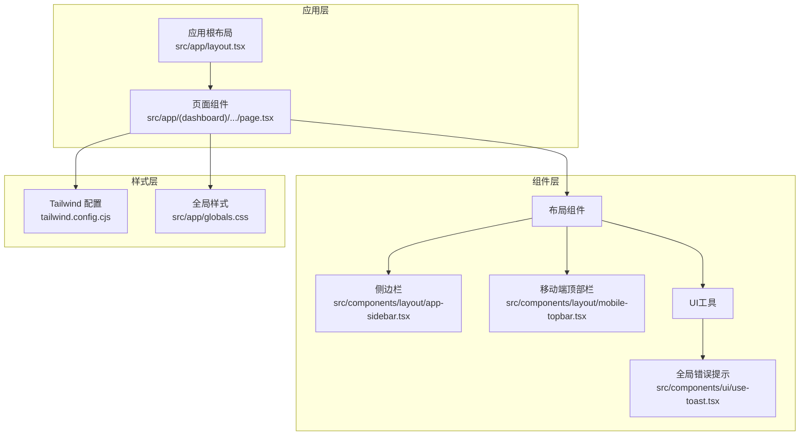
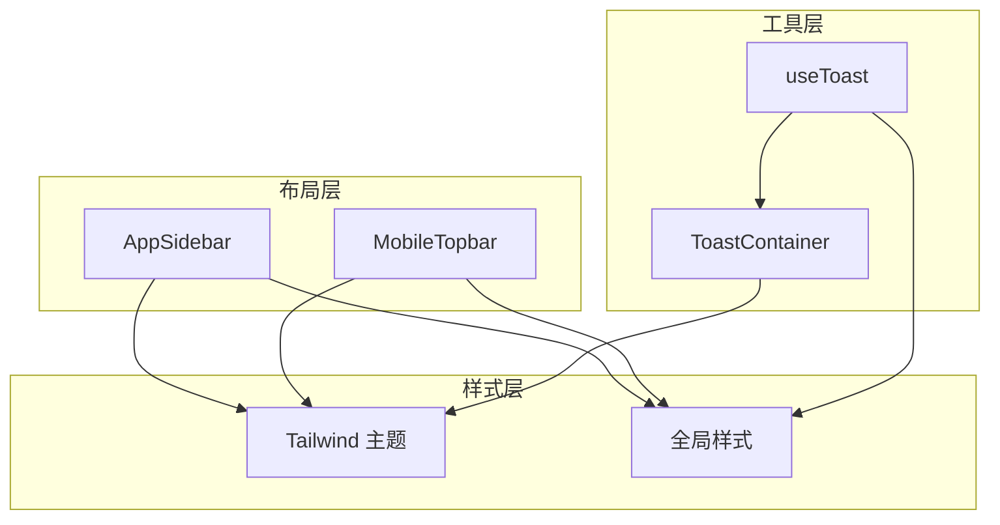
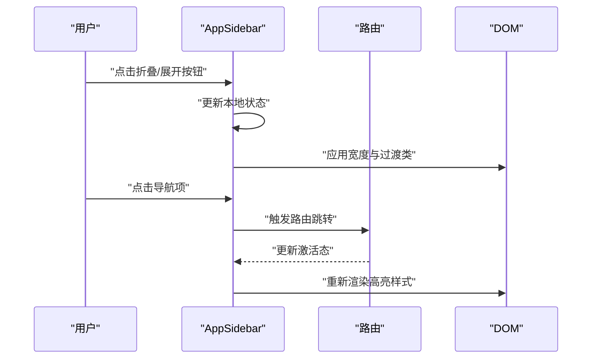
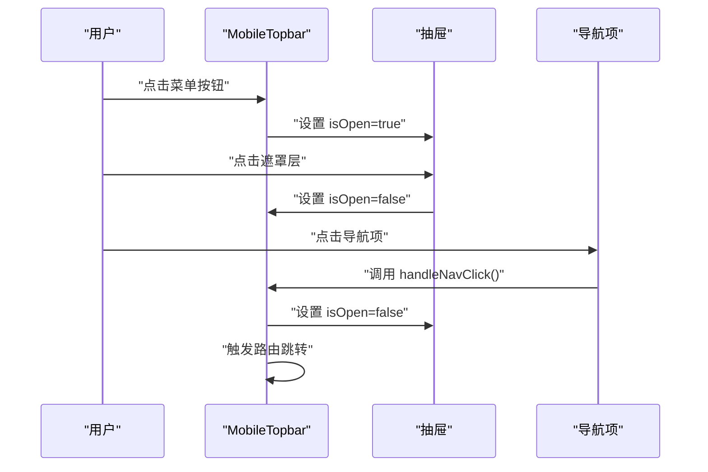
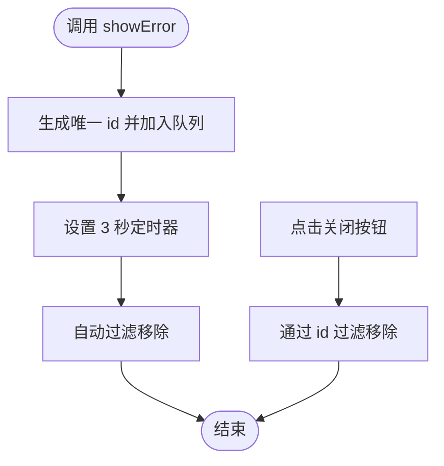
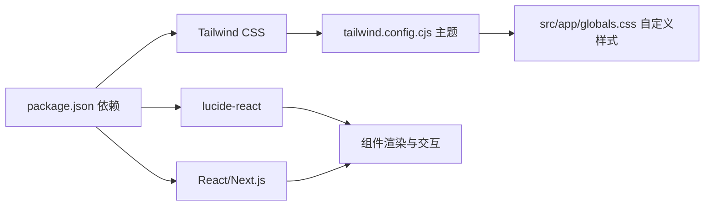

# UI组件系统

<cite>
**本文引用的文件**
- [README.md](file://README.md)
- [package.json](file://package.json)
- [tailwind.config.cjs](file://tailwind.config.cjs)
- [src/app/globals.css](file://src/app/globals.css)
- [src/components/ui/use-toast.tsx](file://src/components/ui/use-toast.tsx)
- [src/components/layout/app-sidebar.tsx](file://src/components/layout/app-sidebar.tsx)
- [src/components/layout/mobile-topbar.tsx](file://src/components/layout/mobile-topbar.tsx)
</cite>

## 目录
1. [简介](#简介)
2. [项目结构](#项目结构)
3. [核心组件](#核心组件)
4. [架构总览](#架构总览)
5. [详细组件分析](#详细组件分析)
6. [依赖分析](#依赖分析)
7. [性能考虑](#性能考虑)
8. [故障排查指南](#故障排查指南)
9. [结论](#结论)
10. [附录](#附录)

## 简介
本文件为 TETO 1.0 UI 组件系统的权威文档，聚焦于当前仓库中实现的布局与提示类组件，包括侧边栏导航、移动端抽屉式导航以及全局错误提示 Toast。文档从视觉外观、行为特征、交互模式、属性/事件/插槽/自定义选项、使用示例、响应式设计、无障碍性、状态与动画、样式自定义与主题、跨浏览器兼容性与性能优化等方面进行系统化梳理，并提供可操作的集成建议与最佳实践。

## 项目结构
TETO 采用 Next.js App Router 架构，UI 组件主要位于 src/components 目录下，样式通过 Tailwind CSS 与全局 CSS 实现。核心 UI 组件包括：
- 布局组件：应用侧边栏、移动端顶部栏
- 提示组件：全局错误 Toast Hook 与容器

**图示来源**
- [src/components/layout/app-sidebar.tsx:32-146](file://src/components/layout/app-sidebar.tsx#L32-L146)
- [src/components/layout/mobile-topbar.tsx:25-136](file://src/components/layout/mobile-topbar.tsx#L25-L136)
- [src/components/ui/use-toast.tsx:18-68](file://src/components/ui/use-toast.tsx#L18-L68)
- [tailwind.config.cjs:1-61](file://tailwind.config.cjs#L1-L61)
- [src/app/globals.css:1-88](file://src/app/globals.css#L1-L88)

**章节来源**
- [README.md:1-126](file://README.md#L1-L126)
- [package.json:1-44](file://package.json#L1-L44)

## 核心组件
本节对当前仓库中可用的 UI 组件进行概述与要点提炼，便于快速定位与使用。

- 侧边栏导航（AppSidebar）
  - 视觉外观：深色背景、圆角卡片、渐变高亮、图标与文字组合；支持折叠/展开，折叠时仅显示图标与品牌徽标。
  - 行为特征：根据当前路由高亮对应导航项；支持切换折叠状态；底部展示用户信息与版本信息；提供登出入口。
  - 交互模式：鼠标悬停高亮；点击切换折叠；点击导航项触发路由跳转。
  - 属性
    - user: 任意对象（用于显示用户标识或开发模式标记）
    - collapsed?: boolean（默认 false，控制初始折叠状态）
    - onToggle?: () => void（可选回调，用于外层同步折叠状态）
  - 事件：无显式事件；onToggle 作为状态同步回调。
  - 插槽：无。
  - 自定义选项：通过 Tailwind 类名与主题颜色变量定制外观；支持响应式宽度与过渡动画。
  - 使用示例：在应用根布局中引入，传入 user 对象与可选 onToggle。
  - 无障碍性：折叠按钮与导航项提供 aria-label；高对比度与键盘可达性良好。
  - 状态与动画：折叠/展开使用 CSS transition；激活态使用渐变背景与阴影。
  - 样式自定义：通过 Tailwind 主题变量与自定义 CSS 类覆盖。
  - 主题支持：基于 oklch 颜色空间的主题变量，适配浅/深主题。
  - 跨浏览器兼容性：使用标准 CSS 属性与现代浏览器特性，兼容性良好。
  - 性能优化：纯前端组件，无额外网络请求；渲染开销低。

- 移动端顶部栏（MobileTopbar）
  - 视觉外观：固定顶部，深色背景；左侧品牌标识；右侧菜单按钮；抽屉式导航覆盖全屏。
  - 行为特征：点击菜单按钮弹出抽屉；抽屉遮罩层点击可关闭；导航项根据当前路由高亮。
  - 交互模式：点击菜单按钮切换抽屉开关；点击导航项自动关闭抽屉并跳转。
  - 属性
    - user?: 任意对象（可选，用于显示用户信息）
  - 事件：无显式事件；内部通过 Link 组件处理导航。
  - 插槽：无。
  - 自定义选项：抽屉宽度、遮罩层透明度、导航项样式均可通过 Tailwind 类名调整。
  - 使用示例：在移动端页面中引入，传入 user 对象（可选）。
  - 无障碍性：菜单按钮提供 aria-label；抽屉关闭时焦点管理合理。
  - 状态与动画：抽屉展开/收起使用 z-index 与定位；遮罩层半透明覆盖。
  - 样式自定义：通过 Tailwind 类名与全局 CSS 覆盖。
  - 主题支持：与全局主题一致。
  - 跨浏览器兼容性：使用现代 CSS 与 React 特性，兼容性良好。
  - 性能优化：抽屉条件渲染，避免常驻 DOM；点击遮罩层关闭逻辑轻量。

- 全局错误提示（useToast + ToastContainer）
  - 视觉外观：固定顶部居中，红色背景，白色文字，带关闭按钮；支持手动关闭与自动消失。
  - 行为特征：调用 showError 添加一条错误提示；3 秒后自动移除；支持手动 dismiss。
  - 交互模式：点击“×”按钮立即关闭；自动计时器结束后移除。
  - 属性
    - useToast 返回值：toasts（数组）、showError(message)、dismissToast(id)
    - ToastContainer props：toasts、onDismiss
  - 事件：无显式事件；dismissToast 作为回调处理关闭。
  - 插槽：无。
  - 自定义选项：可通过 Tailwind 类名修改样式；动画效果通过动画类名控制。
  - 使用示例：在业务逻辑中调用 showError；在页面顶部渲染 ToastContainer 并传入 onDismiss。
  - 无障碍性：提示框固定在视口顶部，具备可见性；关闭按钮具备可点击区域与键盘可达性。
  - 状态与动画：状态通过 useState 管理；使用动画类名实现淡入与上移动画。
  - 样式自定义：通过 Tailwind 类名与动画类名覆盖。
  - 主题支持：颜色使用主题色系中的强调色。
  - 跨浏览器兼容性：使用现代 CSS 动画与 React Hooks，兼容性良好。
  - 性能优化：单向数据流，状态最小化；自动消失定时器在组件卸载时清理更佳（当前实现会在组件卸载后失效，建议在外层容器统一管理）。

**章节来源**
- [src/components/layout/app-sidebar.tsx:26-146](file://src/components/layout/app-sidebar.tsx#L26-L146)
- [src/components/layout/mobile-topbar.tsx:21-136](file://src/components/layout/mobile-topbar.tsx#L21-L136)
- [src/components/ui/use-toast.tsx:6-68](file://src/components/ui/use-toast.tsx#L6-L68)

## 架构总览
TETO 的 UI 组件遵循“布局 + 工具”的分层设计：
- 布局组件负责页面骨架与导航，承担路由感知与用户状态展示。
- 工具组件提供通用交互能力（如全局提示），降低重复实现成本。
- 样式体系由 Tailwind 主题与全局 CSS 共同构成，确保一致性与可扩展性。

**图示来源**
- [src/components/layout/app-sidebar.tsx:42-146](file://src/components/layout/app-sidebar.tsx#L42-L146)
- [src/components/layout/mobile-topbar.tsx:36-136](file://src/components/layout/mobile-topbar.tsx#L36-L136)
- [src/components/ui/use-toast.tsx:18-68](file://src/components/ui/use-toast.tsx#L18-L68)
- [tailwind.config.cjs:8-58](file://tailwind.config.cjs#L8-L58)
- [src/app/globals.css:15-88](file://src/app/globals.css#L15-L88)

## 详细组件分析

### 侧边栏导航（AppSidebar）
- 视觉与交互
  - 折叠状态下仅显示图标与品牌徽标，宽度紧凑；展开时显示完整导航与用户信息。
  - 激活导航项使用渐变背景与阴影，突出当前页面。
  - 收起/展开按钮具备清晰的 aria-label，便于屏幕阅读器识别。
- 状态与动画
  - 通过 CSS transition 实现宽度与透明度变化，动画时长与缓动函数可配置。
  - 悬停高亮使用 hover 状态类，保证触达反馈。
- 样式自定义
  - 颜色与圆角通过 Tailwind 主题变量统一管理；可直接覆盖类名以适配品牌风格。
  - 响应式宽度与定位通过 CSS 类实现，便于在不同断点下调整。
- 无障碍性
  - 导航项具备 title 展示文本（折叠时）；按钮具备 aria-label。
  - 高对比度与键盘可达性良好，适合长时间使用。
- 性能
  - 无副作用渲染；路由状态通过 pathname 判断，计算成本极低。

**图示来源**
- [src/components/layout/app-sidebar.tsx:32-146](file://src/components/layout/app-sidebar.tsx#L32-L146)

**章节来源**
- [src/components/layout/app-sidebar.tsx:26-146](file://src/components/layout/app-sidebar.tsx#L26-L146)

### 移动端顶部栏（MobileTopbar）
- 视觉与交互
  - 固定顶部，深色背景；菜单按钮在折叠时显示汉堡图标，在展开时显示“×”。
  - 抽屉式导航覆盖全屏，包含导航列表与底部信息区块。
  - 点击遮罩层可关闭抽屉，点击导航项自动关闭并跳转。
- 状态与动画
  - 抽屉通过 z-index 与定位实现覆盖；遮罩层半透明，提升可读性。
  - 抽屉展开/收起使用条件渲染，减少不必要的 DOM 占用。
- 样式自定义
  - 抽屉宽度、遮罩层透明度、导航项间距等均可通过 Tailwind 类名调整。
- 无障碍性
  - 菜单按钮提供 aria-label；抽屉关闭时焦点管理合理。
- 性能
  - 抽屉条件渲染，避免常驻 DOM；点击遮罩层关闭逻辑轻量。

**图示来源**
- [src/components/layout/mobile-topbar.tsx:25-136](file://src/components/layout/mobile-topbar.tsx#L25-L136)

**章节来源**
- [src/components/layout/mobile-topbar.tsx:21-136](file://src/components/layout/mobile-topbar.tsx#L21-L136)

### 全局错误提示（useToast + ToastContainer）
- 视觉与交互
  - 固定顶部居中，红色背景，白色文字，带关闭按钮；支持手动关闭与自动消失。
  - 自动计时器在 3 秒后移除提示，避免干扰用户操作。
- 状态与动画
  - 状态通过 useState 管理；使用动画类名实现淡入与上移动画。
  - dismissToast 通过 id 过滤移除指定提示。
- 样式自定义
  - 可通过 Tailwind 类名覆盖背景色、字体、阴影与动画参数。
- 无障碍性
  - 提示框固定在视口顶部，具备可见性；关闭按钮具备可点击区域与键盘可达性。
- 性能
  - 单向数据流，状态最小化；自动消失定时器在组件卸载时清理更佳（建议在外层容器统一管理）。

**图示来源**
- [src/components/ui/use-toast.tsx:18-34](file://src/components/ui/use-toast.tsx#L18-L34)

**章节来源**
- [src/components/ui/use-toast.tsx:6-68](file://src/components/ui/use-toast.tsx#L6-L68)

## 依赖分析
- 样式依赖
  - Tailwind CSS：提供原子化样式与主题变量，支撑组件外观与响应式布局。
  - 全局 CSS：提供毛玻璃、阴影、环形进度条等自定义样式。
- 图标依赖
  - lucide-react：提供导航与交互所需的图标资源。
- 动画与过渡
  - Tailwind 动画类名：用于 Toast 的淡入与上移动画。
- 组件间关系
  - 布局组件与工具组件解耦，通过 props 与上下文传递数据；样式通过共享主题与全局 CSS 统一。

**图示来源**
- [package.json:15-32](file://package.json#L15-L32)
- [tailwind.config.cjs:1-61](file://tailwind.config.cjs#L1-L61)
- [src/app/globals.css:15-88](file://src/app/globals.css#L15-L88)

**章节来源**
- [package.json:15-32](file://package.json#L15-L32)
- [tailwind.config.cjs:8-58](file://tailwind.config.cjs#L8-L58)
- [src/app/globals.css:15-88](file://src/app/globals.css#L15-L88)

## 性能考虑
- 渲染性能
  - 布局组件均为轻量级，无复杂计算；抽屉式导航采用条件渲染，避免常驻 DOM。
  - Toast 组件状态最小化，避免频繁重排。
- 样式性能
  - Tailwind 原子化类名减少 CSS 体积；主题变量集中管理，避免重复定义。
- 交互性能
  - 折叠/展开与抽屉开关使用 CSS 过渡，流畅自然；自动消失定时器在组件卸载时清理更佳。
- 资源加载
  - 图标库按需引入，避免全量打包；全局样式按需使用，减少冗余。

## 故障排查指南
- 侧边栏不显示用户信息
  - 检查传入的 user 对象是否包含必要字段；确认 collapsed 参数是否为 true 导致隐藏信息区域。
- 折叠按钮无效
  - 确认 onToggle 回调是否正确传入；检查 CSS 类名拼接逻辑。
- 抽屉无法关闭
  - 检查 isOpen 状态是否被外部覆盖；确认遮罩层点击事件是否生效。
- Toast 不显示或不消失
  - 确认 ToastContainer 是否正确渲染；检查 toasts 数组是否为空；确认自动计时器是否被清理。
- 样式异常
  - 检查 Tailwind 主题变量是否正确；确认全局 CSS 是否被覆盖；验证动画类名是否正确。

**章节来源**
- [src/components/layout/app-sidebar.tsx:32-146](file://src/components/layout/app-sidebar.tsx#L32-L146)
- [src/components/layout/mobile-topbar.tsx:25-136](file://src/components/layout/mobile-topbar.tsx#L25-L136)
- [src/components/ui/use-toast.tsx:18-68](file://src/components/ui/use-toast.tsx#L18-L68)

## 结论
TETO 的 UI 组件系统以简洁、可扩展为核心目标，通过布局与工具组件的清晰分层，结合 Tailwind 主题与全局样式，实现了良好的视觉一致性与可维护性。当前组件具备完善的交互与无障碍性支持，同时在性能方面表现稳定。建议后续在以下方向持续演进：完善 Toast 的生命周期管理、扩展更多 UI 组件类型（如按钮、输入、模态框等）、补充组件文档与示例页面，以及加强跨浏览器兼容性测试。

## 附录
- 使用示例路径
  - 侧边栏：[src/components/layout/app-sidebar.tsx:32-146](file://src/components/layout/app-sidebar.tsx#L32-L146)
  - 移动端顶部栏：[src/components/layout/mobile-topbar.tsx:25-136](file://src/components/layout/mobile-topbar.tsx#L25-L136)
  - 全局错误提示：[src/components/ui/use-toast.tsx:18-68](file://src/components/ui/use-toast.tsx#L18-L68)
- 响应式设计指南
  - 使用 Tailwind 断点类名控制布局；移动端优先，桌面端增强。
  - 抽屉式导航在小屏设备上提供更好的可访问性。
- 无障碍性合规要求
  - 提供 aria-label；高对比度与键盘可达性；避免仅靠颜色传达信息。
- 样式自定义与主题支持
  - 通过 Tailwind 主题变量与全局 CSS 覆盖实现品牌化定制。
- 跨浏览器兼容性
  - 使用现代 CSS 与 React 特性；在旧版浏览器中注意 polyfill 与降级方案。
- 性能优化建议
  - 条件渲染与懒加载；减少不必要的重排与重绘；合理使用动画与过渡。