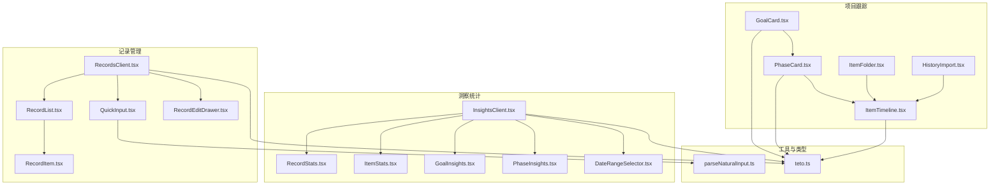
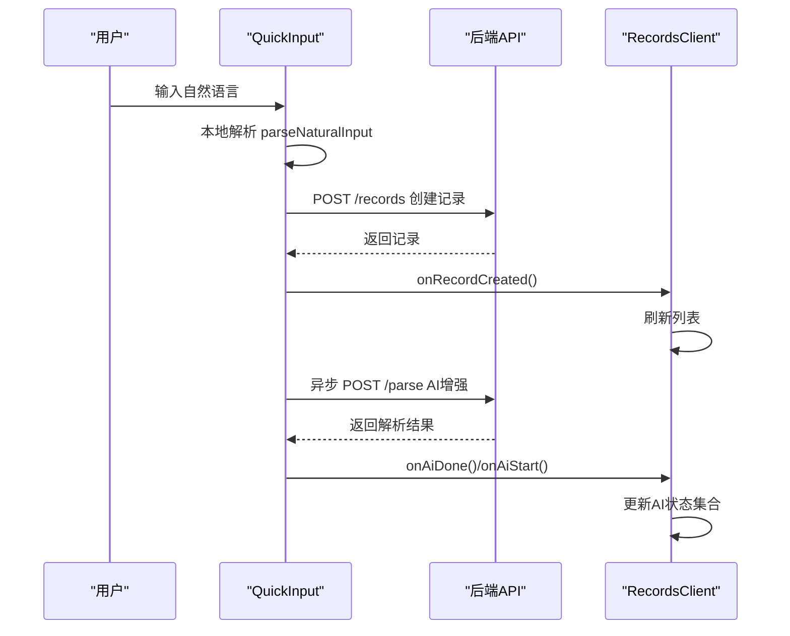
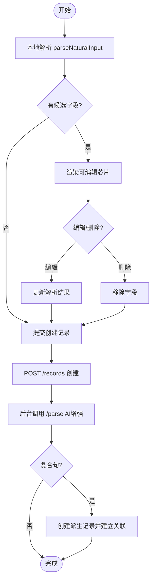
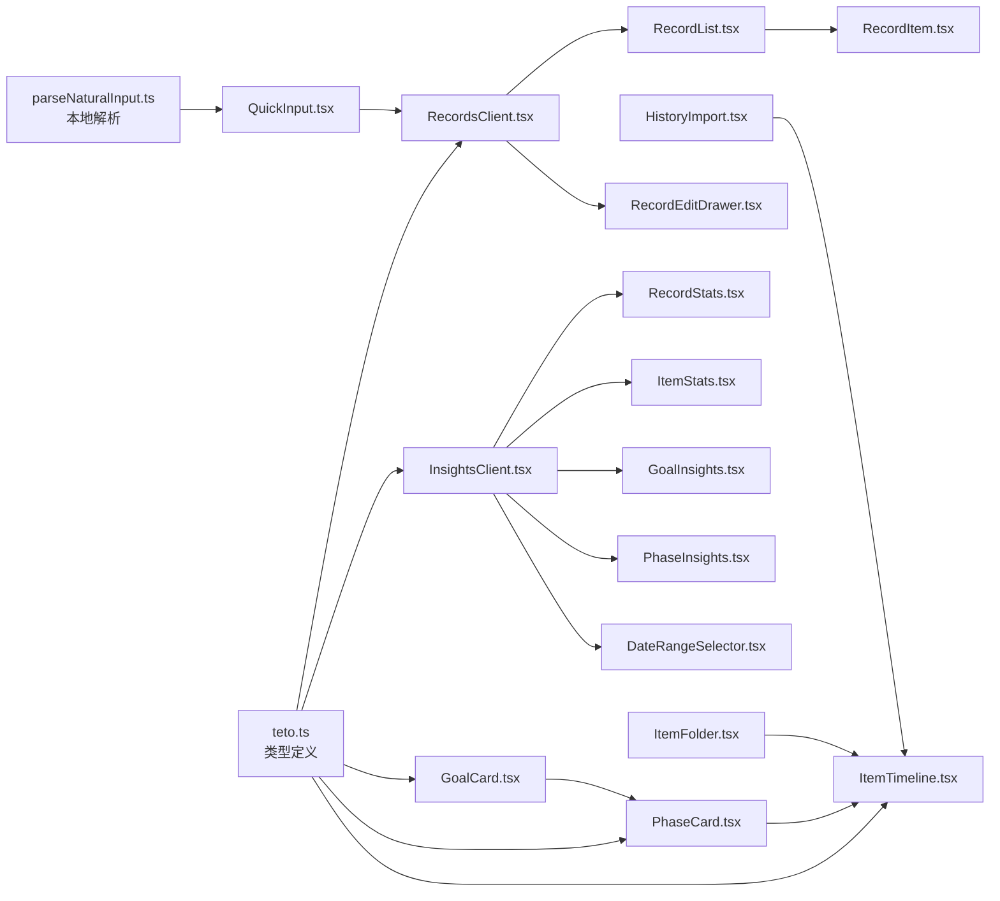

# 业务组件

<cite>
**本文引用的文件**
- [RecordList.tsx](file://src/app/(dashboard)/records/components/RecordList.tsx)
- [RecordItem.tsx](file://src/app/(dashboard)/records/components/RecordItem.tsx)
- [QuickInput.tsx](file://src/app/(dashboard)/records/components/QuickInput.tsx)
- [RecordEditDrawer.tsx](file://src/app/(dashboard)/records/components/RecordEditDrawer.tsx)
- [RecordsClient.tsx](file://src/app/(dashboard)/records/RecordsClient.tsx)
- [RecordStats.tsx](file://src/app/(dashboard)/insights/components/RecordStats.tsx)
- [GoalInsights.tsx](file://src/app/(dashboard)/insights/components/GoalInsights.tsx)
- [PhaseInsights.tsx](file://src/app/(dashboard)/insights/components/PhaseInsights.tsx)
- [ItemStats.tsx](file://src/app/(dashboard)/insights/components/ItemStats.tsx)
- [DateRangeSelector.tsx](file://src/app/(dashboard)/insights/components/DateRangeSelector.tsx)
- [InsightsClient.tsx](file://src/app/(dashboard)/insights/InsightsClient.tsx)
- [GoalCard.tsx](file://src/app/(dashboard)/items/components/GoalCard.tsx)
- [PhaseCard.tsx](file://src/app/(dashboard)/items/components/PhaseCard.tsx)
- [ItemTimeline.tsx](file://src/app/(dashboard)/items/components/ItemTimeline.tsx)
- [ItemFolder.tsx](file://src/app/(dashboard)/items/components/ItemFolder.tsx)
- [HistoryImport.tsx](file://src/app/(dashboard)/items/components/HistoryImport.tsx)
- [parseNaturalInput.ts](file://src/lib/utils/parseNaturalInput.ts)
- [teto.ts](file://src/types/teto.ts)
</cite>

## 目录
1. [简介](#简介)
2. [项目结构](#项目结构)
3. [核心组件](#核心组件)
4. [架构总览](#架构总览)
5. [组件详解](#组件详解)
6. [依赖关系分析](#依赖关系分析)
7. [性能考量](#性能考量)
8. [故障排查指南](#故障排查指南)
9. [结论](#结论)
10. [附录](#附录)

## 简介
本文件面向业务与技术读者，系统梳理 TETO 的核心业务组件，包括记录管理（记录列表、记录项、快速输入、记录编辑抽屉）、记录洞察统计（记录统计、项目统计、目标与阶段洞察）、以及项目跟踪（目标卡片、阶段卡片、项目时间线）。文档覆盖组件属性接口、事件回调、状态管理、数据绑定、组件间通信与数据流、状态同步机制，并提供使用示例与最佳实践，帮助读者快速理解与高效复用。

## 项目结构
- 记录管理位于 dashboard/records，包含客户端页面 RecordsClient 与若干 UI 组件：RecordList、RecordItem、QuickInput、RecordEditDrawer。
- 洞察统计位于 dashboard/insights，包含 InsightsClient 与若干统计组件：RecordStats、ItemStats、PhaseInsights、GoalInsights、DateRangeSelector。
- 项目跟踪位于 dashboard/items，包含 GoalCard、PhaseCard、ItemTimeline、ItemFolder、HistoryImport 等组件。
- 类型定义集中在 src/types/teto.ts；自然语言解析逻辑在 src/lib/utils/parseNaturalInput.ts。

图表来源
- [RecordsClient.tsx](file://src/app/(dashboard)/records/RecordsClient.tsx#L56-L694)
- [RecordList.tsx](file://src/app/(dashboard)/records/components/RecordList.tsx#L31-L86)
- [RecordItem.tsx](file://src/app/(dashboard)/records/components/RecordItem.tsx#L62-L260)
- [QuickInput.tsx](file://src/app/(dashboard)/records/components/QuickInput.tsx#L101-L956)
- [RecordEditDrawer.tsx](file://src/app/(dashboard)/records/components/RecordEditDrawer.tsx#L57-L560)
- [InsightsClient.tsx](file://src/app/(dashboard)/insights/InsightsClient.tsx#L39-L148)
- [RecordStats.tsx](file://src/app/(dashboard)/insights/components/RecordStats.tsx#L39-L124)
- [ItemStats.tsx](file://src/app/(dashboard)/insights/components/ItemStats.tsx#L40-L110)
- [GoalInsights.tsx](file://src/app/(dashboard)/insights/components/GoalInsights.tsx#L29-L142)
- [PhaseInsights.tsx](file://src/app/(dashboard)/insights/components/PhaseInsights.tsx#L32-L138)
- [DateRangeSelector.tsx](file://src/app/(dashboard)/insights/components/DateRangeSelector.tsx#L19-L64)
- [GoalCard.tsx](file://src/app/(dashboard)/items/components/GoalCard.tsx#L21-L113)
- [PhaseCard.tsx](file://src/app/(dashboard)/items/components/PhaseCard.tsx#L28-L124)
- [ItemTimeline.tsx](file://src/app/(dashboard)/items/components/ItemTimeline.tsx#L106-L289)
- [ItemFolder.tsx](file://src/app/(dashboard)/items/components/ItemFolder.tsx#L44-L207)
- [HistoryImport.tsx](file://src/app/(dashboard)/items/components/HistoryImport.tsx#L42-L782)
- [parseNaturalInput.ts:72-421](file://src/lib/utils/parseNaturalInput.ts#L72-L421)
- [teto.ts:37-74](file://src/types/teto.ts#L37-L74)

章节来源
- [RecordsClient.tsx](file://src/app/(dashboard)/records/RecordsClient.tsx#L56-L694)
- [InsightsClient.tsx](file://src/app/(dashboard)/insights/InsightsClient.tsx#L39-L148)
- [teto.ts:37-74](file://src/types/teto.ts#L37-L74)

## 核心组件
- 记录管理
  - RecordList：记录列表容器，负责时间线绘制与交互转发。
  - RecordItem：单条记录卡片，渲染类型徽标、语义胶囊、星标、生命周期状态等。
  - QuickInput：快速输入与解析，支持本地即时解析、AI 增强、复合句拆分与双向语义互补。
  - RecordEditDrawer：记录编辑抽屉，支持标签、结构化详情、关联记录搜索与添加。
- 洞察统计
  - InsightsClient：洞察页客户端，管理日期范围与数据拉取。
  - RecordStats、ItemStats：记录与事项维度统计。
  - GoalInsights、PhaseInsights：目标与阶段洞察。
  - DateRangeSelector：日期范围选择器。
- 项目跟踪
  - GoalCard：目标卡片，展示进度与状态，支持数值编辑。
  - PhaseCard：阶段卡片，展示时间范围与状态。
  - ItemTimeline：项目时间线，支持按阶段与记录的组合视图。
  - ItemFolder：事项文件夹，支持拖拽与弹窗预览。
  - HistoryImport：历史导入，支持 JSON/CSV/XLSX 导入与阶段补录。

章节来源
- [RecordList.tsx](file://src/app/(dashboard)/records/components/RecordList.tsx#L31-L86)
- [RecordItem.tsx](file://src/app/(dashboard)/records/components/RecordItem.tsx#L62-L260)
- [QuickInput.tsx](file://src/app/(dashboard)/records/components/QuickInput.tsx#L101-L956)
- [RecordEditDrawer.tsx](file://src/app/(dashboard)/records/components/RecordEditDrawer.tsx#L57-L560)
- [RecordStats.tsx](file://src/app/(dashboard)/insights/components/RecordStats.tsx#L39-L124)
- [ItemStats.tsx](file://src/app/(dashboard)/insights/components/ItemStats.tsx#L40-L110)
- [GoalInsights.tsx](file://src/app/(dashboard)/insights/components/GoalInsights.tsx#L29-L142)
- [PhaseInsights.tsx](file://src/app/(dashboard)/insights/components/PhaseInsights.tsx#L32-L138)
- [DateRangeSelector.tsx](file://src/app/(dashboard)/insights/components/DateRangeSelector.tsx#L19-L64)
- [GoalCard.tsx](file://src/app/(dashboard)/items/components/GoalCard.tsx#L21-L113)
- [PhaseCard.tsx](file://src/app/(dashboard)/items/components/PhaseCard.tsx#L28-L124)
- [ItemTimeline.tsx](file://src/app/(dashboard)/items/components/ItemTimeline.tsx#L106-L289)
- [ItemFolder.tsx](file://src/app/(dashboard)/items/components/ItemFolder.tsx#L44-L207)
- [HistoryImport.tsx](file://src/app/(dashboard)/items/components/HistoryImport.tsx#L42-L782)

## 架构总览
- 数据流
  - RecordsClient 负责加载标签、事项、记录，管理筛选与多天视图，向下传递给 RecordList/RecordItem/QuickInput/RecordEditDrawer。
  - QuickInput 使用 parseNaturalInput 进行本地解析，随后触发后端 API 创建记录；同时异步调用 /api/v2/parse 进行 AI 增强，实现“即时保存 + 后台增强”的体验。
  - RecordEditDrawer 负责更新记录字段与关联记录，支持双向语义互补与派生记录链。
  - InsightsClient 拉取 /api/v2/insights，驱动 RecordStats、ItemStats、GoalInsights、PhaseInsights 展示。
  - 项目跟踪组件通过 props 与回调与 RecordsClient/InsightsClient 解耦协作。
- 状态管理
  - RecordsClient 使用 useState/useEffect/useMemo/useCallback 管理筛选、日期、多天滚动、AI 状态、多选与批量删除。
  - 各组件内部使用 useState 管理自身局部状态（如 QuickInput 的 chips 编辑、RecordEditDrawer 的标签与结构化字段）。
- 组件通信
  - 父子通信：RecordsClient 通过 props 传递数据与回调；抽屉与抽屉内表单通过 onSaved/onDeleted/onError 回传。
  - 事件回调：RecordItem/RecordList 转发点击、星标切换、完成/推迟等动作；QuickInput 通过 onRecordCreated/onAiStart/onAiDone/onError 与父组件通信。
  - 洞察页通过 InsightsClient 管理日期范围与数据刷新。

图表来源
- [QuickInput.tsx](file://src/app/(dashboard)/records/components/QuickInput.tsx#L306-L557)
- [RecordsClient.tsx](file://src/app/(dashboard)/records/RecordsClient.tsx#L231-L325)

章节来源
- [RecordsClient.tsx](file://src/app/(dashboard)/records/RecordsClient.tsx#L56-L694)
- [QuickInput.tsx](file://src/app/(dashboard)/records/components/QuickInput.tsx#L101-L956)

## 组件详解

### 记录管理组件

#### RecordList：记录列表容器
- 职责
  - 渲染记录时间线（竖线+节点），按日期分组展示。
  - 将点击、星标切换、完成/推迟、多选等交互转发给 RecordItem。
- 关键属性
  - records: Record[]
  - onRecordClick(record)
  - onStarToggle(record)
  - compact?: boolean
  - aiPendingIds?: Set<string>
  - selectionMode?: boolean
  - selectedIds?: Set<string>
  - onToggleSelect?(id)
  - onComplete?(record)
  - onPostpone?(record)
- 关键行为
  - 无记录时显示占位提示。
  - 为每条记录计算时间显示与类型色板。
  - 支持计划类型的“完成/推迟”生命周期按钮。
- 状态与数据绑定
  - 由 RecordsClient 传入 aiPendingIds、selectionMode、selectedIds 等状态。
- 事件与回调
  - 通过 props 回调通知父组件交互结果。

章节来源
- [RecordList.tsx](file://src/app/(dashboard)/records/components/RecordList.tsx#L13-L86)
- [RecordsClient.tsx](file://src/app/(dashboard)/records/RecordsClient.tsx#L597-L607)

#### RecordItem：记录项卡片
- 职责
  - 渲染记录内容、类型徽标、时间、关联事项、星标、生命周期状态。
  - 渲染语义胶囊（花费、人物、地点、心情、能量、时长、指标、标签、AI处理中）。
  - 支持计划类型的完成/推迟按钮与多选勾选框。
- 关键属性
  - record: Record
  - onClick(): void
  - onStarToggle(): void
  - compact?: boolean
  - aiPending?: boolean
  - selectionMode?: boolean
  - selected?: boolean
  - onToggleSelect?(): void
  - onComplete?(): void
  - onPostpone?(): void
- 关键行为
  - 根据置信度为字段标注“猜测”提示。
  - 计划类型且为 active 状态时显示完成/推迟按钮。
  - 支持“计划投影”半透明样式。
- 状态与数据绑定
  - 通过 props 接收 selected 与 aiPending 状态。
- 事件与回调
  - 多选模式下点击触发 onToggleSelect；非多选模式点击触发 onClick。

章节来源
- [RecordItem.tsx](file://src/app/(dashboard)/records/components/RecordItem.tsx#L35-L260)
- [RecordsClient.tsx](file://src/app/(dashboard)/records/RecordsClient.tsx#L600-L607)

#### QuickInput：快速输入与解析
- 职责
  - 文本输入 + 即时本地解析（debounce 300ms），生成可编辑芯片。
  - 创建记录（即时保存），并触发后台 AI 增强（fire-and-forget）。
  - 支持复合句拆分：将一条输入拆分为多条记录并建立派生关系。
  - 双向语义互补：基于 record_link_hint 与关联记录互相补全字段。
  - 时间锚点解析：支持“明天/后天/下周”等关键词解析为具体日期。
- 关键属性
  - selectedDate: string
  - tags: Tag[]
  - items: Item[]
  - onRecordCreated(): void
  - onAiStart?(recordId: string): void
  - onAiDone?(recordId: string): void
  - onError(message: string): void
- 关键行为
  - 本地解析：parseNaturalInput，生成 cost/duration/metric/time_hint/suggested_item 等候选。
  - 芯片编辑：支持对 cost/duration/metric/time/item 等字段进行编辑与删除。
  - AI 增强：调用 /api/v2/parse，合并解析结果到记录；必要时创建派生记录并建立关联。
  - 复合句拆分：根据 split_suggestion 逐条创建记录，并建立 derived_from 关联。
- 状态与数据绑定
  - 本地状态：rawText、parsed、type、content、selectedItemId、selectedTagIds、expanded、submitting、splitMode、splitIndex、splitNotice。
  - 通过 onAiStart/onAiDone 与 RecordsClient 同步 AI 状态。
- 事件与回调
  - 提交成功后调用 onRecordCreated；失败调用 onError。

图表来源
- [QuickInput.tsx](file://src/app/(dashboard)/records/components/QuickInput.tsx#L127-L744)
- [parseNaturalInput.ts:72-421](file://src/lib/utils/parseNaturalInput.ts#L72-L421)

章节来源
- [QuickInput.tsx](file://src/app/(dashboard)/records/components/QuickInput.tsx#L12-L956)
- [parseNaturalInput.ts:15-421](file://src/lib/utils/parseNaturalInput.ts#L15-L421)

#### RecordEditDrawer：记录编辑抽屉
- 职责
  - 编辑记录内容、类型、时间、关联事项、标签、结构化详情（花费、时长、地点、关系人、心情、能量、状态、指标）。
  - 管理记录关联（搜索与添加、删除）。
  - 删除记录与保存。
- 关键属性
  - record: Record
  - tags: Tag[]
  - items: Item[]
  - onClose(): void
  - onSaved(): void
  - onDeleted(): void
  - onError(message: string): void
- 关键行为
  - 初始化表单字段（content/type/tag_ids/item_id/occurred_at/mood/energy/status/location/people/cost/metric_*、duration_minutes、note）。
  - 保存时构造 UpdateRecordPayload，调用 PUT /records/{id}。
  - 删除时调用 DELETE /records/{id}。
  - 关联记录：支持搜索、添加、删除；支持双向语义互补（与关联记录互相补全字段）。
- 状态与数据绑定
  - 本地状态：表单字段、saving/deleting、关联记录列表、搜索状态。
- 事件与回调
  - 保存/删除成功后调用 onSaved/onDeleted；失败调用 onError。

章节来源
- [RecordEditDrawer.tsx](file://src/app/(dashboard)/records/components/RecordEditDrawer.tsx#L47-L560)
- [RecordsClient.tsx](file://src/app/(dashboard)/records/RecordsClient.tsx#L680-L690)

### 洞察统计组件

#### InsightsClient：洞察页客户端
- 职责
  - 管理日期范围（7天/30天/本月/自定义），拉取 /api/v2/insights 数据。
  - 将数据传递给各统计组件。
- 关键属性
  - 无（内部管理日期与数据）
- 关键行为
  - 初始化日期范围；根据日期变化调用 fetchInsights。
  - 错误处理与重试。
- 事件与回调
  - 无外部回调。

章节来源
- [InsightsClient.tsx](file://src/app/(dashboard)/insights/InsightsClient.tsx#L39-L148)

#### RecordStats：记录维度统计
- 职责
  - 展示近7/30天记录数、每日记录数柱状图、类型分布饼图、标签分布柱状图。
- 关键属性
  - data: InsightsData['record_overview']
- 关键行为
  - 将日期格式化为 MM-DD 以便展示。
  - 使用 Recharts 渲染图表。

章节来源
- [RecordStats.tsx](file://src/app/(dashboard)/insights/components/RecordStats.tsx#L19-L124)
- [InsightsClient.tsx](file://src/app/(dashboard)/insights/InsightsClient.tsx#L136-L142)

#### ItemStats：事项维度统计
- 职责
  - 展示活跃事项数量、Top5 事项、停滞事项。
- 关键属性
  - data: InsightsData['item_overview']
- 关键行为
  - 格式化“最后记录于”相对时间。

章节来源
- [ItemStats.tsx](file://src/app/(dashboard)/insights/components/ItemStats.tsx#L6-L110)
- [InsightsClient.tsx](file://src/app/(dashboard)/insights/InsightsClient.tsx#L136-L142)

#### GoalInsights：目标洞察
- 职责
  - 展示目标总数、有关联的目标数量、目标状态分布饼图、目标关联统计。
- 关键属性
  - data: InsightsData['goalInsights']
- 关键行为
  - 使用中文状态标签与颜色映射。

章节来源
- [GoalInsights.tsx](file://src/app/(dashboard)/insights/components/GoalInsights.tsx#L25-L142)
- [InsightsClient.tsx](file://src/app/(dashboard)/insights/InsightsClient.tsx#L136-L142)

#### PhaseInsights：阶段洞察
- 职责
  - 展示阶段状态分布饼图、最近创建的阶段列表、近期阶段变化活跃的事项。
- 关键属性
  - data: InsightsData['phaseInsights']
- 关键行为
  - 格式化日期范围与相对时间。

章节来源
- [PhaseInsights.tsx](file://src/app/(dashboard)/insights/components/PhaseInsights.tsx#L23-L138)
- [InsightsClient.tsx](file://src/app/(dashboard)/insights/InsightsClient.tsx#L136-L142)

#### DateRangeSelector：日期范围选择器
- 职责
  - 提供预设（7天/30天/本月）与自定义日期输入。
- 关键属性
  - preset: DatePreset
  - dateFrom: string
  - dateTo: string
  - onPresetChange(preset: DatePreset): void
  - onCustomDateChange(from: string, to: string): void

章节来源
- [DateRangeSelector.tsx](file://src/app/(dashboard)/insights/components/DateRangeSelector.tsx#L5-L64)
- [InsightsClient.tsx](file://src/app/(dashboard)/insights/InsightsClient.tsx#L82-L95)

### 项目跟踪组件

#### GoalCard：目标卡片
- 职责
  - 展示目标标题、状态、描述与进度（数值型目标）。
  - 支持编辑当前值。
- 关键属性
  - goal: Goal
  - onEdit(goal): void
  - onDelete(goal): void
  - onUpdateValue?(goalId: string, currentValue: number | null): void
- 关键行为
  - 数值型目标计算进度百分比，支持编辑保存。

章节来源
- [GoalCard.tsx](file://src/app/(dashboard)/items/components/GoalCard.tsx#L7-L113)

#### PhaseCard：阶段卡片
- 职责
  - 展示阶段标题、时间范围、状态、描述与关联目标（预留）。
  - 支持编辑、删除、升级为事项（可选回调）。
- 关键属性
  - phase: Phase
  - goalTitle?: string | null
  - onEdit(phase): void
  - onDelete(id: string): void
  - onPromoteToItem?(phase): void
- 关键行为
  - 格式化日期范围与相对时间。

章节来源
- [PhaseCard.tsx](file://src/app/(dashboard)/items/components/PhaseCard.tsx#L6-L124)

#### ItemTimeline：项目时间线
- 职责
  - 将记录按阶段与时间线组织，支持三种视图：仅阶段、仅记录、全部（十字型时间线）。
  - 支持记录点击、阶段编辑、阶段指示竖条与悬停信息。
- 关键属性
  - phases: Phase[]
  - records: TetoRecord[]
  - goalMap: Record<string, string>
  - onRecordClick(record): void
  - onEditPhase(phase): void
  - filter?: 'all' | 'records' | 'phases'
- 关键行为
  - 构建 segments：将记录归入阶段或未命名区间，按时间排序。
  - 仅阶段模式：简单列表；仅记录模式：竖线+点；全部模式：左右布局的十字型时间线。

章节来源
- [ItemTimeline.tsx](file://src/app/(dashboard)/items/components/ItemTimeline.tsx#L14-L289)

#### ItemFolder：事项文件夹
- 职责
  - iOS 风格四宫格预览，支持打开全屏弹窗查看事项网格。
  - 支持拖拽到文件夹、从文件夹移出。
- 关键属性
  - folder: ItemFolderType
  - items: ItemWithStats[]
  - isExpanded: boolean
  - isDragOver: boolean
  - onToggle(): void
  - onEdit(folder): void
  - onDelete(): void
  - onDragOver(e): void
  - onDragLeave(): void
  - onDrop(e): void
  - renderItemCard(item): ReactNode
  - onRemoveItem?(itemId: string): void
- 关键行为
  - 使用 Portal 渲染全屏弹窗，避免与父级布局 transform 穿透。

章节来源
- [ItemFolder.tsx](file://src/app/(dashboard)/items/components/ItemFolder.tsx#L27-L207)

#### HistoryImport：历史导入
- 职责
  - 支持历史具体记录与历史阶段两种导入路径。
  - 支持 JSON/CSV/XLSX 导入，粘贴或文件上传，解析与校验，逐条导入并统计结果。
- 关键属性
  - itemId: string
  - itemTitle: string
  - onClose(): void
  - onRecordsImported(): void
  - onPhaseImported(): void
  - onError(message: string): void
- 关键行为
  - 自动识别数据格式（JSON/CSV/XLSX），解析为 HistoryRecordItem[]。
  - validateRecordType 对齐到收敛的记录类型。
  - 逐条调用 /api/v2/records 创建记录，统计成功/失败与错误详情。

章节来源
- [HistoryImport.tsx](file://src/app/(dashboard)/items/components/HistoryImport.tsx#L10-L782)

## 依赖关系分析

图表来源
- [teto.ts:37-74](file://src/types/teto.ts#L37-L74)
- [parseNaturalInput.ts:72-421](file://src/lib/utils/parseNaturalInput.ts#L72-L421)
- [RecordsClient.tsx](file://src/app/(dashboard)/records/RecordsClient.tsx#L56-L694)
- [InsightsClient.tsx](file://src/app/(dashboard)/insights/InsightsClient.tsx#L39-L148)
- [QuickInput.tsx](file://src/app/(dashboard)/records/components/QuickInput.tsx#L101-L956)
- [RecordList.tsx](file://src/app/(dashboard)/records/components/RecordList.tsx#L31-L86)
- [RecordItem.tsx](file://src/app/(dashboard)/records/components/RecordItem.tsx#L62-L260)
- [RecordEditDrawer.tsx](file://src/app/(dashboard)/records/components/RecordEditDrawer.tsx#L57-L560)
- [RecordStats.tsx](file://src/app/(dashboard)/insights/components/RecordStats.tsx#L39-L124)
- [ItemStats.tsx](file://src/app/(dashboard)/insights/components/ItemStats.tsx#L40-L110)
- [GoalInsights.tsx](file://src/app/(dashboard)/insights/components/GoalInsights.tsx#L29-L142)
- [PhaseInsights.tsx](file://src/app/(dashboard)/insights/components/PhaseInsights.tsx#L32-L138)
- [DateRangeSelector.tsx](file://src/app/(dashboard)/insights/components/DateRangeSelector.tsx#L19-L64)
- [GoalCard.tsx](file://src/app/(dashboard)/items/components/GoalCard.tsx#L21-L113)
- [PhaseCard.tsx](file://src/app/(dashboard)/items/components/PhaseCard.tsx#L28-L124)
- [ItemTimeline.tsx](file://src/app/(dashboard)/items/components/ItemTimeline.tsx#L106-L289)
- [ItemFolder.tsx](file://src/app/(dashboard)/items/components/ItemFolder.tsx#L44-L207)
- [HistoryImport.tsx](file://src/app/(dashboard)/items/components/HistoryImport.tsx#L42-L782)

章节来源
- [teto.ts:37-74](file://src/types/teto.ts#L37-L74)
- [parseNaturalInput.ts:72-421](file://src/lib/utils/parseNaturalInput.ts#L72-L421)
- [RecordsClient.tsx](file://src/app/(dashboard)/records/RecordsClient.tsx#L56-L694)
- [InsightsClient.tsx](file://src/app/(dashboard)/insights/InsightsClient.tsx#L39-L148)

## 性能考量
- 本地解析与防抖
  - QuickInput 使用 300ms debounce 避免频繁解析，提升输入流畅度。
- 批量加载与滚动优化
  - RecordsClient 多天模式按批加载日期列（每次7列），并补偿 scrollLeft 以保持滚动位置稳定。
- 图表渲染
  - 洞察统计组件使用 Recharts，建议在数据量较大时启用懒加载与尺寸控制。
- 状态同步
  - RecordsClient 使用 Set 与 useMemo 优化选择状态与分组渲染，减少不必要的重渲染。
- 异步增强
  - QuickInput 的 AI 增强采用 fire-and-forget 模式，避免阻塞用户输入。

[本节为通用指导，不直接分析具体文件]

## 故障排查指南
- 记录创建失败
  - QuickInput/RecordEditDrawer 在提交失败时调用 onError，显示错误消息；检查网络请求与后端返回的 error 字段。
- AI 增强异常
  - QuickInput 在增强过程中捕获异常并静默处理，确保记录仍可保存；可通过 onAiDone/onAiStart 观察状态。
- 批量删除
  - RecordsClient 的批量删除在确认后调用 /api/v2/records/batch-delete，失败时显示错误并保持选择状态。
- 洞察数据加载
  - InsightsClient 在请求失败时显示错误与“重新加载”按钮，检查日期范围与网络状态。

章节来源
- [QuickInput.tsx](file://src/app/(dashboard)/records/components/QuickInput.tsx#L551-L556)
- [RecordEditDrawer.tsx](file://src/app/(dashboard)/records/components/RecordEditDrawer.tsx#L218-L228)
- [RecordsClient.tsx](file://src/app/(dashboard)/records/RecordsClient.tsx#L396-L421)
- [InsightsClient.tsx](file://src/app/(dashboard)/insights/InsightsClient.tsx#L60-L72)

## 结论
TETO 的核心业务组件围绕“记录—洞察—项目跟踪”形成闭环：记录管理强调“即时保存 + 后台增强”的体验与多维语义解析；洞察统计提供可视化的数据概览；项目跟踪通过目标与阶段卡片、时间线与文件夹提升长期项目的可追踪性。组件间通过明确的属性与回调解耦，结合统一的类型定义与状态管理模式，既满足业务理解，又便于技术实现与扩展。

[本节为总结性内容，不直接分析具体文件]

## 附录

### 组件间通信与数据流要点
- RecordsClient
  - 上游：/api/v2/tags、/api/v2/items、/api/v2/records
  - 下游：RecordList、RecordItem、QuickInput、RecordEditDrawer
  - 状态：筛选、日期、多天滚动、AI 状态、多选与批量删除
- QuickInput
  - 本地：parseNaturalInput
  - 上游：/api/v2/records、/api/v2/parse
  - 下游：onRecordCreated、onAiStart、onAiDone
- RecordEditDrawer
  - 上游：/api/v2/records/{id}、/api/v2/record-links
  - 下游：onSaved、onDeleted、onError
- InsightsClient
  - 上游：/api/v2/insights
  - 下游：RecordStats、ItemStats、GoalInsights、PhaseInsights、DateRangeSelector

章节来源
- [RecordsClient.tsx](file://src/app/(dashboard)/records/RecordsClient.tsx#L177-L229)
- [QuickInput.tsx](file://src/app/(dashboard)/records/components/QuickInput.tsx#L306-L557)
- [RecordEditDrawer.tsx](file://src/app/(dashboard)/records/components/RecordEditDrawer.tsx#L100-L229)
- [InsightsClient.tsx](file://src/app/(dashboard)/insights/InsightsClient.tsx#L55-L80)