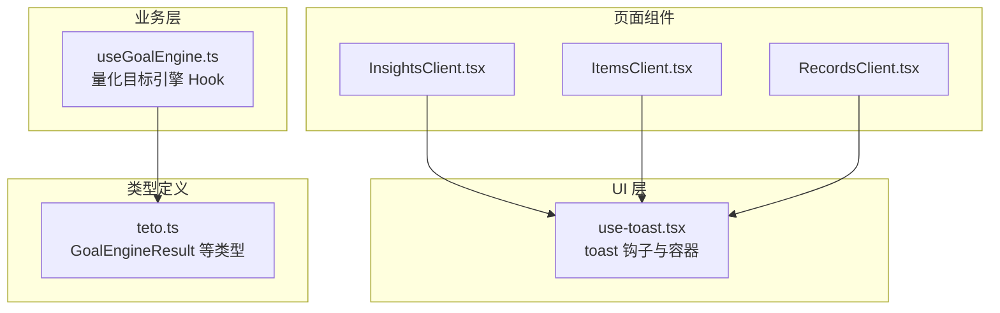
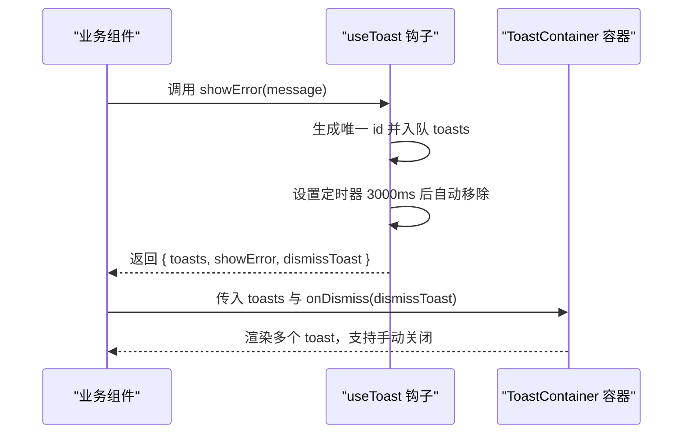
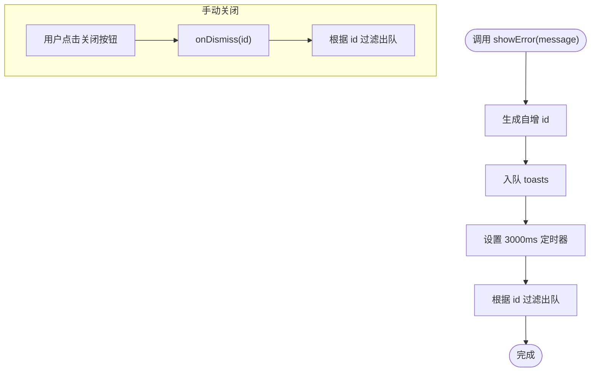
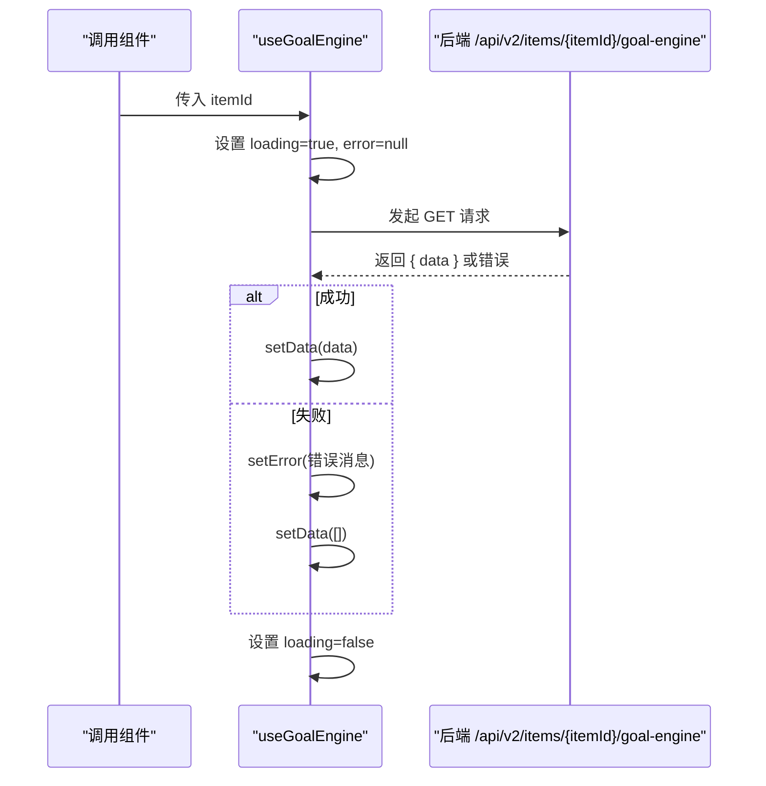
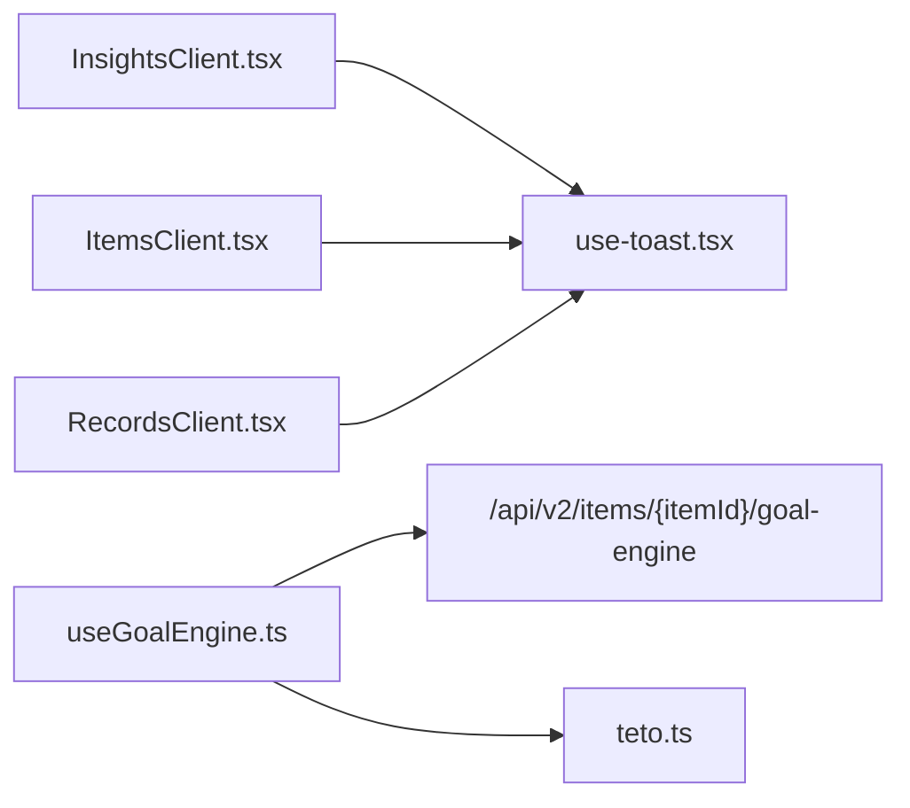

# 工具钩子

<cite>
**本文引用的文件**
- [src/components/ui/use-toast.tsx](file://src/components/ui/use-toast.tsx)
- [src/app/(dashboard)/insights/InsightsClient.tsx](file://src/app/(dashboard)/insights/InsightsClient.tsx)
- [src/app/(dashboard)/items/ItemsClient.tsx](file://src/app/(dashboard)/items/ItemsClient.tsx)
- [src/app/(dashboard)/records/RecordsClient.tsx](file://src/app/(dashboard)/records/RecordsClient.tsx)
- [src/lib/hooks/useGoalEngine.ts](file://src/lib/hooks/useGoalEngine.ts)
- [src/types/teto.ts](file://src/types/teto.ts)
</cite>

## 目录
1. [简介](#简介)
2. [项目结构](#项目结构)
3. [核心组件](#核心组件)
4. [架构总览](#架构总览)
5. [详细组件分析](#详细组件分析)
6. [依赖分析](#依赖分析)
7. [性能考虑](#性能考虑)
8. [故障排查指南](#故障排查指南)
9. [结论](#结论)
10. [附录](#附录)

## 简介
本文件系统性梳理 TETO 的工具钩子体系，重点覆盖以下内容：
- toast 通知钩子的实现原理、使用方式与配置要点
- 自定义 Hooks 的功能特性、参数与返回值类型
- 钩子的生命周期管理、状态更新机制与副作用处理
- 在组件中的实际使用示例路径
- 依赖管理、性能优化与错误处理策略
- 钩子的组合使用模式与最佳实践

## 项目结构
本仓库采用按功能域划分的前端结构，工具钩子主要分布在以下位置：
- UI 层通用钩子：src/components/ui/use-toast.tsx
- 业务逻辑钩子：src/lib/hooks/useGoalEngine.ts
- 使用示例：各页面客户端组件（如 InsightsClient、ItemsClient、RecordsClient）
- 类型定义：src/types/teto.ts

图表来源
- [src/components/ui/use-toast.tsx:1-69](file://src/components/ui/use-toast.tsx#L1-L69)
- [src/lib/hooks/useGoalEngine.ts:1-42](file://src/lib/hooks/useGoalEngine.ts#L1-L42)
- [src/app/(dashboard)/insights/InsightsClient.tsx](file://src/app/(dashboard)/insights/InsightsClient.tsx#L40-L149)
- [src/app/(dashboard)/items/ItemsClient.tsx](file://src/app/(dashboard)/items/ItemsClient.tsx#L120-L319)
- [src/app/(dashboard)/records/RecordsClient.tsx](file://src/app/(dashboard)/records/RecordsClient.tsx#L200-L399)
- [src/types/teto.ts:467-503](file://src/types/teto.ts#L467-L503)

章节来源
- [src/components/ui/use-toast.tsx:1-69](file://src/components/ui/use-toast.tsx#L1-L69)
- [src/lib/hooks/useGoalEngine.ts:1-42](file://src/lib/hooks/useGoalEngine.ts#L1-L42)
- [src/app/(dashboard)/insights/InsightsClient.tsx](file://src/app/(dashboard)/insights/InsightsClient.tsx#L40-L149)
- [src/app/(dashboard)/items/ItemsClient.tsx](file://src/app/(dashboard)/items/ItemsClient.tsx#L120-L319)
- [src/app/(dashboard)/records/RecordsClient.tsx](file://src/app/(dashboard)/records/RecordsClient.tsx#L200-L399)
- [src/types/teto.ts:467-503](file://src/types/teto.ts#L467-L503)

## 核心组件
- toast 通知钩子：提供统一的错误提示能力，支持自动消失与手动关闭
- 量化目标引擎 Hook：封装对后端量化目标计算接口的调用，返回数据、加载与错误状态

章节来源
- [src/components/ui/use-toast.tsx:13-34](file://src/components/ui/use-toast.tsx#L13-L34)
- [src/lib/hooks/useGoalEngine.ts:6-41](file://src/lib/hooks/useGoalEngine.ts#L6-L41)

## 架构总览
toast 钩子与容器采用“状态集中 + 组件解耦”的设计：useToast 提供状态与动作，ToastContainer 负责渲染与交互；业务组件通过 useToast 获取 toasts、showError、dismissToast，从而在任意页面以一致的方式展示错误提示。

图表来源
- [src/components/ui/use-toast.tsx:18-34](file://src/components/ui/use-toast.tsx#L18-L34)
- [src/components/ui/use-toast.tsx:40-68](file://src/components/ui/use-toast.tsx#L40-L68)

章节来源
- [src/components/ui/use-toast.tsx:13-68](file://src/components/ui/use-toast.tsx#L13-L68)

## 详细组件分析

### toast 通知钩子
- 设计思想
  - 状态集中：toasts 数组由 useToast 内部管理
  - 行为统一：showError 一次性提示，3 秒后自动消失；dismissToast 支持手动关闭
  - 容器解耦：ToastContainer 仅负责渲染与交互，不参与状态管理
- 数据结构
  - Toast 接口包含 id 与 message
- 生命周期与副作用
  - 每次 showError 会分配自增 id 并入队；3 秒后通过过滤 id 的方式出队
  - dismissToast 通过过滤 id 实现即时移除
- 使用方式
  - 在页面组件中引入 useToast，解构出 toasts、showError、dismissToast
  - 将 toasts 与 onDismiss 传给 ToastContainer 渲染
- 错误处理策略
  - showError 作为统一兜底，避免分散的 alert 或 console.error
  - 容器内按钮点击触发 onDismiss，实现用户可控的关闭

图表来源
- [src/components/ui/use-toast.tsx:18-34](file://src/components/ui/use-toast.tsx#L18-L34)
- [src/components/ui/use-toast.tsx:40-68](file://src/components/ui/use-toast.tsx#L40-L68)

章节来源
- [src/components/ui/use-toast.tsx:6-68](file://src/components/ui/use-toast.tsx#L6-L68)

### 量化目标引擎 Hook（useGoalEngine）
- 功能特性
  - 封装对 /api/v2/items/{itemId}/goal-engine 的调用
  - 返回 data（目标计算结果数组）、loading、error 与 refetch 方法
- 参数与返回值
  - 参数：itemId（字符串）
  - 返回：{ data: GoalEngineResult[], loading: boolean, error: string|null, refetch: () => Promise<void> }
- 生命周期与副作用
  - 组件挂载时自动发起请求
  - itemId 变化时重新拉取数据
  - 请求期间设置 loading=true，成功/失败分别设置 data 或 error
- 错误处理策略
  - 非 2xx 响应时解析错误消息或回退为“请求失败 (状态码)”
  - 捕获异常时记录日志并设置 error，同时清空 data
- 类型支撑
  - GoalEngineResult 定义了目标引擎输出的完整字段集合

图表来源
- [src/lib/hooks/useGoalEngine.ts:10-41](file://src/lib/hooks/useGoalEngine.ts#L10-L41)
- [src/types/teto.ts:467-503](file://src/types/teto.ts#L467-L503)

章节来源
- [src/lib/hooks/useGoalEngine.ts:6-41](file://src/lib/hooks/useGoalEngine.ts#L6-L41)
- [src/types/teto.ts:467-503](file://src/types/teto.ts#L467-L503)

### 在组件中的使用示例（路径）
- 在洞察页使用 toast
  - 引入与使用：[src/app/(dashboard)/insights/InsightsClient.tsx](file://src/app/(dashboard)/insights/InsightsClient.tsx#L10-L11)、[src/app/(dashboard)/insights/InsightsClient.tsx](file://src/app/(dashboard)/insights/InsightsClient.tsx#L45-L46)
  - 渲染容器：[src/app/(dashboard)/insights/InsightsClient.tsx](file://src/app/(dashboard)/insights/InsightsClient.tsx#L144-L145)
- 在事项页使用 toast
  - 引入与使用：[src/app/(dashboard)/items/ItemsClient.tsx](file://src/app/(dashboard)/items/ItemsClient.tsx#L20-L21)、[src/app/(dashboard)/items/ItemsClient.tsx](file://src/app/(dashboard)/items/ItemsClient.tsx#L124-L125)
  - 渲染容器：[src/app/(dashboard)/items/ItemsClient.tsx](file://src/app/(dashboard)/items/ItemsClient.tsx#L480-L480)
- 在记录页使用 toast
  - 引入与使用：[src/app/(dashboard)/records/RecordsClient.tsx](file://src/app/(dashboard)/records/RecordsClient.tsx#L10-L11)、[src/app/(dashboard)/records/RecordsClient.tsx](file://src/app/(dashboard)/records/RecordsClient.tsx#L77-L77)
  - 渲染容器：[src/app/(dashboard)/records/RecordsClient.tsx](file://src/app/(dashboard)/records/RecordsClient.tsx#L691-L691)
- 在目标引擎 Hook 中使用
  - 调用 refetch：[src/lib/hooks/useGoalEngine.ts:36-38](file://src/lib/hooks/useGoalEngine.ts#L36-L38)

章节来源
- [src/app/(dashboard)/insights/InsightsClient.tsx](file://src/app/(dashboard)/insights/InsightsClient.tsx#L10-L11)
- [src/app/(dashboard)/insights/InsightsClient.tsx](file://src/app/(dashboard)/insights/InsightsClient.tsx#L45-L46)
- [src/app/(dashboard)/insights/InsightsClient.tsx](file://src/app/(dashboard)/insights/InsightsClient.tsx#L144-L145)
- [src/app/(dashboard)/items/ItemsClient.tsx](file://src/app/(dashboard)/items/ItemsClient.tsx#L20-L21)
- [src/app/(dashboard)/items/ItemsClient.tsx](file://src/app/(dashboard)/items/ItemsClient.tsx#L124-L125)
- [src/app/(dashboard)/items/ItemsClient.tsx](file://src/app/(dashboard)/items/ItemsClient.tsx#L480-L480)
- [src/app/(dashboard)/records/RecordsClient.tsx](file://src/app/(dashboard)/records/RecordsClient.tsx#L10-L11)
- [src/app/(dashboard)/records/RecordsClient.tsx](file://src/app/(dashboard)/records/RecordsClient.tsx#L77-L77)
- [src/app/(dashboard)/records/RecordsClient.tsx](file://src/app/(dashboard)/records/RecordsClient.tsx#L691-L691)
- [src/lib/hooks/useGoalEngine.ts:36-38](file://src/lib/hooks/useGoalEngine.ts#L36-L38)

## 依赖分析
- 组件与钩子的依赖关系
  - 页面组件依赖 useToast 提供的状态与动作
  - useGoalEngine 依赖后端 API 与类型定义
- 外部依赖
  - React（useState、useEffect、useCallback）
  - UI 图标库（lucide-react）
  - 后端 API（/api/v2/...）

图表来源
- [src/app/(dashboard)/insights/InsightsClient.tsx](file://src/app/(dashboard)/insights/InsightsClient.tsx#L10-L11)
- [src/app/(dashboard)/items/ItemsClient.tsx](file://src/app/(dashboard)/items/ItemsClient.tsx#L20-L21)
- [src/app/(dashboard)/records/RecordsClient.tsx](file://src/app/(dashboard)/records/RecordsClient.tsx#L10-L11)
- [src/lib/hooks/useGoalEngine.ts:19-26](file://src/lib/hooks/useGoalEngine.ts#L19-L26)
- [src/types/teto.ts:467-503](file://src/types/teto.ts#L467-L503)

章节来源
- [src/app/(dashboard)/insights/InsightsClient.tsx](file://src/app/(dashboard)/insights/InsightsClient.tsx#L10-L11)
- [src/app/(dashboard)/items/ItemsClient.tsx](file://src/app/(dashboard)/items/ItemsClient.tsx#L20-L21)
- [src/app/(dashboard)/records/RecordsClient.tsx](file://src/app/(dashboard)/records/RecordsClient.tsx#L10-L11)
- [src/lib/hooks/useGoalEngine.ts:19-26](file://src/lib/hooks/useGoalEngine.ts#L19-L26)
- [src/types/teto.ts:467-503](file://src/types/teto.ts#L467-L503)

## 性能考虑
- toast
  - 使用 useCallback 包裹 showError 与 dismissToast，减少子组件重渲染
  - 通过 id 过滤而非全量替换 toasts，降低数组操作成本
- useGoalEngine
  - 使用 useCallback 包裹 fetchEngine，避免重复创建函数导致的依赖抖动
  - 仅在 itemId 变化时触发请求，减少不必要的网络开销
  - 使用 refetch 暴露重新拉取能力，避免在组件内部重复写逻辑
- 通用建议
  - 对于频繁触发的 UI 动作（如输入框），结合节流/防抖策略（参考其他模块中的防抖实现）
  - 合理使用 useMemo 缓存派生数据，避免重复计算

章节来源
- [src/components/ui/use-toast.tsx:18-34](file://src/components/ui/use-toast.tsx#L18-L34)
- [src/lib/hooks/useGoalEngine.ts:15-38](file://src/lib/hooks/useGoalEngine.ts#L15-L38)

## 故障排查指南
- toast 不显示
  - 检查是否正确渲染 ToastContainer，并传入 toasts 与 onDismiss
  - 确认页面布局中无遮挡或 pointer-events-none 导致无法点击
- toast 自动消失过快或过慢
  - 3 秒自动消失是硬编码行为，如需调整需修改钩子实现
- useGoalEngine 一直 loading
  - 检查 itemId 是否为空；确认网络请求是否返回 2xx；查看控制台错误
- useGoalEngine 返回空数据但无错误
  - 后端可能返回空数组，此时 error 为 null，需在组件侧做空数据处理
- 错误兜底
  - 所有网络错误通过 showError 统一提示，便于用户感知与反馈

章节来源
- [src/components/ui/use-toast.tsx:21-31](file://src/components/ui/use-toast.tsx#L21-L31)
- [src/lib/hooks/useGoalEngine.ts:19-33](file://src/lib/hooks/useGoalEngine.ts#L19-L33)

## 结论
TETO 的工具钩子体系以“状态集中、容器解耦、统一兜底”为核心设计原则。toast 钩子提供了简洁可靠的错误提示能力，useGoalEngine 则将后端数据拉取逻辑抽象为可复用的 Hook。通过在页面组件中统一引入与渲染，开发者可以快速、一致地集成这些能力，并在保证性能与可维护性的前提下扩展更多业务场景。

## 附录
- API 与类型参考
  - GoalEngineResult 字段定义：[src/types/teto.ts:467-503](file://src/types/teto.ts#L467-L503)
  - useGoalEngine 返回结构：[src/lib/hooks/useGoalEngine.ts:40-41](file://src/lib/hooks/useGoalEngine.ts#L40-L41)
- 示例路径索引
  - toast 在洞察页使用：[src/app/(dashboard)/insights/InsightsClient.tsx](file://src/app/(dashboard)/insights/InsightsClient.tsx#L45-L46)
  - toast 在事项页使用：[src/app/(dashboard)/items/ItemsClient.tsx](file://src/app/(dashboard)/items/ItemsClient.tsx#L124-L125)
  - toast 在记录页使用：[src/app/(dashboard)/records/RecordsClient.tsx](file://src/app/(dashboard)/records/RecordsClient.tsx#L77-L77)
  - useGoalEngine 在组件中调用 refetch：[src/lib/hooks/useGoalEngine.ts:36-38](file://src/lib/hooks/useGoalEngine.ts#L36-L38)