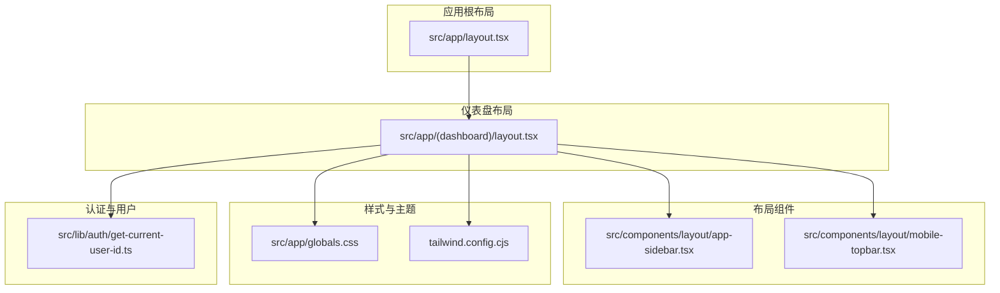
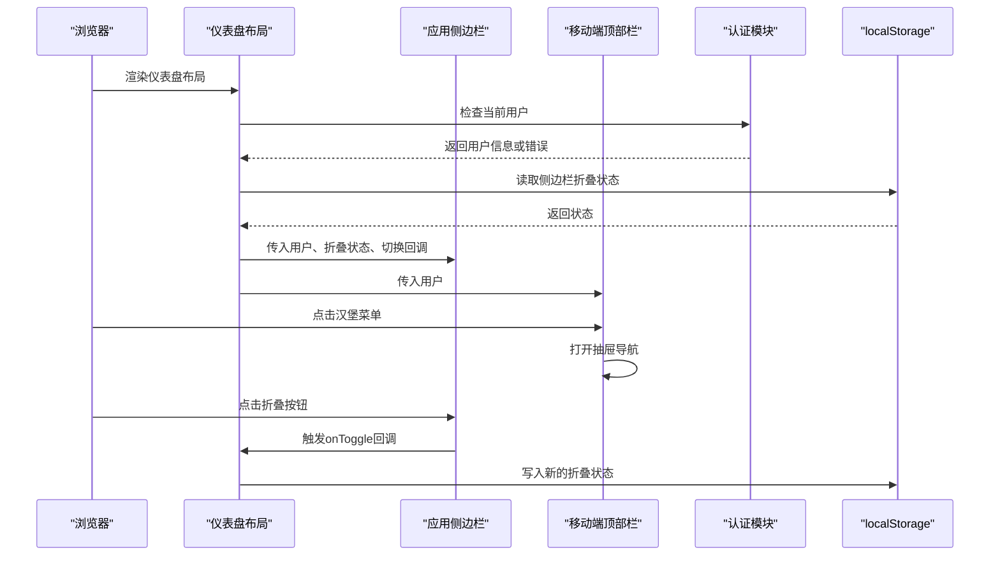
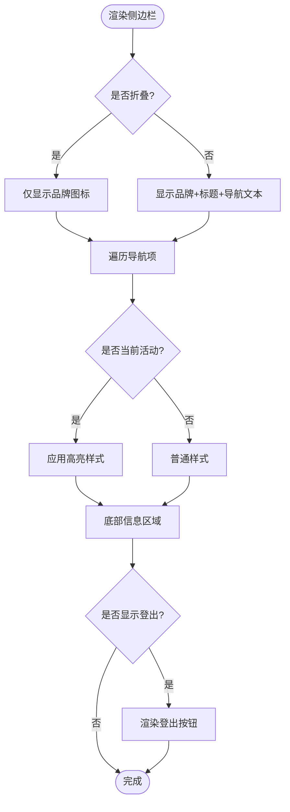
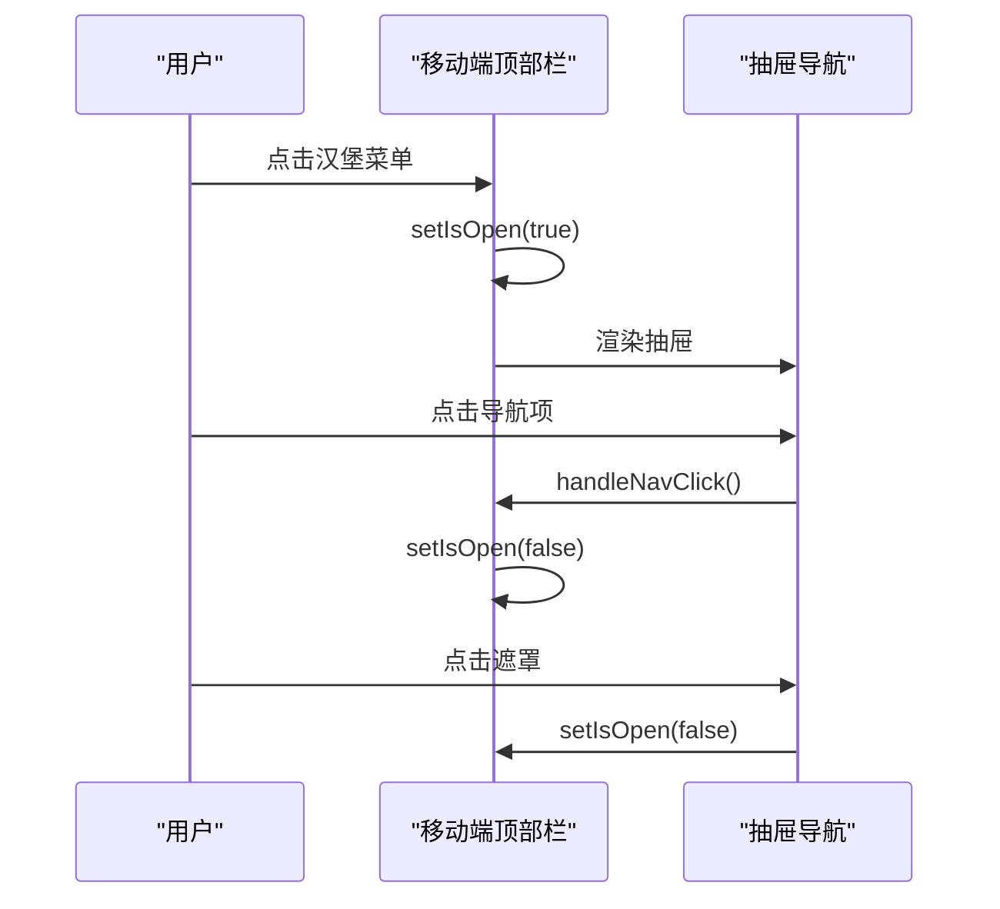
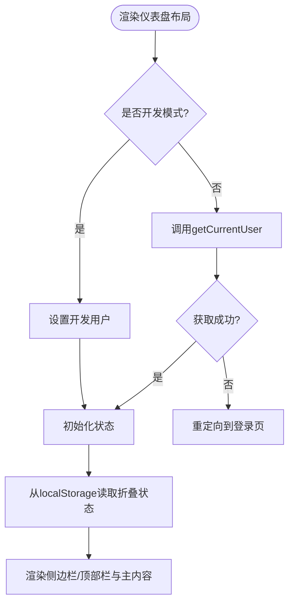
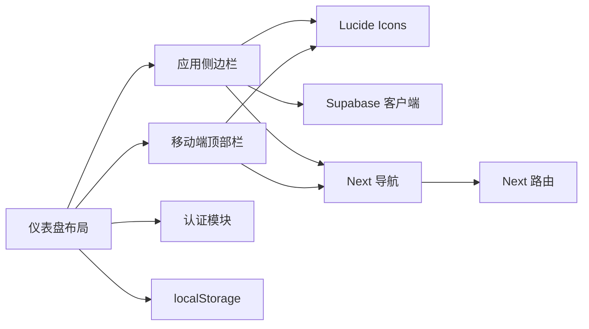

# 布局组件

<cite>
**本文引用的文件**
- [app-sidebar.tsx](file://src/components/layout/app-sidebar.tsx)
- [mobile-topbar.tsx](file://src/components/layout/mobile-topbar.tsx)
- [layout.tsx](file://src/app/(dashboard)/layout.tsx)
- [layout.tsx](file://src/app/layout.tsx)
- [globals.css](file://src/app/globals.css)
- [tailwind.config.cjs](file://tailwind.config.cjs)
- [get-current-user-id.ts](file://src/lib/auth/get-current-user-id.ts)
- [package.json](file://package.json)
</cite>

## 目录
1. [简介](#简介)
2. [项目结构](#项目结构)
3. [核心组件](#核心组件)
4. [架构总览](#架构总览)
5. [详细组件分析](#详细组件分析)
6. [依赖分析](#依赖分析)
7. [性能考虑](#性能考虑)
8. [故障排除指南](#故障排除指南)
9. [结论](#结论)
10. [附录](#附录)

## 简介
本文件面向TETO应用的布局组件，重点阐述“应用侧边栏”和“移动端顶部栏”的设计理念、实现细节与使用模式。内容涵盖组件属性配置、事件处理、自定义选项、响应式断点设计、导航逻辑与状态管理，并提供集成与定制示例路径、样式覆盖与主题切换建议，以及无障碍性支持说明。文档既适合初学者快速上手，也为高级开发者提供足够的技术深度。

## 项目结构
TETO采用Next.js App Router组织页面与布局，布局组件位于components/layout目录，主应用布局位于app/(dashboard)/layout.tsx，全局样式位于app/globals.css，Tailwind配置位于tailwind.config.cjs。

图表来源
- [layout.tsx](file://src/app/(dashboard)/layout.tsx#L1-L90)
- [app-sidebar.tsx:1-147](file://src/components/layout/app-sidebar.tsx#L1-L147)
- [mobile-topbar.tsx:1-137](file://src/components/layout/mobile-topbar.tsx#L1-L137)
- [globals.css:1-88](file://src/app/globals.css#L1-L88)
- [tailwind.config.cjs:1-61](file://tailwind.config.cjs#L1-L61)
- [get-current-user-id.ts:1-88](file://src/lib/auth/get-current-user-id.ts#L1-L88)

章节来源
- [layout.tsx](file://src/app/(dashboard)/layout.tsx#L1-L90)
- [app-sidebar.tsx:1-147](file://src/components/layout/app-sidebar.tsx#L1-L147)
- [mobile-topbar.tsx:1-137](file://src/components/layout/mobile-topbar.tsx#L1-L137)
- [globals.css:1-88](file://src/app/globals.css#L1-L88)
- [tailwind.config.cjs:1-61](file://tailwind.config.cjs#L1-L61)

## 核心组件
- 应用侧边栏（桌面端）：负责主导航、用户信息与登出功能，支持折叠/展开，状态持久化至localStorage。
- 移动端顶部栏（移动端）：提供汉堡菜单触发抽屉式导航，包含主导航项与用户信息展示。
- 仪表盘布局：协调两侧栏与主内容区域，处理认证状态、加载态与响应式布局切换。

章节来源
- [app-sidebar.tsx:26-30](file://src/components/layout/app-sidebar.tsx#L26-L30)
- [mobile-topbar.tsx:21-23](file://src/components/layout/mobile-topbar.tsx#L21-L23)
- [layout.tsx](file://src/app/(dashboard)/layout.tsx#L12-L16)

## 架构总览
布局组件围绕“桌面端侧边栏 + 移动端抽屉导航”的双通道设计，通过Tailwind的断点系统实现响应式切换。认证状态由仪表盘布局统一管理，用户信息传递给两侧栏组件以渲染个性化内容。

图表来源
- [layout.tsx](file://src/app/(dashboard)/layout.tsx#L19-L57)
- [app-sidebar.tsx:32-39](file://src/components/layout/app-sidebar.tsx#L32-L39)
- [mobile-topbar.tsx:25-31](file://src/components/layout/mobile-topbar.tsx#L25-L31)

## 详细组件分析

### 应用侧边栏（桌面端）
- 设计理念
  - 固定左侧边栏，桌面端显示完整标签与图标，移动端隐藏。
  - 支持折叠模式，减少空间占用；折叠时仅显示图标与品牌标识。
  - 使用渐变高亮表示当前活动导航项，提升可发现性。
- 属性配置
  - user: 任意用户对象（用于显示邮箱/开发模式标识与登出按钮）。
  - collapsed: 是否折叠（布尔，默认false）。
  - onToggle: 折叠切换回调（函数）。
- 事件处理
  - 折叠/展开按钮点击：调用onToggle更新父级状态。
  - 登出按钮点击：调用Supabase客户端执行signOut并跳转登录页。
- 导航逻辑
  - 主导航项包含“记录”、“事项”、“洞察”，使用isActivePath判断当前活动项。
  - 折叠模式下仅显示图标，非折叠模式显示文本与图标。
- 状态管理
  - 仪表盘布局通过useState管理sidebarCollapsed，并通过localStorage持久化。
- 样式与主题
  - 使用slate系列颜色构建深色主题，配合蓝色系强调色。
  - 折叠宽度20，非折叠宽度72，过渡动画持续300ms。
- 无障碍性
  - 折叠按钮提供aria-label，便于屏幕阅读器识别。
- 自定义选项
  - 可通过props扩展更多导航项，或替换图标组件。
  - 可在底部区域添加更多信息块或快捷入口。

图表来源
- [app-sidebar.tsx:42-146](file://src/components/layout/app-sidebar.tsx#L42-L146)

章节来源
- [app-sidebar.tsx:15-24](file://src/components/layout/app-sidebar.tsx#L15-L24)
- [app-sidebar.tsx:26-30](file://src/components/layout/app-sidebar.tsx#L26-L30)
- [app-sidebar.tsx:32-39](file://src/components/layout/app-sidebar.tsx#L32-L39)
- [app-sidebar.tsx:75-111](file://src/components/layout/app-sidebar.tsx#L75-L111)
- [app-sidebar.tsx:113-146](file://src/components/layout/app-sidebar.tsx#L113-L146)

### 移动端顶部栏（移动端）
- 设计理念
  - 顶部固定导航栏，提供汉堡菜单按钮。
  - 抽屉式导航覆盖左侧，包含主导航与用户信息。
  - 在lg及以上断点隐藏，避免重复交互。
- 属性配置
  - user: 用户对象（可选）。
- 事件处理
  - 汉堡菜单点击：切换抽屉开关。
  - 抽屉遮罩点击：关闭抽屉。
  - 导航项点击：关闭抽屉并跳转。
- 导航逻辑
  - 主导航项与桌面端一致，使用pathname判断活动项。
- 状态管理
  - 使用useState管理抽屉开关，组件内部状态。
- 样式与主题
  - 深色主题，抽屉宽度72，遮罩半透明黑。
- 无障碍性
  - 菜单按钮提供aria-label。
- 自定义选项
  - 可扩展抽屉中的信息区域，添加设置入口等。

图表来源
- [mobile-topbar.tsx:25-31](file://src/components/layout/mobile-topbar.tsx#L25-L31)
- [mobile-topbar.tsx:52-133](file://src/components/layout/mobile-topbar.tsx#L52-L133)

章节来源
- [mobile-topbar.tsx:14-19](file://src/components/layout/mobile-topbar.tsx#L14-L19)
- [mobile-topbar.tsx:21-23](file://src/components/layout/mobile-topbar.tsx#L21-L23)
- [mobile-topbar.tsx:25-31](file://src/components/layout/mobile-topbar.tsx#L25-L31)
- [mobile-topbar.tsx:52-133](file://src/components/layout/mobile-topbar.tsx#L52-L133)

### 仪表盘布局（协调者）
- 设计理念
  - 统一处理认证状态、加载态与布局容器。
  - 桌面端渲染侧边栏，移动端渲染顶部栏与抽屉。
  - 主内容区域根据侧边栏状态动态调整左边距。
- 状态管理
  - loading：认证检查期间的加载态。
  - user：当前用户信息。
  - sidebarCollapsed：侧边栏折叠状态，localStorage持久化。
- 响应式断点
  - lg断点：侧边栏显示，抽屉隐藏；主内容区域根据侧边栏宽度调整左边距。
  - lg以下：侧边栏隐藏，抽屉显示。
- 认证流程
  - 开发模式：直接返回开发用户。
  - 生产模式：调用getCurrentUser获取用户，失败则重定向登录。

图表来源
- [layout.tsx](file://src/app/(dashboard)/layout.tsx#L19-L57)
- [get-current-user-id.ts:42-79](file://src/lib/auth/get-current-user-id.ts#L42-L79)

章节来源
- [layout.tsx](file://src/app/(dashboard)/layout.tsx#L12-L16)
- [layout.tsx](file://src/app/(dashboard)/layout.tsx#L19-L57)
- [layout.tsx](file://src/app/(dashboard)/layout.tsx#L67-L89)

## 依赖分析
- 组件依赖
  - 应用侧边栏依赖Lucide图标库、Supabase客户端、Next.js路由工具。
  - 移动端顶部栏依赖Lucide图标库、Next.js路由工具。
  - 仪表盘布局依赖认证模块、本地存储API。
- 外部依赖
  - Next.js App Router、Tailwind CSS、Lucide React、Supabase JS SDK。
- 潜在循环依赖
  - 布局组件之间无直接循环依赖，通过props向下传递状态与回调。

图表来源
- [app-sidebar.tsx:3-13](file://src/components/layout/app-sidebar.tsx#L3-L13)
- [mobile-topbar.tsx:3-12](file://src/components/layout/mobile-topbar.tsx#L3-L12)
- [layout.tsx](file://src/app/(dashboard)/layout.tsx#L3-L7)
- [package.json:15-32](file://package.json#L15-L32)

章节来源
- [package.json:15-32](file://package.json#L15-L32)
- [app-sidebar.tsx:3-13](file://src/components/layout/app-sidebar.tsx#L3-L13)
- [mobile-topbar.tsx:3-12](file://src/components/layout/mobile-topbar.tsx#L3-L12)
- [layout.tsx](file://src/app/(dashboard)/layout.tsx#L3-L7)

## 性能考虑
- 渲染优化
  - 侧边栏折叠状态在组件外部声明常量，避免每次渲染重新计算。
  - 仪表盘布局使用CSS类名拼接控制左边距，避免复杂计算。
- 状态持久化
  - 侧边栏折叠状态写入localStorage，减少重复计算与网络请求。
- 图标与资源
  - Lucide图标按需引入，避免全量打包。
- 响应式渲染
  - 使用Tailwind断点在CSS层面控制元素显示/隐藏，减少JS条件分支。

章节来源
- [layout.tsx](file://src/app/(dashboard)/layout.tsx#L9-L10)
- [layout.tsx](file://src/app/(dashboard)/layout.tsx#L52-L57)
- [app-sidebar.tsx:42-46](file://src/components/layout/app-sidebar.tsx#L42-L46)

## 故障排除指南
- 登录状态异常
  - 症状：进入仪表盘后反复跳转登录页。
  - 排查：确认认证模块返回的用户信息是否为空，检查Supabase会话状态。
  - 参考路径：[get-current-user-id.ts:42-79](file://src/lib/auth/get-current-user-id.ts#L42-L79)
- 侧边栏状态不同步
  - 症状：刷新页面后侧边栏宽度与UI不一致。
  - 排查：确认localStorage中是否存在sidebarCollapsed键值，检查写入时机。
  - 参考路径：[layout.tsx](file://src/app/(dashboard)/layout.tsx#L20-L27), [layout.tsx](file://src/app/(dashboard)/layout.tsx#L52-L57)
- 折叠按钮无效
  - 症状：点击折叠按钮无反应。
  - 排查：确认onToggle回调是否正确传入，检查事件绑定与状态更新。
  - 参考路径：[app-sidebar.tsx:63-71](file://src/components/layout/app-sidebar.tsx#L63-L71)
- 抽屉无法关闭
  - 症状：点击导航项或遮罩后抽屉仍保持开启。
  - 排查：确认handleNavClick与遮罩点击事件是否触发setIsOpen(false)。
  - 参考路径：[mobile-topbar.tsx:29-31](file://src/components/layout/mobile-topbar.tsx#L29-L31), [mobile-topbar.tsx:56-59](file://src/components/layout/mobile-topbar.tsx#L56-L59)

章节来源
- [get-current-user-id.ts:42-79](file://src/lib/auth/get-current-user-id.ts#L42-L79)
- [layout.tsx](file://src/app/(dashboard)/layout.tsx#L20-L27)
- [layout.tsx](file://src/app/(dashboard)/layout.tsx#L52-L57)
- [app-sidebar.tsx:63-71](file://src/components/layout/app-sidebar.tsx#L63-L71)
- [mobile-topbar.tsx:29-31](file://src/components/layout/mobile-topbar.tsx#L29-L31)
- [mobile-topbar.tsx:56-59](file://src/components/layout/mobile-topbar.tsx#L56-L59)

## 结论
TETO的布局组件通过清晰的职责划分与响应式断点设计，实现了桌面端与移动端的一致体验。应用侧边栏与移动端顶部栏分别承担不同场景下的导航需求，仪表盘布局作为协调者统一处理认证与状态管理。通过localStorage持久化与Tailwind断点，组件具备良好的可定制性与可维护性。建议在后续迭代中进一步完善主题切换与无障碍性细节，以提升用户体验。

## 附录

### 响应式断点与适配策略
- 断点使用
  - lg：桌面端显示侧边栏，抽屉隐藏；主内容区域根据侧边栏宽度调整左边距。
  - lg以下：侧边栏隐藏，抽屉显示。
- 适配建议
  - 在lg断点附近微调侧边栏宽度与主内容区域间距，确保视觉平衡。
  - 移动端抽屉宽度固定72，保证触摸操作的可达性。

章节来源
- [layout.tsx](file://src/app/(dashboard)/layout.tsx#L67-L89)
- [mobile-topbar.tsx:36-50](file://src/components/layout/mobile-topbar.tsx#L36-L50)

### 样式覆盖与主题切换
- 主题颜色
  - 深色主题使用slate系列，强调色为蓝色系。
  - Tailwind配置中定义了sidebar颜色组，可用于扩展主题变量。
- 样式覆盖
  - 可通过自定义CSS类名覆盖默认样式，例如调整侧边栏宽度、圆角与阴影。
  - 全局样式文件提供基础视觉层，可在此基础上扩展。
- 主题切换
  - 建议在仪表盘布局中增加主题切换逻辑，结合Tailwind的color变量与CSS自定义属性实现动态切换。

章节来源
- [globals.css:15-88](file://src/app/globals.css#L15-L88)
- [tailwind.config.cjs:37-46](file://tailwind.config.cjs#L37-L46)

### 无障碍性支持
- 属性与标签
  - 折叠按钮提供aria-label，帮助屏幕阅读器识别。
  - 菜单按钮提供aria-label，明确操作意图。
- 建议改进
  - 为导航项提供title属性，补充折叠模式下的提示信息。
  - 在抽屉关闭时将焦点返回到触发按钮，提升键盘导航体验。

章节来源
- [app-sidebar.tsx:67-68](file://src/components/layout/app-sidebar.tsx#L67-L68)
- [mobile-topbar.tsx:46-48](file://src/components/layout/mobile-topbar.tsx#L46-L48)

### 集成与定制示例（路径指引）
- 在仪表盘页面中引入布局组件
  - 示例路径：[layout.tsx](file://src/app/(dashboard)/layout.tsx#L5-L6)
- 自定义侧边栏导航项
  - 示例路径：[app-sidebar.tsx:16-20](file://src/components/layout/app-sidebar.tsx#L16-L20)
- 自定义移动端抽屉导航项
  - 示例路径：[mobile-topbar.tsx:15-19](file://src/components/layout/mobile-topbar.tsx#L15-L19)
- 修改侧边栏宽度与过渡
  - 示例路径：[app-sidebar.tsx:42-46](file://src/components/layout/app-sidebar.tsx#L42-L46)
- 添加主题颜色变量
  - 示例路径：[tailwind.config.cjs:37-46](file://tailwind.config.cjs#L37-L46)
- 覆盖全局样式
  - 示例路径：[globals.css:15-88](file://src/app/globals.css#L15-L88)