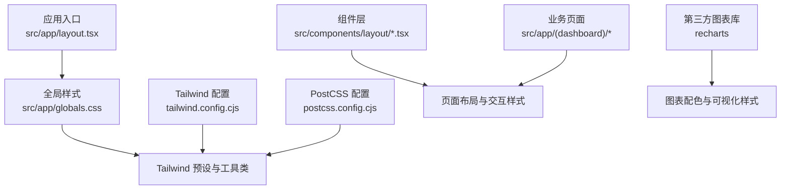
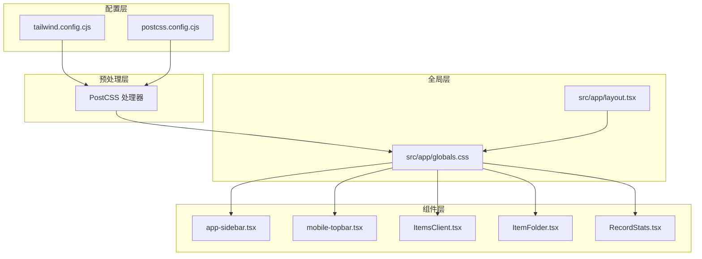
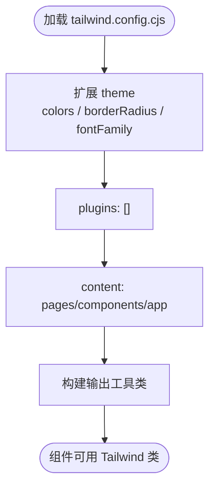
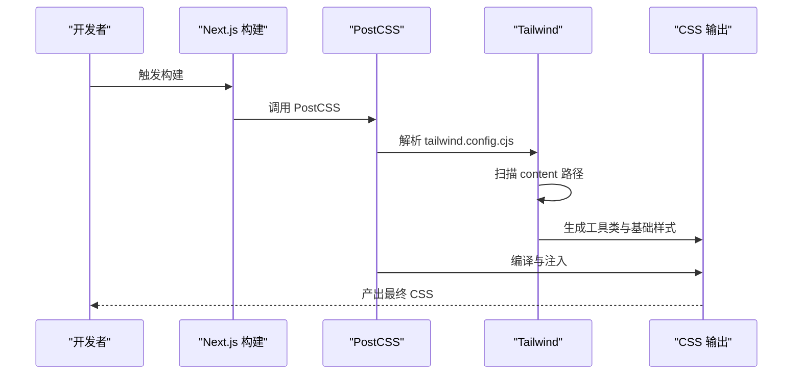
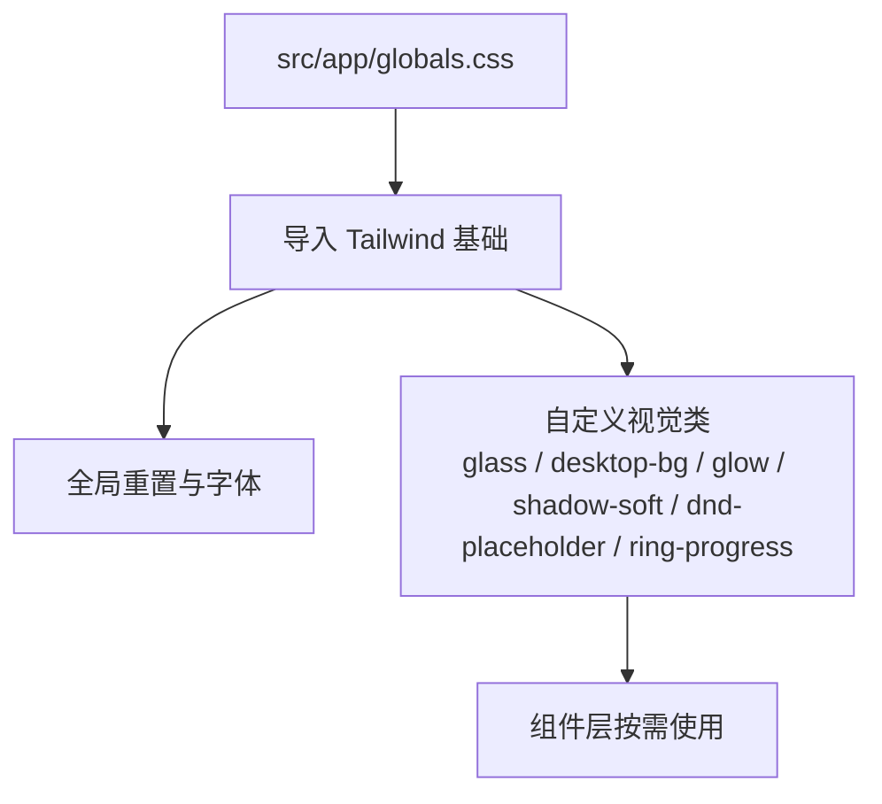
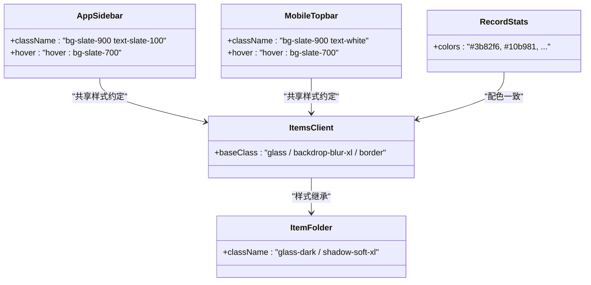
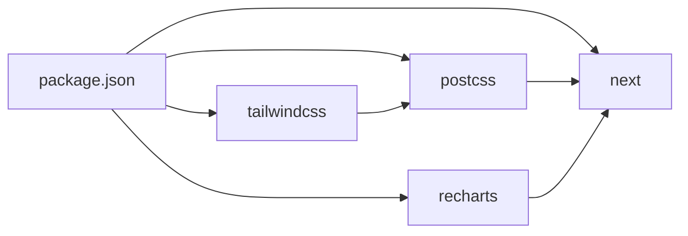

# 样式与主题

<cite>
**本文引用的文件**
- [tailwind.config.cjs](file://tailwind.config.cjs)
- [postcss.config.cjs](file://postcss.config.cjs)
- [src/app/globals.css](file://src/app/globals.css)
- [src/app/layout.tsx](file://src/app/layout.tsx)
- [package.json](file://package.json)
- [src/app/(dashboard)/layout.tsx](file://src/app/(dashboard)/layout.tsx)
- [src/components/layout/app-sidebar.tsx](file://src/components/layout/app-sidebar.tsx)
- [src/components/layout/mobile-topbar.tsx](file://src/components/layout/mobile-topbar.tsx)
- [src/app/(dashboard)/items/ItemsClient.tsx](file://src/app/(dashboard)/items/ItemsClient.tsx)
- [src/app/(dashboard)/items/components/ItemFolder.tsx](file://src/app/(dashboard)/items/components/ItemFolder.tsx)
- [src/app/(dashboard)/insights/components/RecordStats.tsx](file://src/app/(dashboard)/insights/components/RecordStats.tsx)
</cite>

## 目录
1. [简介](#简介)
2. [项目结构](#项目结构)
3. [核心组件](#核心组件)
4. [架构总览](#架构总览)
5. [详细组件分析](#详细组件分析)
6. [依赖关系分析](#依赖关系分析)
7. [性能考量](#性能考量)
8. [故障排查指南](#故障排查指南)
9. [结论](#结论)
10. [附录](#附录)

## 简介
本文件系统性梳理 TETO 的样式系统与主题设计，覆盖以下要点：
- 全局 CSS 样式的作用域与命名规范
- Tailwind CSS 的配置、颜色体系、圆角与字体扩展
- 自定义组件样式的覆盖与扩展方法
- 主题色板、字体系统、间距与响应式设计原则
- PostCSS 处理流程与插件配置
- 暗色模式支持现状与建议
- 浏览器兼容性与性能优化策略
- 样式定制指南与最佳实践

## 项目结构
TETO 的样式系统以 Next.js 应用入口为根，通过全局样式引入 Tailwind，并在组件中按需使用 Tailwind 工具类与自定义 CSS 类组合实现一致的视觉语言。

**图示来源**
- [src/app/layout.tsx:1-13](file://src/app/layout.tsx#L1-L13)
- [src/app/globals.css:1-88](file://src/app/globals.css#L1-L88)
- [tailwind.config.cjs:1-61](file://tailwind.config.cjs#L1-L61)
- [postcss.config.cjs:1-5](file://postcss.config.cjs#L1-L5)

**章节来源**
- [src/app/layout.tsx:1-13](file://src/app/layout.tsx#L1-L13)
- [src/app/globals.css:1-88](file://src/app/globals.css#L1-L88)
- [tailwind.config.cjs:1-61](file://tailwind.config.cjs#L1-L61)
- [postcss.config.cjs:1-5](file://postcss.config.cjs#L1-L5)

## 核心组件
- Tailwind 配置与颜色体系
  - 使用 oklch 色彩空间定义主色板，覆盖背景、前景、卡片、弹出层、输入框、边框、环形高亮等语义色。
  - 扩展 chart 与 sidebar 子色板，便于图表与侧边栏主题一致性。
  - 圆角半径统一为 lg/md/sm，确保组件转场与边界的一致性。
  - 字体族通过 CSS 变量挂载到 Tailwind，支持 sans/serif/mono 三类字体族。
- PostCSS 与 Tailwind 集成
  - 通过 PostCSS 插件桥接 Tailwind，确保构建期生成所需工具类。
- 全局样式与自定义类
  - 在全局样式中定义毛玻璃卡片、桌面背景网格、微光晕与柔和阴影等通用视觉元素。
  - 提供环形进度条等可复用组件样式，使用 CSS 变量实现动态进度展示。
- 组件层样式
  - 侧边栏与移动端导航采用深色背景与浅色文字，强调对比度与可读性。
  - 业务组件（如仪表盘、事项看板、文件夹弹窗）通过 Tailwind 与自定义类组合实现统一风格。

**章节来源**
- [tailwind.config.cjs:8-59](file://tailwind.config.cjs#L8-L59)
- [postcss.config.cjs:1-5](file://postcss.config.cjs#L1-L5)
- [src/app/globals.css:15-88](file://src/app/globals.css#L15-L88)
- [src/components/layout/app-sidebar.tsx:41-146](file://src/components/layout/app-sidebar.tsx#L41-L146)
- [src/components/layout/mobile-topbar.tsx:36-136](file://src/components/layout/mobile-topbar.tsx#L36-L136)

## 架构总览
样式系统由“配置—预处理—全局—组件”四层构成，形成从色彩到排版再到交互的完整闭环。

**图示来源**
- [tailwind.config.cjs:1-61](file://tailwind.config.cjs#L1-L61)
- [postcss.config.cjs:1-5](file://postcss.config.cjs#L1-L5)
- [src/app/globals.css:1-88](file://src/app/globals.css#L1-L88)
- [src/app/layout.tsx:1-13](file://src/app/layout.tsx#L1-L13)
- [src/components/layout/app-sidebar.tsx:41-146](file://src/components/layout/app-sidebar.tsx#L41-L146)
- [src/components/layout/mobile-topbar.tsx:36-136](file://src/components/layout/mobile-topbar.tsx#L36-L136)
- [src/app/(dashboard)/items/ItemsClient.tsx:489-539](file://src/app/(dashboard)/items/ItemsClient.tsx#L489-L539)
- [src/app/(dashboard)/items/components/ItemFolder.tsx:112-132](file://src/app/(dashboard)/items/components/ItemFolder.tsx#L112-L132)
- [src/app/(dashboard)/insights/components/RecordStats.tsx:17-37](file://src/app/(dashboard)/insights/components/RecordStats.tsx#L17-L37)

## 详细组件分析

### Tailwind 配置与主题色板
- 颜色体系
  - 采用 oklch 表达式定义主色板，保证明度、色度与色相的可调性与一致性。
  - 语义色包括 background/foreground/card/popover/primary/secondary/muted/accent/destructive/border/input/ring 等。
  - chart 与 sidebar 子色板用于图表与侧边栏主题化，提升组件一致性。
- 圆角与字体
  - 圆角半径 lg/md/sm 统一组件边界过渡。
  - 字体族通过 CSS 变量绑定，优先使用系统字体栈，兼顾跨平台一致性。
- 插件与内容扫描
  - 当前未启用额外插件；content 扫描路径覆盖 pages/components/app，确保工具类被正确提取。

**图示来源**
- [tailwind.config.cjs:3-7](file://tailwind.config.cjs#L3-L7)
- [tailwind.config.cjs:8-59](file://tailwind.config.cjs#L8-L59)
- [tailwind.config.cjs:60-61](file://tailwind.config.cjs#L60-L61)

**章节来源**
- [tailwind.config.cjs:1-61](file://tailwind.config.cjs#L1-L61)

### PostCSS 处理流程与插件配置
- PostCSS 配置
  - 通过 "@tailwindcss/postcss" 插件桥接 Tailwind，确保在构建阶段生成所需样式。
- 与 Tailwind 的协作
  - Tailwind 在构建时扫描 content 路径，结合配置生成最小化工具类集合，PostCSS 负责编译与注入。

**图示来源**
- [postcss.config.cjs:1-5](file://postcss.config.cjs#L1-L5)
- [tailwind.config.cjs:3-7](file://tailwind.config.cjs#L3-L7)

**章节来源**
- [postcss.config.cjs:1-5](file://postcss.config.cjs#L1-L5)
- [tailwind.config.cjs:1-61](file://tailwind.config.cjs#L1-L61)

### 全局样式与自定义类
- 全局重置与字体
  - 对 html/body 进行基础重置，设置系统字体栈并开启抗锯齿，提升可读性。
- 自定义视觉层
  - 毛玻璃卡片：提供轻/重/暗三种变体，适配不同场景。
  - 桌面背景网格：渐变背景增强桌面感。
  - 微光晕与柔和阴影：统一投影层级，营造层次感。
  - Bento Grid 占位符：拖拽占位的视觉反馈。
  - 环形进度条：基于 CSS 变量与 conic-gradient 实现动态进度展示。

**图示来源**
- [src/app/globals.css:1-88](file://src/app/globals.css#L1-L88)

**章节来源**
- [src/app/globals.css:1-88](file://src/app/globals.css#L1-L88)

### 组件样式覆盖与扩展方法
- 侧边栏与移动端导航
  - 使用深色背景与浅色文字，强调对比度；按钮与图标采用 hover 状态提升交互反馈。
- 事项看板与文件夹弹窗
  - 通过 Tailwind 与自定义类组合实现毛玻璃、阴影与圆角，保证视觉一致性。
- 图表组件
  - 使用固定配色数组与 Tailwind 边框/背景类，确保图表与界面风格统一。

**图示来源**
- [src/components/layout/app-sidebar.tsx:41-146](file://src/components/layout/app-sidebar.tsx#L41-L146)
- [src/components/layout/mobile-topbar.tsx:36-136](file://src/components/layout/mobile-topbar.tsx#L36-L136)
- [src/app/(dashboard)/items/ItemsClient.tsx:489-539](file://src/app/(dashboard)/items/ItemsClient.tsx#L489-L539)
- [src/app/(dashboard)/items/components/ItemFolder.tsx:112-132](file://src/app/(dashboard)/items/components/ItemFolder.tsx#L112-L132)
- [src/app/(dashboard)/insights/components/RecordStats.tsx:17-37](file://src/app/(dashboard)/insights/components/RecordStats.tsx#L17-L37)

**章节来源**
- [src/components/layout/app-sidebar.tsx:41-146](file://src/components/layout/app-sidebar.tsx#L41-L146)
- [src/components/layout/mobile-topbar.tsx:36-136](file://src/components/layout/mobile-topbar.tsx#L36-L136)
- [src/app/(dashboard)/items/ItemsClient.tsx:489-539](file://src/app/(dashboard)/items/ItemsClient.tsx#L489-L539)
- [src/app/(dashboard)/items/components/ItemFolder.tsx:112-132](file://src/app/(dashboard)/items/components/ItemFolder.tsx#L112-L132)
- [src/app/(dashboard)/insights/components/RecordStats.tsx:17-37](file://src/app/(dashboard)/insights/components/RecordStats.tsx#L17-L37)

### 暗色模式支持现状与建议
- 现状
  - 项目中存在暗色相关类名（如 glass-dark），但未见显式的暗色模式开关或系统级 prefers-color-scheme 处理。
- 建议
  - 在 tailwind.config.cjs 中启用 darkMode 选项，推荐使用 "class" 或 "media" 策略。
  - 在根节点添加暗色 class 或使用媒体查询，确保组件层样式自动适配。
  - 为关键组件补充暗色变量覆盖，确保对比度与可读性。

**章节来源**
- [src/app/globals.css:28-32](file://src/app/globals.css#L28-L32)
- [tailwind.config.cjs:8-59](file://tailwind.config.cjs#L8-L59)

### 响应式设计原则与断点
- 断点与容器
  - Tailwind 默认断点满足常见响应式需求；项目中未自定义断点。
- 原则
  - 使用语义化尺寸与间距，配合 flex/grid 布局在移动端与桌面端保持一致的视觉节奏。
  - 通过组件层的条件渲染与类名组合，实现移动端抽屉导航与桌面端侧边栏的差异化体验。

**章节来源**
- [tailwind.config.cjs:48-57](file://tailwind.config.cjs#L48-L57)
- [src/components/layout/mobile-topbar.tsx:52-136](file://src/components/layout/mobile-topbar.tsx#L52-L136)
- [src/components/layout/app-sidebar.tsx:41-146](file://src/components/layout/app-sidebar.tsx#L41-L146)

### 字体系统与排版规范
- 字体族
  - sans/serif/mono 三类字体族均通过 CSS 变量挂载，优先使用系统字体栈，保证跨平台一致性。
- 排版建议
  - 使用 Tailwind 文本类控制字号、字重与行高，配合 CSS 变量实现主题化排版。
  - 为代码片段与等宽内容提供专用字体族，提升可读性。

**章节来源**
- [tailwind.config.cjs:53-57](file://tailwind.config.cjs#L53-L57)
- [src/app/globals.css:9-13](file://src/app/globals.css#L9-L13)

### 间距规范与布局约束
- 间距
  - 使用 Tailwind 间距工具类与组件内联样式组合，确保元素间留白一致。
- 布局
  - 通过 Flex/Grid 与圆角、阴影等修饰类，形成统一的卡片式布局风格。

**章节来源**
- [src/app/(dashboard)/items/ItemsClient.tsx:489-539](file://src/app/(dashboard)/items/ItemsClient.tsx#L489-L539)
- [src/app/(dashboard)/items/components/ItemFolder.tsx:112-132](file://src/app/(dashboard)/items/components/ItemFolder.tsx#L112-L132)

## 依赖关系分析
- 核心依赖
  - Tailwind CSS 与 PostCSS 作为样式处理核心；Next.js 提供构建与运行时支持。
- 组件与样式耦合
  - 组件层广泛使用 Tailwind 工具类与自定义类，形成“样式即类名”的低耦合设计。
- 第三方库
  - recharts 用于数据可视化，配合固定配色数组与 Tailwind 边框类实现风格统一。

**图示来源**
- [package.json:15-42](file://package.json#L15-L42)

**章节来源**
- [package.json:15-42](file://package.json#L15-L42)

## 性能考量
- 构建期优化
  - Tailwind content 扫描范围明确，避免无用类进入产物；建议保持扫描路径与实际使用一致。
- 运行时优化
  - 使用 CSS 变量与基础类减少重复样式声明；合理拆分组件，避免过度渲染。
- 图片与资源
  - 毛玻璃与阴影等效果对 GPU 有一定压力，建议在低端设备上适度降级。

[本节为通用指导，无需特定文件引用]

## 故障排查指南
- Tailwind 类不生效
  - 检查 tailwind.config.cjs 的 content 路径是否包含当前组件文件。
  - 确认 PostCSS 插件已正确安装与配置。
- 自定义类冲突
  - 检查 src/app/globals.css 中是否存在与组件类名冲突的选择器。
- 暗色模式异常
  - 确认已启用 darkMode 并在根节点设置对应 class 或媒体查询。
- 字体显示问题
  - 检查 CSS 变量绑定与系统字体栈优先级。

**章节来源**
- [tailwind.config.cjs:3-7](file://tailwind.config.cjs#L3-L7)
- [postcss.config.cjs:1-5](file://postcss.config.cjs#L1-L5)
- [src/app/globals.css:15-88](file://src/app/globals.css#L15-L88)

## 结论
TETO 的样式系统以 Tailwind 为核心，结合 PostCSS 与全局样式，形成了从色彩、排版到交互的一致性体验。通过明确的配置、清晰的类名规范与组件层的样式复用，系统具备良好的可维护性与扩展性。建议后续完善暗色模式支持与断点策略，进一步提升跨设备体验与性能表现。

[本节为总结性内容，无需特定文件引用]

## 附录

### 样式定制指南
- 颜色定制
  - 在 tailwind.config.cjs 的 theme.extend.colors 中新增或调整语义色，确保 chart 与 sidebar 子色板同步更新。
- 字体定制
  - 通过 CSS 变量与 Tailwind fontFamily 扩展，统一三类字体族。
- 组件扩展
  - 在组件中优先使用 Tailwind 工具类，必要时在 src/app/globals.css 中补充通用类，避免重复定义。

**章节来源**
- [tailwind.config.cjs:8-59](file://tailwind.config.cjs#L8-L59)
- [src/app/globals.css:15-88](file://src/app/globals.css#L15-L88)