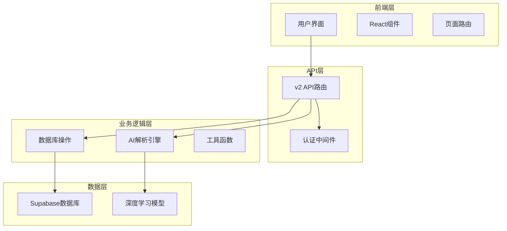
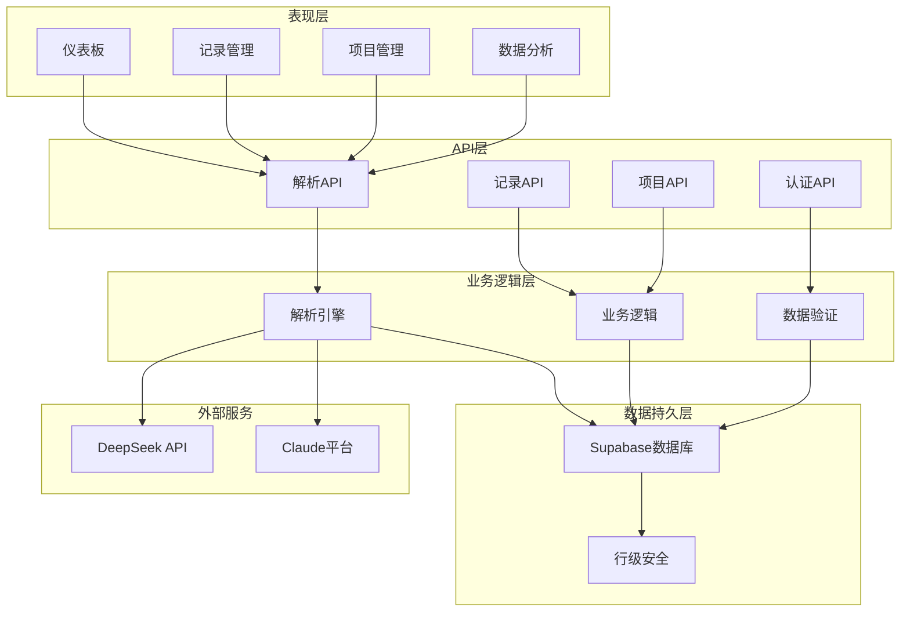
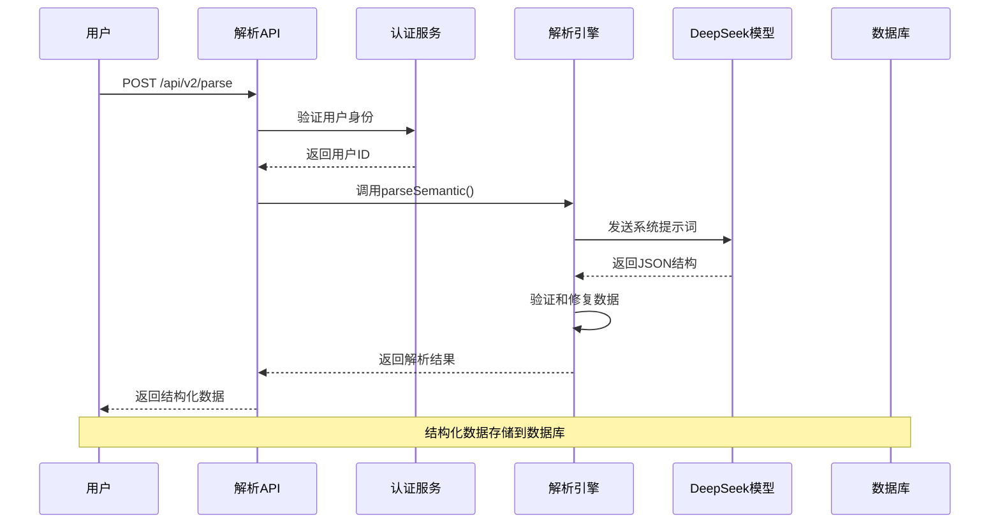
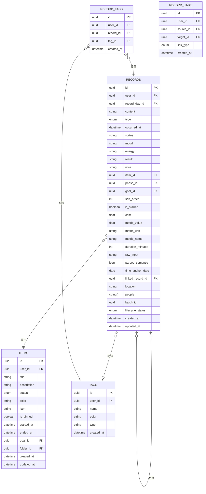
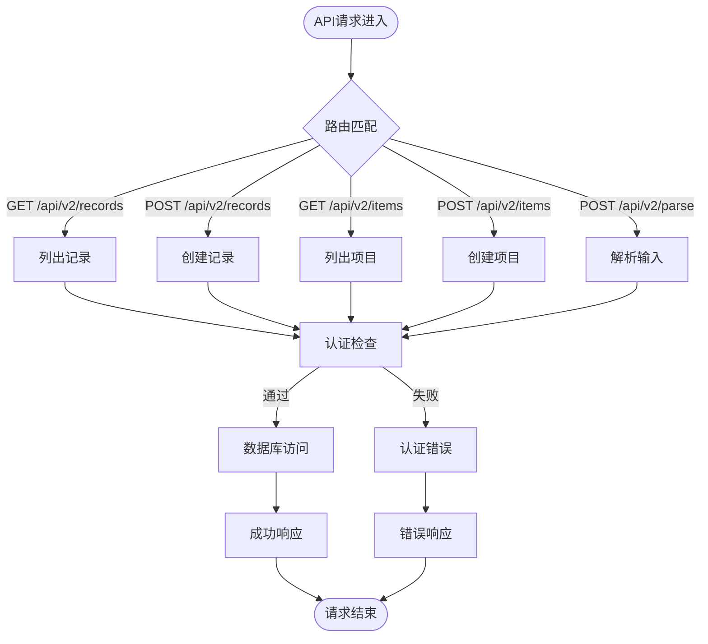

# Claude AI开发集成指南

<cite>
**本文档引用的文件**
- [CLAUDE.md](file://CLAUDE.md)
- [README.md](file://README.md)
- [package.json](file://package.json)
- [src/app/api/v2/parse/route.ts](file://src/app/api/v2/parse/route.ts)
- [src/lib/ai/parse-semantic.ts](file://src/lib/ai/parse-semantic.ts)
- [src/types/semantic.ts](file://src/types/semantic.ts)
- [src/lib/db/records.ts](file://src/lib/db/records.ts)
- [src/lib/db/items.ts](file://src/lib/db/items.ts)
- [src/types/teto.ts](file://src/types/teto.ts)
- [src/app/api/v2/records/route.ts](file://src/app/api/v2/records/route.ts)
- [src/app/api/v2/items/route.ts](file://src/app/api/v2/items/route.ts)
- [src/lib/supabase/server.ts](file://src/lib/supabase/server.ts)
- [src/lib/auth/server/get-current-user-id.ts](file://src/lib/auth/server/get-current-user-id.ts)
</cite>

## 目录
1. [简介](#简介)
2. [项目结构](#项目结构)
3. [核心组件](#核心组件)
4. [架构概览](#架构概览)
5. [详细组件分析](#详细组件分析)
6. [依赖分析](#依赖分析)
7. [性能考虑](#性能考虑)
8. [故障排除指南](#故障排除指南)
9. [结论](#结论)

## 简介

TETO是一个个人效率追踪系统，集成了Claude AI开发工具，提供了完整的AI语义解析能力。该项目采用Next.js 16.2.0 + TypeScript + Supabase的技术栈，实现了从自然语言到结构化数据的智能转换。

本项目的核心创新在于将Claude AI集成到日常效率管理中，通过深度学习模型实现自然语言输入的自动解析，将用户的日常记录、项目管理和统计分析功能提升到智能化水平。

## 项目结构

项目采用模块化的组织结构，主要分为以下几个核心部分：



**图表来源**
- [CLAUDE.md:30-50](file://CLAUDE.md#L30-L50)
- [package.json:15-32](file://package.json#L15-L32)

**章节来源**
- [CLAUDE.md:44-50](file://CLAUDE.md#L44-L50)
- [package.json:1-44](file://package.json#L1-L44)

## 核心组件

### AI语义解析引擎

AI语义解析引擎是整个系统的核心组件，负责将自然语言转换为结构化数据。该引擎基于DeepSeek LLM，实现了复杂的语义理解和数据抽取功能。

**章节来源**
- [src/lib/ai/parse-semantic.ts:1-282](file://src/lib/ai/parse-semantic.ts#L1-L282)
- [src/types/semantic.ts:1-66](file://src/types/semantic.ts#L1-L66)

### 数据库抽象层

数据库抽象层提供了统一的CRUD操作接口，封装了Supabase的复杂查询逻辑，简化了数据访问层的开发。

**章节来源**
- [src/lib/db/records.ts:1-328](file://src/lib/db/records.ts#L1-L328)
- [src/lib/db/items.ts:1-191](file://src/lib/db/items.ts#L1-L191)

### 认证系统

认证系统基于Supabase Magic Link，提供了安全的用户身份验证机制。支持开发模式和生产模式两种运行状态。

**章节来源**
- [src/lib/auth/server/get-current-user-id.ts:1-85](file://src/lib/auth/server/get-current-user-id.ts#L1-L85)
- [src/lib/supabase/server.ts:1-36](file://src/lib/supabase/server.ts#L1-L36)

## 架构概览

系统采用分层架构设计，确保了各层之间的职责分离和松耦合：



**图表来源**
- [CLAUDE.md:30-49](file://CLAUDE.md#L30-L49)
- [src/app/api/v2/parse/route.ts:1-43](file://src/app/api/v2/parse/route.ts#L1-L43)

## 详细组件分析

### AI解析流程

AI解析流程是系统的核心工作流，展示了从用户输入到结构化数据的完整转换过程：



**图表来源**
- [src/app/api/v2/parse/route.ts:12-42](file://src/app/api/v2/parse/route.ts#L12-L42)
- [src/lib/ai/parse-semantic.ts:209-281](file://src/lib/ai/parse-semantic.ts#L209-L281)

### 数据模型设计

系统采用清晰的数据模型设计，支持复杂的业务关系：



**图表来源**
- [src/types/teto.ts:37-121](file://src/types/teto.ts#L37-L121)
- [src/types/teto.ts:429-451](file://src/types/teto.ts#L429-L451)

**章节来源**
- [src/types/teto.ts:1-516](file://src/types/teto.ts#L1-L516)

### API路由设计

API路由采用了RESTful设计原则，提供了清晰的资源访问接口：



**图表来源**
- [src/app/api/v2/records/route.ts:7-85](file://src/app/api/v2/records/route.ts#L7-L85)
- [src/app/api/v2/items/route.ts:6-46](file://src/app/api/v2/items/route.ts#L6-L46)

**章节来源**
- [src/app/api/v2/records/route.ts:1-86](file://src/app/api/v2/records/route.ts#L1-L86)
- [src/app/api/v2/items/route.ts:1-47](file://src/app/api/v2/items/route.ts#L1-L47)

## 依赖分析

系统依赖关系清晰，各模块职责明确：

```mermaid
graph TB
subgraph "核心依赖"
NextJS[Next.js 16.2.0]
TypeScript[TypeScript 5.9.3]
React[React 19.2.4]
Tailwind[Tailwind CSS 4.2.2]
end
subgraph "数据库相关"
Supabase[Supabase 2.99.3]
SSR[@supabase/ssr 0.9.0]
Postgres[PostgreSQL]
end
subgraph "AI相关"
DeepSeek[DeepSeek API]
LLM[大语言模型]
end
subgraph "UI组件"
Recharts[Recharts 3.8.0]
DnDKit[@dnd-kit 6.3.1]
Lucide[Lucide React]
end
subgraph "开发工具"
ESLint[ESLint]
Autoprefixer[Autoprefixer]
PostCSS[PostCSS]
end
NextJS --> React
NextJS --> TypeScript
NextJS --> Tailwind
React --> Supabase
Supabase --> SSR
Supabase --> Postgres
NextJS --> DeepSeek
DeepSeek --> LLM
NextJS --> Recharts
NextJS --> DnDKit
NextJS --> Lucide
NextJS --> ESLint
NextJS --> Autoprefixer
NextJS --> PostCSS
```

**图表来源**
- [package.json:15-42](file://package.json#L15-L42)

**章节来源**
- [package.json:1-44](file://package.json#L1-L44)

## 性能考虑

系统在设计时充分考虑了性能优化：

### 缓存策略
- 使用数据库连接池减少连接开销
- 实现批量查询避免N+1问题
- 缓存常用配置和用户信息

### 并发处理
- 异步数据库操作避免阻塞
- 流水线处理减少等待时间
- 错误重试机制提高可靠性

### 资源优化
- 按需加载组件减少初始包大小
- 图片懒加载提升页面响应速度
- 代码分割优化首屏加载

## 故障排除指南

### 常见问题及解决方案

**认证问题**
- 检查NEXT_PUBLIC_SUPABASE_URL和NEXT_PUBLIC_SUPABASE_ANON_KEY配置
- 确认开发模式下的NEXT_PUBLIC_DEV_MODE和NEXT_PUBLIC_DEV_USER_ID设置
- 验证Supabase控制台中的URL配置

**数据库连接问题**
- 确认Supabase项目状态正常
- 检查RLS策略配置
- 验证用户权限设置

**AI解析问题**
- 检查DEEPSEEK_API_KEY配置
- 验证网络连接和API可用性
- 查看解析日志获取详细错误信息

**章节来源**
- [CLAUDE.md:16-28](file://CLAUDE.md#L16-L28)
- [src/lib/ai/parse-semantic.ts:110-142](file://src/lib/ai/parse-semantic.ts#L110-L142)

## 结论

TETO项目成功地将Claude AI集成到了个人效率管理系统中，通过智能的语义解析能力，实现了从自然语言到结构化数据的无缝转换。项目采用现代化的技术栈和清晰的架构设计，为用户提供了一个强大而易用的效率管理工具。

系统的创新之处在于：
- 深度集成AI解析引擎，提供智能化的数据输入体验
- 采用模块化设计，便于功能扩展和维护
- 实现了完整的认证和数据安全机制
- 提供了丰富的数据分析和可视化功能

未来的发展方向包括：
- 扩展AI解析能力，支持更多语言和场景
- 增强数据分析功能，提供更深入的洞察
- 优化用户体验，简化操作流程
- 加强移动端支持，实现跨平台使用