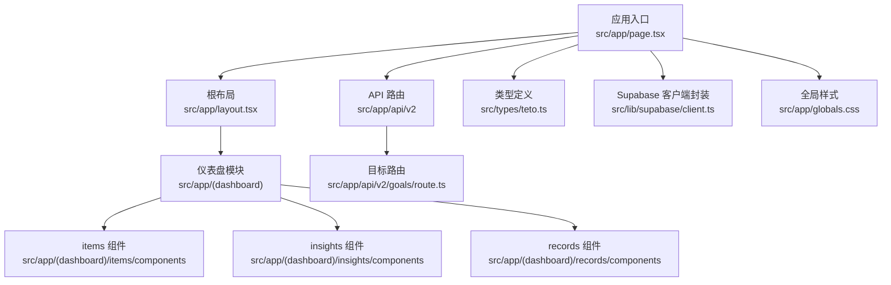
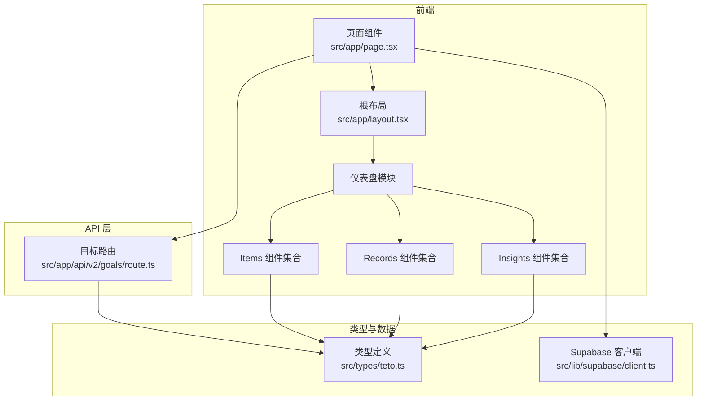
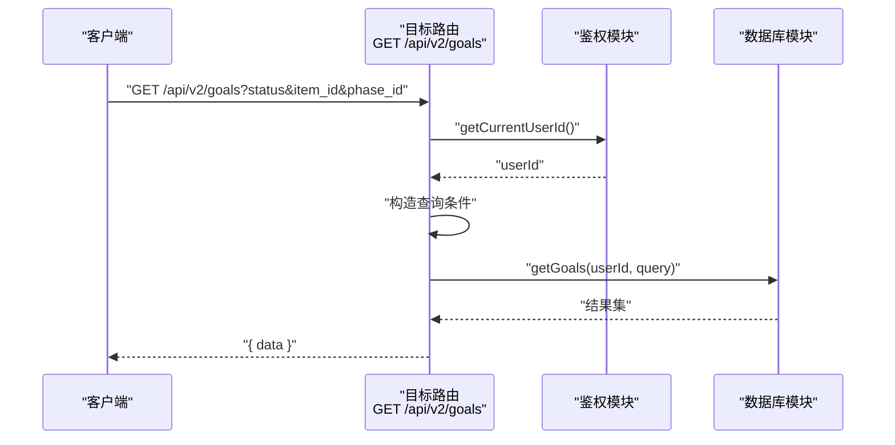
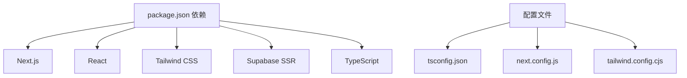

# 代码风格规范

<cite>
**本文引用的文件**   
- [package.json](file://package.json)
- [tsconfig.json](file://tsconfig.json)
- [next.config.js](file://next.config.js)
- [tailwind.config.cjs](file://tailwind.config.cjs)
- [DATA_RULES.md](file://DATA_RULES.md)
- [src/app/layout.tsx](file://src/app/layout.tsx)
- [src/app/page.tsx](file://src/app/page.tsx)
- [src/app/api/v2/goals/route.ts](file://src/app/api/v2/goals/route.ts)
- [src/app/(dashboard)/items/components/GoalCard.tsx](file://src/app/(dashboard)/items/components/GoalCard.tsx)
- [src/types/teto.ts](file://src/types/teto.ts)
- [src/lib/supabase/client.ts](file://src/lib/supabase/client.ts)
</cite>

## 目录
1. 引言
2. 项目结构
3. 核心组件
4. 架构总览
5. 详细组件分析
6. 依赖分析
7. 性能考虑
8. 故障排查指南
9. 结论
10. 附录

## 引言
本规范旨在统一 TETO 项目的 TypeScript 编码风格、命名约定、文件组织与注释标准，覆盖 React 组件开发、API 接口设计与数据库 Schema 设计要点，并提供代码格式化与 Lint 规则建议及 IDE 推荐配置。本文所有要求均以仓库现有实现为依据提炼而来，确保一致性与可维护性。

## 项目结构
- 采用 Next.js App Router 目录结构，页面与 API 路由分别位于 app 与 app/api 下。
- 类型定义集中于 src/types，数据库与认证等通用库位于 src/lib。
- Tailwind CSS 作为样式框架，全局样式通过 src/app/globals.css 注入根布局。
- 顶层配置文件包括 TypeScript、Next.js、Tailwind 等。

图表来源
- [src/app/page.tsx:1-5](file://src/app/page.tsx#L1-L5)
- [src/app/layout.tsx:1-13](file://src/app/layout.tsx#L1-L13)
- [src/app/(dashboard)/items/components/GoalCard.tsx](file://src/app/(dashboard)/items/components/GoalCard.tsx#L1-L114)
- [src/app/api/v2/goals/route.ts:1-49](file://src/app/api/v2/goals/route.ts#L1-L49)
- [src/types/teto.ts:1-516](file://src/types/teto.ts#L1-L516)
- [src/lib/supabase/client.ts:1-9](file://src/lib/supabase/client.ts#L1-L9)

章节来源
- [src/app/page.tsx:1-5](file://src/app/page.tsx#L1-L5)
- [src/app/layout.tsx:1-13](file://src/app/layout.tsx#L1-L13)
- [src/app/(dashboard)/items/components/GoalCard.tsx](file://src/app/(dashboard)/items/components/GoalCard.tsx#L1-L114)
- [src/app/api/v2/goals/route.ts:1-49](file://src/app/api/v2/goals/route.ts#L1-L49)
- [src/types/teto.ts:1-516](file://src/types/teto.ts#L1-L516)
- [src/lib/supabase/client.ts:1-9](file://src/lib/supabase/client.ts#L1-L9)

## 核心组件
- 类型系统：集中于 src/types/teto.ts，定义了记录、项目、标签、目标、阶段、链接、查询参数与 API 响应等核心数据模型与枚举，便于跨层一致使用。
- API 层：遵循 Next.js App Router 的路由约定，使用 server 端请求/响应对象处理业务逻辑与错误。
- UI 组件：采用函数式组件与 Hooks，结合 Tailwind CSS 实现样式，组件内部通过 props 明确输入与回调。
- Supabase 客户端：通过 src/lib/supabase/client.ts 封装浏览器端客户端初始化，保证环境变量安全访问。

章节来源
- [src/types/teto.ts:1-516](file://src/types/teto.ts#L1-L516)
- [src/app/api/v2/goals/route.ts:1-49](file://src/app/api/v2/goals/route.ts#L1-L49)
- [src/app/(dashboard)/items/components/GoalCard.tsx](file://src/app/(dashboard)/items/components/GoalCard.tsx#L1-L114)
- [src/lib/supabase/client.ts:1-9](file://src/lib/supabase/client.ts#L1-L9)

## 架构总览
下图展示了前端页面、API 路由与类型系统的交互关系，体现数据流与职责边界。

图表来源
- [src/app/page.tsx:1-5](file://src/app/page.tsx#L1-L5)
- [src/app/layout.tsx:1-13](file://src/app/layout.tsx#L1-L13)
- [src/app/api/v2/goals/route.ts:1-49](file://src/app/api/v2/goals/route.ts#L1-L49)
- [src/types/teto.ts:1-516](file://src/types/teto.ts#L1-L516)
- [src/lib/supabase/client.ts:1-9](file://src/lib/supabase/client.ts#L1-L9)

## 详细组件分析

### TypeScript 编码规范
- 严格模式与编译选项
  - 使用严格模式、禁用 emit、启用增量编译，提升类型安全与构建性能。
  - JSX 使用 react-jsx，路径别名 @/* 指向 src/*，便于模块导入。
- 类型定义
  - 使用字面量联合类型与只读数组表达枚举值，避免魔法字符串。
  - 对外暴露的接口字段明确可空性，必要时提供默认值或解构保护。
- 命名约定
  - 接口与类型名使用大驼峰；常量使用全大写与下划线组合；变量与函数使用小驼峰。
  - API 请求/响应类型以 CreateXxxPayload/UpdateXxxPayload/XxxQuery/XxxData 命名，保持一致性。
- 注释与文档
  - 对外暴露的类型与接口添加简要说明，枚举值与字段含义清晰标注。
  - 对于历史兼容字段，使用注释说明弃用原因与迁移路径。

章节来源
- [tsconfig.json:1-42](file://tsconfig.json#L1-L42)
- [src/types/teto.ts:1-516](file://src/types/teto.ts#L1-L516)

### React 组件开发规范
- 函数式组件与 Hooks
  - 组件以函数形式导出，使用 useState 等 Hooks 管理状态，避免不必要的类组件。
  - 事件处理器与状态更新分离，保持渲染函数纯净。
- Props 与回调
  - Props 接口显式声明，可选回调通过可选属性传递，调用前判空。
  - UI 组件尽量无副作用，将副作用逻辑上移到容器组件或自定义 Hooks。
- 样式与主题
  - 使用 Tailwind CSS 类名组织样式，颜色与圆角等通过 Tailwind 主题统一管理。
  - 组件内避免硬编码颜色，优先使用主题变量或语义化类名。
- 可访问性
  - 按钮等交互元素提供 aria-label，确保屏幕阅读器友好。

章节来源
- [src/app/(dashboard)/items/components/GoalCard.tsx](file://src/app/(dashboard)/items/components/GoalCard.tsx#L1-L114)
- [tailwind.config.cjs:1-61](file://tailwind.config.cjs#L1-L61)

### API 接口设计原则
- 路由组织
  - 遵循 Next.js App Router 的嵌套路由与动态路由约定，REST 风格方法与路径清晰。
- 请求/响应
  - 统一使用 NextRequest/NextResponse，请求体解析与查询参数提取规范化。
  - 成功响应统一包装 { data }，错误响应统一包装 { error } 并返回合适的状态码。
- 错误处理
  - 区分鉴权失败与服务端错误，返回 401 或 500；参数校验失败返回 400。
  - 错误消息统一从异常对象的 message 获取，兜底为“服务器错误”。

图表来源
- [src/app/api/v2/goals/route.ts:1-49](file://src/app/api/v2/goals/route.ts#L1-L49)

章节来源
- [src/app/api/v2/goals/route.ts:1-49](file://src/app/api/v2/goals/route.ts#L1-L49)

### 数据库 Schema 设计标准
- 数据真源与职责
  - 任务管理为配置真源，今日记录为原始事实真源，记录总表为查看入口，统计分析为聚合结果。
  - 统计分析不得独立维护第二套数据，必须基于任务配置与原始记录统一计算。
- 时间与目标规则
  - 开始时间优先级：手动配置 > 首次有效记录 > 创建时间。
  - 目标值优先级：直接配置 > 推导（周目标=日目标×7、月目标=日目标×当月天数）。
- 完成值与统计口径
  - 今日/本周/本月/累计完成值按日期范围汇总。
  - 任务类型：完成/未完成、次数型、数值型；备注型不参与统计；情绪类需数值化后再进入统计。
- 任务类型与不支持项
  - 当前支持：完成/未完成型、次数型、数值型。
  - 当前不支持：时间点型、上限型、复杂情绪统计、Excel 导入架构级重构、本地为真源、双端同步冲突系统等。

章节来源
- [DATA_RULES.md:1-174](file://DATA_RULES.md#L1-L174)

### 文件组织结构
- 页面与布局
  - 页面组件位于 app 下，根布局负责注入全局样式与语言设置。
- API 路由
  - API 路由按 v2 版本组织，子目录对应资源类型，动态路由参数使用方括号。
- 组件与类型
  - UI 组件按功能模块划分，类型定义集中于 types 目录，避免循环依赖。
- 通用库
  - Supabase 客户端封装于 lib/supabase，统一环境变量访问。

章节来源
- [src/app/layout.tsx:1-13](file://src/app/layout.tsx#L1-L13)
- [src/app/page.tsx:1-5](file://src/app/page.tsx#L1-L5)
- [src/app/api/v2/goals/route.ts:1-49](file://src/app/api/v2/goals/route.ts#L1-L49)
- [src/types/teto.ts:1-516](file://src/types/teto.ts#L1-L516)
- [src/lib/supabase/client.ts:1-9](file://src/lib/supabase/client.ts#L1-L9)

### 注释标准
- 类型注释
  - 对外接口字段添加简要注释，说明用途与约束。
- 函数注释
  - 公共函数与工具函数添加 JSDoc 风格注释，描述输入、输出与异常。
- 组件注释
  - Props 接口与回调函数添加注释，说明交互行为与可选性。
- 枚举与常量
  - 对枚举值与常量添加注释，说明取值含义与使用场景。

章节来源
- [src/types/teto.ts:1-516](file://src/types/teto.ts#L1-L516)
- [src/app/(dashboard)/items/components/GoalCard.tsx](file://src/app/(dashboard)/items/components/GoalCard.tsx#L1-L114)

### 代码格式化与 Lint 规则建议
- 格式化工具
  - 使用 Prettier 与 TypeScript ESLint 配合，确保格式与类型检查一致。
- Lint 规则
  - 启用 strict 模式与 noImplicitAny/noImplicitReturns 等规则，减少运行时风险。
  - 对 React 组件启用 jsx-quotes、no-unused-vars 等规则，保持 JSX 与变量使用规范。
- IDE 配置
  - VSCode 推荐安装 Prettier、ESLint、Tailwind CSS IntelliSense 插件，启用保存时格式化。
  - 设置 EditorConfig 与 Prettier 配置，统一缩进、换行与引号风格。

[本节为通用实践建议，不直接分析具体文件]

### 项目特定编码约定
- 变量命名
  - 小驼峰；布尔变量以 is/has/can 前缀；集合使用复数；常量全大写。
- 函数定义
  - 纯函数优先；副作用函数置于容器组件或自定义 Hooks；异步函数使用 async/await。
- 类结构
  - 优先使用函数式组件与 Hooks；必要时使用工具类封装纯逻辑。
- 错误处理
  - 明确区分鉴权失败、参数错误与服务端错误；统一返回 { error } 结构与状态码。

章节来源
- [src/app/api/v2/goals/route.ts:1-49](file://src/app/api/v2/goals/route.ts#L1-L49)
- [src/types/teto.ts:1-516](file://src/types/teto.ts#L1-L516)

### 实际示例与常见反面案例
- 正面案例
  - 目标卡片组件通过 props 明确输入与回调，状态更新逻辑集中在内部，UI 渲染简洁。
  - API 路由对查询参数与请求体进行统一解析与校验，错误分类处理。
- 常见反面案例与改进建议
  - 在组件内直接拼接 HTML 字符串：改为使用模板字符串或 JSX 表达式，保持类型安全。
  - 忽略可空字段：在类型定义中标注可空并在使用前判空，避免运行时错误。
  - 在路由中直接操作 DOM：将副作用逻辑移至容器组件或自定义 Hooks，保持路由纯函数特性。

章节来源
- [src/app/(dashboard)/items/components/GoalCard.tsx](file://src/app/(dashboard)/items/components/GoalCard.tsx#L1-L114)
- [src/app/api/v2/goals/route.ts:1-49](file://src/app/api/v2/goals/route.ts#L1-L49)

## 依赖分析
- 运行时依赖
  - Next.js、React、Tailwind CSS、Lucide React、Supabase SSR 等，满足前端框架与数据库连接需求。
- 开发依赖
  - TypeScript、Tailwind CSS、PostCSS、Autoprefixer 等，保障类型检查与样式构建。
- 配置依赖
  - Next.js 配置允许指定开发源，TypeScript 配置启用严格模式与路径别名。

图表来源
- [package.json:1-44](file://package.json#L1-L44)
- [tsconfig.json:1-42](file://tsconfig.json#L1-L42)
- [next.config.js:1-4](file://next.config.js#L1-L4)
- [tailwind.config.cjs:1-61](file://tailwind.config.cjs#L1-L61)

章节来源
- [package.json:1-44](file://package.json#L1-L44)
- [tsconfig.json:1-42](file://tsconfig.json#L1-L42)
- [next.config.js:1-4](file://next.config.js#L1-L4)
- [tailwind.config.cjs:1-61](file://tailwind.config.cjs#L1-L61)

## 性能考虑
- 构建与运行
  - 启用严格模式与增量编译，减少类型检查开销；禁用 emit 由 Next.js 统一处理。
- 组件渲染
  - 使用 React.memo 与 useMemo/useCallback 优化重渲染；避免在渲染期间进行昂贵计算。
- 样式加载
  - Tailwind content 路径精确，避免扫描过多文件；主题变量集中管理，减少重复定义。
- API 调用
  - 合理使用查询参数与分页，避免一次性拉取大量数据；对高频请求进行缓存与去抖。

[本节提供通用指导，不直接分析具体文件]

## 故障排查指南
- 类型错误
  - 检查 tsconfig.json 的 strict 与 moduleResolution 配置是否与项目一致。
  - 对于路径别名 @/*，确认 tsconfig.json 的 paths 与 include 配置正确。
- API 错误
  - 鉴权失败：检查鉴权中间件与环境变量；确保返回 401。
  - 参数错误：检查请求体与查询参数解析；返回 400 并给出明确错误信息。
  - 服务端错误：捕获异常并返回 500，避免泄露敏感信息。
- 样式问题
  - Tailwind 类名无效：检查 tailwind.config.cjs 的 content 路径与主题变量。
  - 样式未生效：确认全局样式在根布局中正确引入。

章节来源
- [tsconfig.json:1-42](file://tsconfig.json#L1-L42)
- [src/app/api/v2/goals/route.ts:1-49](file://src/app/api/v2/goals/route.ts#L1-L49)
- [tailwind.config.cjs:1-61](file://tailwind.config.cjs#L1-L61)
- [src/app/layout.tsx:1-13](file://src/app/layout.tsx#L1-L13)

## 结论
本规范以仓库现有实现为基础，明确了 TypeScript 编码风格、命名约定、文件组织与注释标准，并给出了 React 组件开发、API 接口设计与数据库 Schema 设计的实践建议。建议团队在日常开发中严格执行上述规范，持续改进代码质量与可维护性。

## 附录
- 术语
  - 真源：数据的原始来源，不可被统计结果替代。
  - 聚合：基于真源与配置进行的计算汇总。
- 参考资料
  - Next.js App Router 文档
  - TypeScript 官方手册
  - Tailwind CSS 指南