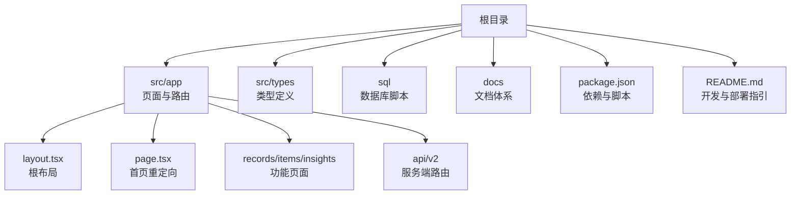
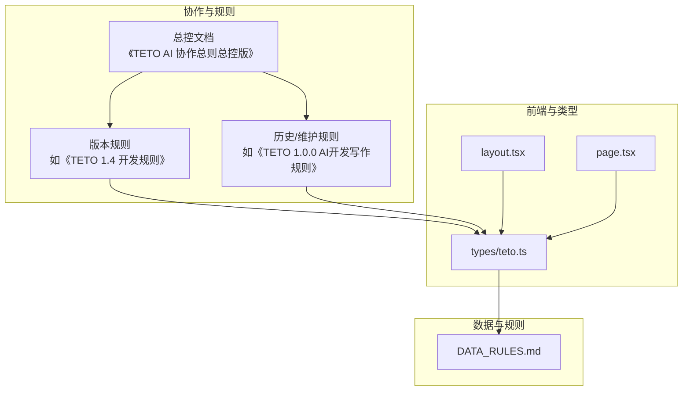
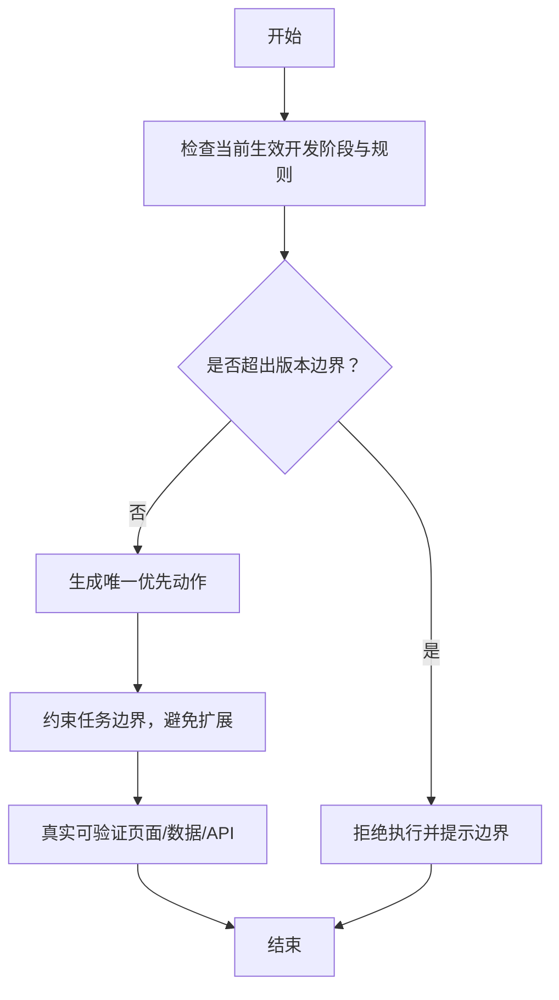
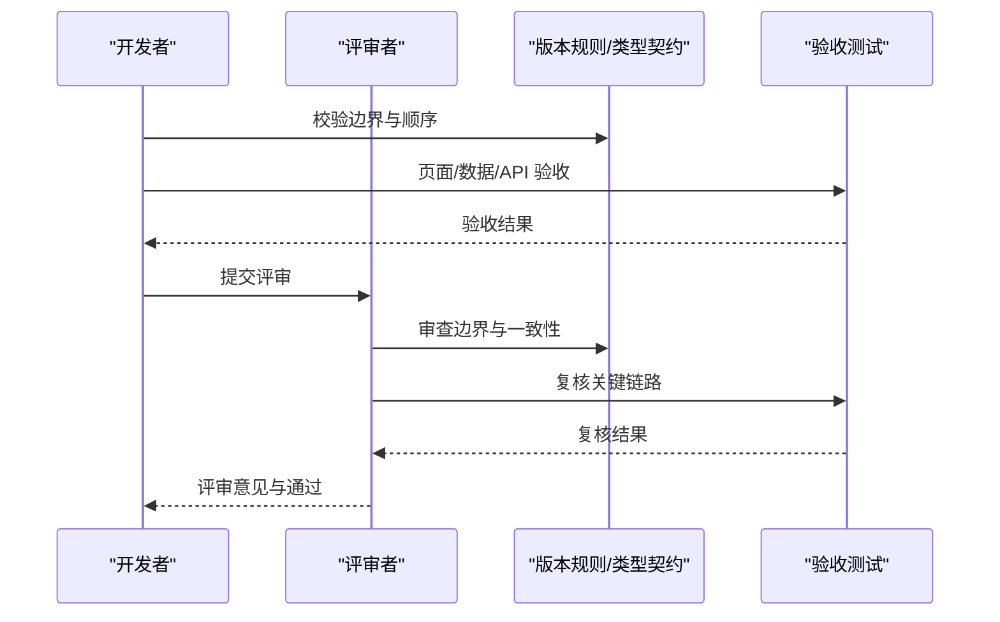
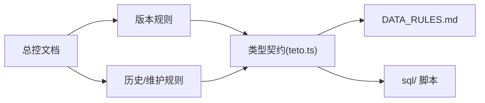

# 团队协作规范

<cite>
**本文引用的文件**
- [README.md](file://README.md)
- [DATA_RULES.md](file://DATA_RULES.md)
- [package.json](file://package.json)
- [docs/00-总控/TETO 项目总计划书（终极总纲版／ Ultimate Final）.md](file://docs/00-总控/TETO 项目总计划书（终极总纲版／ Ultimate Final）.md)
- [docs/00-总控/《TETO AI 协作总则（总控版）》.md](file://docs/00-总控/《TETO AI 协作总则（总控版）》.md)
- [docs/01-生效版本/TETO 1.4/TETO 1.4 开发规则.md](file://docs/01-生效版本/TETO 1.4/TETO 1.4 开发规则.md)
- [docs/10-版本归档/TETO 1.0.0/TETO 1.0.0 AI开发写作规则.md](file://docs/10-版本归档/TETO 1.0.0/TETO 1.0.0 AI开发写作规则.md)
- [src/app/layout.tsx](file://src/app/layout.tsx)
- [src/app/page.tsx](file://src/app/page.tsx)
- [src/types/teto.ts](file://src/types/teto.ts)
</cite>

## 目录
1. [简介](#简介)
2. [项目结构](#项目结构)
3. [核心组件](#核心组件)
4. [架构总览](#架构总览)
5. [详细组件分析](#详细组件分析)
6. [依赖分析](#依赖分析)
7. [性能考量](#性能考量)
8. [故障排查指南](#故障排查指南)
9. [结论](#结论)
10. [附录](#附录)

## 简介
本规范面向 TETO 项目团队，旨在建立统一的协作范式与工作流程，确保团队在版本推进、文档治理、开发顺序、验收标准、变更控制与远程协作等方面保持一致。文档以项目现有规则与版本规则为依据，结合当前 1.4 阶段目标，梳理团队角色、沟通机制、评审与变更流程、知识分享与技能培养、会议与决策、问题解决、文档与版本管理、远程协作与进度跟踪、团队建设与激励等维度，帮助团队高效协作并维持良好工作氛围。

## 项目结构
TETO 项目采用 Next.js 16 App Router + TypeScript + Supabase 的技术栈，前端页面位于 src/app，类型定义集中在 src/types，数据库脚本位于 sql，文档集中于 docs。项目通过 package.json 管理依赖与脚本，README 提供开发与部署指引。

**图示来源**
- [src/app/layout.tsx](file://src/app/layout.tsx)
- [src/app/page.tsx](file://src/app/page.tsx)
- [package.json](file://package.json)
- [README.md](file://README.md)

**章节来源**
- [README.md](file://README.md)
- [package.json](file://package.json)

## 核心组件
- 文档体系与规则层级
  - 总控入口：《TETO AI 协作总则（总控版）》定义 AI 角色、当前生效阶段、文档优先级与执行原则。
  - 版本规则：如《TETO 1.4 开发规则》定义阶段目标、范围边界、对象关系、页面职责、开发顺序与验收标准。
  - 历史与维护规则：如《TETO 1.0.0 AI开发写作规则》提供早期阶段的协作与验收范式。
- 数据与类型模型
  - 核心类型：记录、事项、阶段、目标、标签、链接等，统一于 src/types/teto.ts，支撑前端与 API 的数据契约。
- 前端与路由
  - 根布局与首页重定向，确保统一入口与导航一致性。
- 数据规则与统计口径
  - DATA_RULES.md 明确数据真源、页面职责、统计口径与未来方向，保障数据一致性与可追溯性。

**章节来源**
- [docs/00-总控/《TETO AI 协作总则（总控版）》.md](file://docs/00-总控/《TETO AI 协作总则（总控版）》.md)
- [docs/01-生效版本/TETO 1.4/TETO 1.4 开发规则.md](file://docs/01-生效版本/TETO 1.4/TETO 1.4 开发规则.md)
- [docs/10-版本归档/TETO 1.0.0/TETO 1.0.0 AI开发写作规则.md](file://docs/10-版本归档/TETO 1.0.0/TETO 1.0.0 AI开发写作规则.md)
- [src/types/teto.ts](file://src/types/teto.ts)
- [DATA_RULES.md](file://DATA_RULES.md)

## 架构总览
TETO 的协作架构以“文档优先、阶段限定、真实可验证”为核心，通过总控文档统一 AI 与团队的执行边界，版本规则细化阶段目标与验收标准，类型与数据规则保障前后端一致性与可追溯性。

**图示来源**
- [docs/00-总控/《TETO AI 协作总则（总控版）》.md](file://docs/00-总控/《TETO AI 协作总则（总控版）》.md)
- [docs/01-生效版本/TETO 1.4/TETO 1.4 开发规则.md](file://docs/01-生效版本/TETO 1.4/TETO 1.4 开发规则.md)
- [docs/10-版本归档/TETO 1.0.0/TETO 1.0.0 AI开发写作规则.md](file://docs/10-版本归档/TETO 1.0.0/TETO 1.0.0 AI开发写作规则.md)
- [src/types/teto.ts](file://src/types/teto.ts)
- [src/app/layout.tsx](file://src/app/layout.tsx)
- [src/app/page.tsx](file://src/app/page.tsx)
- [DATA_RULES.md](file://DATA_RULES.md)

## 详细组件分析

### 团队角色与职责
- 项目总负责人
  - 负责版本切换与阶段声明、规则优先级仲裁、重大变更决策与文档归档。
- AI 协作助理
  - 严格遵循“当前生效开发阶段 + 当前生效规则文档”，提供唯一优先动作、约束任务边界、避免提前扩展与跳步。
- 前端/后端工程师
  - 以类型契约与版本规则为依据，实现页面与 API，确保“真实可验证”。
- 数据与规则工程师
  - 以 DATA_RULES.md 为统计与数据口径依据，配合数据库脚本与 API 设计，确保数据可追溯。
- 产品经理/设计
  - 以版本规则中的页面职责与验收标准为落点，推动需求转化为可验证的功能。

**章节来源**
- [docs/00-总控/《TETO AI 协作总则（总控版）》.md](file://docs/00-总控/《TETO AI 协作总则（总控版）》.md)
- [docs/01-生效版本/TETO 1.4/TETO 1.4 开发规则.md](file://docs/01-生效版本/TETO 1.4/TETO 1.4 开发规则.md)
- [DATA_RULES.md](file://DATA_RULES.md)

### 沟通机制与协作流程
- 协作原则
  - 一次只推进一个明确任务块；不擅自扩展功能；不顺手修改无关模块；不在未被要求时擅自重构；不偏离当前版本边界。
- 任务判定与输出
  - AI 默认先给直接结论，优先告知当前最应该做的唯一动作；不同时给多个并行方案；结论必须可立刻执行。
- 验收标准
  - “完成”以“真实可验证”为准，包括页面打开、功能操作、数据保存/读取/编辑/回显、Supabase 记录可见、页面展示与数据库一致、趋势/预测/状态变化真实可见。

**图示来源**
- [docs/00-总控/《TETO AI 协作总则（总控版）》.md](file://docs/00-总控/《TETO AI 协作总则（总控版）》.md)

**章节来源**
- [docs/00-总控/《TETO AI 协作总则（总控版）》.md](file://docs/00-总控/《TETO AI 协作总则（总控版）》.md)

### 代码审查流程
- 审查范围
  - 以版本规则与类型契约为依据，重点审查页面职责、API 行为、数据一致性与验收链路。
- 审查要点
  - 是否符合“记录—事项—阶段—洞察”的数据理解顺序；
  - 是否满足“真实可验证”的验收标准；
  - 是否避免结构过重、规则过死、输入成本过高、阶段漂浮、历史孤岛等坏结果。
- 审查流程
  - 提交前自检（页面/数据/API 验收）；
  - 代码评审（关注边界、顺序、一致性）；
  - 验收闭环（确保链路真实走通）。

**图示来源**
- [docs/01-生效版本/TETO 1.4/TETO 1.4 开发规则.md](file://docs/01-生效版本/TETO 1.4/TETO 1.4 开发规则.md)
- [src/types/teto.ts](file://src/types/teto.ts)

**章节来源**
- [docs/01-生效版本/TETO 1.4/TETO 1.4 开发规则.md](file://docs/01-生效版本/TETO 1.4/TETO 1.4 开发规则.md)
- [src/types/teto.ts](file://src/types/teto.ts)

### 知识分享与技能培养
- 知识分享
  - 以版本规则与总控文档为知识基座，定期回顾“当前生效开发阶段”与“完成标准”，确保知识在阶段切换中有序传递。
- 技能培养
  - 以“真实可验证”为训练目标，围绕页面、API、数据库与类型契约开展实操演练，强化边界意识与顺序意识。

**章节来源**
- [docs/00-总控/《TETO AI 协作总则（总控版）》.md](file://docs/00-总控/《TETO AI 协作总则（总控版）》.md)
- [docs/01-生效版本/TETO 1.4/TETO 1.4 开发规则.md](file://docs/01-生效版本/TETO 1.4/TETO 1.4 开发规则.md)

### 会议规范与决策流程
- 会议规范
  - 以“唯一优先动作”为导向，避免多方案并行讨论；结论需可立刻执行。
- 决策流程
  - 重大变更需回到总控文档与当前生效规则，按“当前生效开发阶段”声明机制进行版本切换与规则更新。

**章节来源**
- [docs/00-总控/《TETO AI 协作总则（总控版）》.md](file://docs/00-总控/《TETO AI 协作总则（总控版）》.md)

### 问题解决机制
- 问题分级
  - 以“真实可验证”为验收基线，区分界面/数据/API 问题与规则/顺序问题。
- 解决路径
  - 先回溯类型契约与版本规则，再定位页面/API/数据库问题，最后进行修复与二次验收。

**章节来源**
- [src/types/teto.ts](file://src/types/teto.ts)
- [docs/01-生效版本/TETO 1.4/TETO 1.4 开发规则.md](file://docs/01-生效版本/TETO 1.4/TETO 1.4 开发规则.md)

### 文档编写标准与版本管理策略
- 文档编写标准
  - 总控文档只负责规则总入口，不写具体功能；版本规则只负责某一版本边界；维护清单只负责“当前做什么”；页面/数据/执行计划只负责实现。
- 版本管理策略
  - 严格遵循“当前生效开发阶段”声明机制，版本切换以明确声明为准；旧文档保留为历史参考，不自动生效。

**章节来源**
- [docs/00-总控/《TETO AI 协作总则（总控版）》.md](file://docs/00-总控/《TETO AI 协作总则（总控版）》.md)

### 变更控制流程
- 变更入口
  - 任何变更需回到总控文档与当前生效规则，确保“真实可验证”与“开发顺序稳定”。
- 变更评审
  - 评审关注边界、顺序、一致性与验收链路，避免结构过重、规则过死、输入成本过高、阶段漂浮、历史孤岛等坏结果。

**章节来源**
- [docs/00-总控/《TETO AI 协作总则（总控版）》.md](file://docs/00-总控/《TETO AI 协作总则（总控版）》.md)
- [docs/01-生效版本/TETO 1.4/TETO 1.4 开发规则.md](file://docs/01-生效版本/TETO 1.4/TETO 1.4 开发规则.md)

### 远程协作工具使用与工作时间协调
- 工具使用
  - 以文档为唯一事实来源，AI 与团队协作严格遵循当前生效规则；任务与验收以可复制提示词与可验证结果为准。
- 时间协调
  - 以“唯一优先动作”驱动，避免并行多任务导致的上下文切换；按版本规则的开发顺序推进，减少无效等待。

**章节来源**
- [docs/00-总控/《TETO AI 协作总则（总控版）》.md](file://docs/00-总控/《TETO AI 协作总则（总控版）》.md)

### 项目进度跟踪方法
- 进度跟踪
  - 以“页面层/数据层/链路层”三层次验收标准跟踪进度，确保记录—事项—阶段—洞察的真实闭环。
- 风险预警
  - 关注“结构过重、规则过死、输入成本过高、阶段漂浮、历史孤岛、洞察只剩数字分布、系统退化为普通管理工具、过早依赖复杂 AI 或复杂算法”等坏结果。

**章节来源**
- [docs/01-生效版本/TETO 1.4/TETO 1.4 开发规则.md](file://docs/01-生效版本/TETO 1.4/TETO 1.4 开发规则.md)

### 团队建设与激励机制
- 团队建设
  - 以“真实可验证”为目标导向，通过阶段性验收与知识分享巩固团队共识。
- 激励机制
  - 以完成质量与边界遵守为激励依据，避免过度抽象与提前扩展带来的返工与压力。

**章节来源**
- [docs/00-总控/《TETO AI 协作总则（总控版）》.md](file://docs/00-总控/《TETO AI 协作总则（总控版）》.md)

## 依赖分析
- 文档依赖
  - 总控文档为最高优先级，版本规则次之，维护清单与设计实现再次之。
- 技术依赖
  - 前端类型契约（src/types/teto.ts）为 API 与页面实现的共同依赖；DATA_RULES.md 为数据与统计口径的共同依赖。
- 数据库依赖
  - 数据库结构变更需生成 SQL 并落地至 sql/ 目录，遵循命名规范与可重复执行原则。

**图示来源**
- [docs/00-总控/《TETO AI 协作总则（总控版）》.md](file://docs/00-总控/《TETO AI 协作总则（总控版）》.md)
- [docs/01-生效版本/TETO 1.4/TETO 1.4 开发规则.md](file://docs/01-生效版本/TETO 1.4/TETO 1.4 开发规则.md)
- [docs/10-版本归档/TETO 1.0.0/TETO 1.0.0 AI开发写作规则.md](file://docs/10-版本归档/TETO 1.0.0/TETO 1.0.0 AI开发写作规则.md)
- [src/types/teto.ts](file://src/types/teto.ts)
- [DATA_RULES.md](file://DATA_RULES.md)

**章节来源**
- [src/types/teto.ts](file://src/types/teto.ts)
- [DATA_RULES.md](file://DATA_RULES.md)
- [docs/00-总控/《TETO AI 协作总则（总控版）》.md](file://docs/00-总控/《TETO AI 协作总则（总控版）》.md)

## 性能考量
- 开发性能
  - 以“真实可验证”为验收基线，减少无效重构与边界扩展，提高交付效率。
- 数据性能
  - 依据 DATA_RULES.md 的统计口径与数据真源定义，避免重复计算与冗余存储，确保趋势与预测的可追溯性。

## 故障排查指南
- 常见问题
  - 页面无法打开/数据无法保存/编辑/回显；Supabase 中无记录；页面展示与数据库不一致；验收链路未真实走通。
- 排查步骤
  - 检查类型契约与版本规则；核对页面/API/数据库三层次验收；复核“记录—事项—阶段—洞察”链路；确认 SQL 已执行且命名规范。

**章节来源**
- [docs/01-生效版本/TETO 1.4/TETO 1.4 开发规则.md](file://docs/01-生效版本/TETO 1.4/TETO 1.4 开发规则.md)
- [src/types/teto.ts](file://src/types/teto.ts)
- [DATA_RULES.md](file://DATA_RULES.md)

## 结论
本规范以总控文档与版本规则为纲，以类型契约与数据规则为目，以“真实可验证”为尺，构建了 TETO 项目的协作共识与执行基线。团队应严格遵循“当前生效开发阶段 + 当前生效规则文档”，在统一的边界、顺序与验收标准下推进版本迭代，确保系统从“结构收敛”走向“内部逻辑真正打通”，并持续提升团队协作效率与工作质量。

## 附录
- 术语
  - 真实可验证：以页面、数据、API 的实际行为与结果为完成标准，而非“代码写了”。
  - 阶段边界：以版本规则定义的范围与禁止事项为边界，避免提前扩展与回退。
- 参考文件
  - 项目总计划书、AI 协作总则、1.4 开发规则、1.0.0 AI 开发写作规则、DATA_RULES、类型契约与 README。

**章节来源**
- [docs/00-总控/TETO 项目总计划书（终极总纲版／ Ultimate Final）.md](file://docs/00-总控/TETO 项目总计划书（终极总纲版／ Ultimate Final）.md)
- [docs/00-总控/《TETO AI 协作总则（总控版）》.md](file://docs/00-总控/《TETO AI 协作总则（总控版）》.md)
- [docs/01-生效版本/TETO 1.4/TETO 1.4 开发规则.md](file://docs/01-生效版本/TETO 1.4/TETO 1.4 开发规则.md)
- [docs/10-版本归档/TETO 1.0.0/TETO 1.0.0 AI开发写作规则.md](file://docs/10-版本归档/TETO 1.0.0/TETO 1.0.0 AI开发写作规则.md)
- [DATA_RULES.md](file://DATA_RULES.md)
- [src/types/teto.ts](file://src/types/teto.ts)
- [README.md](file://README.md)