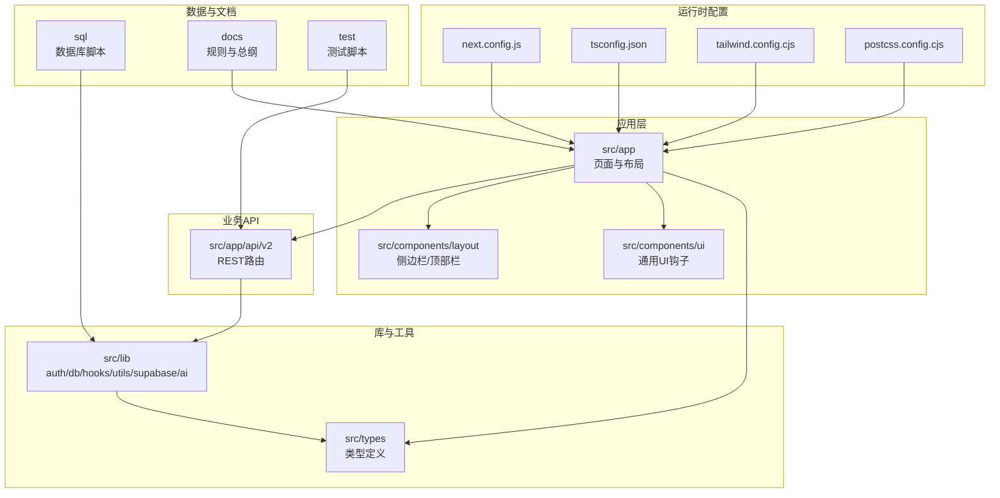
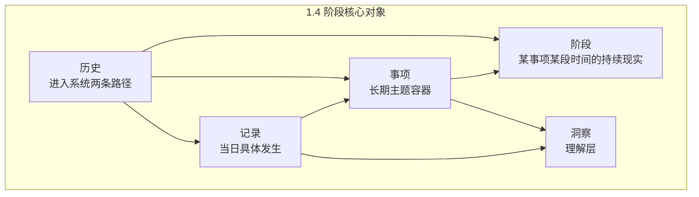
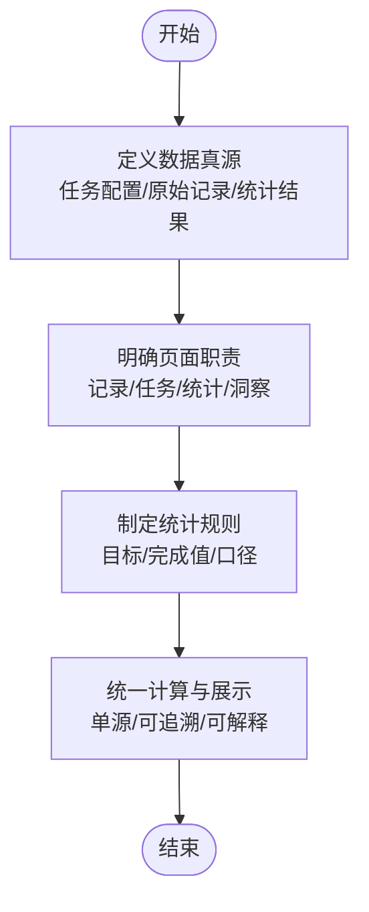
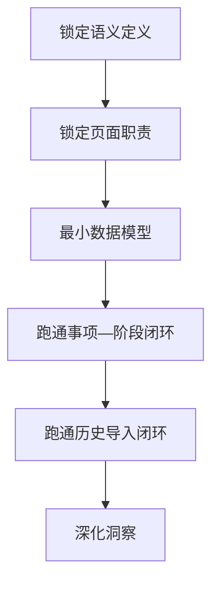
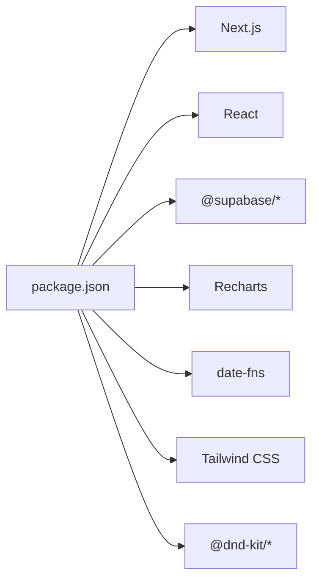

# 开发指南

<cite>
**本文引用的文件**   
- [README.md](file://README.md)
- [package.json](file://package.json)
- [tsconfig.json](file://tsconfig.json)
- [tailwind.config.cjs](file://tailwind.config.cjs)
- [postcss.config.cjs](file://postcss.config.cjs)
- [next.config.js](file://next.config.js)
- [DATA_RULES.md](file://DATA_RULES.md)
- [docs/00-总控/TETO 项目总计划书（终极总纲版 ／ Ultimate Final）.md](file://docs/00-总控/TETO 项目总计划书（终极总纲版 ／ Ultimate Final）.md)
- [docs/01-生效版本/TETO 1.4/TETO 1.4 开发规则.md](file://docs/01-生效版本/TETO 1.4/TETO 1.4 开发规则.md)
- [docs/01-生效版本/TETO 1.3/《TETO 1.3 构思总纲》.md](file://docs/01-生效版本/TETO 1.3/《TETO 1.3 构思总纲》.md)
- [test/scripts/test-api-performance.js](file://test/scripts/test-api-performance.js)
</cite>

## 目录
1. [引言](#引言)
2. [项目结构](#项目结构)
3. [核心组件](#核心组件)
4. [架构总览](#架构总览)
5. [详细组件分析](#详细组件分析)
6. [依赖分析](#依赖分析)
7. [性能考量](#性能考量)
8. [故障排查指南](#故障排查指南)
9. [结论](#结论)
10. [附录](#附录)

## 引言
本开发指南面向新加入的开发者，旨在帮助你快速理解并遵循 TETO 项目的开发规范与流程，包括代码风格、提交消息、分支管理、代码审查、开发环境配置、调试与性能优化、新功能开发流程、测试与质量保证、约定优于配置原则、架构决策记录与设计模式应用，以及团队协作与知识分享机制。本指南以现有文档与代码为依据，确保你能高效融入并高质量贡献。

## 项目结构
TETO 采用 Next.js App Router 的前端工程，配合 Supabase 作为认证与数据库服务，TypeScript 提供类型安全，Tailwind CSS 提供样式基线，Recharts 用于图表展示，date-fns 处理日期。项目包含应用层、API 路由层、通用组件与工具、类型定义、数据库脚本与测试脚本等模块。

**图表来源**
- [next.config.js:1-4](file://next.config.js#L1-L4)
- [tsconfig.json:1-42](file://tsconfig.json#L1-L42)
- [tailwind.config.cjs:1-61](file://tailwind.config.cjs#L1-L61)
- [postcss.config.cjs:1-5](file://postcss.config.cjs#L1-L5)

**章节来源**
- [README.md:13-21](file://README.md#L13-L21)
- [package.json:1-44](file://package.json#L1-L44)

## 核心组件
- 应用入口与页面：位于 src/app，采用 App Router，包含仪表盘、记录、事项、洞察等页面与布局。
- API 路由：位于 src/app/api/v2，按资源划分目录，提供 REST 接口。
- 通用组件与布局：src/components 下的布局与 UI 组件。
- 工具与库：src/lib 下封装认证、数据库、Hooks、Supabase 客户端、工具函数与 AI 相关逻辑。
- 类型系统：src/types 定义语义类型与通用类型。
- 配置：Next.js、TypeScript、Tailwind CSS、PostCSS 配置文件。
- 数据与规则：sql 目录存放数据库迁移脚本；docs 目录存放开发规则与总纲；DATA_RULES.md 定义数据规则。

**章节来源**
- [README.md:1-126](file://README.md#L1-L126)
- [package.json:1-44](file://package.json#L1-L44)
- [DATA_RULES.md:1-174](file://DATA_RULES.md#L1-L174)

## 架构总览
TETO 的架构遵循“约定优于配置”的原则，强调数据真源与规则层的统一，确保记录自然、规则透明、展示统一、关系清晰、数据单源、可追溯。1.4 阶段在 1.3 骨架上深化“记录—事项—洞察”，新增“阶段”与“历史导入”，使系统能承接过去、现在与未来的连续人生现实。

**图表来源**
- [docs/01-生效版本/TETO 1.4/TETO 1.4 开发规则.md:144-300](file://docs/01-生效版本/TETO 1.4/TETO 1.4 开发规则.md#L144-L300)

**章节来源**
- [docs/01-生效版本/TETO 1.4/TETO 1.4 开发规则.md:708-760](file://docs/01-生效版本/TETO 1.4/TETO 1.4 开发规则.md#L708-L760)

## 详细组件分析

### 数据规则与约定（约定优于配置）
- 数据真源定义：明确“任务管理/今日记录/记录总表/统计分析”的职责边界与真源层级，避免重复存储与口径漂移。
- 页面职责：今日记录仅记录当天内容；记录总表仅展示原始记录；任务管理仅配置规则；统计分析仅做聚合分析。
- 统计口径：统一基于任务配置与原始记录计算，确保结果可追溯。
- 目标与完成值规则：日/周/月目标优先级与推导规则明确，避免歧义。
- 不支持内容与后续方向：对不支持的功能与未来方向进行约束，防止功能蔓延。

**图表来源**
- [DATA_RULES.md:1-174](file://DATA_RULES.md#L1-L174)

**章节来源**
- [DATA_RULES.md:1-174](file://DATA_RULES.md#L1-L174)

### 开发阶段与规则（1.4 阶段）
- 阶段定位：在 1.3 骨架上补上“阶段”和“历史导入”，使系统能承接连续人生现实。
- 核心对象：记录（第一入口）、事项（长期主题容器）、阶段（时间段现实概括）、洞察（理解层）。
- 对象关系：记录可关联事项；阶段必须隶属于事项；历史通过两条路径进入系统并接入同一骨架。
- 页面职责：记录页保持轻输入；事项页承接长期主题与连续现实；洞察页提供理解而非炫图。
- 开发顺序：先语义定义→页面职责→最小数据模型→跑通事项—阶段闭环→历史导入闭环→深化洞察。
- 验收标准：真实可验证，覆盖页面层、数据层与链路层。

**图表来源**
- [docs/01-生效版本/TETO 1.4/TETO 1.4 开发规则.md:591-646](file://docs/01-生效版本/TETO 1.4/TETO 1.4 开发规则.md#L591-L646)

**章节来源**
- [docs/01-生效版本/TETO 1.4/TETO 1.4 开发规则.md:1-812](file://docs/01-生效版本/TETO 1.4/TETO 1.4 开发规则.md#L1-L812)

### 1.3 架构理念（记录—规则—展示）
- 三层逻辑：记录层（自然记录）、规则层（统一配置与计算）、展示层（统一输出）。
- 目标：让系统像 Excel 一样直观可控，数据来源与结果可追溯。
- 与 1.4 的关系：1.4 在此基础上深化对象与历史导入，保持“先现实，后组织”的原则。

**章节来源**
- [docs/01-生效版本/TETO 1.3/《TETO 1.3 构思总纲》.md:166-210](file://docs/01-生效版本/TETO 1.3/《TETO 1.3 构思总纲》.md#L166-L210)

### 开发环境配置与启动
- 依赖安装、环境变量配置（Supabase URL 与匿名密钥）、数据库初始化（核心表与 RLS）、开发服务器启动与构建检查。
- 环境变量说明与 Vercel 部署前置条件与步骤。

**章节来源**
- [README.md:22-126](file://README.md#L22-L126)

### 代码风格与类型系统
- TypeScript：严格模式、增量编译、路径别名、ESNext 模块解析。
- Tailwind CSS：content 范围限定、颜色与字体族扩展、圆角定制。
- PostCSS：集成 Tailwind 插件。
- Next.js：allowedDevOrigins 白名单配置。

**章节来源**
- [tsconfig.json:1-42](file://tsconfig.json#L1-L42)
- [tailwind.config.cjs:1-61](file://tailwind.config.cjs#L1-L61)
- [postcss.config.cjs:1-5](file://postcss.config.cjs#L1-L5)
- [next.config.js:1-4](file://next.config.js#L1-L4)

### API 路由与客户端交互
- API 路由按资源划分目录，提供 CRUD 与业务接口，如目标、洞察、项目、记录、标签、解析等。
- 建议在 API 层统一错误处理与响应格式，便于客户端与测试脚本对接。

**章节来源**
- [README.md:1-126](file://README.md#L1-L126)

## 依赖分析
- 运行时依赖：Next.js、React、Supabase SDK、Recharts、date-fns、Tailwind Merge、Lucide React、@dnd-kit 等。
- 开发依赖：TypeScript、Tailwind CSS、Autoprefixer、PostCSS、React 类型等。
- 依赖一致性：通过 package.json 管理，确保团队使用统一版本。

**图表来源**
- [package.json:15-42](file://package.json#L15-L42)

**章节来源**
- [package.json:1-44](file://package.json#L1-L44)

## 性能考量
- API 性能测试：提供测试脚本对关键页面 API 进行多次请求取平均耗时与最慢耗时，便于发现性能瓶颈。
- 建议：对热点 API 增加缓存策略；减少不必要的查询与聚合；合理分页与索引；监控慢查询。

**章节来源**
- [test/scripts/test-api-performance.js:1-82](file://test/scripts/test-api-performance.js#L1-L82)

## 故障排查指南
- 开发服务器启动失败：检查环境变量、Supabase 可达性、数据库迁移脚本执行情况。
- 数据库连接异常：确认 RLS 配置、用户权限、表结构与索引。
- 页面空白或样式异常：检查 Tailwind content 范围、PostCSS 插件加载、浏览器控制台错误。
- API 响应异常：核对 API 路由参数、返回格式、鉴权头与 CORS 设置。
- 性能告警：关注测试脚本输出的超阈值请求，定位慢接口与数据库查询。

**章节来源**
- [README.md:22-126](file://README.md#L22-L126)
- [test/scripts/test-api-performance.js:1-82](file://test/scripts/test-api-performance.js#L1-L82)

## 结论
本指南基于现有文档与代码，梳理了 TETO 的开发规范、架构理念与实践流程。建议新成员在加入初期重点阅读 1.4 开发规则与数据规则，理解“记录—事项—洞察—阶段—历史导入”的对象体系与页面职责；在开发过程中遵循约定优于配置的原则，保持数据单源与规则透明，确保系统可追溯、可理解、可维护。

## 附录

### 团队协作规范与流程
- 代码风格：遵循 TypeScript 严格模式与路径别名；组件命名与目录结构保持一致。
- 提交消息：建议采用“类型(scope): 描述”的格式，如 feat(api): 添加记录批量删除接口。
- 分支管理：采用功能分支开发，合并前需通过本地构建与测试；主分支仅接受通过 CI 的合并。
- 代码审查：每次 PR 至少一名维护者审查，关注功能正确性、性能影响与可维护性。
- 文档编写：新增功能需同步更新规则文档与 API 注释；重大变更需更新总纲与版本规则。
- 知识分享：定期回顾 1.4 开发规则与数据规则，确保团队对对象体系与页面职责达成共识。

**章节来源**
- [docs/01-生效版本/TETO 1.4/TETO 1.4 开发规则.md:576-588](file://docs/01-生效版本/TETO 1.4/TETO 1.4 开发规则.md#L576-L588)

### 新功能开发流程
- 明确需求与边界：参考 1.4 开发规则与数据规则，确认对象与页面职责。
- 设计最小数据模型：避免过度设计，先满足 MVP。
- 实现与测试：按 API 层、客户端组件、数据库脚本顺序推进，编写单元与集成测试。
- 验收与回归：通过页面层、数据层与链路层验收，确保真实可验证。
- 文档与评审：更新规则文档与 API 注释，进行代码审查与知识分享。

**章节来源**
- [docs/01-生效版本/TETO 1.4/TETO 1.4 开发规则.md:591-646](file://docs/01-生效版本/TETO 1.4/TETO 1.4 开发规则.md#L591-L646)

### 质量保证与测试策略
- 单元测试：针对关键工具函数与业务逻辑。
- 集成测试：覆盖 API 路由与数据库交互。
- 性能测试：使用现有脚本对热点接口进行基准测试。
- 端到端测试：模拟用户操作链路，验证页面职责与数据流。

**章节来源**
- [test/scripts/test-api-performance.js:1-82](file://test/scripts/test-api-performance.js#L1-L82)

### 架构决策记录与设计模式应用
- 架构决策：以文档为准，避免凭记忆变更；1.4 的“连续人生现实”与“阶段属于事项”等核心约束需严格执行。
- 设计模式：在组件层面采用组合与渲染属性模式；在数据层采用“记录—事项—阶段—洞察”的分层组织；在 API 层采用资源导向的路由设计。

**章节来源**
- [docs/01-生效版本/TETO 1.4/TETO 1.4 开发规则.md:648-666](file://docs/01-生效版本/TETO 1.4/TETO 1.4 开发规则.md#L648-L666)