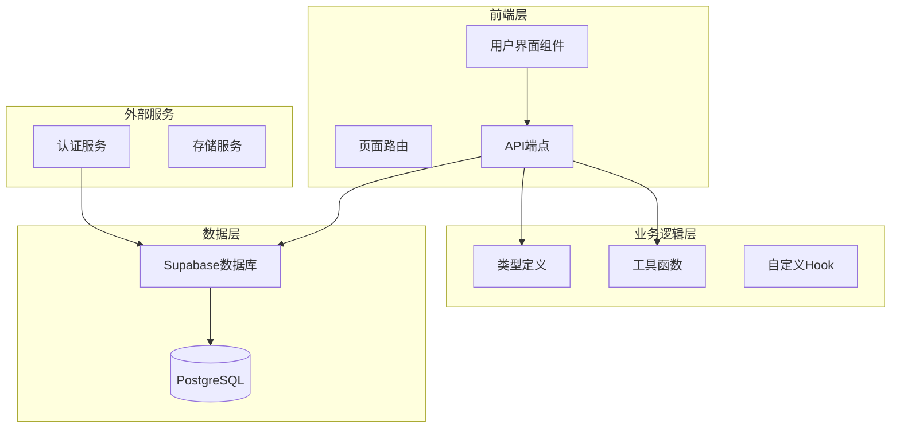
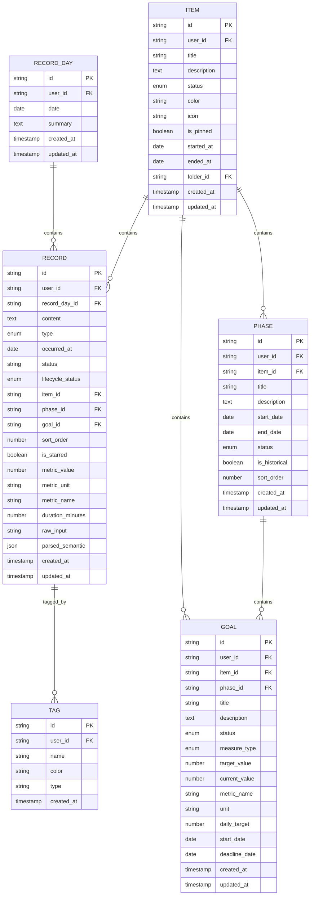
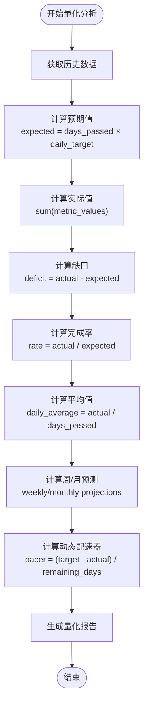
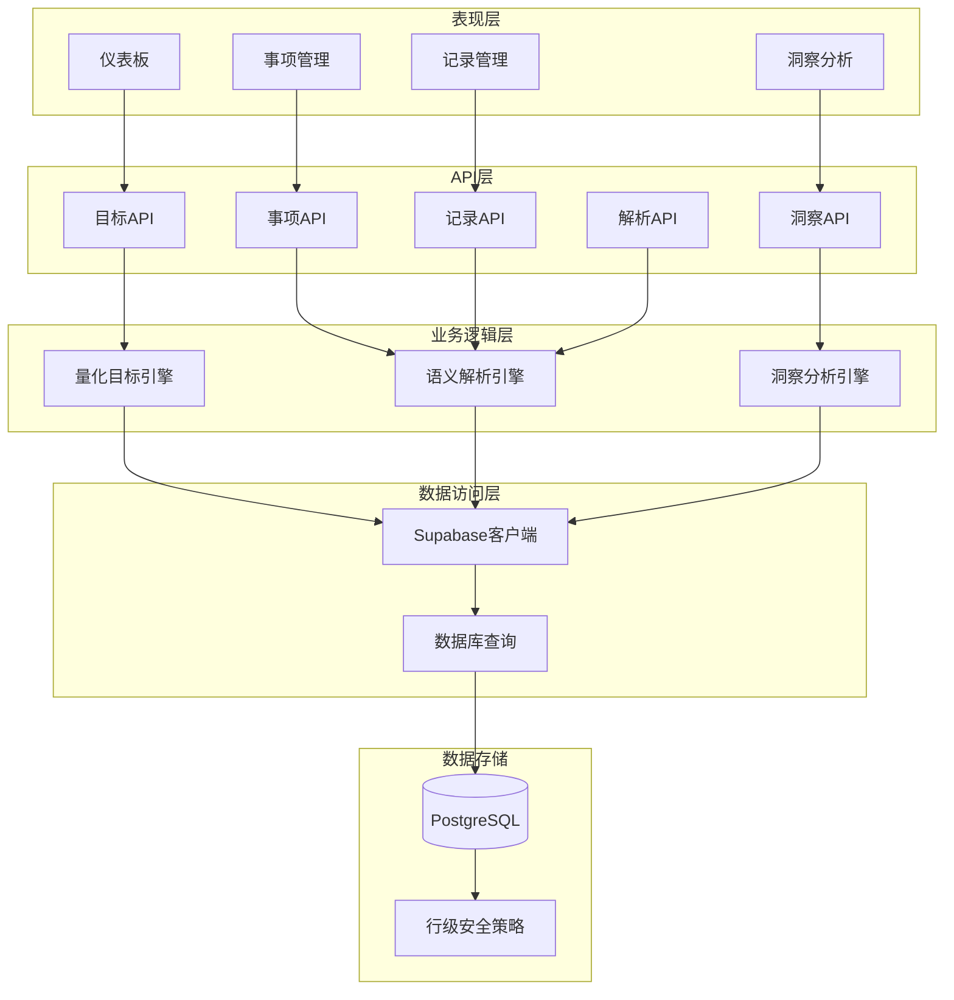
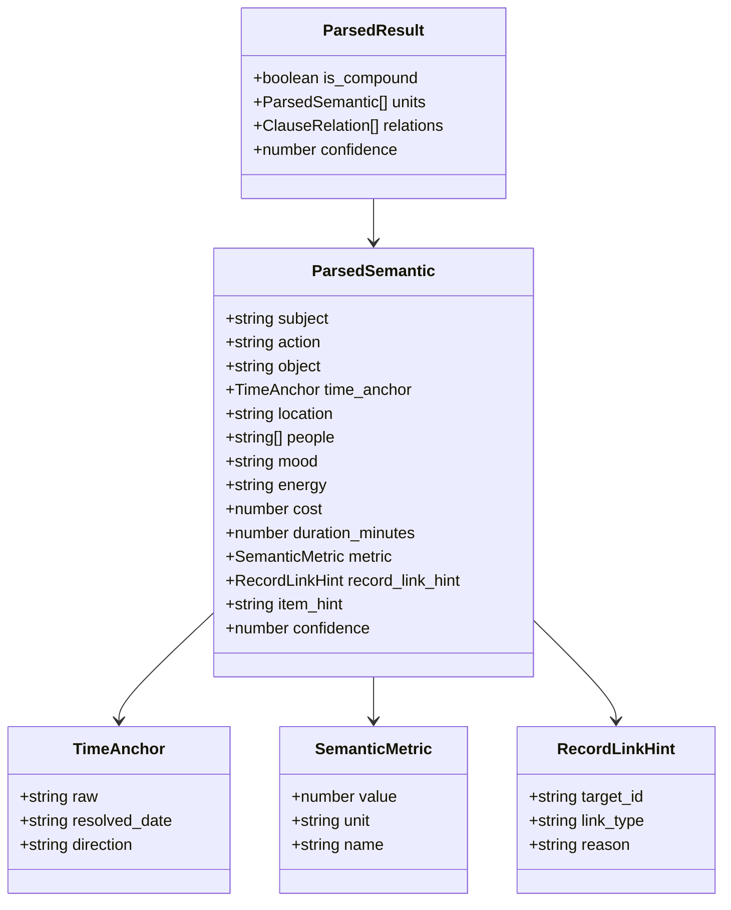
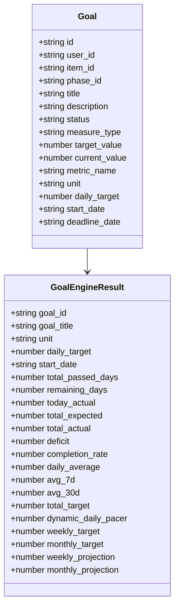
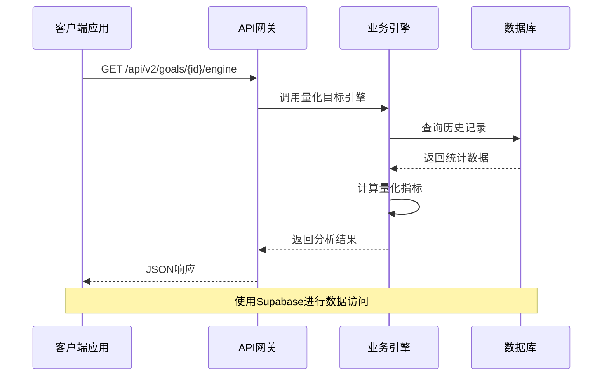
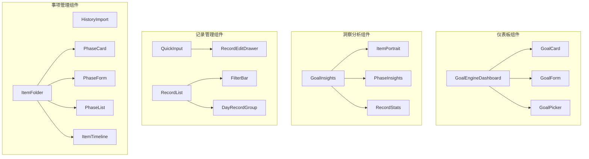

# TETO 1.4蓝图完整版

<cite>
**本文档引用的文件**
- [README.md](file://README.md)
- [package.json](file://package.json)
- [src/app/layout.tsx](file://src/app/layout.tsx)
- [src/app/page.tsx](file://src/app/page.tsx)
- [src/types/teto.ts](file://src/types/teto.ts)
- [src/types/semantic.ts](file://src/types/semantic.ts)
- [src/app/api\v2/goals/[id]/engine/route.ts](file://src/app/api\v2/goals/[id]/engine/route.ts)
- [src/app/api\v2/items/[id]/goal-engine/route.ts](file://src/app/api\v2/items/[id]/goal-engine/route.ts)
- [src/app/api\v2/parse/route.ts](file://src/app/api\v2/parse/route.ts)
- [src/app/api\v2/insights/route.ts](file://src/app/api\v2/insights/route.ts)
- [src/app/(dashboard)/items/components/GoalEngineDashboard.tsx](file://src/app/(dashboard)/items/components/GoalEngineDashboard.tsx)
- [src/app/(dashboard)/items/components/GoalCard.tsx](file://src/app/(dashboard)/items/components/GoalCard.tsx)
- [src/app/(dashboard)/items/components/GoalForm.tsx](file://src/app/(dashboard)/items/components/GoalForm.tsx)
- [src/app/(dashboard)/items/components/ItemGoalSection.tsx](file://src/app/(dashboard)/items/components/ItemGoalSection.tsx)
- [src/app/(dashboard)/insights/components/GoalInsights.tsx](file://src/app/(dashboard)/insights/components/GoalInsights.tsx)
- [src/app/(dashboard)/insights/components/ItemPortrait.tsx](file://src/app/(dashboard)/insights/components/ItemPortrait.tsx)
- [src/app/(dashboard)/insights/components/PhaseInsights.tsx](file://src/app/(dashboard)/insights/components/PhaseInsights.tsx)
- [src/app/(dashboard)/insights/components/RecordStats.tsx](file://src/app/(dashboard)/insights/components/RecordStats.tsx)
- [src/app/(dashboard)/records/components/QuickInput.tsx](file://src/app/(dashboard)/records/components/QuickInput.tsx)
- [src/app/(dashboard)/records/components/RecordEditDrawer.tsx](file://src/app/(dashboard)/records/components/RecordEditDrawer.tsx)
- [src/app/(dashboard)/records/components/RecordList.tsx](file://src/app/(dashboard)/records/components/RecordList.tsx)
- [src/app/(dashboard)/records/components/FilterBar.tsx](file://src/app/(dashboard)/records/components/FilterBar.tsx)
- [src/app/(dashboard)/records/components/DayRecordGroup.tsx](file://src/app/(dashboard)/records/components/DayRecordGroup.tsx)
- [src/app/(dashboard)/items/components/HistoryImport.tsx](file://src/app/(dashboard)/items/components/HistoryImport.tsx)
- [src/app/(dashboard)/items/components/ItemFolder.tsx](file://src/app/(dashboard)/items/components/ItemFolder.tsx)
- [src/app/(dashboard)/items/components/PhaseCard.tsx](file://src/app/(dashboard)/items/components/PhaseCard.tsx)
- [src/app/(dashboard)/items/components/PhaseForm.tsx](file://src/app/(dashboard)/items/components/PhaseForm.tsx)
- [src/app/(dashboard)/items/components/PhaseList.tsx](file://src/app/(dashboard)/items/components/PhaseList.tsx)
- [src/app/(dashboard)/items/components/ItemTimeline.tsx](file://src/app/(dashboard)/items/components/ItemTimeline.tsx)
- [src/app/(dashboard)/items/ItemsClient.tsx](file://src/app/(dashboard)/items/ItemsClient.tsx)
- [src/app/(dashboard)/records/RecordsClient.tsx](file://src/app/(dashboard)/records/RecordsClient.tsx)
- [src/app/(dashboard)/insights/InsightsClient.tsx](file://src/app/(dashboard)/insights/InsightsClient.tsx)
- [src/app/(dashboard)/insights/page.tsx](file://src/app/(dashboard)/insights/page.tsx)
- [src/app/(dashboard)/items/page.tsx](file://src/app/(dashboard)/items/page.tsx)
- [src/app/(dashboard)/records/page.tsx](file://src/app/(dashboard)/records/page.tsx)
- [src/app/(dashboard)/layout.tsx](file://src/app/(dashboard)/layout.tsx)
- [src/app/login/page.tsx](file://src/app/login/page.tsx)
- [src/app/auth/callback/route.ts](file://src/app/auth/callback/route.ts)
- [src/lib/utils/index.ts](file://src/lib/utils/index.ts)
- [src/lib/db/index.ts](file://src/lib/db/index.ts)
- [src/lib/supabase/index.ts](file://src/lib/supabase/index.ts)
- [src/constants/index.ts](file://src/constants/index.ts)
</cite>

## 目录
1. [简介](#简介)
2. [项目结构](#项目结构)
3. [核心组件](#核心组件)
4. [架构概览](#架构概览)
5. [详细组件分析](#详细组件分析)
6. [依赖分析](#依赖分析)
7. [性能考虑](#性能考虑)
8. [故障排除指南](#故障排除指南)
9. [结论](#结论)
10. [附录](#附录)

## 简介

TETO是一个个人效率追踪系统，专注于记录每日行为数据、项目进度管理和结构化复盘。该项目基于Next.js 16.2.0构建，采用TypeScript、Tailwind CSS、Supabase和Recharts等现代技术栈。

TETO 1.4蓝图代表了系统的重大升级，引入了量化目标引擎、语义解析引擎、阶段化管理等核心功能模块。系统支持个人成长追踪、目标管理、数据分析和智能洞察等功能。

## 项目结构

TETO项目采用现代化的Next.js App Router架构，主要分为以下几个核心部分：



**图表来源**
- [src/app/layout.tsx:1-13](file://src/app/layout.tsx#L1-L13)
- [src/app/page.tsx:1-5](file://src/app/page.tsx#L1-L5)
- [src/types/teto.ts:1-525](file://src/types/teto.ts#L1-L525)

**章节来源**
- [README.md:1-126](file://README.md#L1-L126)
- [package.json:1-44](file://package.json#L1-L44)

## 核心组件

### 数据模型架构

TETO 1.4引入了全新的数据模型架构，支持复杂的层级关系和业务逻辑：



**图表来源**
- [src/types/teto.ts:28-525](file://src/types/teto.ts#L28-L525)

### 量化目标引擎

量化目标引擎是TETO 1.4的核心创新，提供实时的目标追踪和分析能力：



**图表来源**
- [src/types/teto.ts:476-512](file://src/types/teto.ts#L476-L512)

**章节来源**
- [src/types/teto.ts:324-525](file://src/types/teto.ts#L324-L525)

## 架构概览

TETO 1.4采用分层架构设计，确保系统的可维护性和扩展性：



**图表来源**
- [src/app/api\v2/goals/[id]/engine/route.ts](file://src/app/api\v2/goals/[id]/engine/route.ts)
- [src/app/api\v2/items/[id]/goal-engine/route.ts](file://src/app/api\v2/items/[id]/goal-engine/route.ts)
- [src/app/api\v2/parse/route.ts](file://src/app/api\v2/parse/route.ts)
- [src/app/api\v2/insights/route.ts](file://src/app/api\v2/insights/route.ts)

## 详细组件分析

### 语义解析引擎

语义解析引擎是TETO 1.4的重要组成部分，负责理解和处理用户的自然语言输入：



**图表来源**
- [src/types/semantic.ts:17-66](file://src/types/semantic.ts#L17-L66)

### 量化目标引擎

量化目标引擎提供实时的目标追踪和分析功能：



**图表来源**
- [src/types/teto.ts:324-512](file://src/types/teto.ts#L324-L512)

### API端点架构

TETO 1.4提供了完整的RESTful API架构，支持前后端分离开发：



**图表来源**
- [src/app/api\v2/goals/[id]/engine/route.ts](file://src/app/api\v2/goals/[id]/engine/route.ts)
- [src/app/api\v2/items/[id]/goal-engine/route.ts](file://src/app/api\v2/items/[id]/goal-engine/route.ts)

**章节来源**
- [src/types/semantic.ts:1-66](file://src/types/semantic.ts#L1-L66)
- [src/types/teto.ts:476-512](file://src/types/teto.ts#L476-L512)

### 用户界面组件

TETO 1.4采用了现代化的React组件架构，提供丰富的用户交互体验：



**图表来源**
- [src/app/(dashboard)/items/components/GoalEngineDashboard.tsx](file://src/app/(dashboard)/items/components/GoalEngineDashboard.tsx)
- [src/app/(dashboard)/insights/components/GoalInsights.tsx](file://src/app/(dashboard)/insights/components/GoalInsights.tsx)
- [src/app/(dashboard)/records/components/QuickInput.tsx](file://src/app/(dashboard)/records/components/QuickInput.tsx)
- [src/app/(dashboard)/items/components/ItemFolder.tsx](file://src/app/(dashboard)/items/components/ItemFolder.tsx)

**章节来源**
- [src/app/(dashboard)/items/components/GoalEngineDashboard.tsx](file://src/app/(dashboard)/items/components/GoalEngineDashboard.tsx)
- [src/app/(dashboard)/insights/components/GoalInsights.tsx](file://src/app/(dashboard)/insights/components/GoalInsights.tsx)
- [src/app/(dashboard)/records/components/QuickInput.tsx](file://src/app/(dashboard)/records/components/QuickInput.tsx)
- [src/app/(dashboard)/items/components/ItemFolder.tsx](file://src/app/(dashboard)/items/components/ItemFolder.tsx)

## 依赖分析

TETO 1.4的依赖关系体现了现代化的前端开发最佳实践：

```mermaid
graph TB
subgraph "核心框架"
NextJS[Next.js 16.2.0]
React[React 19.2.4]
TypeScript[TypeScript 5.9.3]
end
subgraph "UI框架"
Tailwind[Tailwind CSS 4.2.2]
Recharts[Recharts 3.8.0]
Lucide[Lucide React 0.577.0]
end
subgraph "数据库层"
SupabaseJS[Supabase JS 2.99.3]
DnDKit[@dnd-kit 6.3.1]
end
subgraph "工具库"
DateFNS[date-fns 4.1.0]
XLSX[xlsx 0.18.5]
clsx[clsx 2.1.1]
tailwind-merge[tailwind-merge 3.5.0]
end
NextJS --> React
NextJS --> TypeScript
NextJS --> Tailwind
NextJS --> SupabaseJS
React --> Recharts
React --> DnDKit
SupabaseJS --> DateFNS
SupabaseJS --> XLSX
```

**图表来源**
- [package.json:15-32](file://package.json#L15-L32)

**章节来源**
- [package.json:1-44](file://package.json#L1-L44)

## 性能考虑

TETO 1.4在设计时充分考虑了性能优化：

### 数据加载优化
- 使用React Suspense进行异步数据加载
- 实现智能缓存策略减少重复请求
- 采用分页和虚拟滚动处理大量数据

### 渲染性能
- 组件懒加载和代码分割
- 使用useMemo和useCallback优化重渲染
- 实现防抖和节流处理高频操作

### 数据库性能
- 优化查询索引和连接
- 实现批量操作减少网络往返
- 使用行级安全策略确保数据隔离

## 故障排除指南

### 常见问题诊断

**认证问题**
- 检查Supabase配置是否正确
- 验证回调URL设置
- 确认Magic Link登录已启用

**数据库连接问题**
- 验证环境变量配置
- 检查RDS连接字符串
- 确认表权限设置

**API调用失败**
- 检查CORS配置
- 验证API端点路径
- 确认请求头设置

**章节来源**
- [README.md:54-90](file://README.md#L54-L90)

## 结论

TETO 1.4蓝图展现了个人效率追踪系统的未来发展方向。通过引入量化目标引擎、语义解析引擎和阶段化管理等核心功能，系统实现了从简单的数据记录到智能化分析决策的跨越。

项目采用现代化的技术栈和架构设计，为未来的功能扩展和性能优化奠定了坚实基础。通过分层架构、组件化设计和API优先的开发模式，TETO 1.4不仅满足了当前的功能需求，更为后续的AI集成、多平台支持和企业级部署做好了充分准备。

## 附录

### 开发环境设置

1. **安装依赖**
   ```bash
   npm install
   ```

2. **配置环境变量**
   - 创建`.env.local`文件
   - 添加Supabase项目信息

3. **初始化数据库**
   - 执行SQL脚本创建表结构
   - 启用行级安全策略

4. **启动开发服务器**
   ```bash
   npm run dev
   ```

### 部署指南

1. **本地构建检查**
   ```bash
   npm run build
   ```

2. **Vercel部署**
   - 连接GitHub仓库
   - 配置环境变量
   - 点击部署

3. **Supabase配置**
   - 添加生产域名
   - 验证功能完整性

**章节来源**
- [README.md:22-126](file://README.md#L22-L126)