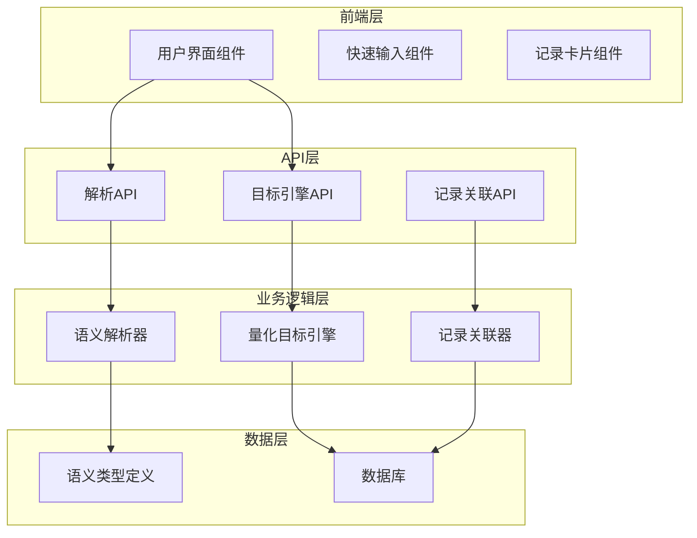
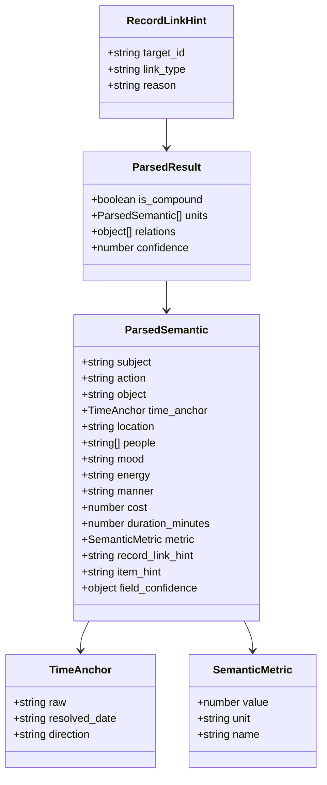
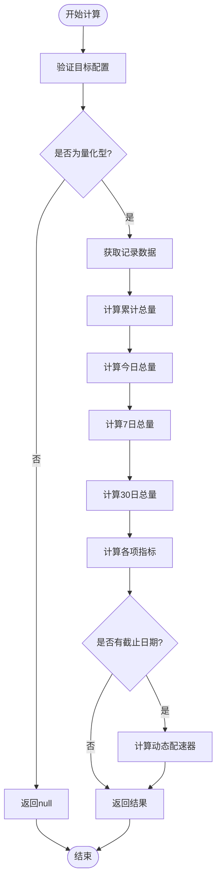
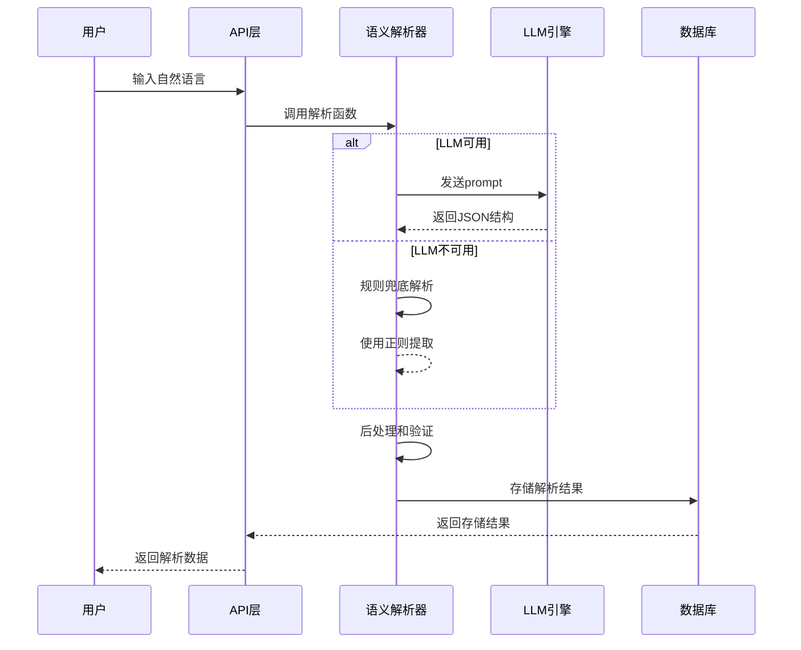
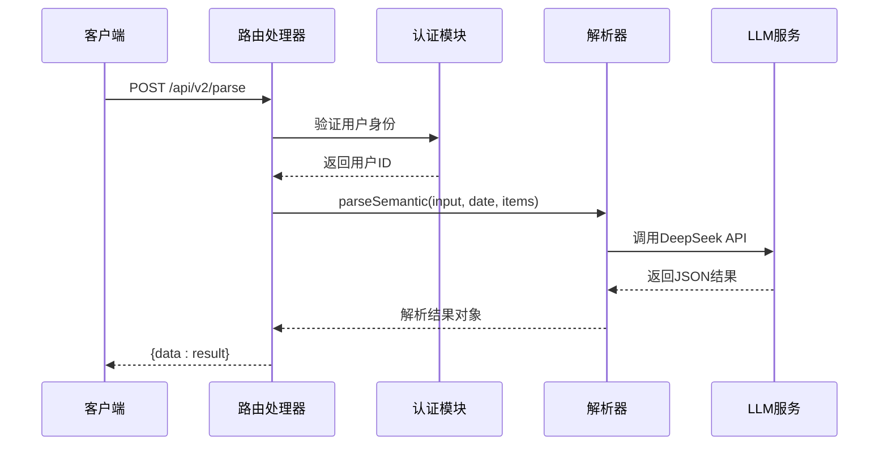
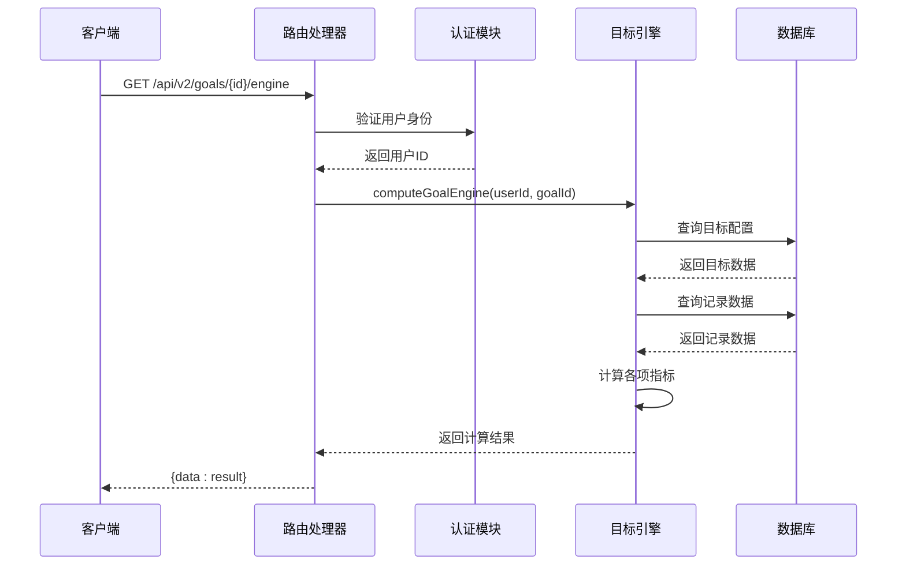
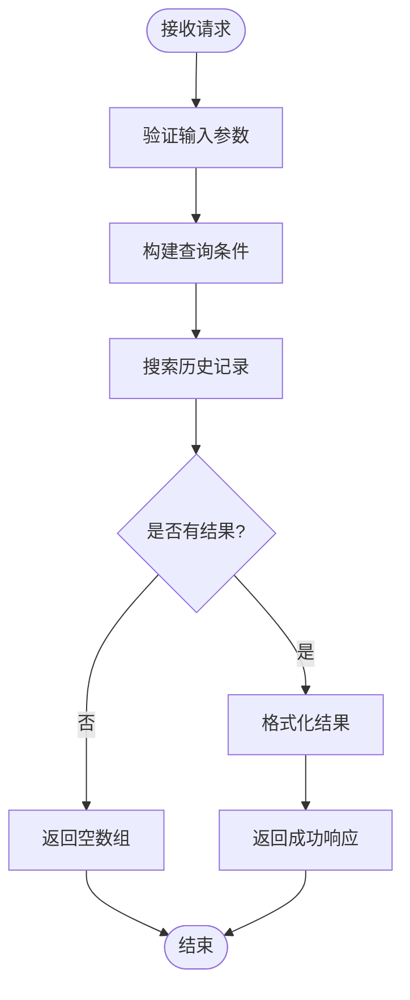
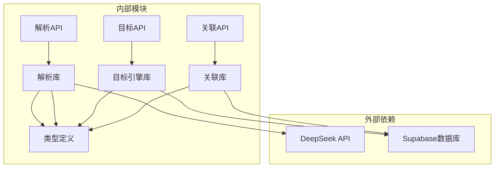

# 人生记录语法引擎（Grammar of Life Engine）

<cite>
**本文档引用的文件**
- [人生记录语法引擎（Grammar of Life Engine）.md](file://docs/01-生效版本/TETO 1.4/TET O1.4新相关内容/TETO 1.4/人生记录语法引擎（Grammar of Life Engine）.md)
- [语义引擎底层结构（P0 + P3）.md](file://docs/01-生效版本/TETO 1.4/TET O1.4新相关内容/TETO 1.4/语义引擎底层结构（P0 + P3）.md)
- [parse-semantic.ts](file://src/lib/ai/parse-semantic.ts)
- [goal-engine.ts](file://src/lib/db/goal-engine.ts)
- [route.ts](file://src/app/api/v2/parse/route.ts)
- [route.ts](file://src/app/api/v2/goals/[id]/engine/route.ts)
- [route.ts](file://src/app/api/v2/items/[id]/goal-engine/route.ts)
- [semantic.ts](file://src/types/semantic.ts)
- [teto.ts](file://src/types/teto.ts)
- [route.ts](file://src/app/api/v2/record-links/route.ts)
- [record-links.ts](file://src/lib/db/record-links.ts)
</cite>

## 目录
1. [简介](#简介)
2. [项目结构](#项目结构)
3. [核心组件](#核心组件)
4. [架构概览](#架构概览)
5. [详细组件分析](#详细组件分析)
6. [依赖关系分析](#依赖关系分析)
7. [性能考虑](#性能考虑)
8. [故障排除指南](#故障排除指南)
9. [结论](#结论)

## 简介

人生记录语法引擎（Grammar of Life Engine）是TETO软件项目中的一项创新功能，旨在将传统的文本记录转变为结构化的语义断言。该引擎采用"LLM语义解析 + 规则兜底"的混合架构，从纯正则升级为更智能的解析方式。

该系统的核心理念是：每条记录不再仅仅是text + 标签，而是一个**结构化断言**，包含主谓宾核心要素和丰富的上下文修饰信息。通过引入语义解析引擎，用户可以用自然语言描述生活事件，系统自动提取关键信息并建立语义关联。

## 项目结构

TETO软件项目采用现代化的Next.js架构，主要分为以下几个层次：

**图表来源**
- [parse-semantic.ts:1-282](file://src/lib/ai/parse-semantic.ts#L1-L282)
- [goal-engine.ts:1-294](file://src/lib/db/goal-engine.ts#L1-L294)
- [route.ts:1-43](file://src/app/api/v2/parse/route.ts#L1-L43)

**章节来源**
- [人生记录语法引擎（Grammar of Life Engine）.md:1-219](file://docs/01-生效版本/TETO 1.4/TET O1.4新相关内容/TETO 1.4/人生记录语法引擎（Grammar of Life Engine）.md#L1-L219)

## 核心组件

### 语义解析类型系统

系统定义了完整的语义解析类型体系，包括基础类型和复合类型：

**图表来源**
- [semantic.ts:1-66](file://src/types/semantic.ts#L1-L66)

### 量化目标引擎

目标引擎负责计算量化目标的完成情况，提供多维度的指标分析：

**图表来源**
- [goal-engine.ts:113-202](file://src/lib/db/goal-engine.ts#L113-L202)

**章节来源**
- [semantic.ts:1-66](file://src/types/semantic.ts#L1-L66)
- [teto.ts:476-512](file://src/types/teto.ts#L476-L512)

## 架构概览

### 双轨管道架构

系统采用双轨管道设计，结合LLM智能解析和规则兜底：

**图表来源**
- [parse-semantic.ts:13-89](file://src/lib/ai/parse-semantic.ts#L13-L89)
- [route.ts:12-30](file://src/app/api/v2/parse/route.ts#L12-L30)

### 数据模型扩展

系统通过数据库迁移扩展了记录表结构，支持语义解析数据的存储：

| 字段名 | 类型 | 用途 | 索引 |
|--------|------|------|------|
| parsed_semantic | JSONB | 存储LLM解析的完整语义结构 | 无 |
| time_anchor_date | DATE | 时间锚点解析后的目标日期 | 有 |
| linked_record_id | UUID | 记录间关联外键 | 有 |
| location | TEXT | 地点信息 | 无 |
| people | TEXT[] | 关系人数组 | 无 |

**章节来源**
- [语义引擎底层结构（P0 + P3）.md:105-129](file://docs/01-生效版本/TETO 1.4/TET O1.4新相关内容/TETO 1.4/语义引擎底层结构（P0 + P3）.md#L105-L129)

## 详细组件分析

### 语义解析API

解析API提供实时的自然语言语义解析服务：

**图表来源**
- [route.ts:12-42](file://src/app/api/v2/parse/route.ts#L12-L42)
- [parse-semantic.ts:209-281](file://src/lib/ai/parse-semantic.ts#L209-L281)

### 目标引擎API

目标引擎API为单个目标和事项下的所有量化目标提供计算服务：

**图表来源**
- [route.ts:9-34](file://src/app/api/v2/goals/[id]/engine/route.ts#L9-L34)
- [goal-engine.ts:49-70](file://src/lib/db/goal-engine.ts#L49-L70)

### 记录关联API

记录关联API支持基于关键词和日期范围的历史记录搜索：

**图表来源**
- [route.ts:1-43](file://src/app/api/v2/record-links/route.ts#L1-L43)

**章节来源**
- [route.ts:1-43](file://src/app/api/v2/parse/route.ts#L1-L43)
- [route.ts:1-44](file://src/app/api/v2/items/[id]/goal-engine/route.ts#L1-L44)
- [route.ts:1-43](file://src/app/api/v2/record-links/route.ts#L1-L43)

## 依赖关系分析

### 组件依赖图

**图表来源**
- [parse-semantic.ts:110-142](file://src/lib/ai/parse-semantic.ts#L110-L142)
- [goal-engine.ts:1-3](file://src/lib/db/goal-engine.ts#L1-L3)

### 数据流依赖

系统中的数据流遵循清晰的依赖关系：

1. **类型定义层**：提供完整的类型系统基础
2. **业务逻辑层**：实现核心算法和业务规则
3. **API层**：提供对外接口和认证
4. **数据访问层**：管理数据库连接和查询

**章节来源**
- [teto.ts:4-7](file://src/types/teto.ts#L4-L7)
- [semantic.ts:1-66](file://src/types/semantic.ts#L1-L66)

## 性能考虑

### 解析性能优化

1. **缓存策略**：对频繁使用的解析结果进行缓存
2. **批量处理**：支持批量解析以减少API调用次数
3. **降级机制**：在网络异常时使用规则解析兜底
4. **Token优化**：限制近期记忆上下文数量避免超限

### 数据库性能

1. **索引优化**：为常用查询字段建立适当索引
2. **查询优化**：使用分页和限制结果集大小
3. **连接池**：合理配置数据库连接池参数
4. **事务管理**：确保数据一致性的同时提高并发性能

## 故障排除指南

### 常见问题及解决方案

| 问题类型 | 症状 | 可能原因 | 解决方案 |
|----------|------|----------|----------|
| 认证失败 | 401错误 | 用户未登录或会话过期 | 检查认证状态，重新登录 |
| LLM调用失败 | 502错误 | API密钥配置错误或网络问题 | 检查环境变量配置 |
| 数据库查询失败 | 500错误 | 查询条件错误或权限不足 | 验证查询参数和用户权限 |
| 解析结果为空 | null返回 | 目标不存在或非量化型 | 检查目标配置和类型 |

### 调试建议

1. **启用详细日志**：在开发环境中启用详细的错误日志
2. **监控API使用**：跟踪LLM API的使用情况和费用
3. **性能监控**：监控数据库查询性能和响应时间
4. **用户反馈**：收集用户对解析质量的反馈

**章节来源**
- [route.ts:27-33](file://src/app/api/v2/parse/route.ts#L27-L33)
- [goal-engine.ts:63-65](file://src/lib/db/goal-engine.ts#L63-L65)

## 结论

人生记录语法引擎代表了TETO项目在智能化记录系统方面的重要进展。通过引入语义解析技术，系统能够更好地理解和组织用户的日常生活记录，为后续的洞察分析和目标管理奠定坚实基础。

该引擎的主要优势包括：

1. **智能化解析**：从简单的正则匹配升级为语义理解
2. **结构化输出**：提供标准化的结构化数据格式
3. **灵活扩展**：支持多种记录类型和关联关系
4. **性能优化**：通过缓存和降级机制保证系统稳定性

未来的发展方向包括：

1. **增强AI能力**：持续改进LLM的解析准确性和覆盖范围
2. **丰富语义**：扩展更多语义类型的识别和处理
3. **智能推荐**：基于解析结果提供个性化的建议和洞察
4. **集成优化**：与其他TETO功能模块的深度集成

通过这一创新性的语法引擎，TETO项目为用户提供了一个更加智能、高效的生活记录和管理系统。