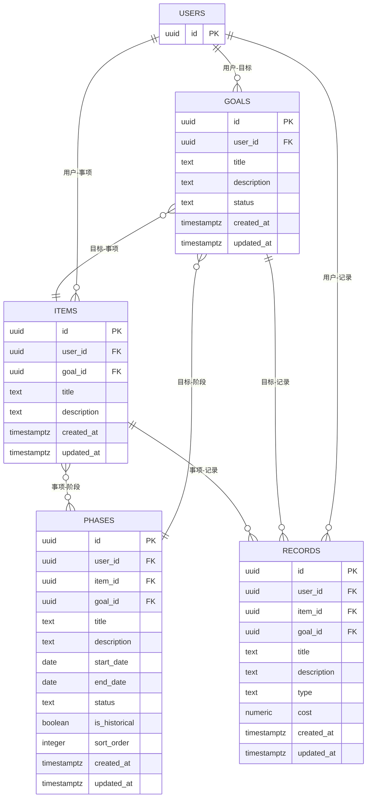
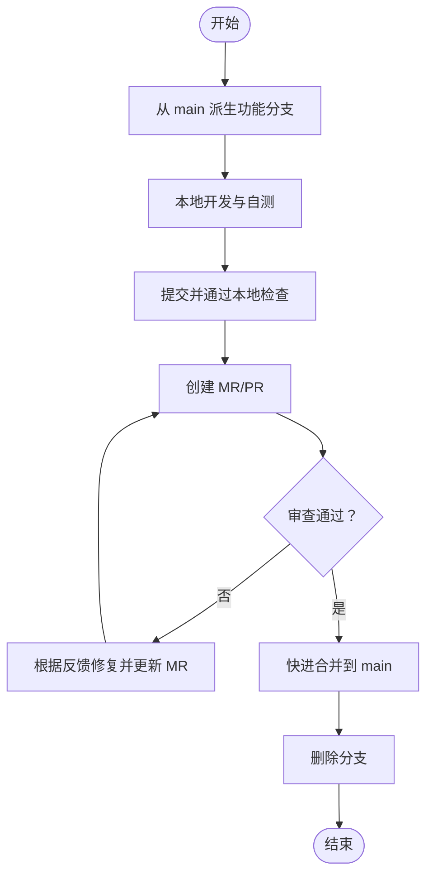
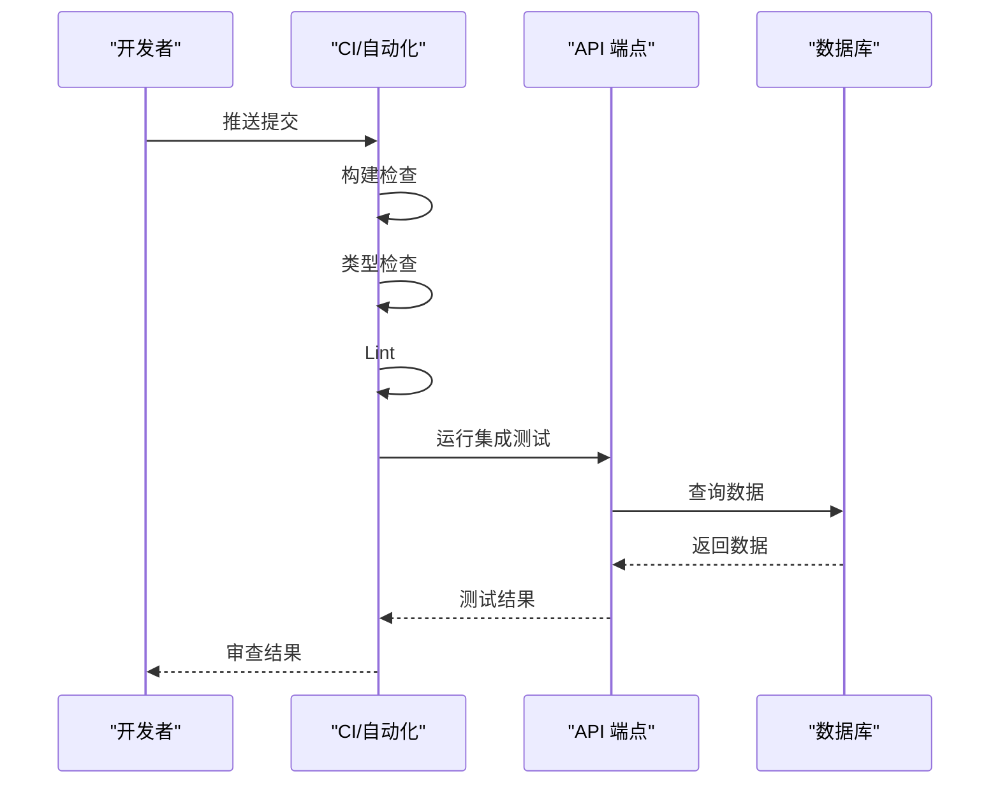
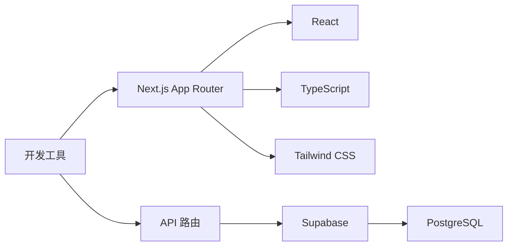

# 代码提交与规范

<cite>
**本文引用的文件**
- [README.md](file://README.md)
- [TETO 1.4 开发规则.md](file://docs/01-生效版本/TETO 1.4/TETO 1.4 开发规则.md)
- [TETO 1.3新阶段总规（完整正式版）.md](file://docs/01-生效版本/TETO 1.3/《TETO 1.3新阶段总规（完整正式版）》.md)
- [1.4 思路2.md](file://docs/01-生效版本/TETO 1.4/1.4 思路2.md)
- [TETO 1.4 蓝图完整版.md](file://docs/01-生效版本/TETO 1.4/TETO 1.4 蓝图完整版.md)
- [package.json](file://package.json)
- [tsconfig.json](file://tsconfig.json)
- [layout.tsx](file://src/app/layout.tsx)
- [003_teto_1_4_phases_and_goals.sql](file://sql/003_teto_1_4_phases_and_goals.sql)
- [004_teto_1_4_record_type_convergence.sql](file://sql/004_teto_1_4_record_type_convergence.sql)
- [test-records.js](file://test/scripts/test-records.js)
</cite>

## 目录
1. [简介](#简介)
2. [项目结构](#项目结构)
3. [核心组件](#核心组件)
4. [架构总览](#架构总览)
5. [详细组件分析](#详细组件分析)
6. [依赖分析](#依赖分析)
7. [性能考虑](#性能考虑)
8. [故障排查指南](#故障排查指南)
9. [结论](#结论)
10. [附录](#附录)

## 简介
本文件为 TETO 项目（当前 1.4 阶段）的代码提交与规范文档，聚焦于：
- 代码提交流程与分支管理策略
- 合并请求（MR/PR）规范
- Git 工作流模式与提交消息格式
- 代码审查标准与质量门禁
- 1.4 阶段的开发协作原则、功能扩展限制与重构控制要求
- 代码质量检查、单元测试与集成测试流程
- 冲突解决机制、版本标记规则与发布管理流程

本规范以 1.4 阶段规则为依据，确保“记录—事项—洞察”骨架的延续与深化，严格控制“阶段”和“历史导入”的边界，避免结构过重、规则过死与输入成本过高。

## 项目结构
TETO 采用 Next.js App Router 架构，前端以 TypeScript + Tailwind CSS 实现，后端接口位于 src/app/api 下，数据库结构通过 SQL 脚本管理，测试脚本位于 test/scripts。

```mermaid
graph TB
subgraph "前端"
UI["页面与组件<br/>src/app/*"]
API["API 路由<br/>src/app/api/*"]
Types["类型定义<br/>src/types/*"]
Lib["通用库<br/>src/lib/*"]
end
subgraph "后端"
Supabase["Supabase 认证+数据库"]
SQL["SQL 脚本<br/>sql/*"]
end
subgraph "工具与配置"
Pkg["包管理与脚本<br/>package.json"]
TS["TypeScript 配置<br/>tsconfig.json"]
Layout["根布局<br/>src/app/layout.tsx"]
end
UI --> API
API --> Supabase
Supabase <- --> SQL
Pkg --> UI
Pkg --> API
TS --> UI
Layout --> UI
```

**图表来源**
- [layout.tsx:1-13](file://src/app/layout.tsx#L1-L13)
- [package.json:1-44](file://package.json#L1-L44)
- [tsconfig.json:1-42](file://tsconfig.json#L1-L42)

**章节来源**
- [README.md:1-126](file://README.md#L1-L126)
- [package.json:1-44](file://package.json#L1-L44)
- [tsconfig.json:1-42](file://tsconfig.json#L1-L42)
- [layout.tsx:1-13](file://src/app/layout.tsx#L1-L13)

## 核心组件
- 前端页面与组件：记录、事项、洞察等页面及对应客户端组件与 API 客户端。
- API 路由：提供记录、事项、阶段、洞察、标签等资源的 CRUD 与聚合接口。
- 数据模型与迁移：通过 SQL 脚本定义 1.4 的目标/阶段模型与记录类型收敛。
- 测试脚本：用于验证 API 返回一致性与数据正确性。

**章节来源**
- [TETO 1.4 开发规则.md:508-574](file://docs/01-生效版本/TETO 1.4/TETO 1.4 开发规则.md#L508-L574)
- [003_teto_1_4_phases_and_goals.sql:1-130](file://sql/003_teto_1_4_phases_and_goals.sql#L1-L130)
- [004_teto_1_4_record_type_convergence.sql:1-20](file://sql/004_teto_1_4_record_type_convergence.sql#L1-L20)
- [test-records.js:1-57](file://test/scripts/test-records.js#L1-L57)

## 架构总览
1.4 阶段在 1.3 骨架上新增“阶段”和“历史导入”能力，强调“连续人生现实”的承接与表达。核心对象关系与页面职责在规则文档中明确，数据库层面通过 SQL 脚本落地。



**图表来源**
- [003_teto_1_4_phases_and_goals.sql:14-61](file://sql/003_teto_1_4_phases_and_goals.sql#L14-L61)

**章节来源**
- [TETO 1.4 开发规则.md:144-300](file://docs/01-生效版本/TETO 1.4/TETO 1.4 开发规则.md#L144-L300)
- [TETO 1.4 蓝图完整版.md:152-200](file://docs/01-生效版本/TETO 1.4/TETO 1.4 蓝图完整版.md#L152-L200)

## 详细组件分析

### 1. 代码提交流程与分支管理策略
- 分支命名规范
  - feature/功能主题：用于新功能开发，如 feature/phases-ui
  - fix/问题修复：用于缺陷修复，如 fix/phase-status-bug
  - refactor/重构：用于非功能性的重构，如 refactor/goals-model
  - hotfix/紧急修复：用于生产问题的快速修复，如 hotfix/critical-auth-error
- 分支保护
  - main/master 分支受保护，禁止直接推送，必须通过 MR/PR 合并
  - 仅允许快进合并（fast-forward），避免不必要的合并提交
- 提交前检查
  - 本地运行构建与类型检查（npm run build；tsc --noEmit）
  - 运行 Lint（npm run lint）
  - 运行测试脚本（test/scripts/test-records.js）

**章节来源**
- [package.json:6-11](file://package.json#L6-L11)
- [tsconfig.json:1-42](file://tsconfig.json#L1-L42)

### 2. 合并请求（MR/PR）规范
- MR 标题与描述
  - 标题格式：[类型]/[模块] 概述（如 [feat]/api 添加阶段状态枚举）
  - 描述必须包含：需求背景、变更范围、影响面、测试验证、风险与回滚预案
- 代码审查（Code Review）
  - 至少一名维护者批准
  - 通过自动化检查（构建、类型、Lint、测试）
  - 1.4 阶段严格遵循“一次只推进一个明确任务块”，禁止顺手修改无关模块
- 合并策略
  - 仅允许快进合并（fast-forward）
  - 合并后立即清理分支

**章节来源**
- [TETO 1.4 开发规则.md:576-588](file://docs/01-生效版本/TETO 1.4/TETO 1.4 开发规则.md#L576-L588)

### 3. Git 工作流模式
- 功能开发流程
  1) 从 main 拉取最新代码并创建 feature 分支
  2) 开发完成后提交并推送
  3) 创建 MR/PR，等待审查与自动化检查通过
  4) 合并后删除分支
- 热修复流程
  1) 从 main 派生 hotfix 分支
  2) 修复后创建 MR/PR 合并至 main
  3) 同时打补丁标签并发布



**图表来源**
- [package.json:6-11](file://package.json#L6-L11)

### 4. 提交消息格式
- 规范格式
  - <type>(<scope>): <subject>
  - body（可选，说明变更动机、影响与测试）
  - footer（可选，关闭 issue 或破坏性变更说明）
- 类型与含义
  - feat：新增功能
  - fix：修复缺陷
  - refactor：重构（非功能）
  - perf：性能优化
  - docs：文档更新
  - test：测试相关
  - chore：构建流程、依赖等杂项
- 示例
  - feat(api): 添加阶段状态枚举与校验
  - fix(db): 修正阶段起止日期为空导致的查询异常
  - refactor(types): 统一记录类型为 4 个主类型

**章节来源**
- [003_teto_1_4_phases_and_goals.sql:1-130](file://sql/003_teto_1_4_phases_and_goals.sql#L1-L130)
- [004_teto_1_4_record_type_convergence.sql:1-20](file://sql/004_teto_1_4_record_type_convergence.sql#L1-L20)

### 5. 代码审查标准
- 1.4 阶段开发协作原则
  - 一次只推进一个明确任务块
  - 不擅自扩展功能
  - 不顺手修改无关模块
  - 不在未确认前做大重构
  - 不偏离 1.4 当前边界
  - 不让旧版本逻辑污染当前结构
  - 不因为未来可能用到就提前做过度预埋
  - 不把讨论稿自动当成代码结构
  - 阶段相关实现必须服从“阶段属于事项”
  - 历史导入必须接入同一骨架，不另起系统
- 审查关注点
  - 是否符合 1.4 对象关系与页面职责
  - 是否满足“真实可验证”的验收标准
  - 是否引入结构过重、规则过死、输入成本过高
  - 是否破坏记录—事项—洞察的主链路

**章节来源**
- [TETO 1.4 开发规则.md:576-687](file://docs/01-生效版本/TETO 1.4/TETO 1.4 开发规则.md#L576-L687)

### 6. 功能扩展限制与重构控制
- 明确不做
  - 多人协作、家庭/团队权限体系、企业化架构
  - 高级 AI 主导链路、复杂自动阶段识别
  - 复杂目标评分公式、超前平台化设计
  - 把阶段做成独立一级导航、回退到任务主导现实入口
- 重构控制
  - 任何重构必须与 1.4 目标对齐，不得引入新的对象或概念
  - 重构后必须通过页面层、数据层、链路层验收

**章节来源**
- [TETO 1.4 开发规则.md:561-573](file://docs/01-生效版本/TETO 1.4/TETO 1.4 开发规则.md#L561-L573)

### 7. 代码质量检查与测试
- 质量门禁
  - 构建通过（npm run build）
  - 类型检查通过（tsc --noEmit）
  - Lint 通过（npm run lint）
- 单元测试
  - 建议为关键业务函数与工具方法编写单元测试
  - 使用现有测试脚本作为参考（如 test-records.js）
- 集成测试
  - 验证 API 端点返回一致性（如 /api/records 与 /api/insights）
  - 验证数据库迁移脚本执行后数据模型正确性
  - 验证 MR/PR 合并后 main 分支可构建与运行



**图表来源**
- [test-records.js:1-57](file://test/scripts/test-records.js#L1-L57)
- [package.json:6-11](file://package.json#L6-L11)

**章节来源**
- [test-records.js:1-57](file://test/scripts/test-records.js#L1-L57)
- [package.json:6-11](file://package.json#L6-L11)

### 8. 冲突解决机制
- 合并前
  - 在本地 rebase main，解决冲突后再推送
  - 若冲突复杂，拆分为更小的提交或分支
- 合并后
  - 如发现回归问题，立即创建 hotfix 分支修复并回滚相关 MR（如必要）

**章节来源**
- [TETO 1.4 开发规则.md:576-588](file://docs/01-生效版本/TETO 1.4/TETO 1.4 开发规则.md#L576-L588)

### 9. 版本标记规则与发布管理
- 版本标记
  - 语义化版本：1.4.x
  - 里程碑：每个阶段目标完成后打标签（如 v1.4.0-RC1）
- 发布流程
  - 本地构建通过（npm run build）
  - 代码通过 MR/PR 审查与自动化检查
  - 合并至 main 后打标签并发布
  - 生产环境部署前在预发布环境验证

**章节来源**
- [README.md:92-114](file://README.md#L92-L114)

## 依赖分析
- 前端技术栈
  - Next.js 16.2.0（App Router）、TypeScript、Tailwind CSS
  - Recharts（图表）、date-fns（日期处理）
- 后端技术栈
  - Supabase（认证 + PostgreSQL）
- 开发工具
  - TypeScript 配置、Lint、构建脚本



**图表来源**
- [package.json:15-32](file://package.json#L15-L32)
- [tsconfig.json:1-42](file://tsconfig.json#L1-L42)

**章节来源**
- [README.md:13-21](file://README.md#L13-L21)
- [package.json:15-32](file://package.json#L15-L32)
- [tsconfig.json:1-42](file://tsconfig.json#L1-L42)

## 性能考虑
- 数据库索引与 RLS
  - 为 goals、phases、items、records 表建立必要的索引，保障查询性能
  - 启用行级安全策略（RLS），确保数据隔离
- 前端渲染
  - 使用 App Router 的并行加载与缓存策略
  - 控制组件粒度，避免过度渲染
- API 设计
  - 提供聚合接口，减少前端多次请求
  - 对大数据集进行分页与筛选

**章节来源**
- [003_teto_1_4_phases_and_goals.sql:114-130](file://sql/003_teto_1_4_phases_and_goals.sql#L114-L130)

## 故障排查指南
- 构建失败
  - 检查 TypeScript 配置与类型错误
  - 确认依赖安装与版本兼容
- 数据库异常
  - 检查 SQL 脚本执行顺序与索引/策略
  - 验证 RLS 策略是否正确应用
- API 返回不一致
  - 使用 test-records.js 等脚本验证端点一致性
  - 检查数据模型与迁移脚本

**章节来源**
- [tsconfig.json:1-42](file://tsconfig.json#L1-L42)
- [003_teto_1_4_phases_and_goals.sql:82-130](file://sql/003_teto_1_4_phases_and_goals.sql#L82-L130)
- [test-records.js:1-57](file://test/scripts/test-records.js#L1-L57)

## 结论
本规范以 1.4 阶段规则为核心，明确了提交流程、分支策略、MR/PR 规范、代码审查标准与质量门禁，确保在“记录—事项—洞察”骨架上稳妥推进“阶段”和“历史导入”的能力扩展，避免过度设计与历史包袱，坚持“真实可验证”的验收标准，保障系统连续性与可维护性。

## 附录
- 1.4 阶段目标与范围
  - 目标：在 1.3 骨架上补上“阶段”和“历史导入”，形成连续人生现实系统
  - 范围：记录、事项、阶段、历史导入、基础洞察
- 1.3 阶段总目标与系统本质
  - 总目标：建立以完整现实生活为对象、以时间为主轴、以真实发生为记录核心的个人现实系统
  - 系统本质：面向个人完整现实生活连续流的现实系统

**章节来源**
- [TETO 1.4 开发规则.md:79-92](file://docs/01-生效版本/TETO 1.4/TETO 1.4 开发规则.md#L79-L92)
- [TETO 1.3新阶段总规（完整正式版）.md:66-101](file://docs/01-生效版本/TETO 1.3/《TETO 1.3新阶段总规（完整正式版）》.md#L66-L101)