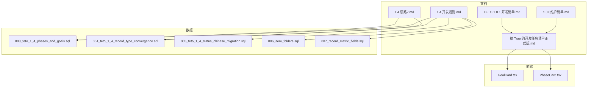
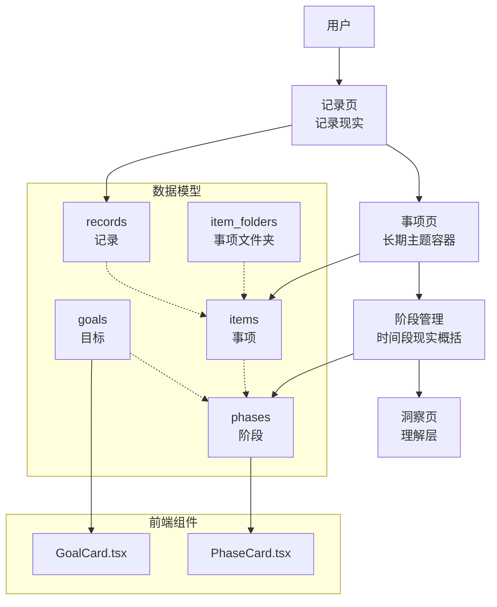
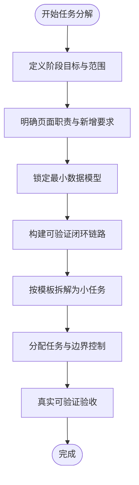
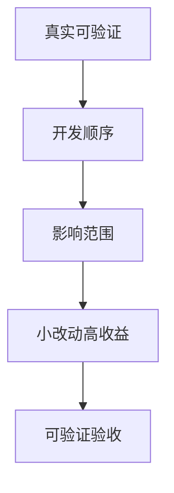
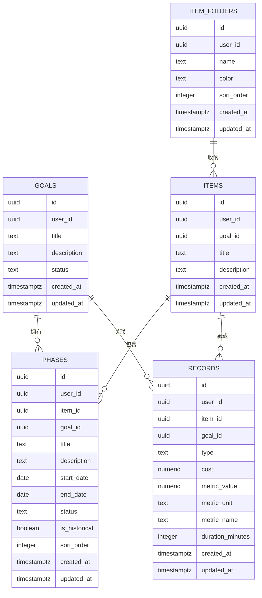
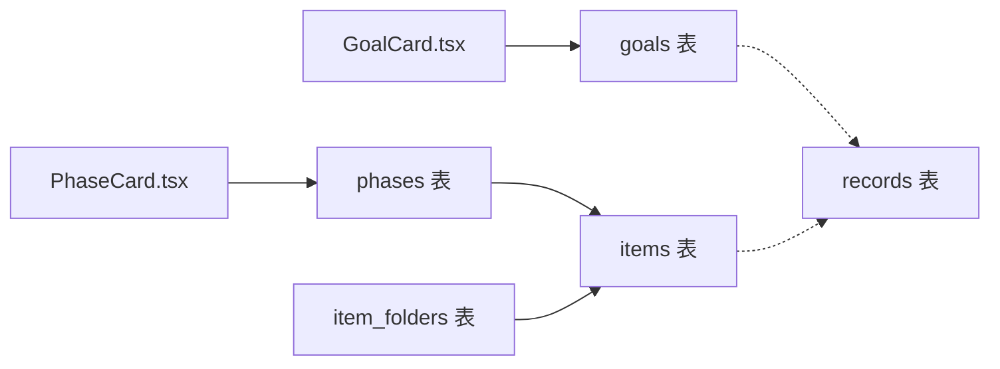

# 任务分配与管理

<cite>
**本文引用的文件**
- [TETO 1.4 开发规则.md](file://docs/01-生效版本/TETO 1.4/TETO 1.4 开发规则.md)
- [1.4 思路2.md](file://docs/01-生效版本/TETO 1.4/1.4 思路2.md)
- [《给 Trae 的开发任务清单（正式版）》.md](file://docs/10-版本归档/TETO 1.0.0/《给 Trae 的开发任务清单（正式版）》.md)
- [DATA_RULES.md](file://DATA_RULES.md)
- [1.0.0维护清单.md](file://docs/10-版本归档/TETO 1.0.0/1.0.0维护清单.md)
- [TETO 1.0.1 开发清单.md](file://docs/10-版本归档/TETO 1.0.1/TETO 1.0.1 开发清单.md)
- [003_teto_1_4_phases_and_goals.sql](file://sql/003_teto_1_4_phases_and_goals.sql)
- [004_teto_1_4_record_type_convergence.sql](file://sql/004_teto_1_4_record_type_convergence.sql)
- [005_teto_1_4_status_chinese_migration.sql](file://sql/005_teto_1_4_status_chinese_migration.sql)
- [006_item_folders.sql](file://sql/006_item_folders.sql)
- [007_record_metric_fields.sql](file://sql/007_record_metric_fields.sql)
- [GoalCard.tsx](file://src/app/(dashboard)/items/components/GoalCard.tsx)
- [PhaseCard.tsx](file://src/app/(dashboard)/items/components/PhaseCard.tsx)
</cite>

## 目录
1. [简介](#简介)
2. [项目结构](#项目结构)
3. [核心组件](#核心组件)
4. [架构总览](#架构总览)
5. [详细组件分析](#详细组件分析)
6. [依赖分析](#依赖分析)
7. [性能考量](#性能考量)
8. [故障排查指南](#故障排查指南)
9. [结论](#结论)
10. [附录](#附录)

## 简介
本文件面向 TETO 1.4 阶段的任务分配与管理工作，系统化阐述任务分解方法、优先级排序、依赖关系与分配原则，提供任务创建模板、状态跟踪与完成标准，解释 1.4 阶段的任务边界控制、功能范围限制与开发顺序要求，并给出任务估算、资源分配策略与进度监控机制，涵盖变更管理、风险识别与问题升级流程。文档以 1.4 开发规则与思路为权威依据，结合历史版本任务清单与数据库演进脚本，形成可执行、可验证、可迭代的任务管理体系。

## 项目结构
- 文档层面
  - 1.4 开发规则：定义阶段目标、范围边界、核心对象与关系、页面职责、开发顺序、验收标准与禁止事项。
  - 1.4 思路：聚焦记录粒度与阶段本质，统一“记录”概念，明确历史导入与日常使用两条阶段来源。
  - 历史任务清单：提供任务拆解模板、顺序与验收标准，指导 AI 协作与任务派发。
- 数据层面
  - SQL 脚本：定义 1.4 的核心数据模型（goals、phases、item_folders、records 扩展字段）与迁移策略。
- 前端层面
  - 组件：GoalCard、PhaseCard 展示目标与阶段的 UI 与状态呈现，体现 1.4 的对象关系与交互边界。

**图表来源**
- [TETO 1.4 开发规则.md:1-812](file://docs/01-生效版本/TETO 1.4/TETO 1.4 开发规则.md#L1-L812)
- [1.4 思路2.md:1-1209](file://docs/01-生效版本/TETO 1.4/1.4 思路2.md#L1-L1209)
- [003_teto_1_4_phases_and_goals.sql:1-130](file://sql/003_teto_1_4_phases_and_goals.sql#L1-L130)
- [004_teto_1_4_record_type_convergence.sql:1-20](file://sql/004_teto_1_4_record_type_convergence.sql#L1-L20)
- [005_teto_1_4_status_chinese_migration.sql:1-38](file://sql/005_teto_1_4_status_chinese_migration.sql#L1-L38)
- [006_item_folders.sql:1-38](file://sql/006_item_folders.sql#L1-L38)
- [007_record_metric_fields.sql:1-20](file://sql/007_record_metric_fields.sql#L1-L20)
- [GoalCard.tsx](file://src/app/(dashboard)/items/components/GoalCard.tsx#L1-L114)
- [PhaseCard.tsx](file://src/app/(dashboard)/items/components/PhaseCard.tsx#L1-L125)

**章节来源**
- [TETO 1.4 开发规则.md:1-812](file://docs/01-生效版本/TETO 1.4/TETO 1.4 开发规则.md#L1-L812)
- [1.4 思路2.md:1-1209](file://docs/01-生效版本/TETO 1.4/1.4 思路2.md#L1-L1209)

## 核心组件
- 任务分解与边界控制
  - 以 1.4 开发规则为边界：记录仍是第一入口，事项是长期主题容器，阶段是事项在某段时间的持续现实概括，洞察是理解层。明确禁止进入的方向（多人协作、企业权限、高级 AI、复杂自动识别等），确保任务不偏离阶段边界。
- 任务优先级排序
  - 按“真实可验证”原则与“开发顺序”推进：先语义定义，再页面职责，再最小数据模型，先跑通事项—阶段闭环，再跑通历史导入闭环，最后补洞察深化。
- 任务依赖关系
  - 数据层依赖：phases 依赖 items（外键），goals 与 records/ items 可通过 goal_id 关联；记录类型收敛与指标字段扩展支撑阶段与洞察的数据表达。
- 任务分配原则
  - 一次只推进一个明确任务块，不擅自扩展功能，不顺手修改无关模块，不偏离 1.4 当前边界，阶段相关实现必须服从“阶段属于事项”。

**章节来源**
- [TETO 1.4 开发规则.md:50-786](file://docs/01-生效版本/TETO 1.4/TETO 1.4 开发规则.md#L50-L786)
- [003_teto_1_4_phases_and_goals.sql:1-130](file://sql/003_teto_1_4_phases_and_goals.sql#L1-L130)
- [004_teto_1_4_record_type_convergence.sql:1-20](file://sql/004_teto_1_4_record_type_convergence.sql#L1-L20)
- [007_record_metric_fields.sql:1-20](file://sql/007_record_metric_fields.sql#L1-L20)

## 架构总览
1.4 的任务管理架构以“记录—事项—阶段—洞察”为主线，贯穿数据模型、页面职责与开发顺序。数据模型通过 SQL 脚本落地，前端组件承载目标与阶段的展示与交互，文档规则约束任务边界与验收标准。

**图表来源**
- [TETO 1.4 开发规则.md:358-485](file://docs/01-生效版本/TETO 1.4/TETO 1.4 开发规则.md#L358-L485)
- [003_teto_1_4_phases_and_goals.sql:1-130](file://sql/003_teto_1_4_phases_and_goals.sql#L1-L130)
- [006_item_folders.sql:1-38](file://sql/006_item_folders.sql#L1-L38)
- [GoalCard.tsx](file://src/app/(dashboard)/items/components/GoalCard.tsx#L1-L114)
- [PhaseCard.tsx](file://src/app/(dashboard)/items/components/PhaseCard.tsx#L1-L125)

## 详细组件分析

### 任务分解方法
- 以“阶段目标—页面职责—最小数据模型—闭环链路”四步法分解：
  - 阶段目标：明确 1.4 的总目标与必须完成的功能范围。
  - 页面职责：记录页、事项页、洞察页的职责与新增要求。
  - 最小数据模型：围绕 MVP 定义最小结构，避免为未来平台化预埋过大模型。
  - 闭环链路：日常链路、阶段链路、历史链路、洞察链路的可验证闭环。
- 任务拆解模板（参考 1.0 任务清单）：
  - 任务目标、技术要求、页面/模块范围、输出内容、验收标准、注意事项。
  - 一次只让 AI 完成一个边界清晰的小任务，避免一次性丢给 AI 整个系统。

**图表来源**
- [TETO 1.4 开发规则.md:508-760](file://docs/01-生效版本/TETO 1.4/TETO 1.4 开发规则.md#L508-L760)
- [《给 Trae 的开发任务清单（正式版）》.md:73-105](file://docs/10-版本归档/TETO 1.0.0/《给 Trae 的开发任务清单（正式版）》.md#L73-L105)

**章节来源**
- [TETO 1.4 开发规则.md:508-760](file://docs/01-生效版本/TETO 1.4/TETO 1.4 开发规则.md#L508-L760)
- [《给 Trae 的开发任务清单（正式版）》.md:73-105](file://docs/10-版本归档/TETO 1.0.0/《给 Trae 的开发任务清单（正式版）》.md#L73-L105)

### 任务优先级排序
- 优先级原则
  - 真实可验证优先：完成以“真实可验证”为准，而非“代码写了”。
  - 开发顺序优先：先语义定义，再页面职责，再最小数据模型，先跑通事项—阶段闭环，再跑通历史导入闭环，最后补洞察深化。
  - 影响范围优先：优先修复影响真实使用的问题，小改动、高收益、可验证的问题优先。
- 历史版本参考
  - 1.0.1 维护清单的 P0/P1/P2 分层与默认开发顺序，体现“先修问题、再补展示、后做增强”的策略。

**图表来源**
- [TETO 1.4 开发规则.md:591-646](file://docs/01-生效版本/TETO 1.4/TETO 1.4 开发规则.md#L591-L646)
- [TETO 1.0.1 开发清单.md:244-251](file://docs/10-版本归档/TETO 1.0.1/TETO 1.0.1 开发清单.md#L244-L251)

**章节来源**
- [TETO 1.4 开发规则.md:591-646](file://docs/01-生效版本/TETO 1.4/TETO 1.4 开发规则.md#L591-L646)
- [TETO 1.0.1 开发清单.md:244-251](file://docs/10-版本归档/TETO 1.0.1/TETO 1.0.1 开发清单.md#L244-L251)

### 任务依赖关系
- 数据层依赖
  - phases.item_id 外键依赖 items；phases.goal_id 可选依赖 goals；items 与 records 可选关联 goals。
  - 记录类型收敛：type 收敛为“发生/计划/想法/总结”，新增 cost、metric_* 字段支撑结构化统计。
  - 阶段状态中文化：goals/phases 状态从英文迁移为中文，统一 UI 与数据表达。
  - 事项文件夹：item_folders 与 items 的 folder_id 关联，支持事项分组收纳。
- 前端组件依赖
  - GoalCard/PhaseCard 展示目标与阶段状态，依赖后端提供的数据模型与状态枚举。

**图表来源**
- [003_teto_1_4_phases_and_goals.sql:1-130](file://sql/003_teto_1_4_phases_and_goals.sql#L1-L130)
- [004_teto_1_4_record_type_convergence.sql:1-20](file://sql/004_teto_1_4_record_type_convergence.sql#L1-L20)
- [005_teto_1_4_status_chinese_migration.sql:1-38](file://sql/005_teto_1_4_status_chinese_migration.sql#L1-L38)
- [006_item_folders.sql:1-38](file://sql/006_item_folders.sql#L1-L38)
- [007_record_metric_fields.sql:1-20](file://sql/007_record_metric_fields.sql#L1-L20)

**章节来源**
- [003_teto_1_4_phases_and_goals.sql:1-130](file://sql/003_teto_1_4_phases_and_goals.sql#L1-L130)
- [004_teto_1_4_record_type_convergence.sql:1-20](file://sql/004_teto_1_4_record_type_convergence.sql#L1-L20)
- [005_teto_1_4_status_chinese_migration.sql:1-38](file://sql/005_teto_1_4_status_chinese_migration.sql#L1-L38)
- [006_item_folders.sql:1-38](file://sql/006_item_folders.sql#L1-L38)
- [007_record_metric_fields.sql:1-20](file://sql/007_record_metric_fields.sql#L1-L20)

### 任务分配原则
- 一次只推进一个明确任务块，避免并行乱做。
- 不擅自扩展功能，不顺手修改无关模块，不偏离 1.4 当前边界。
- 阶段相关实现必须服从“阶段属于事项”，历史导入必须接入当前骨架，不另起系统。
- 任务分配以“真实可验证”为完成标准，页面层、数据层、链路层逐层验收。

**章节来源**
- [TETO 1.4 开发规则.md:576-760](file://docs/01-生效版本/TETO 1.4/TETO 1.4 开发规则.md#L576-L760)

### 任务创建模板
- 任务结构模板（参考 1.0 任务清单）
  - 任务目标：明确要达成的结果与边界。
  - 技术要求：技术栈、依赖与约束。
  - 页面/模块范围：涉及的页面、组件与接口。
  - 输出内容：新增/修改的文件、核心实现逻辑、还需补充的配置。
  - 验收标准：可验证的验收点。
  - 注意事项：禁止事项与边界约束。
- 示例指令风格：明确任务、范围与输出，避免扩展其他模块。

**章节来源**
- [《给 Trae 的开发任务清单（正式版）》.md:73-105](file://docs/10-版本归档/TETO 1.0.0/《给 Trae 的开发任务清单（正式版）》.md#L73-L105)

### 任务状态跟踪
- 目标与阶段卡片（GoalCard/PhaseCard）
  - 目标状态：进行中/已达成/已放弃/已暂停。
  - 阶段状态：进行中/已结束/停滞；历史阶段带“历史”标识。
  - UI 展示：状态标签、进度条、时间范围、描述与操作按钮。
- 数据一致性
  - 状态中文化迁移与 CHECK 约束，确保状态值合法与 UI 一致。

**章节来源**
- [GoalCard.tsx](file://src/app/(dashboard)/items/components/GoalCard.tsx#L1-L114)
- [PhaseCard.tsx](file://src/app/(dashboard)/items/components/PhaseCard.tsx#L1-L125)
- [005_teto_1_4_status_chinese_migration.sql:1-38](file://sql/005_teto_1_4_status_chinese_migration.sql#L1-L38)

### 任务完成标准
- 页面层：记录页、事项页、洞察页、历史导入流程可真实使用。
- 数据层：记录、事项、阶段、历史记录/阶段可创建、读取、更新、删除，关系正确可回显。
- 链路层：日常链路、阶段链路、历史链路、洞察链路真实走通，用户可看懂长期主题的近期与历史结构。

**章节来源**
- [TETO 1.4 开发规则.md:708-760](file://docs/01-生效版本/TETO 1.4/TETO 1.4 开发规则.md#L708-L760)

### 1.4 阶段的任务边界控制、功能范围限制与开发顺序
- 任务边界控制
  - 明确禁止进入的方向：多人协作、企业权限、高级 AI、复杂自动识别、把阶段做成独立一级模块等。
- 功能范围限制
  - 本阶段必须完成：记录层、事项层、阶段层、历史层、洞察层的基础能力。
  - 本阶段可以做但不抢先：阶段辅助识别、事项时间线、阶段对比视图、历史导入模板、简单阶段摘要、长期主题简报。
  - 本阶段明确不做：平台化设计、大规模无关功能扩张、回退到任务主导现实入口等。
- 开发顺序
  - 锁定语义定义 → 锁定页面职责 → 锁定最小数据语义模型 → 先跑通事项—阶段闭环 → 再跑通历史导入闭环 → 最后补洞察深化。

**章节来源**
- [TETO 1.4 开发规则.md:508-646](file://docs/01-生效版本/TETO 1.4/TETO 1.4 开发规则.md#L508-L646)

### 任务估算方法、资源分配策略与进度监控
- 估算方法
  - 参考 1.0 任务清单的“一次只推进一个明确任务块”原则，将大任务拆分为可验证的子任务，按页面/模块范围与输出内容估算工时。
- 资源分配策略
  - 优先保障页面职责与最小数据模型，再推进历史导入与洞察深化；维护阶段按 P0/P1/P2 分层推进。
- 进度监控
  - 以“真实可验证”为节点，逐层验收页面、数据与链路；历史版本的默认开发顺序可作为参考。

**章节来源**
- [《给 Trae 的开发任务清单（正式版）》.md:73-105](file://docs/10-版本归档/TETO 1.0.0/《给 Trae 的开发任务清单（正式版）》.md#L73-L105)
- [TETO 1.0.1 开发清单.md:244-251](file://docs/10-版本归档/TETO 1.0.1/TETO 1.0.1 开发清单.md#L244-L251)

### 任务变更管理、风险识别与问题升级流程
- 变更管理
  - 凡涉及数据库结构新增或修改，必须生成 SQL 并落到项目根目录 sql/ 文件夹，使用清晰、递增、可读命名，尽量使用 IF NOT EXISTS，不允许只在回复里给 SQL 而不落地文件。
- 风险识别
  - 结构过重、规则过死、输入成本过高、把事项重新做成任务替身、把阶段做成独立世界、把历史导入做成一次性垃圾倾倒、只会导数据不会组织语义、洞察只剩数字分布、系统退化为普通管理工具、过早依赖复杂 AI 或复杂算法。
- 问题升级流程
  - 维护阶段明确不做：第二大脑、财务模块、AI 自动日记解析、语音自动结构化、多人协作、企业版、复杂角色权限、高级动态配置系统；问题超出范围先记录，不立即开发。

**章节来源**
- [TETO 1.0.1 开发清单.md:230-242](file://docs/10-版本归档/TETO 1.0.1/TETO 1.0.1 开发清单.md#L230-L242)
- [TETO 1.0.1 开发清单.md:268-276](file://docs/10-版本归档/TETO 1.0.1/TETO 1.0.1 开发清单.md#L268-L276)
- [TETO 1.4 开发规则.md:669-686](file://docs/01-生效版本/TETO 1.4/TETO 1.4 开发规则.md#L669-L686)

## 依赖分析
- 组件耦合与内聚
  - GoalCard/PhaseCard 与后端数据模型强内聚，状态与 UI 一一对应；前端组件不负责数据存储，仅负责展示与交互。
- 直接与间接依赖
  - 数据层：phases 依赖 items，goals 与 records/ items 通过 goal_id 关联；记录类型收敛与指标字段扩展为阶段与洞察提供数据基础。
- 外部依赖与集成点
  - Supabase 认证与数据库服务，前端通过 API 与数据库交互；RLS 策略保障数据隔离。

**图表来源**
- [GoalCard.tsx](file://src/app/(dashboard)/items/components/GoalCard.tsx#L1-L114)
- [PhaseCard.tsx](file://src/app/(dashboard)/items/components/PhaseCard.tsx#L1-L125)
- [003_teto_1_4_phases_and_goals.sql:1-130](file://sql/003_teto_1_4_phases_and_goals.sql#L1-L130)
- [006_item_folders.sql:1-38](file://sql/006_item_folders.sql#L1-L38)

**章节来源**
- [GoalCard.tsx](file://src/app/(dashboard)/items/components/GoalCard.tsx#L1-L114)
- [PhaseCard.tsx](file://src/app/(dashboard)/items/components/PhaseCard.tsx#L1-L125)
- [003_teto_1_4_phases_and_goals.sql:1-130](file://sql/003_teto_1_4_phases_and_goals.sql#L1-L130)
- [006_item_folders.sql:1-38](file://sql/006_item_folders.sql#L1-L38)

## 性能考量
- 数据模型层面
  - 为 goals、phases、items、records 建立必要的索引，避免查询路径不明确导致的性能问题；指标字段索引留到 P2/P3 确认查询路径后再补。
- 前端层面
  - 组件按需渲染与状态缓存，减少不必要的重渲染；历史阶段与日常阶段共存时，注意 UI 区分与加载策略。
- 开发顺序层面
  - 先跑通闭环再做增强，避免在 MVP 阶段引入复杂查询与渲染逻辑。

**章节来源**
- [007_record_metric_fields.sql:1-20](file://sql/007_record_metric_fields.sql#L1-L20)
- [003_teto_1_4_phases_and_goals.sql:114-130](file://sql/003_teto_1_4_phases_and_goals.sql#L114-L130)

## 故障排查指南
- 页面无法打开/数据无法保存/读取/编辑/回显
  - 检查 Supabase 连接与环境变量配置，确认 RLS 策略生效。
- 趋势/预测展示不变化
  - 检查数据是否真实保存，确认统计逻辑基于任务配置与原始记录统一计算。
- 阶段状态异常
  - 检查状态中文化迁移与 CHECK 约束，确保状态值合法。
- 历史导入后无法归到长期主题
  - 确认历史导入流程与“历史导入必须接入当前骨架”的原则一致。

**章节来源**
- [DATA_RULES.md:76-126](file://DATA_RULES.md#L76-L126)
- [005_teto_1_4_status_chinese_migration.sql:1-38](file://sql/005_teto_1_4_status_chinese_migration.sql#L1-L38)
- [TETO 1.4 开发规则.md:338-356](file://docs/01-生效版本/TETO 1.4/TETO 1.4 开发规则.md#L338-L356)

## 结论
TETO 1.4 的任务分配与管理应以“真实可验证”为核心，严格遵循开发规则与开发顺序，通过最小数据模型与可验证闭环推进功能交付。任务拆解采用“阶段目标—页面职责—最小数据模型—闭环链路”的四步法，配合历史版本的任务清单模板与 SQL 脚本，形成可执行、可验证、可迭代的任务管理体系。变更管理与风险控制贯穿始终，确保系统在“记录—事项—洞察”骨架上补上“阶段”和“历史导入”能力，形成可持续使用、可长期回看、可表达连续人生现实的个人现实系统。

## 附录
- 术语
  - 记录：某天某次真实发生的现实内容，系统第一入口。
  - 事项：长期主题容器，承载一个人在现实生活中长期面对、投入、处理、发展的主题。
  - 阶段：某个事项在某段时间里的持续现实概括，不是事项本身，也不是普通单条记录。
  - 洞察：理解层，基于记录、事项、阶段共同形成，服务于人能看懂自己的现实。
- 参考文件
  - 1.4 开发规则、1.4 思路、1.0 任务清单、1.0.1 维护清单、SQL 脚本与前端组件。