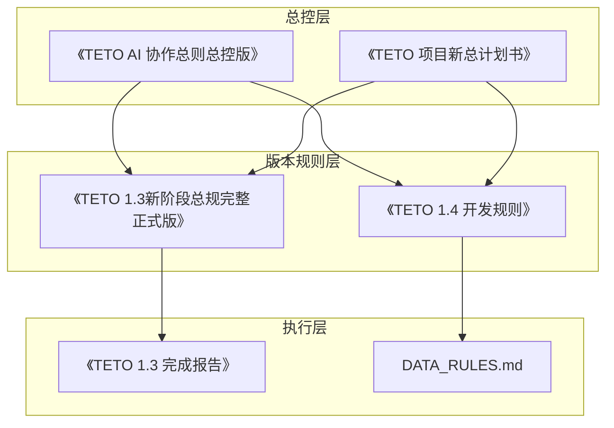
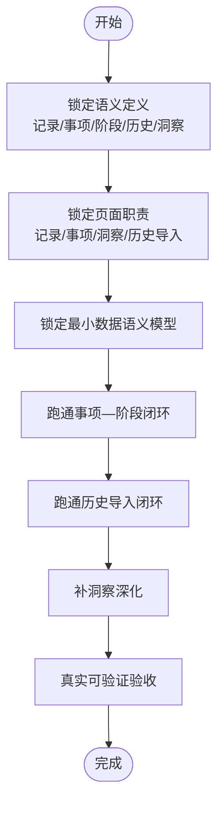
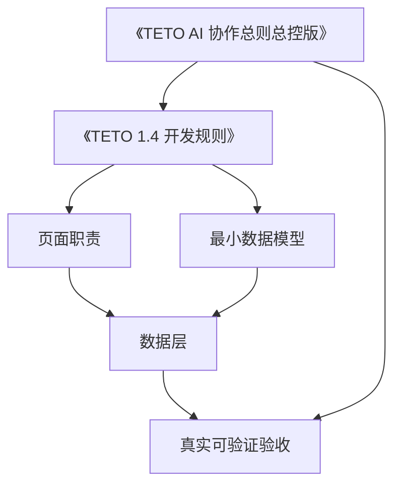

# 团队协作规范

<cite>
**本文档引用的文件**
- [README.md](file://README.md)
- [TETO 1.4 开发规则.md](file://docs/01-生效版本/TETO 1.4/TETO 1.4 开发规则.md)
- [TETO 1.3新阶段总规（完整正式版）.md](file://docs/01-生效版本/TETO 1.3/《TETO 1.3新阶段总规（完整正式版）》.md)
- [TETO 1.3 完成报告.md](file://docs/01-生效版本/TETO 1.3/TETO 1.3 完成报告.md)
- [TETO 项目新总计划书.md](file://docs/00-总控/TETO 项目新总计划书.md)
- [TETO AI 协作总则（总控版）.md](file://docs/00-总控/《TETO AI 协作总则（总控版）》.md)
- [DATA_RULES.md](file://DATA_RULES.md)
</cite>

## 目录
1. [引言](#引言)
2. [项目结构](#项目结构)
3. [核心组件](#核心组件)
4. [架构总览](#架构总览)
5. [详细组件分析](#详细组件分析)
6. [依赖分析](#依赖分析)
7. [性能考虑](#性能考虑)
8. [故障排除指南](#故障排除指南)
9. [结论](#结论)
10. [附录](#附录)

## 引言
本规范旨在为TETO项目团队提供统一的协作框架，明确角色分工、沟通机制、知识分享制度、开发协作原则、行为准则与工作纪律要求。文档特别针对1.4阶段的功能范围限制、开发边界控制与变更管理流程进行系统化阐述，并配套会议制度、文档管理规范与经验总结机制，涵盖冲突解决方法、技能培养计划与团队建设活动，确保团队高效、有序地推进项目目标。

## 项目结构
TETO项目采用“记录—事项—洞察”三层主骨架，结合1.4阶段新增的“阶段”与“历史导入”能力，形成“连续人生现实系统”。项目文档体系分为总控、版本规则、当前清单、产品与设计、SQL与历史归档等层级，确保规则与执行分离、阶段与边界清晰。

**图表来源**
- [TETO AI 协作总则（总控版）.md:1-568](file://docs/00-总控/《TETO AI 协作总则（总控版）》.md#L1-L568)
- [TETO 项目新总计划书.md:1-392](file://docs/00-总控/TETO 项目新总计划书.md#L1-L392)
- [TETO 1.3新阶段总规（完整正式版）.md:1-800](file://docs/01-生效版本/TETO 1.3/《TETO 1.3新阶段总规（完整正式版）》.md#L1-L800)
- [TETO 1.4 开发规则.md:1-812](file://docs/01-生效版本/TETO 1.4/TETO 1.4 开发规则.md#L1-L812)
- [TETO 1.3 完成报告.md:1-459](file://docs/01-生效版本/TETO 1.3/TETO 1.3 完成报告.md#L1-L459)
- [DATA_RULES.md:1-174](file://DATA_RULES.md#L1-L174)

**章节来源**
- [README.md:1-126](file://README.md#L1-L126)
- [TETO 项目新总计划书.md:1-392](file://docs/00-总控/TETO 项目新总计划书.md#L1-L392)

## 核心组件
- 记录：系统第一入口，承接每天真实发生的内容，强调“先记录，再补充”，保持轻输入与低门槛。
- 事项：长期主题容器，负责组织而非定义现实，支持记录与阶段的聚合与回看。
- 阶段：某个事项在某段时间里的持续现实概括，必须隶属于事项，不可独立存在。
- 历史：通过“具体记录导入”和“阶段补录导入”两条路径进入系统，统一接入现有骨架。
- 洞察：理解层，基于记录、事项、阶段与历史/近期对照，提供连续性理解与趋势判断。

**章节来源**
- [TETO 1.4 开发规则.md:144-262](file://docs/01-生效版本/TETO 1.4/TETO 1.4 开发规则.md#L144-L262)
- [TETO 1.4 开发规则.md:302-384](file://docs/01-生效版本/TETO 1.4/TETO 1.4 开发规则.md#L302-L384)
- [TETO 1.4 开发规则.md:458-485](file://docs/01-生效版本/TETO 1.4/TETO 1.4 开发规则.md#L458-L485)

## 架构总览
1.4阶段的系统架构以“记录—事项—阶段—历史—洞察”为主线，强调连续性与真实可验证。开发顺序严格遵循“先语义定义—页面职责—最小数据模型—事项—阶段—历史—洞察”的推进路径，确保每一步都可闭环验证。

**图表来源**
- [TETO 1.4 开发规则.md:591-646](file://docs/01-生效版本/TETO 1.4/TETO 1.4 开发规则.md#L591-L646)

**章节来源**
- [TETO 1.4 开发规则.md:576-646](file://docs/01-生效版本/TETO 1.4/TETO 1.4 开发规则.md#L576-L646)

## 详细组件分析

### 1.4阶段功能范围与边界控制
- 必须完成：记录层（快速创建/编辑/关联事项/筛选/回看）、事项层（创建/编辑/详情/关联记录）、阶段层（创建/编辑/列表/时间范围/描述/状态/隶属关系）、历史层（创建历史事项/导入历史记录/补录历史阶段/校验挂载/事项页回看）、洞察层（基础记录/事项/阶段/近期/历史对照）。
- 可以做但不抢先：阶段辅助识别、事项时间线、阶段对比视图、历史导入模板、简单阶段摘要、长期主题简报。
- 明确不做：多人协作、家庭/团队权限体系、企业化架构、高级AI主导链路、复杂自动阶段识别、复杂目标评分公式、超前平台化设计、大规模无关功能扩张、把阶段做成独立一级导航、回退到任务主导现实入口。

**章节来源**
- [TETO 1.4 开发规则.md:508-573](file://docs/01-生效版本/TETO 1.4/TETO 1.4 开发规则.md#L508-L573)

### 开发协作原则与行为准则
- 一次只推进一个明确任务块，不擅自扩展功能。
- 不顺手修改无关模块，不在未确认前做大重构。
- 不偏离1.4当前边界，不让旧版本逻辑污染当前结构。
- 不因为未来可能用到就提前做过度预埋，不把讨论稿自动当成代码结构。
- 阶段相关实现必须服从“阶段属于事项”，历史导入必须接入同一骨架，不另起系统。

**章节来源**
- [TETO 1.4 开发规则.md:576-588](file://docs/01-生效版本/TETO 1.4/TETO 1.4 开发规则.md#L576-L588)

### 验收标准与完成判定
- 页面层：记录页、事项页、洞察页、历史导入流程均可真实使用。
- 数据层：记录、事项、阶段可创建/读取/更新/删除；历史记录/阶段导入成功；关系正确可回显。
- 链路层：日常链路（记录→关联事项→事项页回看）、阶段链路（事项页创建阶段→保存→事项页回看→不漂浮）、历史链路（创建历史事项→导入历史记录→补录历史阶段→事项页并存）、洞察链路（洞察中看到记录/事项/阶段基础理解结果→用户能看懂长期主题近期与历史结构）。

**章节来源**
- [TETO 1.4 开发规则.md:708-758](file://docs/01-生效版本/TETO 1.4/TETO 1.4 开发规则.md#L708-L758)

### 历史导入机制与数据迁移
- 历史进入系统的两条主路径：具体记录导入（Excel/旧日志/旧系统导出/结构化过去数据进入记录）；阶段补录导入（无法拆成每天记录的长期过去/只能概括表达的重要阶段/某几年/某几个月/某一时期的人生现实进入事项下的阶段）。
- 基本原则：先确定是事项、记录还是阶段；能导入明细的优先作为记录；无法还原明细但确实重要的允许补录阶段；历史事项/历史阶段/历史记录应进入同一骨架；历史导入后，用户必须能在事项页中统一回看。
- 不应变成：Excel上传工具、导入完后无法归到长期主题、把所有历史强行拆成低质量日记录、把所有历史粗暴压成一句大总结、形成与当前系统分裂的历史孤岛。

**章节来源**
- [TETO 1.4 开发规则.md:302-356](file://docs/01-生效版本/TETO 1.4/TETO 1.4 开发规则.md#L302-L356)

### 页面职责与用户体验
- 记录页：快速输入当下现实、浏览今天与最近记录流、编辑记录、基础筛选、关联事项、提供从记录进入事项的入口；保持轻输入与具体记录优先，阶段信息可作为上下文辅助显示但不破坏记录页“具体发生”本位。
- 事项页：展示事项基本信息、关联记录、阶段列表、新建/编辑阶段、近期与历史变化、长期回看；建议结构包含事项概览区、阶段区、记录区、长期回看区。
- 洞察页：看记录分布、事项活跃情况、阶段变化、近期与历史衔接、帮助用户理解现实结构；应具备阶段视角与长期主题变化的基础理解能力。
- 历史导入能力：必须有清晰入口与明确流程，职责包括新建历史事项、导入历史具体记录、补录历史阶段、校验挂载关系、导入后进入事项页回看。

**章节来源**
- [TETO 1.4 开发规则.md:385-506](file://docs/01-生效版本/TETO 1.4/TETO 1.4 开发规则.md#L385-L506)

### 数据理解顺序与设计原则
- 数据理解顺序：先记录，再事项，再阶段，再洞察；更细为先具体发生，再长期主题，再时间段概括，再整体理解。
- 设计原则：真实优先、简单优先、连续性优先、轻输入优先、人可理解优先、组织晚于发生、阶段不漂浮、历史不孤岛。

**章节来源**
- [TETO 1.4 开发规则.md:690-699](file://docs/01-生效版本/TETO 1.4/TETO 1.4 开发规则.md#L690-L699)
- [TETO 1.4 开发规则.md:648-666](file://docs/01-生效版本/TETO 1.4/TETO 1.4 开发规则.md#L648-L666)

### 变更管理流程
- 变更来源：仅允许来自当前生效开发阶段与规则文档；AI/成员不得擅自扩大范围或提前进入下一阶段。
- 变更审批：涉及数据库结构新增/修改，必须生成SQL并落地到项目根目录sql/，在Supabase中执行并通过页面读写一致性验证。
- 验收标准：以“真实可验证”为准，页面能打开、数据能真实保存/读取/编辑/回显、Supabase中能看到对应记录、页面展示结果与数据库一致、趋势/状态变化真实可见。

**章节来源**
- [TETO AI 协作总则（总控版）.md:187-227](file://docs/00-总控/《TETO AI 协作总则（总控版）》.md#L187-L227)
- [TETO AI 协作总则（总控版）.md:416-443](file://docs/00-总控/《TETO AI 协作总则（总控版）》.md#L416-L443)

### 会议制度与沟通机制
- 周会：每周固定时间回顾上周进展、识别阻塞、规划下周优先任务，聚焦“真实可验证”闭环。
- 站会：每日站会快速同步当日任务、风险与依赖，确保“一次只推进一个明确任务块”。
- 变更评审会：涉及数据库结构/核心对象变更必须召开评审会，明确影响面与验证方案。
- 冲突调解会：跨模块/跨角色冲突由项目负责人组织，依据“当前生效开发阶段+当前生效规则文档”进行裁决。

**章节来源**
- [TETO AI 协作总则（总控版）.md:153-164](file://docs/00-总控/《TETO AI 协作总则（总控版）》.md#L153-L164)

### 文档管理规范
- 文档优先级：总控文档 > 当前生效版本规则文档 > 当前任务/维护清单 > 设计与实现文档 > 历史旧文档。
- 文档归档：按“总控/版本规则/当前清单/产品与设计/SQL/历史归档”分层管理，避免规则冲突与失控。
- 文档更新：每次只整理一层，不一次推翻全部；版本切换需明确声明，AI不得自行切换。

**章节来源**
- [TETO AI 协作总则（总控版）.md:228-240](file://docs/00-总控/《TETO AI 协作总则（总控版）》.md#L228-L240)
- [TETO AI 协作总则（总控版）.md:517-527](file://docs/00-总控/《TETO AI 协作总则（总控版）》.md#L517-L527)

### 经验总结机制
- 阶段复盘：每个阶段完成后进行“真实可验证”复盘，输出可执行的改进清单。
- 知识沉淀：将经验固化为“最小够用”的规则与流程，避免重复踩坑。
- 技术债务管理：定期评估与清理旧代码与历史文档，降低维护成本。

**章节来源**
- [TETO 1.3 完成报告.md:385-451](file://docs/01-生效版本/TETO 1.3/TETO 1.3 完成报告.md#L385-L451)

### 冲突解决方法
- 依据当前生效开发阶段与规则文档进行裁决，AI不得自行扩大范围或回退阶段。
- 重大分歧由项目负责人组织跨角色代表会议，以“真实可验证”为最终标准。
- 防重复劳动：AI在给出下一步动作前，必须判断是否已做过、是否只需补充状态。

**章节来源**
- [TETO AI 协作总则（总控版）.md:87-108](file://docs/00-总控/《TETO AI 协作总则（总控版）》.md#L87-L108)
- [TETO AI 协作总则（总控版）.md:213-227](file://docs/00-总控/《TETO AI 协作总则（总控版）》.md#L213-L227)

### 技能培养计划
- 基础能力：熟练掌握“记录—事项—洞察”三层逻辑与1.4阶段新增的“阶段—历史导入”能力。
- 进阶能力：理解数据理解顺序与设计原则，具备“真实可验证”验收思维。
- 软技能：强化跨模块协作意识、冲突解决能力与文档管理能力。

**章节来源**
- [TETO 项目新总计划书.md:320-340](file://docs/00-总控/TETO 项目新总计划书.md#L320-L340)

### 团队建设活动
- 每月一次“真实可验证”案例分享会，展示用户故事与系统闭环。
- 季度一次“连续人生现实”主题分享，加深对系统理念的理解与认同。
- 年度一次“阶段复盘与未来规划”大会，统一目标与节奏。

**章节来源**
- [TETO 项目新总计划书.md:377-392](file://docs/00-总控/TETO 项目新总计划书.md#L377-L392)

## 依赖分析
1.4阶段的依赖关系以“记录—事项—阶段—历史—洞察”为核心链路，页面职责与数据模型必须与规则文档保持一致，AI执行严格遵循“当前生效开发阶段+当前生效规则文档”。

**图表来源**
- [TETO 1.4 开发规则.md:576-588](file://docs/01-生效版本/TETO 1.4/TETO 1.4 开发规则.md#L576-L588)
- [TETO AI 协作总则（总控版）.md:403-414](file://docs/00-总控/《TETO AI 协作总则（总控版）》.md#L403-L414)

**章节来源**
- [TETO 1.4 开发规则.md:576-588](file://docs/01-生效版本/TETO 1.4/TETO 1.4 开发规则.md#L576-L588)
- [TETO AI 协作总则（总控版）.md:403-414](file://docs/00-总控/《TETO AI 协作总则（总控版）》.md#L403-L414)

## 性能考虑
- 输入阻力控制：保持记录页轻输入，避免复杂前置配置导致用户放弃记录。
- 数据模型简化：最小够用的数据语义模型，避免为未来平台化过度预埋造成复杂度。
- 验收前置：以“真实可验证”为导向，减少无效迭代与返工。

**章节来源**
- [TETO 1.4 开发规则.md:648-666](file://docs/01-生效版本/TETO 1.4/TETO 1.4 开发规则.md#L648-L666)

## 故障排除指南
- 常见问题
  - 阶段独立存在：检查是否违反“阶段必须隶属于事项”的规则。
  - 历史导入后无法回看：检查导入流程是否正确、挂载关系是否校验通过。
  - 页面职责错位：核对页面职责与规则文档一致性。
- 处理流程
  - 快速定位：依据“真实可验证”验收清单逐项排查。
  - 复盘归因：结合1.3完成报告中的“局限”与1.4的“必须避免的坏结果”进行归因。
  - 修复闭环：修复后重新走一遍主链路，确保闭环通过。

**章节来源**
- [TETO 1.3 完成报告.md:359-382](file://docs/01-生效版本/TETO 1.3/TETO 1.3 完成报告.md#L359-L382)
- [TETO 1.4 开发规则.md:669-683](file://docs/01-生效版本/TETO 1.4/TETO 1.4 开发规则.md#L669-L683)

## 结论
本规范以1.4阶段为核心，明确了功能范围、开发边界、验收标准与协作流程，确保团队在统一规则下高效推进。通过严格的变更管理、文档管理与经验总结机制，以及完善的冲突解决与技能培养计划，TETO项目将持续演进为“可长期使用、可连续回看、可表达连续人生现实”的个人现实系统。

## 附录
- 术语表
  - 记录：某天某次真实发生的现实内容，系统第一入口。
  - 事项：长期主题容器，负责组织而非定义现实。
  - 阶段：某个事项在某段时间里的持续现实概括，必须隶属于事项。
  - 历史：通过具体记录导入与阶段补录导入进入系统，统一接入现有骨架。
  - 洞察：理解层，基于记录、事项、阶段与历史/近期对照，提供连续性理解与趋势判断。
- 参考文件
  - 《TETO 1.4 开发规则》
  - 《TETO 1.3新阶段总规（完整正式版）》
  - 《TETO 1.3 完成报告》
  - 《TETO 项目新总计划书》
  - 《TETO AI 协作总则（总控版）》
  - DATA_RULES.md