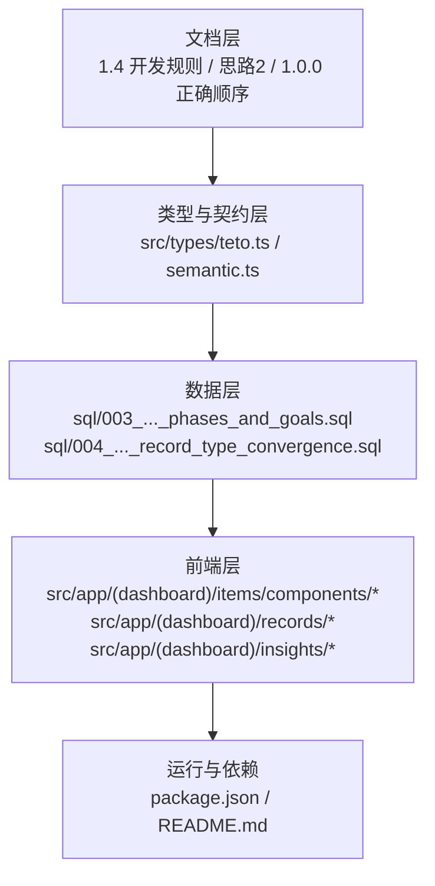
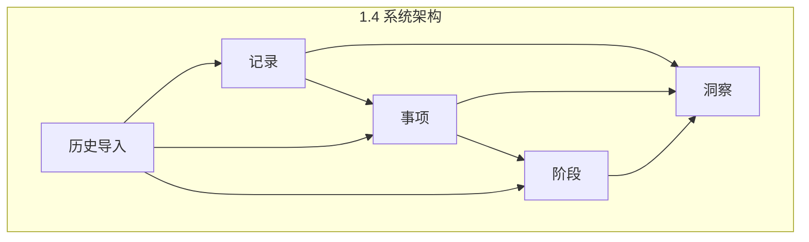
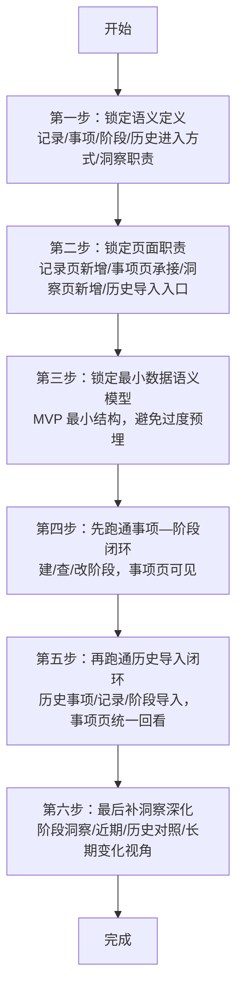
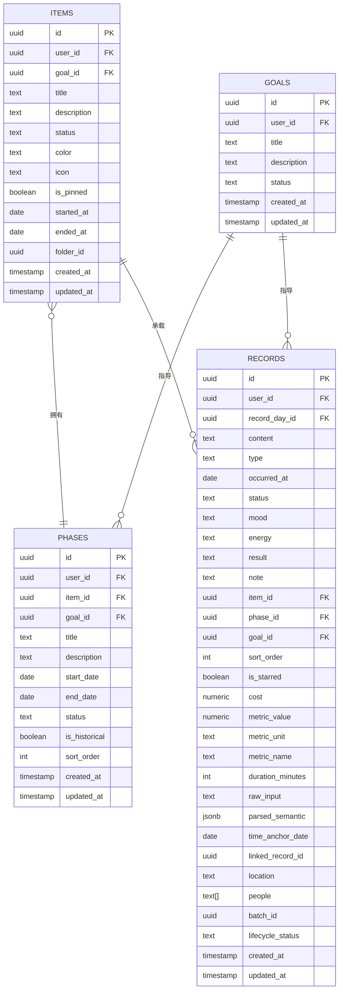

# 开发周期与里程碑

<cite>
**本文引用的文件**
- [TETO 1.4 开发规则.md](file://docs/01-生效版本/TETO 1.4/TETO 1.4 开发规则.md)
- [1.4 思路2.md](file://docs/01-生效版本/TETO 1.4/1.4 思路2.md)
- [现在到开发的正确顺序.md](file://docs/10-版本归档/TETO 1.0.0/现在到开发的正确顺序.md)
- [README.md](file://README.md)
- [DATA_RULES.md](file://DATA_RULES.md)
- [teto.ts](file://src/types/teto.ts)
- [semantic.ts](file://src/types/semantic.ts)
- [003_teto_1_4_phases_and_goals.sql](file://sql/003_teto_1_4_phases_and_goals.sql)
- [004_teto_1_4_record_type_convergence.sql](file://sql/004_teto_1_4_record_type_convergence.sql)
- [package.json](file://package.json)
</cite>

## 目录
1. [简介](#简介)
2. [项目结构](#项目结构)
3. [核心组件](#核心组件)
4. [架构总览](#架构总览)
5. [详细组件分析](#详细组件分析)
6. [依赖分析](#依赖分析)
7. [性能考虑](#性能考虑)
8. [故障排查指南](#故障排查指南)
9. [结论](#结论)
10. [附录](#附录)

## 简介
本文件面向 TETO 1.4 阶段，系统化梳理开发周期与里程碑管理规范，明确六大开发步骤、严格顺序、并行限制与依赖关系，提供迭代计划制定、进度评估与质量门禁方法，以及风险预警、变更控制与交付物管理策略。目标是确保“记录—事项—洞察”骨架在 1.4 阶段稳定承接“阶段”与“历史导入”，形成可验证、可持续的连续人生现实系统。

## 项目结构
- 文档层：1.4 规则、思路与历史版本的“正确顺序”文档，构成阶段定义、范围边界与开发顺序的权威依据。
- 类型与契约层：前端类型定义与语义解析类型，明确数据模型与接口约束。
- 数据层：SQL 脚本体现 1.4 的阶段/目标模型落地与记录类型收敛。
- 前端层：页面与组件体现 1.4 的页面职责与交互边界。
- 运行与依赖：Next.js、Supabase、Recharts 等技术栈支撑。

**图表来源**
- [TETO 1.4 开发规则.md](file://docs/01-生效版本/TETO 1.4/TETO 1.4 开发规则.md)
- [1.4 思路2.md](file://docs/01-生效版本/TETO 1.4/1.4 思路2.md)
- [teto.ts](file://src/types/teto.ts)
- [semantic.ts](file://src/types/semantic.ts)
- [003_teto_1_4_phases_and_goals.sql](file://sql/003_teto_1_4_phases_and_goals.sql)
- [004_teto_1_4_record_type_convergence.sql](file://sql/004_teto_1_4_record_type_convergence.sql)
- [package.json](file://package.json)

**章节来源**
- [README.md](file://README.md)
- [package.json](file://package.json)

## 核心组件
- 语义定义与职责边界：明确记录、事项、阶段、历史导入与洞察的定义与职责，奠定“先现实、后组织、再理解”的数据理解顺序。
- 页面职责：记录页、事项页、洞察页与历史导入流程的职责边界与交互约束。
- 数据模型最小化：围绕 MVP 的最小语义模型，避免过度平台化预埋。
- 事项—阶段闭环：在事项下创建、查看、编辑阶段，确保阶段不漂浮。
- 历史导入闭环：历史事项、历史记录与历史阶段的导入与回看。
- 洞察深化：在数据真实存在后，提供阶段视角与长期变化理解。

**章节来源**
- [TETO 1.4 开发规则.md](file://docs/01-生效版本/TETO 1.4/TETO 1.4 开发规则.md)
- [1.4 思路2.md](file://docs/01-生效版本/TETO 1.4/1.4 思路2.md)

## 架构总览
1.4 的系统架构以“记录—事项—洞察”为核心骨架，新增“阶段”与“历史导入”能力，形成“现实入口—长期主题—时间段概括—历史接入—理解深化”的主链路。

**图表来源**
- [TETO 1.4 开发规则.md](file://docs/01-生效版本/TETO 1.4/TETO 1.4 开发规则.md)

## 详细组件分析

### 六大开发步骤与顺序
1.4 的开发必须严格遵循六大步骤的顺序推进，禁止并行与逆序。

**图表来源**
- [TETO 1.4 开发规则.md](file://docs/01-生效版本/TETO 1.4/TETO 1.4 开发规则.md)

**章节来源**
- [TETO 1.4 开发规则.md](file://docs/01-生效版本/TETO 1.4/TETO 1.4 开发规则.md)

### 语义定义锁定
- 记录：某天某次真实发生的现实内容，第一入口。
- 事项：长期主题容器，负责组织而非定义。
- 阶段：某个事项在某段时间里的持续现实概括，必须隶属于事项。
- 历史导入：两条主路径——具体记录与阶段补录，进入同一骨架。
- 洞察：理解层，服务于人能看懂自己的现实，不追求炫图与复杂公式。

**章节来源**
- [TETO 1.4 开发规则.md](file://docs/01-生效版本/TETO 1.4/TETO 1.4 开发规则.md)

### 页面职责明确
- 记录页：快速输入、浏览记录流、基础筛选、关联事项，保持“具体发生”本位。
- 事项页：展示基本信息、记录与阶段、支持新建/编辑阶段、长期回看。
- 洞察页：记录分布、事项活跃、阶段变化、近期/历史对照，帮助理解现实结构。
- 历史导入：新建历史事项、导入历史记录、补录历史阶段、校验挂载关系、导入后进入事项页回看。

**章节来源**
- [TETO 1.4 开发规则.md](file://docs/01-生效版本/TETO 1.4/TETO 1.4 开发规则.md)

### 数据模型最小化
- 阶段与目标模型：新增 goals 与 phases 表，为 items 与 records 表添加 goal_id 外键，确保阶段与目标的可追溯性。
- 记录类型收敛：将情绪/花费/结果收敛为“发生”，新增 cost 字段，统一记录类型枚举，便于后续聚合与洞察。

**图表来源**
- [003_teto_1_4_phases_and_goals.sql](file://sql/003_teto_1_4_phases_and_goals.sql)
- [004_teto_1_4_record_type_convergence.sql](file://sql/004_teto_1_4_record_type_convergence.sql)
- [teto.ts](file://src/types/teto.ts)

**章节来源**
- [003_teto_1_4_phases_and_goals.sql](file://sql/003_teto_1_4_phases_and_goals.sql)
- [004_teto_1_4_record_type_convergence.sql](file://sql/004_teto_1_4_record_type_convergence.sql)
- [teto.ts](file://src/types/teto.ts)

### 事项—阶段闭环
- 关键节点：创建阶段、查看阶段、编辑阶段、在事项页统一呈现。
- 依赖关系：阶段必须隶属于事项，不允许独立存在；阶段状态与排序需可维护。

**章节来源**
- [TETO 1.4 开发规则.md](file://docs/01-生效版本/TETO 1.4/TETO 1.4 开发规则.md)

### 历史导入闭环
- 两条路径：历史具体记录进入记录；历史阶段补录进入事项下的阶段。
- 原则：先确定对象类型、能导入明细优先作为记录、历史事项/阶段/记录进入同一骨架、导入后可在事项页统一回看。

**章节来源**
- [TETO 1.4 开发规则.md](file://docs/01-生效版本/TETO 1.4/TETO 1.4 开发规则.md)

### 洞察深化
- 基础能力：记录洞察、事项洞察、阶段洞察、近期/历史对照。
- 质量要求：洞察必须来源于真实数据，服务于理解而非炫图。

**章节来源**
- [TETO 1.4 开发规则.md](file://docs/01-生效版本/TETO 1.4/TETO 1.4 开发规则.md)

## 依赖分析
- 语义与职责依赖：页面职责必须与语义定义一致，历史导入必须接入当前骨架，阶段必须属于事项。
- 数据模型依赖：阶段与目标模型依赖于记录类型收敛与最小数据模型，确保后续洞察与聚合可实现。
- 前后端依赖：前端组件与 API 路由需与类型定义与数据库结构保持一致。

**图表来源**
- [TETO 1.4 开发规则.md](file://docs/01-生效版本/TETO 1.4/TETO 1.4 开发规则.md)
- [teto.ts](file://src/types/teto.ts)
- [003_teto_1_4_phases_and_goals.sql](file://sql/003_teto_1_4_phases_and_goals.sql)

**章节来源**
- [teto.ts](file://src/types/teto.ts)
- [semantic.ts](file://src/types/semantic.ts)

## 性能考虑
- 数据模型层面：为 goals、phases、records 等关键表建立索引，优化查询与聚合性能。
- 前端层面：按需加载与懒渲染，减少初始包体积；利用缓存与分页策略提升列表性能。
- 运行层面：合理配置 Next.js 构建与运行参数，结合 Supabase 的连接池与查询优化。

**章节来源**
- [003_teto_1_4_phases_and_goals.sql](file://sql/003_teto_1_4_phases_and_goals.sql)
- [package.json](file://package.json)

## 故障排查指南
- 验收标准核查：页面层、数据层、链路层三类验收标准逐项验证，确保真实可验证。
- 常见问题定位：
  - 阶段漂浮：检查阶段是否正确隶属事项，是否存在非法独立对象。
  - 历史孤岛：确认历史导入后是否在事项页统一回看，避免结构分裂。
  - 洞察失真：核对洞察数据来源是否来自真实存在的记录/事项/阶段。
- 变更控制：任何偏离六大步骤或职责边界的改动需重新评审，确保不破坏连续性与输入轻量化原则。

**章节来源**
- [TETO 1.4 开发规则.md](file://docs/01-生效版本/TETO 1.4/TETO 1.4 开发规则.md)

## 结论
TETO 1.4 的开发周期与里程碑管理以“语义定义—页面职责—最小模型—事项—阶段—历史—洞察”为主线，严格顺序与职责边界是保证系统连续性与可验证性的关键。通过明确的验收标准、风险预警与变更控制，确保在不引入过度复杂度的前提下，稳步实现“连续人生现实系统”的目标。

## 附录

### 迭代计划制定与进度评估
- 迭代节奏：以“事项—阶段闭环”和“历史导入闭环”为两个关键里程碑节点，分别进行阶段性评审与验收。
- 进度评估：采用“链路验证法”，逐一验证日常链路、阶段链路、历史链路与洞察链路是否真实走通。
- 质量门禁：任一链路未通过即不得进入下一阶段，直至问题修复并通过验收。

**章节来源**
- [TETO 1.4 开发规则.md](file://docs/01-生效版本/TETO 1.4/TETO 1.4 开发规则.md)

### 风险预警机制
- 结构过重：若出现过度抽象或预埋，立即回退至最小模型。
- 输入成本过高：若记录输入成为负担，回归“轻输入优先”原则。
- 洞察只剩数字：确保洞察具备现实理解能力，避免统计陷阱。

**章节来源**
- [TETO 1.4 开发规则.md](file://docs/01-生效版本/TETO 1.4/TETO 1.4 开发规则.md)

### 变更控制流程
- 变更申请：提交变更说明与影响评估。
- 评审会议：由核心成员与相关方评审，重点评估对语义、职责与顺序的影响。
- 批准与回退：批准后实施，未批准则回退至最小可行方案。

**章节来源**
- [TETO 1.4 开发规则.md](file://docs/01-生效版本/TETO 1.4/TETO 1.4 开发规则.md)

### 交付物管理
- 文档交付：1.4 开发规则、页面职责清单、最小数据模型文档。
- 代码交付：前端组件、API 路由、类型定义与 SQL 脚本。
- 验收交付：通过页面层、数据层、链路层验收的系统可验证版本。

**章节来源**
- [TETO 1.4 开发规则.md](file://docs/01-生效版本/TETO 1.4/TETO 1.4 开发规则.md)
- [1.4 思路2.md](file://docs/01-生效版本/TETO 1.4/1.4 思路2.md)
- [现在到开发的正确顺序.md](file://docs/10-版本归档/TETO 1.0.0/现在到开发的正确顺序.md)