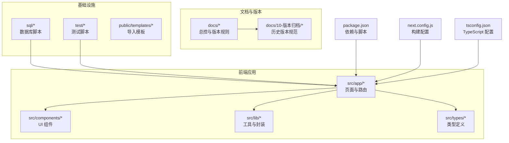
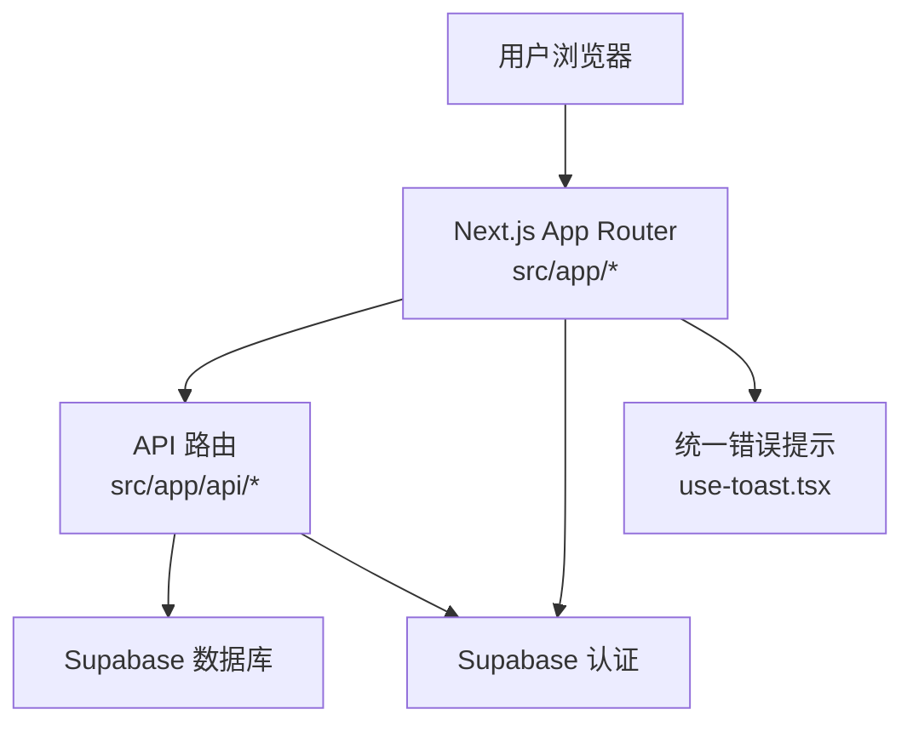
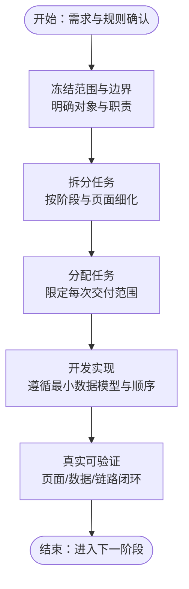
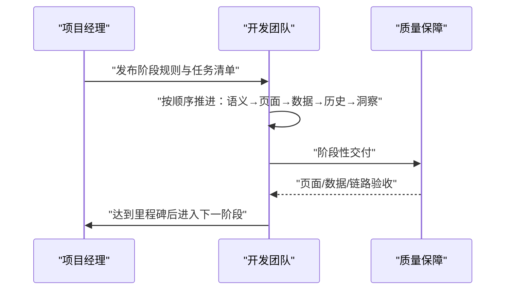
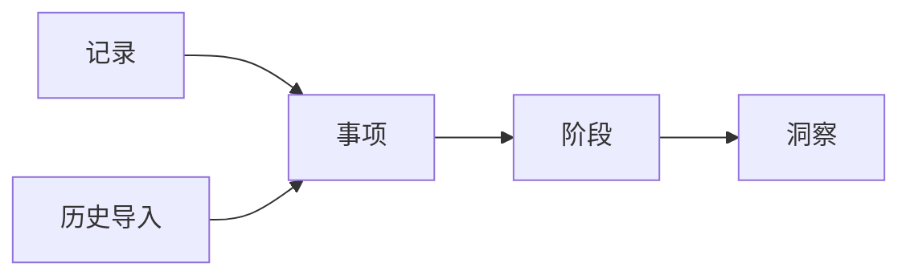
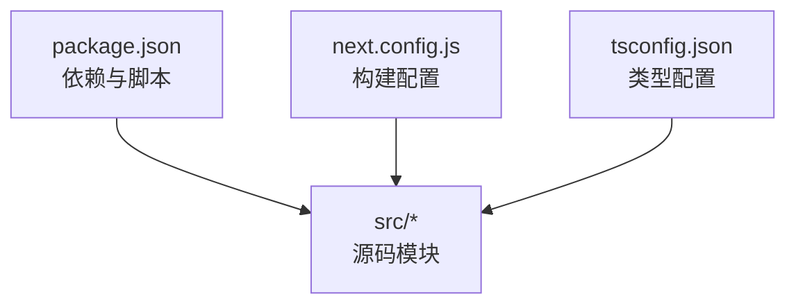

# 开发流程规范

<cite>
**本文引用的文件**
- [README.md](file://README.md)
- [package.json](file://package.json)
- [DATA_RULES.md](file://DATA_RULES.md)
- [docs/00-总控/TETO 项目总计划书（终极总纲版 ／ Ultimate Final）.md](file://docs/00-总控/TETO 项目总计划书（终极总纲版 ／ Ultimate Final）.md)
- [docs/01-生效版本/TETO 1.4/TETO 1.4 开发规则.md](file://docs/01-生效版本/TETO 1.4/TETO 1.4 开发规则.md)
- [docs/10-版本归档/TETO 1.0.0/《给 Trae 的开发任务清单（正式版）》.md](file://docs/10-版本归档/TETO 1.0.0/《给 Trae 的开发任务清单（正式版）》.md)
- [docs/10-版本归档/TETO 1.0.0/现在到开发的正确顺序.md](file://docs/10-版本归档/TETO 1.0.0/现在到开发的正确顺序.md)
- [test/scripts/test-api-performance.js](file://test/scripts/test-api-performance.js)
- [next.config.js](file://next.config.js)
- [tsconfig.json](file://tsconfig.json)
- [src/app/page.tsx](file://src/app/page.tsx)
- [src/app/layout.tsx](file://src/app/layout.tsx)
- [src/components/ui/use-toast.tsx](file://src/components/ui/use-toast.tsx)
</cite>

## 目录
1. [简介](#简介)
2. [项目结构](#项目结构)
3. [核心组件](#核心组件)
4. [架构总览](#架构总览)
5. [详细组件分析](#详细组件分析)
6. [依赖分析](#依赖分析)
7. [性能考量](#性能考量)
8. [故障排查指南](#故障排查指南)
9. [结论](#结论)
10. [附录](#附录)

## 简介
本规范面向 TETO 项目团队，系统化定义从需求分析、任务分配、开发周期与里程碑管理，到功能开发、代码提交与分支管理、合并请求流程、开发环境搭建与本地调试、性能测试、版本发布与回滚、生产部署、团队协作与知识分享、风险与质量保障及问题追踪的全流程。文档以项目现有文档与代码为依据，结合 1.4 版本开发规则与 1.0 任务清单，形成可落地的实践指南。

## 项目结构
TETO 采用 Next.js App Router 的前端工程，配合 Supabase 提供认证与数据库服务，使用 TypeScript 与 Tailwind CSS 构建界面。项目包含文档、SQL 脚本、测试脚本与前端源码等模块。

**图示来源**
- [package.json:1-44](file://package.json#L1-L44)
- [next.config.js:1-4](file://next.config.js#L1-L4)
- [tsconfig.json:1-42](file://tsconfig.json#L1-L42)

**章节来源**
- [README.md:1-126](file://README.md#L1-L126)
- [package.json:1-44](file://package.json#L1-L44)
- [tsconfig.json:1-42](file://tsconfig.json#L1-L42)

## 核心组件
- 需求与规则制定：以“总控计划书”与“生效版本规则”为依据，明确阶段目标、范围边界、对象关系与验收标准。
- 任务拆解与执行：以“开发任务清单”为执行载体，按阶段与页面拆分任务，限定每次交付范围。
- 数据与规则：以“数据规则文档”为准绳，统一记录、任务、统计口径与计算逻辑。
- 前端页面与路由：以 App Router 为基础，页面职责清晰，统一布局与错误提示。
- 基础设施：Supabase 认证与数据库、环境变量、构建配置与类型约束。

**章节来源**
- [docs/00-总控/TETO 项目总计划书（终极总纲版 ／ Ultimate Final）.md:1-800](file://docs/00-总控/TETO 项目总计划书（终极总纲版 ／ Ultimate Final）.md#L1-L800)
- [docs/01-生效版本/TETO 1.4/TETO 1.4 开发规则.md:1-800](file://docs/01-生效版本/TETO 1.4/TETO 1.4 开发规则.md#L1-L800)
- [DATA_RULES.md:1-174](file://DATA_RULES.md#L1-L174)
- [src/app/layout.tsx:1-13](file://src/app/layout.tsx#L1-L13)
- [src/components/ui/use-toast.tsx:1-69](file://src/components/ui/use-toast.tsx#L1-L69)

## 架构总览
TETO 采用“前端页面 + API 路由 + Supabase 数据库”的三层结构。页面通过 App Router 组织，API 路由提供数据接口，数据库通过 RLS 保障数据隔离。开发阶段以 1.4 规则为边界，确保“记录—事项—洞察”骨架稳定，逐步深化“阶段”与“历史导入”。

**图示来源**
- [src/app/page.tsx:1-5](file://src/app/page.tsx#L1-L5)
- [src/app/layout.tsx:1-13](file://src/app/layout.tsx#L1-L13)
- [src/components/ui/use-toast.tsx:1-69](file://src/components/ui/use-toast.tsx#L1-L69)
- [README.md:92-126](file://README.md#L92-L126)

**章节来源**
- [README.md:13-126](file://README.md#L13-L126)
- [docs/01-生效版本/TETO 1.4/TETO 1.4 开发规则.md:31-800](file://docs/01-生效版本/TETO 1.4/TETO 1.4 开发规则.md#L31-L800)

## 详细组件分析

### 需求分析与任务分配机制
- 阶段规则：以“当前生效开发阶段”为依据，明确主阶段、任务类型、规则与清单文档，禁止跨阶段推进。
- 对象与边界：明确记录、事项、阶段、历史导入的定义与关系，避免结构过重与规则过死。
- 任务拆解：将页面职责、数据模型与开发顺序固化为“开发任务清单”，每次仅完成一个边界清晰的小任务。
- 验收标准：以“真实可验证”为唯一标准，确保页面、数据与链路闭环真实可用。

**图示来源**
- [docs/01-生效版本/TETO 1.4/TETO 1.4 开发规则.md:31-120](file://docs/01-生效版本/TETO 1.4/TETO 1.4 开发规则.md#L31-L120)
- [docs/10-版本归档/TETO 1.0.0/《给 Trae 的开发任务清单（正式版）》.md:107-1176](file://docs/10-版本归档/TETO 1.0.0/《给 Trae 的开发任务清单（正式版）》.md#L107-L1176)

**章节来源**
- [docs/01-生效版本/TETO 1.4/TETO 1.4 开发规则.md:31-180](file://docs/01-生效版本/TETO 1.4/TETO 1.4 开发规则.md#L31-L180)
- [docs/10-版本归档/TETO 1.0.0/《给 Trae 的开发任务清单（正式版）》.md:73-1176](file://docs/10-版本归档/TETO 1.0.0/《给 Trae 的开发任务清单（正式版）》.md#L73-L1176)

### 开发周期与里程碑管理
- 阶段推进：严格按“锁定语义定义—锁定页面职责—锁定最小数据模型—跑通事项—跑通历史—深化洞察”的顺序推进。
- 里程碑节点：以“页面层/数据层/链路层”三类验收标准为里程碑标志，确保每个阶段真实可用。
- 风险控制：明确禁止事项与坏结果，避免结构过重、输入成本过高、历史孤岛等问题。

**图示来源**
- [docs/01-生效版本/TETO 1.4/TETO 1.4 开发规则.md:591-760](file://docs/01-生效版本/TETO 1.4/TETO 1.4 开发规则.md#L591-L760)

**章节来源**
- [docs/01-生效版本/TETO 1.4/TETO 1.4 开发规则.md:591-760](file://docs/01-生效版本/TETO 1.4/TETO 1.4 开发规则.md#L591-L760)

### 功能开发流程
- 页面职责：记录页、事项页、洞察页职责清晰，历史导入作为独立流程而非一级导航。
- 数据模型：以“记录—事项—阶段—洞察”的理解顺序组织数据，确保输入轻、连续性强。
- 开发顺序：先跑通“事项—阶段”闭环，再跑通“历史导入”闭环，最后深化“洞察”。

**图示来源**
- [docs/01-生效版本/TETO 1.4/TETO 1.4 开发规则.md:358-485](file://docs/01-生效版本/TETO 1.4/TETO 1.4 开发规则.md#L358-L485)

**章节来源**
- [docs/01-生效版本/TETO 1.4/TETO 1.4 开发规则.md:385-485](file://docs/01-生效版本/TETO 1.4/TETO 1.4 开发规则.md#L385-L485)

### 代码提交规范与分支管理策略
- 分支策略：以“主干稳定 + 功能分支 + 合并请求”为主，确保每次变更聚焦且可追溯。
- 提交规范：每次提交仅覆盖一个明确任务块，避免无关模块修改与过度重构。
- 合并要求：变更需通过页面/数据/链路三层验收，方可合并至主干。

**章节来源**
- [docs/01-生效版本/TETO 1.4/TETO 1.4 开发规则.md:576-588](file://docs/01-生效版本/TETO 1.4/TETO 1.4 开发规则.md#L576-L588)

### 合并请求流程
- PR 要求：每次 PR 仅包含一个边界清晰的功能块，附带验收说明与文件变更清单。
- 审查重点：页面可用性、数据一致性、链路完整性与规则遵循性。
- 合并条件：通过验收标准，且不偏离当前阶段边界。

**章节来源**
- [docs/10-版本归档/TETO 1.0.0/《给 Trae 的开发任务清单（正式版）》.md:73-1176](file://docs/10-版本归档/TETO 1.0.0/《给 Trae 的开发任务清单（正式版）》.md#L73-L1176)

### 开发环境搭建与本地调试
- 依赖安装与启动：使用项目提供的脚本与环境变量配置，完成 Supabase 初始化与数据库脚本执行。
- 构建检查：发布前执行构建检查，确保产物可用。
- 调试入口：首页重定向至记录页，统一布局与错误提示组件便于调试。

**章节来源**
- [README.md:22-53](file://README.md#L22-L53)
- [src/app/page.tsx:1-5](file://src/app/page.tsx#L1-L5)
- [src/app/layout.tsx:1-13](file://src/app/layout.tsx#L1-L13)
- [src/components/ui/use-toast.tsx:1-69](file://src/components/ui/use-toast.tsx#L1-L69)

### 性能测试流程
- 测试脚本：提供 API 性能测试脚本，对关键页面 API 进行多次采样并计算平均与最慢耗时。
- 响应阈值：对超过阈值的响应进行告警提示，便于定位性能瓶颈。

**章节来源**
- [test/scripts/test-api-performance.js:1-82](file://test/scripts/test-api-performance.js#L1-L82)

### 版本发布与回滚
- 发布前准备：确保本地构建通过、代码推送至远端、数据库脚本已执行。
- 部署步骤：在 Vercel 上导入项目，配置环境变量并部署。
- 回滚机制：以“可追溯的版本与数据库脚本”为基础，回滚时按版本归档文档回溯并执行对应 SQL。

**章节来源**
- [README.md:92-126](file://README.md#L92-L126)
- [docs/10-版本归档/TETO 1.0.0/现在到开发的正确顺序.md:1-208](file://docs/10-版本归档/TETO 1.0.0/现在到开发的正确顺序.md#L1-L208)

### 团队协作规范、沟通机制与知识分享
- 协作原则：一次只推进一个明确任务块，不擅自扩展功能，不偏离阶段边界。
- 沟通机制：以“开发任务清单”与“阶段规则”为沟通依据，避免口头约定。
- 知识分享：以“总控计划书”与“版本规则”为知识基座，定期回顾与沉淀。

**章节来源**
- [docs/01-生效版本/TETO 1.4/TETO 1.4 开发规则.md:576-588](file://docs/01-生效版本/TETO 1.4/TETO 1.4 开发规则.md#L576-L588)
- [docs/00-总控/TETO 项目总计划书（终极总纲版 ／ Ultimate Final）.md:1-800](file://docs/00-总控/TETO 项目总计划书（终极总纲版 ／ Ultimate Final）.md#L1-L800)

### 风险管理、质量保证与问题追踪
- 风险控制：明确禁止事项与坏结果，确保结构稳定、输入轻、历史不孤岛。
- 质量保证：以“真实可验证”为唯一标准，覆盖页面、数据与链路三层。
- 问题追踪：统一错误提示组件与日志输出，结合性能测试脚本定位问题。

**章节来源**
- [docs/01-生效版本/TETO 1.4/TETO 1.4 开发规则.md:669-760](file://docs/01-生效版本/TETO 1.4/TETO 1.4 开发规则.md#L669-L760)
- [src/components/ui/use-toast.tsx:1-69](file://src/components/ui/use-toast.tsx#L1-L69)

## 依赖分析
- 前端依赖：Next.js、React、Tailwind CSS、Recharts、date-fns、Supabase 等。
- 构建与类型：Next.js 构建配置与 TypeScript 路径别名，确保模块化与类型安全。
- 运行时配置：允许开发源地址白名单，便于本地联调。

**图示来源**
- [package.json:1-44](file://package.json#L1-L44)
- [next.config.js:1-4](file://next.config.js#L1-L4)
- [tsconfig.json:1-42](file://tsconfig.json#L1-L42)

**章节来源**
- [package.json:1-44](file://package.json#L1-L44)
- [next.config.js:1-4](file://next.config.js#L1-L4)
- [tsconfig.json:1-42](file://tsconfig.json#L1-L42)

## 性能考量
- API 性能：通过测试脚本对关键 API 进行采样，关注平均与最慢响应时间，及时发现异常。
- 页面与数据：以“记录—事项—洞察”为主线，避免过度抽象与复杂计算，确保输入轻、链路短。
- 部署与监控：结合 Vercel 部署与数据库脚本，确保线上性能与稳定性。

**章节来源**
- [test/scripts/test-api-performance.js:1-82](file://test/scripts/test-api-performance.js#L1-L82)
- [docs/01-生效版本/TETO 1.4/TETO 1.4 开发规则.md:648-666](file://docs/01-生效版本/TETO 1.4/TETO 1.4 开发规则.md#L648-L666)

## 故障排查指南
- 统一错误提示：使用统一的 Toast 组件，集中展示错误消息并支持手动关闭。
- 页面重定向：首页重定向至记录页，便于快速定位入口问题。
- 构建与类型：检查 TypeScript 配置与路径别名，确保类型检查通过。

**章节来源**
- [src/components/ui/use-toast.tsx:1-69](file://src/components/ui/use-toast.tsx#L1-L69)
- [src/app/page.tsx:1-5](file://src/app/page.tsx#L1-L5)
- [tsconfig.json:1-42](file://tsconfig.json#L1-L42)

## 结论
本规范以“总控计划书”“阶段规则”“开发任务清单”“数据规则”为依据，结合前端工程现状，建立了覆盖需求、开发、测试、发布与运维的全流程规范。通过严格的阶段边界、任务拆解与验收标准，确保 TETO 在 1.4 阶段稳定推进“记录—事项—洞察”骨架，并逐步深化“阶段”与“历史导入”能力，最终形成连续人生现实的理解系统。

## 附录
- 术语说明：记录、事项、阶段、洞察、历史导入、真实可验证。
- 参考文档：总控计划书、1.4 开发规则、1.0 任务清单、数据规则文档。