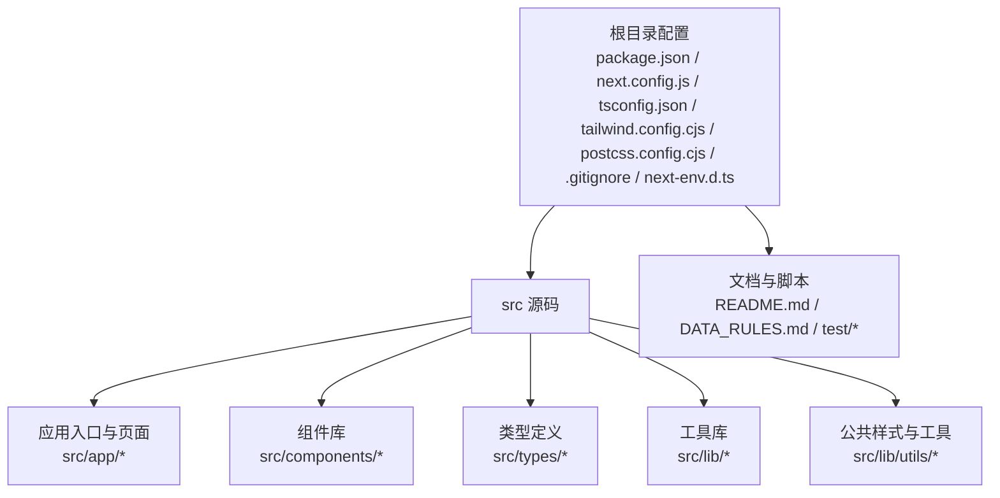
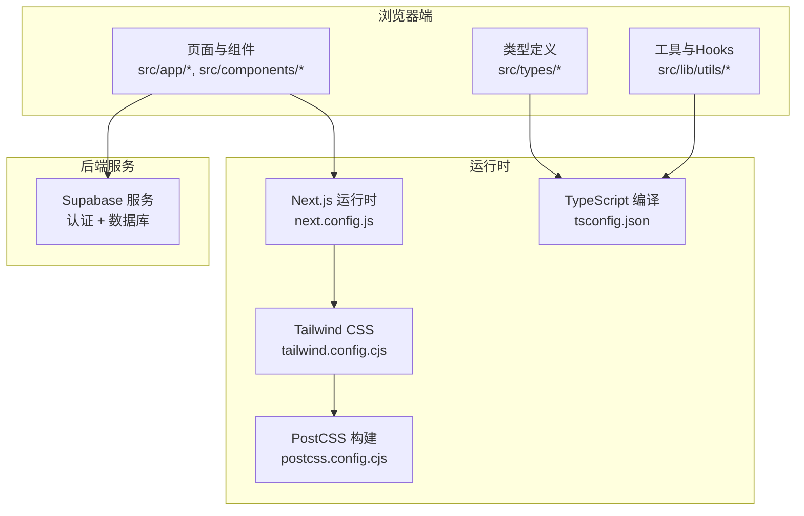
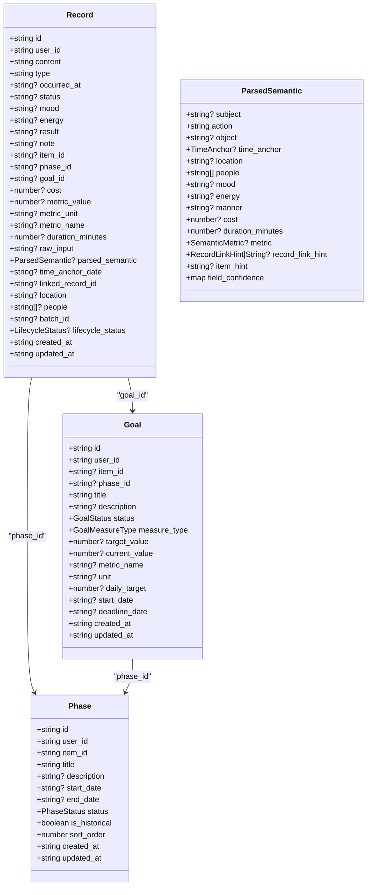
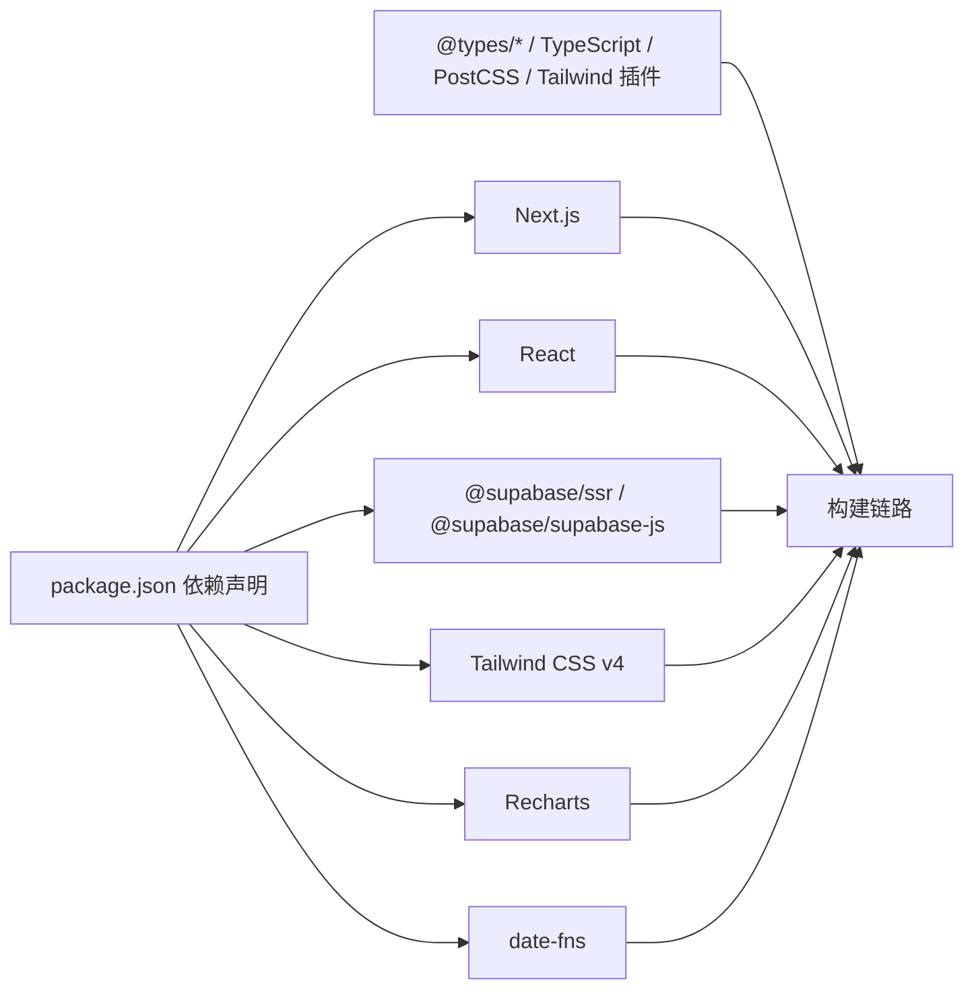
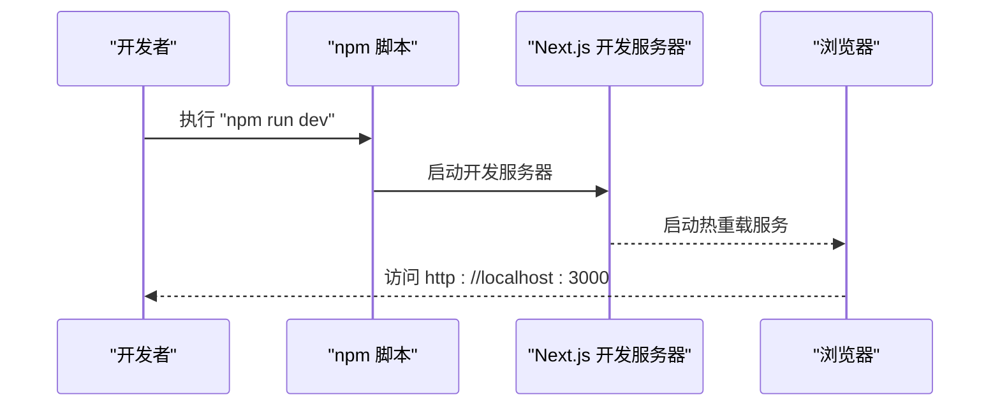
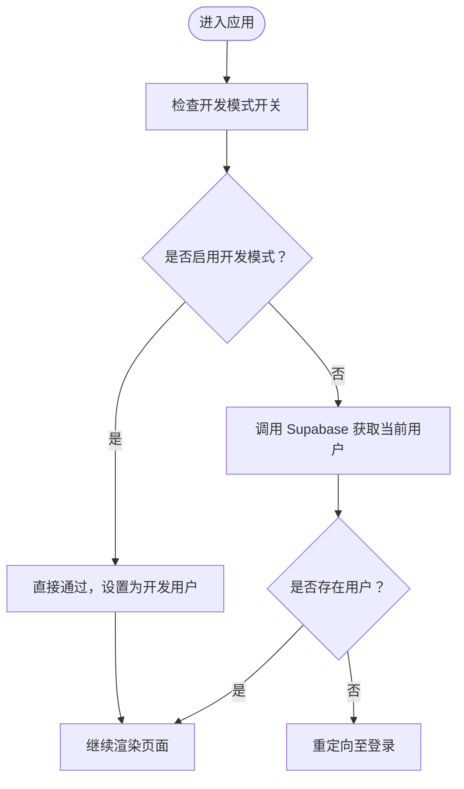

# 开发环境搭建

<cite>
**本文引用的文件**
- [package.json](file://package.json)
- [README.md](file://README.md)
- [next.config.js](file://next.config.js)
- [tsconfig.json](file://tsconfig.json)
- [tailwind.config.cjs](file://tailwind.config.cjs)
- [postcss.config.cjs](file://postcss.config.cjs)
- [.gitignore](file://.gitignore)
- [next-env.d.ts](file://next-env.d.ts)
- [src/lib/supabase/client.ts](file://src/lib/supabase/client.ts)
- [src/lib/auth/get-current-user-id.ts](file://src/lib/auth/get-current-user-id.ts)
- [src/app/(dashboard)/layout.tsx](file://src/app/(dashboard)/layout.tsx)
- [src/types/teto.ts](file://src/types/teto.ts)
- [src/types/semantic.ts](file://src/types/semantic.ts)
- [DATA_RULES.md](file://DATA_RULES.md)
</cite>

## 目录
1. [简介](#简介)
2. [项目结构](#项目结构)
3. [核心组件](#核心组件)
4. [架构总览](#架构总览)
5. [详细组件分析](#详细组件分析)
6. [依赖分析](#依赖分析)
7. [性能考虑](#性能考虑)
8. [故障排查指南](#故障排查指南)
9. [结论](#结论)
10. [附录](#附录)

## 简介
本文件面向首次参与 TETO 项目的开发者，提供从零搭建开发环境的完整指南。内容覆盖开发环境要求、依赖安装与配置、环境变量设置、本地数据库连接、开发服务器启动、热重载与调试、IDE 配置建议以及代码风格与开发流程优化。文档中的技术细节均以仓库内实际配置文件与源码为依据，确保可操作性与准确性。

## 项目结构
TETO 采用 Next.js App Router 架构，前端为 React + TypeScript，样式使用 Tailwind CSS，数据访问通过 Supabase 客户端库实现。关键目录与文件如下：
- 根目录配置：package.json、next.config.js、tsconfig.json、tailwind.config.cjs、postcss.config.cjs、.gitignore、next-env.d.ts
- 源码根目录：src 下包含应用入口、页面、组件、类型定义、工具库与数据库/认证相关模块
- 文档与脚本：README.md 提供快速上手；DATA_RULES.md 描述数据规则；test 目录包含测试脚本

**章节来源**
- [package.json:1-44](file://package.json#L1-L44)
- [next.config.js:1-4](file://next.config.js#L1-L4)
- [tsconfig.json:1-42](file://tsconfig.json#L1-L42)
- [tailwind.config.cjs:1-61](file://tailwind.config.cjs#L1-L61)
- [postcss.config.cjs:1-5](file://postcss.config.cjs#L1-L5)
- [.gitignore:1-4](file://.gitignore#L1-L4)
- [next-env.d.ts:1-7](file://next-env.d.ts#L1-L7)

## 核心组件
- 包管理与脚本：通过 npm 管理依赖与脚本，提供 dev/build/start/lint 四类命令
- 框架与语言：Next.js 16 App Router、TypeScript、Tailwind CSS
- 数据层：Supabase 客户端库用于浏览器端认证与数据访问
- 样式与构建：Tailwind PostCSS 插件、PostCSS、Autoprefixer、Tailwind v4

**章节来源**
- [package.json:6-11](file://package.json#L6-L11)
- [package.json:15-42](file://package.json#L15-L42)
- [README.md:13-21](file://README.md#L13-L21)

## 架构总览
TETO 的前端架构围绕 Next.js App Router 展开，页面组件通过 Supabase 客户端库访问后端服务。开发时通过 Next.js 的 dev server 实现热重载，TypeScript 提供类型安全保障，Tailwind CSS 负责样式生成。

**图示来源**
- [next.config.js:1-4](file://next.config.js#L1-L4)
- [tsconfig.json:1-42](file://tsconfig.json#L1-L42)
- [tailwind.config.cjs:1-61](file://tailwind.config.cjs#L1-L61)
- [postcss.config.cjs:1-5](file://postcss.config.cjs#L1-L5)
- [src/lib/supabase/client.ts:1-9](file://src/lib/supabase/client.ts#L1-L9)

## 详细组件分析

### 开发环境要求与依赖安装
- Node.js 版本：根据项目配置，Next.js 使用 ES2017 目标与 ESNext 模块解析，建议使用较新的 LTS 版本以获得最佳兼容性
- 包管理器：推荐使用 npm（仓库提供 package.json 与 package-lock.json）
- 依赖安装：执行安装命令后，项目会拉取生产与开发依赖，包括 Next.js、React、Tailwind CSS、Supabase 客户端库等

安装步骤要点
- 安装依赖：使用 npm install
- 初始化数据库：按 README 步骤在 Supabase 控制台执行指定 SQL 脚本
- 配置环境变量：创建 .env.local 并填入 Supabase 项目地址与匿名密钥

**章节来源**
- [package.json:15-42](file://package.json#L15-L42)
- [README.md:24-47](file://README.md#L24-L47)

### 配置文件详解
- next.config.js：允许特定开发主机访问，便于局域网联调
- tsconfig.json：启用严格模式、ESNext 模块解析、路径别名 @/* 指向 src/*，目标 ES2017
- tailwind.config.cjs：声明内容扫描范围与主题色板、圆角、字体族等
- postcss.config.cjs：启用 Tailwind PostCSS 插件
- next-env.d.ts：声明 Next.js 类型，避免手动修改
- .gitignore：忽略 node_modules、.next、.env.local、编译产物等

**章节来源**
- [next.config.js:1-4](file://next.config.js#L1-L4)
- [tsconfig.json:1-42](file://tsconfig.json#L1-L42)
- [tailwind.config.cjs:1-61](file://tailwind.config.cjs#L1-L61)
- [postcss.config.cjs:1-5](file://postcss.config.cjs#L1-L5)
- [next-env.d.ts:1-7](file://next-env.d.ts#L1-L7)
- [.gitignore:1-4](file://.gitignore#L1-L4)

### 环境变量与本地数据库连接
- 必需变量
  - NEXT_PUBLIC_SUPABASE_URL：Supabase 项目 URL
  - NEXT_PUBLIC_SUPABASE_ANON_KEY：Supabase 匿名访问密钥
- 可选变量
  - NEXT_PUBLIC_DEV_MODE：设为 true 可启用开发模式（跳过登录）
  - NEXT_PUBLIC_DEV_USER_ID：开发模式使用的测试用户 ID
- 数据库初始化：在 Supabase 控制台的 SQL Editor 中依次执行指定 SQL 脚本，创建核心表并启用行级安全策略

开发模式流程
- 若开启开发模式，应用会在客户端直接通过 isDevMode 判断，无需登录即可进入
- 非开发模式则通过 Supabase 客户端获取当前用户信息

**章节来源**
- [README.md:54-62](file://README.md#L54-L62)
- [README.md:63-90](file://README.md#L63-L90)
- [src/lib/supabase/client.ts:1-9](file://src/lib/supabase/client.ts#L1-L9)
- [src/lib/auth/get-current-user-id.ts:52-87](file://src/lib/auth/get-current-user-id.ts#L52-L87)
- [src/app/(dashboard)/layout.tsx:12-42](file://src/app/(dashboard)/layout.tsx#L12-L42)

### 开发服务器启动与热重载
- 启动开发服务器：执行 npm run dev，访问 http://localhost:3000
- 热重载：Next.js 默认启用，修改源码后浏览器自动刷新
- 跨设备联调：next.config.js 中配置了允许的开发来源 IP，便于局域网联调

**章节来源**
- [README.md:43-47](file://README.md#L43-L47)
- [next.config.js:2-4](file://next.config.js#L2-L4)

### 调试工具与开发工作流
- 调试：利用浏览器开发者工具与控制台日志定位问题；开发模式下可绕过登录流程
- 构建检查：发布前执行 npm run build，确保类型与打包无误
- 类型安全：tsconfig.json 启用严格模式与增量编译，提升开发体验

**章节来源**
- [package.json:6-11](file://package.json#L6-L11)
- [tsconfig.json:8-18](file://tsconfig.json#L8-L18)

### IDE 配置建议与代码格式化
- VS Code 推荐插件
  - ESLint：与 Next.js 类型声明配合，提供实时错误提示
  - Prettier：统一代码风格
  - Tailwind CSS IntelliSense：提供类名补全与预览
  - TypeScript Importer：自动导入类型与模块
- 代码格式化
  - 使用 Prettier 统一缩进、引号、分号等风格
  - 与 ESLint 集成，提交前自动修复可修复的问题
- 路径别名：tsconfig.json 中 @/* 指向 src/*，IDE 应启用路径映射以获得准确的导入提示

**章节来源**
- [tsconfig.json:24-28](file://tsconfig.json#L24-L28)

### 数据模型与类型系统
- 类型定义：src/types/teto.ts 与 src/types/semantic.ts 提供核心数据结构、枚举、查询参数与 API 响应类型
- 语义解析：包含时间锚点、量化指标、解析结果等类型，支撑记录的自然语言解析与结构化存储
- 数据规则：DATA_RULES.md 明确了任务管理、记录、统计分析等页面职责与计算规则，有助于理解数据流转

**图示来源**
- [src/types/teto.ts:37-74](file://src/types/teto.ts#L37-L74)
- [src/types/teto.ts:316-335](file://src/types/teto.ts#L316-L335)
- [src/types/teto.ts:338-354](file://src/types/teto.ts#L338-L354)
- [src/types/semantic.ts:18-43](file://src/types/semantic.ts#L18-L43)

**章节来源**
- [src/types/teto.ts:1-516](file://src/types/teto.ts#L1-L516)
- [src/types/semantic.ts:1-66](file://src/types/semantic.ts#L1-L66)
- [DATA_RULES.md:1-174](file://DATA_RULES.md#L1-L174)

## 依赖分析
- 运行时依赖
  - Next.js 16 App Router：提供页面路由、SSR/CSR 能力与热重载
  - React 19：UI 渲染与组件生态
  - Supabase 客户端库：浏览器端认证与数据库访问
  - Tailwind CSS v4：原子化样式框架
  - Recharts：图表可视化
  - date-fns：日期处理
- 开发依赖
  - TypeScript、@types/*：类型声明
  - Tailwind PostCSS 插件、PostCSS、Autoprefixer：构建链路
  - Tailwind CSS v4：样式生成

**图示来源**
- [package.json:15-42](file://package.json#L15-L42)

**章节来源**
- [package.json:15-42](file://package.json#L15-L42)

## 性能考虑
- 构建与类型检查
  - 启用增量编译与严格模式，减少类型检查开销
  - 使用路径别名减少模块解析成本
- 样式与资源
  - Tailwind CSS 按需扫描内容文件，避免生成冗余样式
  - 图表组件按需加载，避免首屏阻塞
- 运行时
  - 开发模式下跳过登录校验，缩短首屏等待
  - 合理使用缓存与本地存储（如侧边栏折叠状态）

[本节为通用指导，无需列出章节来源]

## 故障排查指南
- 环境变量缺失
  - 症状：登录失败或无法连接数据库
  - 处理：确认 .env.local 中 NEXT_PUBLIC_SUPABASE_URL 与 NEXT_PUBLIC_SUPABASE_ANON_KEY 已正确配置
- 开发模式异常
  - 症状：非开发模式仍显示未登录
  - 处理：检查 NEXT_PUBLIC_DEV_MODE 与 NEXT_PUBLIC_DEV_USER_ID 是否设置，确认 isDevMode 判断逻辑
- 数据库初始化问题
  - 症状：页面空白或报错
  - 处理：在 Supabase 控制台执行 README 中列出的 SQL 脚本，确保核心表与 RLS 已启用
- 端口占用
  - 症状：无法启动开发服务器
  - 处理：更换端口或关闭占用进程

**章节来源**
- [README.md:29-47](file://README.md#L29-L47)
- [src/lib/supabase/client.ts:1-9](file://src/lib/supabase/client.ts#L1-L9)
- [src/lib/auth/get-current-user-id.ts:52-87](file://src/lib/auth/get-current-user-id.ts#L52-L87)
- [src/app/(dashboard)/layout.tsx:12-42](file://src/app/(dashboard)/layout.tsx#L12-L42)

## 结论
通过以上步骤，开发者可以快速搭建 TETO 的本地开发环境，并基于 Next.js、TypeScript、Tailwind CSS 与 Supabase 的组合高效开展前端开发。建议在团队内统一 IDE 插件与代码风格，结合类型系统与构建配置，持续提升开发效率与代码质量。

[本节为总结性内容，无需列出章节来源]

## 附录

### 开发服务器启动序列

**图示来源**
- [package.json:6-11](file://package.json#L6-L11)
- [README.md:43-47](file://README.md#L43-L47)

### 开发模式流程图

**图示来源**
- [src/app/(dashboard)/layout.tsx:12-42](file://src/app/(dashboard)/layout.tsx#L12-L42)
- [src/lib/auth/get-current-user-id.ts:52-87](file://src/lib/auth/get-current-user-id.ts#L52-L87)