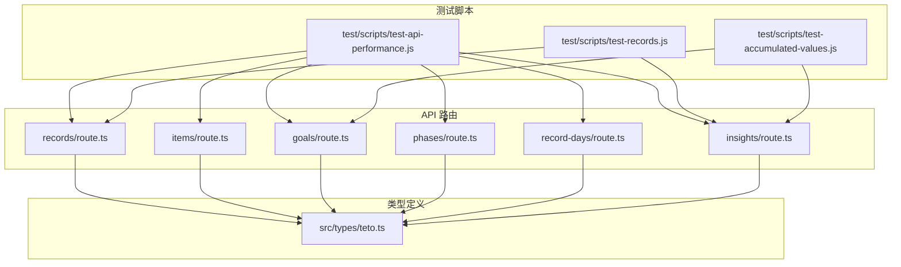
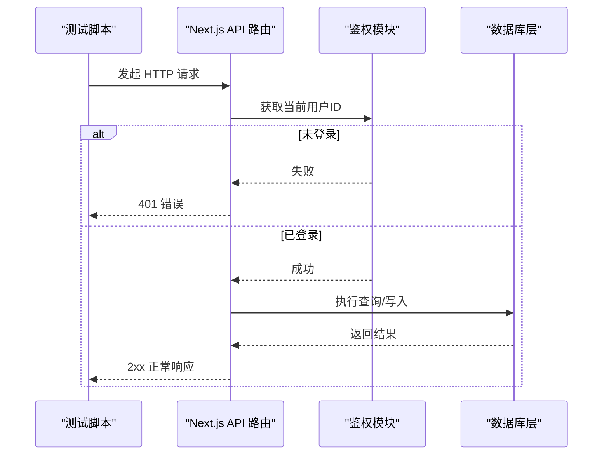
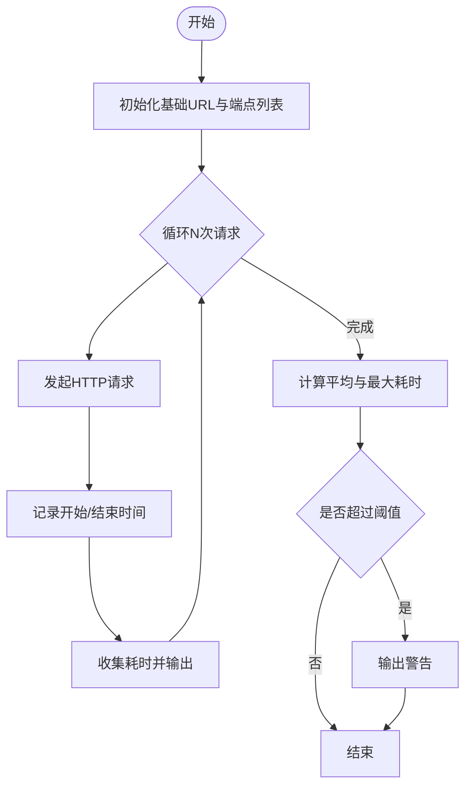
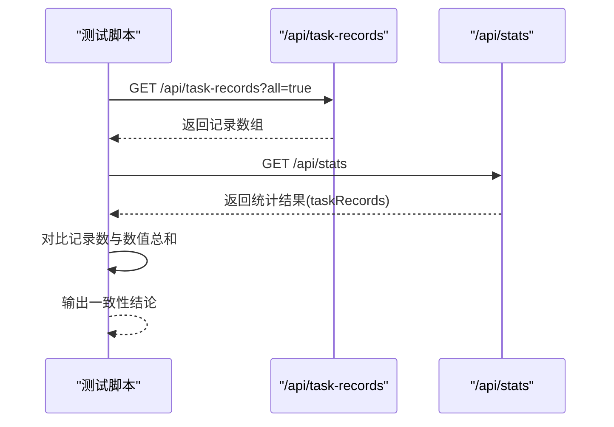
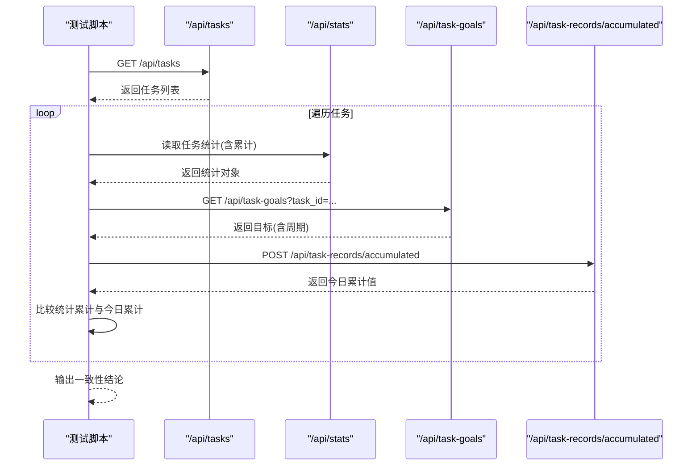
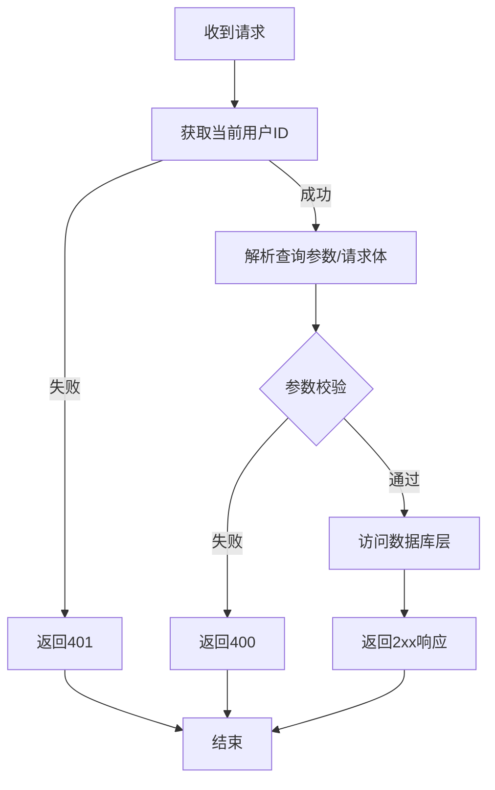
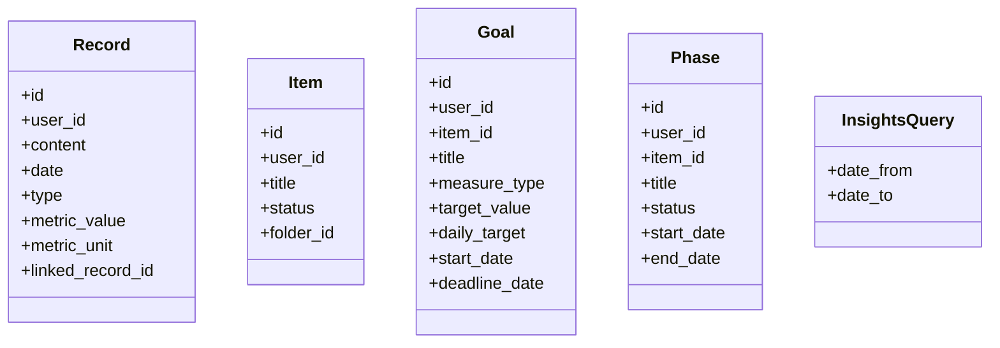
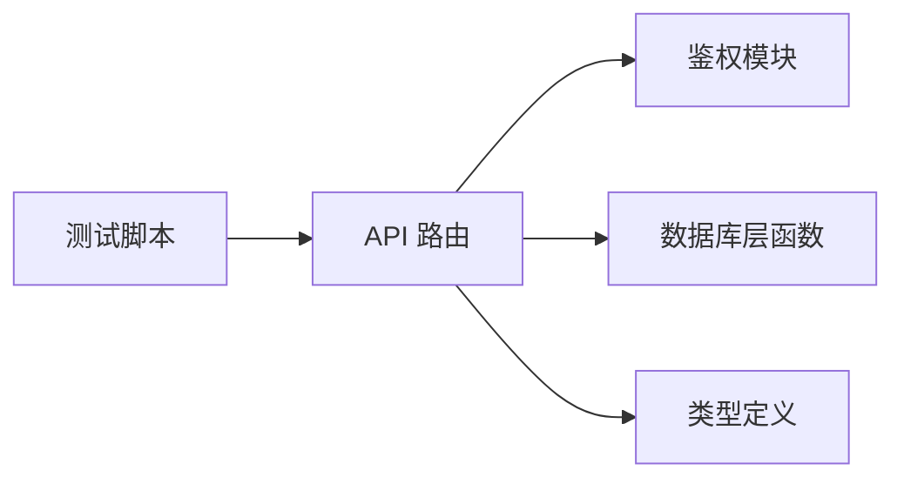

# 测试与验证流程

<cite>
**本文引用的文件**
- [package.json](file://package.json)
- [README.md](file://README.md)
- [test/scripts/test-api-performance.js](file://test/scripts/test-api-performance.js)
- [test/scripts/test-records.js](file://test/scripts/test-records.js)
- [test/scripts/test-accumulated-values.js](file://test/scripts/test-accumulated-values.js)
- [test/api-responses/task_stats_only.json](file://test/api-responses/task_stats_only.json)
- [src/types/teto.ts](file://src/types/teto.ts)
- [src/app/api/v2/records/route.ts](file://src/app/api/v2/records/route.ts)
- [src/app/api/v2/items/route.ts](file://src/app/api/v2/items/route.ts)
- [src/app/api/v2/goals/route.ts](file://src/app/api/v2/goals/route.ts)
- [src/app/api/v2/phases/route.ts](file://src/app/api/v2/phases/route.ts)
- [src/app/api/v2/record-days/route.ts](file://src/app/api/v2/record-days/route.ts)
- [src/app/api/v2/insights/route.ts](file://src/app/api/v2/insights/route.ts)
</cite>

## 目录
1. [引言](#引言)
2. [项目结构](#项目结构)
3. [核心组件](#核心组件)
4. [架构总览](#架构总览)
5. [详细组件分析](#详细组件分析)
6. [依赖分析](#依赖分析)
7. [性能考虑](#性能考虑)
8. [故障排查指南](#故障排查指南)
9. [结论](#结论)
10. [附录](#附录)

## 引言
本文件面向 TETO 1.4 阶段的测试与验证工作，基于现有测试脚本与 API 路由实现，制定覆盖单元、集成与端到端的测试策略，并明确页面层、数据层与链路层的验收标准。同时给出性能测试脚本、API 测试用例与回归测试流程建议，以及缺陷跟踪与质量度量指标的落地方法。

## 项目结构
- 测试相关资源集中在 test 目录，包含性能测试脚本、API 对比测试脚本与示例响应数据。
- API 层采用 Next.js App Router 的 server-side 路由，位于 src/app/api/v2 下，按领域划分（records、items、goals、phases、record-days、insights）。
- 类型定义集中于 src/types/teto.ts，为 API 请求/响应与业务模型提供统一契约。
- package.json 提供开发与运行脚本；README.md 提供环境搭建与部署说明。

**图示来源**
- [test/scripts/test-api-performance.js:1-82](file://test/scripts/test-api-performance.js#L1-L82)
- [test/scripts/test-records.js:1-57](file://test/scripts/test-records.js#L1-L57)
- [test/scripts/test-accumulated-values.js:1-65](file://test/scripts/test-accumulated-values.js#L1-L65)
- [src/app/api/v2/records/route.ts:1-86](file://src/app/api/v2/records/route.ts#L1-L86)
- [src/app/api/v2/items/route.ts:1-47](file://src/app/api/v2/items/route.ts#L1-L47)
- [src/app/api/v2/goals/route.ts:1-49](file://src/app/api/v2/goals/route.ts#L1-L49)
- [src/app/api/v2/phases/route.ts:1-72](file://src/app/api/v2/phases/route.ts#L1-L72)
- [src/app/api/v2/record-days/route.ts:1-63](file://src/app/api/v2/record-days/route.ts#L1-L63)
- [src/app/api/v2/insights/route.ts:1-32](file://src/app/api/v2/insights/route.ts#L1-L32)
- [src/types/teto.ts:1-516](file://src/types/teto.ts#L1-L516)

**章节来源**
- [package.json:1-44](file://package.json#L1-L44)
- [README.md:1-126](file://README.md#L1-L126)

## 核心组件
- 测试脚本集合
  - API 性能测试：对多个页面相关 API 进行多次请求并统计平均与最慢耗时，识别潜在性能瓶颈。
  - 记录数据一致性测试：对比不同端点返回的记录集合与统计结果，确保数据口径一致。
  - 累计值一致性测试：对比统计页与“今日记录”页的累计值计算结果，确保算法一致性。
- API 路由层
  - 统一鉴权：通过服务端工具获取当前用户 ID，未登录返回 401。
  - 参数校验：对必填字段进行校验，缺失则返回 400。
  - 数据访问：调用数据库层函数完成增删改查。
  - 错误处理：捕获异常并返回标准化错误响应。
- 类型定义
  - 统一的请求/响应类型与查询参数类型，保障前后端契约一致。

**章节来源**
- [test/scripts/test-api-performance.js:1-82](file://test/scripts/test-api-performance.js#L1-L82)
- [test/scripts/test-records.js:1-57](file://test/scripts/test-records.js#L1-L57)
- [test/scripts/test-accumulated-values.js:1-65](file://test/scripts/test-accumulated-values.js#L1-L65)
- [src/app/api/v2/records/route.ts:1-86](file://src/app/api/v2/records/route.ts#L1-L86)
- [src/app/api/v2/items/route.ts:1-47](file://src/app/api/v2/items/route.ts#L1-L47)
- [src/app/api/v2/goals/route.ts:1-49](file://src/app/api/v2/goals/route.ts#L1-L49)
- [src/app/api/v2/phases/route.ts:1-72](file://src/app/api/v2/phases/route.ts#L1-L72)
- [src/app/api/v2/record-days/route.ts:1-63](file://src/app/api/v2/record-days/route.ts#L1-L63)
- [src/app/api/v2/insights/route.ts:1-32](file://src/app/api/v2/insights/route.ts#L1-L32)
- [src/types/teto.ts:1-516](file://src/types/teto.ts#L1-L516)

## 架构总览
下图展示测试脚本与 API 路由之间的交互关系，以及错误处理与鉴权流程。

**图示来源**
- [src/app/api/v2/records/route.ts:6-28](file://src/app/api/v2/records/route.ts#L6-L28)
- [src/app/api/v2/items/route.ts:6-25](file://src/app/api/v2/items/route.ts#L6-L25)
- [src/app/api/v2/goals/route.ts:6-28](file://src/app/api/v2/goals/route.ts#L6-L28)
- [src/app/api/v2/phases/route.ts:7-29](file://src/app/api/v2/phases/route.ts#L7-L29)
- [src/app/api/v2/record-days/route.ts:6-36](file://src/app/api/v2/record-days/route.ts#L6-L36)
- [src/app/api/v2/insights/route.ts:6-31](file://src/app/api/v2/insights/route.ts#L6-L31)

## 详细组件分析

### 组件A：API 性能测试脚本
- 目标：评估关键页面 API 的响应时间，识别慢查询与异常。
- 方法：对指定端点重复请求 N 次，计算平均与最大耗时，输出告警阈值。
- 关键端点：记录、任务、项目、统计等页面相关 API。
- 输出：每次请求耗时与最终统计，超过阈值给出警告。

**图示来源**
- [test/scripts/test-api-performance.js:8-79](file://test/scripts/test-api-performance.js#L8-L79)

**章节来源**
- [test/scripts/test-api-performance.js:1-82](file://test/scripts/test-api-performance.js#L1-L82)

### 组件B：记录数据一致性测试
- 目标：验证不同端点返回的记录集合与统计结果在数量与聚合上保持一致。
- 方法：分别请求记录端点与统计端点，提取关键字段进行对比。
- 关注点：记录总数、特定任务的记录数与数值总和。

**图示来源**
- [test/scripts/test-records.js:4-54](file://test/scripts/test-records.js#L4-L54)

**章节来源**
- [test/scripts/test-records.js:1-57](file://test/scripts/test-records.js#L1-L57)

### 组件C：累计值一致性测试
- 目标：确保统计页与“今日记录”页的累计值计算一致。
- 方法：遍历任务列表，获取统计页任务统计与目标值，再调用累计值端点计算今日累计值，进行比对。
- 关注点：目标启用状态、周期参数与计算结果。

**图示来源**
- [test/scripts/test-accumulated-values.js:4-62](file://test/scripts/test-accumulated-values.js#L4-L62)

**章节来源**
- [test/scripts/test-accumulated-values.js:1-65](file://test/scripts/test-accumulated-values.js#L1-L65)

### 组件D：API 路由层（以 records 为例）
- 鉴权：统一从请求上下文获取当前用户 ID，未登录返回 401。
- 查询参数：支持多种筛选条件，转换为查询对象传入数据库层。
- 写入校验：必填字段校验，归属校验（如涉及 item_id）。
- 错误处理：捕获异常并返回标准化错误与状态码。

**图示来源**
- [src/app/api/v2/records/route.ts:7-85](file://src/app/api/v2/records/route.ts#L7-L85)

**章节来源**
- [src/app/api/v2/records/route.ts:1-86](file://src/app/api/v2/records/route.ts#L1-L86)

### 组件E：类型定义与契约
- 统一的请求/响应类型与查询参数类型，确保 API 行为与前端/测试脚本一致。
- 示例：记录、事项、目标、阶段、洞察等核心实体及其操作载荷。

**图示来源**
- [src/types/teto.ts:28-74](file://src/types/teto.ts#L28-L74)
- [src/types/teto.ts:76-94](file://src/types/teto.ts#L76-L94)
- [src/types/teto.ts:316-354](file://src/types/teto.ts#L316-L354)
- [src/types/teto.ts:337-413](file://src/types/teto.ts#L337-L413)
- [src/types/teto.ts:253-256](file://src/types/teto.ts#L253-L256)

**章节来源**
- [src/types/teto.ts:1-516](file://src/types/teto.ts#L1-L516)

## 依赖分析
- 测试脚本依赖 Node.js 与 fetch，直接调用本地开发服务器的 API。
- API 路由依赖鉴权模块与数据库层函数，类型定义为契约。
- 依赖关系清晰，耦合度低，便于扩展与维护。

**图示来源**
- [test/scripts/test-api-performance.js:1-82](file://test/scripts/test-api-performance.js#L1-L82)
- [src/app/api/v2/records/route.ts:1-86](file://src/app/api/v2/records/route.ts#L1-L86)
- [src/types/teto.ts:1-516](file://src/types/teto.ts#L1-L516)

**章节来源**
- [test/scripts/test-api-performance.js:1-82](file://test/scripts/test-api-performance.js#L1-L82)
- [src/app/api/v2/records/route.ts:1-86](file://src/app/api/v2/records/route.ts#L1-L86)
- [src/types/teto.ts:1-516](file://src/types/teto.ts#L1-L516)

## 性能考虑
- 基准阈值：脚本内置阈值用于快速识别异常（例如超过 1000ms/2000ms 的慢请求），建议结合监控系统设置持续基线。
- 并发与缓存：对高频端点可引入缓存与限流策略，避免瞬时高负载。
- 数据库索引：针对常用查询参数建立索引，减少全表扫描。
- 前端优化：分页加载、懒加载与骨架屏提升感知性能。

## 故障排查指南
- 鉴权失败（401）
  - 确认本地开发环境的认证流程与会话状态。
  - 检查环境变量与 Supabase 配置。
- 参数缺失（400）
  - 根据路由中的参数校验逻辑，补齐必填字段。
- 数据不一致
  - 使用记录一致性与累计值一致性测试脚本定位差异来源。
- 性能异常
  - 使用性能测试脚本复现，结合数据库 EXPLAIN 分析慢查询。

**章节来源**
- [src/app/api/v2/records/route.ts:35-41](file://src/app/api/v2/records/route.ts#L35-L41)
- [src/app/api/v2/items/route.ts:33-35](file://src/app/api/v2/items/route.ts#L33-L35)
- [src/app/api/v2/goals/route.ts:35-37](file://src/app/api/v2/goals/route.ts#L35-L37)
- [src/app/api/v2/phases/route.ts:38-43](file://src/app/api/v2/phases/route.ts#L38-L43)
- [src/app/api/v2/record-days/route.ts:44-46](file://src/app/api/v2/record-days/route.ts#L44-L46)
- [src/app/api/v2/insights/route.ts:14-18](file://src/app/api/v2/insights/route.ts#L14-L18)

## 结论
现有测试脚本与 API 路由实现了对关键路径的验证与性能评估。建议在 1.4 阶段进一步完善单元测试框架、端到端测试场景与自动化回归流程，结合缺陷跟踪与质量度量，形成闭环的质量保障体系。

## 附录

### 验收标准定义（1.4 阶段）
- 页面层
  - 页面加载时间：关键页面首屏时间不超过阈值。
  - 交互响应：点击、提交等操作反馈及时，错误提示明确。
- 数据层
  - 记录一致性：不同端点返回的记录数与聚合值一致。
  - 累计值一致性：统计页与“今日记录”页累计值一致。
- 链路层
  - 鉴权：未登录访问受保护端点返回 401。
  - 参数校验：必填参数缺失返回 400。
  - 错误处理：异常捕获与标准化错误响应。

**章节来源**
- [test/scripts/test-records.js:22-26](file://test/scripts/test-records.js#L22-L26)
- [test/scripts/test-accumulated-values.js:50-54](file://test/scripts/test-accumulated-values.js#L50-L54)
- [src/app/api/v2/records/route.ts:35-41](file://src/app/api/v2/records/route.ts#L35-L41)
- [src/app/api/v2/insights/route.ts:14-18](file://src/app/api/v2/insights/route.ts#L14-L18)

### 测试执行流程
- 单元测试（建议）
  - 针对业务函数与工具函数编写单元测试，覆盖边界与异常分支。
- 集成测试（建议）
  - 基于现有 API 路由，模拟多端点组合场景，验证数据流转。
- 端到端测试（建议）
  - 使用浏览器自动化工具模拟真实用户操作，覆盖关键业务流程。

**章节来源**
- [src/app/api/v2/records/route.ts:1-86](file://src/app/api/v2/records/route.ts#L1-L86)
- [src/app/api/v2/items/route.ts:1-47](file://src/app/api/v2/items/route.ts#L1-L47)
- [src/app/api/v2/goals/route.ts:1-49](file://src/app/api/v2/goals/route.ts#L1-L49)
- [src/app/api/v2/phases/route.ts:1-72](file://src/app/api/v2/phases/route.ts#L1-L72)
- [src/app/api/v2/record-days/route.ts:1-63](file://src/app/api/v2/record-days/route.ts#L1-L63)
- [src/app/api/v2/insights/route.ts:1-32](file://src/app/api/v2/insights/route.ts#L1-L32)

### 性能测试脚本与 API 测试用例
- 性能测试脚本
  - [test/scripts/test-api-performance.js:1-82](file://test/scripts/test-api-performance.js#L1-L82)
- API 测试用例
  - 记录数据一致性：[test/scripts/test-records.js:1-57](file://test/scripts/test-records.js#L1-L57)
  - 累计值一致性：[test/scripts/test-accumulated-values.js:1-65](file://test/scripts/test-accumulated-values.js#L1-L65)
- 示例响应数据
  - [test/api-responses/task_stats_only.json:1-268](file://test/api-responses/task_stats_only.json#L1-L268)

**章节来源**
- [test/scripts/test-api-performance.js:1-82](file://test/scripts/test-api-performance.js#L1-L82)
- [test/scripts/test-records.js:1-57](file://test/scripts/test-records.js#L1-L57)
- [test/scripts/test-accumulated-values.js:1-65](file://test/scripts/test-accumulated-values.js#L1-L65)
- [test/api-responses/task_stats_only.json:1-268](file://test/api-responses/task_stats_only.json#L1-L268)

### 回归测试流程
- 触发条件：新增功能、修复缺陷、数据库变更。
- 执行内容：运行性能测试脚本与 API 一致性测试，补充关键路径的端到端测试。
- 报告与跟踪：记录失败用例与回归结果，纳入缺陷跟踪系统。

**章节来源**
- [test/scripts/test-api-performance.js:1-82](file://test/scripts/test-api-performance.js#L1-L82)
- [test/scripts/test-records.js:1-57](file://test/scripts/test-records.js#L1-L57)
- [test/scripts/test-accumulated-values.js:1-65](file://test/scripts/test-accumulated-values.js#L1-L65)

### 缺陷跟踪机制与质量度量
- 缺陷跟踪
  - 使用 Issue 系统记录缺陷，明确严重级别、重现步骤与预期结果。
- 质量度量
  - 覆盖率：单元测试与端到端测试覆盖率目标。
  - 性能：P95/P99 响应时间、错误率、吞吐量。
  - 可靠性：故障恢复时间、重试成功率。

**章节来源**
- [README.md:22-53](file://README.md#L22-L53)