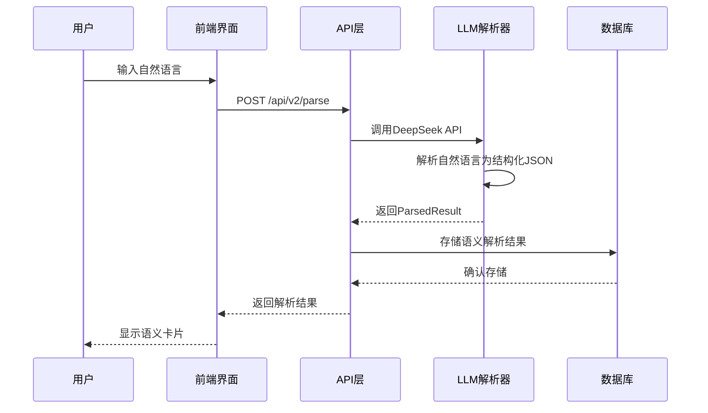
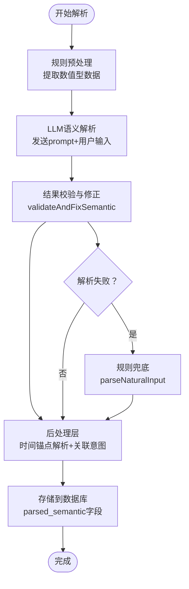
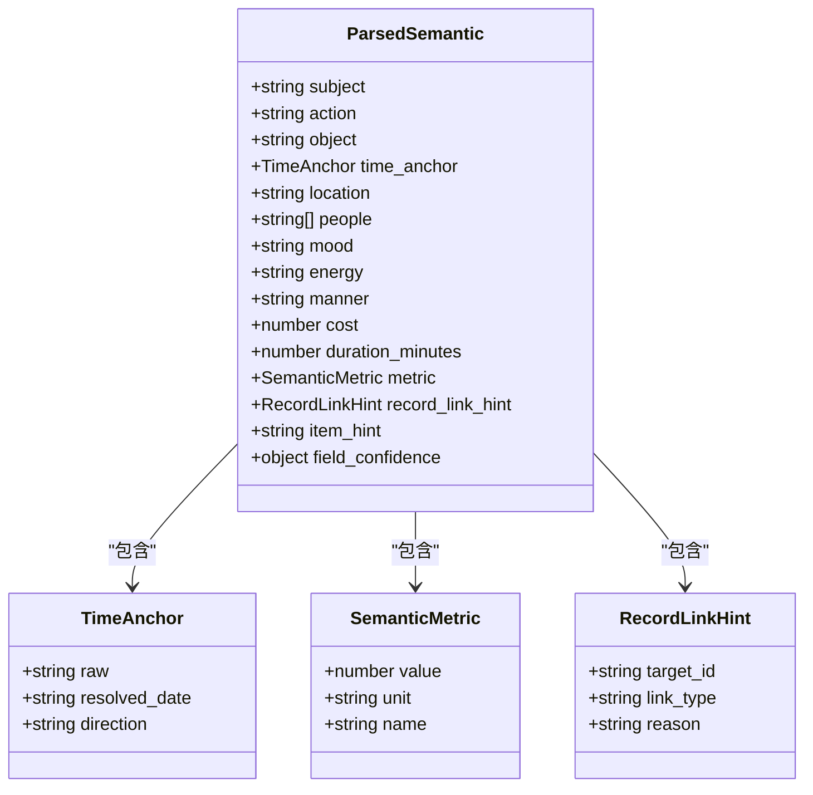
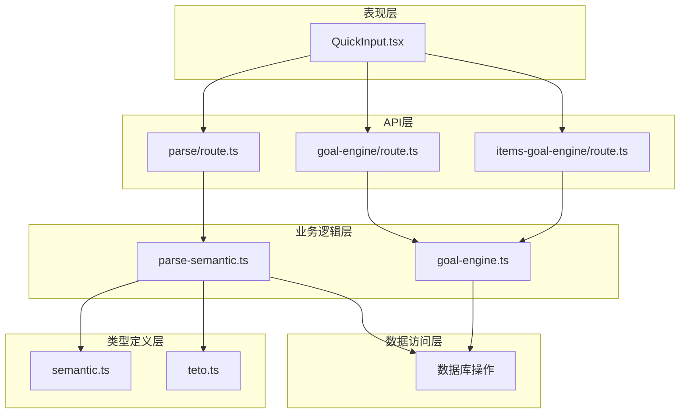

# 语义引擎底层结构（P0 + P3）

<cite>
**本文档引用的文件**
- [语义引擎底层结构（P0 + P3）.md](file://docs/01-生效版本/TETO 1.4/TET O1.4新相关内容/TETO 1.4/语义引擎底层结构（P0 + P3）.md)
- [人生记录语法引擎（Grammar of Life Engine）.md](file://docs/01-生效版本/TETO 1.4/TET O1.4新相关内容/TETO 1.4/人生记录语法引擎（Grammar of Life Engine）.md)
- [semantic.ts](file://src/types/semantic.ts)
- [teto.ts](file://src/types/teto.ts)
- [parse-semantic.ts](file://src/lib/ai/parse-semantic.ts)
- [parse/route.ts](file://src/app/api/v2/parse/route.ts)
- [QuickInput.tsx](file://src/app/(dashboard)/records/components/QuickInput.tsx)
- [goal-engine.ts](file://src/lib/db/goal-engine.ts)
- [goal-engine/route.ts](file://src/app/api/v2/goals/[id]/engine/route.ts)
- [items-goal-engine/route.ts](file://src/app/api/v2/items/[id]/goal-engine/route.ts)
- [parseNaturalInput.ts](file://src/lib/utils/parseNaturalInput.ts)
</cite>

## 目录
1. [简介](#简介)
2. [项目结构](#项目结构)
3. [核心组件](#核心组件)
4. [架构概览](#架构概览)
5. [详细组件分析](#详细组件分析)
6. [依赖关系分析](#依赖关系分析)
7. [性能考虑](#性能考虑)
8. [故障排除指南](#故障排除指南)
9. [结论](#结论)

## 简介

TETO语义引擎是TETO 1.4版本中的核心创新模块，旨在将传统的"文本+标签"记录方式升级为"结构化断言"的语义解析系统。该引擎采用LLM语义解析与规则兜底相结合的混合架构，实现了从自然语言到结构化数据的智能转换。

本项目重点关注P0（类型定义）和P3（数据库迁移）两个关键阶段，建立了完整的语义解析底层结构，为后续的记录回溯关联、事项模糊匹配和量化目标引擎奠定了坚实基础。

## 项目结构

语义引擎的项目结构遵循TypeScript + Next.js的标准架构，主要分布在以下几个核心目录：

```mermaid
graph TB
subgraph "类型定义层"
A[src/types/semantic.ts]
B[src/types/teto.ts]
end
subgraph "AI解析层"
C[src/lib/ai/parse-semantic.ts]
D[src/app/api/v2/parse/route.ts]
end
subgraph "前端集成层"
E[src/app/(dashboard)/records/components/QuickInput.tsx]
end
subgraph "数据库层"
F[src/lib/db/goal-engine.ts]
G[src/app/api/v2/goals/[id]/engine/route.ts]
H[src/app/api/v2/items/[id]/goal-engine/route.ts]
end
A --> C
B --> C
C --> D
D --> E
C --> F
F --> G
F --> H
```

**图表来源**
- [semantic.ts:1-66](file://src/types/semantic.ts#L1-L66)
- [teto.ts:1-525](file://src/types/teto.ts#L1-L525)
- [parse-semantic.ts:1-282](file://src/lib/ai/parse-semantic.ts#L1-L282)
- [parse/route.ts:1-43](file://src/app/api/v2/parse/route.ts#L1-L43)

**章节来源**
- [语义引擎底层结构（P0 + P3）.md:9-70](file://docs/01-生效版本/TETO 1.4/TET O1.4新相关内容/TETO 1.4/语义引擎底层结构（P0 + P3）.md#L9-L70)
- [semantic.ts:1-66](file://src/types/semantic.ts#L1-L66)

## 核心组件

### 语义解析类型系统

语义引擎的核心是建立在严格的类型定义之上的，主要包括以下关键接口：

#### ParsedSemantic - 单条记录的语法结构
- **核心断言**：subject（主语）、action（谓语/动作）、object（宾语）
- **上下文修饰**：time_anchor（时间锚点）、location（地点）、people（关系人）、mood（心情）、energy（能量状态）、manner（方式状语）
- **量化数据**：cost（花费）、duration_minutes（时长）、metric（量化指标）
- **关联意图**：record_link_hint（记录关联建议）、item_hint（事项建议）
- **置信度分级**：field_confidence（字段置信度）

#### ParsedResult - 复合句解析结果
- **is_compound**：是否为复合句
- **units**：拆分后的语义单元数组
- **relations**：单元间关系描述
- **confidence**：整句置信度（0-1）

**章节来源**
- [semantic.ts:17-65](file://src/types/semantic.ts#L17-L65)

### 数据模型扩展

为了支持语义解析功能，数据库记录表进行了重要扩展：

#### Record表新增字段
- **parsed_semantic**：存储ParsedSemantic的完整JSON
- **time_anchor_date**：时间锚点解析后的目标日期
- **linked_record_id**：记录间关联（如"上周考试90分"关联到上周记录）
- **location**：地点信息
- **people**：关系人数组

**章节来源**
- [teto.ts:37-74](file://src/types/teto.ts#L37-L74)

## 架构概览

语义引擎采用双轨管道架构，结合LLM智能解析和规则兜底策略：



**图表来源**
- [parse/route.ts:12-30](file://src/app/api/v2/parse/route.ts#L12-L30)
- [parse-semantic.ts:209-281](file://src/lib/ai/parse-semantic.ts#L209-L281)

### 解析流程



**图表来源**
- [parse-semantic.ts:148-191](file://src/lib/ai/parse-semantic.ts#L148-L191)
- [parseNaturalInput.ts:399-421](file://src/lib/utils/parseNaturalInput.ts#L399-L421)

**章节来源**
- [人生记录语法引擎（Grammar of Life Engine）.md:69-88](file://docs/01-生效版本/TETO 1.4/TET O1.4新相关内容/TETO 1.4/人生记录语法引擎（Grammar of Life Engine）.md#L69-L88)

## 详细组件分析

### LLM语义解析器

#### DeepSeek集成
解析器使用DeepSeek API（兼容OpenAI格式）进行语义解析，具有以下特点：

- **System Prompt工程**：精心设计的指令，要求LLM严格按照JSON Schema输出
- **置信度分级**：对关键字段进行"certain"或"guess"置信度标注
- **复合句处理**：强制拆分多个独立事件，确保每个单元都有独立的type_hint
- **关联意图识别**：基于语义理解而非关键词匹配的记录关联判断

#### 解析结果验证
`validateAndFixSemantic`函数负责解析结果的验证和修正：



**图表来源**
- [semantic.ts:3-50](file://src/types/semantic.ts#L3-L50)

**章节来源**
- [parse-semantic.ts:13-89](file://src/lib/ai/parse-semantic.ts#L13-L89)
- [parse-semantic.ts:148-191](file://src/lib/ai/parse-semantic.ts#L148-L191)

### API接口设计

#### /api/v2/parse - 语义解析接口
该接口提供完整的语义解析服务：

- **请求体**：包含input（用户输入）、date（当前日期）、recent_records（近期记录上下文）、items（事项列表）
- **响应**：ParseSemanticResult，包含ParsedResult和type_hints
- **认证**：需要用户登录验证
- **错误处理**：区分401（未登录）、502（LLM API错误）、500（服务器错误）

#### 量化目标引擎接口
语义引擎为量化目标提供了强大的数据支撑：

- **GET /api/v2/goals/{id}/engine**：返回单个目标的量化引擎计算结果
- **GET /api/v2/items/{id}/goal-engine**：返回事项下所有量化目标的引擎计算结果
- **计算逻辑**：基于Goal配置和Records流水进行碰撞运算

**章节来源**
- [parse/route.ts:12-42](file://src/app/api/v2/parse/route.ts#L12-L42)
- [goal-engine/route.ts:9-34](file://src/app/api/v2/goals/[id]/engine/route.ts#L9-L34)
- [items-goal-engine/route.ts:10-43](file://src/app/api/v2/items/[id]/goal-engine/route.ts#L10-L43)

### 前端集成

#### QuickInput组件改造
前端界面进行了重大升级，从传统的芯片区改造为语义卡片区：

```mermaid
graph LR
subgraph "语义卡片区"
A[主体行<br/>[主语] [动作] [宾语]]
B[上下文行<br/>[时间锚点 → 4/21] [地点：公司] [和：小明]]
C[修饰行<br/>[心情：开心] [能量：高]]
D[数据行<br/>[花费 ¥30] [时长 2h]]
E[关联行<br/>[→ 关联到：上周的"考试"记录] [→ 事项：学习]]
end
subgraph "复合句处理"
F[检测到 2 个事件]
G[事件 1：[吃饭] 发生 → 今天中午]
H[事件 2：[写作业] 计划 → 今天下午]
I[全部提交] [逐条确认] [取消拆分]
end
```

**图表来源**
- [QuickInput.tsx](file://src/app/(dashboard)/records/components/QuickInput.tsx#L312-L536)

**章节来源**
- [QuickInput.tsx](file://src/app/(dashboard)/records/components/QuickInput.tsx#L1-L200)
- [QuickInput.tsx](file://src/app/(dashboard)/records/components/QuickInput.tsx#L312-L536)

## 依赖关系分析

语义引擎的依赖关系体现了清晰的分层架构：



**图表来源**
- [parse-semantic.ts:7-8](file://src/lib/ai/parse-semantic.ts#L7-L8)
- [teto.ts:4-6](file://src/types/teto.ts#L4-L6)

### 关键依赖特性

1. **类型安全**：所有组件都严格遵循TypeScript类型定义
2. **解耦设计**：LLM解析器与前端界面通过API接口解耦
3. **数据一致性**：通过统一的类型定义确保数据传输的一致性
4. **可扩展性**：模块化设计便于后续功能扩展

**章节来源**
- [semantic.ts:1-66](file://src/types/semantic.ts#L1-L66)
- [teto.ts:1-525](file://src/types/teto.ts#L1-L525)

## 性能考虑

### LLM调用优化
- **温度参数**：使用0.1的低温度确保输出稳定性
- **响应格式**：强制JSON输出减少解析开销
- **上下文限制**：近期记录最多30条避免token超限
- **错误重试**：网络异常时提供降级方案

### 数据库查询优化
- **索引策略**：基于item_id、record_day_id、metric_name、metric_unit建立复合索引
- **查询限制**：单次查询最多10000条记录防止内存溢出
- **日期过滤**：通过record_days表进行高效的时间范围查询

### 前端性能优化
- **防抖机制**：输入解析采用300ms防抖减少API调用频率
- **增量更新**：只更新变化的芯片元素
- **缓存策略**：近期记录和事项列表进行本地缓存

## 故障排除指南

### 常见问题及解决方案

#### LLM API错误
**症状**：API返回502错误，提示DeepSeek API错误
**原因**：网络连接问题或API配额限制
**解决方案**：
1. 检查DEEPSEEK_API_KEY环境变量配置
2. 验证网络连接稳定性
3. 查看API使用配额情况

#### 认证失败
**症状**：API返回401错误，提示"请先登录"
**原因**：用户会话过期或认证信息缺失
**解决方案**：
1. 重新登录系统
2. 检查浏览器Cookie设置
3. 清除浏览器缓存后重试

#### 解析结果为空
**症状**：语义解析返回null或空数组
**原因**：输入文本不符合预期格式或LLM解析失败
**解决方案**：
1. 检查输入文本的语法结构
2. 确认是否提供了必要的上下文信息
3. 使用规则兜底功能进行本地解析

#### 数据库连接问题
**症状**：量化目标计算返回null
**原因**：数据库连接失败或权限不足
**解决方案**：
1. 检查Supabase连接配置
2. 验证用户对目标数据的访问权限
3. 确认目标配置的完整性（daily_target、start_date）

**章节来源**
- [parse/route.ts:31-41](file://src/app/api/v2/parse/route.ts#L31-L41)
- [goal-engine.ts:63-65](file://src/lib/db/goal-engine.ts#L63-L65)

## 结论

TETO语义引擎的P0 + P3阶段成功构建了完整的底层结构，实现了从自然语言到结构化数据的智能转换。通过LLM语义解析与规则兜底相结合的混合架构，系统不仅提高了解析准确性，还保持了良好的性能和可扩展性。

### 主要成就

1. **类型系统完善**：建立了完整的ParsedSemantic和ParsedResult类型定义
2. **数据库扩展**：成功迁移记录表，支持语义解析数据存储
3. **API接口标准化**：提供RESTful API接口，便于前后端集成
4. **前端体验提升**：从芯片区升级为语义卡片区，用户体验显著改善
5. **量化目标支持**：为后续的量化目标引擎计算奠定数据基础

### 技术亮点

- **混合解析架构**：LLM智能解析与规则兜底相结合，确保解析质量
- **强类型设计**：完整的TypeScript类型定义保证了代码质量和可维护性
- **模块化架构**：清晰的分层设计便于功能扩展和维护
- **性能优化**：多层面的性能优化确保系统响应速度

### 未来展望

随着语义引擎底层结构的完善，项目将能够支持更复杂的语义解析需求，包括更精确的记录回溯关联、智能的事项匹配和更丰富的量化目标计算。这将为TETO系统的智能化发展提供强有力的技术支撑。