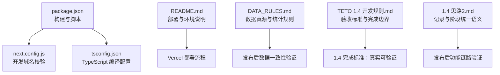
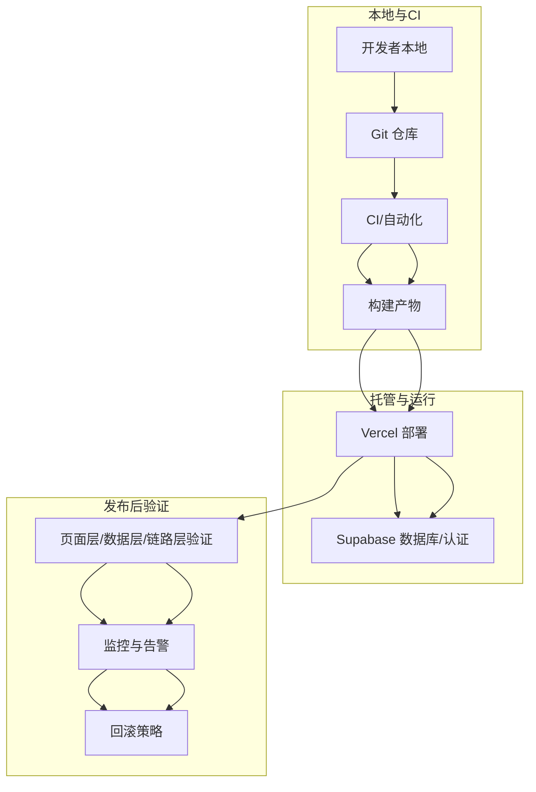
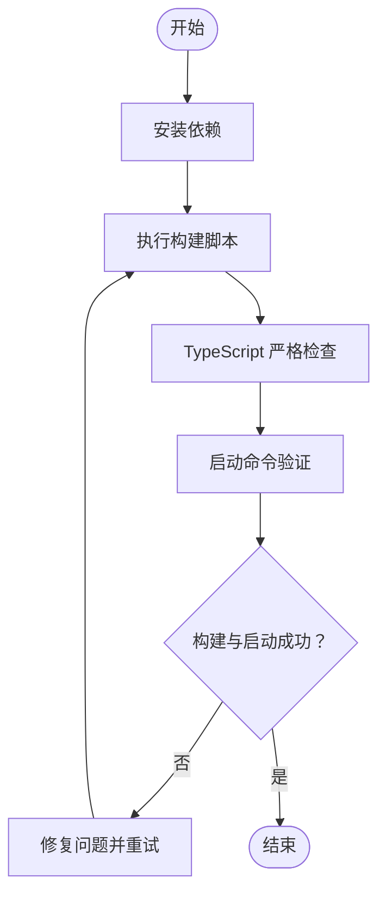
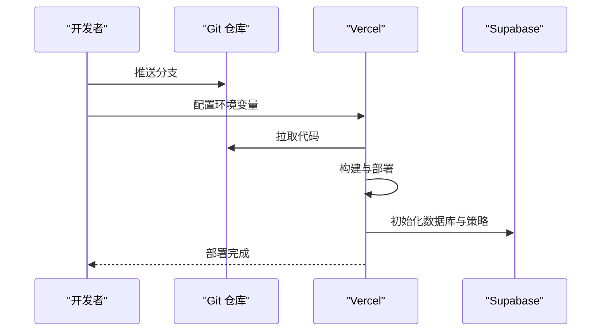
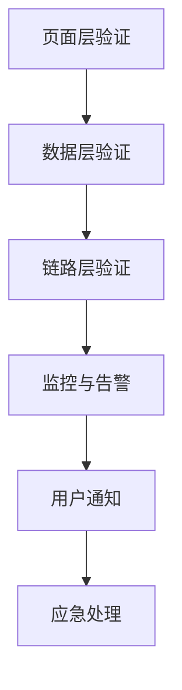
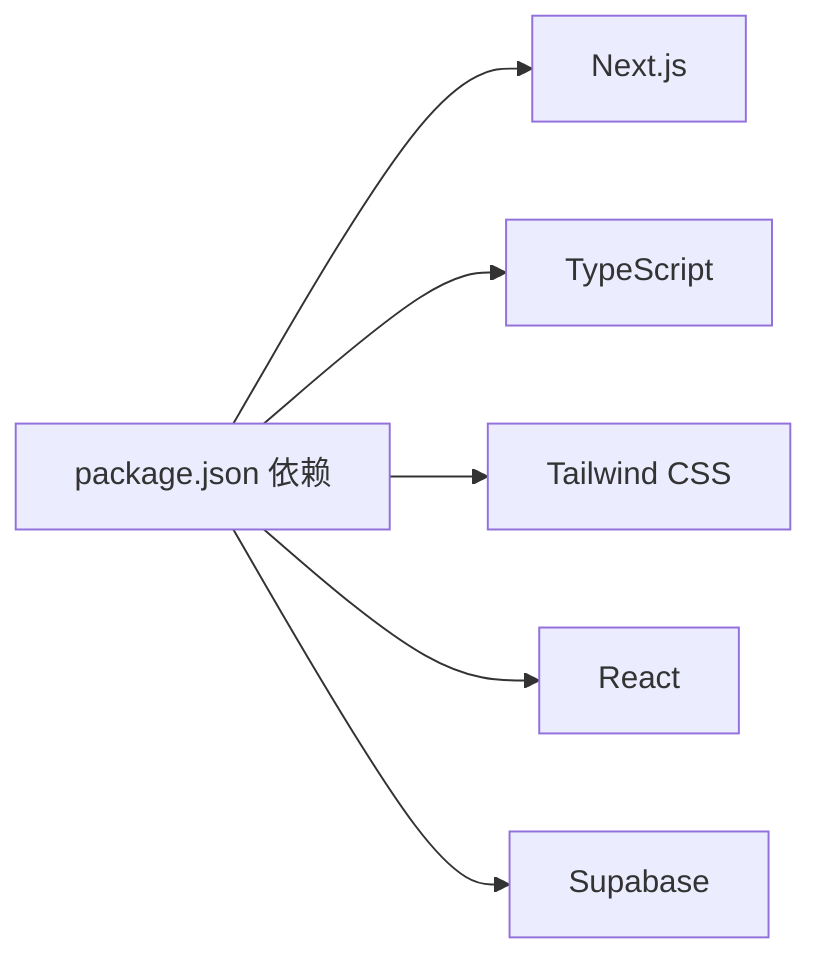

# 部署与发布流程

<cite>
**本文引用的文件**   
- [package.json](file://package.json)
- [next.config.js](file://next.config.js)
- [tsconfig.json](file://tsconfig.json)
- [README.md](file://README.md)
- [DATA_RULES.md](file://DATA_RULES.md)
- [TETO 1.4 开发规则.md](file://docs/01-生效版本/TETO 1.4/TETO 1.4 开发规则.md)
- [1.4 思路2.md](file://docs/01-生效版本/TETO 1.4/1.4 思路2.md)
- [.gitignore](file://.gitignore)
</cite>

## 目录
1. [简介](#简介)
2. [项目结构](#项目结构)
3. [核心组件](#核心组件)
4. [架构总览](#架构总览)
5. [详细组件分析](#详细组件分析)
6. [依赖分析](#依赖分析)
7. [性能考虑](#性能考虑)
8. [故障排查指南](#故障排查指南)
9. [结论](#结论)
10. [附录](#附录)

## 简介
本文件面向 TETO 1.4 阶段的部署与发布，提供从版本号管理、构建流程、部署策略到生产环境配置、回滚机制、监控配置、发布后验证、用户通知与应急处理的完整说明。文档严格遵循 1.4 阶段“真实可验证”的完成标准，确保发布流程可追溯、可审计、可回滚。

## 项目结构
TETO 采用 Next.js App Router + TypeScript + Tailwind CSS + Supabase 的前端技术栈。发布相关的关键文件集中在根目录的构建脚本、运行配置与部署说明中，同时 1.4 阶段规则文档明确了验收标准与完成边界。

**图表来源**
- [package.json:1-44](file://package.json#L1-L44)
- [next.config.js:1-4](file://next.config.js#L1-L4)
- [tsconfig.json:1-42](file://tsconfig.json#L1-L42)
- [README.md:92-126](file://README.md#L92-L126)
- [DATA_RULES.md:1-174](file://DATA_RULES.md#L1-L174)
- [TETO 1.4 开发规则.md:708-760](file://docs/01-生效版本/TETO 1.4/TETO 1.4 开发规则.md#L708-L760)
- [1.4 思路2.md:1-800](file://docs/01-生效版本/TETO 1.4/1.4 思路2.md#L1-L800)

**章节来源**
- [package.json:1-44](file://package.json#L1-L44)
- [next.config.js:1-4](file://next.config.js#L1-L4)
- [tsconfig.json:1-42](file://tsconfig.json#L1-L42)
- [README.md:92-126](file://README.md#L92-L126)
- [DATA_RULES.md:1-174](file://DATA_RULES.md#L1-L174)
- [TETO 1.4 开发规则.md:708-760](file://docs/01-生效版本/TETO 1.4/TETO 1.4 开发规则.md#L708-L760)
- [1.4 思路2.md:1-800](file://docs/01-生效版本/TETO 1.4/1.4 思路2.md#L1-L800)

## 核心组件
- 构建与运行脚本：通过 npm scripts 定义开发、构建、启动与 Lint 检查流程，确保发布前构建检查与产物一致性。
- Next.js 配置：限定开发域名校验，保障本地开发与 CI 环境的安全边界。
- TypeScript 配置：严格类型检查与 bundler 模块解析，保证构建稳定性。
- 部署说明：基于 Vercel 的一键部署流程，明确环境变量与站点 URL 配置。
- 数据规则：定义“数据真源”“统计规则”等，支撑发布后数据一致性验证。
- 1.4 验收标准：以“真实可验证”为核心，提供页面层、数据层、链路层的可验证清单。

**章节来源**
- [package.json:6-11](file://package.json#L6-L11)
- [next.config.js:2-4](file://next.config.js#L2-L4)
- [tsconfig.json:2-29](file://tsconfig.json#L2-L29)
- [README.md:92-126](file://README.md#L92-L126)
- [DATA_RULES.md:3-31](file://DATA_RULES.md#L3-L31)
- [TETO 1.4 开发规则.md:708-760](file://docs/01-生效版本/TETO 1.4/TETO 1.4 开发规则.md#L708-L760)

## 架构总览
发布与部署涉及前端构建、托管平台配置与数据库/认证服务协同。下图展示从代码提交到生产可用的关键节点。

**图表来源**
- [README.md:92-126](file://README.md#L92-L126)
- [package.json:6-11](file://package.json#L6-L11)

## 详细组件分析

### 版本号管理
- 当前项目版本号位于 package.json 中，发布前需根据变更范围进行语义化升级（如 1.3.x → 1.4.0）。
- 建议在发布分支上统一更新版本号，配合标签与变更日志，确保可追溯性。
- 1.4 阶段完成标准强调“真实可验证”，发布即代表功能链路已通过真实数据验证。

**章节来源**
- [package.json:2-4](file://package.json#L2-L4)
- [TETO 1.4 开发规则.md:708-760](file://docs/01-生效版本/TETO 1.4/TETO 1.4 开发规则.md#L708-L760)

### 构建流程
- 本地构建：执行构建脚本，确保产物无错误且可启动。
- 产物校验：构建产物应可通过启动脚本运行，避免运行时异常。
- 类型检查：TypeScript 配置启用严格模式与 bundler 解析，减少运行期隐患。
- 开发域名校验：Next.js 配置限制开发域，降低本地调试风险。

**图表来源**
- [package.json:6-11](file://package.json#L6-L11)
- [tsconfig.json:10-18](file://tsconfig.json#L10-L18)
- [next.config.js:2-4](file://next.config.js#L2-L4)

**章节来源**
- [package.json:6-11](file://package.json#L6-L11)
- [tsconfig.json:10-18](file://tsconfig.json#L10-L18)
- [next.config.js:2-4](file://next.config.js#L2-L4)

### 部署策略与环境配置
- 平台：Vercel（基于 README 的部署说明）。
- 前置条件：本地构建通过、代码推送至远端、Supabase SQL 脚本已执行。
- 环境变量：必需项包括 Supabase URL 与匿名密钥；可选开发模式开关与测试用户 ID。
- 站点 URL：在 Supabase 控制台配置 Vercel 生产域名，确保回调与登录正常。

**图表来源**
- [README.md:92-126](file://README.md#L92-L126)

**章节来源**
- [README.md:92-126](file://README.md#L92-L126)

### 生产环境部署方法
- 使用 GitHub 账号登录 Vercel，导入项目并配置环境变量。
- 部署完成后，在 Supabase 控制台添加生产域名至 URL 配置，验证登录与数据保存。
- 若使用本地 .env.local，请勿提交至仓库，遵循忽略规则。

**章节来源**
- [README.md:92-126](file://README.md#L92-L126)
- [.gitignore:1-4](file://.gitignore#L1-L4)

### 回滚机制
- 版本回滚：在 Vercel 控制台选择历史部署进行回滚，或通过 Git 标签与分支回退。
- 数据回滚：基于 Supabase 的 SQL 存档与备份策略，结合迁移脚本进行数据回退。
- 回滚验证：回滚后执行“页面层/数据层/链路层”验证清单，确保功能与数据一致。

**章节来源**
- [README.md:92-126](file://README.md#L92-L126)
- [DATA_RULES.md:3-31](file://DATA_RULES.md#L3-L31)

### 监控配置
- 建议在 Vercel 中启用健康检查与日志导出。
- 在 Supabase 中配置慢查询与错误告警，结合应用日志进行端到端监控。
- 发布后监控指标：页面加载时间、API 响应时间、数据库连接与查询耗时、登录与数据写入成功率。

**章节来源**
- [README.md:92-126](file://README.md#L92-L126)

### 发布后验证
- 页面层：记录页、事项页、洞察页、历史导入流程均可正常使用。
- 数据层：记录、事项、阶段 CRUD 正常，关系正确可回显。
- 链路层：日常链路、阶段链路、历史链路、洞察链路真实走通。
- 数据真源：统计结果基于任务配置与原始记录统一计算，避免第二真源。

**图表来源**
- [TETO 1.4 开发规则.md:714-758](file://docs/01-生效版本/TETO 1.4/TETO 1.4 开发规则.md#L714-L758)
- [DATA_RULES.md:26-31](file://DATA_RULES.md#L26-L31)

**章节来源**
- [TETO 1.4 开发规则.md:714-758](file://docs/01-生效版本/TETO 1.4/TETO 1.4 开发规则.md#L714-L758)
- [DATA_RULES.md:26-31](file://DATA_RULES.md#L26-L31)

### 用户通知与问题应急处理
- 用户通知：发布后通过站内公告或邮件通知用户版本更新与功能变化。
- 应急处理：建立问题反馈渠道，收集日志与截图，快速定位问题并执行回滚或热修复。

**章节来源**
- [TETO 1.4 开发规则.md:708-760](file://docs/01-生效版本/TETO 1.4/TETO 1.4 开发规则.md#L708-L760)

## 依赖分析
- 构建与运行：Next.js、TypeScript、Tailwind CSS、React 生态。
- 数据与认证：Supabase（PostgreSQL + Auth）。
- 开发工具：Lint、PostCSS、Tailwind 插件。

**图表来源**
- [package.json:15-32](file://package.json#L15-L32)

**章节来源**
- [package.json:15-32](file://package.json#L15-L32)

## 性能考虑
- 构建优化：启用增量编译与严格类型检查，减少构建时间与运行期错误。
- 运行优化：利用 App Router 的路由与资源加载策略，控制首屏与交互延迟。
- 数据层优化：在 Supabase 中合理索引与查询，避免 N+1 查询与大结果集扫描。

**章节来源**
- [tsconfig.json:10-18](file://tsconfig.json#L10-L18)
- [DATA_RULES.md:76-106](file://DATA_RULES.md#L76-L106)

## 故障排查指南
- 构建失败：检查构建脚本与依赖版本，确保本地与 CI 环境一致。
- 登录异常：核对 Supabase URL、匿名密钥与站点 URL 配置。
- 数据不一致：依据数据真源规则，确认统计逻辑与数据来源。
- 验收未通过：对照 1.4 验收标准逐项检查页面、数据与链路。

**章节来源**
- [README.md:92-126](file://README.md#L92-L126)
- [DATA_RULES.md:3-31](file://DATA_RULES.md#L3-L31)
- [TETO 1.4 开发规则.md:708-760](file://docs/01-生效版本/TETO 1.4/TETO 1.4 开发规则.md#L708-L760)

## 结论
TETO 1.4 的发布流程以“真实可验证”为核心，结合严格的构建与部署规范、完善的监控与回滚机制，确保版本交付的稳定性与可追溯性。发布后验证与应急处理流程为用户提供可靠保障，数据真源与统计规则为系统长期演进奠定基础。

## 附录
- 1.4 验收标准要点
  - 页面层：记录页、事项页、洞察页、历史导入流程可用。
  - 数据层：记录、事项、阶段 CRUD 正常，关系正确。
  - 链路层：日常、阶段、历史、洞察链路真实走通。
- 1.4 语义统一
  - 记录作为现实输入入口，阶段是事项内部的时间段概括，历史导入允许两种路径并存。

**章节来源**
- [TETO 1.4 开发规则.md:708-760](file://docs/01-生效版本/TETO 1.4/TETO 1.4 开发规则.md#L708-L760)
- [1.4 思路2.md:497-520](file://docs/01-生效版本/TETO 1.4/1.4 思路2.md#L497-L520)