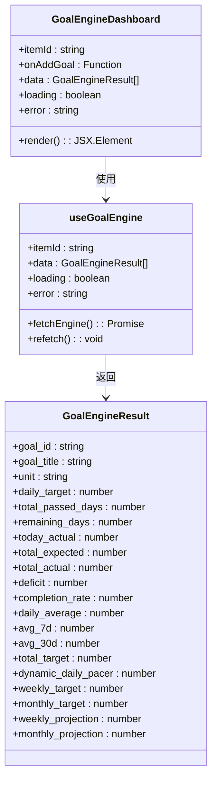
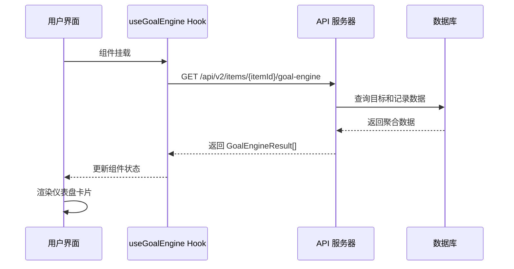
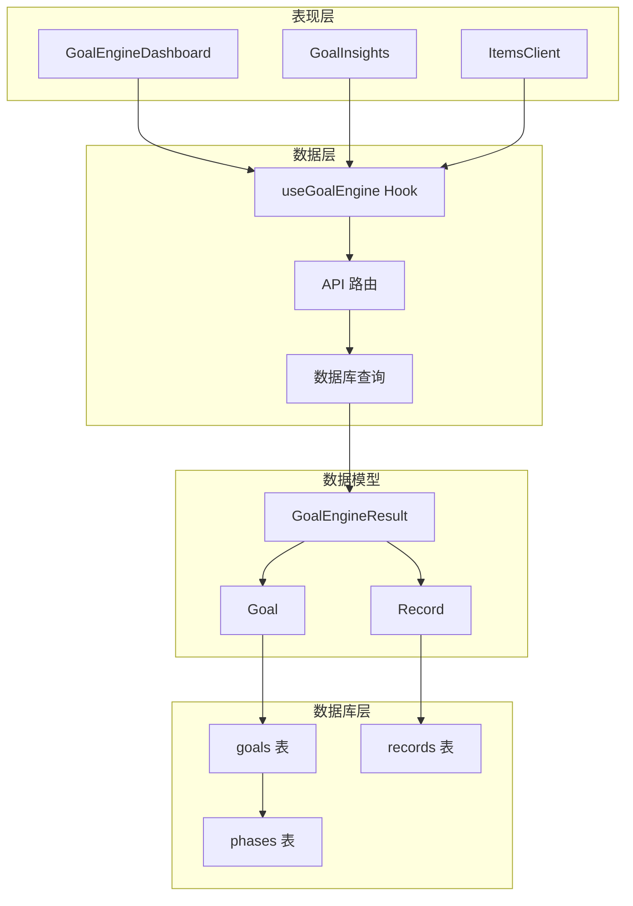
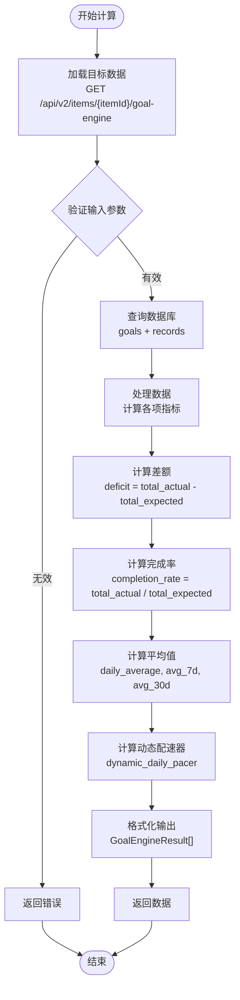
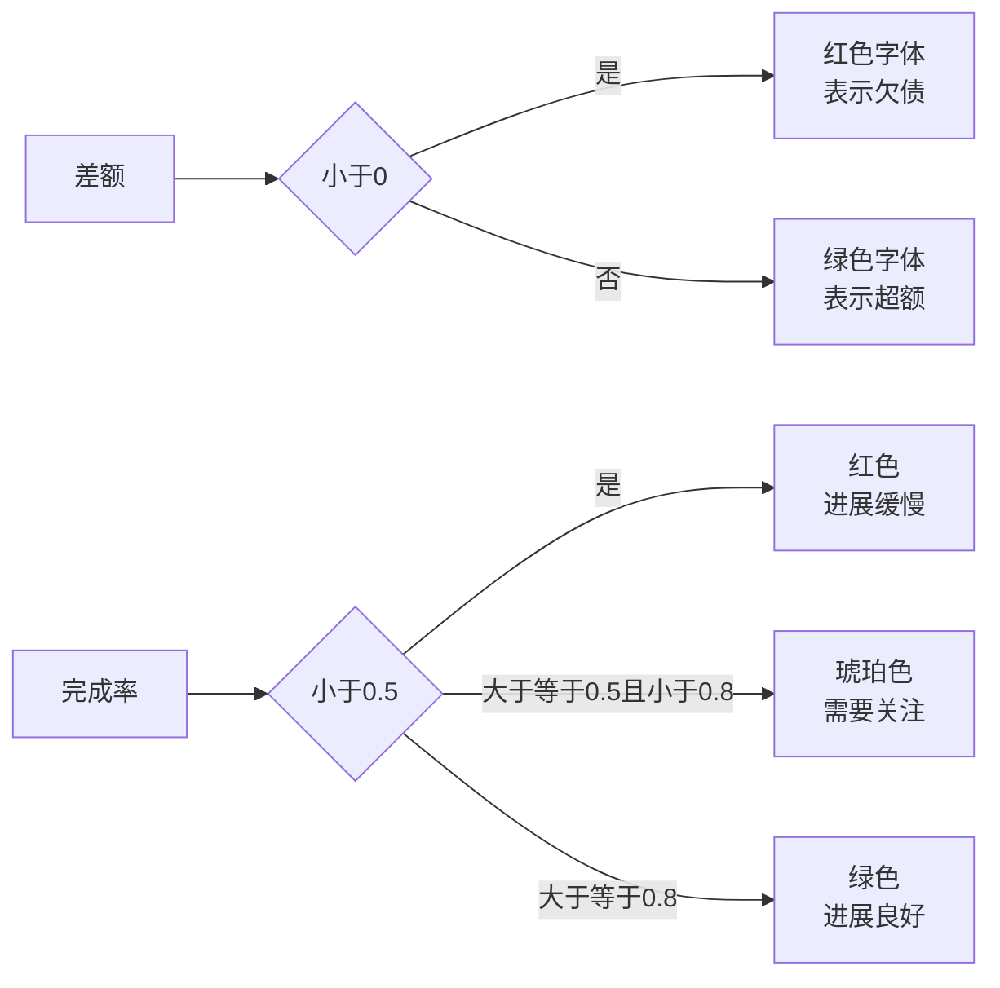
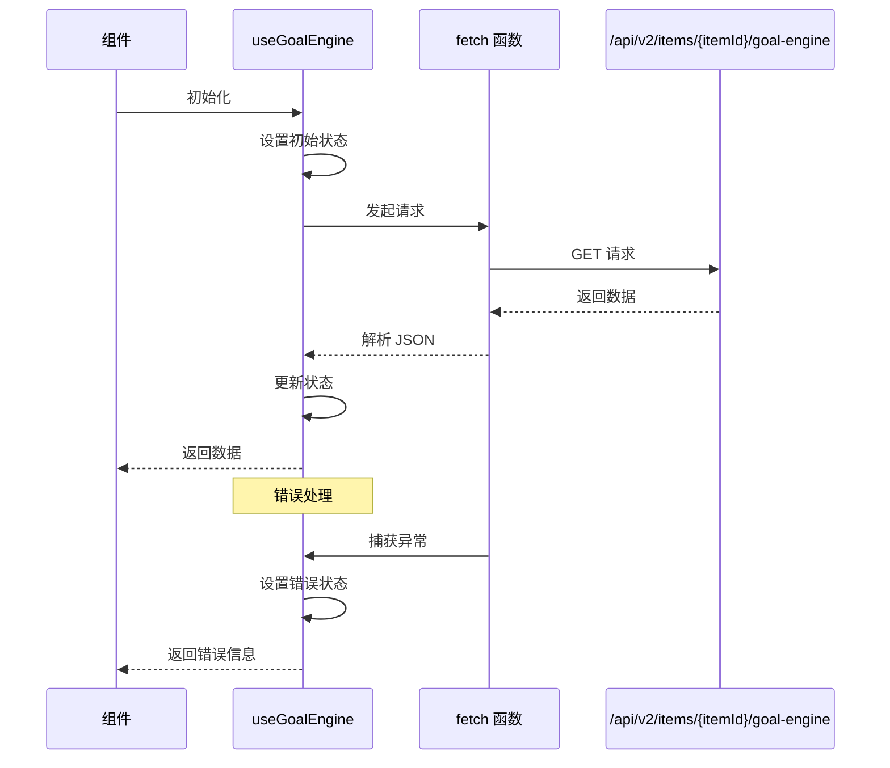
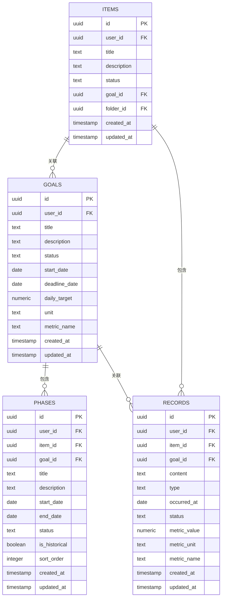
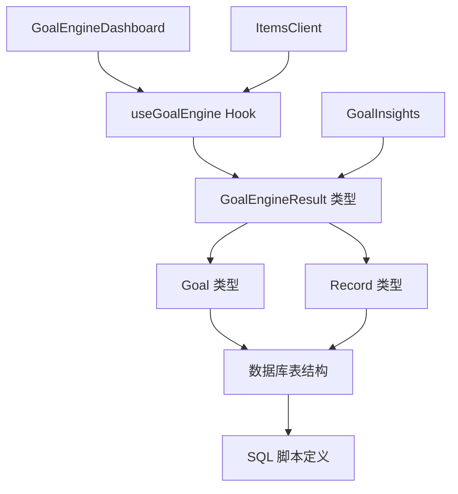

# 量化目标引擎（Goal BI Engine）

<cite>
**本文档引用的文件**
- [GoalInsights.tsx](file://src/app/(dashboard)/insights/components/GoalInsights.tsx)
- [GoalEngineDashboard.tsx](file://src/app/(dashboard)/items/components/GoalEngineDashboard.tsx)
- [useGoalEngine.ts](file://src/lib/hooks/useGoalEngine.ts)
- [teto.ts](file://src/types/teto.ts)
- [003_teto_1_4_phases_and_goals.sql](file://sql/003_teto_1_4_phases_and_goals.sql)
- [010_goal_benchmark_fields.sql](file://sql/010_goal_benchmark_fields.sql)
- [ItemsClient.tsx](file://src/app/(dashboard)/items/ItemsClient.tsx)
- [semantic.ts](file://src/types/semantic.ts)
- [README.md](file://README.md)
</cite>

## 目录
1. [简介](#简介)
2. [项目结构](#项目结构)
3. [核心组件](#核心组件)
4. [架构概览](#架构概览)
5. [详细组件分析](#详细组件分析)
6. [依赖分析](#依赖分析)
7. [性能考虑](#性能考虑)
8. [故障排除指南](#故障排除指南)
9. [结论](#结论)

## 简介

量化目标引擎（Goal BI Engine）是 TETO 1.4 版本中的核心数据分析组件，专门用于追踪和分析用户的量化目标完成情况。该引擎通过计算目标的差额、完成率、配速等关键指标，为用户提供直观的量化反馈，帮助用户更好地管理个人成长和目标实现。

引擎采用"金融账本式"的差额计算方法，通过日均期望值与实际完成量的对比，实时展示目标达成情况。支持多种时间维度分析，包括日均值、7日均值、30日均值以及周/月投射值。

## 项目结构

量化目标引擎位于 TETO 项目的前端应用结构中，主要分布在以下几个关键目录：

```mermaid
graph TB
subgraph "前端应用结构"
A[src/app/(dashboard)] --> B[仪表盘组件]
A --> C[事项管理]
A --> D[洞察分析]
B --> E[GoalEngineDashboard.tsx]
B --> F[GoalInsights.tsx]
G[src/lib/hooks] --> H[useGoalEngine.ts]
I[src/types] --> J[teto.ts]
I --> K[semantic.ts]
L[sql/] --> M[003_teto_1_4_phases_and_goals.sql]
L --> N[010_goal_benchmark_fields.sql]
end
```

**图表来源**
- [GoalEngineDashboard.tsx:1-199](file://src/app/(dashboard)/items/components/GoalEngineDashboard.tsx#L1-L199)
- [useGoalEngine.ts:1-42](file://src/lib/hooks/useGoalEngine.ts#L1-L42)
- [teto.ts:474-525](file://src/types/teto.ts#L474-L525)

**章节来源**
- [GoalEngineDashboard.tsx:1-199](file://src/app/(dashboard)/items/components/GoalEngineDashboard.tsx#L1-L199)
- [useGoalEngine.ts:1-42](file://src/lib/hooks/useGoalEngine.ts#L1-L42)
- [teto.ts:474-525](file://src/types/teto.ts#L474-L525)

## 核心组件

量化目标引擎由多个相互协作的组件构成，每个组件都有明确的职责分工：

### 主要组件架构



**图表来源**
- [GoalEngineDashboard.tsx:72-161](file://src/app/(dashboard)/items/components/GoalEngineDashboard.tsx#L72-L161)
- [useGoalEngine.ts:10-41](file://src/lib/hooks/useGoalEngine.ts#L10-L41)
- [teto.ts:476-512](file://src/types/teto.ts#L476-L512)

### 数据流架构



**图表来源**
- [useGoalEngine.ts:15-34](file://src/lib/hooks/useGoalEngine.ts#L15-L34)
- [GoalEngineDashboard.tsx:11-66](file://src/app/(dashboard)/items/components/GoalEngineDashboard.tsx#L11-L66)

**章节来源**
- [GoalEngineDashboard.tsx:1-199](file://src/app/(dashboard)/items/components/GoalEngineDashboard.tsx#L1-L199)
- [useGoalEngine.ts:1-42](file://src/lib/hooks/useGoalEngine.ts#L1-L42)
- [teto.ts:474-525](file://src/types/teto.ts#L474-L525)

## 架构概览

量化目标引擎采用分层架构设计，确保了良好的可维护性和扩展性：

### 整体架构图



**图表来源**
- [GoalEngineDashboard.tsx:1-199](file://src/app/(dashboard)/items/components/GoalEngineDashboard.tsx#L1-L199)
- [useGoalEngine.ts:1-42](file://src/lib/hooks/useGoalEngine.ts#L1-L42)
- [teto.ts:325-344](file://src/types/teto.ts#L325-L344)
- [003_teto_1_4_phases_and_goals.sql:16-45](file://sql/003_teto_1_4_phases_and_goals.sql#L16-L45)

### 核心数据流程



**图表来源**
- [useGoalEngine.ts:15-34](file://src/lib/hooks/useGoalEngine.ts#L15-L34)
- [teto.ts:476-512](file://src/types/teto.ts#L476-L512)

**章节来源**
- [GoalEngineDashboard.tsx:1-199](file://src/app/(dashboard)/items/components/GoalEngineDashboard.tsx#L1-L199)
- [useGoalEngine.ts:1-42](file://src/lib/hooks/useGoalEngine.ts#L1-L42)
- [teto.ts:474-525](file://src/types/teto.ts#L474-L525)

## 详细组件分析

### GoalEngineDashboard 组件

GoalEngineDashboard 是量化目标引擎的主要展示组件，负责渲染每个目标的详细指标卡片。

#### 组件特性

- **响应式设计**：支持多种屏幕尺寸，自适应布局
- **实时数据更新**：通过 Hook 自动获取最新数据
- **错误处理**：完善的错误状态管理和用户提示
- **加载状态**：友好的加载指示器

#### 核心指标展示

组件展示以下关键指标：

| 指标名称 | 描述 | 计算公式 | 显示样式 |
|---------|------|----------|----------|
| 合计差值 | 实际完成量与应当量的差额 | total_actual - total_expected | 红绿色标识 |
| 今日进度 | 今日完成量与日均目标的对比 | today_actual / daily_target | 数字+单位 |
| 总完成率 | 整体完成百分比 | total_actual / total_expected | 颜色编码 |
| 日均值 | 历史平均每日完成量 | total_actual / total_passed_days | 数字+单位 |
| 7日均值 | 最近7天平均完成量 | avg_7d | 数字+单位 |
| 30日均值 | 最近30天平均完成量 | avg_30d | 数字+单位 |
| 合计应当 | 应当完成总量 | total_passed_days × daily_target | 数字+单位 |
| 完成总值 | 已完成总量 | total_actual | 数字+单位 |
| 周目标 | 本周目标完成量 | daily_target × 7 | 数字+单位 |
| 月目标 | 本月目标完成量 | daily_target × 30 | 数字+单位 |
| 周预计 | 基于日均的周完成预测 | daily_average × 7 | 数字+单位 |
| 月预计 | 基于日均的月完成预测 | daily_average × 30 | 数字+单位 |

#### 颜色编码系统



**图表来源**
- [GoalEngineDashboard.tsx:85-91](file://src/app/(dashboard)/items/components/GoalEngineDashboard.tsx#L85-L91)

**章节来源**
- [GoalEngineDashboard.tsx:1-199](file://src/app/(dashboard)/items/components/GoalEngineDashboard.tsx#L1-L199)

### useGoalEngine Hook

useGoalEngine 是一个自定义 React Hook，负责管理量化目标引擎的数据获取和状态管理。

#### Hook 功能特性

- **自动数据获取**：组件挂载时自动发起 API 请求
- **状态管理**：统一管理 loading、error、data 状态
- **错误处理**：完整的错误捕获和用户友好提示
- **重新获取**：提供 refetch 方法支持手动刷新

#### 数据获取流程



**图表来源**
- [useGoalEngine.ts:15-34](file://src/lib/hooks/useGoalEngine.ts#L15-L34)

**章节来源**
- [useGoalEngine.ts:1-42](file://src/lib/hooks/useGoalEngine.ts#L1-L42)

### GoalEngineResult 数据模型

GoalEngineResult 是量化目标引擎的核心数据结构，定义了所有计算指标的接口。

#### 关键字段说明

| 字段名 | 类型 | 描述 | 示例值 |
|--------|------|------|--------|
| goal_id | string | 目标唯一标识符 | "a1b2c3d4-e5f6-7890-abcd-ef1234567890" |
| goal_title | string | 目标标题 | "英语单词量" |
| unit | string | 计量单位 | "个" |
| daily_target | number | 日均目标值 | 150.00 |
| total_passed_days | number | 已经过的天数 | 365 |
| remaining_days | number | 剩余天数 | 120 |
| today_actual | number | 今日实际完成量 | 120.00 |
| total_expected | number | 应当完成总量 | 54750.00 |
| total_actual | number | 实际完成总量 | 52000.00 |
| deficit | number | 差额（负值=欠债） | -2750.00 |
| completion_rate | number | 完成率（0-1） | 0.950 |
| daily_average | number | 日均完成量 | 142.00 |
| avg_7d | number | 7日平均值 | 138.50 |
| avg_30d | number | 30日平均值 | 140.25 |
| total_target | number | 总目标值 | 60000.00 |
| dynamic_daily_pacer | number | 动态配速器 | 145.83 |
| weekly_target | number | 周目标值 | 1050.00 |
| monthly_target | number | 月目标值 | 4500.00 |
| weekly_projection | number | 周预计完成量 | 994.00 |
| monthly_projection | number | 月预计完成量 | 4260.00 |

#### 计算逻辑

```mermaid
flowchart TD
A[开始计算] --> B[获取基础数据]
B --> C[计算合计应当<br/>total_expected = daily_target × total_passed_days]
C --> D[计算合计差额<br/>deficit = total_actual - total_expected]
D --> E[计算完成率<br/>completion_rate = total_actual / total_expected]
E --> F[计算日均值<br/>daily_average = total_actual / total_passed_days]
F --> G[计算7日均值<br/>avg_7d = 近7天平均]
G --> H[计算30日均值<br/>avg_30d = 近30天平均]
H --> I[计算周/月目标<br/>weekly_target = daily_target × 7<br/>monthly_target = daily_target × 30]
I --> J[计算周/月预计<br/>weekly_projection = daily_average × 7<br/>monthly_projection = daily_average × 30]
J --> K[计算动态配速器<br/>dynamic_daily_pacer = (total_target - total_actual) / remaining_days]
K --> L[结束]
```

**图表来源**
- [teto.ts:476-512](file://src/types/teto.ts#L476-L512)

**章节来源**
- [teto.ts:474-525](file://src/types/teto.ts#L474-L525)

### 数据库架构

量化目标引擎依赖于 TETO 1.4 的数据库架构，特别是目标和阶段相关的表结构。

#### 目标表结构



**图表来源**
- [003_teto_1_4_phases_and_goals.sql:16-61](file://sql/003_teto_1_4_phases_and_goals.sql#L16-L61)
- [010_goal_benchmark_fields.sql:11-30](file://sql/010_goal_benchmark_fields.sql#L11-L30)

#### 关键字段说明

| 字段名 | 类型 | 描述 | 约束条件 |
|--------|------|------|----------|
| metric_name | TEXT | 指标名称，用于精确匹配记录 | 可为空，支持多维度区分 |
| unit | TEXT | 计量单位 | 可为空，独立于记录单位 |
| daily_target | NUMERIC(12,2) | 日均目标值 | 可为空，支持布尔目标 |
| start_date | DATE | 起算日期 | 可为空，影响天数计算 |
| deadline_date | DATE | 截止日期 | 可为空，影响剩余天数计算 |

**章节来源**
- [003_teto_1_4_phases_and_goals.sql:1-130](file://sql/003_teto_1_4_phases_and_goals.sql#L1-L130)
- [010_goal_benchmark_fields.sql:1-40](file://sql/010_goal_benchmark_fields.sql#L1-L40)

## 依赖分析

量化目标引擎的依赖关系相对简单，主要依赖于类型定义和数据库结构。

### 组件依赖关系



**图表来源**
- [GoalEngineDashboard.tsx:3-5](file://src/app/(dashboard)/items/components/GoalEngineDashboard.tsx#L3-L5)
- [useGoalEngine.ts:3-4](file://src/lib/hooks/useGoalEngine.ts#L3-L4)
- [teto.ts:476-512](file://src/types/teto.ts#L476-L512)

### 外部依赖

量化目标引擎主要依赖以下外部库和框架：

- **React 18+**：用于组件开发和状态管理
- **Next.js App Router**：路由和页面管理
- **Recharts**：数据可视化图表
- **Lucide React**：图标库
- **Tailwind CSS**：样式框架

**章节来源**
- [GoalEngineDashboard.tsx:1-199](file://src/app/(dashboard)/items/components/GoalEngineDashboard.tsx#L1-L199)
- [useGoalEngine.ts:1-42](file://src/lib/hooks/useGoalEngine.ts#L1-L42)
- [README.md:13-21](file://README.md#L13-L21)

## 性能考虑

量化目标引擎在设计时充分考虑了性能优化，采用了多种策略来确保良好的用户体验。

### 性能优化策略

1. **客户端缓存**：使用 React Hook 缓存 API 响应，避免重复请求
2. **懒加载**：仅在组件需要时才加载和计算数据
3. **虚拟滚动**：对于大量目标的情况，考虑使用虚拟滚动技术
4. **数据分页**：支持分页加载，减少单次请求的数据量
5. **计算优化**：使用 useMemo 和 useCallback 优化重计算

### 内存管理

- **状态清理**：组件卸载时自动清理状态
- **事件监听器**：及时移除不必要的事件监听器
- **定时器清理**：避免内存泄漏的定时器

### 网络优化

- **请求去重**：相同参数的请求会被合并
- **错误重试**：网络错误时自动重试
- **超时控制**：设置合理的请求超时时间

## 故障排除指南

### 常见问题及解决方案

#### 数据加载失败

**症状**：组件显示"引擎计算失败"错误

**可能原因**：
1. 网络连接问题
2. API 服务器不可用
3. 用户认证失败
4. 数据库查询超时

**解决步骤**：
1. 检查网络连接状态
2. 验证 API 服务器运行状态
3. 确认用户已登录
4. 查看浏览器开发者工具的网络面板

#### 数据显示异常

**症状**：指标数值显示不正确或为空

**可能原因**：
1. 目标配置不完整
2. 记录数据缺失
3. 时间范围设置错误
4. 数据库索引问题

**解决步骤**：
1. 检查目标的 benchmark 字段配置
2. 验证相关记录的存在性
3. 确认时间范围设置的合理性
4. 检查数据库索引状态

#### 性能问题

**症状**：页面加载缓慢或卡顿

**可能原因**：
1. 数据量过大
2. 计算复杂度过高
3. 组件渲染次数过多
4. 内存泄漏

**解决步骤**：
1. 实施数据分页加载
2. 优化计算算法
3. 减少不必要的组件重渲染
4. 检查内存使用情况

**章节来源**
- [useGoalEngine.ts:27-30](file://src/lib/hooks/useGoalEngine.ts#L27-L30)
- [GoalEngineDashboard.tsx:23-29](file://src/app/(dashboard)/items/components/GoalEngineDashboard.tsx#L23-L29)

## 结论

量化目标引擎（Goal BI Engine）是 TETO 1.4 中一个精心设计的数据分析组件，它通过简洁而强大的 API，为用户提供了全面的量化目标追踪能力。引擎采用"金融账本式"的差额计算方法，结合多种时间维度的分析指标，为用户提供了直观、准确的目标完成情况反馈。

### 主要优势

1. **直观的可视化**：通过清晰的指标展示和颜色编码，用户可以快速理解目标状态
2. **实时数据更新**：基于 React Hook 的实时数据获取机制，确保信息的时效性
3. **灵活的配置**：支持多种计量单位和目标类型，适应不同的使用场景
4. **良好的扩展性**：模块化的架构设计，便于未来功能扩展

### 技术亮点

- **精确的计算逻辑**：基于日均目标和实际完成量的差额计算
- **多维度分析**：支持日均、7日均、30日均等多种时间维度
- **智能配速器**：根据剩余时间和目标值计算动态配速建议
- **响应式设计**：适配各种设备和屏幕尺寸

量化目标引擎不仅提升了 TETO 系统的数据分析能力，也为用户提供了更加科学、系统的个人成长管理工具。通过持续的优化和功能扩展，该引擎有望成为个人效率追踪领域的一个标杆解决方案。