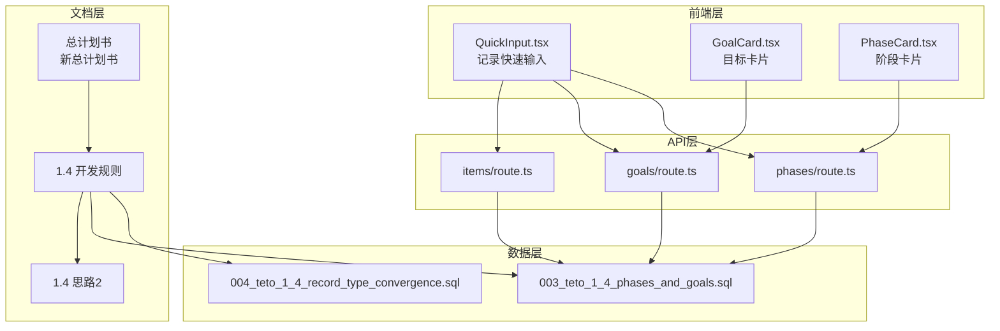
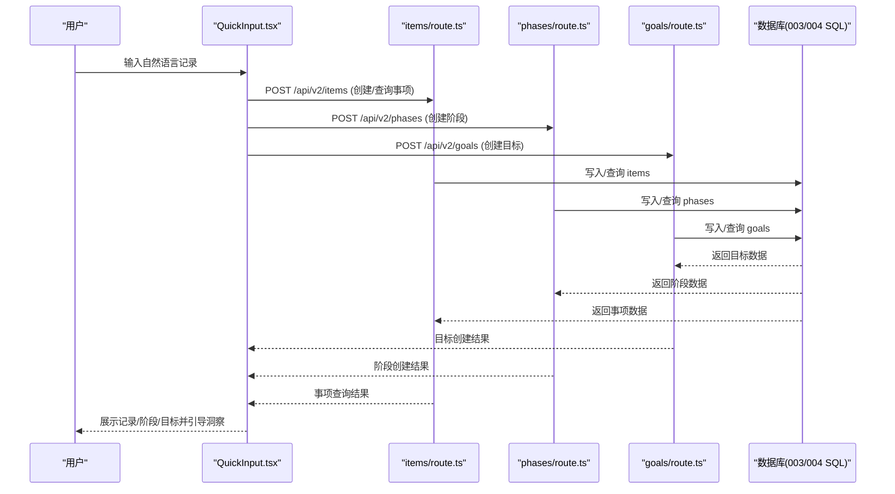
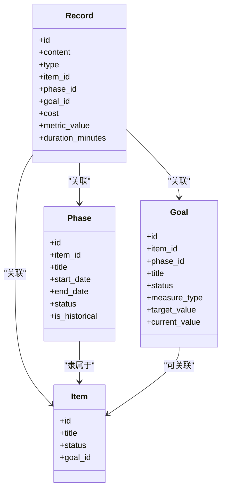
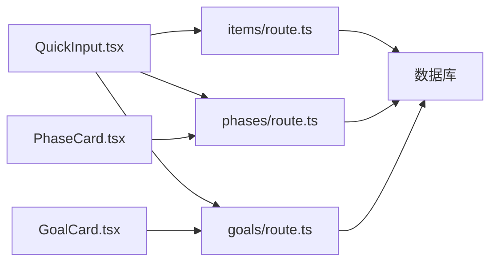

# 需求分析流程

<cite>
**本文引用的文件**   
- [README.md](file://README.md)
- [TETO 1.4 开发规则.md](file://docs/01-生效版本/TETO 1.4/TETO 1.4 开发规则.md)
- [1.4 思路2.md](file://docs/01-生效版本/TETO 1.4/1.4 思路2.md)
- [TETO 项目新总计划书.md](file://docs/00-总控/TETO 项目新总计划书.md)
- [DATA_RULES.md](file://DATA_RULES.md)
- [003_teto_1_4_phases_and_goals.sql](file://sql/003_teto_1_4_phases_and_goals.sql)
- [004_teto_1_4_record_type_convergence.sql](file://sql/004_teto_1_4_record_type_convergence.sql)
- [teto.ts](file://src/types/teto.ts)
- [QuickInput.tsx](file://src/app/(dashboard)/records/components/QuickInput.tsx)
- [GoalCard.tsx](file://src/app/(dashboard)/items/components/GoalCard.tsx)
- [PhaseCard.tsx](file://src/app/(dashboard)/items/components/PhaseCard.tsx)
- [goals/route.ts](file://src/app/api/v2/goals/route.ts)
- [phases/route.ts](file://src/app/api/v2/phases/route.ts)
- [items/route.ts](file://src/app/api/v2/items/route.ts)
</cite>

## 目录
1. [引言](#引言)
2. [项目结构](#项目结构)
3. [核心组件](#核心组件)
4. [架构总览](#架构总览)
5. [详细组件分析](#详细组件分析)
6. [依赖分析](#依赖分析)
7. [性能考虑](#性能考虑)
8. [故障排查指南](#故障排查指南)
9. [结论](#结论)
10. [附录](#附录)

## 引言
本文件面向 TETO 1.4 阶段，系统化梳理需求分析流程，覆盖需求收集、分类、优先级评估、变更管理、用户故事规范、需求文档模板、评审机制、1.4 阶段边界与范围、功能限制、非功能性要求、验证方法、用户场景分析、需求追溯矩阵、需求与技术实现映射、风险与依赖分析等内容。目标是为跨职能团队提供统一、可落地的需求工作范式，确保 TETO 1.4 在“记录—事项—洞察”骨架上补足“阶段”和“历史导入”，形成可长期回看、可表达连续人生现实的系统。

## 项目结构
- 文档层面：采用“总控—生效版本—归档”的分层结构，1.4 阶段规则与蓝图为核心执行依据，总计划书提供长期愿景与边界约束。
- 数据层面：1.4 引入 goals（目标）与 phases（阶段）核心表，记录类型收敛为“发生/计划/想法/总结”，并为 items/records 新增 goal_id 外键，强化目标与阶段的语义承载。
- 前端层面：记录页（QuickInput）、事项页（GoalCard/PhaseCard）、洞察页（API/组件）协同，支撑“记录现实—归入事项—形成/补录阶段—回看长期变化—生成洞察”的主链路。
- API 层面：v2 接口提供 items、phases、goals 的查询与创建，配合前端组件完成闭环。

**图示来源**
- [TETO 项目新总计划书.md:1-392](file://docs/00-总控/TETO 项目新总计划书.md#L1-L392)
- [TETO 1.4 开发规则.md:1-812](file://docs/01-生效版本/TETO 1.4/TETO 1.4 开发规则.md#L1-L812)
- [1.4 思路2.md:1-1209](file://docs/01-生效版本/TETO 1.4/1.4 思路2.md#L1-L1209)
- [003_teto_1_4_phases_and_goals.sql:1-130](file://sql/003_teto_1_4_phases_and_goals.sql#L1-L130)
- [004_teto_1_4_record_type_convergence.sql:1-20](file://sql/004_teto_1_4_record_type_convergence.sql#L1-L20)
- [QuickInput.tsx:1-956](file://src/app/(dashboard)/records/components/QuickInput.tsx#L1-L956)
- [GoalCard.tsx:1-114](file://src/app/(dashboard)/items/components/GoalCard.tsx#L1-L114)
- [PhaseCard.tsx:1-125](file://src/app/(dashboard)/items/components/PhaseCard.tsx#L1-L125)
- [goals/route.ts:1-49](file://src/app/api/v2/goals/route.ts#L1-L49)
- [phases/route.ts:1-72](file://src/app/api/v2/phases/route.ts#L1-L72)
- [items/route.ts:1-47](file://src/app/api/v2/items/route.ts#L1-L47)

**章节来源**
- [README.md:1-126](file://README.md#L1-L126)
- [TETO 项目新总计划书.md:1-392](file://docs/00-总控/TETO 项目新总计划书.md#L1-L392)
- [TETO 1.4 开发规则.md:1-812](file://docs/01-生效版本/TETO 1.4/TETO 1.4 开发规则.md#L1-L812)
- [1.4 思路2.md:1-1209](file://docs/01-生效版本/TETO 1.4/1.4 思路2.md#L1-L1209)

## 核心组件
- 需求收集与分类
  - 收集来源：用户访谈、使用场景、历史导入痛点、现有功能反馈、1.4 规则与蓝图。
  - 分类标准：按对象层级（记录/事项/阶段/洞察）、按业务域（日常记录、历史导入、阶段管理、目标管理、洞察分析）、按非功能性（性能、可用性、安全性、可维护性）。
- 需求优先级评估
  - 评估维度：业务价值、用户影响、实现成本、风险、与 1.4 边界的契合度。
  - 优先级矩阵：高价值高影响优先；与“真实可验证”强相关的优先；与“连续性优先”“轻输入优先”一致的优先。
- 需求变更管理
  - 变更入口：需求评审会议纪要、1.4 规则修订、蓝图更新。
  - 变更控制：变更影响评估（对数据库/前端/API/流程的影响）、回归验证、版本发布前冻结。
- 用户故事规范
  - 角色：普通用户、管理员（如涉及）。
  - 结构：作为【角色】我希望【目标】以便【收益】；验收条件与可验证性明确。
- 需求文档模板
  - 模板要素：需求编号、来源、类型、优先级、所属阶段、业务域、验收标准、依赖、风险、追溯矩阵链接。
- 需求评审机制
  - 评审主体：产品、研发、测试、设计代表。
  - 评审标准：一致性（与 1.4 规则/蓝图）、完整性（输入/处理/输出/异常）、可验证性（端到端链路）、风险可控。
- 1.4 阶段边界与范围
  - 必须完成：记录/事项/阶段/历史导入/洞察基础能力。
  - 可做但不抢先：阶段辅助识别、事项时间线、历史导入模板等。
  - 明确不做：多人协作、高级 AI 主导、复杂自动识别、把阶段做成独立导航等。
- 非功能性需求
  - 性能：记录创建/查询延迟、批量导入吞吐。
  - 可用性：输入轻量化、界面一致性、操作反馈及时。
  - 安全性：RLS 策略、鉴权、敏感字段脱敏。
  - 可维护性：数据库索引、API 版本化、前端组件职责清晰。

**章节来源**
- [TETO 1.4 开发规则.md:508-786](file://docs/01-生效版本/TETO 1.4/TETO 1.4 开发规则.md#L508-L786)
- [TETO 1.4 开发规则.md:648-686](file://docs/01-生效版本/TETO 1.4/TETO 1.4 开发规则.md#L648-L686)
- [TETO 项目新总计划书.md:278-340](file://docs/00-总控/TETO 项目新总计划书.md#L278-L340)

## 架构总览
1.4 需求驱动的端到端链路：记录现实 → 归入事项 → 形成/补录阶段 → 回看长期变化 → 生成洞察。数据库层以 goals/phase 为核心，前端以 QuickInput、GoalCard、PhaseCard 为入口，API 层提供 items/phases/goals 的查询与创建。

**图示来源**
- [QuickInput.tsx:1-956](file://src/app/(dashboard)/records/components/QuickInput.tsx#L1-L956)
- [items/route.ts:1-47](file://src/app/api/v2/items/route.ts#L1-L47)
- [phases/route.ts:1-72](file://src/app/api/v2/phases/route.ts#L1-L72)
- [goals/route.ts:1-49](file://src/app/api/v2/goals/route.ts#L1-L49)
- [003_teto_1_4_phases_and_goals.sql:1-130](file://sql/003_teto_1_4_phases_and_goals.sql#L1-L130)

## 详细组件分析

### 需求收集与分类
- 收集方法
  - 用户访谈：聚焦“记录—事项—洞察”使用痛点与历史导入场景。
  - 场景驱动：日常链路（记录→事项→阶段→洞察）、历史链路（历史事项→历史记录→历史阶段→事项页）。
  - 知识库对齐：与 1.4 规则、蓝图、总计划书保持一致。
- 分类标准
  - 对象层级：记录（发生/计划/想法/总结）、事项、阶段、洞察。
  - 业务域：记录层（快速输入、筛选、关联）、事项层（详情、阶段列表、长期回看）、阶段层（创建/编辑/查看）、历史层（导入/校验/挂载）、洞察层（基础统计与理解）。
  - 非功能性：性能、可用性、安全、可维护性。

**章节来源**
- [TETO 1.4 开发规则.md:358-506](file://docs/01-生效版本/TETO 1.4/TETO 1.4 开发规则.md#L358-L506)
- [1.4 思路2.md:132-191](file://docs/01-生效版本/TETO 1.4/1.4 思路2.md#L132-L191)

### 需求优先级评估
- 评估维度
  - 业务价值：是否支撑“连续人生现实”理解。
  - 用户影响：是否降低输入成本、提升长期回看价值。
  - 实现成本：是否与 1.4 边界一致、是否复用现有组件/API。
  - 风险：是否引入结构过重、规则过死、输入成本过高。
- 优先级矩阵
  - 高价值高影响：记录轻输入、阶段与历史导入、洞察基础。
  - 高影响低成本：阶段辅助识别、历史导入模板。
  - 低价值低影响：复杂自动识别、平台化设计。

**章节来源**
- [TETO 1.4 开发规则.md:648-686](file://docs/01-生效版本/TETO 1.4/TETO 1.4 开发规则.md#L648-L686)

### 需求变更管理
- 变更入口
  - 需求评审会议纪要、1.4 规则修订、蓝图更新。
- 变更控制
  - 影响评估：数据库（索引/外键/约束）、前端（组件职责/交互）、API（版本/兼容性）。
  - 回归验证：端到端链路验证（日常/历史/洞察）。
  - 发布冻结：版本发布前冻结需求变更。

**章节来源**
- [TETO 1.4 开发规则.md:576-588](file://docs/01-生效版本/TETO 1.4/TETO 1.4 开发规则.md#L576-L588)

### 用户故事编写规范
- 角色：普通用户。
- 结构：作为【角色】我希望【目标】以便【收益】。
- 示例要点：明确验收条件（可验证性）、与 1.4 边界一致、避免过度功能预埋。

**章节来源**
- [TETO 1.4 开发规则.md:708-758](file://docs/01-生效版本/TETO 1.4/TETO 1.4 开发规则.md#L708-L758)

### 需求文档模板
- 模板要素
  - 需求编号、来源、类型、优先级、所属阶段、业务域、验收标准、依赖、风险、追溯矩阵链接。
- 使用建议
  - 与评审机制配套，确保每条需求可追溯、可验证、可受控。

**章节来源**
- [TETO 1.4 开发规则.md:708-758](file://docs/01-生效版本/TETO 1.4/TETO 1.4 开发规则.md#L708-L758)

### 需求评审机制
- 评审主体：产品、研发、测试、设计代表。
- 评审标准：一致性（与 1.4 规则/蓝图）、完整性（输入/处理/输出/异常）、可验证性（端到端链路）、风险可控。

**章节来源**
- [TETO 1.4 开发规则.md:708-758](file://docs/01-生效版本/TETO 1.4/TETO 1.4 开发规则.md#L708-L758)

### 1.4 阶段边界与范围
- 必须完成：记录/事项/阶段/历史导入/洞察基础。
- 可做但不抢先：阶段辅助识别、事项时间线、历史导入模板等。
- 明确不做：多人协作、高级 AI 主导、复杂自动识别、把阶段做成独立导航等。

**章节来源**
- [TETO 1.4 开发规则.md:508-573](file://docs/01-生效版本/TETO 1.4/TETO 1.4 开发规则.md#L508-L573)

### 非功能性需求
- 性能：记录创建/查询延迟、批量导入吞吐。
- 可用性：输入轻量化、界面一致性、操作反馈及时。
- 安全性：RLS 策略、鉴权、敏感字段脱敏。
- 可维护性：数据库索引、API 版本化、前端组件职责清晰。

**章节来源**
- [TETO 1.4 开发规则.md:648-686](file://docs/01-生效版本/TETO 1.4/TETO 1.4 开发规则.md#L648-L686)

### 需求验证方法
- 页面层：记录页、事项页、洞察页、历史导入流程可真实使用。
- 数据层：记录/事项/阶段 CRUD 可用，关系正确可回显。
- 链路层：日常链路、阶段链路、历史链路、洞察链路真实走通。

**章节来源**
- [TETO 1.4 开发规则.md:708-758](file://docs/01-生效版本/TETO 1.4/TETO 1.4 开发规则.md#L708-L758)

### 用户场景分析
- 日常场景：记录当下现实 → 关联事项 → 长期积累形成阶段 → 洞察理解。
- 历史场景：建立历史事项 → 导入历史具体记录 → 补录历史阶段 → 与当前记录统一回看。
- 洞察场景：基于记录/事项/阶段的基础理解，形成近期与历史对照。

**章节来源**
- [TETO 1.4 开发规则.md:358-485](file://docs/01-生效版本/TETO 1.4/TETO 1.4 开发规则.md#L358-L485)

### 需求追溯矩阵
- 建议字段
  - 需求编号、来源、类型、优先级、所属阶段、业务域、验收标准、依赖、风险、追溯矩阵链接。
- 用途
  - 覆盖“记录—事项—洞察”与“阶段—历史导入”的所有关键需求，确保可追踪、可验证、可受控。

**章节来源**
- [TETO 1.4 开发规则.md:708-758](file://docs/01-生效版本/TETO 1.4/TETO 1.4 开发规则.md#L708-L758)

### 需求与技术实现映射
- 记录层
  - 前端：QuickInput.tsx（自然语言解析、芯片编辑、AI 增强、批量拆分）。
  - API：/api/v2/records（创建/更新/查询）。
  - 数据库：records 表新增 cost 字段与 type 收敛。
- 事项层
  - 前端：GoalCard.tsx/PhaseCard.tsx（目标/阶段展示与操作）。
  - API：/api/v2/items（查询/创建）。
- 阶段层
  - 前端：PhaseCard.tsx（阶段卡片展示与操作）。
  - API：/api/v2/phases（查询/创建）。
  - 数据库：phases 表（时间范围、状态、历史标记）。
- 目标层
  - 前端：GoalCard.tsx（目标展示与进度）。
  - API：/api/v2/goals（查询/创建）。
  - 数据库：goals 表（目标状态、度量类型、基准字段）。
- 洞察层
  - API：/api/v2/insights（基础洞察数据）。

**图示来源**
- [teto.ts:37-94](file://src/types/teto.ts#L37-L94)
- [teto.ts:337-354](file://src/types/teto.ts#L337-L354)
- [teto.ts:315-335](file://src/types/teto.ts#L315-L335)

**章节来源**
- [QuickInput.tsx:1-956](file://src/app/(dashboard)/records/components/QuickInput.tsx#L1-L956)
- [GoalCard.tsx:1-114](file://src/app/(dashboard)/items/components/GoalCard.tsx#L1-L114)
- [PhaseCard.tsx:1-125](file://src/app/(dashboard)/items/components/PhaseCard.tsx#L1-L125)
- [goals/route.ts:1-49](file://src/app/api/v2/goals/route.ts#L1-L49)
- [phases/route.ts:1-72](file://src/app/api/v2/phases/route.ts#L1-L72)
- [items/route.ts:1-47](file://src/app/api/v2/items/route.ts#L1-L47)
- [teto.ts:37-94](file://src/types/teto.ts#L37-L94)
- [teto.ts:337-354](file://src/types/teto.ts#L337-L354)
- [teto.ts:315-335](file://src/types/teto.ts#L315-L335)

### 风险评估与依赖分析
- 风险
  - 结构过重：阶段独立化、历史孤岛化。
  - 规则过死：记录类型固化、展示逻辑僵化。
  - 输入成本过高：记录页复杂化、阶段页喧宾夺主。
  - 洞察只剩数字：缺乏现实理解。
- 依赖
  - 数据库：goals/phase 表结构与索引、RLS 策略。
  - 前端：QuickInput/GoalCard/PhaseCard 组件职责与交互。
  - API：items/phases/goals 的查询/创建接口与鉴权。

**章节来源**
- [TETO 1.4 开发规则.md:669-686](file://docs/01-生效版本/TETO 1.4/TETO 1.4 开发规则.md#L669-L686)
- [003_teto_1_4_phases_and_goals.sql:82-130](file://sql/003_teto_1_4_phases_and_goals.sql#L82-L130)
- [004_teto_1_4_record_type_convergence.sql:7-20](file://sql/004_teto_1_4_record_type_convergence.sql#L7-L20)

## 依赖分析
- 组件耦合
  - QuickInput 依赖 items API 与解析引擎，间接依赖 goals/phases。
  - GoalCard/PhaseCard 依赖 goals/phases API。
- 外部依赖
  - Supabase（认证、数据库、RLS）。
  - 浏览器端解析与 AI 增强（本地解析 + 后台异步增强）。
- 数据依赖
  - goals/phase 表的外键关系与索引直接影响查询性能与一致性。

**图示来源**
- [QuickInput.tsx:1-956](file://src/app/(dashboard)/records/components/QuickInput.tsx#L1-L956)
- [items/route.ts:1-47](file://src/app/api/v2/items/route.ts#L1-L47)
- [phases/route.ts:1-72](file://src/app/api/v2/phases/route.ts#L1-L72)
- [goals/route.ts:1-49](file://src/app/api/v2/goals/route.ts#L1-L49)

**章节来源**
- [QuickInput.tsx:1-956](file://src/app/(dashboard)/records/components/QuickInput.tsx#L1-L956)
- [items/route.ts:1-47](file://src/app/api/v2/items/route.ts#L1-L47)
- [phases/route.ts:1-72](file://src/app/api/v2/phases/route.ts#L1-L72)
- [goals/route.ts:1-49](file://src/app/api/v2/goals/route.ts#L1-L49)

## 性能考虑
- 数据库层面
  - 为 goals/phase/items/records 建立必要索引，保障查询性能。
  - RLS 策略启用，确保数据隔离与查询安全。
- 前端层面
  - QuickInput 的本地解析与防抖，减少无效请求。
  - 批量拆分与异步 AI 增强，避免阻塞主线程。
- API 层面
  - v2 接口按需查询参数过滤，避免全表扫描。

**章节来源**
- [003_teto_1_4_phases_and_goals.sql:114-130](file://sql/003_teto_1_4_phases_and_goals.sql#L114-L130)
- [QuickInput.tsx:124-151](file://src/app/(dashboard)/records/components/QuickInput.tsx#L124-L151)

## 故障排查指南
- 常见问题
  - 记录无法保存：检查输入合法性、日期格式、鉴权状态。
  - 阶段/目标关联失败：检查 item_id 归属、外键约束。
  - 历史导入后不可见：检查 is_historical 标记与挂载关系。
- 排查步骤
  - 确认端到端链路（记录→事项→阶段/目标→洞察）。
  - 检查数据库索引与 RLS 策略。
  - 核对 API 返回与前端展示状态。

**章节来源**
- [phases/route.ts:32-71](file://src/app/api/v2/phases/route.ts#L32-L71)
- [goals/route.ts:30-48](file://src/app/api/v2/goals/route.ts#L30-L48)
- [TETO 1.4 开发规则.md:708-758](file://docs/01-生效版本/TETO 1.4/TETO 1.4 开发规则.md#L708-L758)

## 结论
本需求分析流程以 1.4 阶段规则与蓝图为核心，结合数据库与前端/API 实现现状，明确了需求收集、分类、优先级、变更管理、评审机制与验证方法。通过端到端链路与追溯矩阵，确保需求与实现一一对应，风险可控、边界清晰、可验证性强，最终支撑 TETO 1.4 在“记录—事项—洞察”骨架上补足“阶段”和“历史导入”，形成连续人生现实的理解系统。

## 附录
- 术语
  - 记录：某天某次真实发生的现实内容。
  - 事项：长期主题容器。
  - 阶段：某个事项在某段时间里的持续现实概括。
  - 洞察：基于记录/事项/阶段的理解层。
- 参考文件
  - [TETO 1.4 开发规则.md](file://docs/01-生效版本/TETO 1.4/TETO 1.4 开发规则.md)
  - [1.4 思路2.md](file://docs/01-生效版本/TETO 1.4/1.4 思路2.md)
  - [TETO 项目新总计划书.md](file://docs/00-总控/TETO 项目新总计划书.md)
  - [DATA_RULES.md](file://DATA_RULES.md)
  - [003_teto_1_4_phases_and_goals.sql](file://sql/003_teto_1_4_phases_and_goals.sql)
  - [004_teto_1_4_record_type_convergence.sql](file://sql/004_teto_1_4_record_type_convergence.sql)
  - [teto.ts](file://src/types/teto.ts)
  - [QuickInput.tsx](file://src/app/(dashboard)/records/components/QuickInput.tsx)
  - [GoalCard.tsx](file://src/app/(dashboard)/items/components/GoalCard.tsx)
  - [PhaseCard.tsx](file://src/app/(dashboard)/items/components/PhaseCard.tsx)
  - [goals/route.ts](file://src/app/api/v2/goals/route.ts)
  - [phases/route.ts](file://src/app/api/v2/phases/route.ts)
  - [items/route.ts](file://src/app/api/v2/items/route.ts)