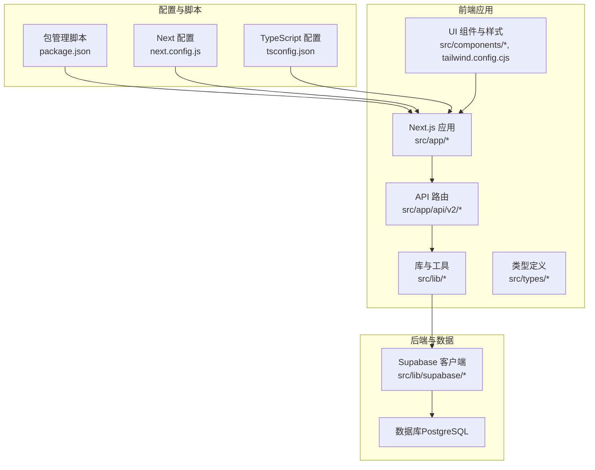
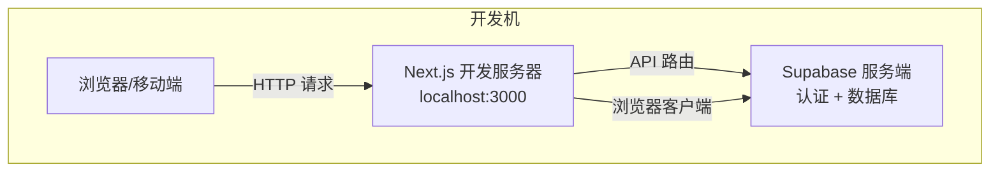
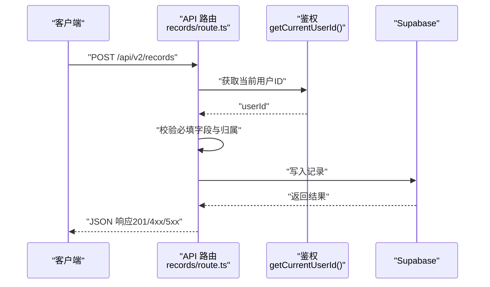
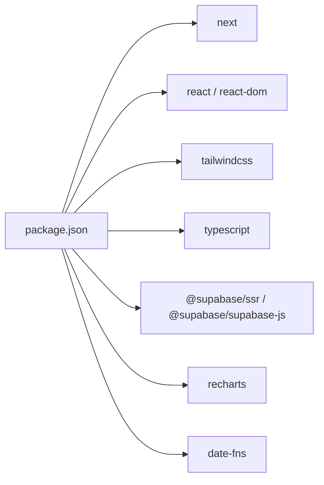

# 开发环境配置

<cite>
**本文引用的文件**
- [README.md](file://README.md)
- [package.json](file://package.json)
- [next.config.js](file://next.config.js)
- [tsconfig.json](file://tsconfig.json)
- [tailwind.config.cjs](file://tailwind.config.cjs)
- [src/lib/supabase/client.ts](file://src/lib/supabase/client.ts)
- [src/lib/supabase/server.ts](file://src/lib/supabase/server.ts)
- [src/app/api/v2/goals/route.ts](file://src/app/api/v2/goals/route.ts)
- [src/app/api/v2/records/route.ts](file://src/app/api/v2/records/route.ts)
</cite>

## 目录
1. [简介](#简介)
2. [项目结构](#项目结构)
3. [核心组件](#核心组件)
4. [架构总览](#架构总览)
5. [详细组件分析](#详细组件分析)
6. [依赖关系分析](#依赖关系分析)
7. [性能考虑](#性能考虑)
8. [故障排除指南](#故障排除指南)
9. [结论](#结论)
10. [附录](#附录)

## 简介
本指南面向 TETO 项目的开发者，提供从工具安装、环境变量配置、数据库初始化到本地服务启动的完整流程；同时覆盖 IDE 推荐配置、调试设置、开发与生产环境差异、配置管理策略、常见问题排查、性能优化以及多环境部署与云服务集成建议。内容基于仓库中的实际配置文件与源码进行梳理，确保可操作性与准确性。

## 项目结构
TETO 使用 Next.js 16 App Router + TypeScript + Tailwind CSS + Supabase（认证与 PostgreSQL）。前端页面位于 src/app，API 路由位于 src/app/api，数据库访问封装在 src/lib/supabase，类型定义位于 src/types，样式通过 Tailwind 配置统一管理。

图示来源
- [package.json:1-44](file://package.json#L1-L44)
- [next.config.js:1-4](file://next.config.js#L1-L4)
- [tsconfig.json:1-42](file://tsconfig.json#L1-L42)
- [tailwind.config.cjs:1-61](file://tailwind.config.cjs#L1-L61)

章节来源
- [package.json:1-44](file://package.json#L1-L44)
- [next.config.js:1-4](file://next.config.js#L1-L4)
- [tsconfig.json:1-42](file://tsconfig.json#L1-L42)
- [tailwind.config.cjs:1-61](file://tailwind.config.cjs#L1-L61)

## 核心组件
- 包管理与脚本：定义开发、构建、启动与 Lint 脚本，便于一键启动与构建。
- Next 配置：允许特定开发主机访问，便于局域网联调。
- TypeScript 配置：启用严格模式、路径别名、增量编译等，提升开发体验与类型安全。
- Tailwind 配置：声明式颜色、圆角、字体族与内容扫描路径，保证样式一致性。
- Supabase 客户端：区分浏览器端与服务端客户端，支持开发模式下的特殊密钥策略。
- API 路由：提供目标（goals）与记录（records）的 CRUD 接口，内置鉴权校验与参数解析。

章节来源
- [package.json:6-11](file://package.json#L6-L11)
- [next.config.js:2-4](file://next.config.js#L2-L4)
- [tsconfig.json:2-29](file://tsconfig.json#L2-L29)
- [tailwind.config.cjs:2-61](file://tailwind.config.cjs#L2-L61)
- [src/lib/supabase/client.ts:1-9](file://src/lib/supabase/client.ts#L1-L9)
- [src/lib/supabase/server.ts:4-15](file://src/lib/supabase/server.ts#L4-L15)
- [src/app/api/v2/goals/route.ts:1-49](file://src/app/api/v2/goals/route.ts#L1-L49)
- [src/app/api/v2/records/route.ts:1-86](file://src/app/api/v2/records/route.ts#L1-L86)

## 架构总览
开发环境采用“前端 Next.js + Supabase（认证+数据库）”的组合。浏览器端通过公共密钥访问 Supabase，服务端在开发模式下可使用服务端角色密钥以绕过行级安全策略，从而方便本地调试。

图示来源
- [src/lib/supabase/client.ts:1-9](file://src/lib/supabase/client.ts#L1-L9)
- [src/lib/supabase/server.ts:13-15](file://src/lib/supabase/server.ts#L13-L15)

## 详细组件分析

### 开发工具与运行时要求
- Node.js 与包管理器：使用 npm（仓库中提供 package.json 与 package-lock.json）。
- Next.js 16（App Router）、TypeScript、Tailwind CSS。
- 浏览器与移动端均可访问本地开发服务器。

章节来源
- [package.json:15-32](file://package.json#L15-L32)
- [package.json:33-42](file://package.json#L33-L42)
- [README.md:13-21](file://README.md#L13-L21)

### 环境变量配置
- 必填项
  - NEXT_PUBLIC_SUPABASE_URL：Supabase 项目地址
  - NEXT_PUBLIC_SUPABASE_ANON_KEY：匿名访问密钥
- 可选项
  - NEXT_PUBLIC_DEV_MODE：设为 true 启用开发模式（跳过登录）
  - NEXT_PUBLIC_DEV_USER_ID：开发模式使用的测试用户 ID
  - SUPABASE_SERVICE_ROLE_KEY：开发模式下服务端角色密钥（用于服务端客户端）

说明
- 浏览器端仅能读取以 NEXT_PUBLIC_ 开头的变量。
- 服务端客户端在开发模式下优先使用服务端角色密钥，否则回退到匿名密钥。

章节来源
- [README.md:54-62](file://README.md#L54-L62)
- [src/lib/supabase/server.ts:4-15](file://src/lib/supabase/server.ts#L4-L15)

### 数据库初始化与表结构
- 初始化顺序
  - 先创建核心表，再启用行级安全策略（RLS）。
- 表清单（部分）
  - profiles、daily_records、daily_record_items、diary_reviews、projects、project_logs
- RLS 已启用，确保用户只能访问自身数据。

章节来源
- [README.md:65-90](file://README.md#L65-L90)

### API 服务与路由
- 目标（goals）接口
  - 支持 GET 查询与 POST 创建，内部进行鉴权校验与参数解析。
- 记录（records）接口
  - 支持 GET 列表与 POST 创建，包含字段校验与归属验证。
- 错误处理
  - 对未登录或获取用户信息失败返回 401；
  - 其他异常返回 500，并携带错误信息。

章节来源
- [src/app/api/v2/goals/route.ts:1-49](file://src/app/api/v2/goals/route.ts#L1-L49)
- [src/app/api/v2/records/route.ts:1-86](file://src/app/api/v2/records/route.ts#L1-L86)

### Supabase 客户端实现
- 浏览器端客户端
  - 使用 NEXT_PUBLIC_SUPABASE_URL 与 NEXT_PUBLIC_SUPABASE_ANON_KEY。
- 服务端客户端
  - 在开发模式下优先使用服务端角色密钥，否则使用匿名密钥；
  - 通过 cookies 管理会话状态。

章节来源
- [src/lib/supabase/client.ts:1-9](file://src/lib/supabase/client.ts#L1-L9)
- [src/lib/supabase/server.ts:1-36](file://src/lib/supabase/server.ts#L1-L36)

### 开发服务器启动
- 安装依赖：npm install
- 启动开发服务器：npm run dev
- 访问地址：http://localhost:3000
- 构建检查（发布前）：npm run build

章节来源
- [README.md:22-53](file://README.md#L22-L53)
- [package.json:6-11](file://package.json#L6-L11)

### IDE 配置与调试建议
- 推荐工具
  - VS Code（TypeScript、ESLint、Prettier 插件）
  - 浏览器 DevTools（网络面板、控制台、应用面板）
- 调试要点
  - 在 Next.js 中设置断点于 API 路由与页面组件；
  - 使用环境变量文件（如 .env.local）隔离本地配置；
  - 利用 Next 配置中的 allowedDevOrigins 放通特定主机访问（如局域网联调）。

章节来源
- [next.config.js:2-4](file://next.config.js#L2-L4)

### 开发与生产环境差异
- 认证与密钥
  - 开发：浏览器端使用匿名密钥；服务端在开发模式下可使用服务端角色密钥。
  - 生产：浏览器端使用匿名密钥；服务端依赖认证会话与匿名密钥。
- 用户体验
  - 开发模式可通过 NEXT_PUBLIC_DEV_MODE 与 NEXT_PUBLIC_DEV_USER_ID 实现免登录快速调试。

章节来源
- [src/lib/supabase/server.ts:13-15](file://src/lib/supabase/server.ts#L13-L15)
- [README.md:60-61](file://README.md#L60-L61)

### 配置管理策略
- 本地开发：使用 .env.local 存放私有变量（如 SUPABASE_SERVICE_ROLE_KEY），避免提交到版本库。
- 分环境变量：通过 NEXT_PUBLIC_ 前缀区分浏览器端可见变量与服务端变量。
- 路径别名：tsconfig.json 中配置 @/*，便于模块导入与重构。

章节来源
- [tsconfig.json:24-28](file://tsconfig.json#L24-L28)
- [README.md:29-35](file://README.md#L29-L35)

### 数据流与请求序列
以下序列图展示“创建记录”的典型流程，体现鉴权、参数校验与数据库写入：

图示来源
- [src/app/api/v2/records/route.ts:44-85](file://src/app/api/v2/records/route.ts#L44-L85)

## 依赖关系分析
- 包依赖
  - 前端框架：Next.js、React、Tailwind CSS
  - 数据访问：@supabase/ssr、@supabase/supabase-js
  - 图表与工具：recharts、date-fns、xlsx
- 开发依赖
  - TypeScript、Tailwind CSS、PostCSS、Autoprefixer
- 脚本命令
  - dev、build、start、lint

图示来源
- [package.json:15-32](file://package.json#L15-L32)
- [package.json:33-42](file://package.json#L33-L42)

章节来源
- [package.json:1-44](file://package.json#L1-L44)

## 性能考虑
- 构建与启动
  - 使用 npm run build 进行构建检查，确保生产可用性。
- 类型与编译
  - tsconfig.json 启用严格模式与增量编译，减少编译时间与潜在错误。
- 样式与资源
  - Tailwind content 扫描路径精准，避免无用样式打包。
- 开发体验
  - allowedDevOrigins 放通特定主机，便于团队联调；生产环境建议关闭。

章节来源
- [package.json:6-11](file://package.json#L6-L11)
- [tsconfig.json:10-18](file://tsconfig.json#L10-L18)
- [tailwind.config.cjs:3-7](file://tailwind.config.cjs#L3-L7)
- [next.config.js:2-4](file://next.config.js#L2-L4)

## 故障排除指南
- 无法连接 Supabase
  - 检查 NEXT_PUBLIC_SUPABASE_URL 与 NEXT_PUBLIC_SUPABASE_ANON_KEY 是否正确；
  - 确认浏览器端与服务端密钥配置是否匹配。
- 未登录或鉴权失败
  - API 路由对未登录场景返回 401，请确认登录流程与回调配置；
  - 若使用开发模式，确认 NEXT_PUBLIC_DEV_MODE 与 NEXT_PUBLIC_DEV_USER_ID 设置。
- 局域网无法访问
  - 检查 next.config.js 中 allowedDevOrigins 是否包含目标 IP。
- 构建失败
  - 执行 npm run build 并根据输出定位类型或样式问题。

章节来源
- [src/lib/supabase/server.ts:4-15](file://src/lib/supabase/server.ts#L4-L15)
- [src/app/api/v2/goals/route.ts:21-27](file://src/app/api/v2/goals/route.ts#L21-L27)
- [src/app/api/v2/records/route.ts:35-41](file://src/app/api/v2/records/route.ts#L35-L41)
- [next.config.js:2-4](file://next.config.js#L2-L4)
- [package.json:6-11](file://package.json#L6-L11)

## 结论
本指南基于仓库中的实际配置与源码，提供了从工具安装、环境变量、数据库初始化到本地服务启动的全流程说明，并补充了开发与生产差异、配置管理策略、常见问题排查与性能优化建议。按照此指南可快速搭建稳定且可扩展的开发环境。

## 附录

### 环境变量一览
- NEXT_PUBLIC_SUPABASE_URL：Supabase 项目地址（必填）
- NEXT_PUBLIC_SUPABASE_ANON_KEY：匿名密钥（必填）
- NEXT_PUBLIC_DEV_MODE：开发模式开关（可选）
- NEXT_PUBLIC_DEV_USER_ID：开发模式用户 ID（可选）
- SUPABASE_SERVICE_ROLE_KEY：服务端角色密钥（可选，开发模式下服务端使用）

章节来源
- [README.md:54-62](file://README.md#L54-L62)
- [src/lib/supabase/server.ts:4-15](file://src/lib/supabase/server.ts#L4-L15)

### API 路由参考
- 目标（goals）
  - GET /api/v2/goals：查询目标列表
  - POST /api/v2/goals：创建目标
- 记录（records）
  - GET /api/v2/records：分页与筛选查询
  - POST /api/v2/records：创建记录（含字段校验与归属验证）

章节来源
- [src/app/api/v2/goals/route.ts:1-49](file://src/app/api/v2/goals/route.ts#L1-L49)
- [src/app/api/v2/records/route.ts:1-86](file://src/app/api/v2/records/route.ts#L1-L86)

### 部署与云服务集成
- Vercel 部署
  - 本地构建通过后，将仓库推送到 GitHub；
  - 在 Vercel 导入项目并配置环境变量（NEXT_PUBLIC_SUPABASE_URL、NEXT_PUBLIC_SUPABASE_ANON_KEY）；
  - 部署完成后在 Supabase 控制台添加生产域名至 URL Configuration 并验证功能。

章节来源
- [README.md:92-114](file://README.md#L92-L114)