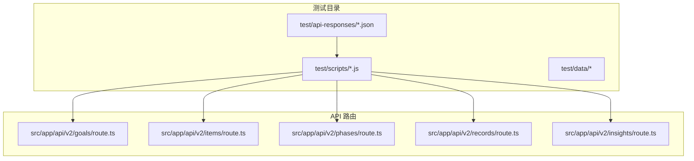
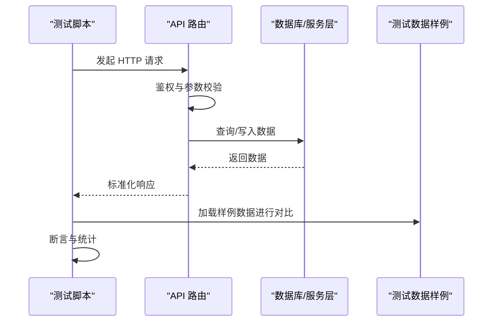
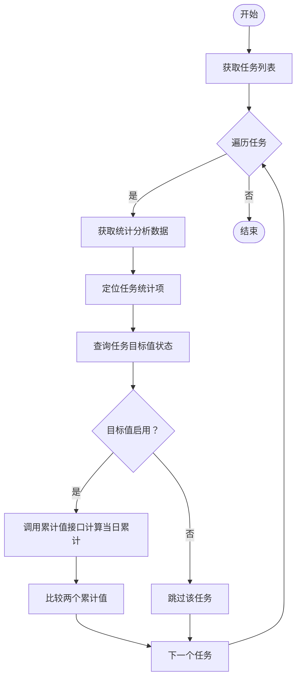
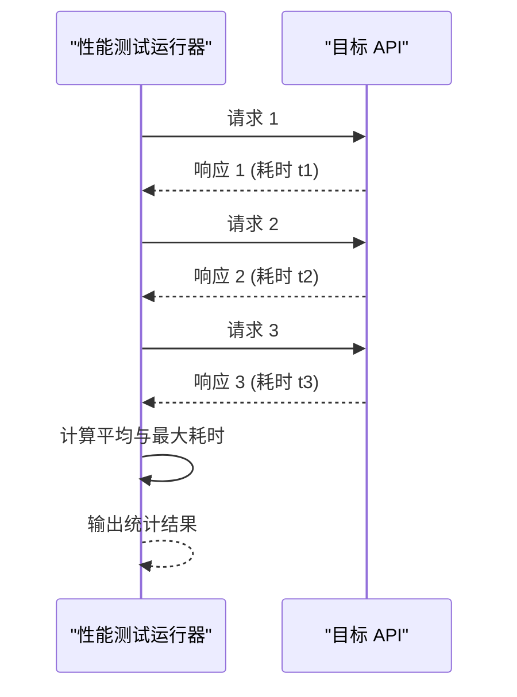
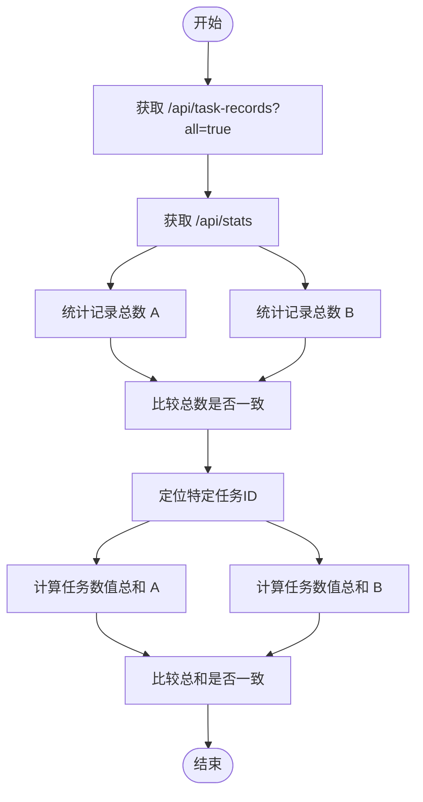
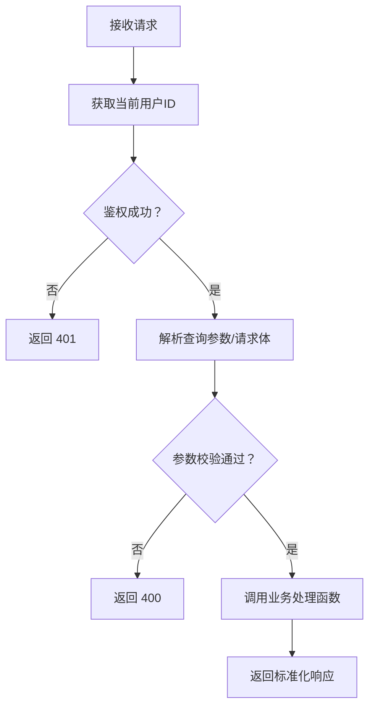
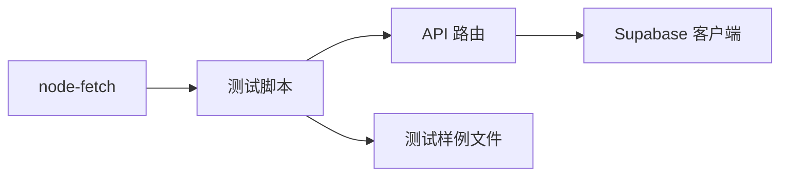

# 单元测试

<cite>
**本文引用的文件**
- [package.json](file://package.json)
- [README.md](file://README.md)
- [test/api-responses/api_response_raw.txt](file://test/api-responses/api_response_raw.txt)
- [test/api-responses/task_stats_only.json](file://test/api-responses/task_stats_only.json)
- [test/scripts/test-accumulated-values.js](file://test/scripts/test-accumulated-values.js)
- [test/scripts/test-api-performance.js](file://test/scripts/test-api-performance.js)
- [test/scripts/test-records.js](file://test/scripts/test-records.js)
- [src/app/api/v2/goals/route.ts](file://src/app/api/v2/goals/route.ts)
- [src/app/api/v2/insights/route.ts](file://src/app/api/v2/insights/route.ts)
- [src/app/api/v2/items/route.ts](file://src/app/api/v2/items/route.ts)
- [src/app/api/v2/records/route.ts](file://src/app/api/v2/records/route.ts)
- [src/app/api/v2/phases/route.ts](file://src/app/api/v2/phases/route.ts)
</cite>

## 目录
1. [简介](#简介)
2. [项目结构](#项目结构)
3. [核心组件](#核心组件)
4. [架构总览](#架构总览)
5. [详细组件分析](#详细组件分析)
6. [依赖分析](#依赖分析)
7. [性能考虑](#性能考虑)
8. [故障排查指南](#故障排查指南)
9. [结论](#结论)
10. [附录](#附录)

## 简介
本文件为 TETO 项目的单元测试与集成测试文档，聚焦于：
- 单元测试设计原则与实施方法
- 测试用例编写规范、断言方法与测试数据准备
- 核心业务逻辑、数据处理函数与工具函数的测试策略
- 使用 node-fetch 对 API 端点进行测试的方法
- 如何比较不同 API 返回数据的一致性
- 测试覆盖率要求与测试执行流程

本项目已具备基础的 API 端点测试脚本与测试数据资源，可作为单元测试与集成测试的良好起点。

## 项目结构
TETO 采用 Next.js App Router 架构，API 路由位于 src/app/api/v2 下，测试相关资源位于 test 目录，包含：
- API 响应样例：用于离线验证与对比
- 性能与一致性测试脚本：基于 node-fetch 的端到端验证

**图示来源**
- [test/scripts/test-accumulated-values.js:1-65](file://test/scripts/test-accumulated-values.js#L1-L65)
- [test/scripts/test-api-performance.js:1-82](file://test/scripts/test-api-performance.js#L1-L82)
- [test/scripts/test-records.js:1-57](file://test/scripts/test-records.js#L1-L57)
- [src/app/api/v2/goals/route.ts:1-49](file://src/app/api/v2/goals/route.ts#L1-L49)
- [src/app/api/v2/items/route.ts:1-47](file://src/app/api/v2/items/route.ts#L1-L47)
- [src/app/api/v2/phases/route.ts:1-72](file://src/app/api/v2/phases/route.ts#L1-L72)
- [src/app/api/v2/records/route.ts:1-86](file://src/app/api/v2/records/route.ts#L1-L86)
- [src/app/api/v2/insights/route.ts:1-32](file://src/app/api/v2/insights/route.ts#L1-L32)

**章节来源**
- [README.md:1-126](file://README.md#L1-L126)
- [package.json:1-44](file://package.json#L1-L44)

## 核心组件
- API 路由层：统一处理鉴权、参数校验、调用数据库层并返回标准化响应
- 测试脚本：基于 node-fetch 的端到端验证，覆盖性能与数据一致性
- 测试数据：离线样例文件，便于快速回归与对比

关键要点：
- 鉴权：多数路由通过 getCurrentUserId 获取当前用户，未登录返回 401
- 参数校验：对必填字段进行校验，非法请求返回 400
- 数据一致性：通过对比不同端点返回的同一类数据，确保统计口径一致

**章节来源**
- [src/app/api/v2/goals/route.ts:6-28](file://src/app/api/v2/goals/route.ts#L6-L28)
- [src/app/api/v2/items/route.ts:6-26](file://src/app/api/v2/items/route.ts#L6-L26)
- [src/app/api/v2/phases/route.ts:7-30](file://src/app/api/v2/phases/route.ts#L7-L30)
- [src/app/api/v2/records/route.ts:7-42](file://src/app/api/v2/records/route.ts#L7-L42)
- [src/app/api/v2/insights/route.ts:6-30](file://src/app/api/v2/insights/route.ts#L6-L30)

## 架构总览
下图展示了测试脚本与 API 路由之间的交互关系，以及测试数据的来源。

**图示来源**
- [test/scripts/test-accumulated-values.js:4-63](file://test/scripts/test-accumulated-values.js#L4-L63)
- [test/scripts/test-api-performance.js:8-79](file://test/scripts/test-api-performance.js#L8-L79)
- [test/scripts/test-records.js:4-56](file://test/scripts/test-records.js#L4-L56)
- [src/app/api/v2/records/route.ts:44-85](file://src/app/api/v2/records/route.ts#L44-L85)

## 详细组件分析

### 测试脚本：累计值一致性比较
该脚本用于验证统计分析页面与“今日记录”页面的累计值是否一致，核心流程如下：

**图示来源**
- [test/scripts/test-accumulated-values.js:4-63](file://test/scripts/test-accumulated-values.js#L4-L63)

**章节来源**
- [test/scripts/test-accumulated-values.js:1-65](file://test/scripts/test-accumulated-values.js#L1-L65)

### 测试脚本：API 性能测试
该脚本对多个页面的关键 API 进行三次请求取平均耗时，并输出最慢耗时，帮助识别性能瓶颈。

**图示来源**
- [test/scripts/test-api-performance.js:47-79](file://test/scripts/test-api-performance.js#L47-L79)

**章节来源**
- [test/scripts/test-api-performance.js:1-82](file://test/scripts/test-api-performance.js#L1-L82)

### 测试脚本：记录数据一致性比较
该脚本对比 /api/task-records?all=true 与 /api/stats 的记录数量与特定任务的数值总和，确保统计口径一致。

**图示来源**
- [test/scripts/test-records.js:4-56](file://test/scripts/test-records.js#L4-L56)

**章节来源**
- [test/scripts/test-records.js:1-57](file://test/scripts/test-records.js#L1-L57)

### API 路由：通用鉴权与参数校验
所有 API 路由遵循统一的鉴权与参数校验模式：
- 鉴权：通过 getCurrentUserId 获取当前用户，未登录返回 401
- 参数校验：对必填字段进行校验，非法请求返回 400
- 错误处理：捕获异常并返回 500，同时区分认证错误与业务错误

**图示来源**
- [src/app/api/v2/goals/route.ts:6-28](file://src/app/api/v2/goals/route.ts#L6-L28)
- [src/app/api/v2/items/route.ts:6-26](file://src/app/api/v2/items/route.ts#L6-L26)
- [src/app/api/v2/phases/route.ts:7-30](file://src/app/api/v2/phases/route.ts#L7-L30)
- [src/app/api/v2/records/route.ts:7-42](file://src/app/api/v2/records/route.ts#L7-L42)
- [src/app/api/v2/insights/route.ts:6-30](file://src/app/api/v2/insights/route.ts#L6-L30)

**章节来源**
- [src/app/api/v2/goals/route.ts:1-49](file://src/app/api/v2/goals/route.ts#L1-L49)
- [src/app/api/v2/insights/route.ts:1-32](file://src/app/api/v2/insights/route.ts#L1-L32)
- [src/app/api/v2/items/route.ts:1-47](file://src/app/api/v2/items/route.ts#L1-L47)
- [src/app/api/v2/records/route.ts:1-86](file://src/app/api/v2/records/route.ts#L1-L86)
- [src/app/api/v2/phases/route.ts:1-72](file://src/app/api/v2/phases/route.ts#L1-L72)

## 依赖分析
- 测试依赖：node-fetch 用于发起 HTTP 请求
- 项目依赖：Next.js、Supabase、React、Tailwind CSS 等
- 测试数据依赖：test/api-responses 下的样例文件

**图示来源**
- [package.json:25-31](file://package.json#L25-L31)
- [test/scripts/test-accumulated-values.js](file://test/scripts/test-accumulated-values.js#L2)
- [test/scripts/test-api-performance.js](file://test/scripts/test-api-performance.js#L2)
- [test/scripts/test-records.js](file://test/scripts/test-records.js#L2)

**章节来源**
- [package.json:1-44](file://package.json#L1-L44)

## 性能考虑
- 多次请求取平均值：减少单次波动影响
- 超时阈值：超过 1000ms/2000ms 提示注意
- 关注慢接口：优先优化高频调用的统计类接口

**章节来源**
- [test/scripts/test-api-performance.js:66-76](file://test/scripts/test-api-performance.js#L66-L76)

## 故障排查指南
- 鉴权失败：确认登录态与用户 ID 获取逻辑
- 参数缺失：检查必填字段与查询参数格式
- 数据不一致：核对统计口径与过滤条件
- 网络超时：检查本地服务是否启动与端口占用

**章节来源**
- [src/app/api/v2/goals/route.ts:21-27](file://src/app/api/v2/goals/route.ts#L21-L27)
- [src/app/api/v2/records/route.ts:49-55](file://src/app/api/v2/records/route.ts#L49-L55)
- [test/scripts/test-records.js:22-26](file://test/scripts/test-records.js#L22-L26)

## 结论
本项目已具备完善的 API 端点测试脚本与测试数据样例，建议在此基础上补充：
- 单元测试：针对工具函数与数据处理函数进行独立测试
- 集成测试：结合 Supabase 本地环境进行端到端验证
- 覆盖率：逐步提升核心模块的测试覆盖率
- 自动化：将测试脚本纳入 CI/CD 流程

## 附录

### 测试用例编写规范
- 命名规范：描述性命名，明确输入、期望与边界条件
- 断言方法：等值断言、类型断言、范围断言、异常断言
- 测试数据：使用样例文件与最小化构造，避免外部依赖
- 场景覆盖：正常路径、边界值、异常路径、并发场景

### 测试数据准备
- 使用 test/api-responses 下的样例文件进行离线验证
- 对比不同端点返回的同一类数据，确保统计口径一致
- 生成随机但可重现的测试数据，便于回归测试

### API 端点测试示例路径
- 累计值一致性比较：[test/scripts/test-accumulated-values.js:1-65](file://test/scripts/test-accumulated-values.js#L1-L65)
- API 性能测试：[test/scripts/test-api-performance.js:1-82](file://test/scripts/test-api-performance.js#L1-L82)
- 记录数据一致性比较：[test/scripts/test-records.js:1-57](file://test/scripts/test-records.js#L1-L57)

### 测试覆盖率要求（建议）
- 业务核心函数：≥ 80%
- 工具函数与数据处理：≥ 90%
- API 路由层：≥ 70%
- UI 组件：根据复杂度设定（建议 ≥ 60%）