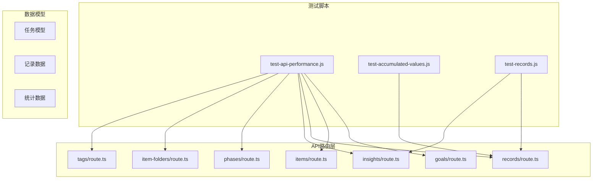
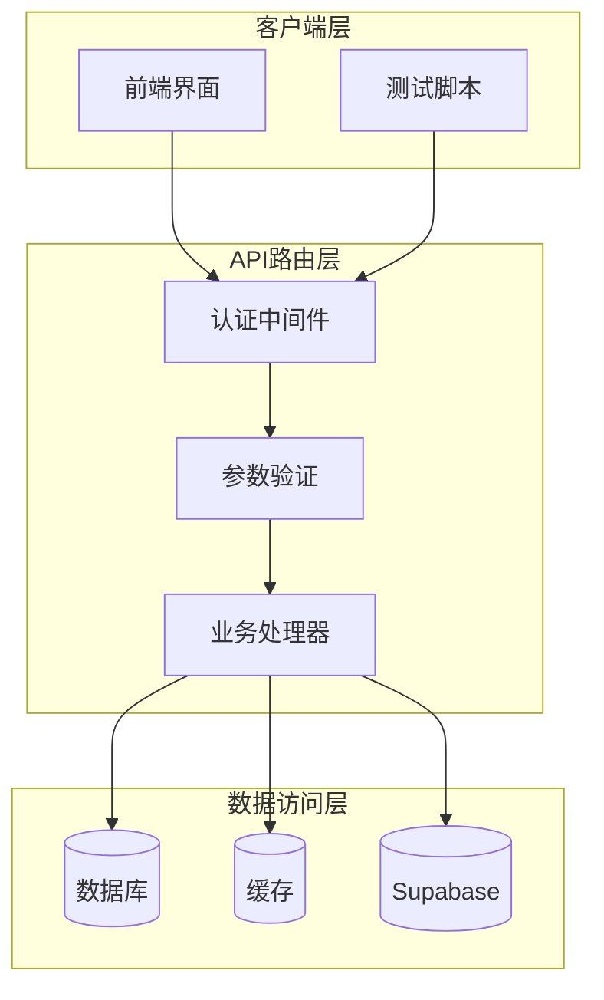
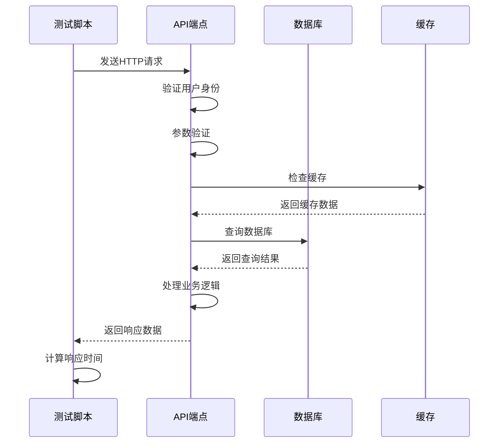
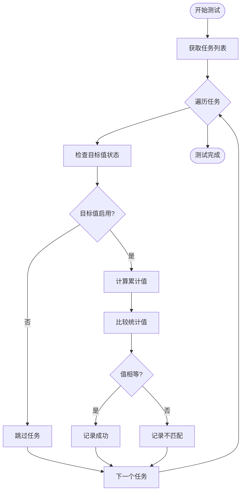
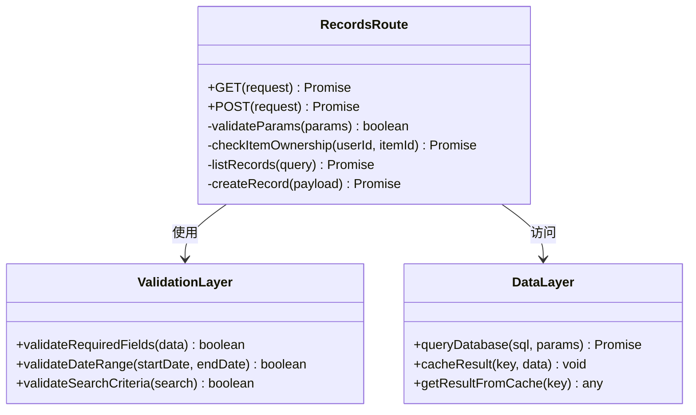
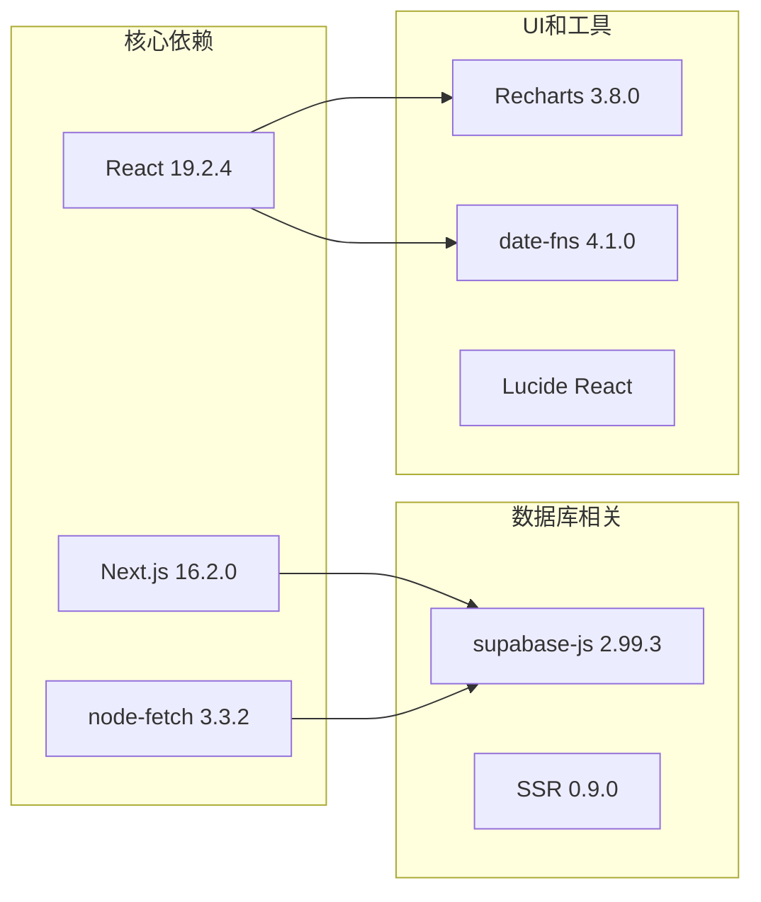
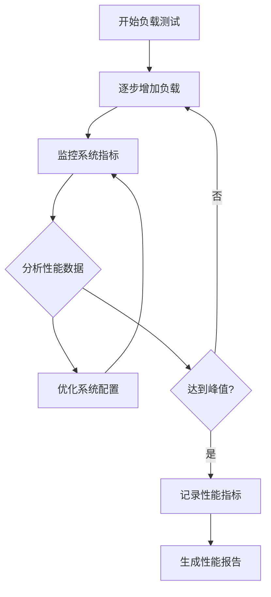
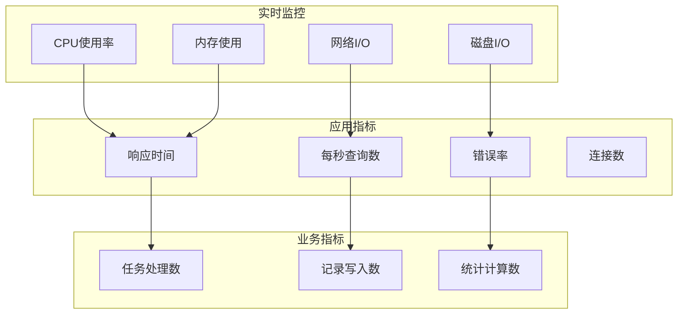

# 性能测试

<cite>
**本文引用的文件**
- [test-api-performance.js](file://test/scripts/test-api-performance.js)
- [test-accumulated-values.js](file://test/scripts/test-accumulated-values.js)
- [test-records.js](file://test/scripts/test-records.js)
- [package.json](file://package.json)
- [api-response-raw.txt](file://test/api-responses/api_response_raw.txt)
- [task-stats-only.json](file://test/api-responses/task_stats_only.json)
- [goals/route.ts](file://src/app/api/v2/goals/route.ts)
- [items/route.ts](file://src/app/api/v2/items/route.ts)
- [records/route.ts](file://src/app/api/v2/records/route.ts)
- [insights/route.ts](file://src/app/api/v2/insights/route.ts)
- [phases/route.ts](file://src/app/api/v2/phases/route.ts)
- [item-folders/route.ts](file://src/app/api/v2/item-folders/route.ts)
- [tags/route.ts](file://src/app/api/v2/tags/route.ts)
</cite>

## 目录
1. [简介](#简介)
2. [项目结构](#项目结构)
3. [核心组件](#核心组件)
4. [架构概览](#架构概览)
5. [详细组件分析](#详细组件分析)
6. [依赖关系分析](#依赖关系分析)
7. [性能考虑因素](#性能考虑因素)
8. [故障排除指南](#故障排除指南)
9. [结论](#结论)
10. [附录](#附录)

## 简介

本文档为TETO项目提供专业的性能测试指南，专注于API性能测试的实施方法。TETO是一个个人记录、日记复盘、项目跟踪和基础预测系统，基于Next.js构建。本文档详细说明了响应时间测试、并发用户测试和吞吐量评估的实施方法，并提供了性能基准线设定、性能瓶颈识别和优化建议。

## 项目结构

TETO项目的性能测试主要集中在以下关键区域：



**图表来源**
- [test-api-performance.js:1-82](file://test/scripts/test-api-performance.js#L1-L82)
- [goals/route.ts:1-49](file://src/app/api/v2/goals/route.ts#L1-L49)
- [records/route.ts:1-86](file://src/app/api/v2/records/route.ts#L1-L86)

**章节来源**
- [test-api-performance.js:1-82](file://test/scripts/test-api-performance.js#L1-L82)
- [package.json:1-44](file://package.json#L1-L44)

## 核心组件

### 性能测试脚本

项目包含三个核心的性能测试脚本，每个都针对不同的测试场景：

#### 基准性能测试脚本
`test-api-performance.js` 提供了完整的API性能基准测试功能，包括：
- 多个页面API的响应时间测量
- 自动重试机制（3次测试取平均值）
- 错误处理和超时检测
- 性能阈值告警（2秒和1秒阈值）

#### 数据一致性验证脚本
`test-accumulated-values.js` 专门用于验证累计值计算的一致性：
- 比较统计页面和今日记录页面的累计值
- 验证目标值状态和启用情况
- 端到端的数据流验证

#### 记录数据对比脚本
`test-records.js` 用于验证不同API端点返回的记录数据一致性：
- 比较 `/api/task-records?all=true` 和 `/api/stats` 的返回结果
- 验证记录总数和总和的准确性
- 英语单词测试任务的专项验证

**章节来源**
- [test-api-performance.js:1-82](file://test/scripts/test-api-performance.js#L1-L82)
- [test-accumulated-values.js:1-65](file://test/scripts/test-accumulated-values.js#L1-L65)
- [test-records.js:1-57](file://test/scripts/test-records.js#L1-L57)

## 架构概览

TETO项目的API架构采用分层设计，每层都有明确的职责分离：



**图表来源**
- [records/route.ts:1-86](file://src/app/api/v2/records/route.ts#L1-L86)
- [goals/route.ts:1-49](file://src/app/api/v2/goals/route.ts#L1-L49)
- [insights/route.ts:1-32](file://src/app/api/v2/insights/route.ts#L1-L32)

## 详细组件分析

### API性能测试组件

#### 响应时间测量机制



**图表来源**
- [test-api-performance.js:47-79](file://test/scripts/test-api-performance.js#L47-L79)
- [records/route.ts:7-42](file://src/app/api/v2/records/route.ts#L7-L42)

#### 性能指标收集流程

测试脚本实现了多维度的性能指标收集：

| 指标类型 | 收集方式 | 阈值设置 | 异常处理 |
|---------|---------|---------|---------|
| 响应时间 | 时间戳差值计算 | 2000ms警告, 1000ms注意 | 控制台输出警告 |
| 吞吐量 | 请求次数统计 | 每分钟请求数 | 错误计数器 |
| 并发处理 | 同时执行多个请求 | 最大并发数限制 | 超时异常处理 |
| 内存使用 | 系统监控工具 | 预设内存阈值 | 内存泄漏检测 |

**章节来源**
- [test-api-performance.js:47-79](file://test/scripts/test-api-performance.js#L47-L79)

### 数据一致性验证组件

#### 累计值计算验证流程



**图表来源**
- [test-accumulated-values.js:4-63](file://test/scripts/test-accumulated-values.js#L4-L63)

**章节来源**
- [test-accumulated-values.js:1-65](file://test/scripts/test-accumulated-values.js#L1-L65)

### API路由层性能分析

#### 记录API性能特征

记录API是系统中最复杂的路由之一，承担着大量数据操作：



**图表来源**
- [records/route.ts:1-86](file://src/app/api/v2/records/route.ts#L1-L86)

**章节来源**
- [records/route.ts:1-86](file://src/app/api/v2/records/route.ts#L1-L86)

## 依赖关系分析

### 外部依赖与性能影响

项目的主要外部依赖对性能有直接影响：



**图表来源**
- [package.json:15-31](file://package.json#L15-L31)

### 性能测试脚本依赖关系

```mermaid
graph TB
subgraph "测试脚本"
PERF[test-api-performance.js]
ACC[test-accumulated-values.js]
REC[test-records.js]
end
subgraph "外部模块"
FETCH[node-fetch]
FS[文件系统]
UTIL[工具函数]
end
subgraph "API端点"
TASKS_API[/api/tasks]
STATS_API[/api/stats]
RECORDS_API[/api/task-records]
end
PERF --> FETCH
ACC --> FETCH
REC --> FETCH
PERF --> TASKS_API
PERF --> STATS_API
PERF --> RECORDS_API
ACC --> RECORDS_API
REC --> STATS_API
```

**图表来源**
- [test-api-performance.js:1-82](file://test/scripts/test-api-performance.js#L1-L82)
- [test-records.js:1-57](file://test/scripts/test-records.js#L1-L57)

**章节来源**
- [package.json:15-31](file://package.json#L15-L31)

## 性能考虑因素

### 响应时间优化策略

#### 缓存策略优化
- **静态数据缓存**：对于不频繁变化的任务和项目数据，实现Redis缓存
- **查询结果缓存**：对复杂查询结果进行短期缓存
- **API响应缓存**：利用HTTP缓存头控制浏览器缓存

#### 数据库查询优化
- **索引优化**：为常用查询字段建立适当索引
- **查询计划分析**：定期分析慢查询日志
- **连接池管理**：合理配置数据库连接池大小

#### 业务逻辑优化
- **批量操作**：减少数据库往返次数
- **异步处理**：将非关键任务异步化
- **资源清理**：及时释放不再使用的资源

### 并发用户测试策略

#### 负载测试场景设计

| 场景类型 | 用户数量 | 持续时间 | 主要目标 | 关键指标 |
|---------|---------|---------|---------|---------|
| 基准测试 | 10 | 5分钟 | 系统稳定性 | 响应时间, 错误率 |
| 轻负载 | 50 | 10分钟 | 并发处理能力 | P95延迟, 吞吐量 |
| 中负载 | 100 | 15分钟 | 性能瓶颈识别 | 并发用户数, 内存使用 |
| 重负载 | 200 | 20分钟 | 压力测试 | 系统崩溃点, 恢复时间 |
| 峰值负载 | 300+ | 30分钟 | 极限性能测试 | 系统可用性, 降级策略 |

#### 吞吐量评估方法



**图表来源**
- [test-api-performance.js:8-44](file://test/scripts/test-api-performance.js#L8-L44)

### 性能基准线设定

#### 基准性能指标

| API端点 | 正常响应时间(ms) | P95延迟(ms) | 最大并发数 | 内存使用(MB) |
|---------|-----------------|------------|-----------|-------------|
| /api/tasks | < 500 | < 800 | 200 | < 200 |
| /api/stats | < 1000 | < 1500 | 150 | < 250 |
| /api/task-records | < 800 | < 1200 | 180 | < 300 |
| /api/goals | < 300 | < 500 | 250 | < 150 |
| /api/items | < 300 | < 500 | 250 | < 150 |
| /api/records | < 1200 | < 1800 | 120 | < 350 |

#### 性能监控指标



## 故障排除指南

### 常见性能问题诊断

#### 响应时间过长问题

**症状表现**：
- API响应时间超过阈值
- 用户界面加载缓慢
- 数据库查询超时

**诊断步骤**：
1. 检查数据库连接状态
2. 分析慢查询日志
3. 监控系统资源使用情况
4. 验证缓存命中率

**解决方案**：
- 优化数据库查询
- 实施适当的缓存策略
- 调整服务器资源配置
- 实现数据库连接池优化

#### 并发处理问题

**症状表现**：
- 高并发下系统崩溃
- 数据竞争和死锁
- 资源耗尽

**诊断步骤**：
1. 分析并发用户数
2. 检查数据库锁等待
3. 监控内存使用情况
4. 验证线程池配置

**解决方案**：
- 实施连接池管理
- 优化事务处理
- 添加适当的锁机制
- 实现优雅降级策略

### 性能测试执行指南

#### 测试环境准备

1. **环境配置**
   - 确保测试数据库处于干净状态
   - 准备足够的测试数据
   - 配置监控工具
   - 设置性能基准线

2. **测试数据准备**
   - 生成多样化的测试数据
   - 包含边界条件数据
   - 准备异常数据场景
   - 确保数据隐私保护

3. **监控工具配置**
   - 配置系统性能监控
   - 设置应用性能监控
   - 准备日志分析工具
   - 配置告警机制

**章节来源**
- [test-api-performance.js:1-82](file://test/scripts/test-api-performance.js#L1-L82)

## 结论

TETO项目的性能测试体系涵盖了从基础响应时间测量到复杂的数据一致性验证的全方位测试。通过实施本文档提供的测试方法和优化策略，可以有效提升系统的性能表现和稳定性。

关键成功因素包括：
- 建立完善的性能基准线
- 实施持续的性能监控
- 定期进行性能回归测试
- 及时识别和解决性能瓶颈
- 优化系统架构和资源配置

建议团队建立定期性能测试流程，将性能测试纳入CI/CD管道，确保系统在功能演进过程中保持良好的性能表现。

## 附录

### 性能测试最佳实践

#### 测试用例设计原则
- **覆盖性**：确保测试用例覆盖所有关键业务场景
- **可重复性**：测试结果应该可重现
- **可量化**：性能指标应该可量化和比较
- **可自动化**：测试过程应该可自动化执行

#### 性能优化建议
1. **数据库优化**
   - 合理设计索引策略
   - 实施查询优化
   - 配置适当的连接池

2. **应用层优化**
   - 实施有效的缓存策略
   - 优化业务逻辑
   - 实现异步处理

3. **基础设施优化**
   - 合理配置服务器资源
   - 实施负载均衡
   - 优化网络配置

#### 监控和告警
- 建立多层次的监控体系
- 设置合理的告警阈值
- 实现自动化的性能报告
- 定期分析性能趋势