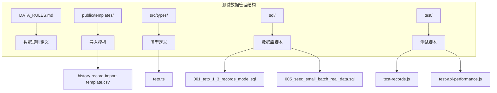
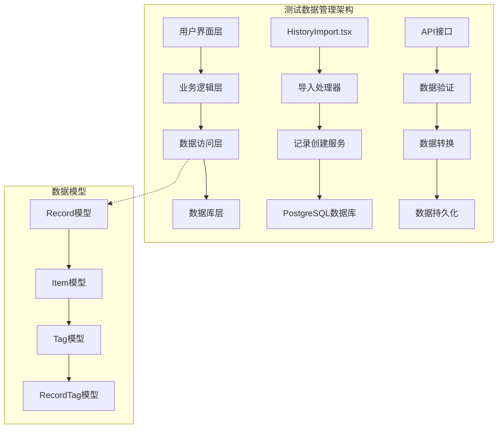
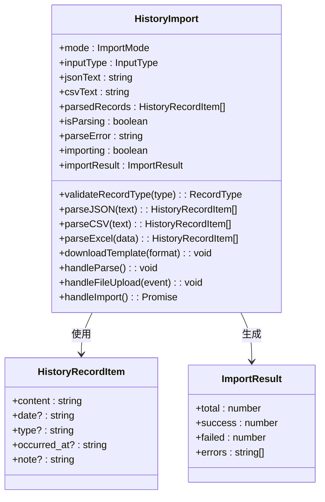
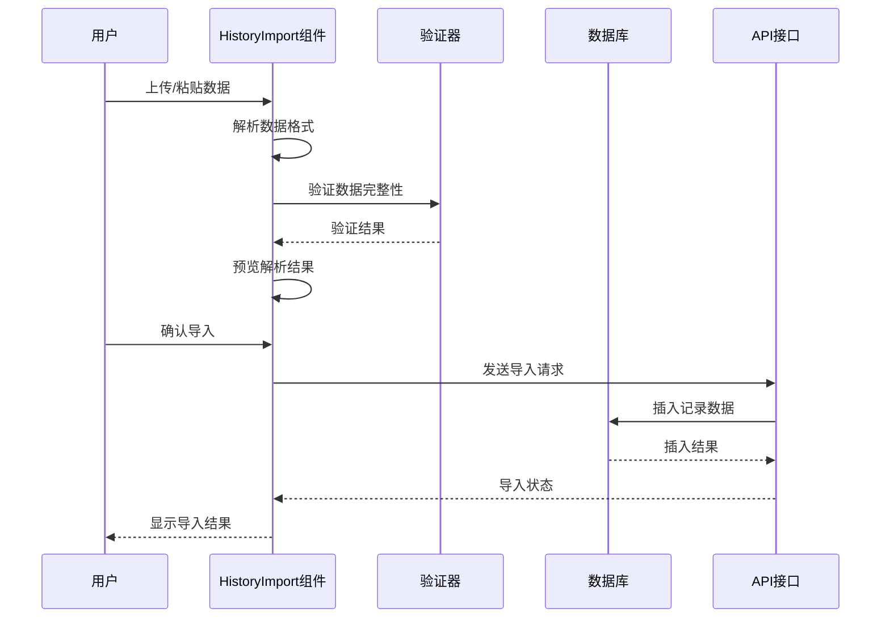
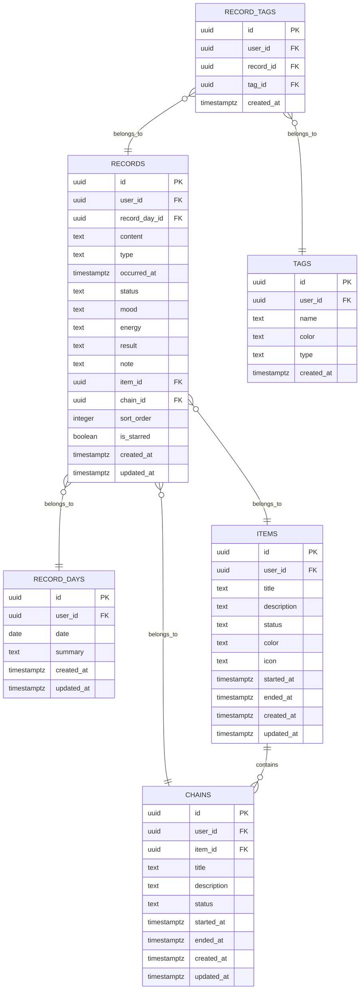
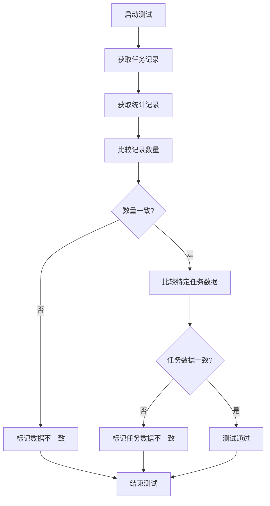
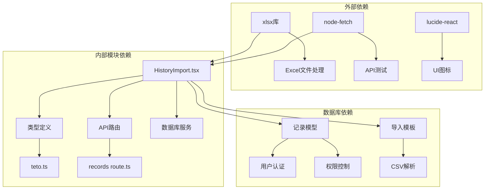

# 测试数据管理

<cite>
**本文档引用的文件**
- [DATA_RULES.md](file://DATA_RULES.md)
- [history-record-import-template.csv](file://public/templates/history-record-import-template.csv)
- [HistoryImport.tsx](file://src/app/(dashboard)/items/components/HistoryImport.tsx)
- [teto.ts](file://src/types/teto.ts)
- [001_teto_1_3_records_model.sql](file://sql/001_teto_1_3_records_model.sql)
- [005_seed_small_batch_real_data.sql](file://sql/保留存档sql/sql1.0.0/005_seed_small_batch_real_data.sql)
- [test-records.js](file://test/scripts/test-records.js)
- [test-api-performance.js](file://test/scripts/test-api-performance.js)
- [api_response_raw.txt](file://test/api-responses/api_response_raw.txt)
- [records route.ts](file://src/app/api/v2/records/route.ts)
</cite>

## 目录
1. [简介](#简介)
2. [项目结构](#项目结构)
3. [核心组件](#核心组件)
4. [架构概览](#架构概览)
5. [详细组件分析](#详细组件分析)
6. [依赖分析](#依赖分析)
7. [性能考虑](#性能考虑)
8. [故障排除指南](#故障排除指南)
9. [结论](#结论)

## 简介

TETO项目的测试数据管理是一个综合性的数据管理系统，旨在为应用程序提供可靠的测试数据支持。该系统涵盖了从数据准备、组织到维护的完整生命周期管理，包括模拟数据集创建、导入模板使用、数据清理流程以及版本控制等关键功能。

系统的核心目标是确保测试数据的质量、一致性和可维护性，同时提供灵活的数据导入和导出机制。通过严格的规则定义和自动化工具，TETO项目实现了测试数据的标准化管理和高效维护。

## 项目结构

TETO项目的测试数据管理采用模块化的文件组织结构，主要包含以下几个核心部分：

**图表来源**
- [DATA_RULES.md:1-174](file://DATA_RULES.md#L1-L174)
- [history-record-import-template.csv:1-3](file://public/templates/history-record-import-template.csv#L1-L3)
- [teto.ts:1-516](file://src/types/teto.ts#L1-L516)

**章节来源**
- [DATA_RULES.md:1-174](file://DATA_RULES.md#L1-L174)
- [history-record-import-template.csv:1-3](file://public/templates/history-record-import-template.csv#L1-L3)

## 核心组件

### 数据规则引擎

TETO项目建立了完整的数据规则体系，定义了数据真源、页面职责、时间规则等多个维度的规范。这些规则确保了测试数据的一致性和准确性。

**数据真源定义**：
- 任务管理作为配置真源，负责存储任务名称、类型、单位等基础配置信息
- 今日记录作为原始事实真源，记录具体的完成状态和数值
- 记录总表作为查看入口，不存储独立的统计数据
- 统计分析基于任务配置和原始记录统一计算得出

**页面职责划分**：
- 今日记录页专注于当天内容记录
- 记录总表提供全部原始记录的展示
- 任务管理页负责配置任务规则
- 统计分析页进行聚合分析计算

### 导入模板系统

系统提供了灵活的导入模板支持，包括CSV和Excel格式的模板文件，确保用户可以方便地导入历史数据。

**模板特性**：
- 支持多种数据格式（JSON、CSV、Excel）
- 提供自动格式检测和解析
- 包含完整的字段映射和验证机制
- 支持批量数据导入和错误处理

### 数据类型定义

通过TypeScript接口定义了完整的数据结构，确保前端和后端数据传输的一致性。

**核心数据类型**：
- Record接口定义了记录的基本结构
- Item接口描述了事项的属性
- Tag接口管理标签系统
- 各种查询参数类型支持灵活的数据检索

**章节来源**
- [DATA_RULES.md:1-174](file://DATA_RULES.md#L1-L174)
- [teto.ts:1-516](file://src/types/teto.ts#L1-L516)

## 架构概览

TETO项目的测试数据管理采用分层架构设计，从数据定义到业务逻辑再到用户界面形成了完整的数据处理链路。

**图表来源**
- [HistoryImport.tsx](file://src/app/(dashboard)/items/components/HistoryImport.tsx#L1-L783)
- [records route.ts:1-86](file://src/app/api/v2/records/route.ts#L1-L86)
- [001_teto_1_3_records_model.sql:1-300](file://sql/001_teto_1_3_records_model.sql#L1-L300)

## 详细组件分析

### 历史记录导入组件

HistoryImport组件是测试数据管理的核心组件之一，提供了完整的数据导入功能，支持多种数据格式和验证机制。

**图表来源**
- [HistoryImport.tsx](file://src/app/(dashboard)/items/components/HistoryImport.tsx#L1-L783)

**组件功能特性**：

**数据格式支持**：
- JSON格式：支持数组格式的记录数据
- CSV格式：标准CSV格式解析，支持RFC 4180兼容
- Excel格式：.xlsx文件解析，支持多工作表

**验证机制**：
- 自动格式检测和识别
- 字段完整性验证
- 数据类型验证
- 错误处理和用户反馈

**导入流程**：

**图表来源**
- [HistoryImport.tsx](file://src/app/(dashboard)/items/components/HistoryImport.tsx#L296-L361)

**章节来源**
- [HistoryImport.tsx](file://src/app/(dashboard)/items/components/HistoryImport.tsx#L1-L783)

### 数据库模型设计

TETO项目采用了规范化的数据库设计，建立了完整的数据模型来支持测试数据管理。

**图表来源**
- [001_teto_1_3_records_model.sql:15-109](file://sql/001_teto_1_3_records_model.sql#L15-L109)

**数据库特性**：

**关系设计**：
- 一对一关系：record_days与records
- 一对多关系：items与chains、chains与records
- 多对多关系：records与tags

**约束和索引**：
- 外键约束确保数据完整性
- 唯一约束防止重复数据
- 复合索引优化查询性能

**章节来源**
- [001_teto_1_3_records_model.sql:1-300](file://sql/001_teto_1_3_records_model.sql#L1-L300)

### 测试数据脚本

项目提供了多种测试脚本来验证数据的一致性和性能表现。

**数据一致性测试**：

**图表来源**
- [test-records.js:1-57](file://test/scripts/test-records.js#L1-L57)

**性能测试脚本**：
测试脚本通过多次调用API接口来测量响应时间和性能表现，确保系统在高负载下的稳定性。

**章节来源**
- [test-records.js:1-57](file://test/scripts/test-records.js#L1-L57)
- [test-api-performance.js:1-82](file://test/scripts/test-api-performance.js#L1-L82)

## 依赖分析

TETO项目的测试数据管理涉及多个层面的依赖关系，从外部库到内部模块都有明确的依赖结构。

**图表来源**
- [HistoryImport.tsx](file://src/app/(dashboard)/items/components/HistoryImport.tsx#L1-L10)
- [records route.ts:1-6](file://src/app/api/v2/records/route.ts#L1-L6)

**依赖特点**：

**前端依赖**：
- xlsx库用于Excel文件处理
- lucide-react提供图标支持
- react hooks实现状态管理

**后端依赖**：
- Supabase客户端用于数据库操作
- Next.js API路由处理HTTP请求
- TypeScript提供类型安全保障

**数据库依赖**：
- PostgreSQL作为主数据库
- RLS策略实现数据安全
- 触发器确保数据一致性

**章节来源**
- [HistoryImport.tsx](file://src/app/(dashboard)/items/components/HistoryImport.tsx#L1-L10)
- [records route.ts:1-6](file://src/app/api/v2/records/route.ts#L1-L6)

## 性能考虑

TETO项目的测试数据管理在设计时充分考虑了性能优化，通过多种技术手段确保系统的高效运行。

**数据库性能优化**：
- 复合索引设计：在user_id和date组合上建立索引，优化查询性能
- 触发器自动更新：统一管理updated_at字段，减少重复代码
- RLS策略：在数据库层面实现数据安全，避免应用层额外开销

**API性能优化**：
- 缓存策略：合理使用浏览器缓存和CDN加速
- 分页查询：支持大数据量的分页处理
- 异步处理：导入操作采用异步处理，避免阻塞

**前端性能优化**：
- 懒加载：组件按需加载，减少初始包大小
- 虚拟滚动：大量数据展示时使用虚拟滚动技术
- 错误边界：提供友好的错误处理和降级方案

## 故障排除指南

### 常见问题及解决方案

**数据导入失败**：
1. 检查数据格式是否符合要求
2. 验证必填字段是否完整
3. 确认用户权限是否正确
4. 查看错误日志获取详细信息

**API调用错误**：
1. 检查网络连接状态
2. 验证API端点地址
3. 确认请求参数格式
4. 查看服务器响应状态码

**数据库连接问题**：
1. 检查数据库服务状态
2. 验证连接字符串配置
3. 确认用户权限设置
4. 查看数据库日志

**性能问题排查**：
1. 使用性能测试脚本测量响应时间
2. 分析数据库查询执行计划
3. 检查索引使用情况
4. 监控系统资源使用情况

**章节来源**
- [test-api-performance.js:46-82](file://test/scripts/test-api-performance.js#L46-L82)

## 结论

TETO项目的测试数据管理通过系统化的架构设计和完善的工具链，为测试数据的创建、组织和维护提供了全面的解决方案。系统的核心优势包括：

**完整性保障**：通过严格的数据规则定义和验证机制，确保测试数据的准确性和一致性。

**灵活性支持**：提供多种数据格式支持和灵活的导入导出机制，适应不同的测试场景需求。

**可维护性**：采用模块化的设计和清晰的依赖关系，便于系统的维护和扩展。

**性能优化**：通过数据库优化、API设计和前端性能技术，确保系统的高效运行。

**安全性保证**：通过RLS策略和权限控制，确保测试数据的安全性和隔离性。

该系统为TETO项目的持续开发和测试提供了坚实的数据基础，支持团队进行高效的测试和验证工作。通过不断完善和优化，测试数据管理系统将继续为项目的成功提供有力支撑。