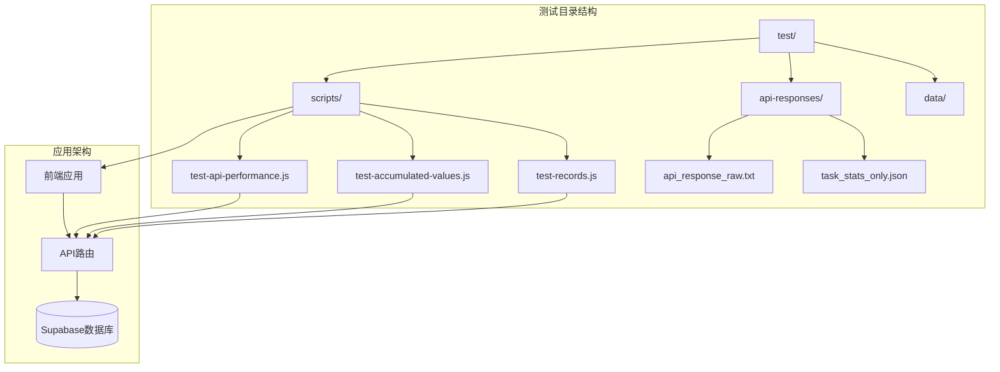
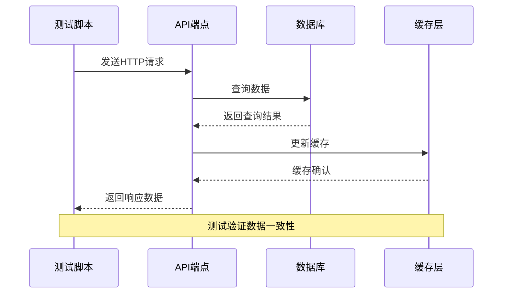
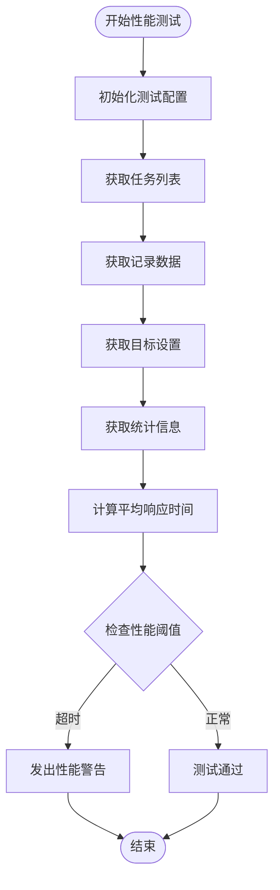
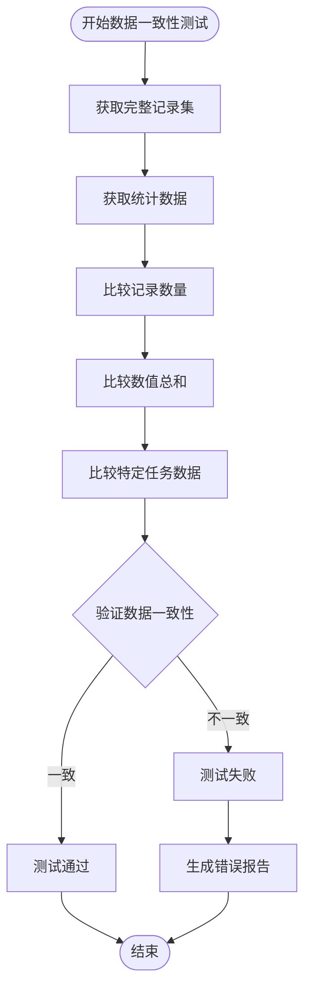
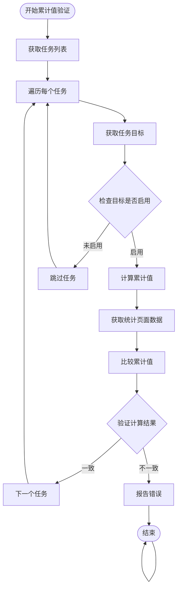
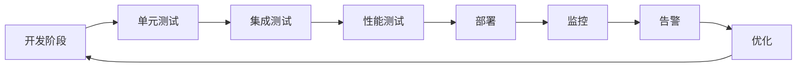

# 测试策略规范

<cite>
**本文档引用的文件**
- [package.json](file://package.json)
- [README.md](file://README.md)
- [test-accumulated-values.js](file://test/scripts/test-accumulated-values.js)
- [test-api-performance.js](file://test/scripts/test-api-performance.js)
- [test-records.js](file://test/scripts/test-records.js)
- [api_response_raw.txt](file://test/api-responses/api_response_raw.txt)
- [task_stats_only.json](file://test/api-responses/task_stats_only.json)
</cite>

## 目录
1. [引言](#引言)
2. [项目结构](#项目结构)
3. [核心组件](#核心组件)
4. [架构概览](#架构概览)
5. [详细组件分析](#详细组件分析)
6. [依赖关系分析](#依赖关系分析)
7. [性能考虑](#性能考虑)
8. [故障排除指南](#故障排除指南)
9. [结论](#结论)

## 引言

本测试策略规范文档为TETO项目制定全面的测试实施指南，涵盖单元测试、集成测试、API测试和性能测试的完整策略。TETO是一个基于Next.js 16.2.0的个人效率追踪系统，采用TypeScript、Tailwind CSS、Supabase认证和PostgreSQL数据库技术栈。

该项目目前包含个人记录、日记复盘、项目管理和统计分析等核心功能模块。测试策略将重点关注API接口测试、数据库操作验证、前端组件交互测试以及性能基准测试。

## 项目结构

TETO项目的测试基础设施主要分布在以下目录结构中：



**图表来源**
- [test-accumulated-values.js:1-65](file://test/scripts/test-accumulated-values.js#L1-L65)
- [test-api-performance.js:1-82](file://test/scripts/test-api-performance.js#L1-L82)
- [test-records.js:1-57](file://test/scripts/test-records.js#L1-L57)

项目采用分层架构设计，测试脚本直接与API端点交互，模拟真实用户场景进行验证。

**章节来源**
- [package.json:1-44](file://package.json#L1-L44)
- [README.md:1-126](file://README.md#L1-L126)

## 核心组件

### 测试脚本组件

项目现有的测试脚本提供了完整的API测试框架：

1. **性能测试脚本** (`test-api-performance.js`)
   - 测量各页面API的响应时间
   - 支持多次请求取平均值
   - 提供性能阈值警告机制

2. **累计值验证脚本** (`test-accumulated-values.js`)
   - 比较统计页面与记录页面的累计值一致性
   - 验证目标值计算逻辑
   - 支持多任务场景测试

3. **数据一致性测试脚本** (`test-records.js`)
   - 对比不同API端点返回的记录数据
   - 验证数据聚合计算准确性
   - 支持特定任务类型的专项测试

### 测试数据组件

测试数据采用JSON格式存储，包含：
- 实际API响应示例
- 统计数据格式样本
- 测试用例输入数据

**章节来源**
- [test-accumulated-values.js:1-65](file://test/scripts/test-accumulated-values.js#L1-L65)
- [test-api-performance.js:1-82](file://test/scripts/test-api-performance.js#L1-L82)
- [test-records.js:1-57](file://test/scripts/test-records.js#L1-L57)

## 架构概览

TETO项目的测试架构采用客户端-服务端分离模式：



**图表来源**
- [test-api-performance.js:8-44](file://test/scripts/test-api-performance.js#L8-L44)

该架构确保了测试的独立性和可重复性，测试脚本可以直接调用API端点进行验证。

## 详细组件分析

### API性能测试组件

性能测试组件提供了全面的响应时间监控机制：



**图表来源**
- [test-api-performance.js:8-44](file://test/scripts/test-api-performance.js#L8-L44)

性能测试关注以下关键指标：
- 响应时间分布（平均值、最大值）
- API端点可用性
- 数据加载效率
- 缓存命中率影响

**章节来源**
- [test-api-performance.js:1-82](file://test/scripts/test-api-performance.js#L1-L82)

### 数据一致性验证组件

数据一致性验证确保不同API端点返回的数据保持同步：



**图表来源**
- [test-records.js:4-57](file://test/scripts/test-records.js#L4-L57)

**章节来源**
- [test-records.js:1-57](file://test/scripts/test-records.js#L1-L57)

### 累计值计算验证组件

累计值计算验证确保统计逻辑的准确性：



**图表来源**
- [test-accumulated-values.js:4-65](file://test/scripts/test-accumulated-values.js#L4-L65)

**章节来源**
- [test-accumulated-values.js:1-65](file://test/scripts/test-accumulated-values.js#L1-L65)

## 依赖关系分析

测试系统的依赖关系呈现清晰的层次结构：

```mermaid
graph TB
subgraph "测试运行时依赖"
NODE_FETCH[node-fetch]
TYPES_NODE[@types/node]
TYPES_REACT[@types/react]
end
subgraph "测试框架层"
TEST_SCRIPTS[测试脚本]
TEST_UTILS[测试工具函数]
end
subgraph "应用层"
API_ROUTES[API路由]
COMPONENTS[React组件]
UTILS[工具函数]
end
subgraph "外部服务"
SUPABASE[Supabase服务]
DATABASE[(PostgreSQL数据库)]
end
NODE_FETCH --> TEST_SCRIPTS
TEST_SCRIPTS --> API_ROUTES
API_ROUTES --> SUPABASE
SUPABASE --> DATABASE
```

**图表来源**
- [package.json:15-42](file://package.json#L15-L42)

测试脚本直接依赖node-fetch进行HTTP请求，通过API路由间接访问Supabase数据库服务。

**章节来源**
- [package.json:1-44](file://package.json#L1-L44)

## 性能考虑

### 性能基准测试

基于现有测试脚本，建议建立以下性能基准：

1. **响应时间基准**
   - 单次请求响应时间：< 1000ms
   - 并发请求平均响应时间：< 1500ms
   - 关键页面加载时间：< 2000ms

2. **数据库查询优化**
   - 复杂查询执行时间：< 500ms
   - 缓存命中率 > 80%
   - 连接池利用率合理分配

3. **内存使用监控**
   - 单个请求内存占用：< 50MB
   - 内存泄漏检测
   - 长时间运行稳定性

### 性能测试自动化

建议实现持续性能测试流程：



## 故障排除指南

### 常见测试问题及解决方案

1. **API连接失败**
   - 检查环境变量配置
   - 验证Supabase服务可用性
   - 确认网络连接状态

2. **数据不一致错误**
   - 检查缓存同步机制
   - 验证数据库事务完整性
   - 确认并发访问控制

3. **性能测试异常**
   - 分析服务器资源使用情况
   - 检查数据库索引优化
   - 评估第三方服务响应时间

**章节来源**
- [README.md:22-53](file://README.md#L22-L53)

## 结论

TETO项目的测试策略规范建立了完整的测试体系，包括性能基准测试、数据一致性验证和累计值计算验证。现有测试脚本为后续的全面测试实施奠定了良好基础。

建议的改进方向：
1. 扩展单元测试覆盖范围
2. 建立自动化测试流水线
3. 完善测试数据管理机制
4. 加强测试报告生成能力
5. 实施持续集成测试流程

通过实施这套测试策略，可以确保TETO项目在功能完整性、性能稳定性和数据准确性方面达到高质量标准。