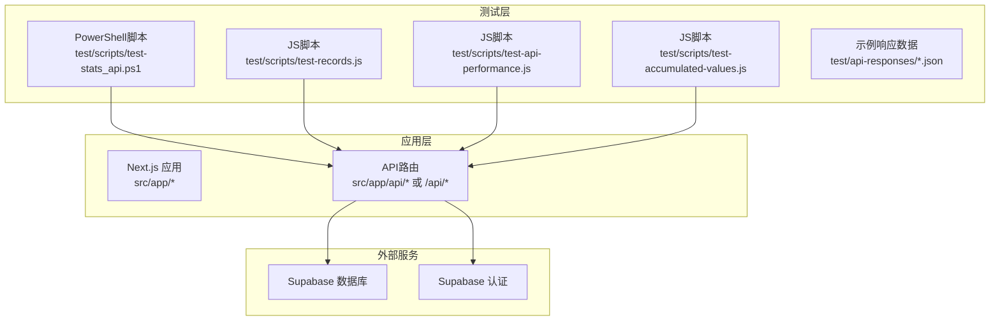
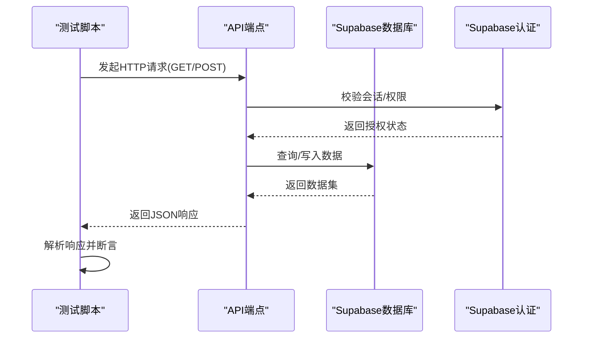
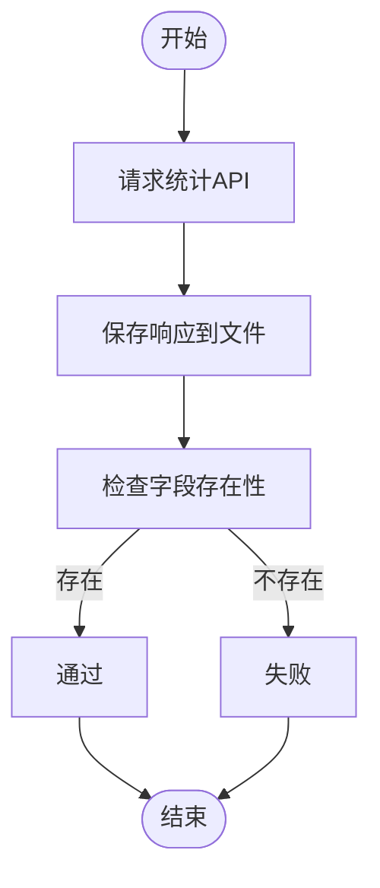
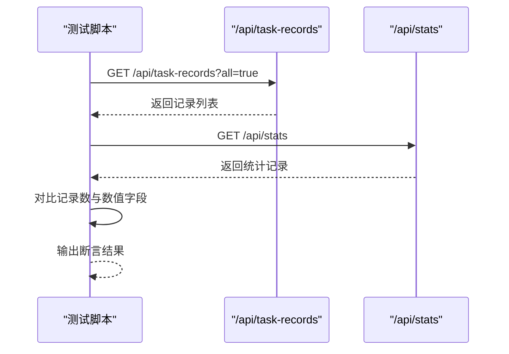
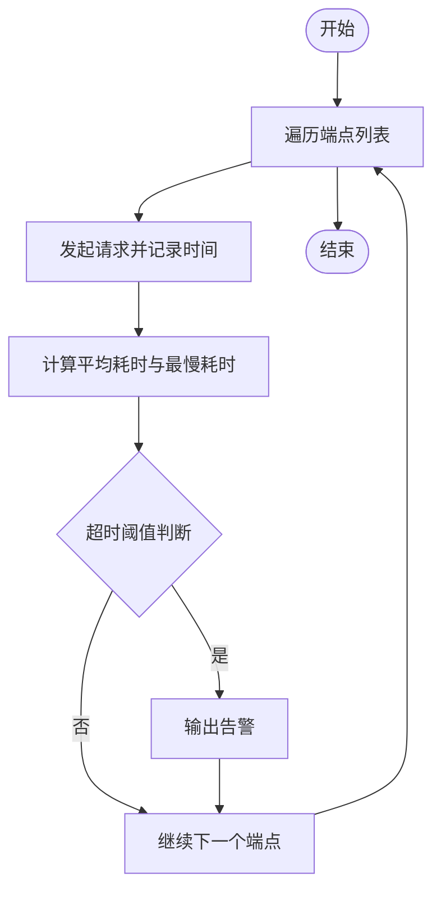
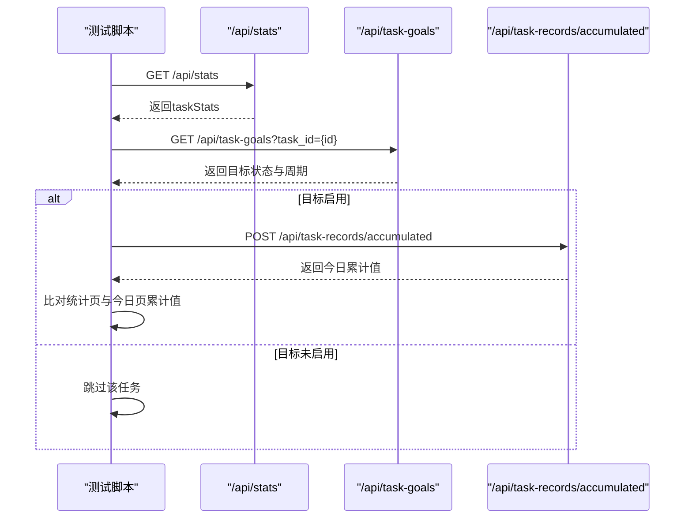
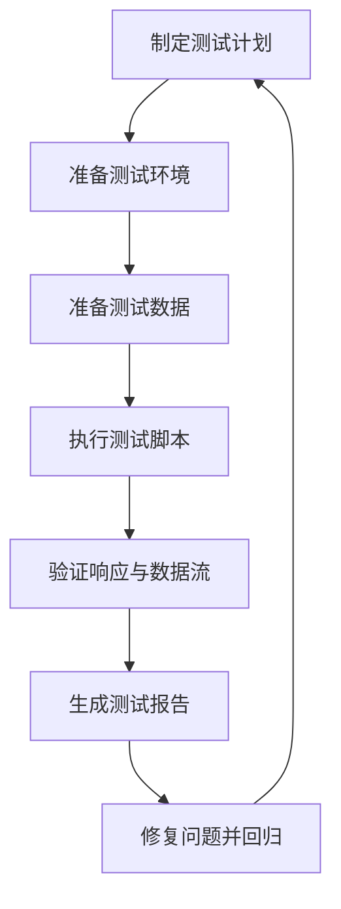
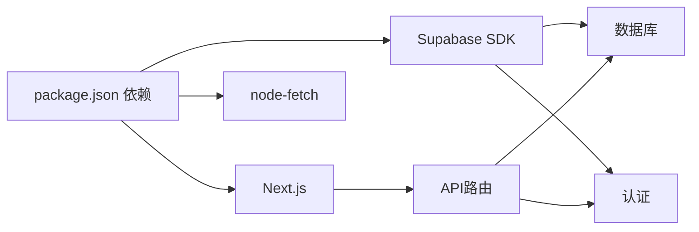

# 集成测试

<cite>
**本文引用的文件**
- [README.md](file://README.md)
- [package.json](file://package.json)
- [test/scripts/test-stats_api.ps1](file://test/scripts/test-stats_api.ps1)
- [test/scripts/test-records.js](file://test/scripts/test-records.js)
- [test/scripts/test-api-performance.js](file://test/scripts/test-api-performance.js)
- [test/scripts/test-accumulated-values.js](file://test/scripts/test-accumulated-values.js)
- [test/api-responses/task_stats_only.json](file://test/api-responses/task_stats_only.json)
- [docs/01-生效版本/TETO 1.3/TETO 1.3 完成报告.md](file://docs/01-生效版本/TETO 1.3/TETO 1.3 完成报告.md)
- [docs/01-生效版本/TETO 1.3/旧代码清理候选清单.md](file://docs/01-生效版本/TETO 1.3/旧代码清理候选清单.md)
</cite>

## 目录
1. [简介](#简介)
2. [项目结构](#项目结构)
3. [核心组件](#核心组件)
4. [架构总览](#架构总览)
5. [详细组件分析](#详细组件分析)
6. [依赖关系分析](#依赖关系分析)
7. [性能考量](#性能考量)
8. [故障排查指南](#故障排查指南)
9. [结论](#结论)
10. [附录](#附录)

## 简介
本文件面向TETO项目的集成测试实践，聚焦API层面的端到端测试策略与实现方法。内容涵盖：
- 端到端测试流程与多API协作测试
- 数据流验证与状态一致性校验
- 错误处理机制的验证路径
- PowerShell与JavaScript脚本测试方法
- 测试环境配置、测试数据准备与结果分析

## 项目结构
TETO采用Next.js App Router架构，API路由位于应用目录下，测试脚本集中于test目录，包含：
- PowerShell脚本：用于快速验证统计类API响应
- JavaScript脚本：用于跨端点数据一致性与性能测试
- 示例响应数据：用于离线验证与回归对比

图示来源
- [README.md:13-21](file://README.md#L13-L21)
- [package.json:15-32](file://package.json#L15-L32)

章节来源
- [README.md:1-126](file://README.md#L1-L126)
- [package.json:1-44](file://package.json#L1-L44)

## 核心组件
- 测试脚本集合
  - PowerShell统计API验证脚本：验证统计接口响应结构与字段存在性
  - 记录数据一致性脚本：对比不同端点返回的记录数据
  - 性能测试脚本：测量多个页面相关API的响应耗时
  - 累计值一致性脚本：比对统计页与今日记录页的累计值
- 示例响应数据
  - 提供典型统计响应样例，便于离线验证与回归测试
- 文档参考
  - 1.3版本完成报告与旧代码清理清单，明确API端点与优先级

章节来源
- [test/scripts/test-stats_api.ps1:1-16](file://test/scripts/test-stats_api.ps1#L1-L16)
- [test/scripts/test-records.js:1-57](file://test/scripts/test-records.js#L1-L57)
- [test/scripts/test-api-performance.js:1-82](file://test/scripts/test-api-performance.js#L1-L82)
- [test/scripts/test-accumulated-values.js:1-65](file://test/scripts/test-accumulated-values.js#L1-L65)
- [test/api-responses/task_stats_only.json:1-268](file://test/api-responses/task_stats_only.json#L1-L268)
- [docs/01-生效版本/TETO 1.3/TETO 1.3 完成报告.md:250-258](file://docs/01-生效版本/TETO 1.3/TETO 1.3 完成报告.md#L250-L258)
- [docs/01-生效版本/TETO 1.3/旧代码清理候选清单.md:65-85](file://docs/01-生效版本/TETO 1.3/旧代码清理候选清单.md#L65-L85)

## 架构总览
集成测试关注应用与数据库/认证服务之间的交互链路，重点验证：
- API端点可用性与响应一致性
- 多端点协作下的数据流转
- 状态同步与累计值一致性
- 错误处理与边界条件

图示来源
- [README.md:13-21](file://README.md#L13-L21)
- [package.json:15-32](file://package.json#L15-L32)

## 详细组件分析

### 组件A：统计API端到端验证（PowerShell）
- 目标：验证统计接口响应结构与关键字段存在性
- 关键步骤
  - 请求统计API并保存响应
  - 检查响应中是否存在特定字段标识
  - 输出响应片段用于人工核验
- 适用场景
  - 回归测试中的响应完整性检查
  - 快速冒烟验证

图示来源
- [test/scripts/test-stats_api.ps1:1-16](file://test/scripts/test-stats_api.ps1#L1-L16)

章节来源
- [test/scripts/test-stats_api.ps1:1-16](file://test/scripts/test-stats_api.ps1#L1-L16)

### 组件B：记录数据一致性测试（JavaScript）
- 目标：比较不同端点返回的记录数据，确保跨端点数据一致性
- 关键步骤
  - 请求任务记录端点与统计端点
  - 对比记录数量与关键字段（如数值累加）
  - 针对特定任务（如英语单词）进行专项对比
- 适用场景
  - 多端点数据一致性验证
  - 回归测试中的数据完整性校验

图示来源
- [test/scripts/test-records.js:8-26](file://test/scripts/test-records.js#L8-L26)

章节来源
- [test/scripts/test-records.js:1-57](file://test/scripts/test-records.js#L1-L57)

### 组件C：API性能测试（JavaScript）
- 目标：测量多个页面相关API的响应耗时，识别性能瓶颈
- 关键步骤
  - 定义待测端点集合（任务、记录、目标、累计值、项目、统计等）
  - 对每个端点重复请求多次取平均值
  - 输出每次请求耗时与最大耗时，并给出阈值告警
- 适用场景
  - 性能回归检测
  - 响应时间监控

图示来源
- [test/scripts/test-api-performance.js:7-79](file://test/scripts/test-api-performance.js#L7-L79)

章节来源
- [test/scripts/test-api-performance.js:1-82](file://test/scripts/test-api-performance.js#L1-L82)

### 组件D：累计值一致性测试（JavaScript）
- 目标：比对统计页与今日记录页的累计值，确保数据一致性
- 关键步骤
  - 获取任务列表
  - 遍历任务，查询统计页累计值与今日记录页累计值
  - 若任务启用了目标值，则调用累计值端点进行计算并比对
- 适用场景
  - 累计值算法一致性验证
  - 跨页面数据同步校验

图示来源
- [test/scripts/test-accumulated-values.js:19-54](file://test/scripts/test-accumulated-values.js#L19-L54)

章节来源
- [test/scripts/test-accumulated-values.js:1-65](file://test/scripts/test-accumulated-values.js#L1-L65)

### 概念性总览
以下为概念性流程图，展示集成测试的整体思路与关注点（不对应具体源码文件）。

## 依赖关系分析
- 技术栈依赖
  - Next.js App Router提供路由与API能力
  - Supabase提供认证与数据库服务
  - node-fetch用于JavaScript测试脚本的HTTP请求
- 测试脚本依赖
  - PowerShell脚本依赖本地开发服务器可达性
  - JavaScript脚本依赖本地开发服务器与网络连通性
- 文档参考依赖
  - 1.3版本完成报告与旧代码清理清单明确了API端点与优先级，指导测试覆盖范围

图示来源
- [package.json:15-32](file://package.json#L15-L32)

章节来源
- [package.json:1-44](file://package.json#L1-L44)
- [README.md:13-21](file://README.md#L13-L21)

## 性能考量
- 测试频率建议
  - 性能测试可在每日构建或PR合并前执行，避免引入性能退化
- 基准设定
  - 使用脚本内置阈值（如2秒、1秒）作为告警基准，结合业务场景调整
- 影响因素
  - 本地开发服务器性能、数据库查询复杂度、认证服务延迟
- 优化方向
  - 缓存热点数据、减少不必要的查询、优化SQL索引

## 故障排查指南
- 常见问题定位
  - 端口占用：确认本地开发服务器端口未被占用
  - 环境变量缺失：检查Supabase相关环境变量是否配置
  - CORS/认证失败：确认认证回调与URL配置正确
- 响应异常处理
  - PowerShell脚本可输出响应片段辅助定位
  - JavaScript脚本可打印请求状态与错误堆栈
- 数据不一致
  - 使用记录一致性脚本对比不同端点返回
  - 使用累计值一致性脚本定位累计算法差异

章节来源
- [README.md:22-47](file://README.md#L22-L47)
- [README.md:75-80](file://README.md#L75-L80)

## 结论
通过现有测试脚本与示例响应数据，TETO项目已具备基础的API集成测试能力。建议在此基础上：
- 扩展更多端到端场景（如多API协作、事务一致性）
- 引入自动化CI流水线，定期执行性能与一致性测试
- 增加错误处理与边界条件测试，提升系统鲁棒性

## 附录

### A. 测试环境配置
- 本地开发环境
  - 安装依赖与启动开发服务器
  - 初始化数据库并启用行级安全策略
  - 配置Supabase站点URL与回调URL
- 环境变量
  - NEXT_PUBLIC_SUPABASE_URL
  - NEXT_PUBLIC_SUPABASE_ANON_KEY
  - 可选：开发模式与测试用户ID

章节来源
- [README.md:22-47](file://README.md#L22-L47)
- [README.md:54-62](file://README.md#L54-L62)

### B. 测试数据准备
- 使用示例响应数据进行离线验证
- 在本地数据库中准备典型任务与记录数据，支撑累计值与统计测试

章节来源
- [test/api-responses/task_stats_only.json:1-268](file://test/api-responses/task_stats_only.json#L1-L268)

### C. 测试结果分析方法
- 统计API验证：检查响应字段存在性与结构完整性
- 记录一致性：对比不同端点返回的记录数量与数值字段
- 性能测试：关注平均耗时与最慢耗时，结合阈值告警
- 累计值一致性：比对统计页与今日记录页累计值，必要时调用累计值端点进行计算

章节来源
- [test/scripts/test-stats_api.ps1:6-11](file://test/scripts/test-stats_api.ps1#L6-L11)
- [test/scripts/test-records.js:22-26](file://test/scripts/test-records.js#L22-L26)
- [test/scripts/test-api-performance.js:66-76](file://test/scripts/test-api-performance.js#L66-L76)
- [test/scripts/test-accumulated-values.js:49-54](file://test/scripts/test-accumulated-values.js#L49-L54)