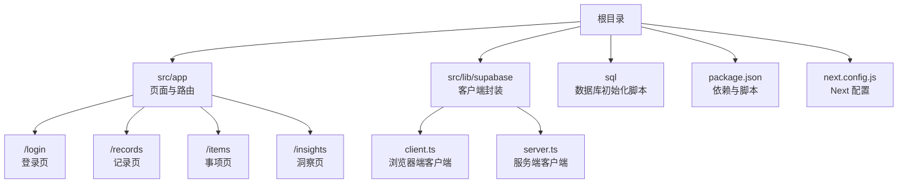
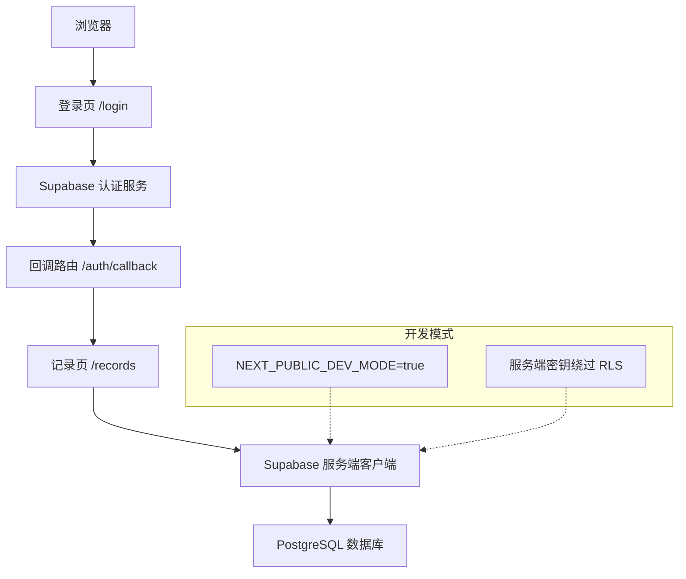
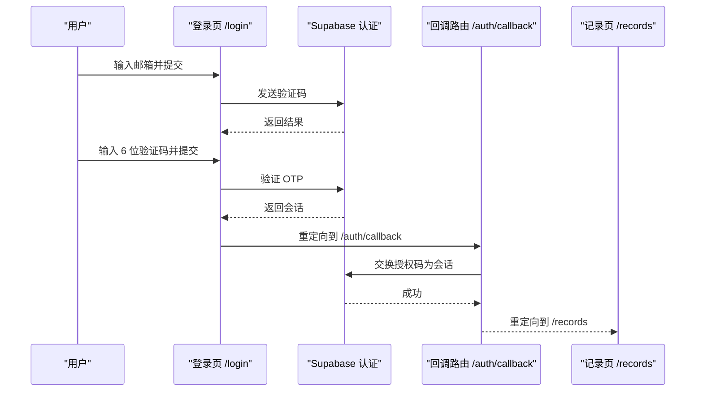
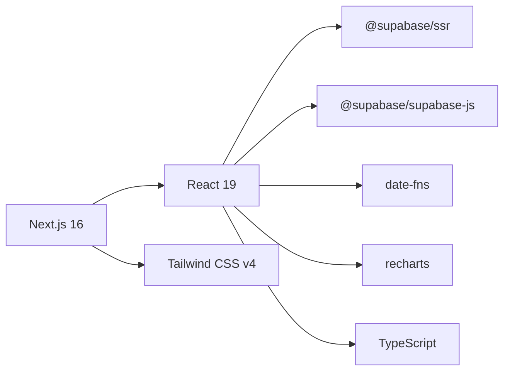

# 快速开始

<cite>
**本文引用的文件**
- [README.md](file://README.md)
- [package.json](file://package.json)
- [next.config.js](file://next.config.js)
- [src/lib/supabase/client.ts](file://src/lib/supabase/client.ts)
- [src/lib/supabase/server.ts](file://src/lib/supabase/server.ts)
- [src/app/layout.tsx](file://src/app/layout.tsx)
- [src/app/page.tsx](file://src/app/page.tsx)
- [src/app/login/page.tsx](file://src/app/login/page.tsx)
- [src/app/auth/callback/route.ts](file://src/app/auth/callback/route.ts)
- [sql/保留存档sql/sql1.0.1/001_init_core_tables.sql](file://sql/保留存档sql/sql1.0.1/001_init_core_tables.sql)
- [sql/保留存档sql/sql1.0.1/002_enable_rls_core_tables.sql](file://sql/保留存档sql/sql1.0.1/002_enable_rls_core_tables.sql)
- [src/types/teto.ts](file://src/types/teto.ts)
</cite>

## 目录
1. [简介](#简介)
2. [项目结构](#项目结构)
3. [核心组件](#核心组件)
4. [架构总览](#架构总览)
5. [详细组件分析](#详细组件分析)
6. [依赖分析](#依赖分析)
7. [性能考虑](#性能考虑)
8. [故障排除指南](#故障排除指南)
9. [结论](#结论)
10. [附录](#附录)

## 简介
本指南面向首次接触 TETO 项目的开发者，帮助你在最短时间内完成本地环境搭建、数据库初始化、认证配置与开发服务器启动，并提供常见问题排查建议。TETO 是一个基于 Next.js 16 App Router 的个人效率追踪系统，采用 Supabase 提供的认证与数据库能力，结合 TypeScript、Tailwind CSS 与 Recharts 实现数据可视化。

## 项目结构
项目采用 Next.js App Router 的目录组织方式，前端页面位于 src/app 下，业务逻辑与数据层通过 Supabase 客户端连接数据库；数据库初始化脚本集中在 sql 目录，便于在 Supabase 控制台中按顺序执行。

图示来源
- [src/app/layout.tsx:1-13](file://src/app/layout.tsx#L1-L13)
- [src/app/page.tsx:1-5](file://src/app/page.tsx#L1-L5)
- [src/lib/supabase/client.ts:1-9](file://src/lib/supabase/client.ts#L1-L9)
- [src/lib/supabase/server.ts:1-36](file://src/lib/supabase/server.ts#L1-L36)
- [package.json:1-44](file://package.json#L1-L44)
- [next.config.js:1-4](file://next.config.js#L1-L4)

章节来源
- [src/app/layout.tsx:1-13](file://src/app/layout.tsx#L1-L13)
- [src/app/page.tsx:1-5](file://src/app/page.tsx#L1-L5)
- [package.json:1-44](file://package.json#L1-L44)
- [next.config.js:1-4](file://next.config.js#L1-L4)

## 核心组件
- 环境与依赖
  - 使用 Node.js 与 npm 管理依赖，Next.js 16 App Router 提供路由与 SSR 支持。
  - 关键依赖包括 @supabase/ssr、@supabase/supabase-js、react、next、recharts、date-fns 等。
- Supabase 客户端
  - 浏览器端客户端：通过 NEXT_PUBLIC_SUPABASE_URL 与 NEXT_PUBLIC_SUPABASE_ANON_KEY 初始化。
  - 服务端客户端：根据开发模式选择匿名密钥或服务角色密钥，统一通过 cookies 管理会话。
- 登录与认证
  - 登录页支持邮箱发送验证码与 OTP 校验，支持开发模式直连。
  - 回调路由处理 Supabase 授权回调，成功后重定向至记录页。
- 数据库初始化
  - 先创建核心表，再启用行级安全策略，确保用户只能访问自身数据。

章节来源
- [package.json:15-32](file://package.json#L15-L32)
- [src/lib/supabase/client.ts:1-9](file://src/lib/supabase/client.ts#L1-L9)
- [src/lib/supabase/server.ts:1-36](file://src/lib/supabase/server.ts#L1-L36)
- [src/app/login/page.tsx:1-196](file://src/app/login/page.tsx#L1-L196)
- [src/app/auth/callback/route.ts:1-19](file://src/app/auth/callback/route.ts#L1-L19)

## 架构总览
下图展示了从浏览器到 Supabase 的典型交互路径，以及开发模式下的特殊处理。

图示来源
- [src/app/login/page.tsx:1-196](file://src/app/login/page.tsx#L1-L196)
- [src/app/auth/callback/route.ts:1-19](file://src/app/auth/callback/route.ts#L1-L19)
- [src/lib/supabase/server.ts:1-36](file://src/lib/supabase/server.ts#L1-L36)

## 详细组件分析

### 环境与依赖安装
- 安装依赖
  - 使用 npm install 安装项目所需依赖。
- 启动开发服务器
  - 使用 npm run dev 启动本地开发服务器，默认访问 http://localhost:3000。
- 构建检查
  - 发布前执行 npm run build 进行构建检查。

章节来源
- [README.md:22-53](file://README.md#L22-L53)
- [package.json:6-11](file://package.json#L6-L11)

### 环境变量配置
- 必填变量
  - NEXT_PUBLIC_SUPABASE_URL：Supabase 项目 URL。
  - NEXT_PUBLIC_SUPABASE_ANON_KEY：Supabase 匿名密钥。
- 可选变量
  - NEXT_PUBLIC_DEV_MODE：设为 true 启用开发模式（跳过登录）。
  - NEXT_PUBLIC_DEV_USER_ID：开发模式使用的测试用户 ID。
- Next 配置
  - allowedDevOrigins：允许的开发来源 IP 列表（示例包含特定 IP）。

章节来源
- [README.md:54-62](file://README.md#L54-L62)
- [next.config.js:1-4](file://next.config.js#L1-L4)
- [src/lib/supabase/server.ts:4-15](file://src/lib/supabase/server.ts#L4-L15)

### Supabase 数据库初始化
- 执行顺序
  1) 在 Supabase 控制台 SQL Editor 中执行 sql/保留存档sql/sql1.0.1/001_init_core_tables.sql 创建核心表。
  2) 再执行 sql/保留存档sql/sql1.0.1/002_enable_rls_core_tables.sql 启用行级安全策略。
- 数据库表
  - profiles：用户扩展信息。
  - daily_records：每日记录主表。
  - daily_record_items：每日记录项明细。
  - diary_reviews：日记复盘。
  - projects：项目。
  - project_logs：项目进度日志。
- RLS 策略
  - 对所有核心表启用 RLS，策略限制用户仅能访问自身数据，涉及 SELECT/INSERT/UPDATE/DELETE 的策略均已定义。

章节来源
- [README.md:63-91](file://README.md#L63-L91)
- [sql/保留存档sql/sql1.0.1/001_init_core_tables.sql:1-185](file://sql/保留存档sql/sql1.0.1/001_init_core_tables.sql#L1-L185)
- [sql/保留存档sql/sql1.0.1/002_enable_rls_core_tables.sql:1-200](file://sql/保留存档sql/sql1.0.1/002_enable_rls_core_tables.sql#L1-L200)

### 认证设置
- URL 配置
  - 在 Supabase 控制台 Authentication → URL Configuration 中配置 Site URL 与 Redirect URLs。
- 登录方式
  - 启用 Magic Link（邮箱验证码）登录方式。
- 登录流程
  - 登录页发送验证码并校验 OTP，成功后写入会话并跳转至 /records。
  - 开发模式下无需登录，可直接进入系统。

图示来源
- [src/app/login/page.tsx:17-86](file://src/app/login/page.tsx#L17-L86)
- [src/app/auth/callback/route.ts:4-18](file://src/app/auth/callback/route.ts#L4-L18)

章节来源
- [README.md:75-80](file://README.md#L75-L80)
- [src/app/login/page.tsx:1-196](file://src/app/login/page.tsx#L1-L196)
- [src/app/auth/callback/route.ts:1-19](file://src/app/auth/callback/route.ts#L1-L19)

### 开发服务器启动与基本使用
- 启动开发服务器
  - 执行 npm run dev，访问 http://localhost:3000。
- 默认路由
  - 根路径 / 将自动重定向至 /records。
- 基本使用
  - 登录后进入记录页，可进行日常记录、项目管理与数据分析等操作。

章节来源
- [README.md:43-47](file://README.md#L43-L47)
- [src/app/page.tsx:1-5](file://src/app/page.tsx#L1-L5)

### 数据模型与类型
- 核心实体
  - Record、Item、Tag、RecordTag、RecordLink、Goal、Phase、ItemFolder 等。
- 查询与请求载荷
  - 定义了 RecordsQuery、ItemsQuery、GoalsQuery、PhasesQuery 以及 Create/Update 系列载荷类型。
- API 响应结构
  - ApiResponse 与 ApiListResponse 规范化响应格式，ApiError 统一错误结构。

章节来源
- [src/types/teto.ts:28-516](file://src/types/teto.ts#L28-L516)

## 依赖分析
- 前端框架与样式
  - Next.js 16、React 19、Tailwind CSS v4。
- 数据库与认证
  - @supabase/ssr、@supabase/supabase-js 提供浏览器与服务端客户端能力。
- 工具与可视化
  - date-fns 用于日期处理，recharts 用于图表展示。
- 开发工具
  - TypeScript、Tailwind PostCSS 插件、Autoprefixer、PostCSS、Tailwind CSS。

图示来源
- [package.json:15-32](file://package.json#L15-L32)

章节来源
- [package.json:1-44](file://package.json#L1-L44)

## 性能考虑
- 开发模式下的 RLS 绕过
  - 在开发模式下使用服务端密钥可提升开发效率，但需注意生产环境必须启用 RLS 以保障数据隔离。
- 会话与 Cookie
  - 服务端客户端通过 cookies 统一管理会话，减少跨端同步复杂度。
- 图表与数据渲染
  - 合理控制图表数据量与渲染频率，避免不必要的重绘。

章节来源
- [src/lib/supabase/server.ts:13-15](file://src/lib/supabase/server.ts#L13-L15)

## 故障排除指南
- 无法访问登录页或重定向异常
  - 检查 NEXT_PUBLIC_SUPABASE_URL 与 NEXT_PUBLIC_SUPABASE_ANON_KEY 是否正确配置。
  - 确认 Supabase 控制台 URL Configuration 中的 Site URL 与 Redirect URLs 设置正确。
- 验证码发送失败或 OTP 校验失败
  - 查看浏览器控制台与网络面板，确认 Supabase.auth.signInWithOtp 与 verifyOtp 调用是否报错。
  - 确认邮箱服务可用且未被垃圾邮件过滤。
- 开发模式无法跳过登录
  - 确认 NEXT_PUBLIC_DEV_MODE=true 且 NEXT_PUBLIC_DEV_USER_ID 已设置（如需要）。
- 数据库初始化失败
  - 确保先执行创建表脚本，再执行启用 RLS 脚本；两步不可颠倒。
- RLS 导致读取不到数据
  - 确认用户会话已建立，且 RLS 策略已正确应用到所有核心表。
- 构建失败
  - 先在本地执行 npm run build，修复类型或语法错误后再提交部署。

章节来源
- [README.md:54-91](file://README.md#L54-L91)
- [src/app/login/page.tsx:17-86](file://src/app/login/page.tsx#L17-L86)
- [src/lib/supabase/server.ts:13-15](file://src/lib/supabase/server.ts#L13-L15)
- [sql/保留存档sql/sql1.0.1/001_init_core_tables.sql:1-185](file://sql/保留存档sql/sql1.0.1/001_init_core_tables.sql#L1-L185)
- [sql/保留存档sql/sql1.0.1/002_enable_rls_core_tables.sql:1-200](file://sql/保留存档sql/sql1.0.1/002_enable_rls_core_tables.sql#L1-L200)

## 结论
按照本指南完成环境准备、数据库初始化与认证配置后，你可以在本地快速启动 TETO 并开始使用。遇到问题时，优先核对环境变量、Supabase URL 配置与数据库脚本执行顺序，必要时切换到开发模式进行调试。上线前务必在本地执行构建检查并通过生产环境验证。

## 附录
- 本地开发环境配置流程摘要
  1) 安装依赖：npm install
  2) 配置环境变量：创建 .env.local，填入 NEXT_PUBLIC_SUPABASE_URL 与 NEXT_PUBLIC_SUPABASE_ANON_KEY，可选开启开发模式
  3) 初始化数据库：在 Supabase 控制台 SQL Editor 中按顺序执行初始化脚本
  4) 启动开发服务器：npm run dev
  5) 访问 http://localhost:3000，登录后进入 /records

章节来源
- [README.md:22-53](file://README.md#L22-L53)
- [README.md:63-91](file://README.md#L63-L91)