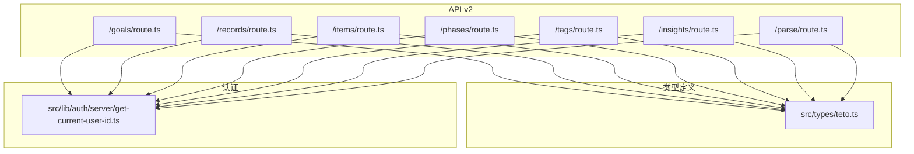
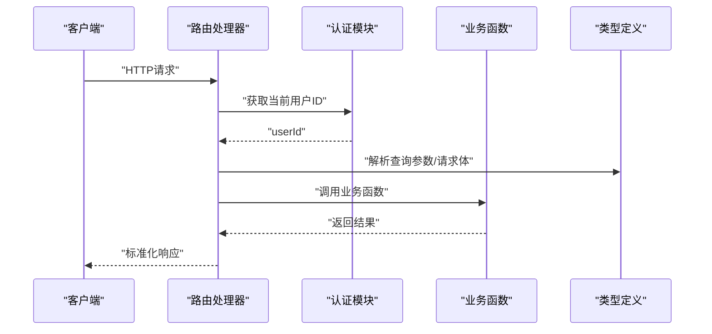
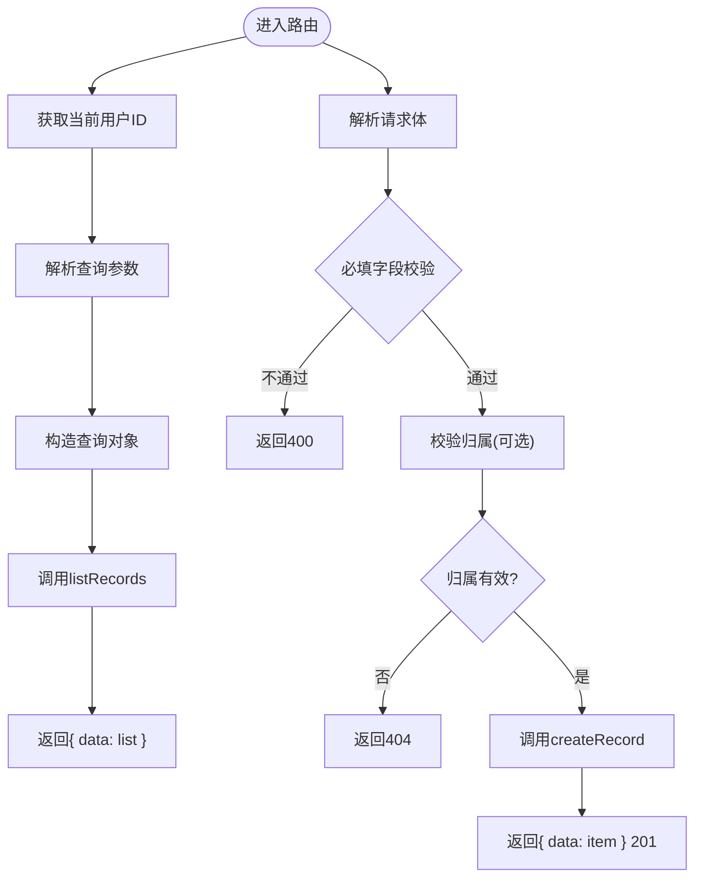
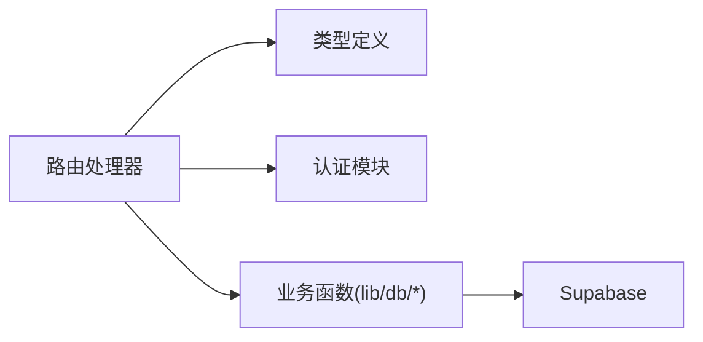

# API接口扩展

<cite>
**本文引用的文件**
- [src/app/api/v2/goals/route.ts](file://src/app/api/v2/goals/route.ts)
- [src/app/api/v2/records/route.ts](file://src/app/api/v2/records/route.ts)
- [src/app/api/v2/items/route.ts](file://src/app/api/v2/items/route.ts)
- [src/app/api/v2/phases/route.ts](file://src/app/api/v2/phases/route.ts)
- [src/app/api/v2/tags/route.ts](file://src/app/api/v2/tags/route.ts)
- [src/app/api/v2/insights/route.ts](file://src/app/api/v2/insights/route.ts)
- [src/app/api/v2/parse/route.ts](file://src/app/api/v2/parse/route.ts)
- [src/types/teto.ts](file://src/types/teto.ts)
- [src/lib/auth/server/get-current-user-id.ts](file://src/lib/auth/server/get-current-user-id.ts)
- [package.json](file://package.json)
- [README.md](file://README.md)
- [test/scripts/test-api-performance.js](file://test/scripts/test-api-performance.js)
</cite>

## 目录
1. [简介](#简介)
2. [项目结构](#项目结构)
3. [核心组件](#核心组件)
4. [架构总览](#架构总览)
5. [详细组件分析](#详细组件分析)
6. [依赖分析](#依赖分析)
7. [性能考虑](#性能考虑)
8. [故障排查指南](#故障排查指南)
9. [结论](#结论)
10. [附录](#附录)

## 简介
本指南面向需要在TETO项目中扩展API接口的开发者，围绕现有的RESTful API架构，提供从路由定义到业务实现、从类型安全到错误处理、从认证授权到版本管理的完整实践路径。文档以v2 API目录下的现有端点为蓝本，总结设计原则与最佳实践，帮助你快速、稳定地新增后端接口。

## 项目结构
TETO采用Next.js App Router组织API路由，v2版本的API位于src/app/api/v2下，每个资源对应一个独立的route.ts文件，统一遵循“GET/POST/...”导出函数的约定，并通过NextResponse返回标准化响应。类型定义集中在src/types/teto.ts，确保前后端一致的契约。

图示来源
- [src/app/api/v2/goals/route.ts:1-49](file://src/app/api/v2/goals/route.ts#L1-L49)
- [src/app/api/v2/records/route.ts:1-86](file://src/app/api/v2/records/route.ts#L1-L86)
- [src/app/api/v2/items/route.ts:1-47](file://src/app/api/v2/items/route.ts#L1-L47)
- [src/app/api/v2/phases/route.ts:1-72](file://src/app/api/v2/phases/route.ts#L1-L72)
- [src/app/api/v2/tags/route.ts:1-39](file://src/app/api/v2/tags/route.ts#L1-L39)
- [src/app/api/v2/insights/route.ts:1-32](file://src/app/api/v2/insights/route.ts#L1-L32)
- [src/app/api/v2/parse/route.ts:1-43](file://src/app/api/v2/parse/route.ts#L1-L43)
- [src/types/teto.ts:133-162](file://src/types/teto.ts#L133-L162)
- [src/lib/auth/server/get-current-user-id.ts:12-37](file://src/lib/auth/server/get-current-user-id.ts#L12-L37)

章节来源
- [src/app/api/v2/goals/route.ts:1-49](file://src/app/api/v2/goals/route.ts#L1-L49)
- [src/app/api/v2/records/route.ts:1-86](file://src/app/api/v2/records/route.ts#L1-L86)
- [src/app/api/v2/items/route.ts:1-47](file://src/app/api/v2/items/route.ts#L1-L47)
- [src/app/api/v2/phases/route.ts:1-72](file://src/app/api/v2/phases/route.ts#L1-L72)
- [src/app/api/v2/tags/route.ts:1-39](file://src/app/api/v2/tags/route.ts#L1-L39)
- [src/app/api/v2/insights/route.ts:1-32](file://src/app/api/v2/insights/route.ts#L1-L32)
- [src/app/api/v2/parse/route.ts:1-43](file://src/app/api/v2/parse/route.ts#L1-L43)
- [src/types/teto.ts:133-162](file://src/types/teto.ts#L133-L162)
- [src/lib/auth/server/get-current-user-id.ts:12-37](file://src/lib/auth/server/get-current-user-id.ts#L12-L37)

## 核心组件
- 路由层：每个资源目录下的route.ts统一导出路由处理器，遵循Next.js App Router约定。
- 认证中间层：通过getCurrentUserId获取当前用户ID，统一处理登录态与开发模式。
- 业务适配层：调用lib/db层的业务函数（如createRecord、listRecords等），并进行输入校验与权限检查。
- 类型契约：通过src/types/teto.ts中的CreateRecordPayload、UpdateItemPayload等接口，确保请求体与查询参数的类型安全。
- 响应格式：统一返回{ data }或{ error }结构，错误码遵循HTTP语义（400/401/404/500/502等）。

章节来源
- [src/app/api/v2/goals/route.ts:1-49](file://src/app/api/v2/goals/route.ts#L1-L49)
- [src/app/api/v2/records/route.ts:1-86](file://src/app/api/v2/records/route.ts#L1-L86)
- [src/app/api/v2/items/route.ts:1-47](file://src/app/api/v2/items/route.ts#L1-L47)
- [src/app/api/v2/phases/route.ts:1-72](file://src/app/api/v2/phases/route.ts#L1-L72)
- [src/app/api/v2/tags/route.ts:1-39](file://src/app/api/v2/tags/route.ts#L1-L39)
- [src/app/api/v2/insights/route.ts:1-32](file://src/app/api/v2/insights/route.ts#L1-L32)
- [src/app/api/v2/parse/route.ts:1-43](file://src/app/api/v2/parse/route.ts#L1-L43)
- [src/types/teto.ts:133-162](file://src/types/teto.ts#L133-L162)
- [src/lib/auth/server/get-current-user-id.ts:12-37](file://src/lib/auth/server/get-current-user-id.ts#L12-L37)

## 架构总览
下图展示了API扩展的通用控制流：路由接收请求→认证与参数解析→业务校验→调用业务函数→返回标准化响应。

图示来源
- [src/app/api/v2/records/route.ts:44-85](file://src/app/api/v2/records/route.ts#L44-L85)
- [src/lib/auth/server/get-current-user-id.ts:12-37](file://src/lib/auth/server/get-current-user-id.ts#L12-L37)
- [src/types/teto.ts:133-162](file://src/types/teto.ts#L133-L162)

## 详细组件分析

### 设计原则与规范
- 路由设计
  - 资源导向：每个资源一个目录，如/goals、/records、/items、/phases、/tags、/insights、/parse。
  - 方法映射：GET用于查询，POST用于创建，必要时补充PUT/DELETE。
  - 参数传递：查询参数用于过滤（如status、item_id、date_from/date_to），请求体用于创建/更新。
- 请求响应格式
  - 成功响应：统一返回{ data }；列表查询返回数组。
  - 错误响应：统一返回{ error }，并设置合适的HTTP状态码。
- 错误处理机制
  - 400：参数缺失或非法。
  - 401：未登录或获取用户信息失败。
  - 404：资源不存在或归属不符。
  - 500：服务器内部错误。
  - 502：外部服务（如AI解析）异常。
- 认证与授权
  - 使用getCurrentUserId获取userId，开发模式可通过环境变量绕过登录。
  - 对于涉及外键的资源（如records、phases），需额外校验所属关系。
- 版本管理
  - API以v2为命名空间，便于未来演进与向后兼容策略制定。

章节来源
- [src/app/api/v2/goals/route.ts:6-28](file://src/app/api/v2/goals/route.ts#L6-L28)
- [src/app/api/v2/records/route.ts:7-42](file://src/app/api/v2/records/route.ts#L7-L42)
- [src/app/api/v2/phases/route.ts:7-30](file://src/app/api/v2/phases/route.ts#L7-L30)
- [src/app/api/v2/parse/route.ts:12-42](file://src/app/api/v2/parse/route.ts#L12-L42)
- [src/lib/auth/server/get-current-user-id.ts:12-37](file://src/lib/auth/server/get-current-user-id.ts#L12-L37)

### API扩展流程（以records为例）
- 步骤一：确定资源与HTTP方法
  - 查询：GET /api/v2/records
  - 创建：POST /api/v2/records
- 步骤二：定义类型
  - 使用RecordsQuery作为查询参数类型，CreateRecordPayload作为请求体类型。
- 步骤三：实现路由
  - 从URL解析查询参数，构造查询对象。
  - 从请求体解析JSON，进行必填字段校验。
  - 调用业务函数并返回标准化响应。
- 步骤四：权限与归属校验
  - 若存在item_id，需查询items表并校验user_id与当前用户一致。
- 步骤五：错误处理
  - 明确区分登录态错误、参数错误与服务器错误，返回相应状态码。

图示来源
- [src/app/api/v2/records/route.ts:7-85](file://src/app/api/v2/records/route.ts#L7-L85)
- [src/types/teto.ts:235-245](file://src/types/teto.ts#L235-L245)
- [src/types/teto.ts:133-162](file://src/types/teto.ts#L133-L162)

章节来源
- [src/app/api/v2/records/route.ts:7-85](file://src/app/api/v2/records/route.ts#L7-L85)
- [src/types/teto.ts:235-245](file://src/types/teto.ts#L235-L245)
- [src/types/teto.ts:133-162](file://src/types/teto.ts#L133-L162)

### 类型安全与一致性
- 使用CreateRecordPayload、UpdateItemPayload等接口约束请求体，避免运行期类型错误。
- 查询参数使用RecordsQuery、ItemsQuery等接口，确保过滤条件的类型安全。
- 响应统一使用ApiResponse<T>或ApiListResponse<T[]>，便于前端消费。

章节来源
- [src/types/teto.ts:133-162](file://src/types/teto.ts#L133-L162)
- [src/types/teto.ts:235-245](file://src/types/teto.ts#L235-L245)
- [src/types/teto.ts:262-268](file://src/types/teto.ts#L262-L268)

### 认证与授权
- 统一通过getCurrentUserId获取userId，开发模式下可直接使用预设ID。
- 对于需要归属校验的资源，先查询相关表确认user_id匹配，再执行业务操作。

章节来源
- [src/lib/auth/server/get-current-user-id.ts:12-37](file://src/lib/auth/server/get-current-user-id.ts#L12-L37)
- [src/app/api/v2/records/route.ts:60-74](file://src/app/api/v2/records/route.ts#L60-L74)
- [src/app/api/v2/phases/route.ts:47-60](file://src/app/api/v2/phases/route.ts#L47-L60)

### API版本管理
- v2命名空间隔离当前版本的API，便于后续迭代与兼容策略制定。
- 新增端点建议沿用相同目录结构与命名规范，保持一致性。

章节来源
- [src/app/api/v2/goals/route.ts:1-49](file://src/app/api/v2/goals/route.ts#L1-L49)
- [src/app/api/v2/records/route.ts:1-86](file://src/app/api/v2/records/route.ts#L1-L86)
- [src/app/api/v2/items/route.ts:1-47](file://src/app/api/v2/items/route.ts#L1-L47)
- [src/app/api/v2/phases/route.ts:1-72](file://src/app/api/v2/phases/route.ts#L1-L72)
- [src/app/api/v2/tags/route.ts:1-39](file://src/app/api/v2/tags/route.ts#L1-L39)
- [src/app/api/v2/insights/route.ts:1-32](file://src/app/api/v2/insights/route.ts#L1-L32)
- [src/app/api/v2/parse/route.ts:1-43](file://src/app/api/v2/parse/route.ts#L1-L43)

### 典型端点实现参考
- GET /api/v2/goals：按status、item_id、phase_id过滤，返回目标列表。
- POST /api/v2/goals：校验title必填，创建目标并返回201。
- GET /api/v2/records：按date/date_from/date_to、item_id、type、tag_id、is_starred、search、limit过滤，返回记录列表。
- POST /api/v2/records：校验content、date必填，校验item归属，创建记录并返回201。
- GET /api/v2/items：按status、is_pinned过滤，返回事项列表。
- POST /api/v2/items：校验title必填，创建事项并返回201。
- GET /api/v2/phases：按item_id、status、is_historical过滤，返回阶段列表。
- POST /api/v2/phases：校验item_id、title必填，校验item归属，创建阶段并返回201。
- GET /api/v2/tags：返回标签列表。
- POST /api/v2/tags：校验name必填，创建标签并返回201。
- GET /api/v2/insights：校验date_from、date_to必填，返回洞察数据。
- POST /api/v2/parse：校验input必填，调用AI解析并返回结果，外部错误返回502。

章节来源
- [src/app/api/v2/goals/route.ts:6-48](file://src/app/api/v2/goals/route.ts#L6-L48)
- [src/app/api/v2/records/route.ts:7-85](file://src/app/api/v2/records/route.ts#L7-L85)
- [src/app/api/v2/items/route.ts:6-46](file://src/app/api/v2/items/route.ts#L6-L46)
- [src/app/api/v2/phases/route.ts:7-71](file://src/app/api/v2/phases/route.ts#L7-L71)
- [src/app/api/v2/tags/route.ts:6-38](file://src/app/api/v2/tags/route.ts#L6-L38)
- [src/app/api/v2/insights/route.ts:6-31](file://src/app/api/v2/insights/route.ts#L6-L31)
- [src/app/api/v2/parse/route.ts:12-42](file://src/app/api/v2/parse/route.ts#L12-L42)

## 依赖分析
- 路由对类型定义的依赖：所有路由都import了对应的查询参数与请求体类型。
- 路由对认证模块的依赖：统一通过getCurrentUserId获取userId。
- 路由对业务函数的依赖：调用lib/db层的函数（如createRecord、listRecords等）。
- 外部依赖：Supabase用于认证与数据库访问，AI解析依赖外部服务。

图示来源
- [src/app/api/v2/records/route.ts:1-5](file://src/app/api/v2/records/route.ts#L1-L5)
- [src/lib/auth/server/get-current-user-id.ts:1-1](file://src/lib/auth/server/get-current-user-id.ts#L1-L1)
- [package.json:15-31](file://package.json#L15-L31)

章节来源
- [src/app/api/v2/records/route.ts:1-5](file://src/app/api/v2/records/route.ts#L1-L5)
- [src/lib/auth/server/get-current-user-id.ts:1-1](file://src/lib/auth/server/get-current-user-id.ts#L1-L1)
- [package.json:15-31](file://package.json#L15-L31)

## 性能考虑
- 接口性能测试：可参考test/scripts/test-api-performance.js，对关键API进行多次采样取平均耗时，识别慢接口。
- 建议优化方向
  - 合理使用索引与LIMIT，避免全表扫描。
  - 对复杂查询增加缓存策略（如热点时间段的洞察数据）。
  - 控制单次响应数据量，必要时引入分页。
  - 将高成本计算移至后台任务或异步队列。

章节来源
- [test/scripts/test-api-performance.js:1-82](file://test/scripts/test-api-performance.js#L1-L82)

## 故障排查指南
- 常见错误与定位
  - 400错误：检查必填字段与参数类型，参考各路由中的校验逻辑。
  - 401错误：确认登录态是否有效，开发模式下检查环境变量配置。
  - 404错误：核对资源归属校验逻辑，确保外键user_id匹配。
  - 500错误：查看服务端日志，定位具体异常。
  - 502错误：外部AI服务异常，检查网络与服务可用性。
- 开发模式
  - 设置NEXT_PUBLIC_DEV_MODE=true与NEXT_PUBLIC_DEV_USER_ID，可跳过登录直接调试。

章节来源
- [src/app/api/v2/records/route.ts:78-84](file://src/app/api/v2/records/route.ts#L78-L84)
- [src/app/api/v2/parse/route.ts:31-41](file://src/app/api/v2/parse/route.ts#L31-L41)
- [src/lib/auth/server/get-current-user-id.ts:12-37](file://src/lib/auth/server/get-current-user-id.ts#L12-L37)
- [README.md:54-62](file://README.md#L54-L62)

## 结论
通过遵循现有v2 API的设计规范与实现模式，你可以高效、安全地扩展新的API端点。关键在于：统一的路由与响应格式、严格的类型约束、完善的认证与归属校验、清晰的错误处理与状态码语义，以及持续的性能监控与优化。建议在新增端点时，优先复用现有类型定义与认证逻辑，确保整体一致性与可维护性。

## 附录
- 部署与发布
  - 本地构建：npm run build
  - Vercel部署：在Vercel中导入仓库，配置环境变量并部署
- 文档生成
  - 可基于路由注释与类型定义自动生成OpenAPI/Swagger文档（建议在CI中集成）

章节来源
- [README.md:49-114](file://README.md#L49-L114)
- [package.json:6-10](file://package.json#L6-L10)