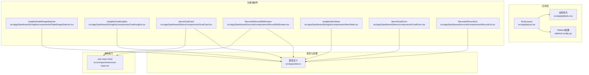
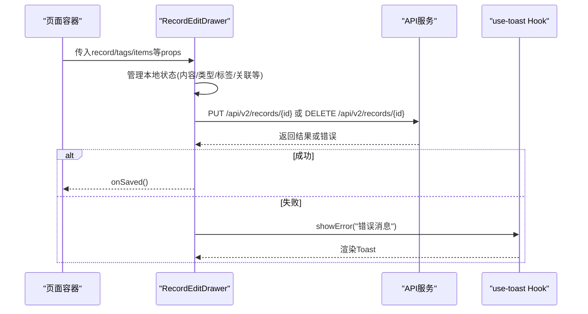
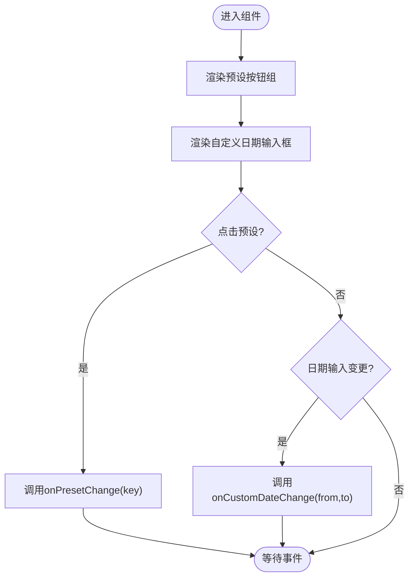
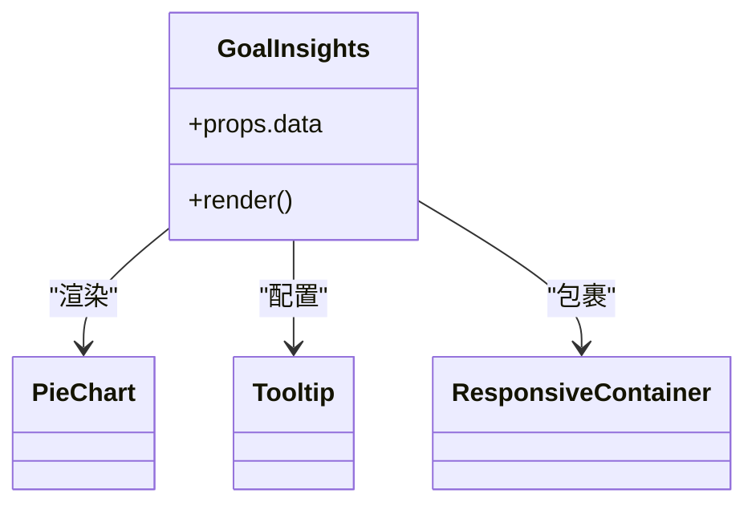
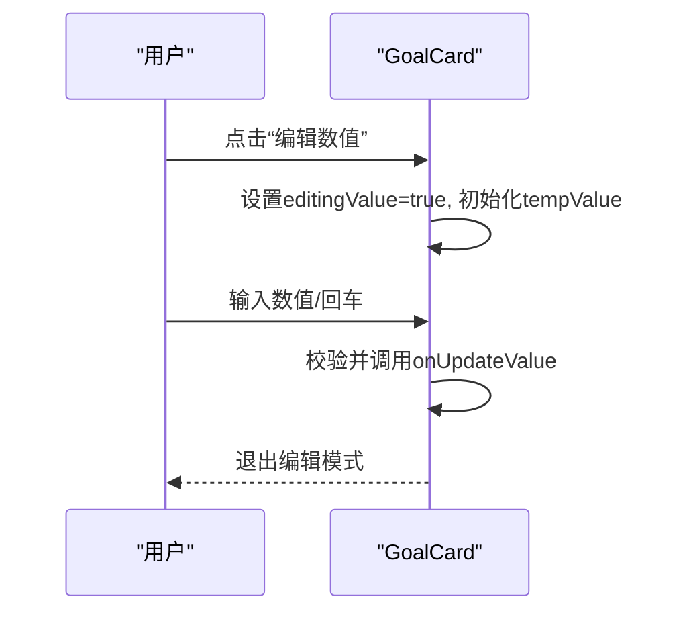
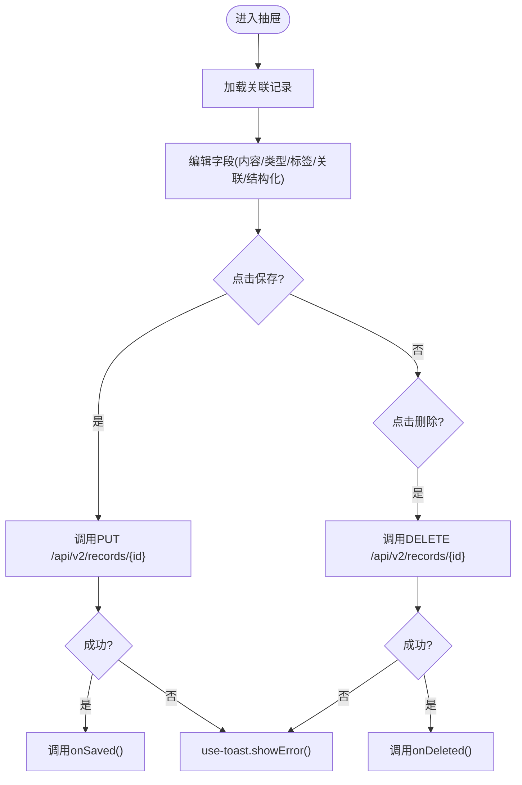
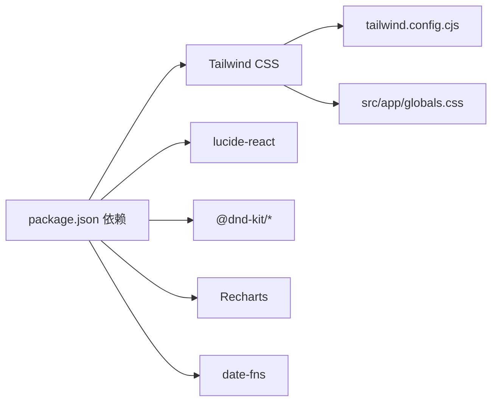

# UI组件扩展

<cite>
**本文引用的文件**
- [README.md](file://README.md)
- [package.json](file://package.json)
- [tailwind.config.cjs](file://tailwind.config.cjs)
- [src/app/layout.tsx](file://src/app/layout.tsx)
- [src/app/globals.css](file://src/app/globals.css)
- [src/components/ui/use-toast.tsx](file://src/components/ui/use-toast.tsx)
- [src/app/(dashboard)/insights/components/DateRangeSelector.tsx](file://src/app/(dashboard)/insights/components/DateRangeSelector.tsx)
- [src/app/(dashboard)/insights/components/GoalInsights.tsx](file://src/app/(dashboard)/insights/components/GoalInsights.tsx)
- [src/app/(dashboard)/items/components/GoalCard.tsx](file://src/app/(dashboard)/items/components/GoalCard.tsx)
- [src/app/(dashboard)/records/components/RecordEditDrawer.tsx](file://src/app/(dashboard)/records/components/RecordEditDrawer.tsx)
- [src/app/(dashboard)/insights/components/ItemStats.tsx](file://src/app/(dashboard)/insights/components/ItemStats.tsx)
- [src/app/(dashboard)/items/components/GoalForm.tsx](file://src/app/(dashboard)/items/components/GoalForm.tsx)
- [src/app/(dashboard)/records/components/RecordList.tsx](file://src/app/(dashboard)/records/components/RecordList.tsx)
- [src/types/teto.ts](file://src/types/teto.ts)
- [src/app/(dashboard)/items/ItemsClient.tsx](file://src/app/(dashboard)/items/ItemsClient.tsx)
</cite>

## 目录
1. [简介](#简介)
2. [项目结构](#项目结构)
3. [核心组件](#核心组件)
4. [架构总览](#架构总览)
5. [详细组件分析](#详细组件分析)
6. [依赖分析](#依赖分析)
7. [性能考虑](#性能考虑)
8. [故障排查指南](#故障排查指南)
9. [结论](#结论)
10. [附录](#附录)

## 简介
本指南面向希望在TETO项目中扩展UI组件的开发者，围绕现有React组件架构，系统讲解如何基于项目已有的设计语言、交互模式与工具库（如@dnd-kit、lucide-react、Tailwind CSS）进行高质量、可维护的UI组件扩展。文档覆盖组件设计原则（继承、组合、装饰）、从设计到实现再到部署的完整流程，以及状态管理、事件处理、样式定制、测试、性能优化、可访问性支持、文档与版本管理及向后兼容保障等主题。

## 项目结构
TETO采用Next.js App Router组织页面与组件，UI层以功能域划分（dashboard/items、dashboard/records、dashboard/insights），并共享全局样式与主题配置。核心要点如下：
- 页面与客户端逻辑：位于 src/app 下，采用布局与客户端组件结合的方式
- UI通用能力：位于 src/components/ui，如全局Toast容器与Hook
- 样式系统：Tailwind CSS + 自定义CSS类（如毛玻璃、阴影、环形进度条等）
- 类型定义：集中于 src/types，为组件提供强类型约束
- 组件扩展建议：遵循现有命名与目录约定，优先使用现有图标库与拖拽能力

**图示来源**
- [src/app/layout.tsx:1-13](file://src/app/layout.tsx#L1-L13)
- [src/app/globals.css:1-88](file://src/app/globals.css#L1-L88)
- [tailwind.config.cjs:1-61](file://tailwind.config.cjs#L1-L61)
- [src/app/(dashboard)/insights/components/DateRangeSelector.tsx:1-65](file://src/app/(dashboard)/insights/components/DateRangeSelector.tsx#L1-L65)
- [src/app/(dashboard)/insights/components/GoalInsights.tsx:1-143](file://src/app/(dashboard)/insights/components/GoalInsights.tsx#L1-L143)
- [src/app/(dashboard)/items/components/GoalCard.tsx:1-114](file://src/app/(dashboard)/items/components/GoalCard.tsx#L1-L114)
- [src/app/(dashboard)/records/components/RecordEditDrawer.tsx:1-561](file://src/app/(dashboard)/records/components/RecordEditDrawer.tsx#L1-L561)
- [src/app/(dashboard)/insights/components/ItemStats.tsx:1-111](file://src/app/(dashboard)/insights/components/ItemStats.tsx#L1-L111)
- [src/app/(dashboard)/items/components/GoalForm.tsx:1-377](file://src/app/(dashboard)/items/components/GoalForm.tsx#L1-L377)
- [src/app/(dashboard)/records/components/RecordList.tsx:1-87](file://src/app/(dashboard)/records/components/RecordList.tsx#L1-L87)
- [src/components/ui/use-toast.tsx:1-69](file://src/components/ui/use-toast.tsx#L1-L69)
- [src/types/teto.ts:1-516](file://src/types/teto.ts#L1-L516)

**章节来源**
- [README.md:13-21](file://README.md#L13-L21)
- [package.json:15-32](file://package.json#L15-L32)
- [tailwind.config.cjs:8-59](file://tailwind.config.cjs#L8-L59)
- [src/app/globals.css:15-88](file://src/app/globals.css#L15-L88)

## 核心组件
本节梳理现有UI组件的关键特征，帮助你理解扩展时的风格与约束：
- 交互一致性：广泛使用 lucide-react 图标，统一的按钮、输入、标签样式
- 状态管理：多数组件内部使用useState管理本地状态；通过回调函数与父组件通信
- 样式体系：基于Tailwind类名与自定义CSS类（如glass、shadow-soft、ring-progress）
- 可访问性：部分按钮提供aria-label，建议扩展时保持一致
- 数据契约：组件通过props接收数据与回调，类型来自src/types/teto.ts

**章节来源**
- [src/app/(dashboard)/insights/components/DateRangeSelector.tsx:19-64](file://src/app/(dashboard)/insights/components/DateRangeSelector.tsx#L19-L64)
- [src/app/(dashboard)/insights/components/GoalInsights.tsx:29-142](file://src/app/(dashboard)/insights/components/GoalInsights.tsx#L29-L142)
- [src/app/(dashboard)/items/components/GoalCard.tsx:21-113](file://src/app/(dashboard)/items/components/GoalCard.tsx#L21-L113)
- [src/app/(dashboard)/records/components/RecordEditDrawer.tsx:47-561](file://src/app/(dashboard)/records/components/RecordEditDrawer.tsx#L47-L561)
- [src/app/(dashboard)/insights/components/ItemStats.tsx:40-110](file://src/app/(dashboard)/insights/components/ItemStats.tsx#L40-L110)
- [src/app/(dashboard)/items/components/GoalForm.tsx:28-376](file://src/app/(dashboard)/items/components/GoalForm.tsx#L28-L376)
- [src/app/(dashboard)/records/components/RecordList.tsx:31-86](file://src/app/(dashboard)/records/components/RecordList.tsx#L31-L86)
- [src/types/teto.ts:37-121](file://src/types/teto.ts#L37-L121)

## 架构总览
下图展示了TETO UI组件的典型调用链：页面容器负责数据获取与状态传递，功能域组件负责具体展示与交互，通用Hook负责跨组件的副作用（如Toast）。

**图示来源**
- [src/app/(dashboard)/records/components/RecordEditDrawer.tsx:174-249](file://src/app/(dashboard)/records/components/RecordEditDrawer.tsx#L174-L249)
- [src/components/ui/use-toast.tsx:18-34](file://src/components/ui/use-toast.tsx#L18-L34)

## 详细组件分析

### 组件A：日期范围选择器（DateRangeSelector）
- 设计原则：组合（预设按钮 + 自定义日期输入）+ 装饰（根据选中状态切换样式）
- 状态管理：本地管理当前预设与日期范围，通过回调向外通知变更
- 事件处理：按钮点击切换预设；输入框变更触发日期范围更新
- 样式定制：使用Tailwind类名实现紧凑布局与高亮状态

**图示来源**
- [src/app/(dashboard)/insights/components/DateRangeSelector.tsx:19-64](file://src/app/(dashboard)/insights/components/DateRangeSelector.tsx#L19-L64)

**章节来源**
- [src/app/(dashboard)/insights/components/DateRangeSelector.tsx:19-64](file://src/app/(dashboard)/insights/components/DateRangeSelector.tsx#L19-L64)

### 组件B：目标洞察（GoalInsights）
- 设计原则：组合（卡片 + 图表 + 列表）+ 装饰（图标、颜色、阴影）
- 状态管理：无本地状态，仅消费外部数据props
- 事件处理：图表tooltip、响应式容器适配
- 样式定制：使用Tailwind类名与自定义CSS类（如ring-progress）

**图示来源**
- [src/app/(dashboard)/insights/components/GoalInsights.tsx:29-142](file://src/app/(dashboard)/insights/components/GoalInsights.tsx#L29-L142)

**章节来源**
- [src/app/(dashboard)/insights/components/GoalInsights.tsx:29-142](file://src/app/(dashboard)/insights/components/GoalInsights.tsx#L29-L142)

### 组件C：目标卡片（GoalCard）
- 设计原则：组合（卡片主体 + 进度条 + 操作按钮）+ 装饰（状态徽章、颜色）
- 状态管理：本地管理“编辑数值”模式与临时值
- 事件处理：按钮点击触发编辑/保存/取消；输入回车保存
- 样式定制：使用Tailwind类名与状态映射颜色

**图示来源**
- [src/app/(dashboard)/items/components/GoalCard.tsx:21-113](file://src/app/(dashboard)/items/components/GoalCard.tsx#L21-L113)

**章节来源**
- [src/app/(dashboard)/items/components/GoalCard.tsx:21-113](file://src/app/(dashboard)/items/components/GoalCard.tsx#L21-L113)

### 组件D：记录抽屉（RecordEditDrawer）
- 设计原则：组合（多个区块 + 子组件CompactInput）+ 装饰（图标、颜色、阴影）
- 状态管理：大量本地状态（内容、类型、标签、关联、结构化字段等）
- 事件处理：保存/删除、标签切换、关联记录搜索与增删
- 样式定制：统一紧凑输入组件、栅格布局、抽屉定位
- 可访问性：按钮提供aria-label

**图示来源**
- [src/app/(dashboard)/records/components/RecordEditDrawer.tsx:47-561](file://src/app/(dashboard)/records/components/RecordEditDrawer.tsx#L47-L561)
- [src/components/ui/use-toast.tsx:18-34](file://src/components/ui/use-toast.tsx#L18-L34)

**章节来源**
- [src/app/(dashboard)/records/components/RecordEditDrawer.tsx:47-561](file://src/app/(dashboard)/records/components/RecordEditDrawer.tsx#L47-L561)
- [src/components/ui/use-toast.tsx:18-34](file://src/components/ui/use-toast.tsx#L18-L34)

### 组件E：事项统计（ItemStats）
- 设计原则：组合（数字卡片 + 列表）+ 装饰（图标、颜色）
- 状态管理：无本地状态，仅消费外部数据props
- 事件处理：列表项交互（如排序、筛选）
- 样式定制：使用Tailwind类名与颜色映射

**章节来源**
- [src/app/(dashboard)/insights/components/ItemStats.tsx:40-110](file://src/app/(dashboard)/insights/components/ItemStats.tsx#L40-L110)

### 组件F：目标表单（GoalForm）
- 设计原则：组合（表单字段 + 引擎配置区块）+ 装饰（状态徽章、颜色）
- 状态管理：本地管理表单字段与保存状态
- 事件处理：提交（创建/更新）、键盘快捷键（Cmd/Ctrl+回车）
- 样式定制：使用Tailwind类名与状态映射颜色

**章节来源**
- [src/app/(dashboard)/items/components/GoalForm.tsx:28-376](file://src/app/(dashboard)/items/components/GoalForm.tsx#L28-L376)

### 组件G：记录列表（RecordList）
- 设计原则：组合（时间线 + 记录项）+ 装饰（时间点、颜色）
- 状态管理：无本地状态，仅消费外部数据props
- 事件处理：点击、收藏、多选、完成/推迟
- 样式定制：使用Tailwind类名与颜色映射

**章节来源**
- [src/app/(dashboard)/records/components/RecordList.tsx:31-86](file://src/app/(dashboard)/records/components/RecordList.tsx#L31-L86)

## 依赖分析
- 样式系统：Tailwind CSS + 自定义CSS类（如glass、shadow-soft、ring-progress）
- 图标系统：lucide-react
- 拖拽能力：@dnd-kit（core/sortable/utilities）
- 图表：Recharts
- 日期处理：date-fns
- 类型系统：TypeScript + src/types/teto.ts

**图示来源**
- [package.json:15-32](file://package.json#L15-L32)
- [tailwind.config.cjs:1-61](file://tailwind.config.cjs#L1-L61)
- [src/app/globals.css:15-88](file://src/app/globals.css#L15-L88)

**章节来源**
- [package.json:15-32](file://package.json#L15-L32)
- [tailwind.config.cjs:8-59](file://tailwind.config.cjs#L8-L59)
- [src/app/globals.css:15-88](file://src/app/globals.css#L15-L88)

## 性能考虑
- 组件渲染优化
  - 使用React.memo或避免不必要的重渲染（参考RecordList的props透传）
  - 将大型列表（如RecordList）与滚动容器分离，减少无关节点更新
- 状态管理优化
  - 将可复用的状态抽取为自定义Hook（参考use-toast模式）
  - 通过回调函数向上同步状态，避免跨组件深层传递
- 样式与资源
  - Tailwind按需生成，避免引入未使用的类名
  - 图标按需引入，避免整包引入
- 拖拽性能
  - 使用@sortables提供的稳定标识与上下文，避免频繁重排
  - 在ItemsClient中使用DndContext与SortableContext，确保拖拽区域明确

**章节来源**
- [src/app/(dashboard)/records/components/RecordList.tsx:31-86](file://src/app/(dashboard)/records/components/RecordList.tsx#L31-L86)
- [src/components/ui/use-toast.tsx:18-34](file://src/components/ui/use-toast.tsx#L18-L34)
- [src/app/(dashboard)/items/ItemsClient.tsx:402-427](file://src/app/(dashboard)/items/ItemsClient.tsx#L402-L427)

## 故障排查指南
- Toast错误提示
  - 使用use-toast统一显示错误消息，支持自动消失与手动关闭
  - 若Toast不出现，检查容器是否挂载且toasts非空
- 记录抽屉保存/删除失败
  - 检查onError回调是否被调用，确认API返回的错误信息
  - 确认occurred_at时区格式与payload拼装逻辑
- 拖拽异常
  - 确认DndContext与SortableContext包裹范围正确
  - 确认id与items映射一致，避免重复id

**章节来源**
- [src/components/ui/use-toast.tsx:18-68](file://src/components/ui/use-toast.tsx#L18-L68)
- [src/app/(dashboard)/records/components/RecordEditDrawer.tsx:174-249](file://src/app/(dashboard)/records/components/RecordEditDrawer.tsx#L174-L249)
- [src/app/(dashboard)/items/ItemsClient.tsx:402-427](file://src/app/(dashboard)/items/ItemsClient.tsx#L402-L427)

## 结论
通过遵循现有组件的组合与装饰模式、统一的样式与交互规范，并充分利用@lucide-react、@dnd-kit、Tailwind CSS与use-toast等工具，开发者可以高效地在TETO中扩展高质量的UI组件。建议在扩展过程中坚持类型驱动、可访问性优先、性能优先与可维护性优先的原则，确保新增组件与既有生态无缝衔接。

## 附录

### 组件扩展设计原则
- 继承：通过props与children组合已有组件，避免重复造轮子
- 组合：将复杂界面拆分为小而专的子组件，提升复用性
- 装饰：通过样式类名与状态映射增强视觉表达

### 组件扩展流程
- 设计：确定数据契约（props）、交互行为、状态边界
- 实现：遵循现有目录与命名约定，使用lucide-react图标与Tailwind类名
- 测试：编写单元测试与集成测试，验证状态流转与API交互
- 文档：补充README与类型注释，标注可访问性与无障碍特性
- 部署：确保构建通过、样式按需加载、无未使用依赖

### 状态管理与事件处理最佳实践
- 将可复用状态抽取为自定义Hook（如use-toast）
- 通过回调函数向上同步状态，避免跨组件深层传递
- 对外部API调用进行错误捕获与Toast提示

### 样式定制方法
- 使用Tailwind类名实现主题一致性
- 自定义CSS类（如glass、shadow-soft、ring-progress）提升视觉层次
- 图标按需引入，避免整包体积膨胀

### 可访问性支持
- 为按钮与交互元素提供aria-label
- 确保键盘可操作性（Tab顺序、Enter/Space触发）
- 提供足够的对比度与清晰的焦点指示

### 版本管理与向后兼容
- 严格遵循语义化版本，避免破坏性变更
- 为废弃API提供过渡期与迁移指南
- 在类型定义中保留兼容字段，逐步淘汰