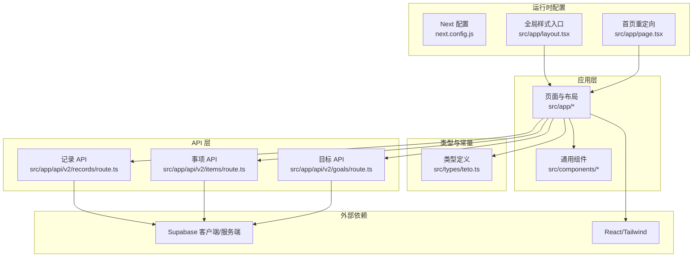
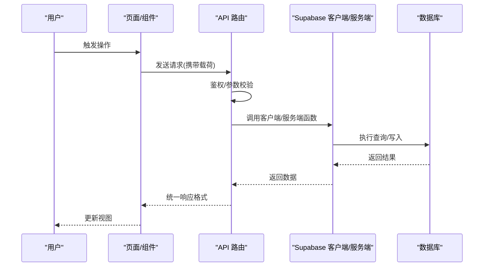
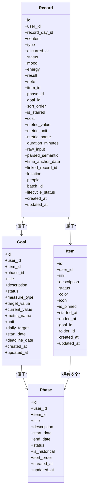
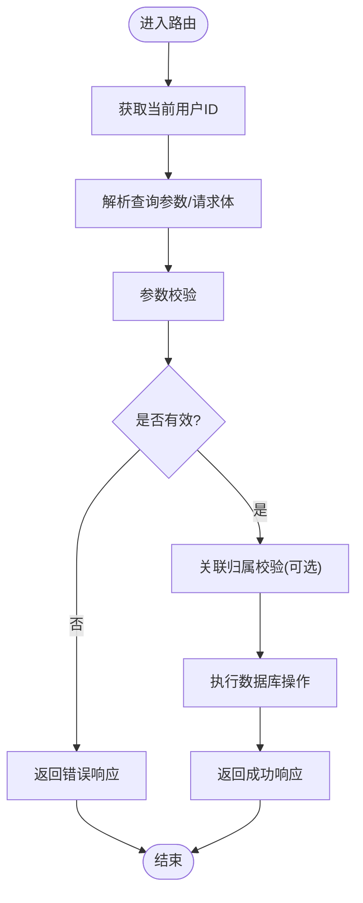
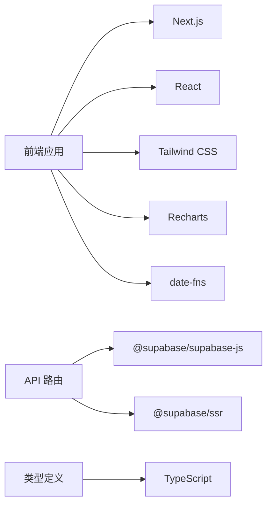

# 扩展开发

<cite>
**本文引用的文件**
- [README.md](file://README.md)
- [package.json](file://package.json)
- [next.config.js](file://next.config.js)
- [src/app/layout.tsx](file://src/app/layout.tsx)
- [src/app/page.tsx](file://src/app/page.tsx)
- [src/app/api/v2/records/route.ts](file://src/app/api/v2/records/route.ts)
- [src/app/api/v2/items/route.ts](file://src/app/api/v2/items/route.ts)
- [src/app/api/v2/goals/route.ts](file://src/app/api/v2/goals/route.ts)
- [src/components/layout/app-sidebar.tsx](file://src/components/layout/app-sidebar.tsx)
- [src/types/teto.ts](file://src/types/teto.ts)
</cite>

## 目录
1. [简介](#简介)
2. [项目结构](#项目结构)
3. [核心组件](#核心组件)
4. [架构总览](#架构总览)
5. [详细组件分析](#详细组件分析)
6. [依赖分析](#依赖分析)
7. [性能考量](#性能考量)
8. [故障排查指南](#故障排查指南)
9. [结论](#结论)
10. [附录](#附录)

## 简介
本指南面向希望为 TETO 项目开发扩展的工程师，围绕“插件开发框架、自定义组件开发方法、API 扩展技术”提供系统化说明。内容覆盖：
- 如何添加新的记录类型与扩展项目功能
- 如何扩展数据模型、UI 组件与业务逻辑
- 扩展点识别、钩子系统使用与配置管理机制
- 数据模型扩展、UI 组件扩展与业务逻辑扩展的实现路径
- 最佳实践、性能考虑与兼容性要求
- 扩展打包、分发与版本管理策略
- 扩展测试方法、调试技巧与部署流程

## 项目结构
TETO 采用 Next.js App Router 架构，前端以 TypeScript + Tailwind CSS 实现，后端 API 使用 App Router 下的路由文件组织，数据访问通过 Supabase 客户端与服务端函数实现。

图示来源
- [src/app/layout.tsx:1-13](file://src/app/layout.tsx#L1-L13)
- [src/app/page.tsx:1-5](file://src/app/page.tsx#L1-L5)
- [src/app/api/v2/records/route.ts:1-86](file://src/app/api/v2/records/route.ts#L1-L86)
- [src/app/api/v2/items/route.ts:1-47](file://src/app/api/v2/items/route.ts#L1-L47)
- [src/app/api/v2/goals/route.ts:1-49](file://src/app/api/v2/goals/route.ts#L1-L49)
- [src/types/teto.ts:1-516](file://src/types/teto.ts#L1-L516)

章节来源
- [README.md:1-126](file://README.md#L1-L126)
- [package.json:1-44](file://package.json#L1-L44)
- [next.config.js:1-4](file://next.config.js#L1-L4)

## 核心组件
- 类型与数据模型：集中于类型定义文件，明确记录、事项、目标、阶段等核心实体及查询/请求载荷，便于扩展时保持一致的契约。
- API 路由：每个资源（记录、事项、目标）均提供 GET/POST 等标准路由，统一鉴权与错误处理。
- 前端布局与导航：提供统一的侧边栏与页面入口，便于新增页面与模块接入。
- 运行时配置：Next.js 配置与全局样式入口，保证扩展页面与现有主题一致。

章节来源
- [src/types/teto.ts:1-516](file://src/types/teto.ts#L1-L516)
- [src/app/api/v2/records/route.ts:1-86](file://src/app/api/v2/records/route.ts#L1-L86)
- [src/app/api/v2/items/route.ts:1-47](file://src/app/api/v2/items/route.ts#L1-L47)
- [src/app/api/v2/goals/route.ts:1-49](file://src/app/api/v2/goals/route.ts#L1-L49)
- [src/components/layout/app-sidebar.tsx:1-147](file://src/components/layout/app-sidebar.tsx#L1-L147)
- [src/app/layout.tsx:1-13](file://src/app/layout.tsx#L1-L13)
- [src/app/page.tsx:1-5](file://src/app/page.tsx#L1-L5)

## 架构总览
TETO 的扩展开发遵循“类型驱动 + 路由扩展 + 组件扩展”的三步法：
- 类型驱动：在类型定义中声明新字段、新枚举、新查询/载荷，确保前后端契约一致。
- 路由扩展：在 App Router 下新增路由文件，复用鉴权与错误处理模式，实现 CRUD 或业务逻辑。
- 组件扩展：在现有页面或新增页面中引入自定义组件，保持 UI 一致性与交互体验。

图示来源
- [src/app/api/v2/records/route.ts:1-86](file://src/app/api/v2/records/route.ts#L1-L86)
- [src/app/api/v2/items/route.ts:1-47](file://src/app/api/v2/items/route.ts#L1-L47)
- [src/app/api/v2/goals/route.ts:1-49](file://src/app/api/v2/goals/route.ts#L1-L49)

## 详细组件分析

### 数据模型扩展（记录、事项、目标、阶段）
- 新增记录类型：在类型定义中扩展记录类型枚举，并在路由中补充相应字段的校验与落库逻辑。
- 新增查询条件：在查询类型中增加新字段，路由中解析并传递至数据层。
- 新增请求/响应载荷：在创建/更新载荷中加入新字段，路由中进行校验与转换。
- 关系扩展：如新增关联实体，需同步扩展类型与路由中的校验与返回。

图示来源
- [src/types/teto.ts:37-74](file://src/types/teto.ts#L37-L74)
- [src/types/teto.ts:76-94](file://src/types/teto.ts#L76-L94)
- [src/types/teto.ts:316-335](file://src/types/teto.ts#L316-L335)
- [src/types/teto.ts:338-354](file://src/types/teto.ts#L338-L354)

章节来源
- [src/types/teto.ts:1-516](file://src/types/teto.ts#L1-L516)

### API 扩展（以记录为例）
- 鉴权与错误处理：统一从鉴权模块获取用户 ID，并在异常时返回标准化错误码。
- 参数解析与校验：从查询字符串解析参数，必要时进行类型转换与非空校验。
- 关联校验：如涉及外键，先查询并校验归属关系。
- 统一响应：成功返回统一数据结构，失败返回错误信息与状态码。

图示来源
- [src/app/api/v2/records/route.ts:1-86](file://src/app/api/v2/records/route.ts#L1-L86)
- [src/app/api/v2/items/route.ts:1-47](file://src/app/api/v2/items/route.ts#L1-L47)
- [src/app/api/v2/goals/route.ts:1-49](file://src/app/api/v2/goals/route.ts#L1-L49)

章节来源
- [src/app/api/v2/records/route.ts:1-86](file://src/app/api/v2/records/route.ts#L1-L86)
- [src/app/api/v2/items/route.ts:1-47](file://src/app/api/v2/items/route.ts#L1-L47)
- [src/app/api/v2/goals/route.ts:1-49](file://src/app/api/v2/goals/route.ts#L1-L49)

### UI 组件扩展（导航与页面）
- 导航扩展：在侧边栏中新增导航项，保持图标、文案与激活态一致。
- 页面扩展：在 App Router 下新增页面，复用现有布局与样式入口。
- 组件复用：在页面中引入自定义组件，遵循现有交互与状态管理模式。

章节来源
- [src/components/layout/app-sidebar.tsx:1-147](file://src/components/layout/app-sidebar.tsx#L1-L147)
- [src/app/layout.tsx:1-13](file://src/app/layout.tsx#L1-L13)
- [src/app/page.tsx:1-5](file://src/app/page.tsx#L1-L5)

### 配置管理机制
- 环境变量：通过环境变量控制 Supabase 凭据与开发模式开关。
- Next 配置：允许开发时指定受信来源，便于本地联调。
- 全局样式：统一的全局样式入口，保证扩展页面风格一致。

章节来源
- [README.md:54-62](file://README.md#L54-L62)
- [next.config.js:1-4](file://next.config.js#L1-L4)
- [src/app/layout.tsx:1-13](file://src/app/layout.tsx#L1-L13)

## 依赖分析
- 前端依赖：Next.js、React、Tailwind CSS、Recharts、date-fns 等。
- 数据访问：Supabase 客户端与服务端 SDK，配合路由层进行数据库操作。
- 类型系统：TypeScript 提供强类型保障，扩展时需同步更新类型定义。

图示来源
- [package.json:15-32](file://package.json#L15-L32)
- [src/app/api/v2/records/route.ts:1-86](file://src/app/api/v2/records/route.ts#L1-L86)

章节来源
- [package.json:1-44](file://package.json#L1-L44)

## 性能考量
- 路由层缓存：对只读查询可结合缓存策略减少数据库压力（建议在路由层或服务层引入缓存中间件）。
- 分页与限制：列表查询默认限制数量，避免一次性返回大量数据。
- 数据库索引：为常用查询字段建立索引，提升查询性能。
- 组件渲染：合理拆分组件与懒加载，避免不必要的重渲染。
- API 并发：批量操作时合并请求，减少网络往返。

## 故障排查指南
- 鉴权失败：确认用户登录状态与用户 ID 获取逻辑，检查路由中的鉴权分支。
- 参数错误：核对查询参数与请求体字段，确保类型转换与非空校验。
- 关联校验失败：检查外键归属关系，确保用户对目标资源的可见性。
- 统一错误响应：根据错误消息映射到 401/400/500 等状态码，便于前端处理。

章节来源
- [src/app/api/v2/records/route.ts:35-41](file://src/app/api/v2/records/route.ts#L35-L41)
- [src/app/api/v2/items/route.ts:19-25](file://src/app/api/v2/items/route.ts#L19-L25)
- [src/app/api/v2/goals/route.ts:21-27](file://src/app/api/v2/goals/route.ts#L21-L27)

## 结论
通过类型驱动、路由扩展与组件扩展三位一体的方法，TETO 为扩展开发提供了清晰的路径。遵循本文档的扩展点识别、钩子系统使用与配置管理机制，结合最佳实践与性能考量，开发者可以安全、高效地为系统增添新功能并保持兼容性。

## 附录

### 扩展开发最佳实践
- 类型先行：先在类型定义中声明变更，再实现路由与组件。
- 路由复用：复用鉴权与错误处理模式，保持一致性。
- 组件解耦：尽量将业务逻辑抽象为可复用组件，降低耦合度。
- 测试覆盖：为新增路由与组件编写单元与集成测试，确保边界条件与异常场景被覆盖。
- 文档同步：更新相关文档与注释，确保团队成员可快速理解变更。

### 兼容性要求
- 版本升级：遵循语义化版本，避免破坏性变更；对废弃字段提供迁移策略。
- 向后兼容：新增字段默认可选，避免影响既有调用方。
- 数据迁移：对数据库结构变更提供迁移脚本，并在部署前验证。

### 打包、分发与版本管理
- 包管理：使用 NPM/Yarn 管理依赖，确保版本锁定与可重现构建。
- 版本标签：为扩展打上版本标签，便于回滚与追踪。
- 发布策略：采用灰度发布或蓝绿部署，降低风险。

### 测试方法与调试技巧
- 单元测试：针对路由与工具函数编写测试，覆盖正常与异常路径。
- 集成测试：模拟 API 调用链路，验证端到端行为。
- 调试技巧：利用浏览器开发者工具与日志，定位鉴权、参数与数据库环节的问题。