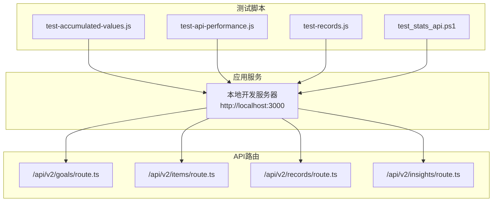
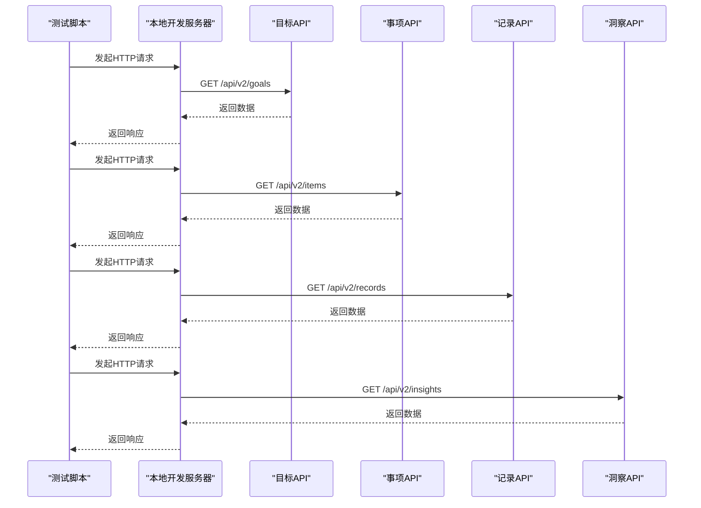
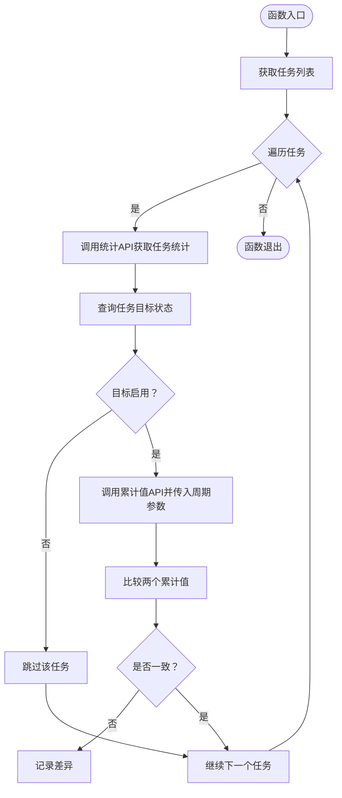
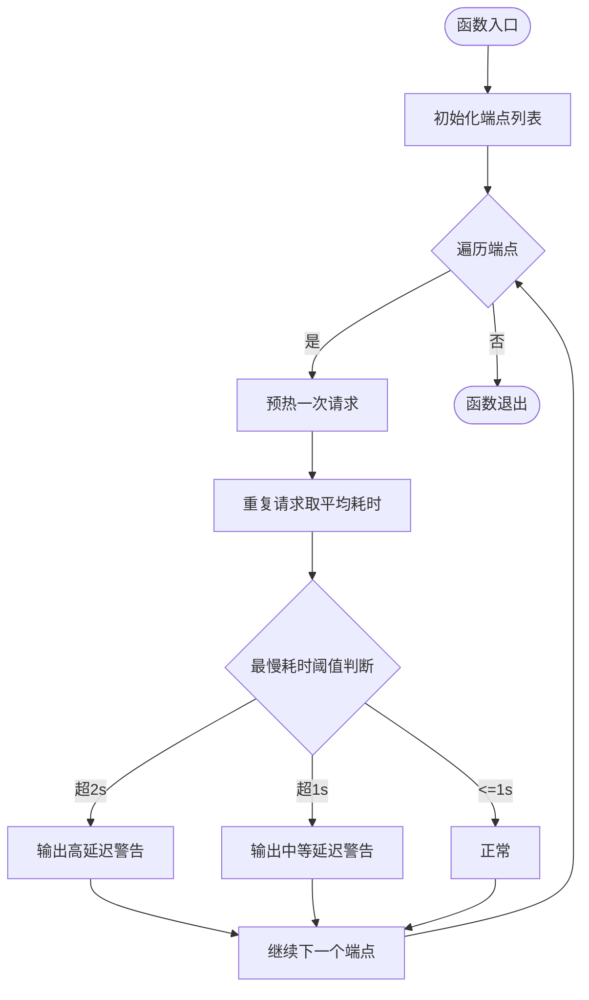
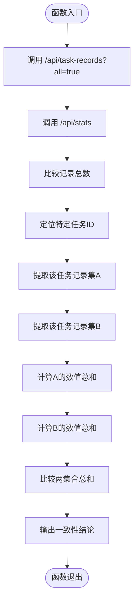
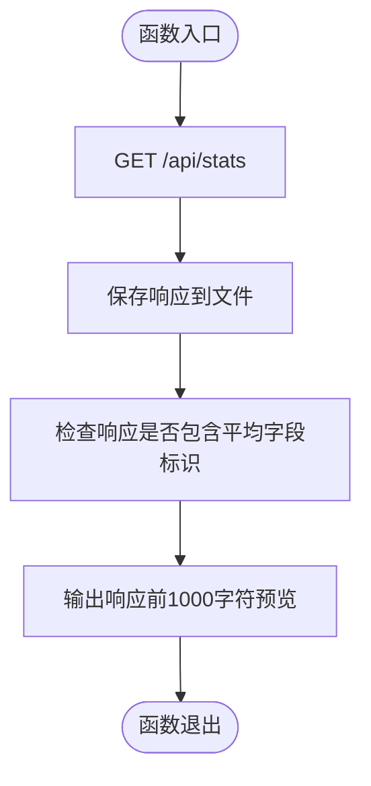
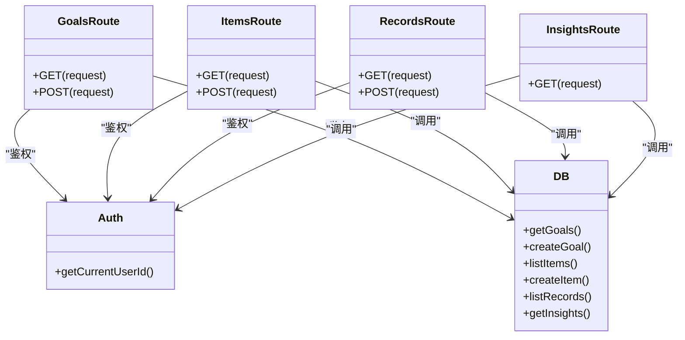
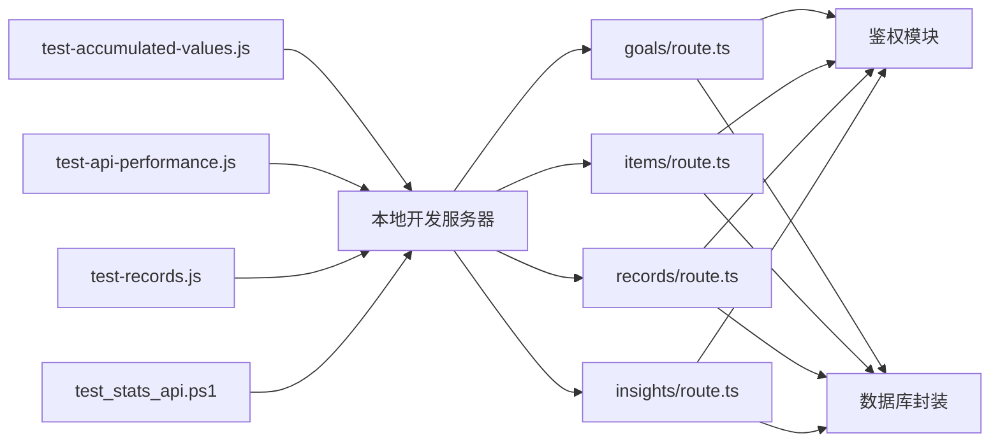

# 扩展测试与质量保证

<cite>
**本文引用的文件**
- [package.json](file://package.json)
- [README.md](file://README.md)
- [test-accumulated-values.js](file://test/scripts/test-accumulated-values.js)
- [test-api-performance.js](file://test/scripts/test-api-performance.js)
- [test-records.js](file://test/scripts/test-records.js)
- [test_stats_api.ps1](file://test/scripts/test_stats_api.ps1)
- [route.ts](file://src/app/api/v2/goals/route.ts)
- [route.ts](file://src/app/api/v2/items/route.ts)
- [route.ts](file://src/app/api/v2/records/route.ts)
- [route.ts](file://src/app/api/v2/insights/route.ts)
</cite>

## 目录
1. [引言](#引言)
2. [项目结构](#项目结构)
3. [核心组件](#核心组件)
4. [架构总览](#架构总览)
5. [详细组件分析](#详细组件分析)
6. [依赖分析](#依赖分析)
7. [性能考虑](#性能考虑)
8. [故障排查指南](#故障排查指南)
9. [结论](#结论)
10. [附录](#附录)

## 引言
本指南面向TETO项目的扩展测试与质量保证工作，围绕现有测试脚本与API路由，系统化阐述测试策略设计原则与实施路径，覆盖单元测试、集成测试与端到端测试的协同方法；提供从测试用例设计到自动化执行的完整流程；明确性能测试、安全测试与兼容性测试的落地手段；并给出测试覆盖率分析、性能基准测试与回归测试策略建议，以及测试环境搭建、持续集成与质量门禁的配置要点，帮助扩展测试开发者保障扩展功能的质量与稳定性。

## 项目结构
TETO项目采用Next.js App Router架构，前端页面与API路由位于src/app目录下，测试脚本集中于test/scripts目录。测试脚本以Node.js脚本形式直接调用本地开发服务器的API端点，验证数据一致性、性能与基本可用性。

**图示来源**
- [test-accumulated-values.js:1-65](file://test/scripts/test-accumulated-values.js#L1-L65)
- [test-api-performance.js:1-82](file://test/scripts/test-api-performance.js#L1-L82)
- [test-records.js:1-57](file://test/scripts/test-records.js#L1-L57)
- [test_stats_api.ps1:1-16](file://test/scripts/test_stats_api.ps1#L1-L16)
- [route.ts:1-49](file://src/app/api/v2/goals/route.ts#L1-L49)
- [route.ts:1-47](file://src/app/api/v2/items/route.ts#L1-L47)
- [route.ts:1-86](file://src/app/api/v2/records/route.ts#L1-L86)
- [route.ts:1-32](file://src/app/api/v2/insights/route.ts#L1-L32)

**章节来源**
- [README.md:1-126](file://README.md#L1-L126)
- [package.json:1-44](file://package.json#L1-L44)

## 核心组件
- 测试脚本层：提供API一致性校验、性能基准与响应内容验证能力，支撑快速回归与性能监控。
- API路由层：提供目标、事项、记录、洞察等核心业务接口，统一处理鉴权、参数校验与错误码返回。
- 应用服务层：本地开发服务器承载测试脚本调用，模拟生产环境请求链路。

关键职责划分：
- 一致性测试：通过对比不同端点返回的关键指标，验证数据聚合逻辑与缓存一致性。
- 性能测试：对高频端点进行多次请求取平均耗时，识别性能瓶颈。
- 兼容性测试：通过PowerShell脚本抓取响应并进行结构与字段校验，辅助跨平台兼容验证。

**章节来源**
- [test-accumulated-values.js:1-65](file://test/scripts/test-accumulated-values.js#L1-L65)
- [test-api-performance.js:1-82](file://test/scripts/test-api-performance.js#L1-L82)
- [test-records.js:1-57](file://test/scripts/test-records.js#L1-L57)
- [test_stats_api.ps1:1-16](file://test/scripts/test_stats_api.ps1#L1-L16)
- [route.ts:1-49](file://src/app/api/v2/goals/route.ts#L1-L49)
- [route.ts:1-47](file://src/app/api/v2/items/route.ts#L1-L47)
- [route.ts:1-86](file://src/app/api/v2/records/route.ts#L1-L86)
- [route.ts:1-32](file://src/app/api/v2/insights/route.ts#L1-L32)

## 架构总览
下图展示测试脚本与API路由之间的交互关系，以及本地开发服务器作为统一接入点的角色。

**图示来源**
- [test-accumulated-values.js:1-65](file://test/scripts/test-accumulated-values.js#L1-L65)
- [test-api-performance.js:1-82](file://test/scripts/test-api-performance.js#L1-L82)
- [test-records.js:1-57](file://test/scripts/test-records.js#L1-L57)
- [test_stats_api.ps1:1-16](file://test/scripts/test_stats_api.ps1#L1-L16)
- [route.ts:1-49](file://src/app/api/v2/goals/route.ts#L1-L49)
- [route.ts:1-47](file://src/app/api/v2/items/route.ts#L1-L47)
- [route.ts:1-86](file://src/app/api/v2/records/route.ts#L1-L86)
- [route.ts:1-32](file://src/app/api/v2/insights/route.ts#L1-L32)

## 详细组件分析

### 组件A：累计值一致性测试
该脚本用于验证统计分析页面与记录页面的累计值一致性，通过对比不同端点返回的累计值，发现潜在的数据聚合或缓存不一致问题。

**图示来源**
- [test-accumulated-values.js:1-65](file://test/scripts/test-accumulated-values.js#L1-L65)

**章节来源**
- [test-accumulated-values.js:1-65](file://test/scripts/test-accumulated-values.js#L1-L65)

### 组件B：API性能测试
该脚本对多个关键API端点进行多次请求取平均耗时，识别异常慢请求并输出警告提示，便于建立性能基线与回归监控。

**图示来源**
- [test-api-performance.js:1-82](file://test/scripts/test-api-performance.js#L1-L82)

**章节来源**
- [test-api-performance.js:1-82](file://test/scripts/test-api-performance.js#L1-L82)

### 组件C：记录数据一致性测试
该脚本对比不同端点返回的记录数量与聚合值，确保数据源一致性与统计准确性。

**图示来源**
- [test-records.js:1-57](file://test/scripts/test-records.js#L1-L57)

**章节来源**
- [test-records.js:1-57](file://test/scripts/test-records.js#L1-L57)

### 组件D：PowerShell响应抓取与字段校验
该脚本通过PowerShell抓取统计API响应并进行结构与字段校验，辅助跨平台兼容性测试。

**图示来源**
- [test_stats_api.ps1:1-16](file://test/scripts/test_stats_api.ps1#L1-L16)

**章节来源**
- [test_stats_api.ps1:1-16](file://test/scripts/test_stats_api.ps1#L1-L16)

### 组件E：API路由层（目标/事项/记录/洞察）
这些路由负责鉴权、参数解析、业务调用与错误处理，是测试脚本验证的核心对象。

**图示来源**
- [route.ts:1-49](file://src/app/api/v2/goals/route.ts#L1-L49)
- [route.ts:1-47](file://src/app/api/v2/items/route.ts#L1-L47)
- [route.ts:1-86](file://src/app/api/v2/records/route.ts#L1-L86)
- [route.ts:1-32](file://src/app/api/v2/insights/route.ts#L1-L32)

**章节来源**
- [route.ts:1-49](file://src/app/api/v2/goals/route.ts#L1-L49)
- [route.ts:1-47](file://src/app/api/v2/items/route.ts#L1-L47)
- [route.ts:1-86](file://src/app/api/v2/records/route.ts#L1-L86)
- [route.ts:1-32](file://src/app/api/v2/insights/route.ts#L1-L32)

## 依赖分析
- 测试脚本依赖本地开发服务器提供的API端点，形成“脚本-服务-路由”的单向依赖链。
- API路由依赖鉴权模块与数据库封装，错误处理统一返回401/400/500等状态码。
- 项目整体依赖Next.js、TypeScript与Supabase，测试环境需保持与生产环境一致的依赖版本。

**图示来源**
- [test-accumulated-values.js:1-65](file://test/scripts/test-accumulated-values.js#L1-L65)
- [test-api-performance.js:1-82](file://test/scripts/test-api-performance.js#L1-L82)
- [test-records.js:1-57](file://test/scripts/test-records.js#L1-L57)
- [test_stats_api.ps1:1-16](file://test/scripts/test_stats_api.ps1#L1-L16)
- [route.ts:1-49](file://src/app/api/v2/goals/route.ts#L1-L49)
- [route.ts:1-47](file://src/app/api/v2/items/route.ts#L1-L47)
- [route.ts:1-86](file://src/app/api/v2/records/route.ts#L1-L86)
- [route.ts:1-32](file://src/app/api/v2/insights/route.ts#L1-L32)

**章节来源**
- [package.json:1-44](file://package.json#L1-L44)
- [README.md:1-126](file://README.md#L1-L126)

## 性能考虑
- 基准建立：使用性能测试脚本对高频端点进行多轮采样，记录平均耗时与最慢耗时，形成性能基线。
- 回归监控：将性能测试纳入CI流水线，设定阈值告警，避免引入性能退化。
- 优化方向：关注数据库查询索引、鉴权中间件开销、序列化成本与网络往返时间。
- 缓存策略：对统计类接口可引入短期缓存，减少重复计算；同时通过一致性测试验证缓存命中与失效策略。

## 故障排查指南
- 鉴权失败：若出现401错误，检查鉴权模块与会话状态，确认测试脚本是否携带有效凭证或处于开发模式。
- 参数校验：若出现400错误，核对请求参数格式与必填字段，确保与路由定义一致。
- 数据不一致：若累计值或统计值不一致，优先检查数据聚合逻辑与缓存同步机制。
- 性能异常：若最慢耗时超过阈值，结合数据库查询日志与网络监控定位瓶颈。

**章节来源**
- [route.ts:1-49](file://src/app/api/v2/goals/route.ts#L1-L49)
- [route.ts:1-47](file://src/app/api/v2/items/route.ts#L1-L47)
- [route.ts:1-86](file://src/app/api/v2/records/route.ts#L1-L86)
- [route.ts:1-32](file://src/app/api/v2/insights/route.ts#L1-L32)
- [test-api-performance.js:1-82](file://test/scripts/test-api-performance.js#L1-L82)

## 结论
通过现有测试脚本与API路由的协同，TETO项目已具备扩展测试与质量保证的基础能力。建议在此基础上完善单元测试与端到端测试矩阵，建立性能基线与回归策略，并将测试脚本纳入CI流水线，配合质量门禁实现持续交付与稳定发布。

## 附录

### 测试策略设计原则
- 单元测试：针对业务函数与工具函数进行隔离测试，确保核心逻辑正确性。
- 集成测试：围绕API路由与数据库封装进行端到端验证，覆盖鉴权、参数校验与错误处理。
- 端到端测试：模拟真实用户场景，验证页面交互与数据流完整性。

### 测试开发流程
- 用例设计：基于API路由定义与业务需求，设计覆盖正反例与边界条件的测试用例。
- 脚本实现：参考现有脚本风格，编写可复用的测试脚本，统一输出与日志格式。
- 自动化执行：将测试脚本集成至CI/CD，设置定时任务与PR触发策略。
- 结果分析：汇总测试报告，识别失败用例与性能退化，推动修复闭环。

### 覆盖率分析、性能基准与回归策略
- 覆盖率：结合单元测试与集成测试，逐步提升关键路径与异常分支的覆盖率。
- 基准：以性能测试脚本输出的平均耗时与最慢耗时为基准，建立阈值与趋势图。
- 回归：每次变更后运行全量测试脚本，确保功能与性能不回退。

### 测试环境搭建与质量门禁
- 环境要求：本地开发服务器需与生产环境依赖版本一致，确保测试结果可复现。
- 质量门禁：在CI中设置测试通过与性能阈值双关卡，阻断不达标合并。

**章节来源**
- [README.md:1-126](file://README.md#L1-L126)
- [package.json:1-44](file://package.json#L1-L44)