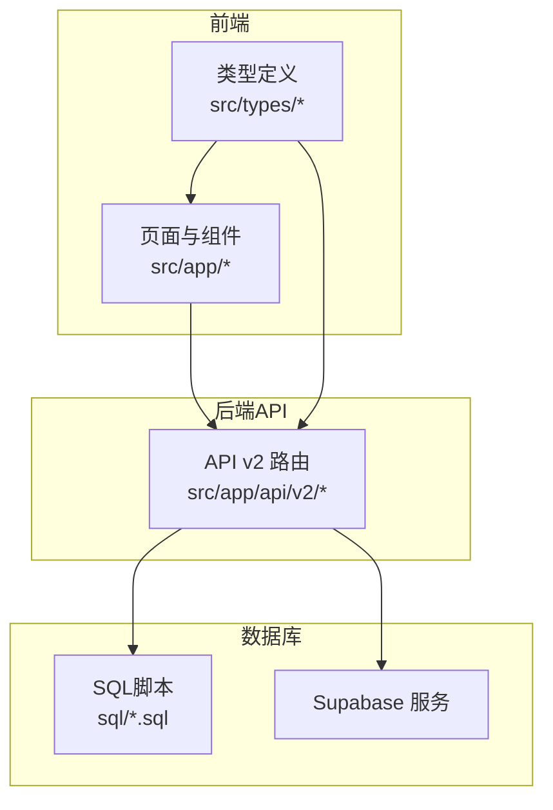
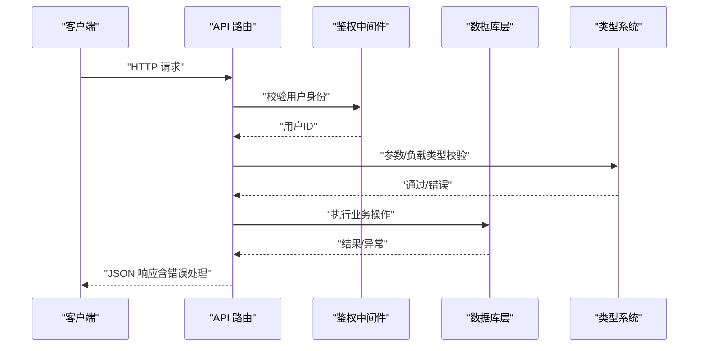
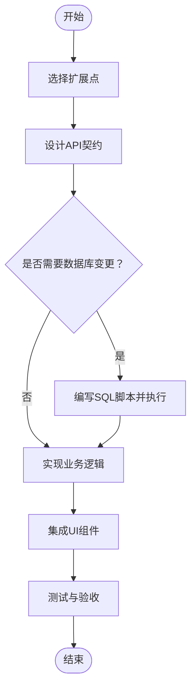
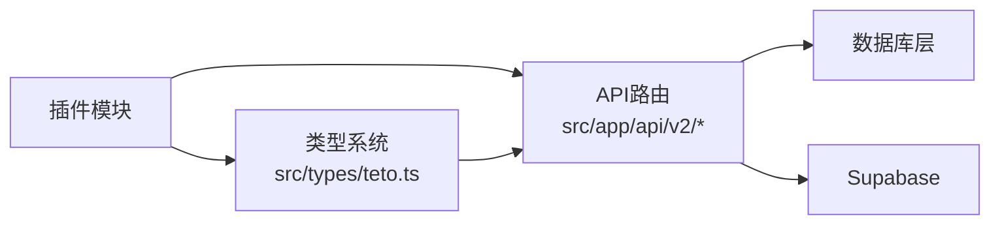

# 插件开发框架

<cite>
**本文引用的文件**
- [README.md](file://README.md)
- [teto.ts](file://src/types/teto.ts)
- [semantic.ts](file://src/types/semantic.ts)
- [records/route.ts](file://src/app/api\v2\records\route.ts)
- [items/route.ts](file://src/app/api\v2\items\route.ts)
- [goals/route.ts](file://src/app/api\v2\goals\route.ts)
- [008_record_links_and_batch.sql](file://sql/008_record_links_and_batch.sql)
- [005_teto_1_4_status_chinese_migration.sql](file://sql/005_teto_1_4_status_chinese_migration.sql)
- [TETO 1.4 开发规则.md](file://docs/01-生效版本/TETO 1.4/TETO 1.4 开发规则.md)
- [TETO 1.0.1 开发规则.md](file://docs/10-版本归档/TETO 1.0.1/TETO 1.0.1 开发规则.md)
- [TETO 1.2 开发规则.md](file://docs/10-版本归档/TETO 1.2/TETO 1.2 开发规则.md)
</cite>

## 目录
1. [简介](#简介)
2. [项目结构](#项目结构)
3. [核心组件](#核心组件)
4. [架构总览](#架构总览)
5. [详细组件分析](#详细组件分析)
6. [依赖分析](#依赖分析)
7. [性能考虑](#性能考虑)
8. [故障排查指南](#故障排查指南)
9. [结论](#结论)
10. [附录](#附录)

## 简介
本指南面向希望在TETO项目中开发“插件”的工程师，目标是帮助你在不破坏现有系统稳定性的前提下，基于现有的数据类型系统与API架构安全地扩展功能。你将学会：
- 如何识别插件系统的扩展点（记录类型扩展、API端点扩展、UI组件扩展）
- 插件开发的完整流程（从插件注册到功能实现）
- 插件配置管理、生命周期管理与错误处理机制
- 如何利用现有枚举类型（RECORD_TYPES、LIFECYCLE_STATUSES等）与接口定义开发兼容插件
- 插件测试方法、调试技巧与性能优化建议

## 项目结构
TETO采用Next.js App Router + Supabase的前后端分离架构。核心结构要点：
- 类型系统集中于 src/types，包含数据模型、枚举与API请求/响应类型
- API v2位于 src/app/api/v2，每个资源（records/items/goals等）对应独立路由文件
- 数据库结构通过 sql/*.sql 文件管理，遵循“先落SQL，再验证”的规则
- 文档目录 docs/ 下包含版本化的开发规则与验收标准，指导插件开发边界

**章节来源**
- [README.md: 13-21:13-21](file://README.md#L13-L21)
- [README.md: 63-90:63-90](file://README.md#L63-L90)

## 核心组件
本节聚焦插件开发所需的关键构件：类型系统、API端点与数据库结构。

- 类型系统（src/types/teto.ts）
  - 枚举与字面量：RECORD_TYPES、LIFECYCLE_STATUSES、ITEM_STATUSES、GOAL_STATUSES、PHASE_STATUSES等
  - 核心接口：Record、Item、Goal、Phase、RecordLink、Tag等
  - API请求/响应类型：CreateRecordPayload、UpdateRecordPayload、CreateItemPayload、CreateGoalPayload等
  - 语义解析类型：TimeAnchor、SemanticMetric、ParsedSemantic、ParsedResult等

- API端点（src/app/api/v2/*）
  - 记录：GET/POST /api/v2/records
  - 事项：GET/POST /api/v2/items
  - 目标：GET/POST /api/v2/goals
  - 每个端点均包含鉴权校验、参数解析、调用数据库层、统一错误处理

- 数据库结构（sql/*.sql）
  - 记录微关联与批次拆分：record_links、records.batch_id、records.lifecycle_status
  - 阶段状态中文迁移：phases.status 中文化与CHECK约束更新

**章节来源**
- [teto.ts: 12-19:12-19](file://src/types/teto.ts#L12-L19)
- [teto.ts: 37-74:37-74](file://src/types/teto.ts#L37-L74)
- [teto.ts: 133-192:133-192](file://src/types/teto.ts#L133-L192)
- [records/route.ts: 1-86:1-86](file://src/app/api\v2\records\route.ts#L1-L86)
- [items/route.ts: 1-47:1-47](file://src/app/api\v2\items\route.ts#L1-L47)
- [goals/route.ts: 1-49:1-49](file://src/app/api\v2\goals\route.ts#L1-L49)
- [008_record_links_and_batch.sql: 6-31:6-31](file://sql/008_record_links_and_batch.sql#L6-L31)
- [005_teto_1_4_status_chinese_migration.sql: 26-37:26-37](file://sql/005_teto_1_4_status_chinese_migration.sql#L26-L37)

## 架构总览
TETO的插件扩展应遵循“类型驱动 + API边界 + 数据库契约”的三层约束：
- 类型驱动：插件需使用现有枚举与接口，避免破坏类型一致性
- API边界：插件通过新增或扩展现有API端点暴露能力，保持HTTP语义与错误码约定
- 数据库契约：插件若涉及持久化，必须通过SQL脚本落地，并满足“可验证”的验收标准

**图表来源**
- [records/route.ts: 7-42:7-42](file://src/app/api\v2\records\route.ts#L7-L42)
- [items/route.ts: 6-26:6-26](file://src/app/api\v2\items\route.ts#L6-L26)
- [goals/route.ts: 6-28:6-28](file://src/app/api\v2\goals\route.ts#L6-L28)

## 详细组件分析

### 扩展点识别与插件注册
- 记录类型扩展（RECORD_TYPES）
  - 现有值：['发生', '计划', '想法', '总结']
  - 插件若需新增记录类型，应在类型系统中扩展枚举，并同步更新API与UI
  - 参考：[teto.ts: 12-13:12-13](file://src/types/teto.ts#L12-L13)

- 生命周期状态扩展（LIFECYCLE_STATUSES）
  - 现有值：['active', 'completed', 'postponed', 'cancelled']
  - 插件可基于此扩展工作流（如Todo流转），但需遵循CHECK约束与中文迁移规则
  - 参考：[teto.ts: 18-19:18-19](file://src/types/teto.ts#L18-L19)、[008_record_links_and_batch.sql: 28-31:28-31](file://sql/008_record_links_and_batch.sql#L28-L31)

- API端点扩展
  - 新增资源：在 src/app/api/v2 下新增路由文件，遵循现有鉴权与错误处理模式
  - 扩展现有端点：在现有路由中增加查询参数或负载字段，保持向后兼容
  - 参考：[records/route.ts: 1-86:1-86](file://src/app/api\v2\records\route.ts#L1-L86)、[items/route.ts: 1-47:1-47](file://src/app/api\v2\items\route.ts#L1-L47)、[goals/route.ts: 1-49:1-49](file://src/app/api\v2\goals\route.ts#L1-L49)

- UI组件扩展
  - 插件应尽量通过组合现有组件与类型系统实现，避免破坏既有布局与交互
  - 若需新增页面/路由，参考现有页面结构与客户端组件模式
  - 参考：[README.md: 5-11:5-11](file://README.md#L5-L11)

**章节来源**
- [teto.ts: 12-19:12-19](file://src/types/teto.ts#L12-L19)
- [008_record_links_and_batch.sql: 28-31:28-31](file://sql/008_record_links_and_batch.sql#L28-L31)
- [records/route.ts: 1-86:1-86](file://src/app/api\v2\records\route.ts#L1-L86)
- [items/route.ts: 1-47:1-47](file://src/app/api\v2\items\route.ts#L1-L47)
- [goals/route.ts: 1-49:1-49](file://src/app/api\v2\goals\route.ts#L1-L49)
- [README.md: 5-11:5-11](file://README.md#L5-L11)

### 插件开发流程（从注册到实现）
- 步骤1：确定扩展点
  - 选择记录类型、API端点或UI组件扩展
  - 在类型系统中声明新枚举/接口，确保与现有类型兼容

- 步骤2：设计API契约
  - 明确HTTP方法、路径、查询参数与请求/响应体
  - 参考现有路由的错误处理与鉴权模式

- 步骤3：实现数据库变更（如需）
  - 在 sql/ 目录新增SQL文件，遵循命名规范与“先落SQL再验证”原则
  - 在数据库控制台执行脚本并验证

- 步骤4：实现业务逻辑
  - 在路由中调用数据库层函数，进行参数校验与业务处理
  - 返回统一格式的JSON响应

- 步骤5：集成UI
  - 在页面或组件中消费新API，使用类型系统提供的接口
  - 保持交互与视觉风格一致

- 步骤6：测试与验收
  - 使用现有测试脚本与数据进行回归测试
  - 按照开发规则进行验收，确保“页面能打开、数据能保存/读取/回显、Supabase可见”

**章节来源**
- [TETO 1.4 开发规则.md: 576-588:576-588](file://docs/01-生效版本/TETO 1.4/TETO 1.4 开发规则.md#L576-L588)
- [TETO 1.0.1 开发规则.md: 210-233:210-233](file://docs/10-版本归档/TETO 1.0.1/TETO 1.0.1 开发规则.md#L210-L233)
- [TETO 1.2 开发规则.md: 431-453:431-453](file://docs/10-版本归档/TETO 1.2/TETO 1.2 开发规则.md#L431-L453)

### 配置管理与生命周期管理
- 配置管理
  - 环境变量：NEXT_PUBLIC_SUPABASE_URL、NEXT_PUBLIC_SUPABASE_ANON_KEY、开发模式开关等
  - 插件配置建议通过环境变量或Supabase配置表管理，避免硬编码

- 生命周期管理
  - 记录生命周期：使用 LIFECYCLE_STATUSES 控制Todo流转
  - 阶段生命周期：使用 PHASE_STATUSES 管理阶段状态
  - 插件应遵循现有状态机，避免引入不可验证的状态

**章节来源**
- [README.md: 54-62:54-62](file://README.md#L54-L62)
- [teto.ts: 18-19:18-19](file://src/types/teto.ts#L18-L19)
- [teto.ts: 308-309:308-309](file://src/types/teto.ts#L308-L309)

### 错误处理机制
- 统一错误响应
  - 成功：返回 { data: ... }
  - 失败：返回 { error: string, details?: string }
  - 鉴权失败：返回 401
  - 其他错误：返回 500

- 鉴权与校验
  - 所有API端点均通过 getCurrentUserId 获取用户上下文
  - 对必填字段与外键归属进行校验（如item_id的user_id匹配）

**章节来源**
- [records/route.ts: 35-41:35-41](file://src/app/api\v2\records\route.ts#L35-L41)
- [items/route.ts: 19-25:19-25](file://src/app/api\v2\items\route.ts#L19-L25)
- [goals/route.ts: 21-27:21-27](file://src/app/api\v2\goals\route.ts#L21-L27)

### 利用现有枚举与接口开发插件
- 使用枚举类型
  - 记录类型：RECORD_TYPES
  - 生命周期：LIFECYCLE_STATUSES
  - 事项状态：ITEM_STATUSES
  - 目标/阶段状态：GOAL_STATUSES、PHASE_STATUSES

- 使用接口定义
  - CreateRecordPayload/UpdateRecordPayload
  - CreateItemPayload/UpdateItemPayload
  - CreateGoalPayload/UpdateGoalPayload
  - 查询参数：RecordsQuery、ItemsQuery、GoalsQuery

- 语义解析
  - ParsedSemantic、SemanticMetric、ParsedResult等用于AI解析与推荐

**章节来源**
- [teto.ts: 12-19:12-19](file://src/types/teto.ts#L12-L19)
- [teto.ts: 133-192:133-192](file://src/types/teto.ts#L133-L192)
- [teto.ts: 316-390:316-390](file://src/types/teto.ts#L316-L390)
- [semantic.ts: 18-65:18-65](file://src/types/semantic.ts#L18-L65)

### 插件测试方法与调试技巧
- 测试方法
  - 使用现有测试脚本进行API性能与数据一致性测试
  - 通过 Supabase SQL Editor 验证数据库变更
  - 按照验收清单逐项验证页面、数据保存/读取/回显与数据库一致性

- 调试技巧
  - 在路由中打印关键参数与错误堆栈
  - 使用浏览器网络面板检查请求/响应
  - 分模块隔离测试，避免跨模块干扰

**章节来源**
- [TETO 1.4 开发规则.md: 714-763:714-763](file://docs/01-生效版本/TETO 1.4/TETO 1.4 开发规则.md#L714-L763)
- [TETO 1.0.1 开发规则.md: 236-249:236-249](file://docs/10-版本归档/TETO 1.0.1/TETO 1.0.1 开发规则.md#L236-L249)

### 性能优化建议
- 减少不必要的查询与JOIN
- 合理使用索引（如 record_links、records.batch_id）
- 控制响应体大小，按需返回关联数据
- 使用缓存与批量操作（如批量删除记录）

**章节来源**
- [008_record_links_and_batch.sql: 24-26:24-26](file://sql/008_record_links_and_batch.sql#L24-L26)

## 依赖分析
插件开发的耦合与内聚建议：
- 低耦合：插件通过类型系统与API契约与核心系统交互，避免直接修改核心数据模型
- 高内聚：插件功能集中在单一职责的API端点与UI组件中
- 外部依赖：仅使用Supabase与Next.js生态，避免引入复杂第三方库

**图表来源**
- [teto.ts: 12-19:12-19](file://src/types/teto.ts#L12-L19)
- [records/route.ts: 1-86:1-86](file://src/app/api\v2\records\route.ts#L1-L86)

**章节来源**
- [teto.ts: 12-19:12-19](file://src/types/teto.ts#L12-L19)
- [records/route.ts: 1-86:1-86](file://src/app/api\v2\records\route.ts#L1-L86)

## 性能考虑
- 数据库层面
  - 为高频查询字段建立索引（如 batch_id、record_links索引）
  - 控制单次查询返回数量，使用分页或limit

- API层面
  - 仅在需要时附带关联数据
  - 对大型响应体进行压缩与懒加载

- 前端层面
  - 使用Suspense与并发渲染减少白屏
  - 合理拆分组件，避免一次性渲染过多节点

[本节为通用指导，无需特定文件来源]

## 故障排查指南
- 常见问题
  - 鉴权失败：检查NEXT_PUBLIC_SUPABASE_URL与NEXT_PUBLIC_SUPABASE_ANON_KEY
  - 参数缺失：核对CreateRecordPayload/UpdateRecordPayload必填字段
  - 外键归属错误：确认item_id的user_id与当前用户一致

- 排查步骤
  - 查看API返回的错误信息与HTTP状态码
  - 在Supabase控制台执行相同SQL验证数据库状态
  - 使用测试脚本复现问题并定位边界条件

**章节来源**
- [records/route.ts: 57-74:57-74](file://src/app/api\v2\records\route.ts#L57-L74)
- [README.md: 54-62:54-62](file://README.md#L54-L62)

## 结论
通过遵循类型驱动、API边界与数据库契约三条主线，插件开发者可以在TETO中安全扩展功能。务必：
- 使用现有枚举与接口，避免破坏类型一致性
- 通过新增或扩展现有API端点暴露能力
- 以SQL脚本形式落地数据库变更，并满足可验证的验收标准
- 采用模块化与测试驱动的方式，确保稳定性与可维护性

[本节为总结，无需特定文件来源]

## 附录
- 版本开发规则与验收标准可作为插件开发的权威依据
- SQL脚本命名与执行流程需严格遵循现有规范

**章节来源**
- [TETO 1.4 开发规则.md: 576-588:576-588](file://docs/01-生效版本/TETO 1.4/TETO 1.4 开发规则.md#L576-L588)
- [TETO 1.0.1 开发规则.md: 210-233:210-233](file://docs/10-版本归档/TETO 1.0.1/TETO 1.0.1 开发规则.md#L210-L233)
- [TETO 1.2 开发规则.md: 431-453:431-453](file://docs/10-版本归档/TETO 1.2/TETO 1.2 开发规则.md#L431-L453)