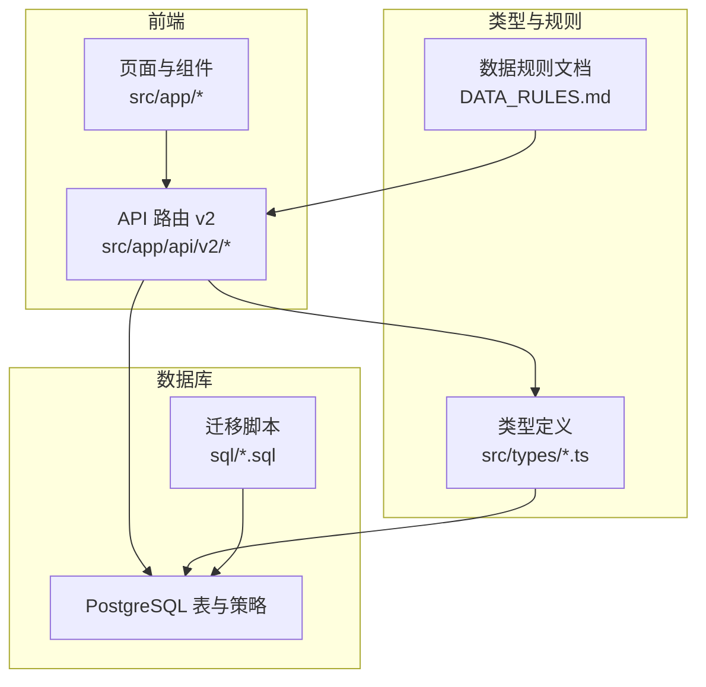
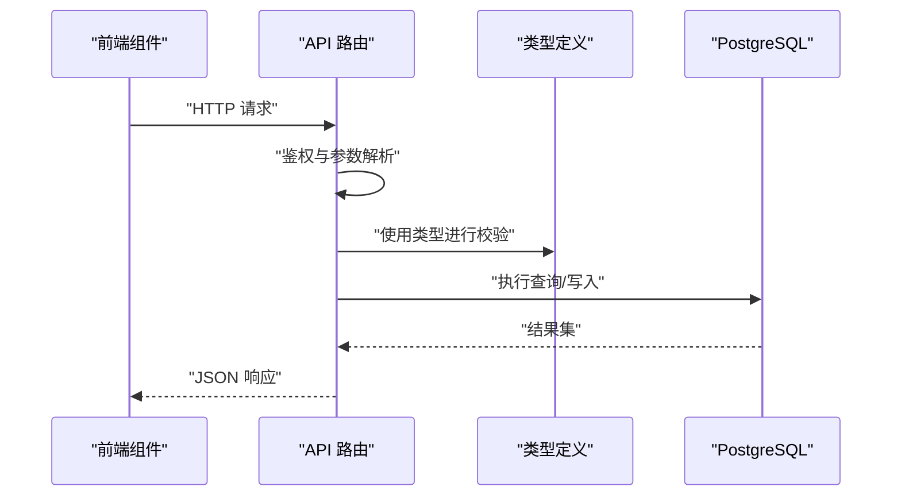
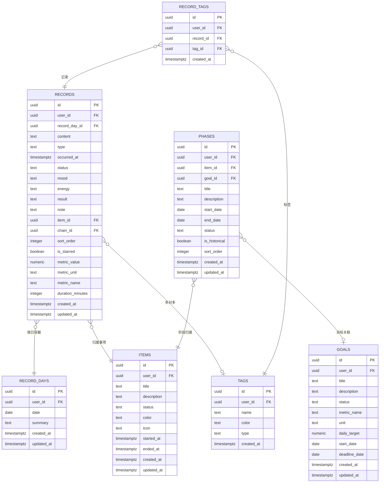
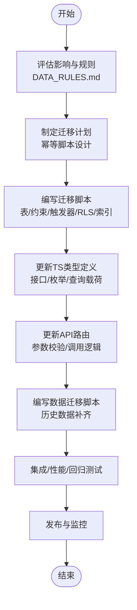
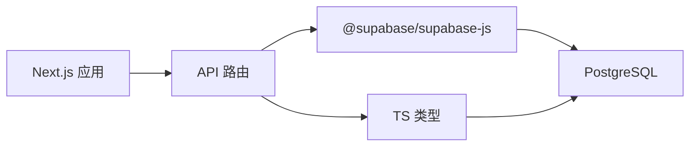

# 数据模型扩展

<cite>
**本文引用的文件**
- [src/types/teto.ts](file://src/types/teto.ts)
- [src/types/semantic.ts](file://src/types/semantic.ts)
- [DATA_RULES.md](file://DATA_RULES.md)
- [sql/001_teto_1_3_records_model.sql](file://sql/001_teto_1_3_records_model.sql)
- [sql/003_teto_1_4_phases_and_goals.sql](file://sql/003_teto_1_4_phases_and_goals.sql)
- [sql/007_record_metric_fields.sql](file://sql/007_record_metric_fields.sql)
- [sql/010_goal_benchmark_fields.sql](file://sql/010_goal_benchmark_fields.sql)
- [src/app/api/v2/records/route.ts](file://src/app/api/v2/records/route.ts)
- [src/app/api/v2/items/route.ts](file://src/app/api/v2/items/route.ts)
- [src/app/api/v2/goals/route.ts](file://src/app/api/v2/goals/route.ts)
- [package.json](file://package.json)
</cite>

## 目录
1. [简介](#简介)
2. [项目结构](#项目结构)
3. [核心组件](#核心组件)
4. [架构总览](#架构总览)
5. [详细组件分析](#详细组件分析)
6. [依赖分析](#依赖分析)
7. [性能考虑](#性能考虑)
8. [故障排查指南](#故障排查指南)
9. [结论](#结论)
10. [附录](#附录)

## 简介
本指南面向TETO项目的数据库模型扩展开发者，围绕现有数据库架构与类型定义，系统阐述如何安全、可演进地扩展数据模型。内容覆盖表结构设计、关系映射、约束定义、迁移脚本编写、类型定义更新、数据迁移策略、向后兼容与数据完整性保障、枚举与接口一致性、模型测试方法、性能优化与索引设计、部署与版本管理以及数据备份策略。目标是帮助开发者创建高效、可维护的数据存储结构。

## 项目结构
TETO采用前后端一体化的Next.js应用，数据库层以PostgreSQL为主，配合Supabase客户端访问。类型定义集中在src/types目录，数据库迁移脚本位于sql目录，API路由位于src/app/api/v2，前端组件与业务逻辑位于src/app与src/components。

**图表来源**
- [src/app/api/v2/records/route.ts:1-86](file://src/app/api/v2/records/route.ts#L1-L86)
- [src/app/api/v2/items/route.ts:1-47](file://src/app/api/v2/items/route.ts#L1-L47)
- [src/app/api/v2/goals/route.ts:1-49](file://src/app/api/v2/goals/route.ts#L1-L49)
- [src/types/teto.ts:1-516](file://src/types/teto.ts#L1-L516)
- [DATA_RULES.md:1-174](file://DATA_RULES.md#L1-L174)
- [sql/001_teto_1_3_records_model.sql:1-300](file://sql/001_teto_1_3_records_model.sql#L1-L300)
- [sql/003_teto_1_4_phases_and_goals.sql:1-130](file://sql/003_teto_1_4_phases_and_goals.sql#L1-L130)
- [sql/007_record_metric_fields.sql:1-20](file://sql/007_record_metric_fields.sql#L1-L20)
- [sql/010_goal_benchmark_fields.sql:1-40](file://sql/010_goal_benchmark_fields.sql#L1-L40)

**章节来源**
- [src/app/api/v2/records/route.ts:1-86](file://src/app/api/v2/records/route.ts#L1-L86)
- [src/app/api/v2/items/route.ts:1-47](file://src/app/api/v2/items/route.ts#L1-L47)
- [src/app/api/v2/goals/route.ts:1-49](file://src/app/api/v2/goals/route.ts#L1-L49)
- [src/types/teto.ts:1-516](file://src/types/teto.ts#L1-L516)
- [DATA_RULES.md:1-174](file://DATA_RULES.md#L1-L174)
- [sql/001_teto_1_3_records_model.sql:1-300](file://sql/001_teto_1_3_records_model.sql#L1-L300)
- [sql/003_teto_1_4_phases_and_goals.sql:1-130](file://sql/003_teto_1_4_phases_and_goals.sql#L1-L130)
- [sql/007_record_metric_fields.sql:1-20](file://sql/007_record_metric_fields.sql#L1-L20)
- [sql/010_goal_benchmark_fields.sql:1-40](file://sql/010_goal_benchmark_fields.sql#L1-L40)

## 核心组件
- 类型系统：集中定义实体接口、枚举、查询参数、API载荷与响应结构，确保TS类型与数据库约束一致。
- 数据库脚本：以幂等方式定义表结构、约束、触发器、RLS策略与索引，支撑模型演进。
- API路由：封装鉴权、参数解析、输入校验与调用数据库操作，作为数据访问边界。
- 数据规则：明确“真源”与统计边界，指导字段设计与迁移策略。

**章节来源**
- [src/types/teto.ts:1-516](file://src/types/teto.ts#L1-L516)
- [DATA_RULES.md:1-174](file://DATA_RULES.md#L1-L174)
- [sql/001_teto_1_3_records_model.sql:1-300](file://sql/001_teto_1_3_records_model.sql#L1-L300)
- [sql/003_teto_1_4_phases_and_goals.sql:1-130](file://sql/003_teto_1_4_phases_and_goals.sql#L1-L130)
- [sql/007_record_metric_fields.sql:1-20](file://sql/007_record_metric_fields.sql#L1-L20)
- [sql/010_goal_benchmark_fields.sql:1-40](file://sql/010_goal_benchmark_fields.sql#L1-L40)
- [src/app/api/v2/records/route.ts:1-86](file://src/app/api/v2/records/route.ts#L1-L86)
- [src/app/api/v2/items/route.ts:1-47](file://src/app/api/v2/items/route.ts#L1-L47)
- [src/app/api/v2/goals/route.ts:1-49](file://src/app/api/v2/goals/route.ts#L1-L49)

## 架构总览
TETO的数据流自上而下：前端UI通过API路由发起请求，路由层进行鉴权与参数校验，随后调用数据库层（Supabase）执行查询或写入。类型定义贯穿其中，确保TS层与数据库层契约一致。

**图表来源**
- [src/app/api/v2/records/route.ts:1-86](file://src/app/api/v2/records/route.ts#L1-L86)
- [src/app/api/v2/items/route.ts:1-47](file://src/app/api/v2/items/route.ts#L1-L47)
- [src/app/api/v2/goals/route.ts:1-49](file://src/app/api/v2/goals/route.ts#L1-L49)
- [src/types/teto.ts:1-516](file://src/types/teto.ts#L1-L516)

## 详细组件分析

### 1. 数据模型扩展设计原则
- 明确“真源”与统计边界：依据数据规则文档，避免将统计中间态作为第二真源，确保迁移后仍能从配置与原始记录统一计算。
- 枚举与约束：优先使用TS枚举与数据库CHECK约束，保证取值域一致与可演进。
- 外键与级联：合理设置ON DELETE策略，避免孤儿数据；必要时引入触发器确保跨表一致性。
- RLS与索引：为每张表启用行级安全策略，并按查询模式建立索引，兼顾安全与性能。
- 幂等与向后兼容：迁移脚本使用IF NOT EXISTS，字段默认NULL，逐步引导数据填充，避免破坏既有数据。

**章节来源**
- [DATA_RULES.md:1-174](file://DATA_RULES.md#L1-L174)
- [src/types/teto.ts:1-516](file://src/types/teto.ts#L1-L516)
- [sql/001_teto_1_3_records_model.sql:1-300](file://sql/001_teto_1_3_records_model.sql#L1-L300)
- [sql/003_teto_1_4_phases_and_goals.sql:1-130](file://sql/003_teto_1_4_phases_and_goals.sql#L1-L130)
- [sql/007_record_metric_fields.sql:1-20](file://sql/007_record_metric_fields.sql#L1-L20)
- [sql/010_goal_benchmark_fields.sql:1-40](file://sql/010_goal_benchmark_fields.sql#L1-L40)

### 2. 表结构设计与关系映射
- 核心三层：记录按“日容器 -> 事项 -> 记录项”的层级组织，支持按天汇总与按事项聚合。
- 新增阶段与目标：目标作为方向层对象，阶段作为事项在某时间段的持续现实概括，二者通过外键关联，支持目标量化引擎。
- 指标与度量：记录层引入结构化度量字段，目标层引入benchmark字段，实现“指标名+单位+日均目标”的精准匹配与计算。

**图表来源**
- [sql/001_teto_1_3_records_model.sql:1-300](file://sql/001_teto_1_3_records_model.sql#L1-L300)
- [sql/003_teto_1_4_phases_and_goals.sql:1-130](file://sql/003_teto_1_4_phases_and_goals.sql#L1-L130)
- [sql/007_record_metric_fields.sql:1-20](file://sql/007_record_metric_fields.sql#L1-L20)
- [sql/010_goal_benchmark_fields.sql:1-40](file://sql/010_goal_benchmark_fields.sql#L1-L40)

### 3. 约束定义与一致性保障
- 枚举约束：通过CHECK约束限制状态枚举取值，确保数据质量。
- 外键约束：明确级联策略，避免孤立记录。
- 触发器：自动维护updated_at与跨表一致性（如记录的事项与事件链一致性）。
- RLS策略：每张表启用行级安全策略，确保用户只能访问自身数据。

**章节来源**
- [sql/001_teto_1_3_records_model.sql:1-300](file://sql/001_teto_1_3_records_model.sql#L1-L300)
- [sql/003_teto_1_4_phases_and_goals.sql:1-130](file://sql/003_teto_1_4_phases_and_goals.sql#L1-L130)

### 4. 类型定义与接口一致性
- 实体接口：Record、Item、Goal、Phase、Tag等接口与数据库表字段一一对应，便于TS层强类型校验。
- 枚举与字面量：RecordType、LifecycleStatus、ITEM_STATUSES等枚举与数据库CHECK约束保持一致。
- 查询与载荷：RecordsQuery、CreateRecordPayload等类型定义API输入输出，减少歧义。
- 语义解析：ParsedSemantic、SemanticMetric等类型支撑自然语言解析后的结构化落地。

**章节来源**
- [src/types/teto.ts:1-516](file://src/types/teto.ts#L1-L516)
- [src/types/semantic.ts:1-66](file://src/types/semantic.ts#L1-L66)

### 5. 模型扩展流程（从迁移脚本到类型定义）
- 步骤一：评估影响范围与数据规则，确定是否需要新增表或扩展字段。
- 步骤二：编写幂等迁移脚本，包含表/字段定义、约束、触发器、RLS与索引。
- 步骤三：更新TS类型定义，确保接口与数据库结构一致。
- 步骤四：在API路由中增加/调整参数校验与调用逻辑。
- 步骤五：编写数据迁移脚本（如需），确保历史数据兼容与补齐。
- 步骤六：集成测试、性能测试与回归测试。
- 步骤七：发布与回滚预案，监控与备份策略到位。

**图表来源**
- [DATA_RULES.md:1-174](file://DATA_RULES.md#L1-L174)
- [sql/001_teto_1_3_records_model.sql:1-300](file://sql/001_teto_1_3_records_model.sql#L1-L300)
- [sql/003_teto_1_4_phases_and_goals.sql:1-130](file://sql/003_teto_1_4_phases_and_goals.sql#L1-L130)
- [sql/007_record_metric_fields.sql:1-20](file://sql/007_record_metric_fields.sql#L1-L20)
- [sql/010_goal_benchmark_fields.sql:1-40](file://sql/010_goal_benchmark_fields.sql#L1-L40)
- [src/types/teto.ts:1-516](file://src/types/teto.ts#L1-L516)
- [src/app/api/v2/records/route.ts:1-86](file://src/app/api/v2/records/route.ts#L1-L86)
- [src/app/api/v2/items/route.ts:1-47](file://src/app/api/v2/items/route.ts#L1-L47)
- [src/app/api/v2/goals/route.ts:1-49](file://src/app/api/v2/goals/route.ts#L1-L49)

### 6. 数据迁移策略、向后兼容与完整性
- 向后兼容：新增字段默认NULL，使用IF NOT EXISTS，避免破坏既有数据；对布尔/数值/文本字段分别处理默认值。
- 数据完整性：通过CHECK约束、外键与触发器保证一致性；RLS确保数据隔离。
- 迁移策略：先脚本后类型，先字段后索引；对大表分批迁移，避免锁表；提供回滚脚本。
- 数据规则：遵循“真源”与统计边界，避免重复存储统计结果。

**章节来源**
- [DATA_RULES.md:1-174](file://DATA_RULES.md#L1-L174)
- [sql/007_record_metric_fields.sql:1-20](file://sql/007_record_metric_fields.sql#L1-L20)
- [sql/010_goal_benchmark_fields.sql:1-40](file://sql/010_goal_benchmark_fields.sql#L1-L40)
- [sql/001_teto_1_3_records_model.sql:1-300](file://sql/001_teto_1_3_records_model.sql#L1-L300)
- [sql/003_teto_1_4_phases_and_goals.sql:1-130](file://sql/003_teto_1_4_phases_and_goals.sql#L1-L130)

### 7. 利用现有枚举与接口确保一致性
- 使用RecordType、LifecycleStatus、ITEM_STATUSES等枚举，避免魔法字符串。
- 在API路由中对输入进行类型校验，结合数据库CHECK约束形成双重保障。
- 对复合场景（如记录链接、阶段聚合）使用专用接口与载荷类型，降低耦合。

**章节来源**
- [src/types/teto.ts:1-516](file://src/types/teto.ts#L1-L516)
- [src/app/api/v2/records/route.ts:1-86](file://src/app/api/v2/records/route.ts#L1-L86)
- [src/app/api/v2/goals/route.ts:1-49](file://src/app/api/v2/goals/route.ts#L1-L49)

### 8. 模型测试方法
- 单元测试：针对API路由的鉴权、参数校验与错误分支。
- 集成测试：模拟真实请求，验证类型定义与数据库交互。
- 性能测试：对高频查询建立索引，评估批量导入与聚合查询性能。
- 回归测试：在每次迁移后运行核心用例，确保不破坏既有功能。

**章节来源**
- [src/app/api/v2/records/route.ts:1-86](file://src/app/api/v2/records/route.ts#L1-L86)
- [src/app/api/v2/items/route.ts:1-47](file://src/app/api/v2/items/route.ts#L1-L47)
- [src/app/api/v2/goals/route.ts:1-49](file://src/app/api/v2/goals/route.ts#L1-L49)
- [package.json:1-44](file://package.json#L1-L44)

### 9. 性能优化与索引设计
- 索引策略：按查询模式建立复合索引（如user_id+date、user_id+occurred_at、item_id等），减少全表扫描。
- 触发器：统一使用updated_at触发器，避免重复逻辑。
- 查询优化：尽量使用TS定义的查询参数类型，减少无效字段加载。

**章节来源**
- [sql/001_teto_1_3_records_model.sql:280-300](file://sql/001_teto_1_3_records_model.sql#L280-L300)
- [sql/003_teto_1_4_phases_and_goals.sql:115-130](file://sql/003_teto_1_4_phases_and_goals.sql#L115-L130)

### 10. 部署、版本管理与数据备份
- 版本管理：以迁移脚本编号与版本号对应，确保可追踪与可回滚。
- 部署流程：先执行迁移脚本，再发布前端与API路由；失败立即回滚脚本。
- 备份策略：定期全量备份，关键迁移前后增量备份；验证恢复流程。

**章节来源**
- [package.json:1-44](file://package.json#L1-L44)

## 依赖分析
- 前端依赖：Next.js、React、Supabase JS SDK、Recharts等。
- 类型与规则：TS类型与数据库约束强绑定，API路由依赖类型定义与数据库。
- 数据库：PostgreSQL + Supabase，RLS与索引保障安全与性能。

**图表来源**
- [package.json:15-32](file://package.json#L15-L32)
- [src/app/api/v2/records/route.ts:1-86](file://src/app/api/v2/records/route.ts#L1-L86)
- [src/types/teto.ts:1-516](file://src/types/teto.ts#L1-L516)

**章节来源**
- [package.json:1-44](file://package.json#L1-L44)
- [src/app/api/v2/records/route.ts:1-86](file://src/app/api/v2/records/route.ts#L1-L86)
- [src/types/teto.ts:1-516](file://src/types/teto.ts#L1-L516)

## 性能考虑
- 查询路径：优先使用已建立的索引字段组合，避免在未索引字段上进行过滤或排序。
- 批量操作：对批量导入与删除，采用分批策略与事务包裹，减少锁竞争。
- 缓存与聚合：前端组件缓存常用查询结果，后端避免重复计算。

[本节为通用指导，无需特定文件来源]

## 故障排查指南
- 鉴权失败：检查API路由中的鉴权逻辑与返回码。
- 参数校验：对照TS类型定义，确认必填字段与格式。
- 数据不一致：检查触发器与RLS策略，确认外键与级联行为。
- 性能问题：核对索引使用情况，评估查询计划。

**章节来源**
- [src/app/api/v2/records/route.ts:35-42](file://src/app/api/v2/records/route.ts#L35-L42)
- [src/app/api/v2/items/route.ts:19-25](file://src/app/api/v2/items/route.ts#L19-L25)
- [src/app/api/v2/goals/route.ts:21-27](file://src/app/api/v2/goals/route.ts#L21-L27)

## 结论
通过将TS类型定义、数据库约束与迁移脚本协同管理，TETO实现了可演进、可维护的数据模型。遵循幂等迁移、向后兼容、一致性保障与性能优化的原则，开发者可以安全地扩展模型，满足不断演进的业务需求。

[本节为总结，无需特定文件来源]

## 附录
- 相关文件路径与用途概览：
  - [src/types/teto.ts](file://src/types/teto.ts)：核心类型与接口定义
  - [src/types/semantic.ts](file://src/types/semantic.ts)：语义解析类型
  - [DATA_RULES.md](file://DATA_RULES.md)：数据规则与真源定义
  - [sql/001_teto_1_3_records_model.sql](file://sql/001_teto_1_3_records_model.sql)：1.3核心记录模型
  - [sql/003_teto_1_4_phases_and_goals.sql](file://sql/003_teto_1_4_phases_and_goals.sql)：1.4阶段与目标模型
  - [sql/007_record_metric_fields.sql](file://sql/007_record_metric_fields.sql)：记录度量字段
  - [sql/010_goal_benchmark_fields.sql](file://sql/010_goal_benchmark_fields.sql)：目标量化引擎字段
  - [src/app/api/v2/records/route.ts](file://src/app/api/v2/records/route.ts)：记录API路由
  - [src/app/api/v2/items/route.ts](file://src/app/api/v2/items/route.ts)：事项API路由
  - [src/app/api/v2/goals/route.ts](file://src/app/api/v2/goals/route.ts)：目标API路由
  - [package.json](file://package.json)：项目依赖

[本节为概览，无需特定文件来源]