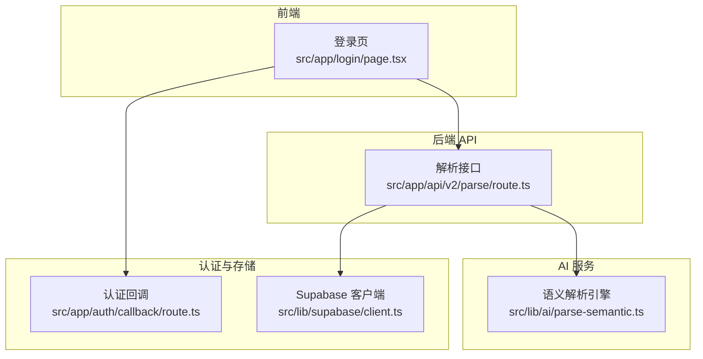
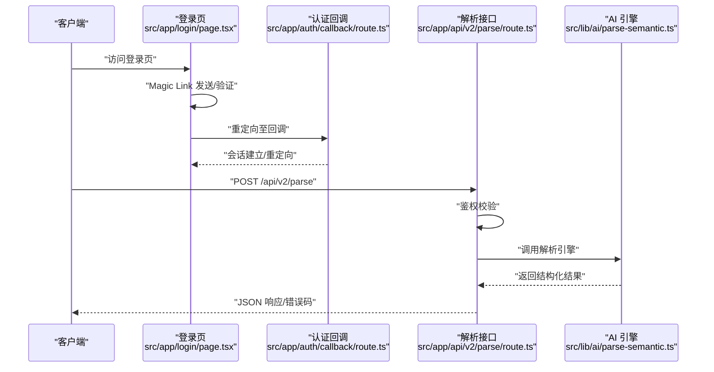
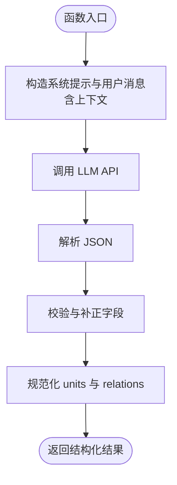
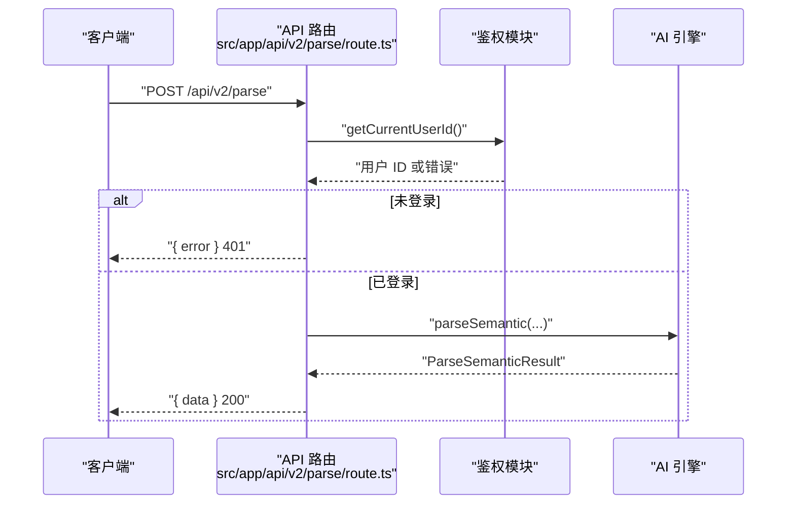
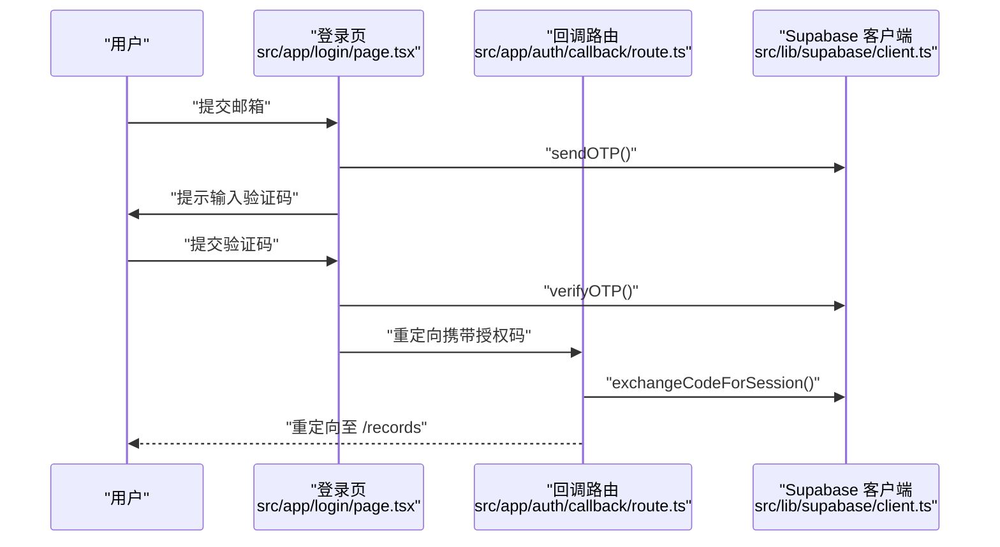
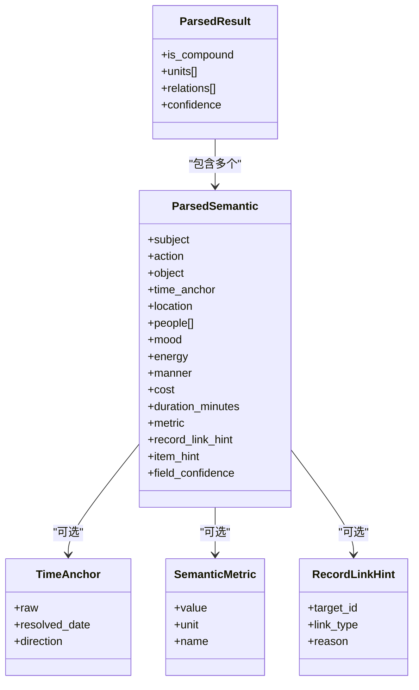
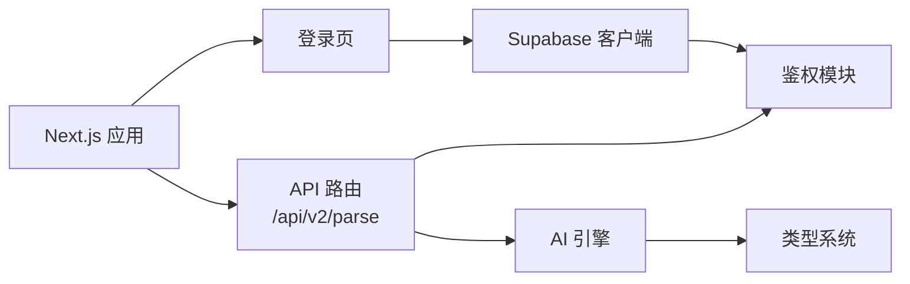

# 第三方服务集成

<cite>
**本文引用的文件**
- [README.md](file://README.md)
- [package.json](file://package.json)
- [src/app/api\v2/parse/route.ts](file://src/app/api\v2/parse/route.ts)
- [src/lib/ai/parse-semantic.ts](file://src/lib/ai/parse-semantic.ts)
- [src/types/semantic.ts](file://src/types/semantic.ts)
- [src/types/teto.ts](file://src/types/teto.ts)
- [src/app/auth/callback/route.ts](file://src/app/auth/callback/route.ts)
- [src/app/login/page.tsx](file://src/app/login/page.tsx)
- [src/lib/supabase/client.ts](file://src/lib/supabase/client.ts)
- [test/scripts/test-api-performance.js](file://test/scripts/test-api-performance.js)
- [test/scripts/test-stats-api.ps1](file://test/scripts/test-stats-api.ps1)
</cite>

## 目录
1. [简介](#简介)
2. [项目结构](#项目结构)
3. [核心组件](#核心组件)
4. [架构总览](#架构总览)
5. [详细组件分析](#详细组件分析)
6. [依赖分析](#依赖分析)
7. [性能考虑](#性能考虑)
8. [故障排查指南](#故障排查指南)
9. [结论](#结论)
10. [附录](#附录)

## 简介
本指南面向第三方服务集成开发者，围绕 TETO 项目当前已实现的“AI 语义解析引擎”与“Supabase 认证/数据库服务”，提供可落地的集成方法论与实践路径。内容覆盖：
- 服务发现与调用：如何对接 LLM（DeepSeek）与 Supabase
- 认证集成：Magic Link 登录与回调处理
- 数据转换：自然语言到结构化语义的转换流程
- 错误处理与可观测性：统一错误码与降级策略
- 集成测试与性能监控：端到端与性能脚本
- 部署与配置管理：环境变量与生产部署要点
- 版本兼容性：类型与接口演进策略

## 项目结构
TETO 采用 Next.js App Router 架构，API 路由位于 src/app/api 下，业务逻辑集中在 src/lib 与 src/types 中；认证与数据库客户端封装在 src/lib/supabase 与 src/lib/auth 相关模块中。

**图示来源**
- [src/app/login/page.tsx](file://src/app/login/page.tsx)
- [src/app/api\v2\parse\route.ts](file://src/app/api\v2/parse/route.ts)
- [src/lib/ai/parse-semantic.ts](file://src/lib/ai/parse-semantic.ts)
- [src/app/auth/callback/route.ts](file://src/app/auth/callback/route.ts)
- [src/lib/supabase/client.ts](file://src/lib/supabase/client.ts)

**章节来源**
- [README.md:13-21](file://README.md#L13-L21)
- [package.json:15-32](file://package.json#L15-L32)

## 核心组件
- AI 语义解析引擎：负责将自然语言输入解析为结构化 ParsedSemantic，调用 DeepSeek LLM 并进行结果校验与补正。
- 解析 API：Next.js API 路由，负责鉴权、参数校验、调用解析引擎并返回标准化结果。
- 认证系统：基于 Supabase 的 Magic Link 登录与回调处理，支持开发模式与生产模式。
- Supabase 客户端：封装浏览器与服务端的 Supabase 客户端创建，统一环境变量读取。
- 类型系统：语义解析与核心数据模型的强类型定义，保障前后端契约稳定。

**章节来源**
- [src/lib\ai\parse-semantic.ts:1-281](file://src/lib/ai/parse-semantic.ts#L1-L281)
- [src/app/api\v2\parse\route.ts:1-43](file://src/app/api\v2/parse/route.ts#L1-L43)
- [src/app/auth\callback\route.ts:1-19](file://src/app/auth/callback/route.ts#L1-L19)
- [src/app/login\page.tsx:1-195](file://src/app/login/page.tsx#L1-L195)
- [src/lib\supabase\client.ts:1-9](file://src/lib/supabase/client.ts#L1-L9)
- [src/types\semantic.ts:1-66](file://src/types/semantic.ts#L1-L66)
- [src/types\teto.ts:1-516](file://src/types/teto.ts#L1-L516)

## 架构总览
下图展示第三方服务集成的关键交互：前端登录与回调、API 路由鉴权、AI 解析引擎调用、以及错误处理与响应返回。

**图示来源**
- [src/app/login\page.tsx:1-195](file://src/app/login/page.tsx#L1-L195)
- [src/app/auth\callback\route.ts:1-19](file://src/app/auth/callback/route.ts#L1-L19)
- [src/app/api\v2\parse\route.ts:1-43](file://src/app/api\v2/parse/route.ts#L1-L43)
- [src/lib\ai\parse-semantic.ts:1-281](file://src/lib/ai/parse-semantic.ts#L1-L281)

## 详细组件分析

### 组件 A：AI 语义解析引擎（适配器/装饰器模式应用）
- 适配器模式：将 DeepSeek API（OpenAI 兼容格式）适配为内部统一的 parseSemantic 接口，屏蔽底层差异。
- 装饰器模式：对原始 LLM 结果进行“校验+补正+类型修复”，增强鲁棒性与一致性。
- 关键流程：
  - 构造系统提示与用户消息（含近期记录与事项列表作为上下文）
  - 调用 LLM 获取 JSON 文本
  - 解析 JSON 并校验字段，生成 ParsedResult 与 type_hints
  - 规范化 relations 与 units，返回统一结构

**图示来源**
- [src/lib\ai\parse-semantic.ts:209-281](file://src/lib/ai/parse-semantic.ts#L209-L281)

**章节来源**
- [src/lib\ai\parse-semantic.ts:1-281](file://src/lib/ai/parse-semantic.ts#L1-L281)
- [src/types\semantic.ts:17-66](file://src/types/semantic.ts#L17-L66)

### 组件 B：解析 API（代理模式与错误处理）
- 代理模式：API 路由作为“代理层”，负责鉴权、参数校验、异常映射与响应包装。
- 错误处理：
  - 未登录：401
  - LLM 错误：502
  - 其他：500
  - 参数缺失：400
- 响应结构：统一 { data: ... } 或 { error: string }

**图示来源**
- [src/app/api\v2\parse\route.ts:12-42](file://src/app/api\v2/parse/route.ts#L12-L42)

**章节来源**
- [src/app/api\v2\parse\route.ts:1-43](file://src/app/api\v2/parse/route.ts#L1-L43)

### 组件 C：认证与回调（代理/适配器）
- 代理：登录页封装 Supabase OTP 流程；回调路由将授权码兑换为会话。
- 适配：根据开发模式开关决定是否跳过登录，便于本地调试。
- 客户端：Supabase 客户端封装浏览器端创建逻辑，读取 NEXT_PUBLIC_* 环境变量。

**图示来源**
- [src/app/login\page.tsx:17-86](file://src/app/login/page.tsx#L17-L86)
- [src/app/auth\callback\route.ts:4-18](file://src/app/auth/callback/route.ts#L4-L18)
- [src/lib\supabase\client.ts:3-8](file://src/lib/supabase/client.ts#L3-L8)

**章节来源**
- [src/app/login\page.tsx:1-195](file://src/app/login/page.tsx#L1-L195)
- [src/app/auth\callback\route.ts:1-19](file://src/app/auth/callback/route.ts#L1-L19)
- [src/lib\supabase\client.ts:1-9](file://src/lib/supabase/client.ts#L1-L9)

### 组件 D：类型系统与数据契约
- 语义类型：ParsedSemantic、ParsedResult、TimeAnchor、SemanticMetric、RecordLinkHint、ClauseRelation。
- 核心实体类型：Record、Item、Tag、RecordLink、Goal、Phase 等。
- 作用：确保前后端对“语义解析结果”“记录结构”“关联关系”等有一致理解，降低耦合与变更风险。

**图示来源**
- [src/types\semantic.ts:17-66](file://src/types/semantic.ts#L17-L66)
- [src/types\teto.ts:37-94](file://src/types/teto.ts#L37-L94)

**章节来源**
- [src/types\semantic.ts:1-66](file://src/types/semantic.ts#L1-L66)
- [src/types\teto.ts:1-516](file://src/types/teto.ts#L1-L516)

## 依赖分析
- 外部依赖：Next.js、Supabase SDK、Recharts、date-fns、node-fetch 等。
- 内部依赖：API 路由依赖鉴权与 AI 引擎；AI 引擎依赖类型系统；登录页依赖 Supabase 客户端与鉴权工具。

**图示来源**
- [package.json:15-32](file://package.json#L15-L32)
- [src/app/api\v2\parse\route.ts:1-43](file://src/app/api\v2/parse/route.ts#L1-L43)
- [src/lib\ai\parse-semantic.ts:1-281](file://src/lib/ai/parse-semantic.ts#L1-L281)
- [src/app/login\page.tsx:1-195](file://src/app/login/page.tsx#L1-L195)
- [src/lib\supabase\client.ts:1-9](file://src/lib/supabase/client.ts#L1-L9)

**章节来源**
- [package.json:15-32](file://package.json#L15-L32)

## 性能考虑
- LLM 调用成本控制：限制近期记录上下文数量，避免 token 超限；合理设置系统提示长度。
- 响应缓存：对静态或低频查询结果进行短期缓存（需结合业务场景评估）。
- 并发与超时：为外部 API 调用设置合理超时与并发上限，防止雪崩。
- 监控与告警：对 LLM 调用耗时、错误率、成功率进行埋点与可视化。
- 本地测试：提供性能脚本，模拟高并发请求，评估系统瓶颈。

**章节来源**
- [src/lib\ai\parse-semantic.ts:220-231](file://src/lib/ai/parse-semantic.ts#L220-L231)
- [test/scripts/test-api-performance.js](file://test/scripts/test-api-performance.js)
- [test/scripts/test-stats-api.ps1](file://test/scripts/test-stats-api.ps1)

## 故障排查指南
- 认证相关
  - 回调失败：检查 Supabase URL 配置与回调地址白名单；确认授权码有效。
  - 开发模式：确认 NEXT_PUBLIC_DEV_MODE 与 NEXT_PUBLIC_DEV_USER_ID 设置。
- 解析接口
  - 400：检查请求体是否包含 input 字段。
  - 401：确认会话是否正确建立；检查鉴权中间件。
  - 502：LLM 服务不可用或网络异常；建议重试与熔断。
  - 500：服务端异常；查看日志定位具体错误。
- 类型不一致
  - 若新增字段，需同步更新类型定义与解析逻辑，避免运行时错误。

**章节来源**
- [src/app/auth\callback\route.ts:4-18](file://src/app/auth/callback/route.ts#L4-L18)
- [src/app/login\page.tsx:88-113](file://src/app/login/page.tsx#L88-L113)
- [src/app/api\v2\parse\route.ts:25-41](file://src/app/api\v2/parse/route.ts#L25-L41)
- [src/types\semantic.ts:17-66](file://src/types/semantic.ts#L17-L66)

## 结论
通过“适配器/代理/装饰器”等设计模式，TETO 将第三方服务（LLM 与 Supabase）以清晰的边界与稳定的契约接入系统。遵循本文的集成流程、错误处理与性能监控建议，可安全、可靠地扩展系统能力，同时保持类型一致与版本兼容。

## 附录

### 集成开发流程（从服务发现到部署）
- 服务发现
  - 明确第三方服务能力与接口规范（如 LLM 提供的 OpenAI 兼容接口）。
  - 确认 Supabase 的认证与数据库能力满足需求。
- 集成设计
  - 使用适配器模式封装第三方接口差异。
  - 使用代理模式在 API 层统一鉴权、参数校验与错误映射。
  - 使用装饰器模式对返回数据进行校验与补正。
- 开发与测试
  - 编写单元测试与集成测试脚本，覆盖正常与异常路径。
  - 使用性能脚本评估吞吐与延迟。
- 部署与配置
  - 在环境变量中注入第三方服务凭据。
  - 在生产环境启用行级安全策略与 HTTPS。
- 版本兼容
  - 通过强类型定义与接口契约，逐步演进而不破坏兼容。

### 认证机制与配置
- Supabase 配置要点
  - 在控制台配置站点 URL 与回调 URL 白名单。
  - 启用 Magic Link 登录方式。
- 环境变量
  - NEXT_PUBLIC_SUPABASE_URL、NEXT_PUBLIC_SUPABASE_ANON_KEY、NEXT_PUBLIC_DEV_MODE、NEXT_PUBLIC_DEV_USER_ID（可选）。

**章节来源**
- [README.md:75-80](file://README.md#L75-L80)
- [README.md:54-62](file://README.md#L54-L62)