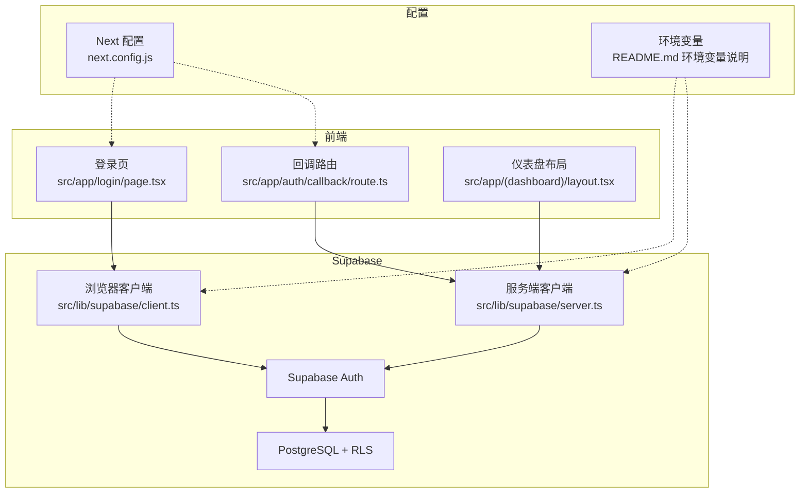
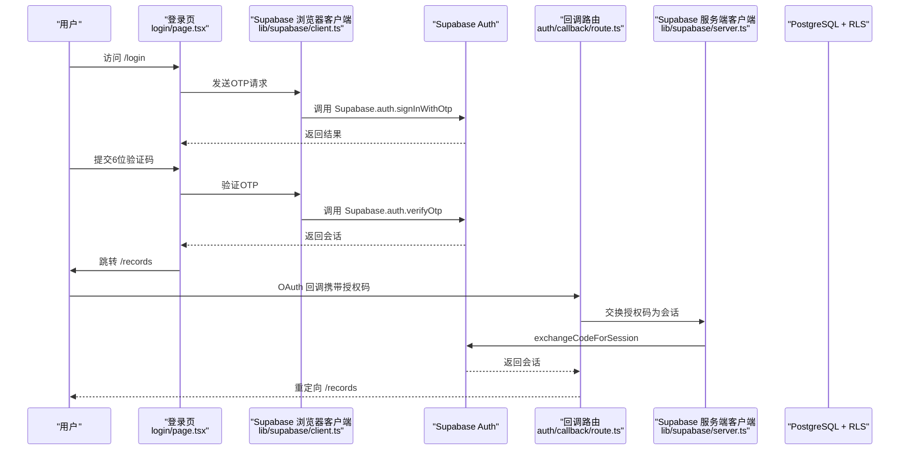
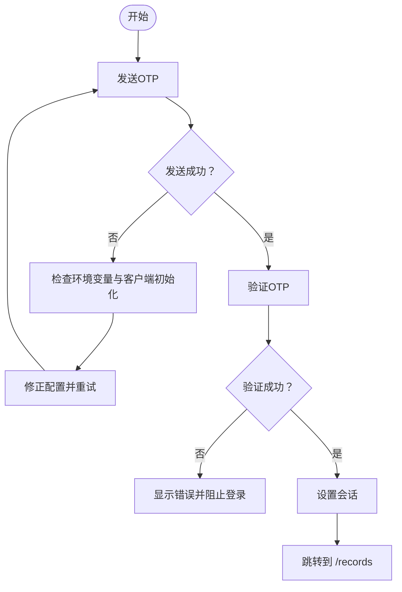
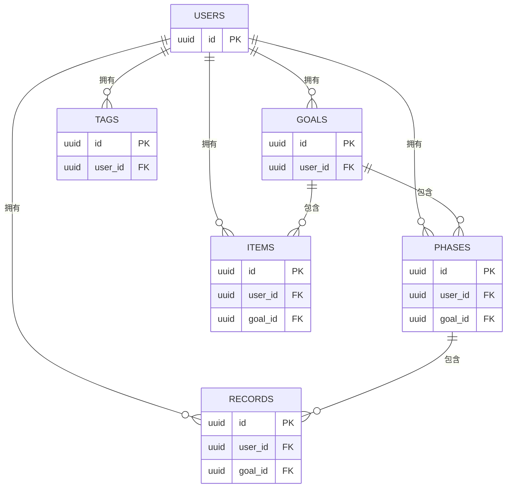
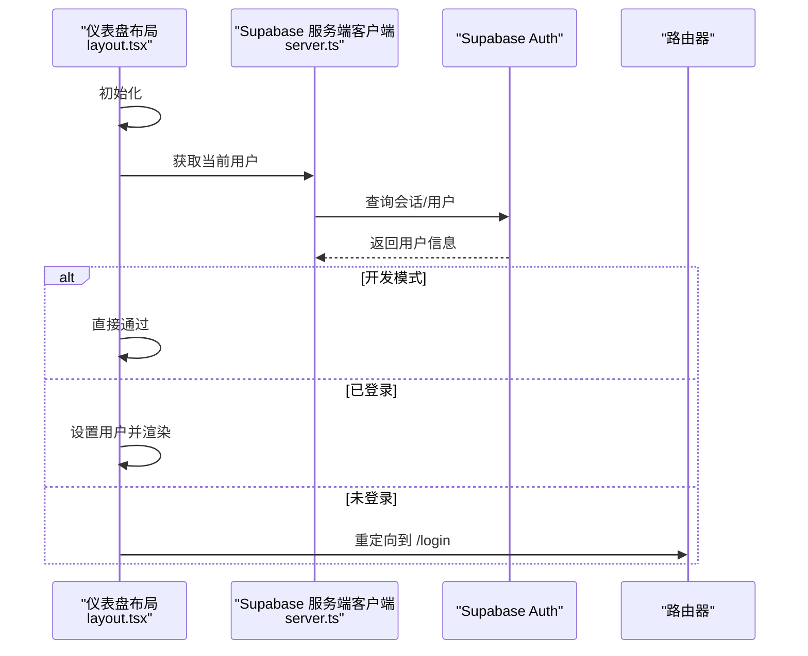
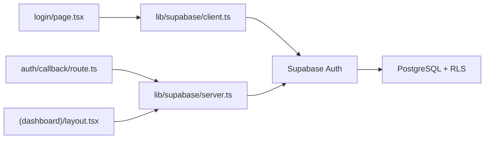

# 安全问题

<cite>
**本文引用的文件**
- [README.md](file://README.md)
- [next.config.js](file://next.config.js)
- [src/app/login/page.tsx](file://src/app/login/page.tsx)
- [src/app/auth/callback/route.ts](file://src/app/auth/callback/route.ts)
- [src/lib/supabase/client.ts](file://src/lib/supabase/client.ts)
- [src/lib/supabase/server.ts](file://src/lib/supabase/server.ts)
- [src/app/(dashboard)/layout.tsx](file://src/app/(dashboard)/layout.tsx)
- [sql/001_teto_1_3_records_model.sql](file://sql/001_teto_1_3_records_model.sql)
- [sql/保留存档sql/sql1.0.1/002_enable_rls_core_tables.sql](file://sql/保留存档sql/sql1.0.1/002_enable_rls_core_tables.sql)
- [sql/003_teto_1_4_phases_and_goals.sql](file://sql/003_teto_1_4_phases_and_goals.sql)
- [docs/10-版本归档/TETO 1.0.1/TETO 1.0.1 开发规则.md](file://docs/10-版本归档/TETO 1.0.1/TETO 1.0.1 开发规则.md)
</cite>

## 目录
1. [简介](#简介)
2. [项目结构](#项目结构)
3. [核心组件](#核心组件)
4. [架构总览](#架构总览)
5. [详细组件分析](#详细组件分析)
6. [依赖关系分析](#依赖关系分析)
7. [性能考虑](#性能考虑)
8. [故障排查指南](#故障排查指南)
9. [结论](#结论)
10. [附录](#附录)

## 简介
本指南面向TETO项目的运维与开发人员，聚焦于认证失败、权限泄露、数据访问异常与会话管理问题的排查与修复。结合项目实际实现，提供身份验证流程检查、授权策略验证、安全头配置建议、CSRF/XSS/SQL注入防护思路、密码与令牌管理要点、敏感数据保护策略、安全审计与漏洞扫描方法以及HTTPS/CORS与第三方集成的安全检查清单。

## 项目结构
TETO采用Next.js App Router + Supabase（Auth + PostgreSQL）的技术栈。前端登录与回调由Next.js路由处理，认证与会话通过Supabase客户端与服务端客户端管理；数据库层启用行级安全策略（RLS）以限制用户可见数据范围。

图示来源
- [src/app/login/page.tsx:1-196](file://src/app/login/page.tsx#L1-L196)
- [src/app/auth/callback/route.ts:1-19](file://src/app/auth/callback/route.ts#L1-L19)
- [src/lib/supabase/client.ts:1-9](file://src/lib/supabase/client.ts#L1-L9)
- [src/lib/supabase/server.ts:1-36](file://src/lib/supabase/server.ts#L1-L36)
- [next.config.js:1-4](file://next.config.js#L1-L4)
- [README.md:54-62](file://README.md#L54-L62)

章节来源
- [README.md:1-126](file://README.md#L1-L126)
- [next.config.js:1-4](file://next.config.js#L1-L4)

## 核心组件
- 登录与OTP流程：前端登录页负责发送与验证OTP，成功后写入会话并跳转。
- 回调路由：处理Supabase OAuth回调，交换授权码为会话并重定向。
- 客户端封装：浏览器端与服务端分别封装Supabase客户端，区分开发/生产模式下的密钥与行为。
- 仪表盘布局：全局布局在加载时校验用户身份，未登录则重定向至登录页。
- 数据库RLS：多张核心表启用RLS，策略基于auth.uid()限制用户可见数据。

章节来源
- [src/app/login/page.tsx:1-196](file://src/app/login/page.tsx#L1-L196)
- [src/app/auth/callback/route.ts:1-19](file://src/app/auth/callback/route.ts#L1-L19)
- [src/lib/supabase/client.ts:1-9](file://src/lib/supabase/client.ts#L1-L9)
- [src/lib/supabase/server.ts:1-36](file://src/lib/supabase/server.ts#L1-L36)
- [src/app/(dashboard)/layout.tsx](file://src/app/(dashboard)/layout.tsx#L1-L90)
- [sql/001_teto_1_3_records_model.sql:198-263](file://sql/001_teto_1_3_records_model.sql#L198-L263)
- [sql/保留存档sql/sql1.0.1/002_enable_rls_core_tables.sql:163-249](file://sql/保留存档sql/sql1.0.1/002_enable_rls_core_tables.sql#L163-L249)
- [sql/003_teto_1_4_phases_and_goals.sql:91-129](file://sql/003_teto_1_4_phases_and_goals.sql#L91-L129)

## 架构总览
下图展示从用户访问到数据库查询的端到端路径，以及关键安全控制点：

图示来源
- [src/app/login/page.tsx:17-86](file://src/app/login/page.tsx#L17-L86)
- [src/lib/supabase/client.ts:1-9](file://src/lib/supabase/client.ts#L1-L9)
- [src/app/auth/callback/route.ts:4-18](file://src/app/auth/callback/route.ts#L4-L18)
- [src/lib/supabase/server.ts:6-15](file://src/lib/supabase/server.ts#L6-L15)

## 详细组件分析

### 认证失败排查
- 症状定位
  - 发送OTP失败：检查Supabase浏览器客户端初始化与环境变量是否正确。
  - 验证OTP失败：检查Supabase返回的错误码与消息，确认邮箱格式与验证码有效性。
  - 回调交换会话失败：检查回调路由参数与Supabase服务端客户端配置。
- 关键检查点
  - 浏览器端客户端URL与匿名密钥是否匹配Supabase项目配置。
  - 服务端客户端在开发模式下是否使用服务角色密钥，生产模式下使用匿名密钥。
  - 回调路由是否正确获取授权码并调用交换接口。
- 修复建议
  - 确认环境变量与Supabase控制台一致。
  - 在开发模式下确保服务端客户端可用且不强制RLS绕过导致误判。
  - 对回调错误进行统一重定向与错误提示。

图示来源
- [src/app/login/page.tsx:17-86](file://src/app/login/page.tsx#L17-L86)
- [src/lib/supabase/client.ts:1-9](file://src/lib/supabase/client.ts#L1-L9)
- [src/lib/supabase/server.ts:13-15](file://src/lib/supabase/server.ts#L13-L15)

章节来源
- [src/app/login/page.tsx:17-86](file://src/app/login/page.tsx#L17-L86)
- [src/lib/supabase/client.ts:1-9](file://src/lib/supabase/client.ts#L1-L9)
- [src/lib/supabase/server.ts:13-15](file://src/lib/supabase/server.ts#L13-L15)

### 授权策略验证（RLS）
- 现状
  - 多张核心表启用RLS，并基于auth.uid()限制SELECT/INSERT/UPDATE/DELETE。
  - 项目与日志等关联表通过策略间接约束访问范围。
- 排查要点
  - 确认RLS策略已启用且策略名称与约束一致。
  - 验证用户ID与auth.uid()匹配逻辑。
  - 检查是否存在策略遗漏或权限提升路径（如通过JOIN绕过）。
- 修复建议
  - 对每张表逐一核对策略定义，确保覆盖所有DML操作。
  - 在数据库迁移脚本中固化策略，避免手工变更导致遗漏。

图示来源
- [sql/001_teto_1_3_records_model.sql:198-263](file://sql/001_teto_1_3_records_model.sql#L198-L263)
- [sql/保留存档sql/sql1.0.1/002_enable_rls_core_tables.sql:163-249](file://sql/保留存档sql/sql1.0.1/002_enable_rls_core_tables.sql#L163-L249)
- [sql/003_teto_1_4_phases_and_goals.sql:91-129](file://sql/003_teto_1_4_phases_and_goals.sql#L91-L129)

章节来源
- [sql/001_teto_1_3_records_model.sql:198-263](file://sql/001_teto_1_3_records_model.sql#L198-L263)
- [sql/保留存档sql/sql1.0.1/002_enable_rls_core_tables.sql:163-249](file://sql/保留存档sql/sql1.0.1/002_enable_rls_core_tables.sql#L163-L249)
- [sql/003_teto_1_4_phases_and_goals.sql:91-129](file://sql/003_teto_1_4_phases_and_goals.sql#L91-L129)

### 会话管理问题
- 症状定位
  - 登录后仍被重定向至登录页：检查仪表盘布局的认证检查逻辑与会话状态。
  - 开发模式下绕过RLS：确认开发模式开关与服务端密钥使用逻辑。
- 关键检查点
  - getCurrentUser调用是否抛错，错误分支是否正确重定向。
  - 服务端客户端在开发模式下是否使用服务角色密钥，避免RLS影响测试。
- 修复建议
  - 在认证检查失败时统一捕获并重定向。
  - 明确开发模式与生产模式的密钥切换，避免混淆。

图示来源
- [src/app/(dashboard)/layout.tsx](file://src/app/(dashboard)/layout.tsx#L29-L47)
- [src/lib/supabase/server.ts:4-15](file://src/lib/supabase/server.ts#L4-L15)

章节来源
- [src/app/(dashboard)/layout.tsx](file://src/app/(dashboard)/layout.tsx#L29-L47)
- [src/lib/supabase/server.ts:4-15](file://src/lib/supabase/server.ts#L4-L15)

### CSRF防护
- 现状与建议
  - 项目未显式配置CSRF中间件或Token校验。建议在API路由中引入CSRF Token校验与SameSite Cookie策略。
  - 对于Supabase Auth回调，确保回调URL在Supabase控制台白名单中，避免跨站授权码泄露。
- 实施要点
  - 为关键写操作（POST/PUT/DELETE）生成并校验一次性CSRF Token。
  - 设置Cookie SameSite=Strict/Lax，Secure=true（生产环境）。
  - 对OAuth回调参数进行严格校验与来源检查。

[本节为通用安全建议，不直接分析具体文件，故无“章节来源”]

### XSS攻击防范
- 现状与建议
  - 项目未发现显式XSS防护代码。建议对用户输入与动态渲染内容进行严格的HTML转义与Sanitization。
  - 使用Content-Security-Policy（CSP）限制脚本来源，禁用内联脚本与eval。
- 实施要点
  - 前端渲染时对来自API的数据进行转义，避免DOM插入未转义HTML。
  - 后端模板渲染（若使用）同样需要对输出进行转义。
  - 配置CSP头，限制script-src与object-src。

[本节为通用安全建议，不直接分析具体文件，故无“章节来源”]

### SQL注入防护
- 现状与建议
  - 项目使用Supabase ORM/查询接口，未直接拼接SQL字符串，降低注入风险。
  - 建议在自定义SQL或存储过程场景中，统一使用参数化查询与最小权限原则。
- 实施要点
  - 优先使用ORM/QueryBuilder，避免原生SQL拼接。
  - 对用户可控输入进行长度与字符集限制。
  - 数据库连接使用最小权限账号，避免授予DDL权限。

[本节为通用安全建议，不直接分析具体文件，故无“章节来源”]

### 密码安全策略与令牌管理
- 现状与建议
  - 项目采用Magic Link/OTP登录，未直接处理明文密码。建议：
    - OTP有效期与重试次数限制；
    - 会话令牌安全存储（HttpOnly、Secure、SameSite）；
    - 会话过期与自动登出策略。
- 实施要点
  - Supabase会话由后端管理，需确保Cookie安全标志正确设置。
  - 在仪表盘退出时调用登出接口并清除本地状态。

[本节为通用安全建议，不直接分析具体文件，故无“章节来源”]

### 敏感数据保护
- 现状与建议
  - 数据库启用RLS，限制用户可见范围；建议：
    - 对日志中的敏感信息进行脱敏；
    - 传输层使用HTTPS，避免明文传输；
    - 环境变量中仅存放必要密钥，定期轮换。
- 实施要点
  - HTTPS：生产环境强制HTTPS，HSTS启用。
  - CORS：仅允许受信域名，避免通配符。
  - 日志：避免记录完整会话信息与敏感字段。

[本节为通用安全建议，不直接分析具体文件，故无“章节来源”]

### 安全审计与漏洞扫描
- 建议流程
  - 代码静态分析：启用ESLint/TypeScript严格模式，扫描未处理异常与硬编码密钥。
  - 依赖漏洞扫描：使用npm audit或Snyk检查依赖漏洞。
  - 运行时审计：记录登录/登出、关键API调用与异常错误。
  - 渗透测试：对登录、回调、API端点进行黑盒测试。
- 与项目结合
  - 利用仪表盘布局的认证检查作为运行时审计入口，记录未登录重定向事件。
  - 对登录页的错误日志进行集中收集与告警。

[本节为通用安全建议，不直接分析具体文件，故无“章节来源”]

### HTTPS配置、CORS策略与第三方集成安全检查
- HTTPS
  - 生产环境必须启用HTTPS，配置HSTS与现代TLS套件。
- CORS
  - 仅允许可信域名，避免通配符；预检请求需正确处理。
- 第三方集成
  - Supabase回调域名需在控制台白名单中；检查匿名密钥与服务密钥的使用边界。
- 与项目结合
  - 回调路由与登录页依赖Supabase回调链路，需确保域名与密钥配置一致。
  - Next配置中允许的开发源用于本地调试，生产环境应移除。

章节来源
- [README.md:75-80](file://README.md#L75-L80)
- [next.config.js:1-4](file://next.config.js#L1-L4)

## 依赖关系分析
- 组件耦合
  - 登录页依赖浏览器端Supabase客户端；回调路由依赖服务端客户端。
  - 仪表盘布局依赖服务端客户端与认证检查逻辑。
- 外部依赖
  - Supabase（Auth + PostgreSQL）是认证与数据访问的核心。
- 潜在风险
  - 环境变量泄露或配置错误会导致认证失败或RLS失效。
  - 开发模式与生产模式密钥混用可能掩盖权限问题。

图示来源
- [src/app/login/page.tsx:1-196](file://src/app/login/page.tsx#L1-L196)
- [src/app/auth/callback/route.ts:1-19](file://src/app/auth/callback/route.ts#L1-L19)
- [src/lib/supabase/client.ts:1-9](file://src/lib/supabase/client.ts#L1-L9)
- [src/lib/supabase/server.ts:1-36](file://src/lib/supabase/server.ts#L1-L36)
- [sql/001_teto_1_3_records_model.sql:198-263](file://sql/001_teto_1_3_records_model.sql#L198-L263)

章节来源
- [src/app/login/page.tsx:1-196](file://src/app/login/page.tsx#L1-L196)
- [src/app/auth/callback/route.ts:1-19](file://src/app/auth/callback/route.ts#L1-L19)
- [src/lib/supabase/client.ts:1-9](file://src/lib/supabase/client.ts#L1-L9)
- [src/lib/supabase/server.ts:1-36](file://src/lib/supabase/server.ts#L1-L36)

## 性能考虑
- 认证性能
  - OTP发送与验证应避免阻塞UI，合理设置加载状态与错误提示。
  - 回调交换会话应快速失败并重定向，减少等待时间。
- 数据访问性能
  - RLS策略应在数据库层面优化索引，避免全表扫描。
  - API响应时间监控，及时发现异常延迟。

[本节提供一般性指导，不直接分析具体文件，故无“章节来源”]

## 故障排查指南

### 认证失败
- 症状：无法收到OTP或验证失败
- 检查清单
  - 确认环境变量与Supabase项目一致。
  - 查看登录页控制台日志与错误提示。
  - 验证Supabase浏览器客户端初始化。
- 处理步骤
  - 修正环境变量后重试。
  - 若为网络或邮件服务问题，联系Supabase支持。

章节来源
- [src/app/login/page.tsx:17-86](file://src/app/login/page.tsx#L17-L86)
- [src/lib/supabase/client.ts:1-9](file://src/lib/supabase/client.ts#L1-L9)
- [README.md:54-62](file://README.md#L54-L62)

### 权限泄露
- 症状：能访问他人数据
- 检查清单
  - 核对RLS策略是否启用与覆盖所有DML。
  - 确认auth.uid()与用户ID字段一致。
  - 检查是否存在策略绕过（如JOIN/视图）。
- 处理步骤
  - 在迁移脚本中补充缺失策略。
  - 限制关联查询范围，必要时拆分策略。

章节来源
- [sql/001_teto_1_3_records_model.sql:198-263](file://sql/001_teto_1_3_records_model.sql#L198-L263)
- [sql/保留存档sql/sql1.0.1/002_enable_rls_core_tables.sql:163-249](file://sql/保留存档sql/sql1.0.1/002_enable_rls_core_tables.sql#L163-L249)
- [sql/003_teto_1_4_phases_and_goals.sql:91-129](file://sql/003_teto_1_4_phases_and_goals.sql#L91-L129)

### 数据访问异常
- 症状：查询为空或报错
- 检查清单
  - 确认当前会话用户ID与数据所属用户一致。
  - 检查RLS策略是否允许当前操作。
  - 核对数据库连接与密钥配置。
- 处理步骤
  - 在开发模式下验证数据可见性。
  - 在生产模式下确保匿名密钥与RLS配合。

章节来源
- [src/app/(dashboard)/layout.tsx](file://src/app/(dashboard)/layout.tsx#L29-L47)
- [src/lib/supabase/server.ts:13-15](file://src/lib/supabase/server.ts#L13-L15)

### 会话管理问题
- 症状：登录后仍被重定向至登录页
- 检查清单
  - 检查仪表盘布局的认证检查逻辑与错误分支。
  - 确认开发模式开关与服务端密钥使用。
- 处理步骤
  - 修复认证检查失败的重定向逻辑。
  - 明确开发/生产模式密钥切换。

章节来源
- [src/app/(dashboard)/layout.tsx](file://src/app/(dashboard)/layout.tsx#L29-L47)
- [src/lib/supabase/server.ts:4-15](file://src/lib/supabase/server.ts#L4-L15)

### CSRF/XSS/SQL注入
- 建议措施
  - CSRF：为关键写操作引入Token校验与SameSite Cookie。
  - XSS：对所有动态输出进行转义与CSP限制。
  - SQL注入：使用ORM/参数化查询，最小权限账号。
- 与项目结合
  - 回调与登录流程需严格校验来源与参数。
  - API路由增加CSRF校验中间件。

[本节为通用安全建议，不直接分析具体文件，故无“章节来源”]

### 安全审计与事件响应
- 建议流程
  - 静态分析+依赖扫描+渗透测试。
  - 建立登录/登出与异常事件的日志与告警。
  - 制定事件响应预案（密钥轮换、紧急降级）。
- 与项目结合
  - 利用现有认证检查与日志输出作为审计入口。

[本节为通用安全建议，不直接分析具体文件，故无“章节来源”]

## 结论
TETO在认证与数据访问方面已具备良好基础：基于Supabase的OAuth与RLS提供了强健的用户隔离能力。建议在现有基础上完善CSRF/XSS防护、HTTPS/CORS策略、令牌与日志审计，形成闭环的安全体系。通过持续的漏洞扫描与事件响应演练，保障系统的长期安全稳定。

## 附录

### 身份验证流程检查清单
- 环境变量与Supabase配置一致
- 登录页OTP发送/验证流程正常
- 回调路由交换会话成功
- 仪表盘布局认证检查逻辑正确

章节来源
- [README.md:54-62](file://README.md#L54-L62)
- [src/app/login/page.tsx:17-86](file://src/app/login/page.tsx#L17-L86)
- [src/app/auth/callback/route.ts:4-18](file://src/app/auth/callback/route.ts#L4-L18)
- [src/app/(dashboard)/layout.tsx](file://src/app/(dashboard)/layout.tsx#L29-L47)

### 授权策略验证清单
- 每张核心表RLS已启用
- SELECT/INSERT/UPDATE/DELETE策略齐全
- auth.uid()与用户ID字段一致
- 关联表策略间接约束有效

章节来源
- [sql/001_teto_1_3_records_model.sql:198-263](file://sql/001_teto_1_3_records_model.sql#L198-L263)
- [sql/保留存档sql/sql1.0.1/002_enable_rls_core_tables.sql:163-249](file://sql/保留存档sql/sql1.0.1/002_enable_rls_core_tables.sql#L163-L249)
- [sql/003_teto_1_4_phases_and_goals.sql:91-129](file://sql/003_teto_1_4_phases_and_goals.sql#L91-L129)

### 安全头与HTTPS/CORS配置建议
- HTTPS：生产环境强制HTTPS，启用HSTS
- CORS：仅允许受信域名
- Cookie：Secure、SameSite、HttpOnly
- CSP：限制脚本来源，禁用内联脚本

[本节为通用安全建议，不直接分析具体文件，故无“章节来源”]

### 第三方集成安全检查
- Supabase回调域名白名单
- 匿名密钥与服务密钥使用边界
- 开发/生产模式密钥切换逻辑

章节来源
- [README.md:75-80](file://README.md#L75-L80)
- [src/lib/supabase/server.ts:13-15](file://src/lib/supabase/server.ts#L13-L15)