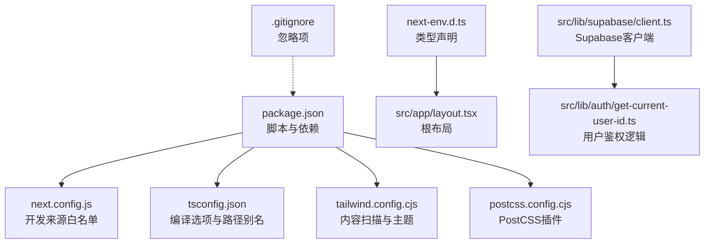
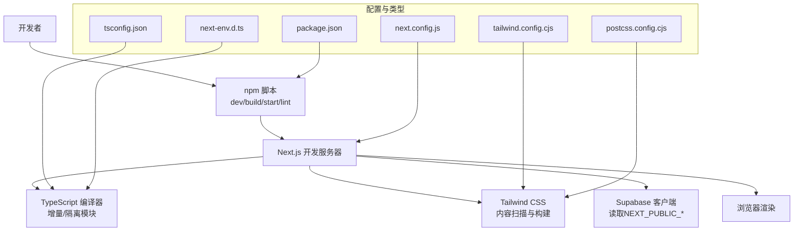
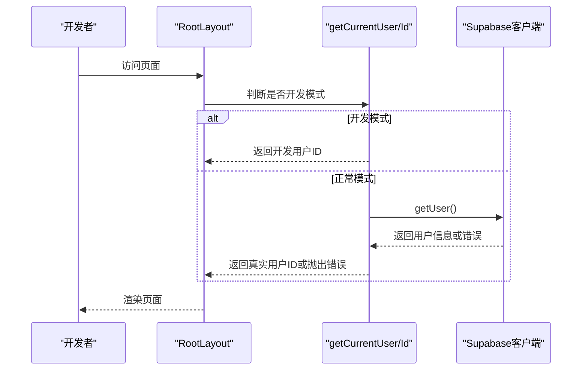
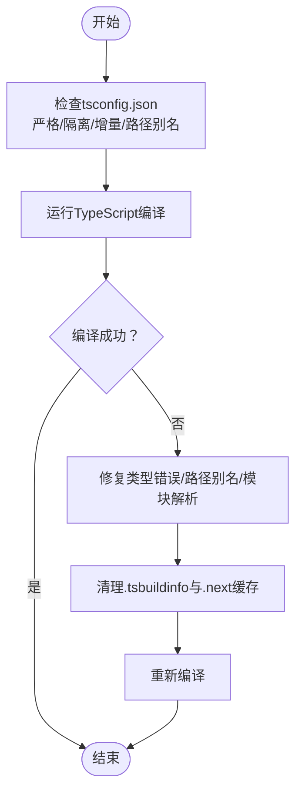
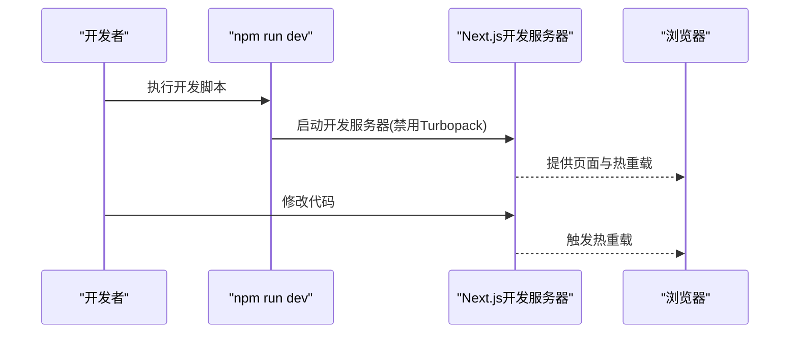
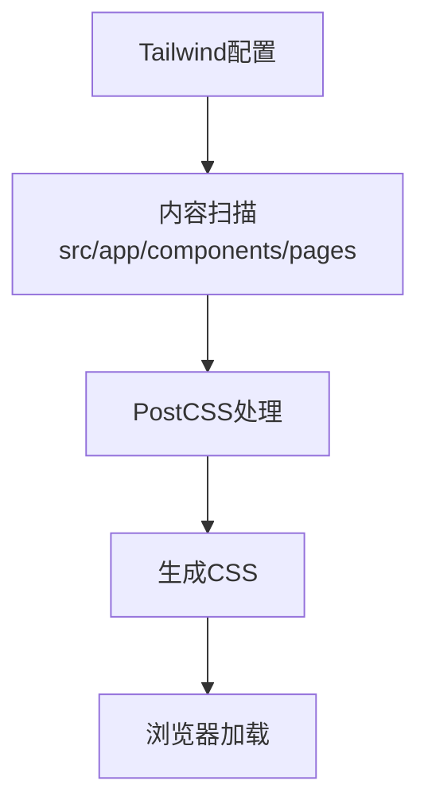
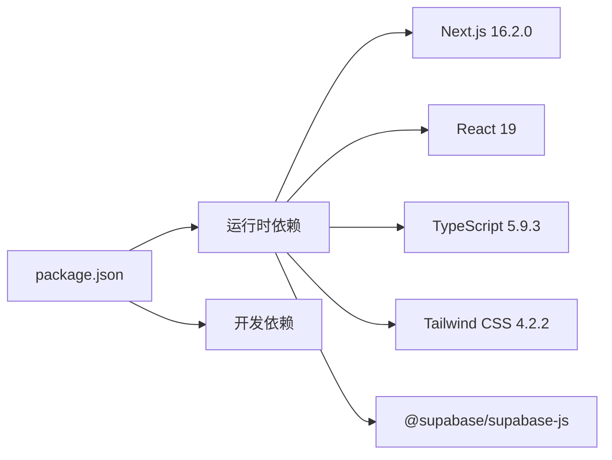

# 开发环境问题

<cite>
**本文引用的文件**
- [package.json](file://package.json)
- [next.config.js](file://next.config.js)
- [tsconfig.json](file://tsconfig.json)
- [tailwind.config.cjs](file://tailwind.config.cjs)
- [postcss.config.cjs](file://postcss.config.cjs)
- [next-env.d.ts](file://next-env.d.ts)
- [README.md](file://README.md)
- [.gitignore](file://.gitignore)
- [src/lib/supabase/client.ts](file://src/lib/supabase/client.ts)
- [src/lib/auth/get-current-user-id.ts](file://src/lib/auth/get-current-user-id.ts)
- [src/app/layout.tsx](file://src/app/layout.tsx)
- [.claude/settings.local.json](file://.claude/settings.local.json)
</cite>

## 目录
1. [简介](#简介)
2. [项目结构](#项目结构)
3. [核心组件](#核心组件)
4. [架构总览](#架构总览)
5. [详细组件分析](#详细组件分析)
6. [依赖关系分析](#依赖关系分析)
7. [性能考虑](#性能考虑)
8. [故障排查指南](#故障排查指南)
9. [结论](#结论)
10. [附录](#附录)

## 简介
本指南面向TETO项目的开发者，聚焦于常见开发环境问题的定位与解决，涵盖Node.js版本兼容性、TypeScript编译错误、Next.js配置问题、依赖包冲突、环境变量配置、开发服务器启动失败、热重载问题、构建错误诊断、包管理器问题、本地开发代理配置、跨平台兼容性、IDE配置建议、调试工具设置以及开发环境性能优化等主题。文档基于仓库中的实际配置文件与源码进行分析，并提供可操作的排障步骤与图示。

## 项目结构
TETO采用Next.js App Router架构，前端技术栈包括React 19、TypeScript、Tailwind CSS v4、Supabase客户端与SSR能力。项目根目录包含核心配置文件（如package.json、next.config.js、tsconfig.json、tailwind.config.cjs、postcss.config.cjs），以及src目录下的应用代码、类型定义与工具模块。

**图示来源**
- [package.json:1-44](file://package.json#L1-L44)
- [next.config.js:1-4](file://next.config.js#L1-L4)
- [tsconfig.json:1-42](file://tsconfig.json#L1-L42)
- [tailwind.config.cjs:1-61](file://tailwind.config.cjs#L1-L61)
- [postcss.config.cjs:1-5](file://postcss.config.cjs#L1-L5)
- [next-env.d.ts:1-7](file://next-env.d.ts#L1-L7)
- [src/app/layout.tsx:1-13](file://src/app/layout.tsx#L1-L13)
- [src/lib/supabase/client.ts:1-9](file://src/lib/supabase/client.ts#L1-L9)
- [src/lib/auth/get-current-user-id.ts:1-88](file://src/lib/auth/get-current-user-id.ts#L1-L88)
- [.gitignore:1-4](file://.gitignore#L1-L4)

**章节来源**
- [package.json:1-44](file://package.json#L1-L44)
- [next.config.js:1-4](file://next.config.js#L1-L4)
- [tsconfig.json:1-42](file://tsconfig.json#L1-L42)
- [tailwind.config.cjs:1-61](file://tailwind.config.cjs#L1-L61)
- [postcss.config.cjs:1-5](file://postcss.config.cjs#L1-L5)
- [next-env.d.ts:1-7](file://next-env.d.ts#L1-L7)
- [src/app/layout.tsx:1-13](file://src/app/layout.tsx#L1-L13)
- [src/lib/supabase/client.ts:1-9](file://src/lib/supabase/client.ts#L1-L9)
- [src/lib/auth/get-current-user-id.ts:1-88](file://src/lib/auth/get-current-user-id.ts#L1-L88)
- [.gitignore:1-4](file://.gitignore#L1-L4)

## 核心组件
- 脚本与依赖管理：通过package.json定义开发、构建与启动脚本，以及生产与开发依赖版本。
- Next.js配置：next.config.js限制允许的开发来源IP，便于局域网联调。
- 类型系统：tsconfig.json启用严格模式、隔离模块、增量编译与路径别名，确保TypeScript在Next.js中稳定工作。
- 样式系统：tailwind.config.cjs与postcss.config.cjs配合，控制内容扫描范围与PostCSS插件。
- 类型声明：next-env.d.ts声明Next.js内置类型，避免类型缺失导致的编译或IDE报错。
- Supabase集成：src/lib/supabase/client.ts封装浏览器端Supabase客户端；src/lib/auth/get-current-user-id.ts实现用户鉴权与开发模式切换。
- 根布局：src/app/layout.tsx统一注入全局样式并承载页面内容。

**章节来源**
- [package.json:6-11](file://package.json#L6-L11)
- [next.config.js:2-4](file://next.config.js#L2-L4)
- [tsconfig.json:2-29](file://tsconfig.json#L2-L29)
- [tailwind.config.cjs:3-7](file://tailwind.config.cjs#L3-L7)
- [postcss.config.cjs:1-5](file://postcss.config.cjs#L1-L5)
- [next-env.d.ts:1-7](file://next-env.d.ts#L1-L7)
- [src/lib/supabase/client.ts:1-9](file://src/lib/supabase/client.ts#L1-L9)
- [src/lib/auth/get-current-user-id.ts:6-87](file://src/lib/auth/get-current-user-id.ts#L6-L87)
- [src/app/layout.tsx:1-13](file://src/app/layout.tsx#L1-L13)

## 架构总览
下图展示开发环境的关键交互：开发脚本触发Next.js开发服务器，TypeScript编译器参与类型检查与增量编译，Tailwind CSS根据内容扫描生成样式，Supabase客户端读取环境变量进行认证与数据访问。

**图示来源**
- [package.json:6-11](file://package.json#L6-L11)
- [next.config.js:2-4](file://next.config.js#L2-L4)
- [tsconfig.json:2-29](file://tsconfig.json#L2-L29)
- [tailwind.config.cjs:3-7](file://tailwind.config.cjs#L3-L7)
- [postcss.config.cjs:1-5](file://postcss.config.cjs#L1-L5)
- [next-env.d.ts:1-7](file://next-env.d.ts#L1-L7)
- [src/lib/supabase/client.ts:4-7](file://src/lib/supabase/client.ts#L4-L7)

## 详细组件分析

### 组件A：环境变量与开发模式
- 关键点
  - 开发模式开关：通过NEXT_PUBLIC_DEV_MODE控制是否启用开发模式；启用后使用NEXT_PUBLIC_DEV_USER_ID作为默认用户ID。
  - Supabase客户端：从NEXT_PUBLIC_SUPABASE_URL与NEXT_PUBLIC_SUPABASE_ANON_KEY读取配置。
  - 根布局：注入全局样式，确保UI一致性。
- 排障要点
  - 若出现“请先登录”或鉴权失败，优先检查环境变量是否正确写入且未被.gitignore忽略。
  - 若开发模式无效，确认NEXT_PUBLIC_DEV_MODE值与预期一致。
  - 若样式异常，检查Tailwind内容扫描范围与postcss配置是否匹配当前文件结构。

**图示来源**
- [src/app/layout.tsx:1-13](file://src/app/layout.tsx#L1-L13)
- [src/lib/auth/get-current-user-id.ts:15-40](file://src/lib/auth/get-current-user-id.ts#L15-L40)
- [src/lib/auth/get-current-user-id.ts:52-79](file://src/lib/auth/get-current-user-id.ts#L52-L79)
- [src/lib/supabase/client.ts:4-7](file://src/lib/supabase/client.ts#L4-L7)

**章节来源**
- [src/lib/auth/get-current-user-id.ts:6-87](file://src/lib/auth/get-current-user-id.ts#L6-L87)
- [src/lib/supabase/client.ts:1-9](file://src/lib/supabase/client.ts#L1-L9)
- [src/app/layout.tsx:1-13](file://src/app/layout.tsx#L1-L13)
- [.gitignore:3](file://.gitignore#L3)

### 组件B：TypeScript编译与增量检查
- 关键点
  - 严格模式与隔离模块：提升类型安全性，减少模块间耦合导致的类型污染。
  - 增量编译：加速二次编译速度。
  - 路径别名：通过@/*映射src目录，简化导入路径。
  - 目标与模块：目标为ES2017，模块解析为bundler，适配Next.js生态。
- 排障要点
  - 若TypeScript报错，优先检查路径别名与模块解析配置是否与实际文件结构一致。
  - 若增量编译失效，尝试删除.tsbuildinfo与.next缓存后重试。
  - 若类型声明缺失，确认next-env.d.ts存在且未被排除。

**图示来源**
- [tsconfig.json:2-29](file://tsconfig.json#L2-L29)
- [next-env.d.ts:1-7](file://next-env.d.ts#L1-L7)

**章节来源**
- [tsconfig.json:2-29](file://tsconfig.json#L2-L29)
- [next-env.d.ts:1-7](file://next-env.d.ts#L1-L7)

### 组件C：Next.js开发服务器与热重载
- 关键点
  - 开发脚本禁用Turbopack以稳定开发体验。
  - allowedDevOrigins限制允许的开发来源IP，便于局域网联调。
- 排障要点
  - 若无法访问开发服务器，检查allowedDevOrigins是否包含当前IP。
  - 若热重载不生效，尝试重启开发服务器或清理缓存。
  - 若端口占用，修改端口或释放占用进程。

**图示来源**
- [package.json:7](file://package.json#L7)
- [next.config.js:3](file://next.config.js#L3)

**章节来源**
- [package.json:7](file://package.json#L7)
- [next.config.js:3](file://next.config.js#L3)

### 组件D：Tailwind CSS与PostCSS
- 关键点
  - 内容扫描范围覆盖src/app、src/components与src/pages，确保样式按需生成。
  - PostCSS插件使用Tailwind CSS v4配套插件。
- 排障要点
  - 若样式未生效，检查内容扫描路径是否包含当前组件文件。
  - 若构建失败，确认PostCSS插件版本与Tailwind CSS版本兼容。

**图示来源**
- [tailwind.config.cjs:3-7](file://tailwind.config.cjs#L3-L7)
- [postcss.config.cjs:1-5](file://postcss.config.cjs#L1-L5)

**章节来源**
- [tailwind.config.cjs:3-7](file://tailwind.config.cjs#L3-L7)
- [postcss.config.cjs:1-5](file://postcss.config.cjs#L1-L5)

## 依赖关系分析
- 依赖分层
  - 运行时依赖：Next.js、React、Supabase、Recharts、date-fns等。
  - 开发依赖：TypeScript、Tailwind CSS、PostCSS及相关插件。
- 版本与兼容性
  - Next.js 16.2.0、React 19、TypeScript 5.9.3、Tailwind CSS 4.2.2。
- 冲突排查
  - 若出现模块解析错误，优先检查node_modules完整性与包管理器缓存。
  - 若TypeScript或Next.js类型报错，核对tsconfig与Next.js类型声明文件。

**图示来源**
- [package.json:15-42](file://package.json#L15-L42)

**章节来源**
- [package.json:15-42](file://package.json#L15-L42)

## 性能考虑
- 禁用Turbopack：开发脚本显式关闭Turbopack以获得更稳定的开发体验。
- 增量编译：开启TypeScript增量编译，缩短二次编译时间。
- 内容扫描优化：Tailwind仅扫描必要目录，减少构建开销。
- 缓存清理：定期清理.tsbuildinfo与.next缓存，避免陈旧缓存影响性能。

**章节来源**
- [package.json:7](file://package.json#L7)
- [tsconfig.json:18](file://tsconfig.json#L18)
- [tailwind.config.cjs:3-7](file://tailwind.config.cjs#L3-L7)

## 故障排查指南

### Node.js版本兼容性
- 现状
  - 项目使用ES2017目标与模块解析bundler，建议使用较新的Node.js LTS版本。
- 建议
  - 使用Node.js 18或20+，确保与Next.js 16.2.0及TypeScript 5.9.3兼容。
  - 如遇语法或模块解析问题，升级Node.js版本并清理缓存后重试。

**章节来源**
- [tsconfig.json:29](file://tsconfig.json#L29)
- [package.json:25](file://package.json#L25)
- [package.json:41](file://package.json#L41)

### TypeScript编译错误
- 常见症状
  - 类型错误、模块解析失败、路径别名不生效。
- 排障步骤
  - 检查tsconfig.json的路径别名与模块解析配置。
  - 确认next-env.d.ts存在且未被排除。
  - 清理.tsbuildinfo与.next缓存后重试。
  - 若仍失败，逐个注释可疑模块定位问题。

**章节来源**
- [tsconfig.json:24-29](file://tsconfig.json#L24-L29)
- [next-env.d.ts:1-7](file://next-env.d.ts#L1-L7)

### Next.js配置问题
- allowedDevOrigins
  - 若无法从其他设备访问开发服务器，检查next.config.js中的allowedDevOrigins是否包含当前IP。
- Turbopack
  - 开发脚本已禁用Turbopack，若手动开启可能导致不稳定，建议保持默认。

**章节来源**
- [next.config.js:3](file://next.config.js#L3)
- [package.json:7](file://package.json#L7)

### 依赖包冲突
- 症状
  - 模块解析失败、运行时报错、构建中断。
- 排障步骤
  - 清理node_modules与package-lock.json，重新安装依赖。
  - 检查开发依赖与运行时依赖版本是否与Next.js生态兼容。
  - 使用包管理器的树形视图或dedupe功能排查重复依赖。

**章节来源**
- [package.json:15-42](file://package.json#L15-L42)

### 环境变量配置检查
- 必填项
  - NEXT_PUBLIC_SUPABASE_URL、NEXT_PUBLIC_SUPABASE_ANON_KEY。
  - 可选：NEXT_PUBLIC_DEV_MODE、NEXT_PUBLIC_DEV_USER_ID。
- 排障步骤
  - 确认.env.local存在且未被.gitignore忽略。
  - 在开发环境中验证变量是否生效（可通过页面打印或网络面板查看请求头）。
  - 若开发模式无效，检查NEXT_PUBLIC_DEV_MODE值与NEXT_PUBLIC_DEV_USER_ID格式。

**章节来源**
- [README.md:54-62](file://README.md#L54-L62)
- [.gitignore:3](file://.gitignore#L3)
- [src/lib/auth/get-current-user-id.ts:6-7](file://src/lib/auth/get-current-user-id.ts#L6-L7)
- [src/lib/supabase/client.ts:4-7](file://src/lib/supabase/client.ts#L4-L7)

### 开发服务器启动失败
- 排障步骤
  - 检查端口占用情况，必要时更换端口。
  - 确认allowedDevOrigins包含当前IP。
  - 清理缓存后重启开发服务器。
  - 查看终端输出的错误堆栈定位具体模块。

**章节来源**
- [next.config.js:3](file://next.config.js#L3)
- [package.json:7](file://package.json#L7)

### 热重载问题
- 排障步骤
  - 重启开发服务器。
  - 检查文件是否被.gitignore忽略。
  - 确认内容扫描路径包含当前文件。
  - 清理缓存后重试。

**章节来源**
- [tailwind.config.cjs:3-7](file://tailwind.config.cjs#L3-L7)
- [.gitignore:1-4](file://.gitignore#L1-L4)

### 构建错误诊断
- 排障步骤
  - 先执行npm run lint检查潜在问题。
  - 清理缓存后执行npm run build。
  - 逐步注释可疑模块定位问题。
  - 确认TypeScript与Next.js类型声明无误。

**章节来源**
- [package.json:10](file://package.json#L10)
- [package.json:8](file://package.json#L8)

### 包管理器问题处理
- 建议
  - 使用npm 9+或更高版本，确保与TypeScript与Next.js兼容。
  - 若遇到权限或缓存问题，清理npm缓存并重新安装依赖。
  - 在CI/CD中固定Node与包管理器版本，避免环境漂移。

**章节来源**
- [package.json:15-42](file://package.json#L15-L42)

### 本地开发代理配置
- 现状
  - next.config.js配置了allowedDevOrigins，便于局域网联调。
- 建议
  - 若需要从其他设备访问，确保IP在allowedDevOrigins中。
  - 如需反向代理，确保代理转发的Host与Origin与配置一致。

**章节来源**
- [next.config.js:3](file://next.config.js#L3)

### 跨平台兼容性问题
- 建议
  - 统一使用正斜杠路径，避免Windows与Unix差异。
  - 在Git中设置自动转换换行符，避免LF/CRLF差异。
  - 使用绝对路径别名（如@/*）减少相对路径问题。

**章节来源**
- [tsconfig.json:24-28](file://tsconfig.json#L24-L28)

### IDE配置建议
- VS Code
  - 安装TypeScript与Next.js相关扩展，启用ESLint与Prettier。
  - 在工作区设置中启用TypeScript增量编译与路径映射。
- IntelliJ/WebStorm
  - 配置TypeScript编译器为项目内置，启用路径映射与增量编译。
- 通用建议
  - 在IDE中启用TypeScript类型检查与ESLint实时校验，减少编译期错误。

**章节来源**
- [tsconfig.json:18](file://tsconfig.json#L18)
- [tsconfig.json:24-29](file://tsconfig.json#L24-L29)

### 调试工具设置
- 浏览器调试
  - 使用React DevTools与Redux DevTools（如有状态管理）。
- Node.js调试
  - 在VS Code中配置launch.json，附加到Next.js开发进程。
- 网络与认证
  - 在浏览器网络面板检查Supabase请求与响应，确认环境变量是否正确注入。

**章节来源**
- [src/lib/supabase/client.ts:4-7](file://src/lib/supabase/client.ts#L4-L7)
- [src/lib/auth/get-current-user-id.ts:52-79](file://src/lib/auth/get-current-user-id.ts#L52-L79)

### 开发环境性能优化技巧
- 禁用Turbopack：开发脚本已禁用，保持稳定。
- 增量编译：开启TypeScript增量编译，缩短编译时间。
- Tailwind内容扫描：仅扫描必要目录，减少构建开销。
- 缓存清理：定期清理.tsbuildinfo与.next缓存。

**章节来源**
- [package.json:7](file://package.json#L7)
- [tsconfig.json:18](file://tsconfig.json#L18)
- [tailwind.config.cjs:3-7](file://tailwind.config.cjs#L3-L7)

## 结论
本指南围绕TETO项目的实际配置与源码，系统梳理了开发环境常见问题的定位与解决方法。通过规范环境变量、合理配置Next.js与TypeScript、优化Tailwind与PostCSS、强化IDE与调试工具，可显著提升开发效率与稳定性。建议团队在本地与CI/CD中统一工具链版本，建立标准化的排障流程，持续优化开发体验。

## 附录
- 参考命令
  - 安装依赖：npm install
  - 启动开发：npm run dev
  - 构建检查：npm run build
  - 代码检查：npm run lint
- 关键文件索引
  - 配置文件：package.json、next.config.js、tsconfig.json、tailwind.config.cjs、postcss.config.cjs、next-env.d.ts
  - 应用入口：src/app/layout.tsx
  - Supabase客户端：src/lib/supabase/client.ts
  - 鉴权逻辑：src/lib/auth/get-current-user-id.ts
  - 环境变量：.env.local（由README提供模板）

**章节来源**
- [README.md:22-53](file://README.md#L22-L53)
- [package.json:6-11](file://package.json#L6-L11)