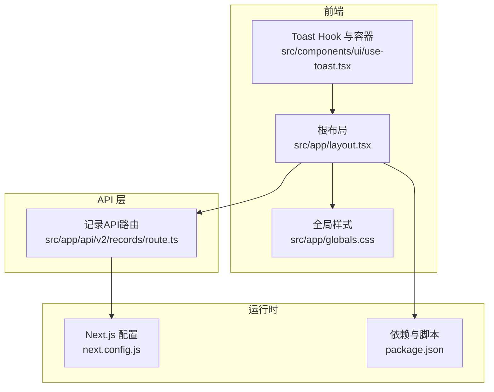
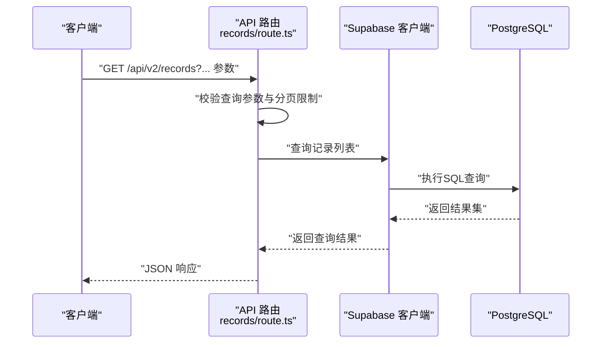
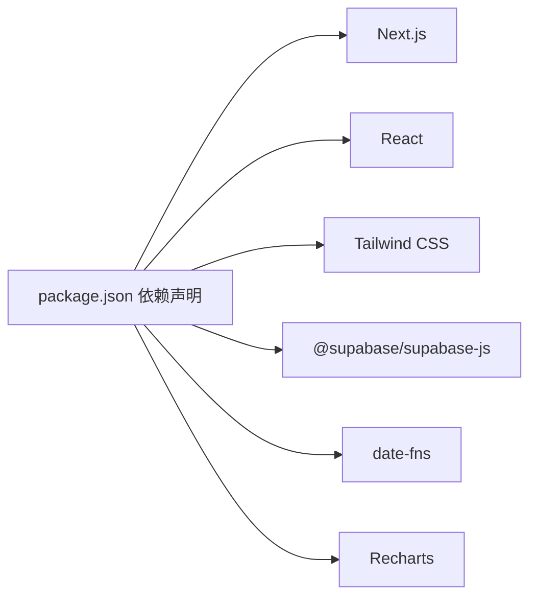

# 性能问题

<cite>
**本文引用的文件**
- [README.md](file://README.md)
- [package.json](file://package.json)
- [next.config.js](file://next.config.js)
- [src/app/layout.tsx](file://src/app/layout.tsx)
- [src/app/globals.css](file://src/app/globals.css)
- [src/components/ui/use-toast.tsx](file://src/components/ui/use-toast.tsx)
- [src/app/api\v2/records/route.ts](file://src/app/api\v2/records/route.ts)
- [test/scripts/test-api-performance.js](file://test/scripts/test-api-performance.js)
- [test/scripts/test-stats-api.ps1](file://test/scripts/test-stats-api.ps1)
</cite>

## 目录
1. [简介](#简介)
2. [项目结构](#项目结构)
3. [核心组件](#核心组件)
4. [架构总览](#架构总览)
5. [详细组件分析](#详细组件分析)
6. [依赖分析](#依赖分析)
7. [性能考量](#性能考量)
8. [故障排查指南](#故障排查指南)
9. [结论](#结论)
10. [附录](#附录)

## 简介
本指南聚焦于TETO项目的性能问题排查与优化实践，覆盖前端渲染性能、API响应延迟与数据库查询优化，并提供性能监控工具使用、关键指标分析、性能基准测试方法。文档同时解释React组件渲染优化、API调用缓存策略、数据预加载技术、网络请求优化、图片资源压缩与静态文件处理，以及内存与CPU分析方法，帮助在不牺牲用户体验的前提下提升整体性能。

## 项目结构
TETO采用Next.js App Router架构，前端样式基于Tailwind CSS，状态与UI交互通过React组件实现；后端API路由位于src/app/api/v2下，数据访问通过Supabase客户端进行。全局样式与布局在src/app/globals.css与src/app/layout.tsx中定义；通用UI能力如Toast在src/components/ui/use-toast.tsx中提供。

**图示来源**
- [src/app/layout.tsx:1-13](file://src/app/layout.tsx#L1-L13)
- [src/app/globals.css:1-88](file://src/app/globals.css#L1-L88)
- [src/components/ui/use-toast.tsx:1-69](file://src/components/ui/use-toast.tsx#L1-L69)
- [src/app/api\v2/records/route.ts:1-86](file://src/app/api\v2/records/route.ts#L1-L86)
- [next.config.js:1-4](file://next.config.js#L1-L4)
- [package.json:1-44](file://package.json#L1-L44)

**章节来源**
- [README.md:13-21](file://README.md#L13-L21)
- [package.json:15-32](file://package.json#L15-L32)
- [next.config.js:1-4](file://next.config.js#L1-L4)
- [src/app/layout.tsx:1-13](file://src/app/layout.tsx#L1-L13)
- [src/app/globals.css:1-88](file://src/app/globals.css#L1-L88)
- [src/components/ui/use-toast.tsx:1-69](file://src/components/ui/use-toast.tsx#L1-L69)
- [src/app/api\v2/records/route.ts:1-86](file://src/app/api\v2/records/route.ts#L1-L86)

## 核心组件
- 全局布局与样式：根布局负责注入全局样式并承载子路由内容；全局CSS提供视觉与动画相关的通用类，影响首屏渲染与交互体验。
- Toast统一错误提示：集中管理错误消息展示，避免重复渲染与内存泄漏风险。
- API路由：记录列表与创建接口承担数据查询与写入职责，是性能优化的关键入口。

**章节来源**
- [src/app/layout.tsx:1-13](file://src/app/layout.tsx#L1-L13)
- [src/app/globals.css:1-88](file://src/app/globals.css#L1-L88)
- [src/components/ui/use-toast.tsx:18-34](file://src/components/ui/use-toast.tsx#L18-L34)
- [src/app/api\v2/records/route.ts:7-42](file://src/app/api\v2/records/route.ts#L7-L42)

## 架构总览
前端通过Next.js App Router组织页面与API路由；API路由在服务端执行，使用Supabase客户端访问PostgreSQL数据库。认证通过服务端获取当前用户ID，确保请求与用户上下文一致。

**图示来源**
- [src/app/api\v2/records/route.ts:7-42](file://src/app/api\v2/records/route.ts#L7-L42)

## 详细组件分析

### 前端渲染与用户体验
- 样式与动画：全局CSS包含毛玻璃、阴影与环形进度等视觉效果，需关注首屏渲染与动画对CPU/GPU的影响。
- 错误提示：Toast通过状态管理与定时器控制消息生命周期，注意避免过多并发消息导致重绘抖动。

优化建议
- 使用CSS变量与轻量动画，减少复杂滤镜叠加。
- 对频繁触发的Toast操作进行节流或批量更新。
- 将动画与过渡封装为独立组件，便于按需启用。

**章节来源**
- [src/app/globals.css:17-88](file://src/app/globals.css#L17-L88)
- [src/components/ui/use-toast.tsx:18-34](file://src/components/ui/use-toast.tsx#L18-L34)

### API响应延迟与缓存策略
- 查询参数：支持按日期、事项、类型、标签、收藏与关键词过滤，以及limit限制，有助于减少不必要的数据传输。
- 错误处理：针对未登录与服务器错误进行明确的状态码返回，便于前端做降级与重试策略。

缓存与预加载
- 列表接口可结合查询参数进行条件缓存，例如按日期范围与limit组合生成缓存键。
- 预加载：在进入页面前预取近期数据，减少首次渲染等待。

**章节来源**
- [src/app/api\v2/records/route.ts:10-34](file://src/app/api\v2/records/route.ts#L10-L34)
- [src/app/api\v2/records/route.ts:35-42](file://src/app/api\v2/records/route.ts#L35-L42)

### 数据库查询优化
- 查询路径：API路由调用数据库访问函数，最终落到Supabase查询。
- 优化方向：根据查询参数建立合适的索引（如日期、用户ID、事项ID），避免全表扫描；合理设置limit，防止超大数据集返回。

**章节来源**
- [src/app/api\v2/records/route.ts:33](file://src/app/api\v2/records/route.ts#L33)

### 网络请求优化
- 请求参数：通过URL查询参数传递筛选条件，减少请求体大小。
- 响应格式：统一返回JSON结构，便于前端解析与缓存。

**章节来源**
- [src/app/api\v2/records/route.ts:10-34](file://src/app/api\v2/records/route.ts#L10-L34)
- [src/app/api\v2/records/route.ts:34](file://src/app/api\v2/records/route.ts#L34)

### 图片资源压缩与静态文件处理
- 当前项目未发现专门的图片处理与压缩配置；建议引入静态资源优化策略（如WebP格式、懒加载、尺寸适配）以降低带宽与提升首屏速度。

**章节来源**
- [README.md:13-21](file://README.md#L13-L21)

### 性能监控与基准测试
- 测试脚本：仓库提供API性能测试脚本与统计API测试脚本，可用于评估接口吞吐与延迟。
- 建议：结合浏览器开发者工具与Next.js内置性能面板，定期采集关键指标并建立基线。

**章节来源**
- [test/scripts/test-api-performance.js](file://test/scripts/test-api-performance.js)
- [test/scripts/test-stats-api.ps1](file://test/scripts/test-stats-api.ps1)

## 依赖分析
- 前端框架与UI：Next.js、React、Tailwind CSS、Recharts、date-fns等。
- 数据访问：Supabase客户端用于读写数据库。
- 工具链：TypeScript、PostCSS、Tailwind CSS等。

**图示来源**
- [package.json:15-32](file://package.json#L15-L32)

**章节来源**
- [package.json:15-32](file://package.json#L15-L32)

## 性能考量
- 渲染性能
  - 减少不必要的重渲染：使用稳定化策略与memo化组件。
  - 控制动画与滤镜：避免在长列表上叠加复杂视觉效果。
- 网络性能
  - 合理分页与缓存：通过limit与查询参数控制数据规模。
  - 请求合并：对高频小请求进行合并或批处理。
- 数据库性能
  - 建立索引：围绕常用过滤字段（日期、用户ID、关联ID）建立索引。
  - 限制返回字段：仅返回必要列，减少序列化开销。
- 资源优化
  - 图片与媒体：采用现代格式与懒加载，按设备像素比提供合适尺寸。
  - 静态资源：开启压缩与缓存头，利用CDN加速。
- 监控与基线
  - 指标采集：首屏时间、交互延迟、内存峰值、CPU占用率。
  - 基准测试：定期运行测试脚本，记录并对比历史数据。

[本节为通用指导，无需特定文件引用]

## 故障排查指南
- 前端渲染卡顿
  - 使用浏览器性能面板定位重渲染热点与长任务。
  - 检查全局样式中的复杂滤镜与动画是否在滚动或输入时触发。
- API响应慢
  - 分析查询参数与limit是否合理，确认数据库索引是否覆盖常用过滤条件。
  - 使用测试脚本模拟高并发场景，观察延迟与错误率变化。
- 内存与CPU异常
  - 结合系统监控工具与浏览器内存快照，排查内存泄漏与大对象驻留。
  - 关注Toast等状态频繁更新的组件，避免累积状态导致内存增长。
- 用户体验问题
  - 加载状态管理：为关键请求提供骨架屏或占位符，避免空白等待。
  - 渐进式增强：优先保证核心功能可用，再逐步启用高级特性。

**章节来源**
- [src/app/globals.css:17-88](file://src/app/globals.css#L17-L88)
- [src/components/ui/use-toast.tsx:18-34](file://src/components/ui/use-toast.tsx#L18-L34)
- [src/app/api\v2/records/route.ts:10-34](file://src/app/api\v2/records/route.ts#L10-L34)
- [test/scripts/test-api-performance.js](file://test/scripts/test-api-performance.js)

## 结论
通过对前端渲染、API响应与数据库查询的系统性优化，结合性能监控与基准测试，可显著提升TETO的用户体验与稳定性。建议从样式与动画优化入手，完善API缓存与预加载策略，强化数据库索引与查询限制，并持续采集关键指标建立性能基线。

[本节为总结，无需特定文件引用]

## 附录
- Next.js配置：允许开发时的特定来源访问，便于本地联调。
- 全局样式：提供视觉与交互的基础样式类，影响整体性能表现。

**章节来源**
- [next.config.js:1-4](file://next.config.js#L1-L4)
- [src/app/globals.css:1-88](file://src/app/globals.css#L1-L88)