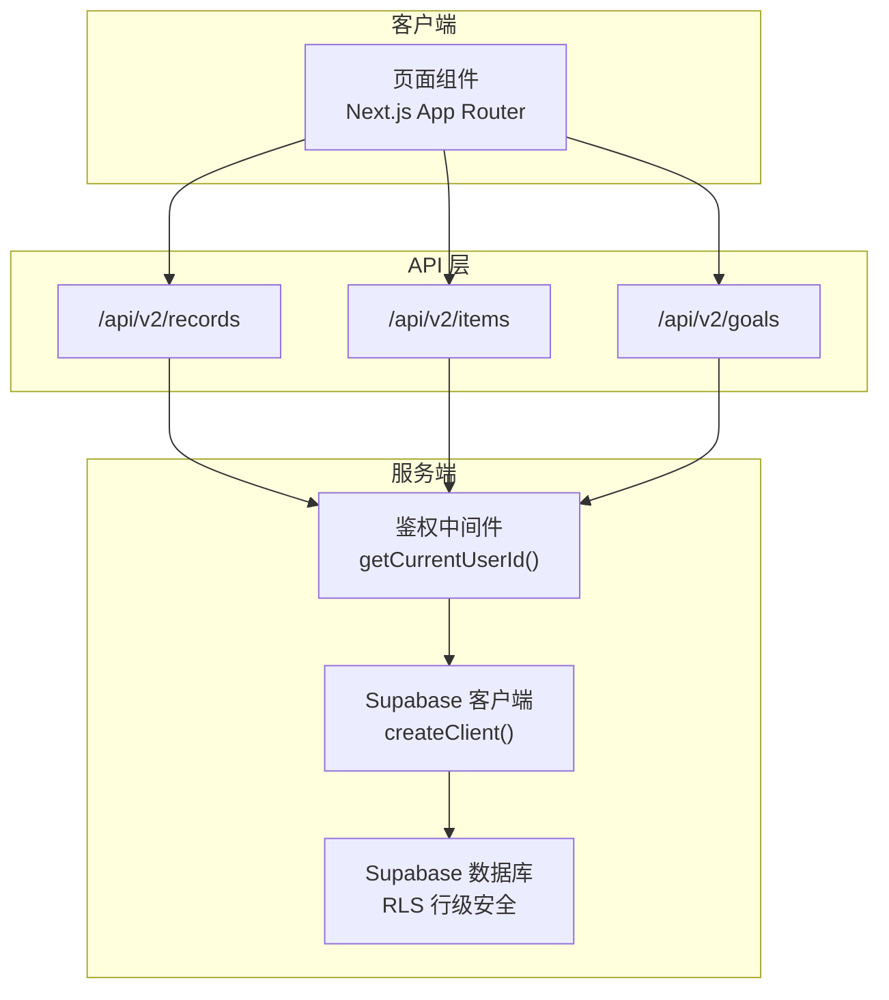
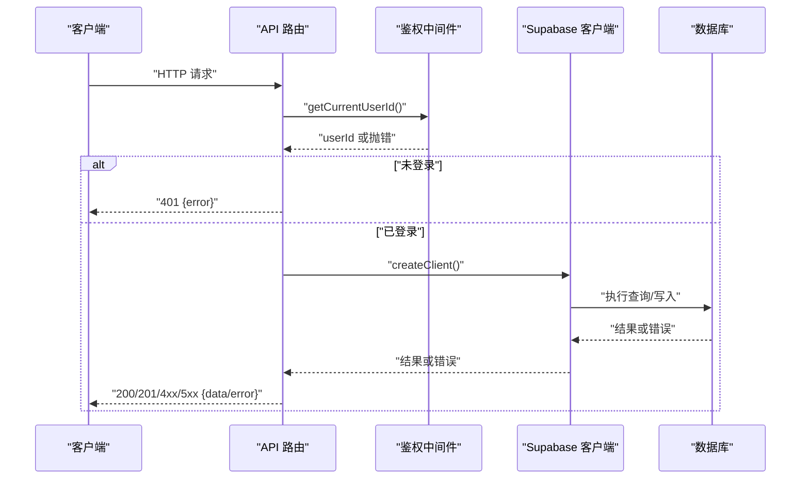
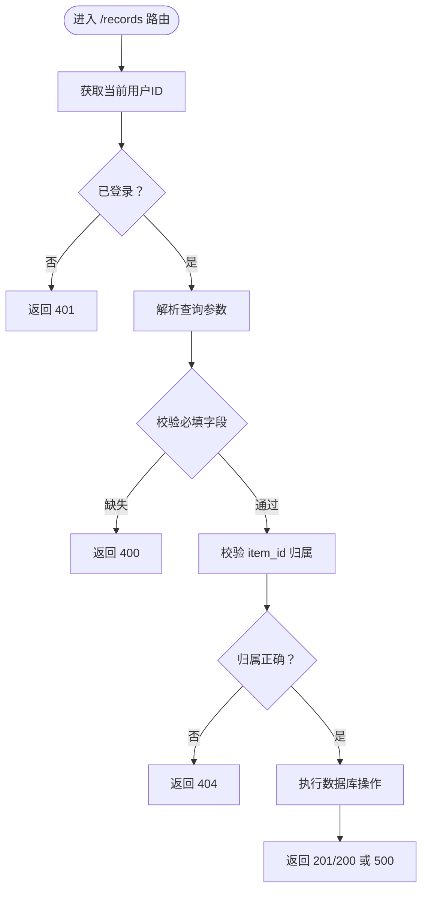
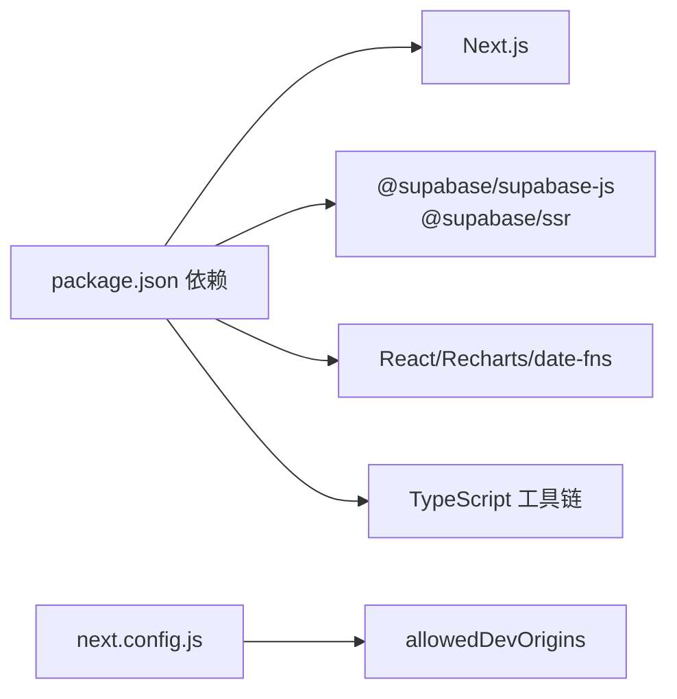

# 故障排除

<cite>
**本文引用的文件**
- [README.md](file://README.md)
- [package.json](file://package.json)
- [next.config.js](file://next.config.js)
- [src/lib/supabase/client.ts](file://src/lib/supabase/client.ts)
- [src/app/api/v2/records/route.ts](file://src/app/api/v2/records/route.ts)
- [src/app/api/v2/goals/route.ts](file://src/app/api/v2/goals/route.ts)
- [src/app/api/v2/items/route.ts](file://src/app/api/v2/items/route.ts)
- [src/types/teto.ts](file://src/types/teto.ts)
</cite>

## 目录
1. [简介](#简介)
2. [项目结构](#项目结构)
3. [核心组件](#核心组件)
4. [架构总览](#架构总览)
5. [详细组件分析](#详细组件分析)
6. [依赖分析](#依赖分析)
7. [性能考虑](#性能考虑)
8. [故障排除指南](#故障排除指南)
9. [结论](#结论)
10. [附录](#附录)

## 简介
本指南面向开发者与运维人员，围绕 TETO 项目的开发环境、运行时错误、数据库连接、API 调用失败等常见问题，提供系统化的排查方法、日志分析技巧、性能诊断流程与应急处置方案。文档同时给出错误码对照、异常处理机制、网络与权限问题排查、数据一致性检查方法、监控告警与恢复策略，并覆盖开发调试工具使用与生产环境定位修复流程。

## 项目结构
TETO 基于 Next.js App Router，采用 TypeScript，前端通过 Supabase JS/SSR 客户端访问 Supabase（认证 + PostgreSQL）。API 层位于 src/app/api/v2 下，统一进行鉴权与错误处理；类型定义集中在 src/types/teto.ts，涵盖数据模型、查询参数与响应结构。

**图示来源**
- [src/app/api/v2/records/route.ts:1-86](file://src/app/api/v2/records/route.ts#L1-L86)
- [src/app/api/v2/items/route.ts:1-47](file://src/app/api/v2/items/route.ts#L1-L47)
- [src/app/api/v2/goals/route.ts:1-49](file://src/app/api/v2/goals/route.ts#L1-L49)
- [src/lib/supabase/client.ts:1-9](file://src/lib/supabase/client.ts#L1-L9)

**章节来源**
- [README.md: 13-21:13-21](file://README.md#L13-L21)
- [package.json: 15-32:15-32](file://package.json#L15-L32)
- [next.config.js: 1-4:1-4](file://next.config.js#L1-L4)

## 核心组件
- 鉴权与会话
  - 通过 Supabase SSR 客户端创建与认证交互，API 路由统一调用 getCurrentUserId 获取当前用户 ID，未登录时返回 401。
- 数据模型与查询
  - 类型定义集中于 src/types/teto.ts，包含 RecordsQuery、ItemsQuery、GoalsQuery 等查询参数与 CreatePayload 结构，API 路由按参数组装查询条件并调用数据库层函数。
- API 错误处理
  - 统一 try/catch，区分“请先登录/获取用户信息失败”场景返回 401，其他错误返回 500；POST 请求对必填字段进行校验，缺失时返回 400。

**章节来源**
- [src/app/api/v2/records/route.ts: 1-86:1-86](file://src/app/api/v2/records/route.ts#L1-L86)
- [src/app/api/v2/goals/route.ts: 1-49:1-49](file://src/app/api/v2/goals/route.ts#L1-L49)
- [src/app/api/v2/items/route.ts: 1-47:1-47](file://src/app/api/v2/items/route.ts#L1-L47)
- [src/types/teto.ts: 235-256:235-256](file://src/types/teto.ts#L235-L256)
- [src/types/teto.ts: 133-162:133-162](file://src/types/teto.ts#L133-L162)

## 架构总览
下图展示从前端到 API、鉴权与数据库的整体交互路径，以及错误处理与返回格式。

**图示来源**
- [src/app/api/v2/records/route.ts: 1-86:1-86](file://src/app/api/v2/records/route.ts#L1-L86)
- [src/lib/supabase/client.ts:1-9](file://src/lib/supabase/client.ts#L1-L9)

## 详细组件分析

### 记录 API（/api/v2/records）
- 典型问题
  - 未登录导致 401
  - 缺少必填字段 content/date 导致 400
  - item_id 归属校验失败返回 404
  - 数据库查询/写入异常返回 500
- 排查要点
  - 检查鉴权是否成功（浏览器 Cookie/Storage 是否携带有效会话）
  - 校验请求体字段与日期格式
  - 校验 item_id 是否属于当前用户
- 响应结构
  - 成功：{ data: ... }
  - 失败：{ error: string }

**图示来源**
- [src/app/api/v2/records/route.ts: 1-86:1-86](file://src/app/api/v2/records/route.ts#L1-L86)

**章节来源**
- [src/app/api/v2/records/route.ts: 1-86:1-86](file://src/app/api/v2/records/route.ts#L1-L86)

### 事项 API（/api/v2/items）
- 典型问题
  - 未登录 401
  - 缺少 title 400
  - 其他错误 500
- 排查要点
  - 确认请求体包含 title
  - 检查 RLS 规则与用户归属

**章节来源**
- [src/app/api/v2/items/route.ts: 1-47:1-47](file://src/app/api/v2/items/route.ts#L1-L47)

### 目标 API（/api/v2/goals）
- 典型问题
  - 未登录 401
  - 缺少 title 400
  - 其他错误 500
- 排查要点
  - 确认请求体包含 title
  - 检查查询参数 status/item_id/phase_id 的合法性

**章节来源**
- [src/app/api/v2/goals/route.ts: 1-49:1-49](file://src/app/api/v2/goals/route.ts#L1-L49)

### 类型与查询参数
- 关键类型
  - RecordsQuery、ItemsQuery、GoalsQuery
  - CreateRecordPayload、CreateItemPayload、CreateGoalPayload
- 常见错误
  - 参数类型不匹配导致查询异常
  - 必填字段缺失导致 400

**章节来源**
- [src/types/teto.ts: 235-256:235-256](file://src/types/teto.ts#L235-L256)
- [src/types/teto.ts: 133-162:133-162](file://src/types/teto.ts#L133-L162)

## 依赖分析
- 运行时依赖
  - Next.js、React、Tailwind CSS、Supabase JS/SSR、Recharts、date-fns
- 开发依赖
  - TypeScript、TailwindCSS、PostCSS、Autoprefixer
- 配置
  - next.config.js 中允许特定开发来源，便于本地联调

**图示来源**
- [package.json: 15-32:15-32](file://package.json#L15-L32)
- [package.json: 33-42:33-42](file://package.json#L33-L42)
- [next.config.js: 1-4:1-4](file://next.config.js#L1-L4)

**章节来源**
- [package.json: 15-42:15-42](file://package.json#L15-L42)
- [next.config.js: 1-4:1-4](file://next.config.js#L1-L4)

## 性能考虑
- API 查询优化
  - 使用分页与 limit 控制返回数量
  - 合理使用索引字段（如 date、item_id、user_id）
- 前端渲染
  - 图表组件 Recharts 渲染大数据集时注意虚拟化或采样
- 数据库层面
  - RLS 已启用，避免不必要的全表扫描
  - 对高频查询字段建立索引（如 user_id、date）

[本节为通用指导，无需具体文件引用]

## 故障排除指南

### 一、开发环境问题
- 症状
  - 启动失败、热更新异常、样式不生效
- 排查步骤
  - 确认 Node 版本与依赖安装
  - 清理缓存后重新安装依赖
  - 检查 next.config.js 中 allowedDevOrigins 是否包含当前开发机 IP
  - 确认 .env.local 中 NEXT_PUBLIC_SUPABASE_URL 与 NEXT_PUBLIC_SUPABASE_ANON_KEY 正确
- 常见原因
  - 环境变量缺失或拼写错误
  - 依赖版本冲突
  - 端口被占用或防火墙阻断

**章节来源**
- [README.md: 22-47:22-47](file://README.md#L22-L47)
- [next.config.js: 1-4:1-4](file://next.config.js#L1-L4)

### 二、运行时错误（401/400/500）
- 401 未授权
  - 现象：登录态失效或未登录
  - 排查：确认浏览器存储的会话有效；检查 Supabase 回调地址配置
- 400 参数错误
  - 现象：缺少必填字段（如 content、date、title）
  - 排查：核对请求体结构与必填字段
- 500 服务器错误
  - 现象：数据库查询/写入异常
  - 排查：查看 API 路由日志；检查 Supabase 数据库状态与 RLS 策略

**章节来源**
- [src/app/api/v2/records/route.ts: 35-41:35-41](file://src/app/api/v2/records/route.ts#L35-L41)
- [src/app/api/v2/records/route.ts: 78-84:78-84](file://src/app/api/v2/records/route.ts#L78-L84)
- [src/app/api/v2/goals/route.ts: 21-27:21-27](file://src/app/api/v2/goals/route.ts#L21-L27)
- [src/app/api/v2/items/route.ts: 19-25:19-25](file://src/app/api/v2/items/route.ts#L19-L25)

### 三、数据库连接问题
- 症状
  - API 返回 500；页面空白或加载失败
- 排查步骤
  - 确认 Supabase URL 与匿名密钥正确
  - 在 Supabase 控制台执行初始化 SQL（按顺序）
  - 检查 RLS 策略是否启用且正确
- 常见原因
  - 网络不可达或代理阻断
  - 凭据错误
  - RLS 限制导致查询为空

**章节来源**
- [README.md: 37-41:37-41](file://README.md#L37-L41)
- [README.md: 63-90:63-90](file://README.md#L63-L90)
- [src/lib/supabase/client.ts: 1-9:1-9](file://src/lib/supabase/client.ts#L1-L9)

### 四、API 调用失败
- 症状
  - POST/GET 失败，返回 4xx/500
- 排查步骤
  - 使用浏览器开发者工具 Network 面板查看请求与响应
  - 核对查询参数与请求体结构（参考类型定义）
  - 检查鉴权中间件是否返回用户 ID
- 常见原因
  - 参数类型不匹配
  - 未登录或会话过期
  - Supabase 客户端初始化失败

**章节来源**
- [src/app/api/v2/records/route.ts: 1-86:1-86](file://src/app/api/v2/records/route.ts#L1-L86)
- [src/app/api/v2/goals/route.ts: 1-49:1-49](file://src/app/api/v2/goals/route.ts#L1-L49)
- [src/app/api/v2/items/route.ts: 1-47:1-47](file://src/app/api/v2/items/route.ts#L1-L47)
- [src/types/teto.ts: 235-256:235-256](file://src/types/teto.ts#L235-L256)

### 五、网络问题排查
- 症状
  - 请求超时、跨域失败、回调地址无效
- 排查步骤
  - 检查站点 URL 与回调 URL 配置
  - 确认 allowedDevOrigins 设置
  - 使用 curl/ping 测试 Supabase 可达性
- 常见原因
  - 回调地址未加入白名单
  - 本地开发源未配置

**章节来源**
- [README.md: 75-80:75-80](file://README.md#L75-L80)
- [next.config.js: 1-4:1-4](file://next.config.js#L1-L4)

### 六、权限问题解决
- 症状
  - 查询为空、写入被拒绝
- 排查步骤
  - 确认 RLS 已启用
  - 检查用户是否绑定到对应资源（如 item_id 归属）
- 常见原因
  - RLS 限制
  - 资源归属校验失败

**章节来源**
- [README.md: 90](file://README.md#L90)
- [src/app/api/v2/records/route.ts: 60-74:60-74](file://src/app/api/v2/records/route.ts#L60-L74)

### 七、数据一致性检查
- 建议流程
  - 核对记录、事项、目标之间的外键关系
  - 检查生命周期状态与时间字段一致性
  - 对比历史导入模板与实际数据结构
- 工具建议
  - 使用 Supabase SQL Editor 执行一致性查询
  - 对高频字段建立索引以加速校验

**章节来源**
- [src/types/teto.ts: 37-94:37-94](file://src/types/teto.ts#L37-L94)
- [public/templates/history-record-import-template.csv](file://public/templates/history-record-import-template.csv)

### 八、错误码对照表
- 400 Bad Request
  - 场景：缺少必填字段（如 content、date、title）
  - 处理：补齐请求体字段
- 401 Unauthorized
  - 场景：未登录或会话无效
  - 处理：重新登录或刷新会话
- 404 Not Found
  - 场景：资源不存在或不属于当前用户
  - 处理：检查资源 ID 与归属
- 500 Internal Server Error
  - 场景：数据库查询/写入异常
  - 处理：查看日志并重试

**章节来源**
- [src/app/api/v2/records/route.ts: 50-55:50-55](file://src/app/api/v2/records/route.ts#L50-L55)
- [src/app/api/v2/records/route.ts: 71-73:71-73](file://src/app/api/v2/records/route.ts#L71-L73)
- [src/app/api/v2/goals/route.ts: 35](file://src/app/api/v2/goals/route.ts#L35)
- [src/app/api/v2/items/route.ts: 33](file://src/app/api/v2/items/route.ts#L33)

### 九、异常处理机制
- 统一捕获与分类
  - 401：登录相关错误
  - 400：参数校验失败
  - 500：其他异常
- 建议
  - 在 API 层记录上下文信息（用户 ID、请求参数、时间戳）
  - 对敏感错误信息进行脱敏

**章节来源**
- [src/app/api/v2/records/route.ts: 35-41:35-41](file://src/app/api/v2/records/route.ts#L35-L41)
- [src/app/api/v2/records/route.ts: 78-84:78-84](file://src/app/api/v2/records/route.ts#L78-L84)

### 十、用户反馈处理流程
- 收集信息
  - 用户描述、复现步骤、截图/录屏
  - 浏览器控制台错误、Network 请求详情
- 分类与优先级
  - 登录/权限类：高优先级
  - 数据一致性/导入类：中优先级
  - UI/体验类：低优先级
- 处理与验证
  - 修复后在测试环境验证，再合并至主分支

[本节为通用流程，无需具体文件引用]

### 十一、监控告警与恢复策略
- 建议指标
  - API 响应时间与错误率
  - 数据库连接池使用率
  - 登录成功率与会话时长
- 告警阈值
  - 错误率 > 1% 持续 5 分钟
  - 响应时间 P95 > 2s
- 恢复策略
  - 自动重启容器/进程
  - 降级策略（缓存/只读）
  - 快速回滚至上一稳定版本

[本节为通用指导，无需具体文件引用]

### 十二、紧急修复流程
- 快速评估
  - 影响范围、用户规模、业务影响
- 临时措施
  - 限流、降级、回滚
- 修复与验证
  - 单元测试/集成测试通过
  - 小范围灰度验证
- 文档与复盘
  - 记录根因、修复过程与改进项

[本节为通用流程，无需具体文件引用]

## 结论
通过统一的鉴权与错误处理、规范的类型定义与查询参数、完善的 Supabase 初始化与 RLS 策略，TETO 的 API 层具备清晰的故障定位路径。建议在开发与运维实践中结合本文提供的排查步骤、错误码对照与应急流程，快速定位并解决问题，保障系统稳定性与用户体验。

## 附录

### A. 开发调试工具使用
- 浏览器开发者工具
  - Network：查看请求/响应、状态码、Headers
  - Console：查看错误堆栈与警告
- Supabase 控制台
  - SQL Editor：执行初始化脚本与诊断查询
  - Auth：检查回调地址与登录状态
- 本地开发
  - next.config.js 中 allowedDevOrigins 配置开发来源
  - .env.local 配置 Supabase 凭据

**章节来源**
- [README.md: 29-41:29-41](file://README.md#L29-L41)
- [next.config.js: 1-4:1-4](file://next.config.js#L1-L4)

### B. 生产环境问题定位
- 日志采集
  - API 层记录请求上下文与错误信息
  - 数据库慢查询日志
- 监控面板
  - API 错误率、P95 响应时间、数据库连接数
- 快速止损
  - 临时关闭高风险功能
  - 回滚到上一稳定版本

[本节为通用指导，无需具体文件引用]