# 数据库问题排查指南

<cite>
**本文档引用的文件**
- [client.ts](file://src/lib/supabase/client.ts)
- [get-current-user-id.ts](file://src/lib/auth/server/get-current-user-id.ts)
- [records/route.ts](file://src/app/api/v2/records/route.ts)
- [items/route.ts](file://src/app/api/v2/items/route.ts)
- [goals/route.ts](file://src/app/api/v2/goals/route.ts)
- [teto.ts](file://src/types/teto.ts)
- [001_teto_1_3_records_model.sql](file://sql/001_teto_1_3_records_model.sql)
- [002_drop_chain_structure.sql](file://sql/002_drop_chain_structure.sql)
- [003_teto_1_4_phases_and_goals.sql](file://sql/003_teto_1_4_phases_and_goals.sql)
- [test-api-performance.js](file://test/scripts/test-api-performance.js)
- [package.json](file://package.json)
</cite>

## 目录
1. [简介](#简介)
2. [项目结构](#项目结构)
3. [核心组件](#核心组件)
4. [架构概览](#架构概览)
5. [详细组件分析](#详细组件分析)
6. [依赖关系分析](#依赖关系分析)
7. [性能考虑](#性能考虑)
8. [故障排除指南](#故障排除指南)
9. [结论](#结论)
10. [附录](#附录)

## 简介

本指南专为TETO项目的数据库问题排查而设计，涵盖了从连接配置到性能优化的全方位解决方案。TETO是一个基于Next.js和Supabase构建的个人记录、日记复盘、项目跟踪和基础预测系统，采用PostgreSQL作为数据存储。

本指南重点关注以下关键领域：
- Supabase连接配置检查和故障排除
- RLS策略验证和权限问题诊断
- 数据库迁移失败处理
- 查询性能优化和慢查询分析
- 数据一致性保证和事务处理
- 数据备份恢复策略
- 索引优化和监控指标

## 项目结构

TETO项目采用模块化架构，数据库相关的核心组件分布如下：

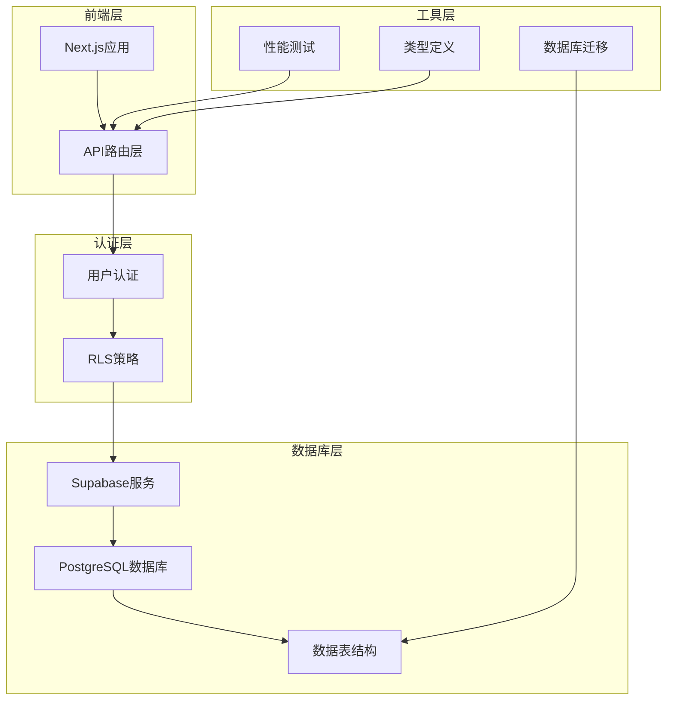

**图表来源**
- [client.ts:1-9](file://src/lib/supabase/client.ts#L1-L9)
- [get-current-user-id.ts:1-85](file://src/lib/auth/server/get-current-user-id.ts#L1-L85)
- [records/route.ts:1-86](file://src/app/api/v2/records/route.ts#L1-L86)

**章节来源**
- [client.ts:1-9](file://src/lib/supabase/client.ts#L1-L9)
- [get-current-user-id.ts:1-85](file://src/lib/auth/server/get-current-user-id.ts#L1-L85)
- [package.json:15-32](file://package.json#L15-L32)

## 核心组件

### Supabase客户端配置

TETO项目使用Supabase作为主要的数据库和认证服务提供商。客户端配置位于`src/lib/supabase/client.ts`中，采用环境变量驱动的方式确保安全性。

### 认证和授权系统

用户认证通过`getCurrentUserId`函数实现，支持开发模式和生产模式两种运行方式。该函数负责：
- 开发模式下使用固定的开发者用户ID
- 生产模式下通过Supabase认证服务获取当前用户
- 错误处理和用户状态验证

### API路由层

项目提供了完整的REST API接口，包括：
- 记录管理API (`/api/v2/records`)
- 事项管理API (`/api/v2/items`)
- 目标管理API (`/api/v2/goals`)

每个API都实现了标准的CRUD操作，并集成了权限验证和错误处理机制。

**章节来源**
- [client.ts:1-9](file://src/lib/supabase/client.ts#L1-L9)
- [get-current-user-id.ts:12-37](file://src/lib/auth/server/get-current-user-id.ts#L12-L37)
- [records/route.ts:1-86](file://src/app/api/v2/records/route.ts#L1-L86)
- [items/route.ts:1-47](file://src/app/api/v2/items/route.ts#L1-L47)
- [goals/route.ts:1-49](file://src/app/api/v2/goals/route.ts#L1-L49)

## 架构概览

TETO的数据库架构采用分层设计，确保了数据的一致性、安全性和可扩展性：

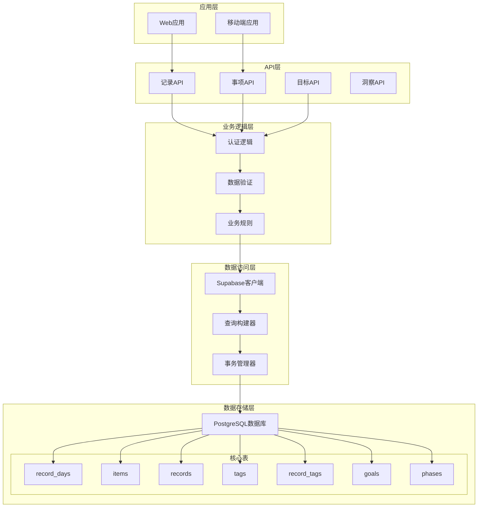

**图表来源**
- [001_teto_1_3_records_model.sql:18-85](file://sql/001_teto_1_3_records_model.sql#L18-L85)
- [003_teto_1_4_phases_and_goals.sql:16-45](file://sql/003_teto_1_4_phases_and_goals.sql#L16-L45)
- [teto.ts:28-94](file://src/types/teto.ts#L28-L94)

## 详细组件分析

### 数据模型设计

TETO采用了规范化的三层数据模型设计，确保数据的一致性和完整性：

#### 核心数据表结构

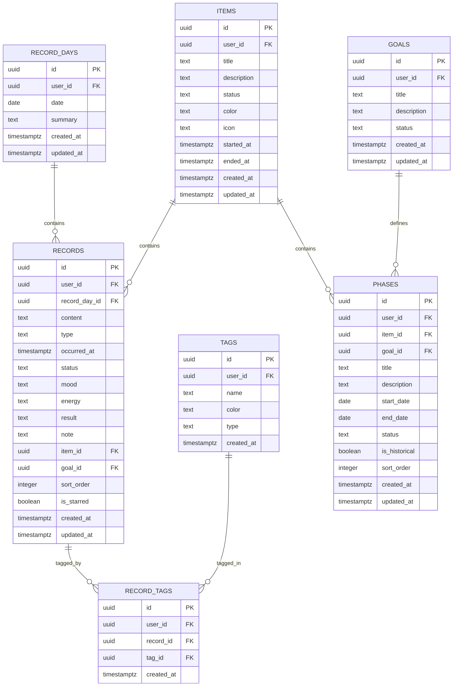

**图表来源**
- [001_teto_1_3_records_model.sql:18-97](file://sql/001_teto_1_3_records_model.sql#L18-L97)
- [003_teto_1_4_phases_and_goals.sql:16-45](file://sql/003_teto_1_4_phases_and_goals.sql#L16-L45)

#### 触发器和约束机制

系统实现了多个触发器来确保数据一致性：

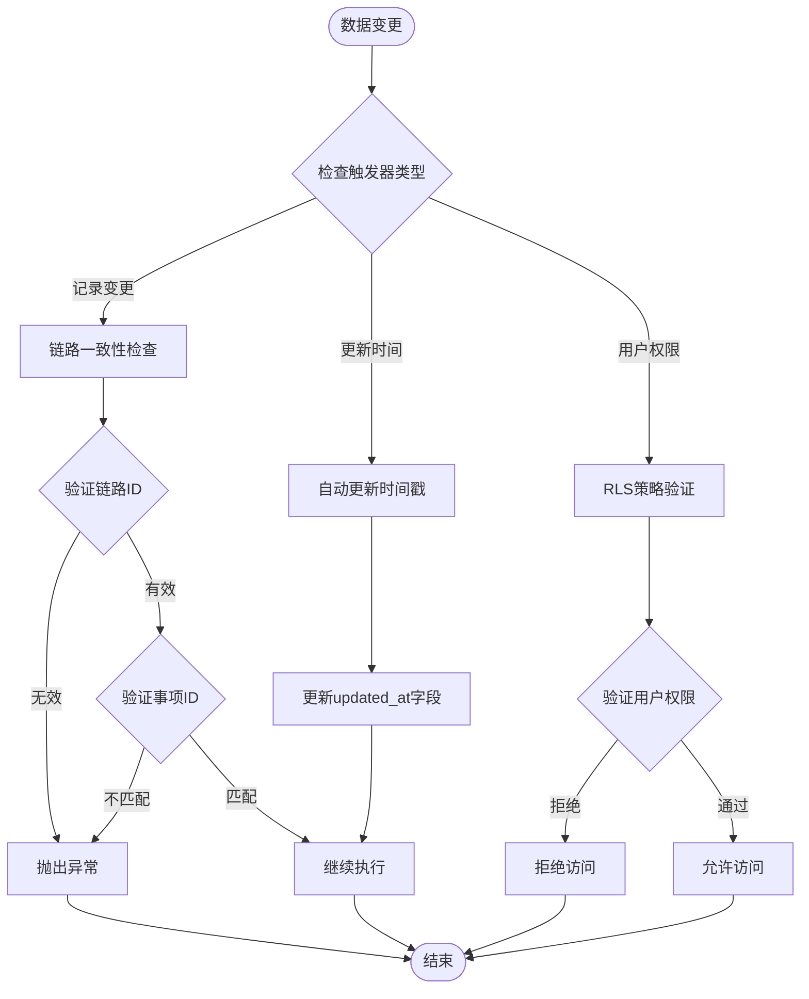

**图表来源**
- [001_teto_1_3_records_model.sql:121-149](file://sql/001_teto_1_3_records_model.sql#L121-L149)
- [001_teto_1_3_records_model.sql:154-188](file://sql/001_teto_1_3_records_model.sql#L154-L188)

**章节来源**
- [001_teto_1_3_records_model.sql:115-189](file://sql/001_teto_1_3_records_model.sql#L115-L189)
- [003_teto_1_4_phases_and_goals.sql:67-79](file://sql/003_teto_1_4_phases_and_goals.sql#L67-L79)

### RLS策略验证

TETO实现了严格的行级安全(RLS)策略，确保每个用户只能访问自己的数据：

#### RLS策略矩阵

| 表名 | SELECT | INSERT | UPDATE | DELETE |
|------|--------|--------|--------|--------|
| record_days | auth.uid() = user_id | WITH CHECK (auth.uid() = user_id) | USING/WITH CHECK (auth.uid() = user_id) | USING (auth.uid() = user_id) |
| items | auth.uid() = user_id | WITH CHECK (auth.uid() = user_id) | USING/WITH CHECK (auth.uid() = user_id) | USING (auth.uid() = user_id) |
| records | auth.uid() = user_id | WITH CHECK (auth.uid() = user_id) | USING/WITH CHECK (auth.uid() = user_id) | USING (auth.uid() = user_id) |
| tags | auth.uid() = user_id | WITH CHECK (auth.uid() = user_id) | USING/WITH CHECK (auth.uid() = user_id) | USING (auth.uid() = user_id) |
| record_tags | auth.uid() = user_id | WITH CHECK (auth.uid() = user_id) | USING/WITH CHECK (auth.uid() = user_id) | USING (auth.uid() = user_id) |
| goals | auth.uid() = user_id | WITH CHECK (auth.uid() = user_id) | USING/WITH CHECK (auth.uid() = user_id) | USING (auth.uid() = user_id) |
| phases | auth.uid() = user_id | WITH CHECK (auth.uid() = user_id) | USING/WITH CHECK (auth.uid() = user_id) | USING (auth.uid() = user_id) |

**章节来源**
- [001_teto_1_3_records_model.sql:197-276](file://sql/001_teto_1_3_records_model.sql#L197-L276)
- [003_teto_1_4_phases_and_goals.sql:88-111](file://sql/003_teto_1_4_phases_and_goals.sql#L88-L111)

### 索引优化策略

系统针对高频查询场景建立了专门的索引：

#### 核心索引结构

| 表名 | 索引名称 | 列组合 | 用途 |
|------|----------|--------|------|
| record_days | idx_record_days_user_date | (user_id, date) | 按用户和日期查询记录日 |
| records | idx_records_user_day | (user_id, record_day_id) | 按用户和记录日查询记录 |
| records | idx_records_user_occurred | (user_id, occurred_at) | 按用户和发生时间查询记录 |
| records | idx_records_item | (item_id) | 按事项查询记录 |
| items | idx_items_user_status | (user_id, status) | 按用户和状态查询事项 |
| phases | idx_phases_user_item | (user_id, item_id) | 按用户和事项查询阶段 |
| phases | idx_phases_goal | (goal_id) | 按目标查询阶段 |
| record_tags | idx_record_tags_record | (record_id) | 按记录查询标签 |
| record_tags | idx_record_tags_tag | (tag_id) | 按标签查询记录 |

**章节来源**
- [001_teto_1_3_records_model.sql:282-299](file://sql/001_teto_1_3_records_model.sql#L282-L299)
- [003_teto_1_4_phases_and_goals.sql:117-129](file://sql/003_teto_1_4_phases_and_goals.sql#L117-L129)

## 依赖关系分析

### 外部依赖关系

TETO项目的主要外部依赖包括：

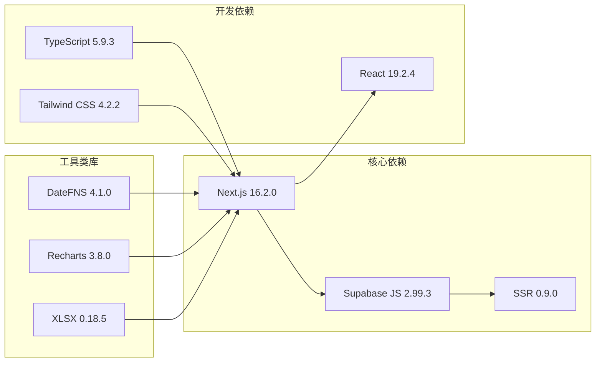

**图表来源**
- [package.json:15-32](file://package.json#L15-L32)

### 内部模块依赖

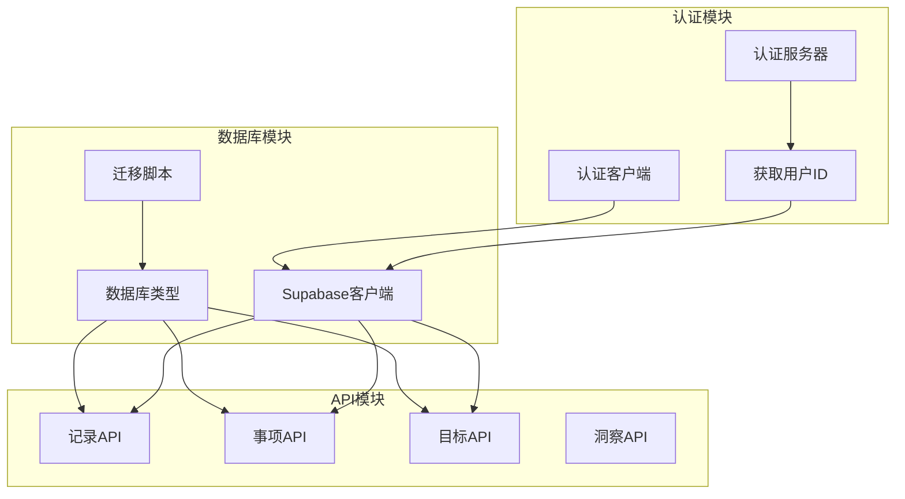

**图表来源**
- [get-current-user-id.ts:1-85](file://src/lib/auth/server/get-current-user-id.ts#L1-L85)
- [client.ts:1-9](file://src/lib/supabase/client.ts#L1-L9)
- [teto.ts:1-516](file://src/types/teto.ts#L1-L516)

**章节来源**
- [package.json:15-42](file://package.json#L15-L42)
- [get-current-user-id.ts:1-85](file://src/lib/auth/server/get-current-user-id.ts#L1-L85)
- [client.ts:1-9](file://src/lib/supabase/client.ts#L1-L9)

## 性能考虑

### 查询性能优化

TETO项目针对不同类型的查询场景实施了专门的优化策略：

#### 高频查询优化

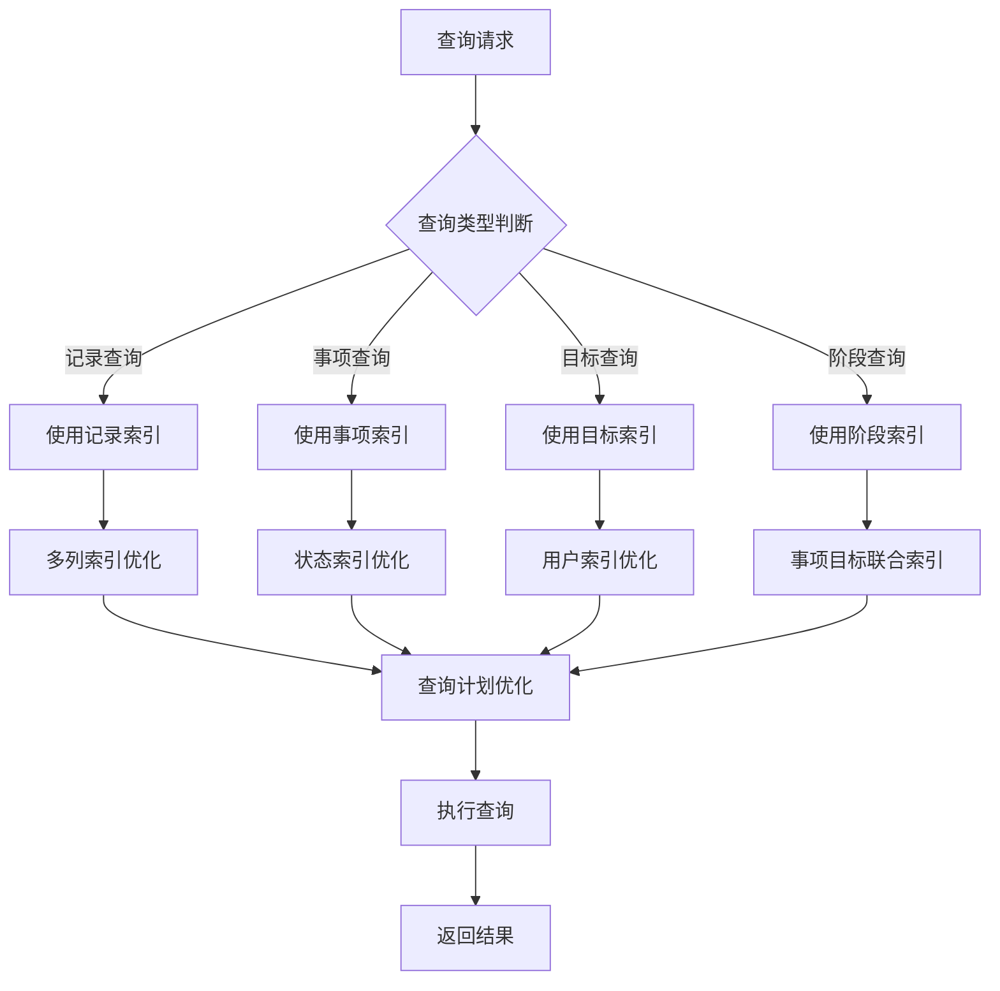

**图表来源**
- [001_teto_1_3_records_model.sql:282-299](file://sql/001_teto_1_3_records_model.sql#L282-L299)
- [003_teto_1_4_phases_and_goals.sql:117-129](file://sql/003_teto_1_4_phases_and_goals.sql#L117-L129)

#### 缓存策略

系统采用多层次缓存策略来提升性能：
- **查询结果缓存**：热点数据缓存
- **会话缓存**：用户会话状态缓存
- **静态资源缓存**：前端静态资源缓存

### 性能监控指标

建议监控以下关键性能指标：

| 指标类别 | 监控指标 | 阈值建议 | 监控频率 |
|----------|----------|----------|----------|
| 数据库连接 | 连接数、连接池利用率 | ≤80% | 实时 |
| 查询性能 | 查询响应时间、慢查询数量 | <1000ms | 每分钟 |
| 系统资源 | CPU使用率、内存使用率 | ≤85% | 每5分钟 |
| 业务指标 | 页面加载时间、API响应时间 | <2000ms | 每小时 |

**章节来源**
- [test-api-performance.js:1-82](file://test/scripts/test-api-performance.js#L1-L82)

## 故障排除指南

### 数据库连接问题排查

#### 连接配置检查清单

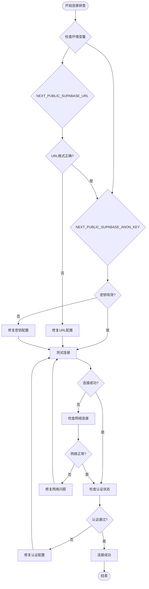

**图表来源**
- [client.ts:4-7](file://src/lib/supabase/client.ts#L4-L7)
- [get-current-user-id.ts:18-36](file://src/lib/auth/server/get-current-user-id.ts#L18-L36)

#### 常见连接问题及解决方案

| 问题类型 | 症状 | 解决方案 |
|----------|------|----------|
| 环境变量缺失 | 应用启动失败 | 检查.env文件配置 |
| URL格式错误 | 连接超时 | 验证Supabase项目URL |
| 密钥过期 | 认证失败 | 重新生成匿名密钥 |
| 网络阻塞 | DNS解析失败 | 检查防火墙设置 |
| 跨域问题 | CORS错误 | 配置Supabase CORS设置 |

**章节来源**
- [client.ts:1-9](file://src/lib/supabase/client.ts#L1-L9)
- [get-current-user-id.ts:12-37](file://src/lib/auth/server/get-current-user-id.ts#L12-L37)

### 查询性能问题诊断

#### 慢查询分析流程

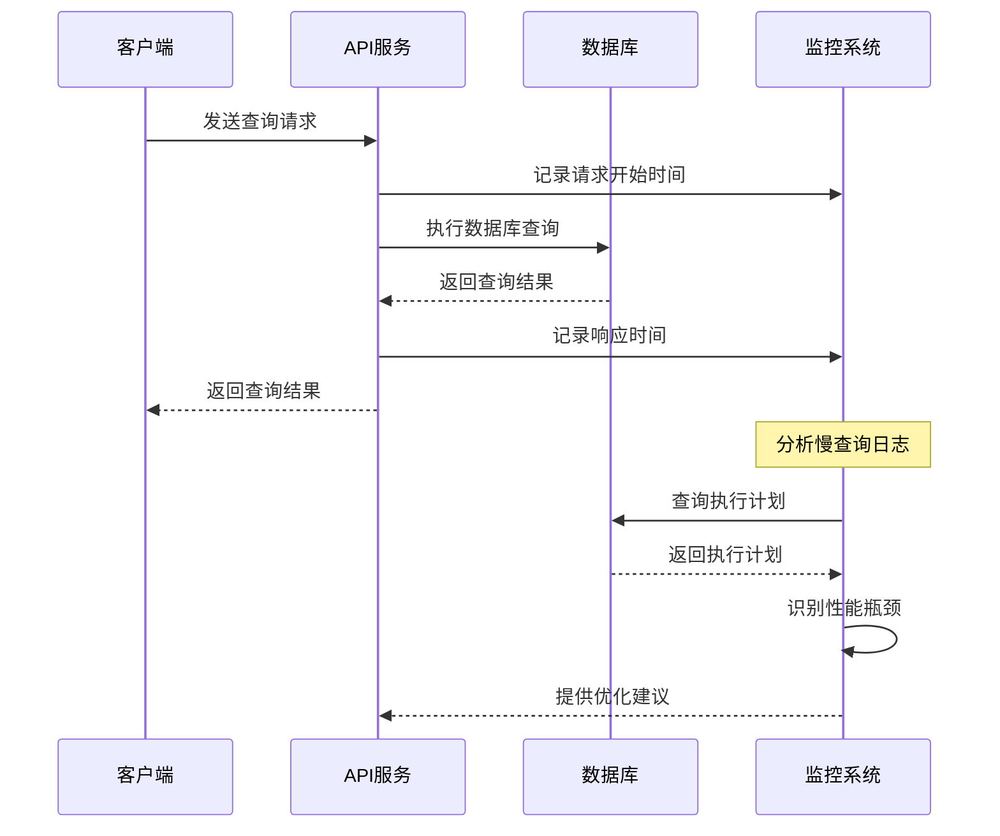

**图表来源**
- [records/route.ts:7-42](file://src/app/api/v2/records/route.ts#L7-L42)
- [test-api-performance.js:47-79](file://test/scripts/test-api-performance.js#L47-L79)

#### 性能优化策略

1. **索引优化**
   - 分析查询模式，创建合适的复合索引
   - 定期重建统计信息
   - 监控索引使用率

2. **查询重写**
   - 使用EXPLAIN ANALYZE分析查询计划
   - 优化WHERE条件和JOIN顺序
   - 减少不必要的SELECT字段

3. **连接池管理**
   - 调整最大连接数
   - 设置合理的超时时间
   - 监控连接池利用率

**章节来源**
- [001_teto_1_3_records_model.sql:282-299](file://sql/001_teto_1_3_records_model.sql#L282-L299)
- [003_teto_1_4_phases_and_goals.sql:117-129](file://sql/003_teto_1_4_phases_and_goals.sql#L117-L129)

### 数据一致性问题排查

#### 数据完整性检查

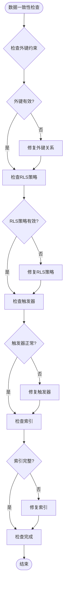

**图表来源**
- [001_teto_1_3_records_model.sql:115-189](file://sql/001_teto_1_3_records_model.sql#L115-L189)
- [003_teto_1_4_phases_and_goals.sql:67-79](file://sql/003_teto_1_4_phases_and_goals.sql#L67-L79)

#### 常见一致性问题

| 问题类型 | 症状 | 诊断方法 | 解决方案 |
|----------|------|----------|----------|
| 外键约束冲突 | 插入/更新失败 | 检查相关表数据 | 清理或修正关联数据 |
| RLS策略失效 | 权限访问异常 | 验证RLS策略状态 | 重新启用或修复策略 |
| 触发器异常 | 数据同步错误 | 检查触发器函数 | 重新创建触发器 |
| 索引损坏 | 查询性能下降 | 分析查询计划 | 重建相关索引 |

**章节来源**
- [001_teto_1_3_records_model.sql:197-276](file://sql/001_teto_1_3_records_model.sql#L197-L276)
- [003_teto_1_4_phases_and_goals.sql:88-111](file://sql/003_teto_1_4_phases_and_goals.sql#L88-L111)

### 事务处理异常处理

#### 事务管理最佳实践

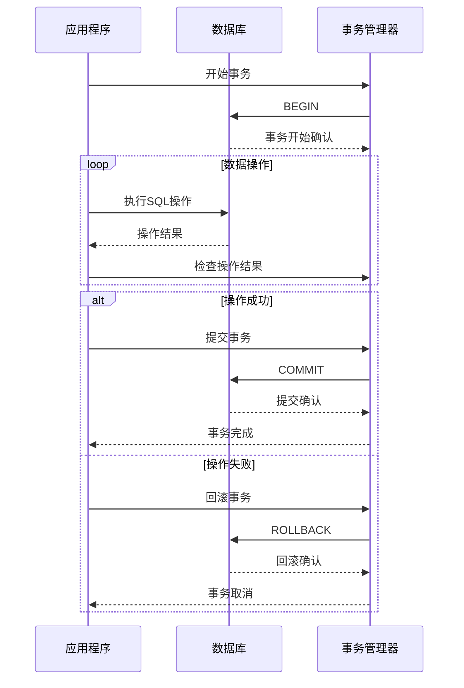

**图表来源**
- [records/route.ts:44-85](file://src/app/api/v2/records/route.ts#L44-L85)

#### 事务异常处理策略

1. **自动重试机制**
   ```javascript
   // 事务重试示例
   let retryCount = 0;
   while (retryCount < MAX_RETRIES) {
       try {
           await executeTransaction();
           break;
       } catch (error) {
           retryCount++;
           if (retryCount >= MAX_RETRIES) {
               throw error;
           }
           await sleep(BACKOFF_DELAY * retryCount);
       }
   }
   ```

2. **死锁检测和预防**
   - 按固定顺序访问表
   - 缩短事务持续时间
   - 使用适当的隔离级别

3. **并发控制**
   - 使用乐观锁机制
   - 实施行级锁定
   - 监控并发冲突

**章节来源**
- [records/route.ts:44-85](file://src/app/api/v2/records/route.ts#L44-L85)

### 数据库迁移失败处理

#### 迁移失败诊断流程

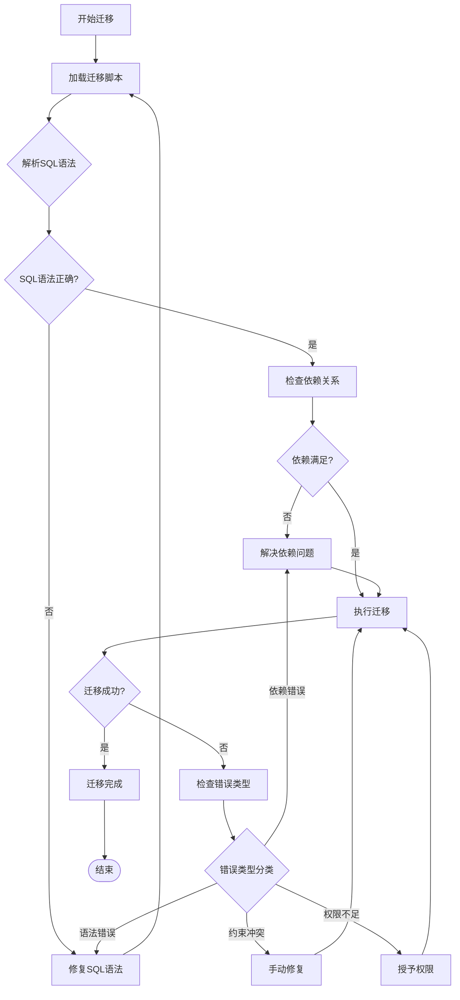

**图表来源**
- [002_drop_chain_structure.sql:1-49](file://sql/002_drop_chain_structure.sql#L1-L49)
- [003_teto_1_4_phases_and_goals.sql:1-130](file://sql/003_teto_1_4_phases_and_goals.sql#L1-L130)

#### 迁移失败常见原因

| 错误类型 | 原因 | 解决方案 |
|----------|------|----------|
| 语法错误 | SQL语句格式问题 | 检查SQL语法，参考标准格式 |
| 依赖冲突 | 表结构依赖关系 | 按正确的执行顺序执行迁移 |
| 权限不足 | 数据库权限限制 | 授予必要的DDL权限 |
| 数据冲突 | 现有数据与新结构冲突 | 备份数据，清理冲突数据 |
| 超时错误 | 迁移时间过长 | 分批执行，优化SQL语句 |

**章节来源**
- [002_drop_chain_structure.sql:1-49](file://sql/002_drop_chain_structure.sql#L1-L49)
- [003_teto_1_4_phases_and_goals.sql:1-130](file://sql/003_teto_1_4_phases_and_goals.sql#L1-L130)

### 数据备份恢复策略

#### 备份策略设计

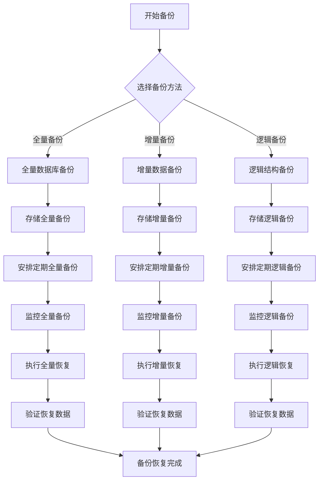

#### 恢复策略

1. **快速恢复**
   - 使用最近的全量备份
   - 应用增量备份到恢复点
   - 验证数据完整性

2. **灾难恢复**
   - 从异地备份恢复
   - 重建数据库实例
   - 重新配置应用程序

3. **数据恢复**
   - 恢复特定表或数据
   - 使用时间点恢复
   - 验证恢复准确性

**章节来源**
- [001_teto_1_3_records_model.sql:1-300](file://sql/001_teto_1_3_records_model.sql#L1-L300)
- [003_teto_1_4_phases_and_goals.sql:1-130](file://sql/003_teto_1_4_phases_and_goals.sql#L1-L130)

### 权限问题诊断

#### RLS策略验证流程

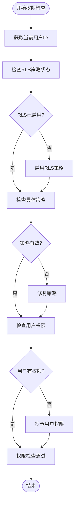

**图表来源**
- [get-current-user-id.ts:18-36](file://src/lib/auth/server/get-current-user-id.ts#L18-L36)
- [001_teto_1_3_records_model.sql:197-276](file://sql/001_teto_1_3_records_model.sql#L197-L276)

#### 权限问题排查清单

| 检查项目 | 检查方法 | 期望结果 |
|----------|----------|----------|
| 用户认证 | 验证用户登录状态 | 用户已登录 |
| RLS策略 | 检查表级RLS状态 | RLS已启用 |
| 访问策略 | 验证SELECT/INSERT权限 | 具备相应权限 |
| 数据范围 | 检查用户数据边界 | 仅访问自身数据 |
| 触发器权限 | 验证触发器执行权限 | 触发器正常工作 |

**章节来源**
- [get-current-user-id.ts:12-37](file://src/lib/auth/server/get-current-user-id.ts#L12-L37)
- [001_teto_1_3_records_model.sql:197-276](file://sql/001_teto_1_3_records_model.sql#L197-L276)

## 结论

TETO项目的数据库架构设计体现了现代Web应用的最佳实践，通过合理的数据模型设计、严格的权限控制和完善的性能优化策略，为用户提供稳定可靠的数据服务。

### 关键优势

1. **安全性**：采用RLS策略确保数据隔离，防止越权访问
2. **性能**：通过索引优化和查询优化提升系统响应速度
3. **可维护性**：模块化的数据库设计便于维护和扩展
4. **可靠性**：完善的错误处理和监控机制保障系统稳定

### 改进建议

1. **监控增强**：部署更详细的数据库性能监控
2. **自动化运维**：建立数据库自动化运维流程
3. **容量规划**：制定数据库容量增长规划
4. **灾备完善**：建立多层级数据备份和恢复机制

通过遵循本指南提供的排查方法和优化策略，可以有效解决TETO项目中的各种数据库问题，确保系统的稳定运行和持续发展。

## 附录

### 常用SQL查询模板

#### 数据一致性检查查询
```sql
-- 检查外键完整性
SELECT COUNT(*) FROM table_name WHERE foreign_key_column IS NOT NULL 
AND foreign_key_column NOT IN (SELECT id FROM referenced_table);

-- 检查重复数据
SELECT column1, column2, COUNT(*) 
FROM table_name 
GROUP BY column1, column2 
HAVING COUNT(*) > 1;

-- 检查NULL值
SELECT COUNT(*) FROM table_name WHERE column_name IS NULL;
```

#### 性能分析查询
```sql
-- 查看慢查询
SELECT query, calls, total_time, mean_time, rows
FROM pg_stat_statements 
ORDER BY total_time DESC 
LIMIT 10;

-- 查看索引使用情况
SELECT schemaname, tablename, relname, idx_tup_read, idx_tup_fetch
FROM pg_stat_user_indexes 
ORDER BY idx_tup_read DESC;
```

### 诊断工具推荐

1. **数据库监控工具**
   - pgAdmin：PostgreSQL管理界面
   - psql：命令行工具
   - 数据库性能监控插件

2. **应用层诊断**
   - 浏览器开发者工具
   - API测试工具
   - 性能分析工具

3. **日志分析**
   - 数据库日志分析
   - 应用程序日志
   - 性能指标收集