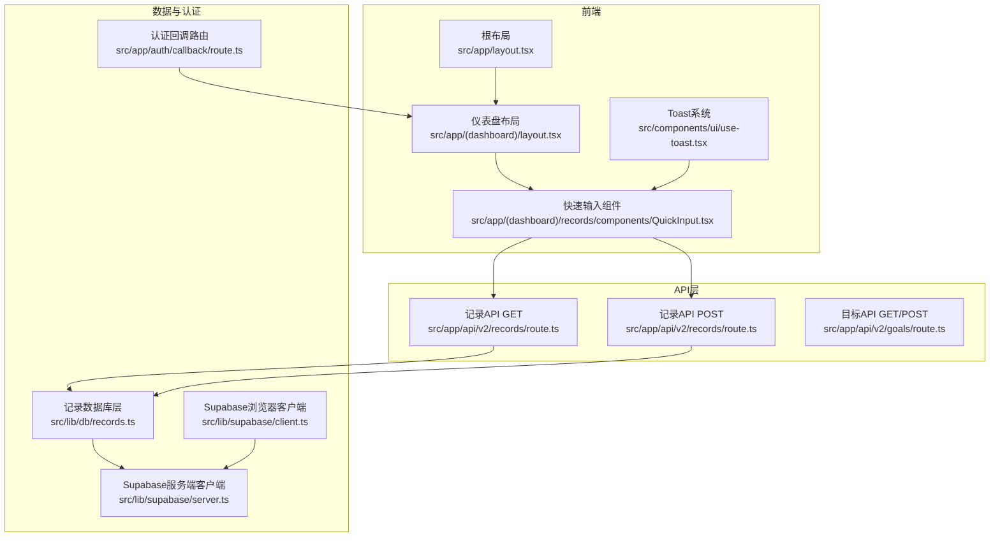
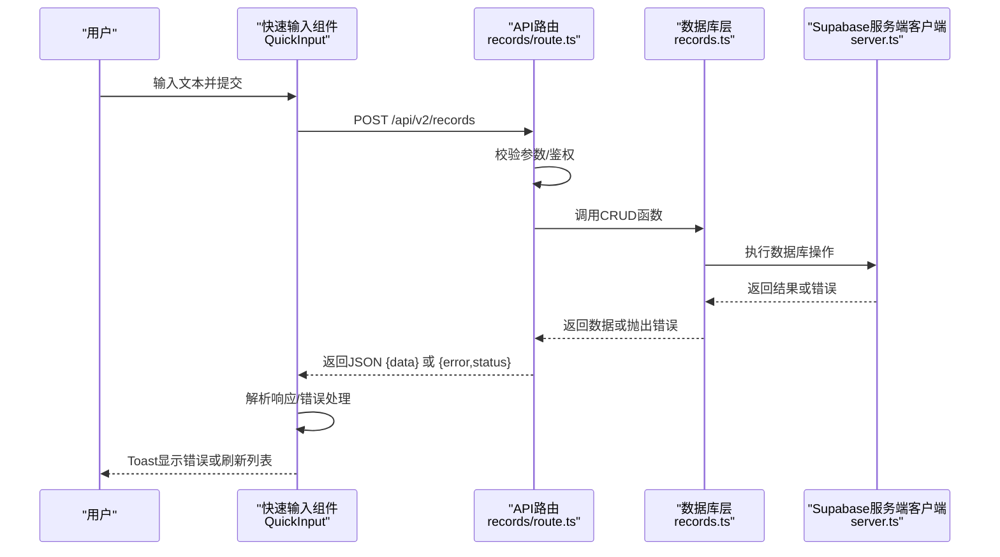
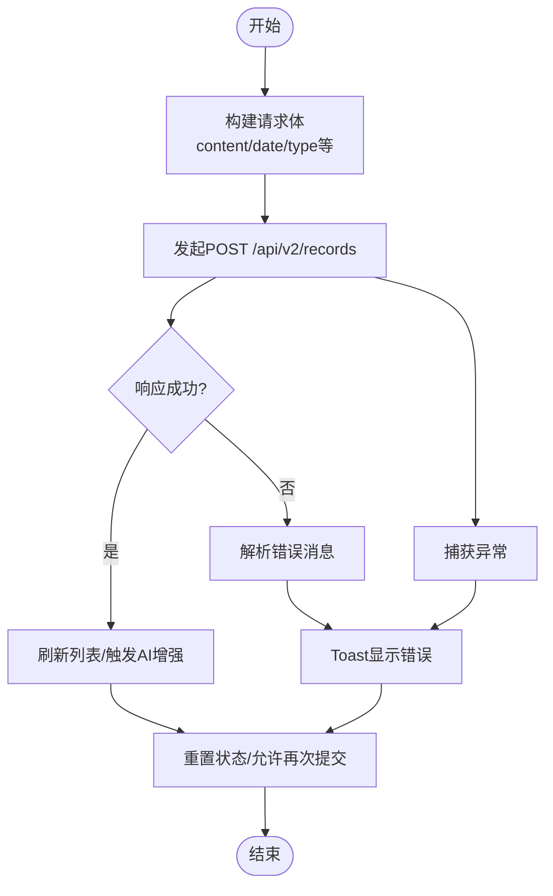
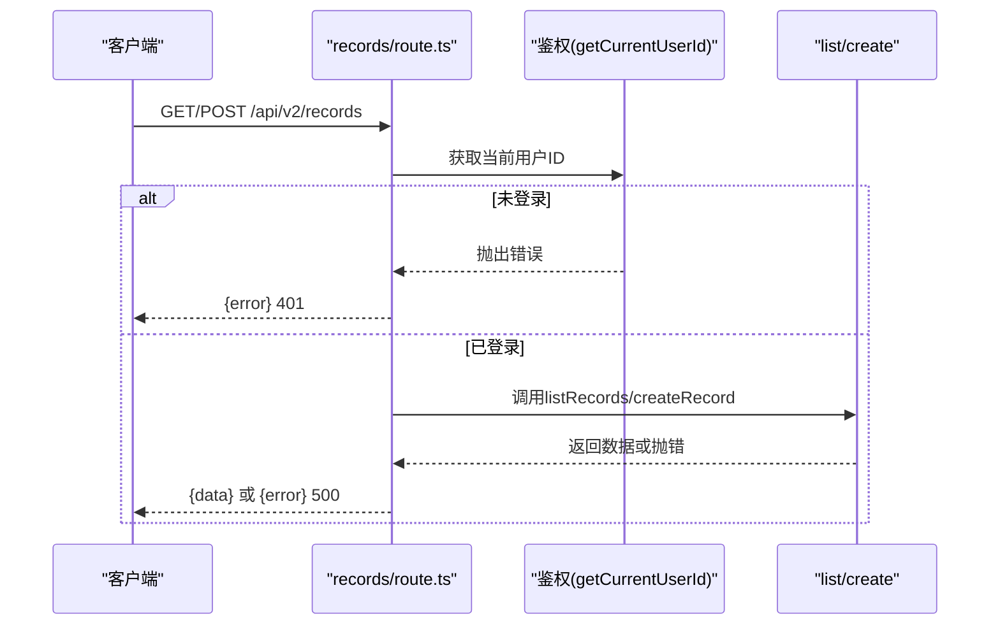
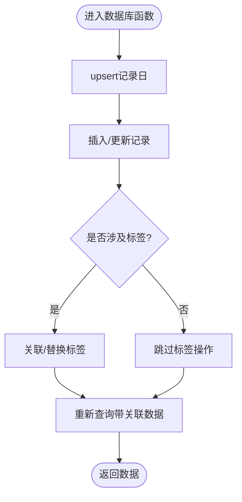
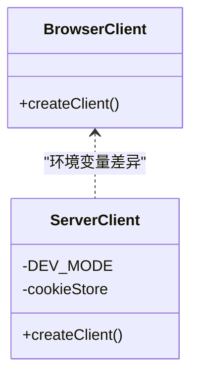
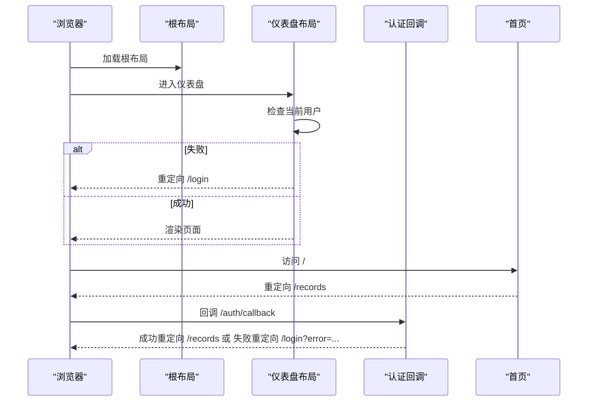
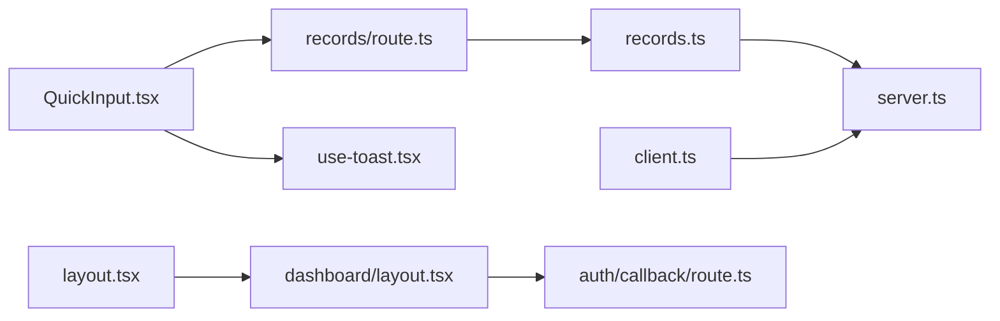

# 运行时错误

<cite>
**本文引用的文件**
- [src/components/ui/use-toast.tsx](file://src/components/ui/use-toast.tsx)
- [src/app/layout.tsx](file://src/app/layout.tsx)
- [src/app/page.tsx](file://src/app/page.tsx)
- [src/app/auth/callback/route.ts](file://src/app/auth/callback/route.ts)
- [src/app/(dashboard)/layout.tsx](file://src/app/(dashboard)/layout.tsx)
- [src/app/(dashboard)/records/components/QuickInput.tsx](file://src/app/(dashboard)/records/components/QuickInput.tsx)
- [src/app/api/v2/records/route.ts](file://src/app/api/v2/records/route.ts)
- [src/app/api/v2/goals/route.ts](file://src/app/api/v2/goals/route.ts)
- [src/lib/supabase/client.ts](file://src/lib/supabase/client.ts)
- [src/lib/supabase/server.ts](file://src/lib/supabase/server.ts)
- [src/lib/db/records.ts](file://src/lib/db/records.ts)
- [src/types/teto.ts](file://src/types/teto.ts)
- [next.config.js](file://next.config.js)
- [package.json](file://package.json)
- [test/scripts/test-api-performance.js](file://test/scripts/test-api-performance.js)
</cite>

## 目录
1. [简介](#简介)
2. [项目结构](#项目结构)
3. [核心组件](#核心组件)
4. [架构总览](#架构总览)
5. [详细组件分析](#详细组件分析)
6. [依赖分析](#依赖分析)
7. [性能注意事项](#性能注意事项)
8. [故障排查指南](#故障排查指南)
9. [结论](#结论)
10. [附录](#附录)

## 简介
本指南聚焦于TETO项目的运行时错误排查，覆盖前端组件错误、API调用异常、状态管理问题与路由跳转错误。文档提供错误边界处理、异常捕获机制与恢复策略，并解释Toast错误提示系统、全局错误处理器配置与用户友好反馈设计。同时包含内存泄漏检测、性能瓶颈识别与资源加载失败的解决方案，以及浏览器开发者工具使用技巧与错误日志分析方法。

## 项目结构
TETO采用Next.js App Router组织页面与API路由，前端UI通过React组件实现，数据访问通过Supabase客户端与数据库层封装完成。关键运行时错误相关模块分布如下：
- 前端布局与根页面：负责全局布局、重定向与认证检查
- API路由：集中处理业务请求、鉴权与错误返回
- 数据库层：封装CRUD与关联查询，统一抛出错误
- Supabase客户端：区分浏览器端与服务端客户端
- 错误提示系统：Toast容器与hook，统一错误展示

图表来源
- [src/app/layout.tsx:1-13](file://src/app/layout.tsx#L1-L13)
- [src/app/(dashboard)/layout.tsx:38-89](file://src/app/(dashboard)/layout.tsx#L38-L89)
- [src/app/(dashboard)/records/components/QuickInput.tsx:670-869](file://src/app/(dashboard)/records/components/QuickInput.tsx#L670-L869)
- [src/app/api/v2/records/route.ts:1-86](file://src/app/api/v2/records/route.ts#L1-L86)
- [src/app/api/v2/goals/route.ts:1-49](file://src/app/api/v2/goals/route.ts#L1-L49)
- [src/lib/db/records.ts:1-200](file://src/lib/db/records.ts#L1-L200)
- [src/lib/supabase/client.ts:1-8](file://src/lib/supabase/client.ts#L1-L8)
- [src/lib/supabase/server.ts:1-35](file://src/lib/supabase/server.ts#L1-L35)
- [src/app/auth/callback/route.ts:1-18](file://src/app/auth/callback/route.ts#L1-L18)
- [src/components/ui/use-toast.tsx:1-69](file://src/components/ui/use-toast.tsx#L1-L69)

章节来源
- [src/app/layout.tsx:1-13](file://src/app/layout.tsx#L1-L13)
- [src/app/(dashboard)/layout.tsx:38-89](file://src/app/(dashboard)/layout.tsx#L38-L89)
- [src/app/(dashboard)/records/components/QuickInput.tsx:670-869](file://src/app/(dashboard)/records/components/QuickInput.tsx#L670-L869)
- [src/app/api/v2/records/route.ts:1-86](file://src/app/api/v2/records/route.ts#L1-L86)
- [src/app/api/v2/goals/route.ts:1-49](file://src/app/api/v2/goals/route.ts#L1-L49)
- [src/lib/db/records.ts:1-200](file://src/lib/db/records.ts#L1-L200)
- [src/lib/supabase/client.ts:1-8](file://src/lib/supabase/client.ts#L1-L8)
- [src/lib/supabase/server.ts:1-35](file://src/lib/supabase/server.ts#L1-L35)
- [src/app/auth/callback/route.ts:1-18](file://src/app/auth/callback/route.ts#L1-L18)
- [src/components/ui/use-toast.tsx:1-69](file://src/components/ui/use-toast.tsx#L1-L69)

## 核心组件
- Toast错误提示系统：提供统一的错误展示与自动消失机制，支持手动关闭
- 快速输入组件：负责记录创建、拆分提交、错误捕获与用户反馈
- API路由：集中处理鉴权、参数校验、数据库调用与错误返回
- 数据库层：封装CRUD与关联查询，统一抛出错误
- Supabase客户端：区分浏览器端与服务端，确保环境变量与Cookie正确传递
- 全局布局与认证：负责认证检查、重定向与页面加载状态

章节来源
- [src/components/ui/use-toast.tsx:18-34](file://src/components/ui/use-toast.tsx#L18-L34)
- [src/app/(dashboard)/records/components/QuickInput.tsx:670-869](file://src/app/(dashboard)/records/components/QuickInput.tsx#L670-L869)
- [src/app/api/v2/records/route.ts:7-42](file://src/app/api/v2/records/route.ts#L7-L42)
- [src/lib/db/records.ts:11-46](file://src/lib/db/records.ts#L11-L46)
- [src/lib/supabase/client.ts:1-8](file://src/lib/supabase/client.ts#L1-L8)
- [src/lib/supabase/server.ts:1-35](file://src/lib/supabase/server.ts#L1-L35)
- [src/app/(dashboard)/layout.tsx:38-89](file://src/app/(dashboard)/layout.tsx#L38-L89)

## 架构总览
运行时错误贯穿“前端组件 -> API路由 -> 数据库层 -> Supabase”的链路。错误在各层以统一的错误消息与HTTP状态码返回，前端通过Toast与错误提示进行用户反馈。

图表来源
- [src/app/(dashboard)/records/components/QuickInput.tsx:719-744](file://src/app/(dashboard)/records/components/QuickInput.tsx#L719-L744)
- [src/app/api/v2/records/route.ts:44-85](file://src/app/api/v2/records/route.ts#L44-L85)
- [src/lib/db/records.ts:11-46](file://src/lib/db/records.ts#L11-L46)
- [src/lib/supabase/server.ts:6-35](file://src/lib/supabase/server.ts#L6-L35)

## 详细组件分析

### 组件A：快速输入组件（记录创建与错误处理）
- 功能要点
  - 支持普通提交与拆分提交两种路径
  - 拆分提交逐条异步增强AI能力，不影响主流程
  - 统一错误捕获：网络异常、后端错误、参数校验失败
  - 用户反馈：Toast错误提示、按钮禁用、状态重置
- 关键流程
  - 普通提交：构造payload，调用POST /api/v2/records，成功则刷新列表，失败则显示错误
  - 拆分提交：循环逐条提交，每条成功后触发异步AI增强，失败时立即提示
  - 异常兜底：try/catch包裹，确保finally中恢复提交状态
- 错误类型
  - 参数缺失：content/date必填
  - 事项归属校验：item_id不存在或非当前用户
  - 数据库错误：插入/更新失败
  - 网络错误：fetch异常
- 恢复策略
  - 重置输入状态、保持界面可交互
  - 对拆分提交，记录已成功的部分仍刷新列表
  - 对网络错误，建议重试或检查网络

图表来源
- [src/app/(dashboard)/records/components/QuickInput.tsx:670-869](file://src/app/(dashboard)/records/components/QuickInput.tsx#L670-L869)
- [src/app/api/v2/records/route.ts:44-85](file://src/app/api/v2/records/route.ts#L44-L85)

章节来源
- [src/app/(dashboard)/records/components/QuickInput.tsx:670-869](file://src/app/(dashboard)/records/components/QuickInput.tsx#L670-L869)
- [src/app/api/v2/records/route.ts:44-85](file://src/app/api/v2/records/route.ts#L44-L85)

### 组件B：API路由（鉴权、参数校验与错误返回）
- 功能要点
  - GET：解析查询参数，构造RecordsQuery，调用listRecords，统一错误处理
  - POST：校验必填字段，校验事项归属，调用createRecord，统一错误处理
  - 错误分类：401（未登录/获取用户失败）、400（参数错误）、500（其他服务器错误）
- 错误返回格式
  - 成功：{ data: ... }
  - 失败：{ error: string, details?: string }

图表来源
- [src/app/api/v2/records/route.ts:7-42](file://src/app/api/v2/records/route.ts#L7-L42)
- [src/app/api/v2/records/route.ts:44-85](file://src/app/api/v2/records/route.ts#L44-L85)

章节来源
- [src/app/api/v2/records/route.ts:7-42](file://src/app/api/v2/records/route.ts#L7-L42)
- [src/app/api/v2/records/route.ts:44-85](file://src/app/api/v2/records/route.ts#L44-L85)

### 组件C：数据库层（统一错误抛出）
- 功能要点
  - createRecord：自动upsert记录日，创建后关联标签，重新获取带关联数据
  - updateRecord：动态构建更新字段，替换标签关联，重新获取数据
  - listRecords：按条件过滤，附带tags与item，排序返回
  - 统一错误：对每个数据库操作，若error存在则抛出带描述的错误
- 复杂度与性能
  - create/update：O(1)写入，标签关联与二次查询为额外开销
  - list：多表关联查询，注意索引与limit控制

图表来源
- [src/lib/db/records.ts:11-46](file://src/lib/db/records.ts#L11-L46)
- [src/lib/db/records.ts:52-111](file://src/lib/db/records.ts#L52-L111)
- [src/lib/db/records.ts:176-200](file://src/lib/db/records.ts#L176-L200)

章节来源
- [src/lib/db/records.ts:11-46](file://src/lib/db/records.ts#L11-L46)
- [src/lib/db/records.ts:52-111](file://src/lib/db/records.ts#L52-L111)
- [src/lib/db/records.ts:176-200](file://src/lib/db/records.ts#L176-L200)

### 组件D：Supabase客户端（浏览器端与服务端）
- 功能要点
  - 浏览器端：通过@supabase/ssr创建客户端，读取NEXT_PUBLIC环境变量
  - 服务端：通过cookies读取会话，开发模式下可使用服务角色密钥绕过RLS
- 错误处理
  - cookies设置异常时静默处理，避免影响主流程
  - 环境变量缺失会导致连接失败，需在部署时配置

图表来源
- [src/lib/supabase/client.ts:1-8](file://src/lib/supabase/client.ts#L1-L8)
- [src/lib/supabase/server.ts:1-35](file://src/lib/supabase/server.ts#L1-L35)

章节来源
- [src/lib/supabase/client.ts:1-8](file://src/lib/supabase/client.ts#L1-L8)
- [src/lib/supabase/server.ts:1-35](file://src/lib/supabase/server.ts#L1-L35)

### 组件E：全局布局与认证（路由跳转与加载状态）
- 功能要点
  - 根布局：全局样式引入
  - 仪表盘布局：认证检查失败时重定向至登录页
  - 首页：重定向至/records
  - 登录回调：成功后重定向至/records，失败重定向至/login?error=...
- 错误类型
  - 认证失败：检查当前用户异常
  - 回调失败：授权码无效或交换失败

图表来源
- [src/app/layout.tsx:1-13](file://src/app/layout.tsx#L1-L13)
- [src/app/(dashboard)/layout.tsx:38-89](file://src/app/(dashboard)/layout.tsx#L38-L89)
- [src/app/page.tsx:1-5](file://src/app/page.tsx#L1-L5)
- [src/app/auth/callback/route.ts:1-18](file://src/app/auth/callback/route.ts#L1-L18)

章节来源
- [src/app/layout.tsx:1-13](file://src/app/layout.tsx#L1-L13)
- [src/app/(dashboard)/layout.tsx:38-89](file://src/app/(dashboard)/layout.tsx#L38-L89)
- [src/app/page.tsx:1-5](file://src/app/page.tsx#L1-L5)
- [src/app/auth/callback/route.ts:1-18](file://src/app/auth/callback/route.ts#L1-L18)

## 依赖分析
- 前端依赖
  - Next.js、React、TailwindCSS、Lucide React、Recharts、Supabase SSR
- 运行时错误相关耦合
  - QuickInput依赖API路由与Toast系统
  - API路由依赖鉴权与数据库层
  - 数据库层依赖Supabase服务端客户端
  - 布局与认证影响路由跳转与页面可见性

图表来源
- [src/app/(dashboard)/records/components/QuickInput.tsx:670-869](file://src/app/(dashboard)/records/components/QuickInput.tsx#L670-L869)
- [src/app/api/v2/records/route.ts:1-86](file://src/app/api/v2/records/route.ts#L1-L86)
- [src/lib/db/records.ts:1-200](file://src/lib/db/records.ts#L1-L200)
- [src/lib/supabase/server.ts:1-35](file://src/lib/supabase/server.ts#L1-L35)
- [src/lib/supabase/client.ts:1-8](file://src/lib/supabase/client.ts#L1-L8)
- [src/components/ui/use-toast.tsx:1-69](file://src/components/ui/use-toast.tsx#L1-L69)
- [src/app/(dashboard)/layout.tsx:38-89](file://src/app/(dashboard)/layout.tsx#L38-L89)
- [src/app/auth/callback/route.ts:1-18](file://src/app/auth/callback/route.ts#L1-L18)
- [src/app/layout.tsx:1-13](file://src/app/layout.tsx#L1-L13)

章节来源
- [package.json:15-32](file://package.json#L15-L32)
- [next.config.js:1-4](file://next.config.js#L1-L4)

## 性能注意事项
- API性能测试脚本
  - 使用test/scripts/test-api-performance.js对单个API进行多次请求取平均耗时与最慢耗时，超过阈值给出警告
  - 建议关注超时（>1000ms）与严重超时（>2000ms）的接口，定位数据库查询或网络问题
- 前端性能
  - 避免在渲染过程中执行昂贵计算；拆分提交时仅等待必要请求
  - 合理使用缓存与批量操作，减少重复请求
- 数据库层
  - 使用limit限制返回数量，避免全表扫描
  - 确保常用查询字段建立索引（如user_id、date、item_id）

章节来源
- [test/scripts/test-api-performance.js:46-82](file://test/scripts/test-api-performance.js#L46-L82)
- [src/lib/db/records.ts:176-200](file://src/lib/db/records.ts#L176-L200)

## 故障排查指南

### 前端组件错误
- 症状
  - 提交按钮无响应、输入框无法清空、拆分提交中断
- 排查步骤
  - 检查QuickInput中的handleSubmit逻辑与错误分支
  - 确认fetch请求头与body构造正确
  - 查看Toast是否被触发及消息内容
- 恢复策略
  - 在catch中统一调用onError并恢复提交状态
  - 对拆分提交，记录已成功的部分仍刷新列表

章节来源
- [src/app/(dashboard)/records/components/QuickInput.tsx:670-869](file://src/app/(dashboard)/records/components/QuickInput.tsx#L670-L869)

### API调用异常
- 症状
  - 控制台出现Network错误、后端返回{error}、状态码4xx/5xx
- 排查步骤
  - 检查API路由的try/catch与错误分类
  - 确认鉴权中间件返回的用户ID与数据库权限一致
  - 校验请求体字段与类型定义
- 恢复策略
  - 对401：引导用户重新登录
  - 对400：提示必填字段缺失或格式错误
  - 对500：记录错误日志并提示稍后重试

章节来源
- [src/app/api/v2/records/route.ts:7-42](file://src/app/api/v2/records/route.ts#L7-L42)
- [src/app/api/v2/records/route.ts:44-85](file://src/app/api/v2/records/route.ts#L44-L85)
- [src/types/teto.ts:133-162](file://src/types/teto.ts#L133-L162)

### 状态管理问题
- 症状
  - 页面加载空白、认证状态不一致、路由跳转异常
- 排查步骤
  - 检查仪表盘布局的认证检查与重定向逻辑
  - 确认cookies在服务端客户端中的读写
- 恢复策略
  - 认证失败时重定向至登录页
  - 服务端cookies设置异常时降级处理

章节来源
- [src/app/(dashboard)/layout.tsx:38-89](file://src/app/(dashboard)/layout.tsx#L38-L89)
- [src/lib/supabase/server.ts:20-33](file://src/lib/supabase/server.ts#L20-L33)

### 路由跳转错误
- 症状
  - 首页重定向异常、登录回调失败
- 排查步骤
  - 检查首页redirect逻辑
  - 检查回调路由的授权码交换与重定向
- 恢复策略
  - 成功后重定向至/records
  - 失败时携带错误参数重定向至/login

章节来源
- [src/app/page.tsx:1-5](file://src/app/page.tsx#L1-L5)
- [src/app/auth/callback/route.ts:1-18](file://src/app/auth/callback/route.ts#L1-L18)

### 错误边界处理与异常捕获
- 错误边界
  - 建议在仪表盘布局外层增加错误边界组件，捕获子树异常并显示降级UI
- 异常捕获
  - 前端：QuickInput中对fetch与AI增强调用进行try/catch
  - 后端：API路由中对鉴权与数据库操作进行try/catch
- 恢复策略
  - 清理临时状态、恢复交互、提示用户重试

章节来源
- [src/app/(dashboard)/records/components/QuickInput.tsx:739-744](file://src/app/(dashboard)/records/components/QuickInput.tsx#L739-L744)
- [src/app/api/v2/records/route.ts:35-41](file://src/app/api/v2/records/route.ts#L35-L41)

### Toast错误提示系统
- 使用方式
  - 在组件中调用useToast的showError显示错误
  - 在根组件挂载ToastContainer统一渲染
- 设计原则
  - 自动消失（默认3秒）、可手动关闭
  - 位置固定在页面顶部中央，避免遮挡主要内容
- 建议
  - 错误消息简洁明确，必要时提供重试入口

章节来源
- [src/components/ui/use-toast.tsx:18-34](file://src/components/ui/use-toast.tsx#L18-L34)
- [src/components/ui/use-toast.tsx:40-68](file://src/components/ui/use-toast.tsx#L40-L68)

### 全局错误处理器配置
- 建议
  - 在应用根部引入错误边界组件，捕获未处理异常
  - 在API层统一返回{error}结构，便于前端一致化处理
  - 在开发环境开启严格模式与日志输出，生产环境收集结构化错误日志

章节来源
- [src/app/api/v2/records/route.ts:35-41](file://src/app/api/v2/records/route.ts#L35-L41)
- [src/app/api/v2/goals/route.ts:21-27](file://src/app/api/v2/goals/route.ts#L21-L27)

### 内存泄漏检测
- 常见场景
  - 未清理的定时器、事件监听器、订阅
  - 组件卸载后仍持有对DOM或全局对象的引用
- 检测方法
  - 使用浏览器性能面板监控内存增长
  - 使用React DevTools Profiler查看组件重渲染热点
- 预防措施
  - 在effect的cleanup中移除监听与取消订阅
  - 避免在组件外长期持有组件实例

[本节为通用指导，无需特定文件来源]

### 性能瓶颈识别
- 方法
  - 使用Performance面板记录关键路径（首次绘制、最大内容绘制）
  - 使用Lighthouse生成性能报告
  - 使用test/scripts/test-api-performance.js对关键API进行压力测试
- 关注点
  - 首屏渲染时间、API响应时间、数据库查询耗时
  - 避免不必要的重渲染与重复请求

章节来源
- [test/scripts/test-api-performance.js:46-82](file://test/scripts/test-api-performance.js#L46-L82)

### 资源加载失败
- 症状
  - 图片/字体/脚本加载失败、样式闪烁
- 排查步骤
  - 检查静态资源路径与CDN配置
  - 检查环境变量是否正确注入
- 恢复策略
  - 提供降级资源或占位符
  - 在开发环境允许跨域（参考next.config.js）

章节来源
- [next.config.js:1-4](file://next.config.js#L1-L4)

### 浏览器开发者工具使用技巧
- Console
  - 过滤错误日志，结合堆栈定位具体调用链
- Network
  - 查看请求头、响应体、状态码与耗时
- Performance/Profiling
  - 分析主线程阻塞、重排重绘与长任务
- Application/Storage
  - 检查Cookies、Local Storage与缓存命中情况

[本节为通用指导，无需特定文件来源]

### 错误日志分析方法
- 结构化日志
  - 记录时间戳、用户ID、请求ID、错误类型、堆栈信息
- 分类统计
  - 统计4xx/5xx占比、高频错误与触发路径
- 回放与验证
  - 基于日志重现问题，验证修复方案

[本节为通用指导，无需特定文件来源]

## 结论
TETO项目的运行时错误处理以“前端统一提示 + API统一返回 + 数据库统一错误”为核心，配合认证与路由跳转的健壮性保障，能够有效提升用户体验与系统稳定性。建议持续完善错误边界、性能监控与日志体系，形成闭环的质量保障。

## 附录
- 关键类型定义参考：CreateRecordPayload、UpdateRecordPayload、RecordsQuery、ApiError等
- 环境配置：NEXT_PUBLIC_SUPABASE_URL、NEXT_PUBLIC_SUPABASE_ANON_KEY、SUPABASE_SERVICE_ROLE_KEY、NEXT_PUBLIC_DEV_MODE
- 开发工具：Next.js、React、TailwindCSS、Supabase SSR、Lucide React、Recharts

章节来源
- [src/types/teto.ts:133-162](file://src/types/teto.ts#L133-L162)
- [src/types/teto.ts:235-245](file://src/types/teto.ts#L235-L245)
- [src/types/teto.ts:270-273](file://src/types/teto.ts#L270-L273)
- [src/lib/supabase/client.ts:4-7](file://src/lib/supabase/client.ts#L4-L7)
- [src/lib/supabase/server.ts:4-15](file://src/lib/supabase/server.ts#L4-L15)
- [next.config.js:1-4](file://next.config.js#L1-L4)